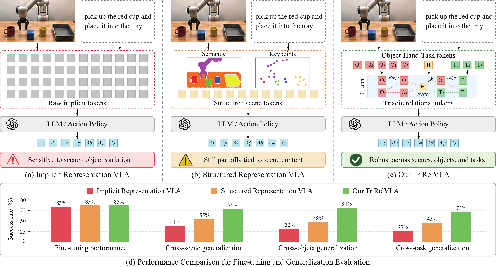
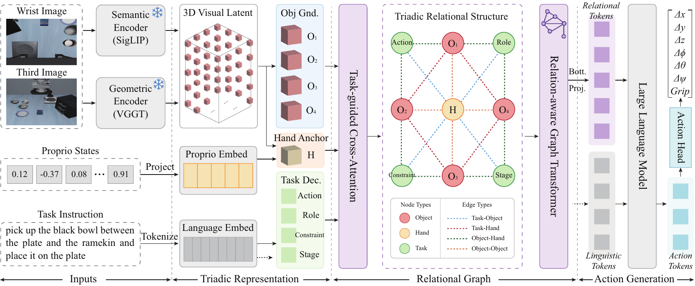

# TriRelVLA: Triadic Relational Structure for Generalizable Embodied Manipulation

## 基本信息

- **arXiv:** 2605.05714
- **Authors:** Hanyu Zhou, Chuanhao Ma, Gim Hee Lee
- **Categories:** cs.CV, cs.RO
- **一句话结论:** 通过显式构建物体-手部-任务三元关系瓶颈，将动作预测从纠缠的视觉外观统计中解耦，在真实世界的跨场景、跨物体、跨任务泛化上取得显著提升。

## 研究问题

本文解决的核心问题是：**现有视觉-语言-动作（VLA）模型的中间表征缺乏动作相关的结构化关系推理，导致策略对未见场景与物体的视觉变化过度敏感。**

具体而言，现有VLA通常采用隐式密集视觉token（如OpenVLA、Octo），将物体外观、背景纹理与场景布局纠缠在一起；近期结构化VLA（如CogVLA、SemanticVLA）虽引入物体化中间表征，但这些表征主要服务于场景语义理解，而非捕捉“任务要求-机器人状态-物体属性”之间的动作中心关系。因此，动作预测仍部分绑定于视觉外观统计，跨任务组合泛化受限。本文与Embodied AI和VLA领域直接相关，其核心目标是将动作决策的本质驱动力——**物体-手部-任务交互关系**——显式引入VLA框架，作为感知与控制之间的可迁移瓶颈。

## 任务与挑战

**具体任务:** 语言指令驱动的单臂机器人操作（如抓取、放置、推动、开关抽屉等）。

**输入输出:**
- **输入:** 多视角图像（腕部视角+第三视角）、自然语言指令、机器人本体状态（proprioception）。
- **输出:** 末端执行器动作参数 $\hat{\mathbf{a}}$，通常包含位移 $\Delta x, \Delta y, \Delta z$、旋转 $\Delta \phi, \Delta \theta, \Delta \psi$ 与夹爪状态 $G$。

**训练/评测设定:**
- **三阶段训练:** 1) 在OXE大规模数据集上进行多模态对齐（仅动作监督）；2) 在DROID真实世界数据集上进行关系结构建模（完整监督，冻结编码器与LLM）；3) 在LIBERO（仿真）与CSOT-Bench（真实世界，自建）上进行任务微调（LLM使用LoRA）。
- **评测维度:** Fine-tuning任务成功率，以及zero-shot跨场景（cross-scene）、跨物体（cross-object）、跨任务（cross-task）泛化成功率。

**核心挑战:**
1. **解耦提取:** 如何从多模态输入中稳定提取与外观解耦的物体、手部、任务原语；
2. **关系建模:** 如何显式编码物体-手部-任务之间的几何与语义交互，而非依赖隐式注意力；
3. **紧凑对齐:** 如何将高维关系结构压缩为紧凑瓶颈，并有效对齐到LLM的嵌入空间以驱动动作生成。

## 核心 Insight

机器人操作的动作决策本质上由**物体属性、手部状态、任务要求**三者之间的交互关系决定，而非孤立的视觉外观。现有VLA的“视觉→动作”端到端映射将外观统计与动作统计纠缠；TriRelVLA将其替换为**“视觉→关系原语→关系图→瓶颈→动作”**的解耦流程。通过将三元关系显式提取为中间瓶颈表征，动作预测得以过滤冗余场景因素（如背景、纹理、光照），仅依赖紧凑且可迁移的关系状态。

上图直观展示了这一范式跃迁：隐式VLA（左）使用密集原始token，对场景变化敏感；结构化VLA（中）使用语义/关键点token，仍部分绑定场景内容；TriRelVLA（右）通过物体-手部-任务关系图（Object-Hand-Task Graph）将动作决策锚定在关系结构上。下方性能摘要显示，三者在fine-tuning上接近（83%–85%），但在跨场景（41% vs. 79%）、跨物体（32% vs. 48%）、跨任务（27% vs. 73%）泛化上，TriRelVLA实现了对隐式与结构化基线的显著超越。

## 方法与公式

TriRelVLA的整体流程分为三个递进阶段，如下图所示：

### 阶段一：多模态嵌入与三元表征提取

首先，SigLIP提取多视角语义特征 $\mathbf{F}_{sem}$，VGGT（DINOv2）提取3D几何特征 $\mathbf{F}_{geo}$，二者融合为统一的3D视觉潜变量 $\mathbf{F}_v$；文本编码为语言潜变量 $\mathbf{F}_l$；本体状态经投影得到 $\mathbf{F}_p = \operatorname{Proj}_p(\mathbf{p})$。

随后，通过三个专用算子提取关系原语：

$$
\begin{aligned}
\mathbf{Z}_o = \operatorname{Ground}(\mathbf{F}_v), \quad
\mathbf{Z}_h = \operatorname{Anchor}(\mathbf{F}_v, \mathbf{F}_p), \quad
\mathbf{Z}_t = \operatorname{Decomp}(\mathbf{F}_l),
\end{aligned}
$$

其中：
- $\mathbf{Z}_o$ 为**物体token**：使用可学习查询 $\mathbf{Q}_o$ 与 $\mathbf{F}_v$ 做交叉注意力，聚合物体中心证据：
  $$
  \tilde{\mathbf{Q}}_o = \mathbf{Q}_o \mathbf{W}_q^o,\quad \tilde{\mathbf{K}}_o = \mathbf{F}_v \mathbf{W}_k^o,\quad \tilde{\mathbf{V}}_o = \mathbf{F}_v \mathbf{W}_v^o,
  $$
  $$
  \mathbf{Z}_o = \operatorname{Softmax}\left(\frac{\tilde{\mathbf{Q}}_o \tilde{\mathbf{K}}_o^\top}{\sqrt{d}}\right)\tilde{\mathbf{V}}_o.
  $$
  这里 $\mathbf{W}_q^o, \mathbf{W}_k^o, \mathbf{W}_v^o$ 为投影矩阵，$d$ 为维度。

- $\mathbf{Z}_h$ 为**手部token**：以本体感觉嵌入 $\mathbf{F}_p$ 为查询锚定视觉特征，聚合手部中心证据：
  $$
  \tilde{\mathbf{Q}}_h = \mathbf{F}_p \mathbf{W}_q^h, \quad \tilde{\mathbf{K}}_h = \mathbf{F}_v \mathbf{W}_k^h, \quad \tilde{\mathbf{V}}_h = \mathbf{F}_v \mathbf{W}_v^h,
  $$
  $$
  \mathbf{Z}_h = \operatorname{Softmax}\left(\frac{\tilde{\mathbf{Q}}_h \tilde{\mathbf{K}}_h^\top}{\sqrt{d}}\right)\tilde{\mathbf{V}}_h.
  $$
  该设计使手部表征在遮挡或视角变化下仍能通过本体感觉稳定定位。

- $\mathbf{Z}_t$ 为**任务token**：将语言潜变量分解为action、role、constraint、stage四个类别，用四个可学习查询分别做注意力后拼接：
  $$
  \tilde{\mathbf{F}}_l = \mathbf{F}_l \mathbf{W}_t, \quad \boldsymbol{\alpha}^{m} = \operatorname{Softmax}\left(\frac{\mathbf{q}_t^{m} \tilde{\mathbf{F}}_l^{\top}}{\sqrt{d_t}}\right), \quad \mathbf{z}_t^{m} = \boldsymbol{\alpha}^{m} \tilde{\mathbf{F}}_l,
  $$
  其中 $m \in \{\text{act}, \text{role}, \text{con}, \text{stage}\}$，$\mathbf{q}_t^{m}$ 为第 $m$ 类的可学习查询。最终：
  $$
  \mathbf{Z}_t = [\mathbf{z}_t^\text{act} \parallel \mathbf{z}_t^\text{role} \parallel \mathbf{z}_t^\text{con} \parallel \mathbf{z}_t^\text{stage}].
  $$

### 阶段二：任务导向的关系图构建与更新

将三元表征转化为图节点与边，显式建模交互：

$$
\begin{aligned}
\mathcal{V} = \operatorname{CAtt}([\mathbf{Z}_o \parallel \mathbf{Z}_h \parallel \mathbf{Z}_t]), \quad
\mathcal{E} = \{ \mathbf{e}_{ij} \mid \mathbf{v}_i, \mathbf{v}_j \in \mathcal{V}, i \neq j \}, \quad
\hat{\mathcal{V}} = \operatorname{GraphTrans}(\mathcal{V}, \mathcal{E}),
\end{aligned}
$$

**节点构建（Task-Guided Cross-Attention）：** 将任务上下文注入物体与手部token，形成任务 grounded 节点：
$$
\mathbf{Q}_o^n = \mathbf{Z}_o \mathbf{W}_{q,o}^n, \quad \mathbf{Q}_h^n = \mathbf{Z}_h \mathbf{W}_{q,h}^n, \quad \mathbf{K}_t^n = \mathbf{Z}_t \mathbf{W}_{k,t}^n, \quad \mathbf{V}_t^n = \mathbf{Z}_t \mathbf{W}_{v,t}^n,
$$
$$
\tilde{\mathbf{Z}}_o = \mathbf{Z}_o + \operatorname{Softmax}\left(\frac{\mathbf{Q}_o^n (\mathbf{K}_t^n)^\top}{\sqrt{d}}\right)\mathbf{V}_t^n, \quad
\tilde{\mathbf{Z}}_h = \mathbf{Z}_h + \operatorname{Softmax}\left(\frac{\mathbf{Q}_h^n (\mathbf{K}_t^n)^\top}{\sqrt{d}}\right)\mathbf{V}_t^n.
$$
节点集为 $\mathcal{V} = [\tilde{\mathbf{Z}}_o \parallel \tilde{\mathbf{Z}}_h \parallel \mathbf{Z}_t]$。

**边构建：** 定义四种关系边，分别编码语义依赖与几何交互：
- **Task-Object / Task-Hand（语义依赖）：**
  $$
  \mathbf{e}_{to} = \phi_{to}([\mathbf{Z}_{t}; \tilde{\mathbf{Z}}_{o}]), \quad \mathbf{e}_{th} = \phi_{th}([\mathbf{Z}_{t}; \tilde{\mathbf{Z}}_{h}]).
  $$
- **Object-Hand / Object-Object（几何交互）：**
  $$
  \mathbf{e}_{oh} = \phi_{oh}([\tilde{\mathbf{Z}}_{h}; \tilde{\mathbf{Z}}_{o}; \Delta \mathbf{p}_{oh}; \Delta \mathbf{R}_{oh}; d_{oh}; s_{oh}]),
  $$
  $$
  \mathbf{e}_{oo} = \phi_{oo}([\tilde{\mathbf{Z}}_{o,i}; \tilde{\mathbf{Z}}_{o,j}; \Delta \mathbf{p}_{i,j}; \Delta \mathbf{R}_{i,j}; d_{i,j}]).
  $$
  其中 $\Delta \mathbf{p}, \Delta \mathbf{R}, d, s$ 分别表示相对位置、相对姿态、距离、接触/可达性分数；$\phi$ 为关系特定编码器（MLP）。

**关系感知图Transformer（Relation-Aware Graph Transformer）：** 在标准注意力中注入边特征 $\mathbf{r}_{ij}$，使节点更新同时依赖特征相似度与显式关系：
$$
\mathbf{q}_i = \mathbf{W}_q^g \mathbf{v}_i, \quad \mathbf{k}_j = \mathbf{W}_k^g \mathbf{v}_j, \quad \mathbf{v}_j^{g} = \mathbf{W}_v^g \mathbf{v}_j, \quad \mathbf{r}_{ij} = \mathbf{W}_r^g \mathbf{e}_{ij},
$$
$$
\alpha_{ij} = \operatorname{Softmax}_{j}\left(\frac{\mathbf{q}_i(\mathbf{k}_j+\mathbf{r}_{ij})^\top}{\sqrt{d}}\right), \quad
\hat{\mathbf{v}}_i = \mathbf{v}_i + \sum\nolimits_{j \in \mathcal{N}(i)} \alpha_{ij}(\mathbf{v}_j^{g}+\mathbf{r}_{ij}).
$$
输出为关系增强节点集 $\hat{\mathcal{V}} = \{\hat{\mathbf{v}}_i\}$。

### 阶段三：关系瓶颈压缩与条件动作生成

为避免将冗余节点直接送入LLM，使用 $K$ 个可学习查询对 $\hat{\mathcal{V}}$ 做重要性加权聚合，压缩为 $K$ 个瓶颈token $\mathbf{R}$：

$$
\alpha_{k,i} = \operatorname{Softmax}_{i}\left(\mathbf{w}_{k}^{\top}\hat{\mathbf{v}}_i\right), \quad
\mathbf{r}_{k} = \sum\nolimits_{i=1}^{|\hat{\mathcal{V}}|} \alpha_{k,i}\hat{\mathbf{v}}_i, \quad
\mathbf{R} = [\mathbf{r}_{1} \parallel \mathbf{r}_{2} \parallel \cdots \parallel \mathbf{r}_{K}].
$$

随后投影到语言嵌入空间：$\mathbf{X}_r = \operatorname{MLP}(\mathbf{R})$，与语言token $\mathbf{X}_l$ 拼接后输入Qwen3-4B LLM，最终经动作头输出：
$$
\hat{\mathbf{a}} = \mathcal{H}(\operatorname{LLM}([\mathbf{X}_l \parallel \mathbf{X}_r])).
$$

### 训练目标

总损失包含动作监督与辅助对齐约束：
$$
\mathcal{L}_{act} = \|\hat{\mathbf{a}} - \mathbf{a}\|_1, \quad \mathcal{L}_{obj} = \operatorname{BCE}(\mathbf{A}_o, \mathbf{M}_o), \quad \mathcal{L}_{hand} = \operatorname{BCE}(\mathbf{A}_h, \mathbf{M}_h),
$$
$$
\mathcal{L}_{total} = \mathcal{L}_{act} + \lambda_o\mathcal{L}_{obj} + \lambda_h\mathcal{L}_{hand}.
$$
其中 $\mathbf{A}_o, \mathbf{A}_h$ 为物体与手部的注意力图，$\mathbf{M}_o, \mathbf{M}_h$ 为对应区域掩码；辅助损失用于稳定三元表征对齐，防止token漂移。

## 贡献拆解

1. **物体-手部-任务三元关系原语（Triadic Primitives）**
   - **做了什么:** 首次将VLA的中间表征从“隐式视觉token”或“纯语义场景token”推进到显式解耦的物体、手部、任务三类关系原语，并将任务语言分解为action/role/constraint/stage四个结构化子token。
   - **为什么有效:** 动作决策的核心驱动力被显式暴露，使模型得以学习“关系状态→动作”的映射，而非“外观统计→动作”的虚假相关。
   - **与已有方法差别:** OpenVLA等隐式方法无结构化中间层；SemanticVLA/CogVLA等虽结构化，但聚焦场景语义而非动作中心的三元交互。

2. **任务 grounded 关系图与关系感知图Transformer**
   - **做了什么:** 定义task-object、task-hand、object-hand、object-object四种边，在图Transformer中将边特征 $\mathbf{r}_{ij}$ 同时注入注意力权重与值聚合。
   - **为什么有效:** 显式编码了几何（位置、姿态、接触）与语义（任务依赖）交互，提供了可解释且可迁移的结构化推理基础。
   - **与已有方法差别:** 现有结构化VLA（如GraphCoT）主要构建场景图用于理解；TriRelVLA的关系图直接服务于动作生成，且通过任务引导交叉注意力将节点构建与任务上下文绑定。

3. **关系瓶颈（Relational Bottleneck）与LLM对齐**
   - **做了什么:** 将更新后的关系图压缩为 $K$ 个紧凑token，再投影到LLM嵌入空间。
   - **为什么有效:** 过滤任务无关的冗余节点，降低计算开销（GFLOPs从742.5降至618.3，显存从24.8GB降至19.6GB），同时保留泛化所需的关键关系信息。
   - **与已有方法差别:** 多数VLA将密集视觉token或稀疏语义token直接输入LLM；TriRelVLA在结构化表征与LLM之间增加了“关系瓶颈”这一额外压缩层，强制模型提炼动作相关的关系摘要。

4. **CSOT-Bench真实世界泛化基准**
   - **做了什么:** 自建真实世界数据集，系统性地在场景（背景、视角）、物体（类别、形状、位置）、任务（接近、抓取、放置、目标条件交互）三个维度构造变化。
   - **为什么有效:** 专门检验模型是否学到可迁移的关系而非过拟合外观，填补了真实世界组合泛化评估的空白。

## 关键图表解读

**图1：三种VLA范式对比（`figures/figure-005-figure-1-paradigm.png`）**
该图是理解本文核心洞察的总览图。上半部分通过示意图对比了三种表征路径：隐式VLA的密集网格token、结构化VLA的语义/关键点token，以及TriRelVLA的Object-Hand-Task关系图。下半部分的柱状图给出了关键性能摘要，读图时应注意：**fine-tuning性能上三者差距很小**（83%–85%），说明结构化设计不会损害基本拟合能力；真正的差距体现在泛化维度——跨场景、跨物体、跨任务上TriRelVLA（绿柱）显著领先，尤其是跨任务泛化（73% vs. 隐式27%、结构化45%），直观证明了关系结构对组合泛化的关键作用。

**图2：TriRelVLA完整框架（`figures/figure-006-figure-2-framework.png`）**
该图展示了从输入到动作的全链路数据流。读图时应关注三个阶段的边界：左侧Inputs经SigLIP/VGGT编码为3D Visual Latent；中间Triadic Representation阶段通过Obj Gnd.、Hand Anchor、Task Dec.生成三类token；随后Task-guided Cross-Attention将任务上下文注入物体与手部节点；右侧Triadic Relational Structure中，不同颜色与线型的边对应四种关系类型（Task-Object虚线、Task-Hand点线、Object-Hand实线、Object-Object dash-dot线）。最终关系图经Relation-aware Graph Transformer更新后，通过Bottleneck压缩为Relational Tokens，与Linguistic Tokens共同送入LLM。该图说明TriRelVLA并非简单替换视觉编码器，而是在感知与LLM之间插入了一个完整的“关系推理层”。

**图3：仿真环境主实验（`figures/figure-004-figure-6-syncomparison.png`）**
该图展示LIBERO基准上多个复杂操作任务的fine-tuning成功率对比。读图时应注意两点：第一，在put the wine bottle on the rack、turn on the stove等需要精细交互的任务上，隐式方法（OpenVLA 44%、Octo 32%）与结构化方法（SemanticVLA 85%、TriRelVLA 89%）差距极大，说明结构化表征对复杂几何交互至关重要；第二，TriRelVLA与SemanticVLA、CogVLA等结构化基线在仿真中差距较小（如pick up the book任务中90% vs. 92%），提示LIBERO仿真环境可能已趋于饱和。

**图4：真实世界泛化实验（`figures/figure-001-figure-7-realcomparison.png`）**
该图是论文最强证据的直观呈现，展示CSOT-Bench上的zero-shot泛化结果。每组柱状图对应一种泛化维度（跨场景、跨物体、跨任务），下方配有真实机器人操作场景照片。读图时应注意：TriRelVLA（粉色）在跨场景（78% vs. SemanticVLA 57%）、跨物体（80% vs. 47%）、跨任务（75% vs. 43%）上均大幅领先所有基线。真实世界中背景、光照、物体材质的多样性远高于仿真，TriRelVLA的优势被显著放大，说明关系瓶颈确实有效过滤了外观干扰，学到了可迁移的操作结构。

## 实验与消融

**数据集与设置:**
- **预训练:** OXE（大规模异构机器人数据，学习基本动作先验）；DROID（真实世界多样场景，半自动标注物体/手部掩码，学习关系结构）。
- **微调与评测:** LIBERO（仿真，4类任务套件）；CSOT-Bench（自建真实世界，覆盖场景推理、物体理解、任务目标三类泛化套件）。
- **基线:** 隐式VLA（OpenVLA、Octo、CogACT、DiffusionPolicy、SpatialVLA）；结构化VLA（CoA-VLA、CogVLA、SemanticVLA）。
- **指标:** 任务成功率（%）。

**主结果:**
- **Fine-tuning:** LIBERO上TriRelVLA平均97.6%，与CogVLA（97.4%）、SemanticVLA（97.7%）持平，略低于SemanticVLA；CSOT-Bench上平均84.9%，优于SemanticVLA（84.2%）和CogVLA（82.5%）。
- **Zero-shot泛化:** 在CSOT-Bench真实世界跨任务泛化上达**80.3%**，比SemanticVLA高出1.8个百分点；在LIBERO仿真中作者自述提升为“适度（modest）”。

**消融实验（基于CSOT-Bench）:**

| 实验 | 关键发现 |
|------|---------|
| **架构消融** | 基础VLA泛化32.1% → 加三元表征43.0% → 加关系图**79.5%**。关系图带来36.5个点的跃升，是解耦外观与动作的最关键组件。 |
| **表征消融** | 仅用物体(70.2%)、仅手部(67.8%)、仅任务(68.4%)均远低于三者联合(79.5%)，验证了三元组缺一不可。 |
| **损失消融** | 增加物体/手部掩码辅助损失后，泛化从74.2%升至**79.5%**，说明注意力图监督对稳定关系原语至关重要。 |
| **本体感觉消融** | 加入本体感觉后泛化从71.6%升至**79.5%**，对遮挡和视角变化鲁棒。 |
| **任务引导节点** | 无任务引导时泛化77.2%，任务引导物体/手部节点后升至**79.5%**，证明任务上下文对节点语义定向的必要性。 |
| **瓶颈消融** | 引入瓶颈后性能持平（79.3%→79.5%），但GFLOPs降16.7%，显存降21.0%，实现效率与效果双赢。 |

**最强证据:** CSOT-Bench真实世界跨任务泛化（80.3%）与架构消融中关系图带来的跃升（32.1%→79.5%）。前者证明在视觉复杂真实环境下的跨任务迁移能力；后者以消融形式孤立验证了关系图的核心价值。

**最存疑证据:** LIBERO仿真fine-tuning性能（97.6%）与跨任务泛化的“适度”提升。该基准已接近天花板，多种先进结构化方法差异不显著，难以区分TriRelVLA关系结构的独特优势；且仿真与真实世界的显著性能差距缺乏深入归因，可能暗示LIBERO视觉多样性不足或当前结构化方法在该仿真环境中已趋于饱和。

## 局限性

1. **仿真基准饱和:** LIBERO上的fine-tuning成功率已达97%以上，多种结构化基线（CogVLA、SemanticVLA、TriRelVLA）差距极小，难以验证关系结构在受控仿真环境中的独特增益；跨任务泛化提升被作者描述为“适度”，与真实世界的显著差距缺乏深入分析。
2. **消融粒度不足:** 关系图整体效果显著（+36.5%），但缺乏对边类型（如object-hand边 vs. task-object边）、图连接密度、节点数量的细粒度消融，关系图产生巨大跃升的具体机制解释不够充分。
3. **长程组合任务盲区:** 模型缺乏显式长期记忆与多阶段子目标推理能力，难以处理需要多步组合的长程操作（如“打开抽屉→取出物品→放置到另一容器”）。作者在Limitation中明确承认这一点。
4. **数据与标注依赖:** 关系结构的学习依赖DROID上的半自动掩码标注与CSOT-Bench的构建，辅助损失 $\mathcal{L}_{obj}, \mathcal{L}_{hand}$ 需要物体/手部掩码，在真实世界大规模部署时仍面临标注成本。
5. **算力门槛:** 训练使用8×A800 GPU，对资源有限的研究者存在复现门槛；同时关系图的预定义边类型在更开放的多物体/多智能体场景中可能面临组合扩展问题。

## 个人研究判断

面向“World Models assisting Embodied AI downstream tasks”的研究方向，**TriRelVLA值得继续追踪**。

**理由如下:**

1. **关系瓶颈是连接感知与控制的有效中间层:** TriRelVLA证明，将动作决策的核心结构（物体-手部-任务关系）显式化为紧凑瓶颈，可显著降低对外观统计的依赖。这与World Model追求“学习环境的紧凑结构化表征、支持预测与规划”的目标高度一致。当前的关系图是静态单帧的，但三元原语天然可扩展为**时空关系图**，结合World Model进行关系层面的未来状态预测，而非直接预测像素或低层动作，有望大幅提升样本效率与长程泛化。

2. **为组合泛化提供了可迁移的表征基础:** 在真实世界CSOT-Bench上的跨任务泛化增益（尤其是跨任务80.3%）表明，关系结构在视觉复杂环境下具有实用价值。对于World Model研究而言，TriRelVLA提示：与其在像素空间或隐式latent空间做未来预测，不如在**关系状态空间**（object-hand-task relational state）中进行预测与规划，这可能更适用于操作任务的组合泛化。

3. **明确的扩展路径:** 论文在Limitation中已指出未来方向——引入长期记忆（RoboMemory）、任务分解（Can-of-Words）与时空关系图建模。这些正是World Model与Embodied AI交叉的前沿方向。跟踪TriRelVLA的后续工作，有望看到关系结构如何与时空世界模型结合，解决长程组合操作问题。

**风险与注意点:** 当前关系图的边类型（to, th, oh, oo）是预定义且针对单臂操作设计的，在更开放的多物体交互、多智能体协作或刚体/软体混合场景中，固定边类型可能面临组合爆炸或覆盖不足的问题；此外，任务token的四类分解（act, role, con, stage）依赖一定先验设计，其自动学习或动态扩展机制仍需探索。
