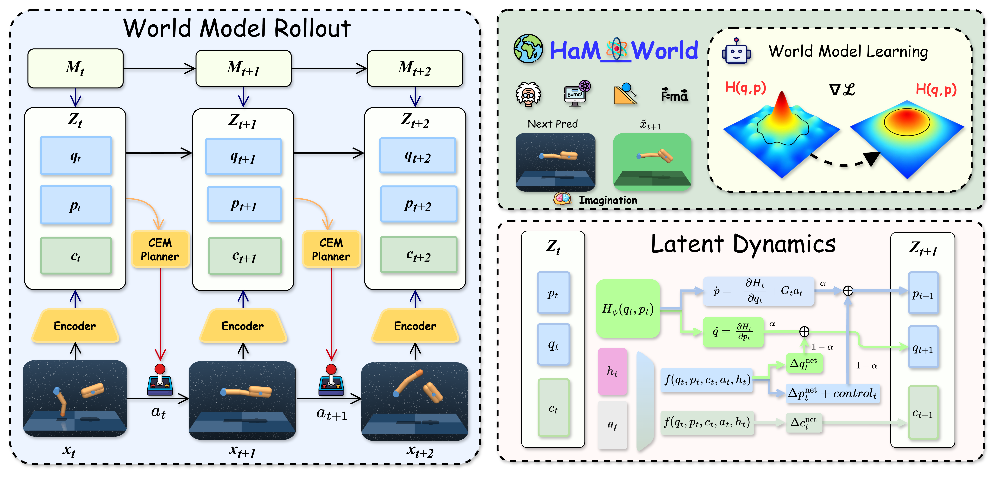
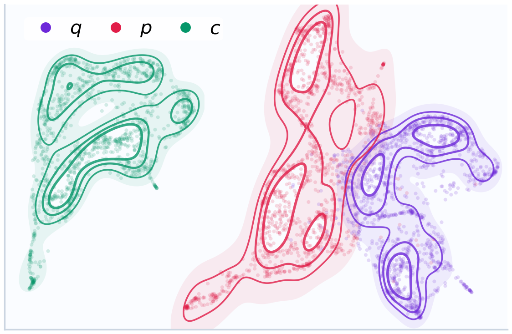
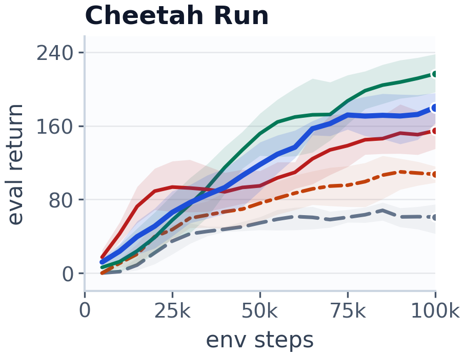

# HaM-World: Soft-Hamiltonian World Models with Selective Memory for Planning

## 基本信息

- **arXiv**: 2605.05951
- **Authors**: Haoyun Tang, Haodong Cui, Keyao Xu, Kun Wang, Zhandong Mei
- **Categories**: cs.AI
- **一句话结论**: 通过将 Mamba 选择性记忆与 Soft-Hamiltonian 几何结构耦合到统一的 planner-facing 隐动态中，HaM-World 在保持表达性的同时显著提升了长程想象推演的稳定性与动力学外推能力。

## 研究问题

本文解决的核心问题是：**基于模型的强化学习（MBRL）中，世界模型在规划步长增长或动力学分布发生偏移时，想象轨迹（imagined rollouts）出现不稳定、多步预测误差无结构累积的问题**。现有世界模型通常将位形（configuration）、动量趋势与任务语义压缩到单一无结构的隐变量中，导致长程外推缺乏几何约束；同时，部分可观测性与动作延迟使得单帧隐状态难以近似马尔可夫完备性，进一步加剧了规划器面的误差。这与 World Model、Embodied AI 和机器人控制密切相关，因为稳定的隐空间动力学是模型预测控制（MPC）在实体系统中可靠部署的前提。

## 任务与挑战

**具体任务**：在连续控制环境中，学习一个统一的 planner-facing 隐动态接口，使其同时服务于动力学预测、奖励/价值估计与 CEM（Cross-Entropy Method）动作搜索。

**输入输出**：
- 输入：观测 $o_t$、动作 $a_t$、历史记忆 $h_{t-1}$
- 输出：下一时刻隐状态 $\hat{z}_{t+1} = [\hat{q}_{t+1}, \hat{p}_{t+1}, \hat{c}_{t+1}]$、预测奖励 $\hat{r}_t$、价值估计 $\hat{V}_t$、更新后的记忆 $h_t$

**训练/评测设定**：在 DeepMind Control Suite 的四个任务（Reacher Easy、Finger Spin、Cheetah Run、Cartpole Swingup）上，统一使用 100k 环境步、3 个种子进行训练。评测涵盖样本效率（Final return、Avg. AUC）、规划一致性（$k\in\{3,5,7\}$ 步隐空间 rollout MSE）、零样本 OOD 鲁棒性（12 种动力学偏移与部分可观测扰动）以及 Hamiltonian 机制诊断。

**已有方法的不足**：
- **DreamerV3/RSSM**：单一隐状态纠缠了保守动力学与耗散/语义信息，长程 rollout 误差随步长快速增长（如 Cheetah 任务 $k=3$ 到 $k=7$ 的 MSE 从 13.29 升至 24.63）。
- **TD-MPC2**：虽 rollout 误差增长缓慢，但隐空间缺乏能量几何组织，长期停留在较高的误差平台（平均 MSE 约 4.02）。
- **传统 RNN/GRU 记忆**：以固定门控压缩历史，难以在动作条件化转移中提供自适应的长程上下文。

## 核心 Insight

本文的核心思想是：**将输入侧的马尔可夫完备性（Markov completeness）与输出侧的几何一致性耦合到同一套规划器面对的隐动态中**。具体而言，Mamba 选择性状态空间记忆（Selective SSM）作为历史条件化输入，补全了部分可观测与动作延迟场景下的状态信息；而 Soft-Hamiltonian 结构则在隐空间的规范坐标 $(q,p)$ 上施加能量级联的几何骨架，约束多步预测误差的累积方向，而非仅靠网络容量拟合统计相关。

这种耦合通过显式的隐状态分解实现：$(q,p)$ 承担保守动力学与能量几何的骨架角色，通过可学习的标量能量场 $H(q,p)$ 的梯度场演化；上下文变量 $c$ 则专门吸收语义、摩擦、接触等非保守因素；显式控制驱动 $G_t a_t$ 负责动作做功。三者共同构成 CEM 规划器在训练、想象推演与动作搜索中共享的单一接口 $z=[q,p,c]$，避免了独立的循环 rollout 状态或规划器专属隐状态。

## 方法与公式

### 1. 编码与隐状态分解

观测 $o_t$ 经两层 MLP 编码器映射为隐状态 $z_t$，随后被硬拆分为：
- **$(q_t, p_t)$**：canonical 子空间（默认各 8 维），承担能量级联的几何骨架；
- **$c_t$**：上下文子空间（默认 32 维），承载任务语义、摩擦、接触等非保守信息。

### 2. Mamba 选择性记忆

记忆状态 $h_t$ 由两层 Mamba 选择性 SSM（模型/状态维度 128）更新：
$$h_t = \mathrm{Memory}_\phi(z_t, a_{t-1}, h_{t-1})$$

关键设计在于 $h_t$ **不单独构成一条 rollout 路径**，而是作为历史条件输入，同时注入到 $f_{\text{core}}$、$G_\phi$ 与 $f_c$ 中，补全部分可观测性下的马尔可夫近似。

### 3. Soft-Hamiltonian 隐动态更新（Eq. soft-ham）

$$\begin{aligned}
\bigl[\Delta q^{\text{net}}_t,\Delta p^{\text{net}}_t\bigr] &= f_{\text{core}}(q_t,p_t,c_t,a_t,h_t),\quad
\mathcal{H}_t = H_\phi(q_t,p_t),\quad
\mathbf{G}_t = G_\phi(q_t,p_t,c_t,a_t,h_t), \\
\Delta q_t &= (1-\alpha)\,\Delta q^{\text{net}}_t + \alpha\,\partial_{p}\mathcal{H}_t,\quad
\Delta p_t = (1-\alpha)\,\Delta p^{\text{net}}_t - \alpha\,\partial_{q}\mathcal{H}_t + \mathbf{G}_t a_t,
\end{aligned}$$

随后 $q_{t+1}=q_t+\Delta q_t$，$p_{t+1}=p_t+\Delta p_t$。

**逐项解释**：
- $f_{\text{core}}$：网络核心分支，输出数据驱动的残差更新 $[\Delta q^{\text{net}}, \Delta p^{\text{net}}]$；
- $H_\phi(q,p)$：可学习的标量能量场（Hamiltonian head），其梯度 $\partial_p \mathcal{H}$ 与 $-\partial_q \mathcal{H}$ 构成 Hamiltonian 向量场；
- $\mathbf{G}_t$：控制驱动头，输出控制矩阵/向量，将动作 $a_t$ 显式映射为对动量的做功；
- $\alpha \in [0,1]$：可调度混合系数（训练后期可达 0.5），平衡数据驱动残差与 Hamiltonian 几何骨架；
- **"Soft" 的含义**：当 $\alpha \to 0$ 时退化为纯网络残差加控制；当 $\alpha \to 1$ 时接近受控 Hamiltonian 更新；中间状态保留了对接触、摩擦等非保守动态的拟合能力。

上下文更新为：
$$\Delta c_t = f_c(q_t,p_t,c_t,a_t,h_t), \quad c_{t+1} = c_t + \Delta c_t$$

### 4. 训练目标（Eq. total-loss）

总损失为加权组合：
$$\mathcal{L}_{\text{total}}=\mathcal{L}_{\text{repr}}+\beta_{\text{dyn}}\mathcal{L}_{\text{dyn}}+\beta_{\text{roll}}\mathcal{L}_{\text{roll}}+\beta_{\text{r}}\mathcal{L}_{\text{reward}}+\beta_{\text{v}}\mathcal{L}_{\text{value}}+\beta_{\text{p}}\mathcal{L}_{\text{policy}}+\beta_{\text{geo}}\mathcal{L}_{\text{geo}}$$

其中关键的几何与 rollout 损失包括：

**多步 rollout 一致性（Eq. roll-main）**：
$$\mathcal{L}_{\text{roll}} = \frac{1}{|\mathcal{S}|}\sum_{s\in\mathcal{S}}\sum_{k=1}^{K}\bigl\|\hat{z}_{s+k}^{(s)} - \mathrm{sg}(z_{s+k})\bigr\|_2^2$$

该损失从多个位置 $s$ 出发进行 $K$ 步 rollout，以 stop-gradient 的编码器输出为靶标，直接约束规划器使用的长程轨迹，避免单步训练与多步推理之间的暴露偏差（exposure bias）。

**Hamiltonian 对齐（Eq. ham-align）**：
$$\mathcal{L}_{\text{ham}} = \bigl\|\Delta q_t^{\mathrm{net}} - \partial_{p}\mathcal{H}_t\bigr\|_2^2 + \bigl\|\Delta p_t^{\mathrm{net}} + \partial_{q}\mathcal{H}_t\bigr\|_2^2$$

该损失作为软方向偏置，将网络残差分支对齐到 Hamiltonian 向量场，而显式控制驱动 $\mathbf{G}_t a_t$ 不参与对齐，允许动作做功改变能量。

**无动作能量正则化（Eq. energy-main）**：
$$\mathcal{L}_{\text{energy}} = \mathbb{E}_{t:\|a_t\|<\epsilon}\bigl[(\mathcal{H}(q_{t+1},p_{t+1}) - \mathcal{H}(q_t,p_t))^2\bigr]$$

该损失仅在动作接近零时激活，抑制无动作情况下的能量漂移，鼓励被动推演中的稳定性。

### 5. 局部误差机制（附录推导）

对于有限步长 rollout，误差界满足：
$$e_k \le \varepsilon(1+L+\cdots+L^{k-1})$$

其中 $\varepsilon$ 为单步模型误差，$L$ 为局部扩张因子。Mamba 记忆通过历史条件化降低有效 $\varepsilon$；Soft-Hamiltonian 的 $(q,p)$ 结构通过能量切向动力学与残差缩放 $(1-\alpha)$ 约束 $L$ 的来源。

### 6. 推理：CEM 规划

规划器在隐空间内直接进行交叉熵方法搜索。以当前 $(z_t, h_t)$ 为起点，对候选动作序列进行想象 rollout，通过共享的 reward head 与 value head 评估回报，无需独立演员网络。默认配置：horizon=6，迭代=6，候选=128，精英=16。

## 贡献拆解

**贡献 1：面向规划器的统一隐动态接口与 q/p/c 结构化分解**
- **做了什么**：将隐状态显式拆分为 canonical 对 $(q,p)$ 与上下文 $c$，并把 Mamba 选择性记忆与 Soft-Hamiltonian $(q,p)$ 动力学耦合到同一隐动态中。
- **为什么有效**：$(q,p)$ 的能量几何为长程 rollout 提供了结构化骨架，$c$ 保留了非保守因素的表达性，避免了单一隐变量的纠缠。
- **和已有方法差别**：不同于 RSSM 的单一隐状态或 TD-MPC 的无结构隐空间，HaM-World 的分解直接作用于 planner 查询的坐标，且记忆仅作为条件输入而非独立循环路径。

**贡献 2：Soft-Hamiltonian 松弛化动力学**
- **做了什么**：通过可调度混合系数 $\alpha$ 融合 Hamiltonian 向量场与网络残差，并保留显式控制驱动 $G_t a_t$ 与上下文通道。
- **为什么有效**：严格 Hamiltonian 模型在接触丰富的受控系统中过于受限；Soft-Hamiltonian 在保持能量几何组织的同时，允许耗散、控制与语义动态。
- **和已有方法差别**：相比 Hamiltonian Neural Networks（HNN）或 Symplectic ODE-Net 的严格守恒假设，本文将物理先验松弛为规划器隐空间中的局部几何偏置。

**贡献 3：机制感知的系统评估框架**
- **做了什么**：除控制回报外，同时评估 $k$-step 隐空间 MSE、12 种零样本 OOD 扰动与 Hamiltonian 能量几何诊断。
- **为什么有效**：为世界模型的"规划稳定性"提供了超越单一性能指标的验证框架，直接关联设计机制与经验现象。
- **和已有方法差别**：多数世界模型工作仅报告回报与像素重建误差，本文将 rollout 一致性与能量漂移作为核心评估维度。

## 关键图表解读

**图 1：HaM-World 整体架构（figure-000-architecture-overview.png）**
该图展示了完整的系统闭环：观测经 Encoder 编码为 $z_t=[q_t,p_t,c_t]$ 后，Mamba 记忆 $h_t$ 作为历史条件输入注入统一的 Latent Dynamics；$(q,p)$ 受 Hamiltonian 能量场 $H(q,p)$ 的梯度场与网络残差共同驱动，$c$ 独立更新；CEM Planner 直接在隐空间内搜索动作序列，通过 World Model Rollout 评估候选轨迹。读图时应注意：**记忆 $h_t$ 不单独构成 rollout 路径**，而是作为条件参与每一步的隐状态转移，这是保证 planner 接口统一性的关键。

**图 2：Cheetah Run 相空间 Hamiltonian 向量场（figure-002-cheetah-flow-q5p5.png）**
该图在 $q[5]$-$p[5]$ 相空间中绘制了学习到的 Hamiltonian 等高线（白色曲线）、向量场（蓝色箭头）与策略 rollout 轨迹（彩色曲线）。颜色编码控制输入沿 $\nabla_p \mathcal{H}$ 方向的投影（即 $\text{push}_t = (\nabla_p \mathcal{H}_t) \cdot \text{control}_t$）。读图要点：轨迹局部方向常与 Hamiltonian 流对齐；小 $|\text{push}|$ 时轨迹倾向于沿等高线切向运动（能量守恒），大 $|\text{push}|$ 时更频繁地穿越能量层。定量上 $|\Delta \mathcal{H}|$ 与 $|\text{push}|$ 的相关系数达 0.745，支撑了"控制沿 $\nabla_p \mathcal{H}$ 做功"的设计预期。

**图 3：Latent State UMAP 可视化（figure-004-cheetah-umap.png）**
通过 UMAP 降维显示，$q$（紫色）、$p$（红色）、$c$（绿色）三个子空间在嵌入空间中呈现分离的几何结构：$q$ 与 $p$ 形成 elongated manifolds 且有部分重叠（因二者采样自同一轨迹流形），而 $c$ 表现为更紧凑的上下文云。该图直接支撑了论文关于"配置、动量与任务语义分离"的核心假设，说明硬拆分在表示空间中确实诱导了几何组织。

**图 4：Cheetah Run 训练曲线（figure-010-curve-cheetah-run.png）**
该图展示了各方法在 Cheetah Run 上的 eval return 随环境步数的变化。HaM-World（绿色实线）在约 50k 步后显著超越基线，最终达到最高或次高回报。读图时应注意阴影区域表示种子间方差：HaM-World 的方差带较窄，说明训练稳定性较好；而部分基线（如 Dreamer、PPO）在 Finger Spin 等任务上出现极大标准差（>100），暗示训练崩溃风险。

## 实验与消融

**数据集与环境**：DeepMind Control Suite 的 Reacher Easy、Finger Spin、Cheetah Run、Cartpole Swingup；状态输入；100k 步交互预算。

**基线**：PPO、SAC（model-free）；DreamerV3、TD-MPC2（model-based）。

**核心指标与主结果**：
- **样本效率**：HaM-World 取得最高平均 AUC **117.9**，相较 TD-MPC2（107.7）提升 **+9.5%**。
- **长程 rollout 一致性**：在 $k\in\{3,5,7\}$ 步隐空间 MSE 对比中，HaM-World 平均 MSE 为 **1.82**，仅为 TD-MPC2（4.02）的 **45%**、DreamerV3（12.77）的 **14.3%**，并在 12 个对比单元中赢下 11 个。
- **OOD 鲁棒性**：在涵盖动力学偏移（质量/阻尼/摩擦/执行器缩放）、动作延迟与观测掩码的 12 种零样本扰动下，HaM-World 在所有条件中均获得最高回报；在 Finger Spin 与 Reacher Easy 上分别实现平均 **+10.2%** 与 **+13.6%** 的 OOD 回报提升。

**消融实验**（表 5）：
- **A1：移除 q/p/c 几何结构**：Cheetah/Finger return 从 184.4/254.0 降至 169.8/247.7；Reacher MSE@6 从 0.0778 升至 0.0852。说明在短程控制与充足容量下，Soft-Hamiltonian 的回报增益可能被部分掩盖，但其核心价值体现在长程 MSE 与 OOD 外推上。
- **A2：移除记忆**：性能崩溃最严重（Cheetah return 降至 59.2），证明在部分可观测与动作延迟场景下，记忆是隐状态可用的前提。
- **A3：Mamba 替换为 GRU**：return 与 MSE 均弱于 Full model，说明选择性 SSM 的自适应状态过滤优于固定门控压缩。

**最强证据**：$k$-step MSE 的压倒性优势（11/12 cells）与 12/12 OOD 条件全胜，直接证明了 Soft-Hamiltonian 结构对规划器实际使用的长程想象轨迹具有显著的稳定性与外推增益。

**最存疑证据**：
1. 部分基线在 Finger Spin 上的标准差极大（Dreamer 72.3±102.3，PPO 70.3±95.4），均值比较的统计严谨性被削弱；
2. OOD 评估仅覆盖 Finger Spin 与 Reacher Easy 两个任务，且均为状态输入，尚未验证在像素输入或更复杂形态下的外推能力。

## 局限性

1. **任务与输入模态局限**：实验仅覆盖四个低维状态输入的 DMC 任务，尚未验证像素输入、更复杂机器人形态以及强不连续接触（如多足行走中的足地碰撞）下的有效性。
2. **消融解读张力**：A1 在 Finger Spin 上的回报降幅有限（254.0→247.7），暗示在短程控制与充足网络容量下，Soft-Hamiltonian 的增益可能被部分掩盖；论文未深入分析何种任务结构更能放大该增益。
3. **理论保证的局部性**：理论分析仅为有限 rollout 区域内的局部机制说明（误差界 $e_k \le \varepsilon(1+L+\cdots+L^{k-1})$），未提供全局收敛或稳定性证明；能量正则化 $\mathcal{L}_{\text{energy}}$ 仅在无动作/小动作下施加，未严格处理受控闭环下的全局能量行为。
4. **维度拆分的任意性**：$q/p/c$ 的维度拆分（8/8/32）与任务物理自由度之间的对应关系缺乏系统研究，不同任务是否需要自适应拆分比例尚不清楚。
5. **记忆与几何的耦合松散**：Mamba 记忆与 Hamiltonian 结构目前是松散耦合（记忆仅作外部输入），后续可探索记忆与辛结构的更紧致联合归纳偏置。

## 个人研究判断

**值得继续追踪**。

理由如下：
1. **问题切中要害**：直接回应了 World Models 在 embodied downstream tasks 中最关键的痛点之一——长程规划稳定性与物理外推。其将"输入侧记忆完备性"与"输出侧几何一致性"耦合到同一隐动态的视角，为后续工作提供了清晰的设计范式。
2. **机制可解释性强**：q/p/c 隐空间分解与 Soft-Hamiltonian 设计为"如何在保持表达性的同时利用能量几何约束"提供了可量化、可诊断的新思路；能量漂移、等高线穿越等机制诊断工具也便于后续研究者验证改进。
3. **工程可扩展性高**：代码与实现细节已公开，且当前架构从状态输入扩展到像素输入的路径相对明确（替换 Encoder 为 CNN/ViT 即可）。其在 sim-to-real、接触丰富的受控系统（如灵巧操作）中具有直接应用潜力。
4. **明确的改进方向**：论文自身已指出像素输入、自适应维度拆分、记忆-辛结构紧致耦合等开放问题，为 follow-up 研究留下了具体入口。对于关注 World Models assisting Embodied AI 的研究者，这是一篇兼具创新性与实用性的工作。

## 关键图表解读

![Cheetah 任务在 q[5]-p[5] 相空间中的轨迹与 Hamiltonian 向量场，颜色编码控制输入对能量的影响。](figures/figure-002-cheetah-flow-q5p5.png)

*Cheetah 任务在 q[5]-p[5] 相空间中的轨迹与 Hamiltonian 向量场，颜色编码控制输入对能量的影响。*

*Cheetah Run 任务上各方法的 eval return 随环境步数变化的训练曲线对比。*
