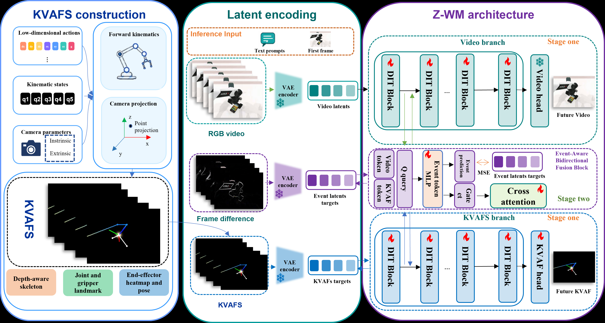
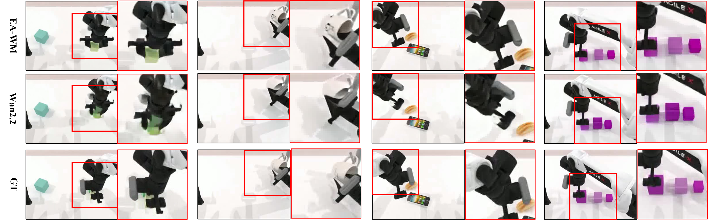
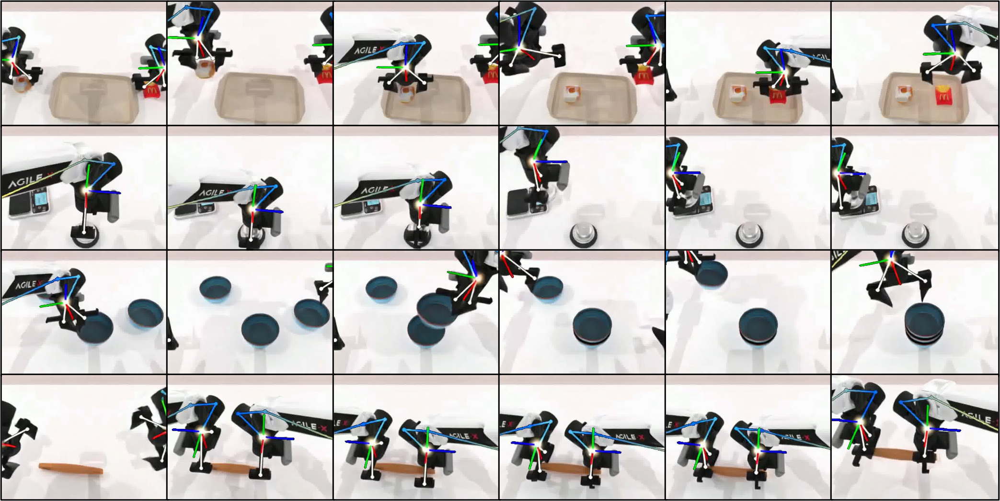

# EA-WM: Event-Aware Generative World Model with Structured Kinematic-to-Visual Action Fields

## 基本信息

- **arXiv**: 2605.06192
- **Authors**: Zhaoyang Yang, Yurun Jin, Lizhe Qi, Cong Huang, Kai Chen
- **Categories**: cs.CV, cs.AI, cs.RO
- **一句话结论**: 通过结构化运动学-视觉动作场（KVAF）与事件感知双向融合机制，EA-WM 弥合了低维控制信号与高维视频合成之间的域错位，在 WorldArena 基准上实现了机器人视频世界模型的 SOTA 性能。

## 研究问题

本文聚焦于**机器人视频世界模型（Robotic Video World Model）**中一个被长期忽视却日益关键的逆问题：如何利用动作信号有效指导视频合成，而非仅将视频生成视为动作预测或策略学习的辅助任务。现有 World-Action Models（WAM）如 UWM、DreamZero、Cosmos Policy 等，虽然联合优化了未来视频与动作，但其核心范式是把低维关节参数或末端执行器向量压缩为抽象 token 注入视频生成器。这种做法在具身智能（Embodied AI）与视觉-语言-动作（VLA）下游任务中造成了根本性的**域错位（domain misalignment）**——视频生成器被迫在潜空间中隐式推断跨域运动学，导致生成的视频 rollout 难以保持精确的机器人空间几何形态，更无法可靠捕捉细粒度的机器人-物体交互动态。EA-WM 试图回答：能否将动作条件从“抽象低维令牌”转变为与目标视频同域的“结构化视觉场”，从而在世界模型中实现运动学控制与视觉感知的闭环？

## 任务与挑战

**具体任务**：给定初始 RGB 观察、自然语言指令以及一段机器人动作序列，模型需生成未来机器人操作视频，要求视频不仅在视觉上逼真，更需在物理上与指令和动作严格一致。

**输入输出**：
- 输入：初始帧 $I_1$、文本条件 $\mathbf{c}$、动作序列 $\{\mathbf{q}_t, g_t, \boldsymbol{\xi}_t\}_{t=1}^{T}$、相机参数 $(\mathbf{K}_t, \mathbf{E}_t)$。
- 输出：未来视频帧序列 $\{I_\tau\}_{\tau=2}^{T}$ 及对应的 KVAF 序列。

**训练与评测设定**：模型在 **RoboTwin** 仿真数据集上进行训练，采用两阶段 LoRA 微调策略；在 **WorldArena** 综合基准上评测，该基准从 Physics Adherence（物理遵循）、3D Accuracy（三维精度）和 Controllability（可控性）三个维度评估生成质量。

**已有方法的不足**：
1. **域错位**：原始关节值或末端执行器向量与像素空间缺乏显式几何对应，模型必须“猜测”动作在图像中的含义。
2. **交互缺失**：传统架构缺乏动作通路与视频通路之间的有效交互机制，导致细粒度接触、遮挡与物体状态变化信息在生成过程中丢失。
3. **表征瓶颈**：现有视觉动作表征（如渲染机器人本体、热力图视频）往往过于紧凑或仅关注机器人侧，未充分编码与目标相机严格对齐的完整运动学线索。

## 核心 Insight

EA-WM 的核心思想可以概括为**“将控制信号升维到视觉域”**。与其让视频扩散模型在潜空间中艰难地推断低维动作的空间含义，不如利用机器人正运动学与相机投影，将动作和运动学状态直接提升到目标相机视角，渲染为包含深度感知臂骨架、关节关键点、夹爪几何、末端执行器热图和姿态轴的时序对齐视觉场——即**结构化运动学-视觉动作场（KVAFs）**。这一表示从根本上消除了动作条件与视频生成之间的域鸿沟，因为 KVAF 与目标视频处于同一图像域，提供了显式、可解释且空间接地的几何运动线索。

然而，仅有同域条件还不够。机器人操作中的关键信息往往集中在“哪里发生了变化”——如物体被推动、夹爪闭合、工具与工件接触等。为此，EA-WM 进一步引入**事件感知双向融合（Event-Aware Bidirectional Fusion）**机制，由**事件差异潜在监督（EDLS）**驱动。通过 VAE 编码的帧间差异潜变量监督事件预测，模型被强制在潜空间中动态关注运动与交互发生变化的区域，从而实现运动学控制与视觉感知的真正闭环。

上图清晰展示了传统 Raw Action Conditioning 的困境：低维动作向量在空间上未接地（spatially ungrounded），导致视频模型难以回答“机器人在图像中向何处移动”“哪些像素受影响”“末端执行器朝向如何”等关键问题。相比之下，KVAFs Conditioning 提供了相机对齐的动作线索、显式骨架与关节、深度感知几何以及末端执行器热力图，实现了视频域对齐（Video-Domain Alignment）、具身鲁棒语义（Embodiment-Robust Semantics）与相机空间几何接地（Camera-Space Geometric Grounding）。

## 方法与公式

EA-WM 的整体流程可分为四个层次：**KVAF 构造**、**双分支潜空间编码**、**事件感知双向融合**与**两阶段训练**。

### 1. 结构化运动学-视觉动作场（KVAF）构造

给定时刻 $t$ 的臂关节值 $\mathbf{q}_t$、夹爪状态 $g_t$、末端执行器姿态 $\boldsymbol{\xi}_t$ 以及相机内外参 $(\mathbf{K}_t, \mathbf{E}_t)$，系统首先通过正向运动学递归计算各连杆的世界坐标系位姿：

$$
\mathbf{T}^{W}_{k}(t)=\mathbf{T}^{W}_{k-1}(t)\mathbf{T}^{\mathrm{orig}}_{k}\mathbf{T}^{\mathrm{mot}}_{k}(q_{t,k})
$$

其中，$\mathbf{T}^{W}_{k}(t) \in SE(3)$ 为第 $k$ 个连杆在世界坐标系下的位姿，$\mathbf{T}^{\mathrm{orig}}_{k}$ 是从 URDF 解析的静态关节变换，$\mathbf{T}^{\mathrm{mot}}_{k}(q_{t,k})$ 是由关节值 $q_{t,k}$ 驱动的运动变换。由此提取臂骨架、关节、夹爪等 3D 关键点集合 $\mathcal{P}_t=\{\mathbf{p}^{W}_{k}(t)\}$。

随后通过透视投影将这些关键点映射到目标相机平面：

$$
\mathbf{p}^{C}=\mathbf{E}_t\begin{bmatrix}\mathbf{p}^{W}\\1\end{bmatrix},\quad \hat{\mathbf{u}}=\mathbf{K}_t\mathbf{p}^{C}_{1:3},\quad (u,v)=\left(\frac{\hat{u}_x}{\hat{u}_z},\frac{\hat{u}_y}{\hat{u}_z}\right)
$$

这里 $\mathbf{p}^{W}$ 与 $\mathbf{p}^{C}$ 分别为世界坐标系与相机坐标系下的关键点，$\hat{\mathbf{u}}$ 为齐次图像坐标，$(u,v)$ 为最终像素位置；相机深度非正的点被丢弃。

最终在黑色画布上光栅化渲染五类元素，得到 $\mathbf{V}_t\in\mathbb{R}^{H\times W\times 3}$：

$$
\mathbf{V}_t=\mathrm{Render}\big(\mathcal{P}_t,\boldsymbol{\xi}_t,\mathbf{K}_t,\mathbf{E}_t\big)
$$

渲染内容包括：
- **深度感知的臂骨架**：按相机深度 $z$ 归一化后映射到颜色盘，编码相对深度顺序；
- **关节地标与夹爪几何**：显式表达关节位置与手指构型；
- **末端执行器高斯热力图**：以截断高斯分布标记操作焦点；
- **局部姿态轴（RGB 三轴）**：投影末端执行器的局部 $x,y,z$ 轴，提供朝向与接近方向线索。

### 2. 双分支潜空间架构

EA-WM 以 **Wan2.2-TI2V** 的扩散 Transformer（DiT）为骨干。RGB 视频序列与 KVAF 序列通过**同一个预训练视频 VAE** 编码到共享潜空间，得到视频潜变量 $\mathbf{z}^{v}_{0}$ 与 KVAF 潜变量 $\mathbf{z}^{k}_{0}$。经过 patchify 后形成两个 token 流：视频流 $\mathbf{H}^{v}$ 与 KVAF 流 $\mathbf{H}^{k}$。视频流沿用原始 Wan2.2 DiT 块；KVAF 流则由一套**完整深度的并行 DiT 块**处理，确保动作信息以结构化视觉流的形式保留，而非被压缩为低维 token。

### 3. 事件感知双向融合与 EDLS

在稀疏的融合层集合 $\mathcal{S}$ 中，模型插入事件感知融合模块。该模块首先通过一个 Event MLP $\Phi_\ell$ 从当前视频 token 与 KVAF token 计算共享事件表示 $\mathbf{M}_\ell$，并分叉输出事件门控 $\mathbf{G}_\ell$ 与事件潜变量 $\hat{\mathbf{E}}_\ell$：

$$
\mathbf{M}_{\ell}=\Phi_{\ell}\left(\mathbf{H}^{v}_{\ell-1},\mathbf{H}^{k}_{\ell}\right),\qquad \mathbf{G}_{\ell}=\Gamma_{\ell}(\mathbf{M}_{\ell}),\qquad \hat{\mathbf{E}}_{\ell}=\Psi_{\ell}(\mathbf{M}_{\ell})
$$

- $\mathbf{G}_{\ell}$：逐 token 事件门控，调节跨流信息交换强度；
- $\hat{\mathbf{E}}_{\ell}$：预测的事件潜变量，接受 EDLS 监督。

EDLS 的构造方式是对输入视频计算帧间绝对差分：

$$
\Delta I_1=\mathbf{0},\qquad \Delta I_{\tau}=|I_{\tau}-I_{\tau-1}|,\quad \tau=2,\dots,T
$$

再用同一 VAE 编码得到事件潜变量目标 $\mathbf{E}$。由于门控与事件潜变量共享 $\mathbf{M}_\ell$，EDLS 间接塑造了门控的注意力分配，迫使模型关注运动与交互变化区域。

在门控作用下，双向交叉注意力按如下方式更新两个流：

$$
\tilde{\mathbf{H}}^{v}_{\ell-1} = \mathbf{H}^{v}_{\ell-1} + \mathbf{G}_{\ell}\odot \mathrm{CA}_{v\leftarrow k}\left(\mathbf{H}^{v}_{\ell-1}, \mathbf{H}^{k}_{\ell}\right)
$$

$$
\tilde{\mathbf{H}}^{k}_{\ell} = \mathbf{H}^{k}_{\ell} + \mathbf{G}_{\ell}\odot \mathrm{CA}_{k\leftarrow v}\left(\mathbf{H}^{k}_{\ell}, \mathbf{H}^{v}_{\ell-1}\right)
$$

非融合层则各自独立更新。视频流最终输出未来视频预测，KVAF 流输出 KVAF 预测。

### 4. 训练目标与流程

训练采用**两阶段策略**：
- **第一阶段**：冻结事件感知融合模块，仅训练主 DiT LoRA、KVAF 分支 LoRA 及 KVAF head，以稳定双分支；
- **第二阶段**：解冻融合模块，学习跨流事件感知交互。

总损失函数为：

$$
\mathcal{L} = \omega(t)\left(\|\hat{\mathbf{Y}}^{v}-\mathbf{Y}^{v}\|_2^2 + \|\hat{\mathbf{Y}}^{k}-\mathbf{Y}^{k}\|_2^2\right) + \lambda_{\mathrm{evt}}\frac{1}{|\mathcal{S}|}\sum_{\ell\in\mathcal{S}}\|\mathrm{Unpatchify}(\hat{\mathbf{E}}_{\ell})-\mathbf{E}\|_2^2
$$

其中，$\omega(t)$ 为流匹配训练的时间步权重，第一项为视频与 KVAF 的流匹配损失，第二项为 EDLS 损失，$\lambda_{\mathrm{evt}}$ 控制事件监督强度。训练使用 LoRA rank 32，学习率 $8\times10^{-5}$，在 32 张 H100 上以 batch size 32 进行。

上图完整呈现了 EA-WM 的系统设计：左侧为 KVAF 构造管线（低维动作 → 正运动学 → 相机投影 → 视觉渲染）；中间为共享 VAE 潜空间编码（RGB 视频、KVAF、帧差分事件目标）；右侧为 Z-WM 双分支 DiT 架构，其中稀疏插入的 Event-Aware Bidirectional Fusion Block 在第二阶段训练，通过 Event MLP 生成 Event token，再分叉为 Event prediction（受 EDLS 监督）与 Gate（调控 Cross attention），实现视频流与 KVAF 流的信息交互。

## 贡献拆解

1. **结构化运动学-视觉动作场（KVAF）**
   - **做了什么**：首次将低维机器人运动学状态（关节、夹爪、末端执行器姿态）通过正运动学与相机投影，系统性提升为与目标相机严格对齐的 RGB 视觉动作场。
   - **为什么有效**：KVAF 与目标视频处于同一图像域，提供了显式的空间、深度与几何线索，消除了传统低维动作条件的域错位。
   - **与已有方法差别**：不同于 Genima 的 RGB 动作目标或 Action Images 的多视角视频，KVAF 是面向单目标相机视角的密集结构化场，包含深度感知骨架、关节地标、夹爪几何、热力图与姿态轴五类元素，信息更丰富且与视频生成域完全兼容。

2. **EDLS 驱动的事件感知双向融合**
   - **做了什么**：提出事件差异潜在监督（EDLS），利用 VAE 编码的帧间差分潜变量监督融合模块中的事件预测；该事件表示同时驱动跨流门控，动态调节视频与 KVAF 之间的信息交换强度。
   - **为什么有效**：EDLS 迫使模型在潜空间中编码“何处发生变化”（机器人运动、物体状态转换、交互区域），门控据此在关键时空区域注入动作几何信息，显著提升了物理一致性与交互保真度。
   - **与已有方法差别**：传统交叉注意力往往以固定强度或简单拼接方式融合多模态信息；EA-WM 通过共享事件表示将“事件预测”与“门控调控”耦合，使融合强度本身成为可学习的、受物理变化监督的动态变量。

3. **WorldArena 上的 SOTA 性能**
   - **做了什么**：在 WorldArena 基准的六项核心指标中取得五项最优，P3CScore 达到 76.60。
   - **为什么有效**：KVAF 与 EAF 的互补设计分别解决了“几何精确性”与“动态交互性”两大瓶颈。
   - **与已有方法差别**：相比 CogVideoX、WoW、TesserAct 等通用视频生成模型或世界模型，EA-WM 是首个在机器人视频生成任务中系统性验证“视觉域动作条件优于数值动作条件”的工作，并建立了新的量化标准。

## 关键图表解读

**图 1：Raw Action Conditioning vs. KVAFs Conditioning（figure-010-page-2-xref-391.png）**
该图以左右对比形式呈现了论文的核心动机。左侧（Raw Action Conditioning）指出传统低维动作向量作为控制器特定 token 注入世界模型时，存在三大缺陷：视频域未对齐（Video-Domain Alignment）、具身语义鲁棒性不足（Embodiment-Robust Semantics）、相机空间几何接地缺失（Camera-Space Geometric Grounding）。右侧（KVAFs Conditioning）展示了本文方案的优势：通过相机对齐的动作线索、显式机器人骨架与关节、深度感知几何、末端执行器热力图与姿态轴，KVAF 将动作条件转化为视频域内的结构化视觉场。读图时应注意，该图不仅是示意图，更直接对应了论文对“域错位”问题的定义——KVAF 的每一项渲染元素都对应一个传统方法难以回答的几何查询。

**图 2：EA-WM 整体架构（figure-011-page-4-xref-399.png）**
此图是理解方法细节的总览图，可分为左、中、右三部分解读。左侧展示 KVAF 构造的数据流：低维动作与运动学状态经正运动学、相机投影后，渲染为包含骨架、关节、夹爪、热力图和姿态轴的 KVAF。中间展示潜空间编码：RGB 视频、KVAF 与帧差分（Frame difference）经同一 VAE 编码，分别得到视频潜变量、KVAF 潜变量与事件潜变量目标。右侧展示 Z-WM 双分支架构：Video branch 与 KVAFS branch 各自通过 DiT Block 处理，并在稀疏层通过 Event-Aware Bidirectional Fusion Block 交互。读图时需特别注意“Stage one / Stage two”的标注，这对应了论文的两阶段训练策略——先稳定双分支，再学习跨流融合。

**图 3：定性实验对比（figure-005-fig3-3.png）**
该图通过红框标注关键区域，直观展示了 EA-WM 与基线（如 Wan2.2）在细粒度空间几何与交互动态上的差异。红框通常聚焦于机器人末端执行器与物体的接触部位。读图时应关注：基线方法在夹爪-物体接触关系、物体局部几何保持、机器人姿态物理合理性上出现的模糊或错位；而 EA-WM 的生成结果更接近 GT，尤其在交互 fidelity 与任务进度上表现更优。该图直接支撑了论文中“EA-WM 生成更准确的 gripper-object contact relations”的论点。

**图 4：多样化任务定性结果（figure-007-fig5.png）**
此图展示了 EA-WM 在放置、按压、堆叠、协作等多种双臂操作任务上的生成质量与泛化能力。图中每一行对应一个任务序列，展示了从初始状态到操作完成的动态过程。读图时应注意模型在不同交互类型（抓取、推动、双臂协作）下对物体一致性（形状、大小、空间排列）的保持能力，以及 KVAF 叠加在生成视频上的对齐效果（骨架、姿态轴与机器人运动的一致性）。该图验证了 EA-WM 不仅限于单一任务，而是具备跨任务的通用机器人视频生成能力。

## 实验与消融

**数据集与基准**：实验在 **RoboTwin** 仿真数据集上训练，该数据集包含丰富的双臂操作任务与细粒度机器人-物体交互。评测采用 **WorldArena** 基准，从 Physics Adherence、3D Accuracy、Controllability 三个维度综合评估，避免单一像素级指标无法反映机器人动作一致性的问题。

**指标**：选取六项与机器人视频生成最相关的指标计算 **P3CScore**（六项均值×100）：
- Physics Adherence：Interaction Quality、Trajectory Accuracy
- 3D Accuracy：Depth Accuracy、Perspectivity
- Controllability：Instruction Following、Semantic Alignment

**主结果**（表 1）：EA-WM 取得最优总体性能，P3CScore 达到 **76.60**，较最强基线 CogVideoX（71.08）提升 **5.52** 分。在六项指标中，EA-WM 五项最优：
- Interaction Quality：0.682（vs. CogVideoX 0.594）
- Trajectory Accuracy：0.430（vs. CogVideoX 0.353）
- Depth Accuracy：0.959（vs. CogVideoX 0.910）
- Perspectivity：0.838（vs. CogVideoX 0.783）
- Instruction Following：0.792（vs. CogVideoX 0.727）

**最强证据**：Interaction Quality 与 Trajectory Accuracy 的提升最为显著，分别提升 0.088 与 0.077。这两组指标直接对应论文声称的“保持精确机器人空间几何和细粒度交互动态”，证明 KVAF 与事件感知融合的有效性。

**最存疑证据**：Semantic Alignment 指标（0.895）略低于 CogVideoX（0.898），且在消融实验中“去掉事件感知融合（w/o EAF）”的 Semantic Alignment（0.896）反而略高于完整模型（0.895）。这说明事件差分监督主要驱动模型关注动态变化区域，可能对静态语义一致性的贡献有限，甚至存在轻微权衡，论文对此未作深入分析。

**消融实验**（表 2）：
- **w/o KVAFs**：将 KVAF 替换为数值动作表示，P3CScore 下降 **5.63** 分（从 76.60 降至 70.97），Trajectory Accuracy 与 Depth Accuracy 下滑尤为明显。这表明相机对齐的视觉动作场提供了数值动作无法替代的几何运动线索。
- **w/o EAF**：保留双向交叉注意力但移除 EDLS 与事件门控，P3CScore 下降 **1.80** 分（降至 74.80），Interaction Quality 与 Perspectivity 显著降低。验证了事件感知融合对捕捉交互动态与透视一致性的关键作用。
- **互补性**：消融可视化（ranking_block_size 任务）显示，w/o KVAFs 的变体虽能维持局部物体关系，但抓取轨迹与动作诱导运动不准确；w/o EAF 的变体能从 KVAF 推断抓取路径，却难以保持物体一致性（形状、大小、空间排列）。两者结合后，EA-WM 同时解决了轨迹精度与物体一致性问题。

**动作恢复分析**：论文进一步通过启发式反解实验检验 KVAF 的信息含量。从生成的 KVAF 恢复数值动作的检测率仅约 **0.45**，且平移、旋转、夹爪误差均显著高于直接数值预测基线。这揭示了一个重要事实：KVAF 是一种**有损升维**表示，其设计目标是作为视频域条件接口，而非直接替代数值动作标签。这一发现对下游任务（如用生成视频监督策略学习）具有警示意义——视频质量高并不等价于动作可精确反解。

## 局限性

1. **真实世界部署 gap**：KVAF 构造依赖精确的机器人 URDF、相机标定和同步的动作-状态日志。论文仅在仿真中验证，真实世界中的标定误差、遮挡、传感器噪声或本体迁移会如何影响 KVAF 质量与生成一致性，尚未被讨论。
2. **物体侧信息编码不足**：当前 KVAF 主要编码机器人侧几何运动线索，物体状态变化和接触信息仅通过事件感知融合间接捕获，未在 KVAF 中显式光栅化。这限制了模型对复杂物体变形或接触动力学的显式推理能力。
3. **指标权衡与机制解释不足**：Semantic Alignment 指标在完整模型中未超越基线，且消融显示 w/o EAF 时该指标略高，说明事件监督可能以牺牲静态语义一致性为代价；此外，附录全量 16 项指标中 Action Following 表现一般（0.048），论文未深入解释。EDLS 的门控机制虽被描述为“动态关注”，但其注意力分配的可解释性分析（如注意力图可视化）在正文中缺失。
4. **KVAF 的信息瓶颈**：启发式反解实验显示从 KVAF 恢复数值动作的精度有限。在需要精确动作预测的下游任务（如策略学习）中，EA-WM 生成的视频是否仍能提供有效的动作监督，论文未充分回答。
5. **计算与数据依赖**：训练需要 32 张 H100 GPU，且依赖大规模仿真数据，对资源受限的研究者而言可复现门槛较高。

## 个人研究判断

面向 **“World Models assisting Embodied AI downstream tasks”** 的研究方向，**EA-WM 值得继续追踪**。

**理由如下**：
- **高质量 rollout 的直接价值**：EA-WM 生成的视频在物理遵循、3D 精度与可控性上显著优于现有基线，这类高质量视频 rollout 可直接用于视觉规划、模型强化学习（Model-based RL）、VLA 策略评估与训练，减少真实机器人交互成本。
- **表示范式的启发性**：将动作表示从抽象低维令牌转变为图像域结构化视觉场（KVAF）的思路，为扩散模型与世界模型先验的结合提供了新的技术路径。这一方向可延伸至物体-centric 视觉场、接触感知场或可微渲染器的端到端联合优化。
- **闭环 VLA 的潜在桥梁**：EA-WM 补全了“动作 → 视频”的生成闭环，与现有 WAM 的“视频 → 动作”预测形成互补。未来若能在真实机器人上验证 KVAF 的鲁棒性，并解决物体侧信息显式编码问题，有望构建真正的双向闭环 VLA 系统。

**需警惕的方面**：当前工作仍停留在仿真阶段，且 KVAF 的“有损升维”特性意味着视频生成质量与动作精度之间并非简单正相关。若后续研究计划将 EA-WM 作为策略学习的监督信号源，必须首先解决从 KVAF 或生成视频中可靠恢复/提取动作信息的问题，或探索可微分 KVAF 渲染以实现端到端优化。总体而言，EA-WM 在机器人世界模型的“几何精确性”与“交互动态性”两个维度上迈出了实质性一步，是 World Models 辅助具身智能下游任务的重要参考。

## 关键图表解读

*带红框关键区域标注的定性实验对比或消融结果网格。*

*多样化机器人操作任务的定性生成结果序列展示。*
