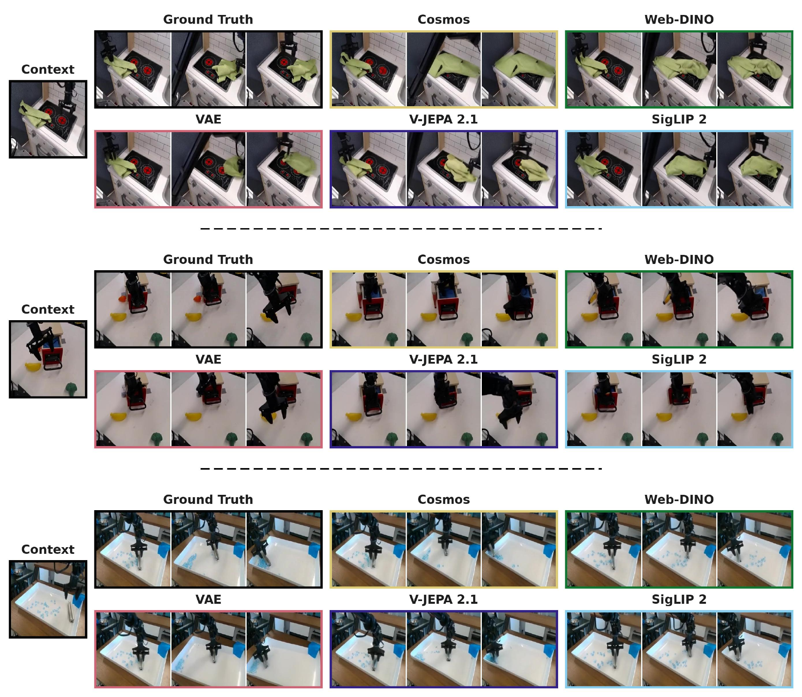
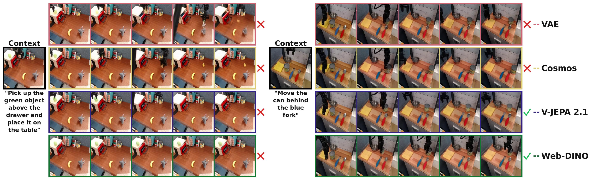
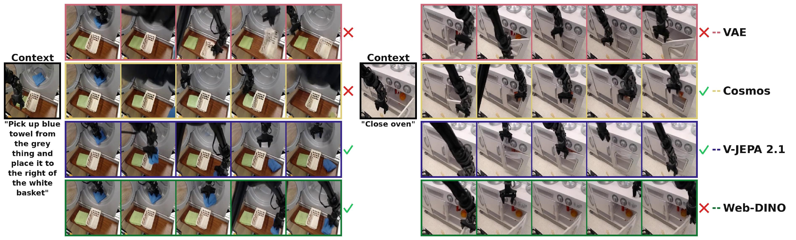

# Reconstruction or Semantics? What Makes a Latent Space Useful for Robotic World Models

## 基本信息

- **arXiv**: 2605.06388
- **Authors**: Nilaksh, Saurav Jha, Artem Zholus, Sarath Chandar
- **Categories**: cs.CV, cs.LG, cs.RO
- **一句话结论**: 在机器人扩散世界模型中，语义潜空间（V-JEPA 2.1、Web-DINO、SigLIP 2）在动作恢复、规划与下游 VLA 策略性能上全面优于重建潜空间（VAE 等），即便后者在像素级保真度上占优；视觉保真度与下游策略性能显著脱钩。

## 研究问题

论文针对的核心问题是：**在基于 Latent Diffusion Model（LDM）的机器人世界模型中，encoder 所定义的潜空间选择（reconstruction-aligned vs. semantic-aligned）究竟如何影响世界模型的动作保真度、规划能力与下游策略性能？**

当前机器人世界模型普遍默认使用 VAE、Cosmos 等重建导向的潜空间，其优化目标仅为像素重建，可能丢失动作相关的物理动态、接触几何与任务语义。与此同时，V-JEPA 2.1、DINO、SigLIP 等预训练语义编码器虽具备丰富的物体与任务语义，但其高维特征空间（1024D–1152D）被认为难以直接用于扩散生成。论文质疑了领域内“像素重建质量越高则世界模型越优”的隐含假设，试图证明：对机器人控制而言，保留动作相关结构与任务语义的潜空间才是更优基础。该问题直接关联 VLA（Vision-Language-Action）策略评估、World Model 表征学习与 Embodied AI 的 sim-to-real 迁移。

## 任务与挑战

**具体任务**：在 BridgeV2 真实机器人操作数据集（~60K WidowX 250 单臂演示，256×256，7-DoF 动作，frame skip 2）上，训练 action-conditioned latent diffusion world models。输入为 RGB 观测历史 $o_{t-H:t}$ 与动作序列 $a_{t-H:t+K-1}$，输出为未来潜在轨迹 $\tilde{z}_{t+1:t+K}$，再经 decoder 还原为像素，用于自回归 rollout。

**训练/评测设定**：为严格隔离潜空间选择的因果效应，论文固定 DiT 转移模型（S/B/L 三种规模）、动作条件机制、AdamW 优化器（lr=$10^{-4}$）、flow matching 目标与训练轮数，仅替换 encoder $f_\phi$、可选 adapter $\alpha_\psi$ 与 decoder 路径。

**核心挑战**：
1. **高维语义空间的扩散稳定性**：语义编码器产生的 patch features 维度高达 1024–1152，直接用于 flow matching 易导致 off-manifold 生成。
2. **评估维度缺失**：传统视频生成指标（FID、SSIM）无法反映动作可控性与任务语义保留度，需要建立面向机器人控制的三轴评估体系。
3. **计算与表征的权衡**：需在保持 DiT 计算量基本不变（固定 $N=256$ tokens/frame）的前提下，使高维语义空间适配扩散训练。

## 核心 Insight

本文最核心的思想是：**对世界模型而言，潜空间的价值取决于其保留动作相关结构与任务语义的能力，而非单纯重建像素的能力。** 论文通过严格控制的对比实验表明，重建型潜空间虽然在 PSNR、FID 等低层像素指标上占优，但其生成的动态在动作相关几何与任务进度结构上显著劣于语义潜空间；反之，语义潜空间即使经扩散生成后，仍能通过逆动力学模型（IDM）恢复出高保真动作，并支撑更高的 CEM 规划精度与 OpenVLA 闭环成功率。这一发现颠覆了“视频生成越逼真，世界模型越适合机器人控制”的直觉，确立了 **action-relevant structure 优先于 photometric fidelity** 的设计原则。

## 方法与公式

### 模型架构与数据流

整个框架由四个固定组件与一个可训练组件构成：

1. **Frozen Encoder $f_\phi$**：将 RGB 观测 $o_t$ 编码为 spatial patch latent $z_t \in \mathbb{R}^{N \times D}$。
   - **Reconstruction 族**：SD3 VAE（$D=16$）、VA-VAE（$D=32$）、Cosmos（$D=16$），无 adapter。
   - **Semantic 族**：V-JEPA 2.1（$D=1024$）、Web-DINO（$D=1024$）、SigLIP 2（$D=1152$）。

2. **Optional Frozen Adapter $\alpha_\psi$**：对 semantic encoders，使用预训练的 S-VAE adapter 将 $z_t$ 压缩为 $\tilde{z}_t \in \mathbb{R}^{N \times d}$（默认 $d=96$）；VAE 族使用恒等映射。

3. **Trainable Transition Model（DiT）**：采用 action-conditioned DiT with flow matching。
   - 输入为 history latents $\tilde{z}_{t-H:t}$（$H=2$）与对应动作序列 $a_{t-H:t+K-1}$。
   - 输出为未来 latent trajectory $\tilde{z}_{t+1:t+K}$（$K=8$）。
   - 对 non-VAE latents 施加 **dimension-dependent noise schedule shift** 以适配高维空间；native semantic variants 额外使用 **shallow-wide DDT head**（2048-dim）扩展 DiT 输出宽度，而不增加 backbone 深度。

4. **Frozen Decoder**：VAE 族使用原生 convolutional decoder；semantic 族使用 adapter 附带的 lightweight pixel decoder 将 $\tilde{z}$ 还原为像素。

5. **Inference**：自回归 latent rollout。每步在 latent space 中用 10 步 Euler flow-matching 积分生成下一帧 latent，append 到 sliding context（长度 10）中继续推进。

### 关键公式与解释

**Flow Matching 训练目标**：
对于未来帧 $i \in \{H,\dots,T-1\}$，采样 $\tau_i \sim p(\tau)$，噪声 $\epsilon \sim \mathcal{N}(0,I)$，构造线性插值：
$$
\tilde{z}_{\tau_i,i} = (1-\tau_i)\tilde{z}_i + \tau_i \epsilon_i .
$$
DiT 预测速度场 $v_{\theta}(\tilde{z}_{\tau}, \tau, a_{0:T-1}, \ell)$，目标速度为：
$$
u_i = \epsilon_i - \tilde{z}_i .
$$
训练损失仅作用于未来帧：
$$
\mathcal{L}_{\mathrm{FM}} = \mathbb{E}_{\tilde{z},\epsilon,\tau} \left[ \sum_{i=H}^{T-1} \left\| v_{\theta}(\tilde{z}_{\tau,i}, \tau_i, a_{0:T-1}, \ell) - (\epsilon_i - \tilde{z}_i) \right\|_2^2 \right].
$$
其中 $\tilde{z}_i$ 为真实 latent，$\epsilon_i$ 为标准高斯噪声，$\tau_i$ 为 flow time。该损失迫使模型学习从噪声到数据 latent 的最优传输路径。

**Dimension-Dependent Noise Schedule Shift**：
为稳定高维语义空间的扩散过程，对非 VAE latent 施加维度相关的噪声调度偏移：
$$
\gamma = \sqrt{\frac{(256/p^2)d}{4096}}, \qquad \tau' = \frac{\gamma \tau}{1 + (\gamma - 1)\tau}.
$$
这里 $d$ 为 DiT 输入通道数（adapter 输出维度或 native 维度），$p$ 为 patch size。该偏移使噪声水平与 latent 表示维度耦合，缓解高维空间中的 off-manifold 采样问题。

**S-VAE Adapter 训练损失**：
Adapter 将高维语义特征压缩至低维，其训练目标为：
$$
\begin{aligned}
\mathcal{L}_{\mathrm{adapter}} =\ & \mathcal{L}_{\mathrm{MSE}}(z,\hat{z}) + \lambda_{\mathrm{cos}}\mathcal{L}_{\mathrm{cos}}(z,\hat{z}) + \lambda_{\mathrm{spec}}\mathcal{L}_{\mathrm{FFT}}(z,\hat{z}) \\
& + \lambda_{\mathrm{KL}}\,D_{\mathrm{KL}}\!\left(q_\psi(\tilde{z}\mid z)\,\|\,\mathcal{N}(0,I)\right) + \lambda_{\mathrm{pix}}\,\mathcal{L}_{\mathrm{pix}}(o,\hat{o}).
\end{aligned}
$$
其中 $z$ 为 frozen encoder 输出，$\hat{z}$ 为 adapter 重建特征，$\tilde{z}$ 为压缩 latent；MSE 与 cosine loss 保证特征空间保真，FFT loss 惩罚高频结构损失，KL 项约束后验接近标准高斯，pixel loss 通过 lightweight decoder 将压缩 latent 锚定到像素空间。

**CEM 规划目标**：
给定真实未来 latent 目标 $\tilde{z}^*_{t+2:t+k+1}$，通过 Cross-Entropy Method 恢复动作序列：
$$
a^{\mathrm{plan}}_{t+1:t+k} = \argmin_{a_{t+1:t+k}} \frac{1}{k} \sum_{j=1}^{k} \left\| p_\theta^{(j)}(\tilde{z}_t,\tilde{z}_{t+1}, a_{t+1:t+k}) - \tilde{z}^*_{t+1+j} \right\|_2^2 .
$$
$p_\theta^{(j)}$ 表示世界模型第 $j$ 步自回归预测。该优化在 latent space 中直接评估动作可控性，绕开了 pixel decoder 的干扰。

## 贡献拆解

1. **控制变量的评估框架：隔离潜空间选择的因果效应**
   - **做了什么**：固定 DiT backbone、训练数据、动作条件、优化器与训练协议，仅替换 encoder/adapter/decoder，系统比较 3 种重建编码器与 3 种语义编码器（含 native + adapter 两种模式）。
   - **为什么有效**：排除了模型容量、训练运气等混淆变量，使观测到的性能差异唯一归因于 encoder 定义的 representation space。
   - **和已有方法差别**：DINO-WM、V-JEPA 2-AC 等虽使用语义特征，但采用自回归或 JEPA 架构；本文首次在统一 LDM 框架内完成 semantic vs. reconstruction 的受控比较。

2. **高维语义空间扩散训练 Recipe**
   - **做了什么**：整合 S-VAE adapter 压缩、wide shallow DDT head 与 dimension-dependent noise schedule shift，使 1024D–1152D 语义特征可用于稳定的 action-conditioned flow matching。
   - **为什么有效**：adapter 将扩散操作维度降至 $d=96$，降低训练难度；DDT head 在不增加 DiT 深度的前提下扩展输出宽度；noise shift 适配高维空间的信噪比特性。
   - **和已有方法差别**：RAE/S-VAE 前置工作主要面向无条件或导航生成，本文将其扩展至接触丰富的操作任务，并首次量化其对机器人规划与策略评估的影响。

3. **三轴评估体系与“视觉保真度脱钩”发现**
   - **做了什么**：提出 visual fidelity、planning & downstream policy performance、latent representation quality 三轴评估，涵盖 IDM action recoverability、CEM planning、OpenVLA-7B 闭环成功率、OOD 鲁棒性、success classifier accuracy 等多层指标。
   - **为什么有效**：传统 FID/SSIM 无法捕捉动作判别几何的退化；IDM Pearson $r$ 与 success classifier 直接探测 latent 空间中的动作与任务结构保留度。
   - **和已有方法差别**：WorldArena、RBench 等侧重系统级评估，本文聚焦模型级表征选择，证明像素指标与下游策略性能显著脱钩。

## 关键图表解读

### 图 1：视频预测帧综合对比（figure-001-comparison-combined.png）

该图在三个 BridgeV2 操作任务（毛巾操作、抽屉交互、物体推移）上，并排展示了 Ground Truth、VAE、Cosmos、V-JEPA 2.1、Web-DINO 与 SigLIP 2 的生成结果。**读图要点**：VAE（红框）在局部纹理和锐度上往往更接近真实图像，但容易出现物体语义幻觉——例如毛巾状态错误或抽屉开合程度不准确；相比之下，V-JEPA 2.1（紫框）、Web-DINO（绿框）与 SigLIP 2（蓝框）的全局物体布局和任务语义更一致，即使某些像素细节略模糊。这提供了“视觉保真度不足以评估世界模型”的最直观视觉证据：重建型编码器赢得了像素，却输掉了物理动态与任务结构。

### 图 2：VLA 闭环规划成功率对比 I（figure-002-comparison-vla-2.png）

该图展示了两组语言条件任务（左：“Pick up the green object above the drawer...”；右：“Move the can behind the blue fork”）的 OpenVLA-7B 闭环 rollout 结果，由 InternVL 3.5 VLM 评判成功（绿勾）或失败（红叉）。**读图要点**：VAE 与 Cosmos（重建型）在两项任务中均被判失败，表现为物体抓取或空间关系推理错误；而 V-JEPA 2.1 与 Web-DINO（语义型）均被判成功。这说明语义潜空间在下游 VLA 策略闭环执行中更能保持任务语义和动作正确性，直接支撑了“语义潜空间更利于 policy-in-the-loop”的论点。

### 图 3：VLA 闭环规划成功率对比 II（figure-003-comparison-vla.png）

该图展示了另两组任务（左：“Pick up blue towel from the grey thing...”；右：“Close oven”）的 rollout 结果。**读图要点**：不同语义编码器展现出差异化失败模式——V-JEPA 2.1 在“关烤箱”任务中成功，而 Web-DINO 失败；Web-DINO 在“毛巾”任务中成功，而 V-JEPA 2.1 未展示（图中为 SigLIP 2 成功）。这种差异说明不同语义编码器各有侧重（V-JEPA 2.1 在策略性能上整体最强，但非绝对全胜），但**均优于**重建型编码器（VAE 在两项任务中均失败）。这增强了论文结论的鲁棒性：语义族整体占优，且优势跨任务稳定。

## 实验与消融

**数据集**：BridgeV2（~60K 演示，训练 world model 与 adapter）；SOAR（~30.5K 成功/失败片段，训练 success classifier probe）。

**基线与变体**：3 种重建编码器（SD3 VAE、VA-VAE、Cosmos，无 adapter）与 3 种语义编码器（V-JEPA 2.1、Web-DINO、SigLIP 2，各含 native $D$ 与 adapter-compressed $d_{96}$ 两种模式）。DiT 规模覆盖 S/B/L。

**核心指标**：
- **视觉**：PSNR、SSIM、LPIPS、FID、FVD、t-LPIPS、PCK coverage；
- **规划与策略**：CEM action recovery（$k=1,4$）、OpenVLA-7B consensus success rate、Borda rank、OOD distractor/instruction SR；
- **潜表征**：IDM Pearson $r$（Real vs. WM）、success classifier balanced accuracy（Enc. Acc vs. WM Acc）。

**主结果**：
- **动作恢复**：DiT-S 时，V-JEPA 2.1 的 IDM Pearson $r$（$k=4$，WM latents）达 **0.840**，而 VAE 仅 **0.464**；该优势在 DiT-L 时仍保持（V-JEPA 2.1: 0.848 vs. VAE: 0.483）。
- **规划精度**：语义编码器在 CEM $k=4$ 误差上全面低于重建编码器；V-JEPA 2.1 在 DiT-S 时 CEM 表现最优。
- **VLA 闭环**：语义族在 consensus success rate 与 OOD 鲁棒性上显著领先；V-JEPA 2.1 与 SigLIP 2 的 DiT-S 结果最强。
- **视觉保真度**：重建族在 FID、PSNR 上占优，但语义族在 FVD、temporal LPIPS、PCK coverage 等时序/几何指标上更强。

**消融实验**：
- **Adapter 维度**：Web-DINO DiT-S 的 adapter 维度消融显示 $d_{96}$ 是 sweet spot，在 VLA SR、LPIPS、FID、FVD 上均优于 $d_{16}$ 与 native $D_{1024}$，证明适度压缩有助于扩散训练与视觉解码，但过度压缩会损失策略性能。
- **DiT 规模**：从 S 放大到 L，VAE 的视觉指标（FID、SSIM）大幅追赶甚至反超，但 CEM action error 与 IDM $r$ 的 gap **并未完全闭合**，暗示重建潜空间在动作相关结构上的劣势具有固有性，难以仅靠放大 transition model 弥补。
- **多视角 fine-tuning**：在有限数据下加入多视角可提升 CEM 动作恢复，但会降低视频生成质量；语义编码器对此退化的鲁棒性优于重建编码器。

**最强证据**：IDM Pearson $r$（附录 Table 2 / 正文 Table 2）直接量化语义潜空间在经扩散生成后仍保留远更丰富的动作判别几何，且该指标完全独立于 pixel decoder，是世界模型“动作保真度”的最硬证据。

**最存疑证据**：Policy-in-the-loop 的 success rate 完全依赖 InternVL 3.5 与 Qwen 3.6 两个 VLM 评判。尽管作者采用 consensus 与 Borda rank 缓解方差，但 VLM 对细微接触、空间关系与部分成功的判断仍可能存在一致的校准偏差或幻觉（论文 Limitations 中亦承认此点）。

## 局限性

1. **单一 embodiment 与数据集局限**：所有实验仅在 BridgeV2（WidowX 250 单臂操作）上完成，结论向双手机构（如 ALOHA）、Franka 或其他仿真器（如 RoboCasa）的泛化性尚未验证。跨 embodiment 的动作空间、相机视角与接触动力学差异可能改变 semantic vs. reconstruction 的权衡。
2. **VLM 评判引入的系统性偏差**：Policy-in-the-loop 的 success rate 与 OOD 鲁棒性依赖 VLM 打分，对细微接触、部分成功和幻觉敏感；虽然辅以 CEM、IDM 等非 VLM 指标，但 VLM 偏差未被完全消除。
3. **Adapter 的几何精度损失**：S-VAE adapter 虽提升扩散稳定性与视觉解码，但在 CEM action error、OOD robustness 与 PCK coverage 上弱于 native semantic latents，说明压缩过程会扭曲细粒度动作几何。论文对此 tradeoff 仅做了现象描述，未给出根本解决方案。
4. **Scale 与数据边界未探明**：当 DiT 从 S 放大到 L 时，VAE 视觉指标追赶但 policy gap 未完全闭合；继续 scale transition model 或 native semantic latents 在更大模型与更多数据下的表现仍是开放问题。

## 个人研究判断

面向 **“World Models assisting Embodied AI downstream tasks”** 的研究方向，这篇论文**值得继续追踪**。

理由如下：
1. **问题切口极其干净**：首次在统一 LDM 框架内通过严格控制单一变量，严格隔离了潜空间选择的因果效应，颠覆了“像素重建质量越高则世界模型越优”的隐含假设。这一认知更新对社区具有即时指导意义。
2. **训练 Recipe 可落地**：论文不仅提出“用语义潜空间”，还给出了可复现的技术路径（语义编码器 + S-VAE adapter + wide-head DiT + dimension-dependent noise shift），对 VLA 策略评估、扩散策略规划与 sim-to-real 迁移均有直接工程价值。
3. **遗留问题明确且可扩展**：跨 embodiment 泛化、adapter-free 高维语义空间训练、VLM-free 的自动化策略评估、以及更大规模 DiT 与数据的 scaling law，均为后续研究提供了清晰切口。特别是“adapter 压缩损失动作几何”与“重建空间 scale 后仍追不上动作恢复”两点，暗示了语义空间在接触丰富操作中的结构性优势，值得在更复杂环境中进一步验证。
