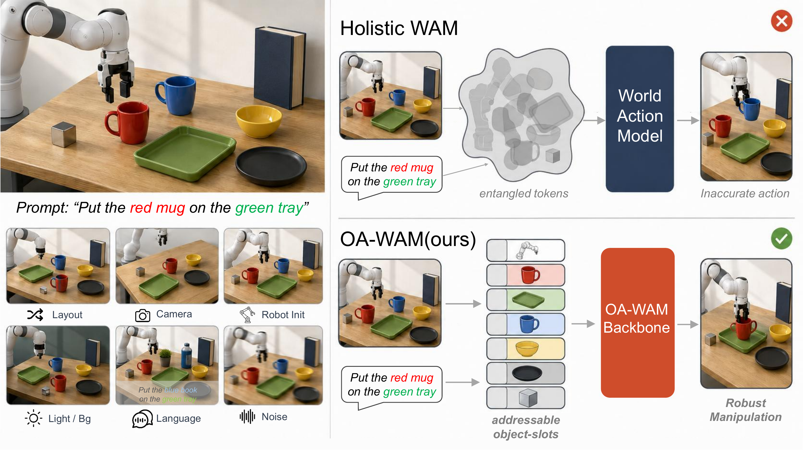
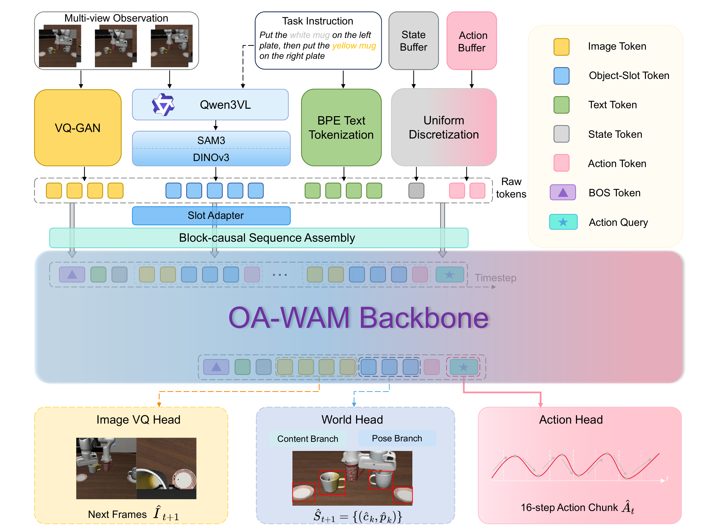

# OA-WAM: Object-Addressable World Action Model for Robust Robot Manipulation

## 基本信息

- **arXiv**: 2605.06481
- **Authors**: Yushan Liu, Peibo Sun, Shoujie Li, Yifan Xie, Lingfeng Zhang, Xintao Chao, Shiyuan Dong, Fang Chen, Xiao-Ping Zhang, Wenbo Ding
- **Categories**: cs.RO
- **一句话结论**：通过对象可寻址的槽位状态表示与无参数的地址路由约束，OA-WAM 在保持分布内性能的同时，显著提升了机器人在场景几何扰动下的鲁棒操控能力，并为“目标选择是否通过显式地址子空间路由”提供了可干预的行为级证据。

## 研究问题

现有 World Action Models（WAM）与 Vision-Language-Action（VLA）策略在场景发生相机视角偏移、物体布局变化或机器人初始位姿扰动时，成功率往往从接近饱和急剧崩溃。根本原因在于：现有方法将世界状态表示为全局图像、视频令牌或整体潜变量，导致语言指令指代的特定对象身份与周围背景及邻域内容深度纠缠。当场景几何变化时，目标对象虽仍可见，但其在全局表示中的“位置”被重写，行动解码器无法稳定定位“哪个物体”，从而发生动作漂移。

本文将这一问题形式化为**对象可寻址性（Object Addressability）**的缺失。核心科学问题是：如何在 Transformer 的张量级运算中，硬分离“指向哪个物体”（addressing）与“物体当前状态是什么”（content），从而使目标选择对场景上下文变化具有结构不变性。这与 VLA、World Model 和 Embodied AI 的交叉方向密切相关——世界模型不仅要预测未来，还必须为下游策略提供一个稳定、可查询、可干预的对象级接口。

## 任务与挑战

**任务设定**：单步前向的机器人操控策略。在时间步 $t$，策略接收第三人称与腕部 RGB 图像 $\mathbf{I}_t$、本体感受 $\mathbf{q}_t\in\mathbb{R}^7$、语言指令 $\ell$ 以及过去 $T-1$ 步执行的动作 $\mathbf{a}_{<t}$，输出一个 16 步连续动作块 $\mathbf{A}_t\in\mathbb{R}^{16\times 7}$，并辅助预测下一帧每个物体槽位的状态 $\widehat{\mathcal{S}}_{t+1}$：
$$
\bigl(\mathbf{A}_t,\,\widehat{\mathcal{S}}_{t+1}\bigr)\;\sim\;\pi_\theta\!\bigl(\mathbf{I}_{\le t},\,\mathbf{q}_{\le t},\,\ell,\,\mathbf{a}_{<t}\bigr).
$$

**训练与评测设定**：
- **训练**：三阶段流程。Stage 0 在 2.5T token 的混合数据（网页图文 + Open X-Embodiment + DROID + RoboCasa + Bridge V2）上预训练 7B Chameleon 主干；Stage I 冻结主干，训练 slot adapter 与 world head；Stage II 引入 LoRA（rank 32）与 flow-matching action head，在标准 LIBERO 演示上端到端微调。**LIBERO-Plus 全程不参与训练**，用于零样本 OOD 评估。
- **评测**：分布内（LIBERO 四套件、SimplerEnv WidowX Visual Matching）与分布外零样本鲁棒性（LIBERO-Plus 七轴扰动：Camera、Robot init、Layout、Light、Background、Language、Sensor noise）。

**已有方法为何不够好**：
1. **整体式表示的纠缠**：Holistic WAM/VLA（如 $\pi_{0.5}$、Cosmos-Policy）将场景编码为全局 token 流，目标身份与背景混合，几何扰动时行动解码器漂移。
2. **对象中心方法的局限**：Slot Attention、SlotVLA 等虽分解场景为 slot，但每个 slot 仍混合身份、外观、姿态与上下文，未在架构级保证“寻址”与“内容”解耦。
3. **鲁棒性基准的暴露**：LIBERO-Plus 显示现有方法在 OOD 场景下脆弱，且对语言指令的语义不敏感。

## 核心 Insight

本文的核心洞察是：**机器人操控的鲁棒性瓶颈不在于预测未来世界状态的能力，而在于世界表示是否提供了一个稳定、可查询、可干预的对象级接口。** 现有 WAM 预测“场景如何变化”，但行动解码器在读取这些预测时，缺乏一个不受场景几何变化影响的“地址簿”来定位语言指令指代的对象。

OA-WAM 将每帧分解为 $N+1$ 个槽位（1 个机器人槽 + $N$ 个对象槽）。每个槽位向量被硬切分为两部分：
- **addr（32 维）**：冻结的身份地址，仅在 episode 开始时由语言标签与初始 DINOv3 特征计算，全程固定且阻断梯度；
- **content（256 维）**：时变内容，每帧通过 SAM3 + DINOv3 更新。

在 32 层 Transformer 的每一层，跨槽注意力键被强制仅读取 addr 子向量（前 32 维），且每层结束后通过 forward hook 将 residual stream 的 addr 切片重置回初始缓存值。这一设计使得“作用于哪个物体”完全由冻结的身份地址决定，而“物体当前是什么状态”通过 Value 和 residual stream 自由流动。这种张量级的硬分离，使目标选择对相机偏移、布局重排、机器人初始位姿变化等几何扰动具有天然的结构不变性。

## 方法与公式

**整体架构**
OA-WAM 是一个单前向传播的 World-Action 联合模型。输入经六路并行 token 化后，通过 Slot Adapter 投影，组装为 block-causal 序列，经 32 层 Slot-Aware Transformer 主干处理，最终由三个预测头输出：World Head 预测下一帧槽位状态、Action Head 解码 16 步动作块、辅助 Image VQ Head 预测下一帧图像 VQ token。

**1. 对象槽位向量化**
每个槽位 $k$ 在时刻 $t$ 的 320 维向量由四部分拼接：
$$
\mathbf{s}_k^t \;=\; \bigl[\,\underbrace{\mathbf{addr}_k}_{32}\;\big\Vert\;\underbrace{\mathbf{cnt}_k^t}_{256}\;\big\Vert\;\underbrace{\boldsymbol{\pi}^t}_{16}\;\big\Vert\;\underbrace{\boldsymbol{\rho}_k}_{16}\,\bigr]\;\in\;\mathbb{R}^{320},
\tag{1}
$$
其中：
- $\mathbf{addr}_k = f_\mathrm{addr}([\boldsymbol{\ell}_k\Vert\mathbf{f}_k^{(0)}])$：在 $t=0$ 时由语言标签嵌入 $\boldsymbol{\ell}_k$ 与初始 DINOv3 特征 $\mathbf{f}_k^{(0)}$ 计算，维度 32，episode 期间冻结且脱离梯度图；
- $\mathbf{cnt}_k^t = f_\mathrm{cnt}(\mathbf{raw}_k^t)$：每帧重新计算，融合当前帧 DINOv3 特征、9D 位姿、标签与形状描述，维度 256；
- $\boldsymbol{\pi}^t$：帧索引的正弦位置编码（16 维）；
- $\boldsymbol{\rho}_k$：可学习的角色编码（16 维），区分 robot / object / padding。

经 Slot Adapter $f_\phi: \mathbb{R}^{320}\to\mathbb{R}^{4096}$ 投影后，槽位嵌入通过 `masked_scatter` 插入到序列中的 `<slot>` 占位符。

**2. 对象可寻址注意力（OA Constraint）**
在 32 层、隐藏维度 4096 的 Chameleon-7B 主干中，槽位位置的标准自注意力被替换为 Slot-Aware 变体：
$$
\begin{gathered}
\mathbf{K}_k^{(\ell)} = W_K^{(\ell)}\!\cdot\!\mathrm{mask}_{\le 32}\!\bigl(\mathbf{x}_k^{(\ell)}\bigr), \\
\mathbf{Q}_k^{(\ell)} = W_Q^{(\ell)}\mathbf{x}_k^{(\ell)}, \quad
\mathbf{V}_k^{(\ell)} = W_V^{(\ell)}\mathbf{x}_k^{(\ell)},
\end{gathered}
\tag{2}
$$
其中 $\mathrm{mask}_{\le 32}$ 将 residual stream 中第 33 至 4096 维置零，仅保留前 32 维 addr 参与 $W_K$ 投影。Query 与 Value 仍使用完整向量。这等价于仅将 addr 通过 $W_K$ 的 32 维切片投影，不引入 OA 专属参数。

每层 Transformer block 结束后，forward hook 执行：
$$
\mathbf{x}_k^{(\ell+1)}[1{:}32] \;\leftarrow\; \mathbf{addr}_k,
\tag{3}
$$
将 residual stream 的 addr 切片重置为缓存的冻结身份，防止地址在深层网络中被 content 污染。

**3. 预测头与训练目标**

- **World Head**：读取槽位最终隐藏态，通过两个独立 MLP 分别预测下一帧 content（256 维）与 pose（9 维）：
$$
\mathcal{L}_\mathrm{world}=\frac{1}{N}\sum_{k=1}^{N}m_k^\mathrm{obj}\!\Bigl(\bigl\|\hat{\mathbf{c}}_k^{t+1}-\mathbf{c}_k^{t+1}\bigr\|_2^2+\lambda_p\bigl\|\hat{\mathbf{p}}_k^{t+1}-\mathbf{p}_k^{t+1}\bigr\|_2^2\Bigr);
\tag{4}
$$

- **Action Head（Flow Matching）**：从 `[ACT_Q]` 隐藏态读取条件向量，通过 8 层残差 MLP 预测 16 步动作块的速度场。训练时使用条件流匹配损失：
$$
\mathcal{L}_\mathrm{act}=\mathbb{E}_{\tau,\boldsymbol{\epsilon}}\!\left\|\mathbf{v}_\xi\!\bigl(\mathbf{A}_t^\tau,\tau,\mathbf{H}_{\textsc{act\_q}}\bigr)-(\mathbf{A}_t-\boldsymbol{\epsilon})\right\|_2^2,\;\;\mathbf{A}_t^\tau=\tau\,\mathbf{A}_t+(1-\tau)\,\boldsymbol{\epsilon},
\tag{5}
$$
其中 $\tau\sim\mathcal{U}(0,1)$，$\boldsymbol{\epsilon}\sim\mathcal{N}(\mathbf{0},\mathbf{I})$。推理时以 4 步前向欧拉积分解码：
$$
\mathbf{A}_t^{\,\tau+\Delta\tau}=\mathbf{A}_t^{\tau}+\Delta\tau\cdot\mathbf{v}_\xi\!\bigl(\mathbf{A}_t^{\tau},\,\tau,\,\mathbf{c}\bigr),\qquad \Delta\tau=1/4.
\tag{6}
$$

- **总损失**：
$$
\mathcal{L}(\theta) \;=\; \mathcal{L}_\mathrm{act} \;+\; \lambda_w\,\mathcal{L}_\mathrm{world} \;+\; \lambda_v\,\mathcal{L}_\mathrm{vq} \;+\; \lambda_c\,\mathcal{L}_\mathrm{compose} \;+\; \lambda_r\,\mathcal{L}_\mathrm{role},
\tag{7}
$$
权重固定为 $\lambda_w=0.5,\, \lambda_v=0.04,\, \lambda_c=0.1,\, \lambda_r=0.05$。$\mathcal{L}_\mathrm{compose}$ 通过随机置换/插入干扰物增强槽位不变性；$\mathcal{L}_\mathrm{role}$ 在训练前半段弱监督动作头对目标/参考槽位的注意力。

**4. 序列与注意力组织**
六路 token 流（BPE 文本、VQ-GAN 图像码、槽位、离散本体感受、离散过去动作、`[ACT_Q]` 查询）组装为 block-causal 序列：帧间 block-causal（当前帧可 attend 历史不可 attend 未来），帧内槽位间双向 attend（保证置换等变性），动作 token 单向 attend 视觉/槽位 token 以避免世界表示被动作污染。

## 贡献拆解

**贡献1：形式化“对象可寻址性”作为 WAM 的核心架构约束**
- **做了什么**：指出现有 WAM/VLA 在场景扰动下鲁棒性崩溃的根因不是预测能力不足，而是世界表示缺乏对象可寻址接口；将世界-行动建模从全局隐变量重构为显式的、可寻址的物体槽位状态预测。
- **为什么有效**：全局表示中目标身份与上下文纠缠，而对象级槽位配合冻结身份地址，使语言条件化的行动生成可以直接查询任务相关对象。
- **和已有方法差别**：不同于 SlotVLA 等仅做对象分解的方法，OA-WAM 进一步将槽位内部的身份与时变内容硬分离，并约束跨槽路由仅依赖身份。

**贡献2：无参数的张量级 OA 约束（addr-only key projection + per-layer address-stream reset）**
- **做了什么**：在标准 Transformer 主干上，通过两个无额外参数的操作——key 投影前掩码非 addr 维度、每层残差后重置 addr 切片——强制实现“寻址”与“内容”的架构级解耦。
- **为什么有效**：addr-only key 确保跨槽注意力路由完全由冻结身份决定；per-layer reset 防止 residual update 污染地址子空间。两者结合使目标选择对几何场景变化具有结构不变性。
- **和已有方法差别**：整体式基线（$\pi_{0.5}$、Cosmos-Policy 等）无此硬分离；对象中心基线（OCWM 等）虽有槽位但未分离槽内身份与内容。

**贡献3：在几何扰动轴上达到 SOTA 并通过因果干预验证机制**
- **做了什么**：在 LIBERO-Plus Camera / Robot / Layout 几何轴上取得 SOTA（Geo Avg 84.3%），并设计因果槽位干预测试（swap-binding）验证目标选择确实通过 addr 子空间路由。
- **为什么有效**：几何扰动保持目标身份可见但改变其在全局表示中的“位置”，恰好是 OA 约束的优势区间；swap-binding cosine 0.87 vs 基线 $\le 0.09$ 提供了直接的行为层面机制证据。
- **和已有方法差别**：prior 工作仅报告成功率，未提供可干预、可验证的目标绑定证据。

**贡献4：保持分布内性能的同时提升 OOD 鲁棒性**
- **做了什么**：在标准 LIBERO（97.8%）和 SimplerEnv（79.3%）上匹配或超越 SOTA，同时在 LIBERO-Plus 几何轴上显著提升。
- **为什么有效**：OA 约束是一种 OOD 特定的归纳偏置而非通用容量增益——消融显示关闭 addr-only mask 使 LP camera 下降 13.3% 而分布内 LIBERO 仅降 1.5%。
- **和已有方法差别**：许多鲁棒性方法以牺牲分布内性能为代价，OA-WAM 实现了两者兼顾。

## 关键图表解读

**图1：Holistic WAM vs. OA-WAM 概念对比（`figures/figure-003-fig1.png`）**
该图作为论文 teaser，直观展示了核心动机。左侧展示六种场景扰动（Layout、Camera、Robot Init、Light/Bg、Language、Noise）。右上方的 Holistic WAM 将场景编码为纠缠的全局 token，语言指令中的目标身份在全局表示中与背景、邻域内容混合，导致动作解码器在扰动下漂移失效（红色叉号）。右下方的 OA-WAM 将每帧分解为 $N+1$ 个 addressable object slots，每个槽位左侧为冻结的 addr（灰色），右侧为时变内容（彩色物体）。OA-WAM Backbone 通过 addr-only routing 稳定绑定语言指代的对象，输出鲁棒操控（绿色对勾）。读图关键：注意 addr 与 content 的视觉分离，以及六种扰动下 addr 保持不变而 content 变化的隐喻。

**图2：OA-WAM 完整架构（`figures/figure-004-fig2.png`）**
该图是理解方法细节的关键。自上而下看：
- 输入层：Multi-view Observation 经 VQ-GAN 生成 Image Token（黄色）；Task Instruction 经 Qwen3-VL 解析后驱动 SAM3 + DINOv3 提取 Object-Slot Token（蓝色）；State/Action Buffer 经均匀离散化生成 State/Action Token（灰色/粉色）。
- Slot Adapter：仅槽位流引入新的可学习参数，将 320 维原始槽位投影到 4096 维。
- Block-causal Sequence Assembly：六路 token 按帧分组组装，帧间因果、帧内槽位双向。
- OA-WAM Backbone：32 层 Slot-Aware Transformer，内部执行 OA 约束。
- 输出头：Image VQ Head（预测下一帧图像）、World Head（Content Branch + Pose Branch 预测下一帧槽位状态 $\hat{\mathcal{S}}_{t+1}$）、Action Head（Flow Matching 解码 16 步动作块 $\hat{\mathbf{A}}_t$）。
读图关键：注意“Only slot tokens introduce learnable parameters”的标注，以及三个输出头的不同监督目标。

**图3：主实验结果雷达图与柱状图（`figures/figure-007-fig4-results.png`）**
左侧为 LIBERO-Plus 七轴雷达图，右侧为 SimplerEnv WidowX 四任务柱状图。
- 雷达图：OA-WAM（红色实线）在 Camera（80.5%）、Robot（89.6%）、Layout（82.8%）三个几何轴上明显领先于 $\pi_{0.5}$（紫色虚线）、VLA-JEPA（绿色虚线）等基线，形成雷达图的外包络；在 Light、Background、Language 轴上与最强基线持平；在 Noise 轴上显著落后（75.6% vs $\pi_{0.5}$ 的 89.7%）。这直观展示了 OA-WAM 的优势区间与短板。
- 柱状图：OA-WAM 在 SimplerEnv 四个任务（Spoon-Towel、Carrot-Plate、Stack-Cube、Eggplant-Basket）上均表现强劲，平均 79.3% 超越 CoWVLA（76.0%）等 WAM/VLA 基线。
读图关键：雷达图的“不对称性”直接对应论文假设——几何轴（保持身份、改变布局）是 OA 约束的主场，而 Sensor Noise（破坏视觉前端）是短板。

**图4：机制诊断三联图（`figures/figure-006-fig5-mechanism.png`）**
该图提供超越成功率对比的因果证据，分为三个子图：
- **(a) LP-camera 鲁棒性曲线**：横轴为相机偏移角度 $\Delta\theta$，纵轴为成功率。V0（完整 OA-WAM，红色）与 V1（关闭 OA mask，蓝色）在分布内（$\Delta\theta=0$）几乎重合，但随着偏移增大差距急剧拉开（20° 时 80.5% vs 67.2%）。这是“OOD 特定归纳偏置”的直接可视化。
- **(b) Role-query attention 热力图**：展示动作头中四个角色查询（$r_1$ 目标、$r_2$ 参考、$r_3$ 工具、$r_4$ 干扰物）对不同类型槽位的注意力。$r_1$ 对 tgt 槽位注意力 0.86，$r_2$ 对 ref 槽位 0.81，$r_3$ 对 tool 槽位 0.78，证明 addr-only keys 确实实现了按身份路由。
- **(c) Slot-swap 干预轨迹**：在测试时交换目标槽与另一槽的 addr，保持其他输入不变。OA-WAM（红色实线）的末端执行器轨迹明显偏向 swapped target（余弦 0.87），而 holistic 基线（蓝色虚线）几乎不受影响（余弦 0.05）。这是目标选择通过显式 addr 子空间路由的“行为层面”铁证。
读图关键：三个子图形成“性能—注意力—因果”的完整证据链。

## 实验与消融

**数据集与设定**
- **分布内**：LIBERO（Spatial / Object / Goal / Long 四套件，各 10 任务 × 50 演示）、SimplerEnv WidowX（Bridge 四任务，Visual Matching 协议）。
- **分布外**：LIBERO-Plus 七轴零样本扰动（Camera、Robot init、Layout、Light、Background、Language、Sensor noise），训练严格限制在标准 LIBERO，确保零样本评估。
- **基线**：涵盖 VLA（OpenVLA、$\pi_0$、$\pi_{0.5}$、InternVLA-M1 等）与 WAM（WorldVLA、VLA-JEPA、Cosmos-Policy、GE-Act 等）两类。

**主结果**
- **LIBERO**：OA-WAM 平均 97.8%，领先最强基线 VLA-JEPA（97.2%）+0.6%，证明 slot 分解不牺牲分布内精度。
- **SimplerEnv**：OA-WAM 平均 79.3%，领先最强 prior CoWVLA（76.0%）+3.3%。
- **LIBERO-Plus**：OA-WAM 在 Camera（80.5%，+4.7% over Cosmos-Policy）、Robot init（89.6%）、Layout（82.8%）上取得 SOTA；几何平均 Geo Avg 84.3%，较 $\pi_{0.5}$ 提升 +4.8%。七轴总平均 83.9%，略低于 $\pi_{0.5}$ 的 85.7%。

**消融实验（A1–A4）**

*A1：OA 约束隔离*
通过 $2\times 2$ 因子设计（key mask × reset hook）精确归因：
- V2（无 OA）：LP camera 60.5%，swap binding 0.06；
- V1（mask off, hook on）：LP camera 67.2%，swap binding 0.19；
- V3（mask on, hook off）：LP camera 70.8%，swap binding 0.32；
- V0（完整 OA）：LP camera 80.5%，swap binding 0.87。
关键发现：关闭 addr-only key mask 使 LP camera 下降 13.3%，而分布内 LIBERO 仅降 1.5%，确认该约束是 OOD 鲁棒性的关键来源而非通用容量增益。两约束存在超加性交互（V0-V2 的 7.7% > V0-V3 的 3.1% + V0-V1 的 3.8%）。

*A2：因果槽位干预*
测试时交换目标槽 addr，测量末端执行器轨迹与 swap 方向的余弦对齐度。OA-WAM 达 0.87，而所有 8 个 holistic 基线 $\le 0.09$。即使保留 slot 结构但关闭 OA 约束（V1），binding 也降至 0.19，证明可寻址路由是 trunk 约束与槽位读取共同作用的结果。

*A3：World Head 消融*
移除 world prediction（仅保留 action + VQ 损失）使 LP camera 下降 7.1%（80.5%→73.4%），LIBERO 下降 2.2%，确认多步槽位世界监督对几何轴鲁棒性的特定贡献。

*A4：Distractor Consistency*
移除 $\mathcal{L}_\mathrm{compose}$ 使 LP layout 下降 4.3%，置换 KL 与插入 drift 上升约 5 倍，证明该正则化 genuinely load-bearing。

**最强证据与最存疑证据**
- **最强证据**：A1 + A2 的联合证据。A1 通过因子隔离证明 OA 约束是几何轴增益的主要来源；A2 通过因果干预证明策略确实通过 addr 子空间进行目标绑定（0.87 vs $\le 0.09$）。两者形成“性能提升—机制验证”的闭环。
- **最存疑证据**：Sensor Noise 轴的 75.6%（较 $\pi_{0.5}$ 落后 17.1%）。作者归因于 SAM3 感知前端在光度腐蚀下失效（slot 提取失败），而非策略本身。这暴露了当前设计的鲁棒性瓶颈已转移至冻结感知链，在真实机器人常见的视觉退化场景下可能成为致命短板。此外，LIBERO-Plus 七轴总平均仍略低于 $\pi_{0.5}$，说明在语言、光照、背景等扰动轴上，可寻址性设计的优势尚未全面转化为整体领先。

## 局限性

1. **感知前端的脆弱性**：Sensor Noise 轴性能显著落后（75.6% vs $\pi_{0.5}$ 的 89.7%），且真实机器人场景中的运动模糊、高斯噪声、遮挡、反光/透明物体均会导致 SAM3 + DINOv3 冻结前端失效。当前设计的鲁棒性瓶颈已从策略层转移至感知层，而感知端每帧耗时约 138 ms，闭环控制频率仅约 4.3 Hz，工程上不满足高速实时控制需求。

2. **仿真到现实的差距**：全部验证限于仿真环境，未在真实机器人硬件上部署。虽然 SimplerEnv 提供视觉匹配评估，但真实世界的动态遮挡、光照变化、物理接触不确定性尚未验证。

3. **上游错误的不可恢复性**：因果干预的 0.87 swap-binding 建立在“上游 slot 提取正确”的前提下。若 SAM3 漏检、遮挡导致 addr 初始化歧义，或 Qwen3-VL 解析错误，OA 约束无法从上游错误中恢复。addr 的冻结性既是优势也是 rigidity。

4. **优势维度的局限性**：LIBERO-Plus 七轴总平均（83.9%）仍略低于 $\pi_{0.5}$（85.7%）。在 Language、Light、Background 等语义/光度扰动轴上，OA-WAM 未全面领先，说明对象可寻址性主要解决几何扰动下的身份绑定问题，对需要深层语义理解或光度不变性的场景增益有限。

5. **计算成本**：Stage 0 预训练需约 166k A100-hours（384×A100 训练 18 天），虽低于 Chameleon-7B 原成本，但仍需大规模集群。下游微调虽仅需 8×A100 数日，但完整复现门槛较高。

## 个人研究判断

面向“World Models assisting Embodied AI downstream tasks”的研究方向，**本文值得高度追踪**。

理由如下：
1. **问题定义的前瞻性**：本文将“对象可寻址性”从工程技巧提升为 WAM 的核心架构约束，指出世界模型不仅要预测未来，还必须提供稳定、可查询、可干预的对象级接口。这一视角对 VLA 与 World Model 的融合具有重要启发——未来世界模型若不能为下游策略提供“指哪打哪”的接口，则难以在复杂开放环境中可靠部署。

2. **机制验证的严谨性**：在深度学习论文中，性能提升与机制验证往往脱节。本文通过 A1（因子隔离）和 A2（因果干预）提供了罕见的“架构设计→行为证据”闭环，其 swap-binding 测试方法可被社区广泛借鉴，用于验证其他对象中心模型的真实路由行为。

3. **可扩展的架构思想**：addr / content 分离与 OA 约束是无参数、可插入的设计，理论上可迁移到其他 Transformer-based VLA/WAM 主干。未来工作可探索：端到端可学习的感知前端（替代冻结 SAM3）、动态 slot 数量、将可寻址性扩展到非刚性物体与场景部件、以及在真实机器人闭环中验证。

4. **明确的短板与机会**：Sensor Noise 的暴露并非论文的失败，而是为后续研究指明了方向——世界模型与感知前端需要联合优化或至少可学习适配，而非简单拼接冻结模块。打通从原始传感器到物体地址的梯度流，将是提升真实鲁棒性的关键下一步。

综上，OA-WAM 不仅是一篇在基准上刷点的论文，更是一篇提出可验证设计原则、并指出明确演进路径的工作，对 World Models 如何真正辅助具身智能下游任务具有范式参考价值。
