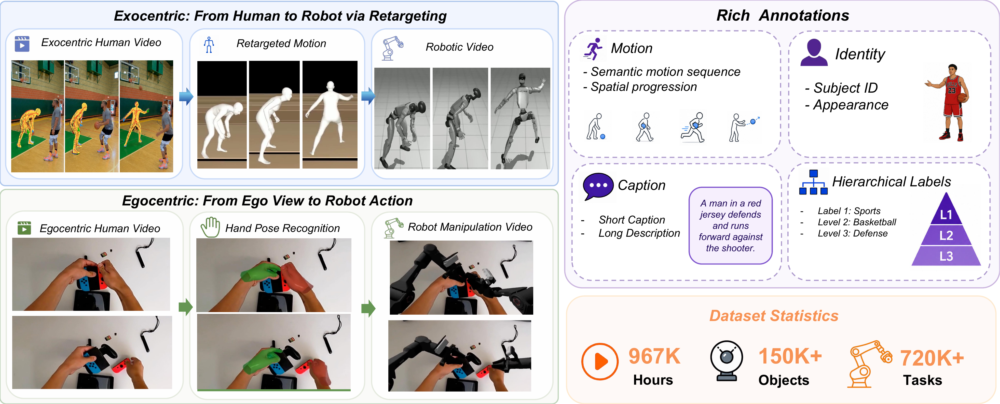
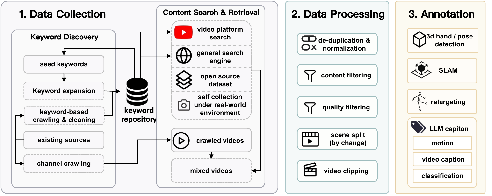
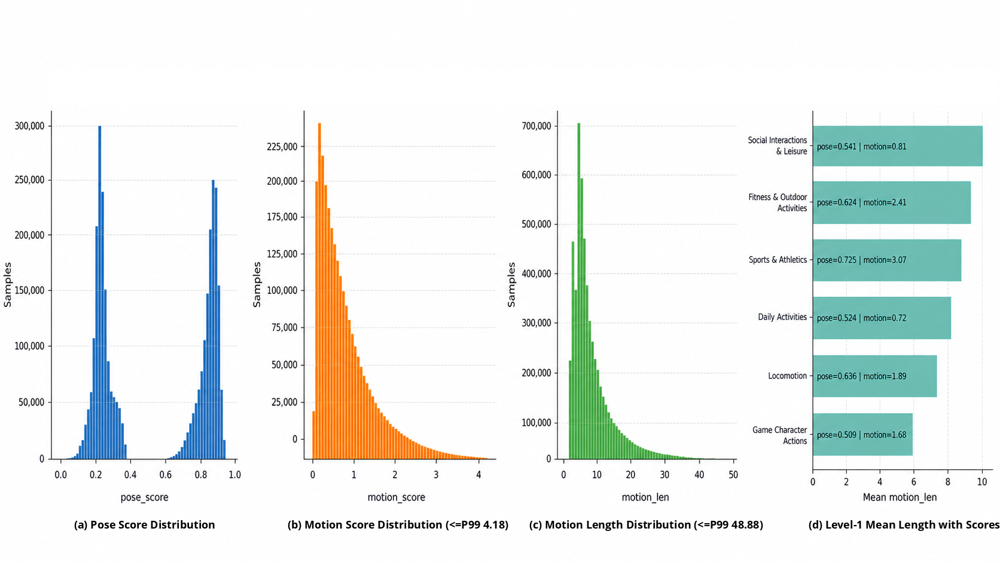

# HumanNet: Scaling Human-centric Video Learning to One Million Hours

#

# 基本信息

- arXiv: 2605.06747
- Authors: Yufan Deng, Daquan Zhou
- Categories: cs.CV, cs.RO
- 一句话结论：通过系统化策展构建百万小时人类中心视频语料库，并验证第一人称人类视频可作为机器人数据的可扩展替代来源。

#

# 研究问题

具身智能（Embodied AI）与视觉-语言-动作模型（VLA）的发展受限于物理交互数据的规模与多样性。现有机器人数据集通常仅有数百至数千小时，且高度依赖特定平台与控制接口，难以覆盖长尾场景与复杂交互。与此同时，互联网级人类视频虽规模庞大，却缺乏面向具身学习的结构化标注、物理相关性过滤与动作感知信号。

本文的核心问题是：**如何将海量异构的非结构化人类视频转化为可扩展、高质量、可直接支持具身基础模型预训练的结构化数据**，并严格量化其在 VLA 下游任务中的迁移价值。该问题直接关联 World Model 与 Embodied AI 的数据瓶颈，因为世界-动作模型（world-action model）需要动作条件化的前向动态（action-conditioned forward dynamics），而人类视频恰好提供了 actor-centered 观察与物理交互信号。

#

# 任务与挑战

具体任务包含两个层面：一是**数据策展**，即构建一个覆盖第一人称与第三人称视角、包含丰富物理交互的百万小时视频语料库；二是**下游验证**，即在固定的 VLA 架构与下游数据上，评估不同预训练源（人类视频 vs. 真实机器人数据）的迁移性能。

输入为异构互联网视频（含视频平台、搜索引擎、开源数据集与自采集数据），输出为带有结构化标注（3D 姿态、运动重定向、LLM 字幕、层级标签）的剪辑片段。训练/评测设定采用控制变量法：固定 LingBot-VLA 架构与 34 小时下游机器人交互数据（100 个任务，每任务 20 个片段），仅改变预训练初始化来源，在 5 个 held-out 任务组上测量验证损失。

已有方法不够好，原因在于：1）现有机器人数据规模小、采集成本高昂；2）现有人类视频数据集（如 Ego4D、EPIC-KITCHENS）在时长和场景广度上不足，且缺乏物理相关的密集标注；3）尚无工作在大规模控制实验中证明人类视频可系统性地替代真实机器人数据进行 VLA 初始化。

#

# 核心 Insight

本文的核心思想是：**数据策展本身即科学贡献**。与其在昂贵的机器人遥操作上线性扩展，不如将互联网上近乎无限的非结构化人类视频，通过以"物理相关性"为第一原则的策展流水线，转化为机器人可消费的预训练资源。这一范式强调四个设计原则：规模（Scale）、视角多样性（Viewpoint diversity）、物理相关性（Physical relevance）与预训练就绪性（Pretraining readiness）。

具体而言，HumanNet 通过双视角互补策略弥合人类与机器人之间的本体差距：第一人称（Egocentric）视频捕捉手部-物体接触、执行意图与操作细节，可直接迁移至机器人操作任务；第三人称（Exocentric）视频提供全身运动、场景上下文与多智能体交互，支持运动感知表征学习与跨本体迁移。两者结合，使模型能够同时学习"执行者中心"与"观察者中心"的物理结构。



#

# 方法与公式

HumanNet 的本质贡献并非新网络架构，而是**系统化的数据策展流水线**与**受控的下游验证协议**。整个系统分为语料构建与迁移实验两大部分。

#

## 1. 数据策展流水线（三阶段）

**阶段一：数据收集（Data Collection）**
以少量种子关键词启动，通过迭代扩展生成关键词库。基于关键词和视频平台搜索、通用搜索引擎、直接爬取、开源数据集以及自采集（第一/第三人称受控录制）进行多源检索。在源级别进行过滤，剔除离题、低质量或被动观察性内容，形成统一的混合视频池。

**阶段二：数据处理（Data Processing）**
- **去重与标准化**：消除近似重复副本，统一帧率、分辨率与容器格式。
- **内容过滤**：仅保留包含有意义人类动作与可观测运动的片段。
- **质量过滤**：丢弃具有严重运动模糊、重度遮挡、静态构图等缺陷的片段。
- **场景分割**：按视觉变化将长视频切分为语义连贯的片段，防止无关活动被合并。
- **视频剪辑**：输出固定粒度的训练片段。

**阶段三：标注（Annotation）**
- **3D 手部与身体姿态检测**：恢复细粒度运动结构。
- **单目 SLAM**：对满足稳定性与视差要求的第一人称片段估计相机轨迹。
- **运动重定向**：将恢复的人体运动对齐到统一的人形骨骼。仅当重定向误差满足

```math
e_{\mathrm{ret}} < 15\,\mathrm{mm}
```

且有效帧覆盖率满足

```math
r_{\mathrm{frame}} > 60\%
```

时，该片段被标记为 **robot-ready**。其中 $e_{\mathrm{ret}}$ 表示重定向后的关节位置误差，$r_{\mathrm{frame}}$ 表示成功重定向帧数占总帧数的比例。

- **LLM 辅助字幕生成**：并行生成视频字幕、运动描述与活动分类，并与源元数据对齐。



#

## 2. 下游 VLA 验证协议

为验证语料价值，作者设计了一个严格控变量的后训练实验：
- **固定架构**：LingBot-VLA。
- **固定下游数据**：100 个任务，每任务 20 个片段，总计 34 小时机器人交互数据。
- **唯一变量**：预训练初始化来源。

对比四种配置：
1. **Qwen VLM** 基线；
2. Qwen 经 100 小时真实机器人 CoBot 数据继续预训练；
3. Qwen 经 1,000 小时 HumanNet 第一人称视频继续预训练；
4. **LingBot**（其 Qwen 主干已在 20,000 小时真实机器人数据上训练）。

对于非 LingBot 配置，动作专家（action expert）均重新初始化。所有模型在相同下游数据上执行后训练，并在 5 个 held-out 任务组上测量验证损失。

原文信息不足以完整复原公式（如具体的损失函数或策略梯度公式），但实验的核心评估指标为验证损失 $\mathcal{L}_{\mathrm{val}}$，其比较逻辑可概括为：

```math
\mathcal{L}_{\mathrm{val}}(\theta_{\mathrm{ego1K}}) \approx \mathcal{L}_{\mathrm{val}}(\theta_{\mathrm{cobot100}}) \ll \mathcal{L}_{\mathrm{val}}(\theta_{\mathrm{qwen}})
```

其中 $\theta_{\mathrm{ego1K}}$、$\theta_{\mathrm{cobot100}}$、$\theta_{\mathrm{qwen}}$ 分别表示 1,000 小时第一人称预训练、100 小时机器人预训练与 Qwen 基线的模型参数。

#

# 贡献拆解

**贡献 1：百万小时规模与系统化策展范式**
- **做了什么**：构建了迄今最大的人类中心视频语料库 HumanNet（967K+ 小时），并提出了可审计、可扩展的三阶段数据策展流水线（收集-处理-标注）。
- **为什么有效**：通过将异构互联网视频转化为结构化、多层级标注的语料，解决了机器人数据规模不足与长尾覆盖缺失的问题。
- **和已有方法差别在哪里**：不同于 Ego4D、EPIC-KITCHENS 等仅提供数千小时且缺乏物理交互标注的数据集，HumanNet 将规模提升两个数量级，并引入机器人就绪（robot-ready）筛选与 LLM 辅助密集标注。

**贡献 2：面向具身学习的多轴分类与机器人就绪标注**
- **做了什么**：设计了超越单一任务标签的多轴分类体系（视角、环境、交互类型、运动模式、元数据可用性），并提供包含运动重定向、3D 手部/身体姿态、LLM 辅助字幕的丰富标注。
- **为什么有效**：多轴分类使数据可按下游任务灵活切片，而 robot-ready 子集（$e_{\mathrm{ret}}<15\,\mathrm{mm}$ 且 $r_{\mathrm{frame}}>60\%$）直接支持人-机运动迁移。
- **和已有方法差别在哪里**：现有数据集通常仅提供语义标签或稀疏姿态，HumanNet 则同时提供几何级（3D 姿态、SLAM、重定向）与语义级（字幕、运动描述、层级标签）标注，且明确对齐机器人运动学。

**贡献 3：人类视频替代机器人数据的直接实证**
- **做了什么**：通过控制 VLA 后训练实验表明，1,000 小时第一人称人类视频的验证损失可与 100 小时真实机器人数据相当，且在部分 held-out 任务组上更优。
- **为什么有效**：第一人称视频捕捉了与机器人操作高度相关的 actor-centered 线索（手部-物体接触、程序结构、执行意图），这些线索在固定架构下可有效迁移。
- **和已有方法差别在哪里**：先前工作（如 R3M、EgoMimic）多聚焦于表征迁移或对齐人类与机器人轨迹，而 HumanNet 首次在严格隔离数据变量的条件下，定量证明了大规模人类视频可作为机器人数据的**可扩展替代来源**而非仅补充。

#

# 关键图表解读

**图 1：数据集概览（figure-001-teaser.png）**
该图展示了 HumanNet 的双视角学习范式与丰富标注体系。左侧分为上下两支：上支为 Exocentric（第三人称）流程，从人类视频经运动重定向生成机器人运动；下支为 Egocentric（第一人称）流程，从第一人称视角经手部姿态识别映射到机器人操作视频。右侧展示了四类标注（Motion、Identity、Caption、Hierarchical Labels）与数据集规模统计（967K 小时、150K+ 物体、720K+ 任务）。读图时需注意，该图不仅展示规模，更强调**双视角互补**与**human-to-robot transfer** 的桥梁作用，这是数据集区别于通用视频语料的核心。

**图 2：数据流水线（figure-004-datapipeline-v2.png）**
该图清晰呈现了三阶段流水线：1）数据收集（关键词发现、多源爬取）；2）数据处理（去重、内容/质量过滤、场景分割、剪辑）；3）标注（3D 姿态、SLAM、重定向、LLM 字幕）。读图时应注意"Content Search & Retrieval"与"Self collection"的并列关系，说明语料不仅依赖互联网爬取，还包含受控环境下的自采集，这保证了特定长尾场景的覆盖。

**图 3：验证损失曲线（figure-005-loss.png）**
该图包含五个子图：(a) In-Domain Loss、(b) OOD Average Loss、(c) OOD Short-Horizon Loss、(d) OOD Long-Horizon Loss、(e) OOD Mobile-Manipulation Loss。横轴为训练步数（$\times 10^4$），纵轴为 Loss。四条曲线分别对应 cobot100h（100 小时机器人数据）、ego1000h（1,000 小时第一人称人类视频）、qwen（基线）与 lingbot（20,000 小时机器人基线）。读图关键：
- 绿色 lingbot 曲线始终最低，说明 20,000 小时真实机器人数据仍是上限；
- 蓝色 cobot100h 与橙色 ego1000h 曲线高度重合，且在多个 OOD 场景下 ego1000h 略低于 cobot100h，直接支撑"人类视频可替代机器人数据"的核心论点；
- 红色 qwen 基线收敛最高，说明通用 VLM 初始化不足以捕捉物理交互结构。
需注意，所有曲线在约 $4\times 10^4$ 步后趋于平稳，但 qwen 基线收敛位置明显偏高，表明预训练源对下游迁移具有决定性影响。


**图 4：数据统计分布（figure-002-statics.png）**
该图包含四个子图：(a) Pose Score Distribution（双峰分布，高置信度端集中）、(b) Motion Score Distribution（右偏分布，以低强度运动为主）、(c) Motion Length Distribution（短片段占绝大多数）、(d) Level-1 Mean Length with Scores（不同一级类别的平均长度与分数）。读图时应注意：
- (a) 的双峰结构说明质量过滤有效保留了高姿态置信度样本，同时剔除了低质量中间段；
- (b)(c) 的右偏与长尾特性表明语料以短程、聚焦的交互单元为主，同时保留少量长程程序片段；
- (d) 中 Sports & Athletics 与 Fitness & Outdoor 的平均运动长度显著高于 Daily Activities，说明类别间物理特性差异显著，支持"按下游任务灵活切片"的训练策略。



#

# 实验与消融

**实验设置**
- **数据集**：HumanNet（967K+ 小时），其中第一人称子集用于 VLA 验证。
- **基线**：Qwen VLM（通用视觉-语言基线）、Magic CoBot 100 小时真实机器人数据、LingBot（20,000 小时真实机器人数据）。
- **指标**：验证损失（Validation Loss）在 5 个 held-out 任务组上评估，包括 In-Domain、OOD Average、OOD Short-Horizon、OOD Long-Horizon、OOD Mobile-Manipulation。
- **控制条件**：固定 LingBot-VLA 架构，固定下游后训练数据（100 任务 $\times$ 20 片段 = 34 小时），仅改变预训练源。

**主结果**
1. **1,000 小时第一人称人类视频（ego1000h）≈ 100 小时真实机器人数据（cobot100h）**：在 In-Domain 与多个 OOD 任务组上，两者的验证损失曲线几乎重合，且在 OOD Long-Horizon 与 OOD Mobile-Manipulation 上 ego1000h 略优。
2. **显著缩小与大规模机器人基线的差距**：ego1000h 与 cobot100h 均显著优于 qwen 基线，且向 lingbot（20,000 小时）基线靠拢，说明人类视频可有效弥补机器人数据规模不足。

**最强证据**
在固定架构与固定下游数据的严格控变量实验中，1,000 小时第一人称人类视频在 5 个 held-out 任务组上的验证损失与 100 小时真实机器人数据持平，且在部分 OOD 场景下更优。该实验直接隔离了数据源变量，量化了人类视频对 VLA 后训练的迁移价值，是支撑"可扩展替代来源"结论的最直接证据。

**最存疑证据**
实验仅报告了**验证损失**，未报告实际机器人任务成功率、动作执行精度或 Sim-to-Real 性能指标。验证损失降低并不必然等价于物理执行能力提升。此外，对比存在**数据量不对称**（1,000 小时人类视频 vs. 100 小时机器人数据），尽管论文强调成本效益，但 10 倍量差使得"替代"结论的严格对等性受限。最后，实验仅验证了第一人称数据，而语料库包含大量第三人称数据，后者的直接下游增益未被量化。

#

# 局限性

1. **实验指标单一**：仅使用验证损失评估迁移效果，缺乏真实机器人任务成功率、动作执行误差或物理世界性能指标，无法完全证明预训练收益能转化为实际物理性能。
2. **数据量不对称**：控制实验中 1,000 小时人类视频与 100 小时机器人数据的对比存在 10 倍量差，虽然成本差异是论文论点之一，但严格来说两者并非"等数据量"替代关系。
3. **第三人称数据未验证**：论文包含大量 Exocentric（第三人称）视频，但控制实验仅验证了 Egocentric（第一人称）数据对 VLA 的增益。第三人称数据对全身运动迁移或 World Model 训练的直接价值未被量化。
4. **隐私与偏见**：百万小时规模的开放世界视频 inevitably 包含地理、社会经济、身体类型与活动偏见的覆盖盲区，且第一人称录制可能涉及旁观者、私人空间与敏感信息。论文虽提及伦理审查，但大规模 redaction 与偏见分析仍具挑战。
5. **本体差距（Embodiment Gap）**：人类手部/身体与机器人执行器在运动学、动力学与感知模态上存在本质差异，人类视频无法完全消除这一差距，尤其在需要精确力反馈或特定关节映射的任务中。

#

# 个人研究判断

**值得继续追踪。**

理由如下：
1. **基础设施价值**：HumanNet 不仅是数据集论文，更提出了面向具身学习的数据策展方法论。对于 World Model 研究而言，百万小时级、带有物理结构标注（3D 姿态、运动重定向、SLAM、程序边界）的双视角视频是训练动作条件化世界模型（action-conditioned forward dynamics）的稀缺资源。World Model 需要预测"动作导致的未来视觉状态"，而 HumanNet 的第一人称视频恰好提供了 actor-centered 观察与手部-物体接触信号，第三人称视频则提供场景级状态变化，两者结合可支撑跨视角的世界模型训练。
2. **人-机迁移的桥梁作用**：当前 World Models 与 VLA 的瓶颈在于机器人数据规模。HumanNet 证明了人类视频可作为低成本替代来源，这意味着未来可探索"人类视频预训练 World Model + 少量机器人数据微调策略"的范式，显著降低数据采集成本。
3. **长尾与多样性**：World Model 的泛化性依赖于对长尾物理交互的覆盖。HumanNet 的长尾活动分布（如折叠可变形物体、操作反光容器）为 World Model 提供了罕见但物理信息丰富的训练信号，有助于缓解 Sim-to-Real 中的分布偏移。

后续可重点关注：1）HumanNet 中第三人称数据如何与第一人称数据联合训练 World Model；2）人类视频与机器人数据的**最优混合比例**；3）基于该语料的 masked video modeling 或语言-视频对齐目标对世界模型动态预测能力的增益。
