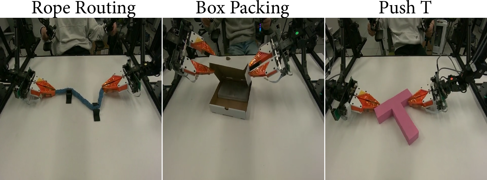
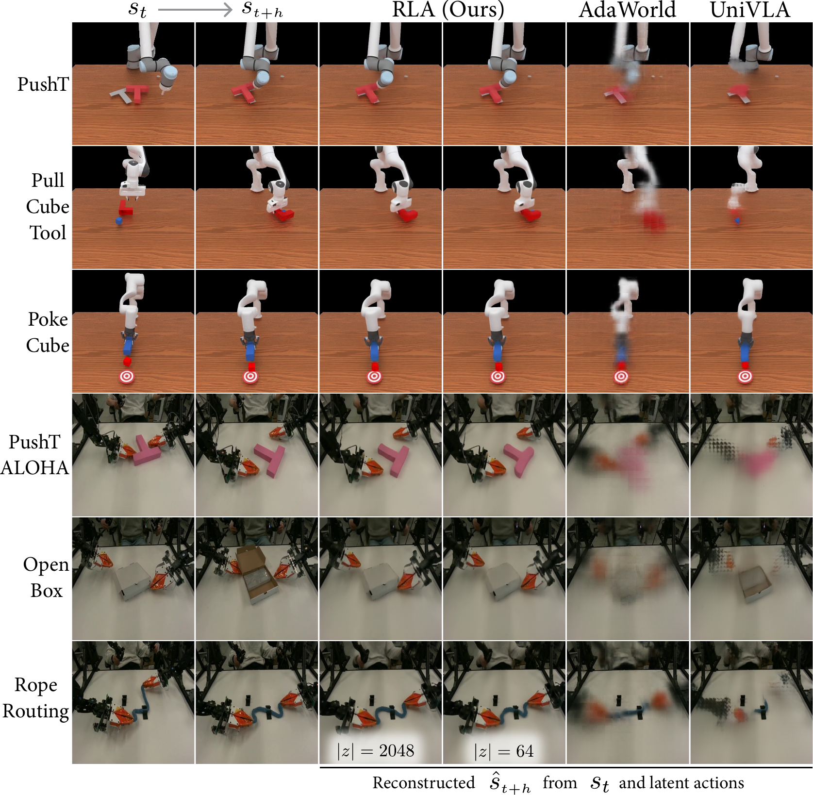
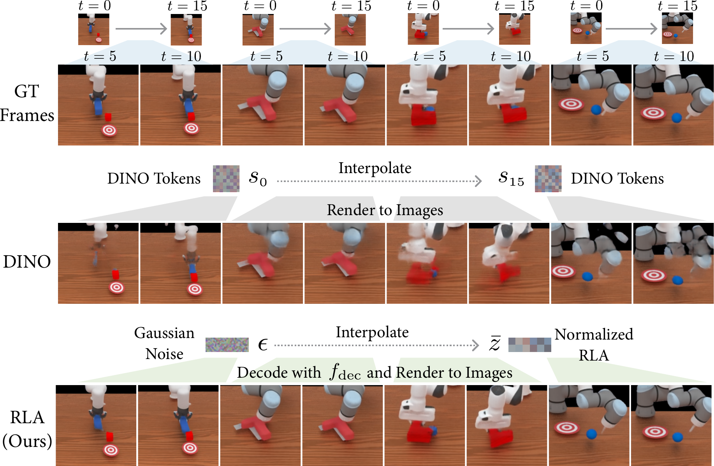
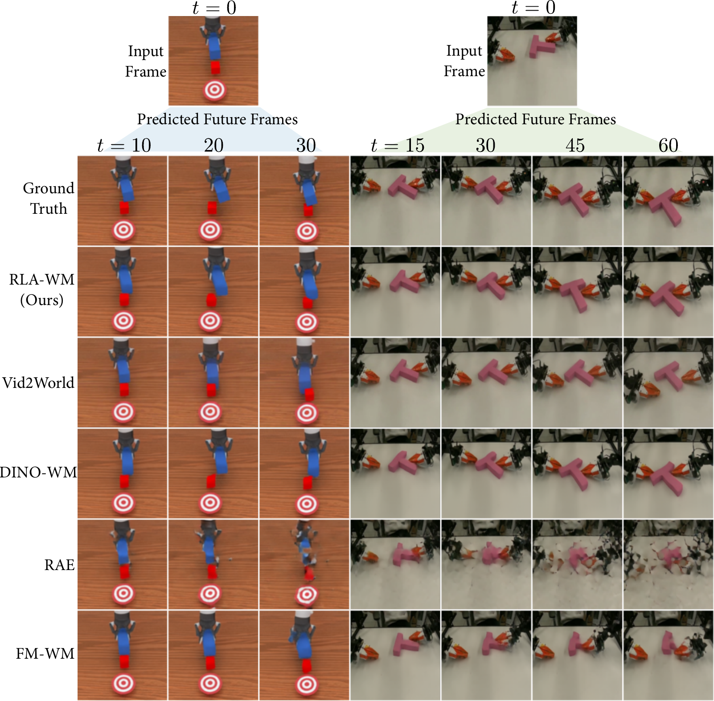

# Learning Visual Feature-Based World Models via Residual Latent Action

#

# 基本信息

- **arXiv**: 2605.07079
- **Authors**: Xinyu Zhang, Zhengtong Xu, Yutian Tao, Yeping Wang, Yu She, Abdeslam Boularias
- **Categories**: cs.CV, cs.AI, cs.LG, cs.RO
- **一句话结论**: 本文提出残差隐动作（RLA）及基于此的轻量级流匹配世界模型 RLA-WM，在视觉特征空间实现了高精度、高效率的未来状态预测，并支持从无动作视频中进行模仿学习与纯离线视觉强化学习。

#

# 研究问题

本文要解决的核心问题是：如何在视觉特征空间（DINO tokens）中构建兼具高效性与准确性的世界模型，以支持复杂三维机器人交互中的未来状态预测，并进一步赋能下游策略学习（模仿学习与强化学习）。这与 World Model、Embodied AI 及机器人控制密切相关——现有像素级视频扩散模型计算开销巨大且易产生幻觉，而直接在百万维视觉特征空间进行生成式建模又面临维度灾难。本文试图找到一条中间道路：保留特征空间的高效性与语义丰富性，同时获得生成式模型的多模态精度与长期预测能力。

#

# 任务与挑战

具体任务为：给定当前视觉特征 $s_t$ 和动作块 $a_{t:t+h}$，预测未来特征 $s_{t+h}$；并在下游执行两项应用——（a）利用无动作视频进行模仿学习（Minimalist WAM）；（b）在不接触真实环境的情况下，于世界模型内部完成视觉强化学习（WMRL）。

输入输出方面，模型接收 DINOv3 patch tokens $s_t \in \mathbb{R}^{L \times C}$ 与机器人动作块，输出未来 DINO tokens。训练与评测严格限定为仅使用离线视频，禁止在线交互、手工奖励函数或动作标签（下游 WAM 除外）。

已有方法存在明显不足：
- **DINO-WM** 采用直接回归，在复杂 3D 交互中预测迅速模糊甚至坍塌；
- **RAE / FM-WM** 直接在约 1M 维的 DINO 空间上做扩散或流匹配，计算量高达 14.3T FLOPs，且训练困难；
- **Vid2World** 等像素级视频扩散模型推理成本极高（1.1P FLOPs），并频繁出现物理不一致的幻觉。



#

# 核心 Insight

本文最核心的思想是：物理世界的有效动态本质上低维。与其在高维 DINO 特征空间直接预测未来状态，不如学习一个紧凑的残差隐动作（Residual Latent Action, RLA）来刻画从 $s_t$ 到 $s_{t+h}$ 的过渡。RLA 通过对 DINO 残差 $s_{t+h} - s_t$ 进行自编码器压缩得到， surprisingly 具备三大特性：

1. **预测充分性**：解码器 $f_{\mathrm{dec}}$ 可在单前向传播中，从紧凑的 RLA $z$ 与当前状态 $s_t$ 高精度重建未来特征 $s_{t+h}$，无需迭代生成。
2. **泛化性**：RLA 自编码器在跨机器人、跨任务的新场景上仍保持高重建保真度。
3. **时间拓扑性**：在 RLA 空间中对高斯噪声与目标 RLA 进行线性插值，解码后近似对应物理时间的中间帧，显示出良好的流形结构。

基于 RLA，作者进一步提出 **RLA-WM**：不在高维 DINO 空间直接生成，而是将流匹配完全限制在紧凑的 RLA 空间（2048 维）中进行，再通过解码器还原为未来 DINO 特征。这相当于把“高维特征预测”难题转化为了“低维残差插值”问题，既避免了像素级扩散的巨大开销，又解决了特征空间直接回归的模糊问题。



#

# 方法与公式

#

## 1. RLA 自编码器

编码器 $f_{\mathrm{enc}}$ 将 DINO 残差映射为紧凑隐动作：

```math
z = f_{\mathrm{enc}}(s_{t+h} - s_t)
\tag{1}
```

解码器 $f_{\mathrm{dec}}$ 联合当前状态 $s_t$ 与 $z$ 重建未来特征：

```math
\hat{s}_{t+h} = f_{\mathrm{dec}}(z, s_t)
\tag{2}
```

训练目标为 L1 与 MSE 重建损失的加和：

```math
\mathcal{L}_{\mathrm{AE}}
= \left\lVert \hat{s}_{t+h} - s_{t+h} \right\rVert_1
+ \left\lVert \hat{s}_{t+h} - s_{t+h} \right\rVert_2^2
\tag{3}
```

其中 $s_t, s_{t+h} \in \mathbb{R}^{L \times C}$ 为 DINO patch tokens，$z \in \mathbb{R}^{2048}$（由 32 个 token、每 token 64 维构成）。

#

## 2. RLA-WM 流匹配动力学

RLA-WM 不在高维 DINO 空间生成，而是在低维 RLA 空间执行条件流匹配。条件网络将 $s_t$ 与嵌入后的动作块 $a_{t:t+h}$ 编码为条件 token。流匹配网络接收条件 token 与噪声插值 $z_\tau$：

```math
z_\tau = \tau z + (1 - \tau) \epsilon,
\quad \epsilon \sim \mathcal{N}(0, I)
\tag{4}
```

其中 $\tau \in [0,1]$ 为流匹配时间变量，$z$ 为真实 RLA，$\epsilon$ 为标准高斯噪声。

网络预测速度 $\hat{v}$，监督目标为真实速度：

```math
v^* = z - \epsilon
\tag{5}
```

训练损失为 MSE：

```math
\mathcal{L}_{\mathrm{FM}}
= \left\lVert \hat{v} - v^* \right\rVert_2^2
\tag{6}
```

推理时，从 $z_0 = \epsilon$ 出发，通过 30 步 Euler ODE 积分得到 $z_1$：

```math
z_{\tau + \Delta \tau} = z_\tau + \Delta \tau \cdot \hat{v}
\tag{7}
```

最终 $z_1$ 经冻结的解码器 $f_{\mathrm{dec}}$ 还原为 $\hat{s}_{t+h}$。由于迭代生成始终限制在紧凑 RLA 空间，条件网络仅执行一次，整体推理非常轻量。

#

## 3. 极简世界动作模型（WAM）

在标准 BC-ResNet 策略上并联一个线性层预测 $\hat{z}$，利用预训练且冻结的 RLA 编码器从 $(s_t, s_{t+h})$ 提取目标 $z$。训练时联合优化动作预测与 RLA 预测；推理时丢弃 RLA 头，仅保留动作头，不增加任何推理开销。

#

## 4. 世界模型内强化学习（WMRL）

在 RLA-WM 内部执行 PPO rollout（300 步），使用 Video Aligned Reward（VAR）：

```math
r_t = - \lambda \left\lVert \hat{s}_t - s_t^{\mathrm{ref}} \right\rVert_1
\tag{8}
```

其中 $s_t^{\mathrm{ref}}$ 为参考离线视频帧的 DINO token，$\lambda = 5$ 为奖励缩放系数。策略初始化自 BC-ResNet，注入 LoRA 与残差动作头，完全无需在线交互、手工奖励或辅助 BC 损失。

#

# 贡献拆解

1. **残差隐动作（RLA）表示**：首次系统地发现 DINO token 残差可被无损压缩为具有时间拓扑结构的低维隐动作，为视觉动态建模提供了新的流形先验。与 AdaWorld、UniVLA 等隐动作方法不同，RLA 无需扩散或 VQ-VAE，单前向即可解码为未来特征。
2. **RLA-WM 架构**：将流匹配限制在紧凑 RLA 空间（2048 维），首次在特征世界模型中同时实现超越视频扩散的预测精度（LPIPS 0.071 vs Vid2World 0.199）与接近回归模型的推理效率（3.5T FLOPs，比 Vid2World 快约 300 倍）。
3. **极简 WAM**：仅需在 BC-ResNet 上增加一个线性层预测 RLA，即可从无动作视频中学习，平均成功率比纯 BC 基线提升 8.5%，在最难的 Push-T 任务上提升超过 11%。
4. **纯离线视觉 RL 框架（WMRL）**：首个完全在离线视频训练的世界模型内、仅通过视频对齐奖励进行 PPO 优化的视觉 RL 方法，在 XArm 与 UR10e 机器人上经 1500 种子大规模评估显著优于 BC 策略。

#

# 关键图表解读

**图1：RLA 时间拓扑性与重建质量（figure-010-predictive.png）**

该图对比了 DINO token 直接插值与 RLA 空间插值的定性效果。第一行 GT 展示四个任务的 $t=0$ 到 $t=15$ 真实帧。第二行显示：若直接对 DINO tokens $s_0$ 与 $s_{15}$ 进行插值并渲染，中间帧出现严重的物体畸变与语义漂移（如机械臂断裂、物体消失）。第三行显示：在 RLA 空间中对高斯噪声 $\epsilon$ 与归一化 RLA $\bar{z}$ 进行插值，再经解码器 $f_{\mathrm{dec}}$ 渲染，中间帧保持物体几何一致性与运动连贯性。这直观证明了 RLA latent space 编码了平滑的时间拓扑结构，且解码器具备单步高精度重建能力。

**图2：真实机器人任务与数据集（figure-011-iws.png）**

展示 IWS 数据集中三个最具挑战性的真实机器人任务：Rope Routing（双臂协同绕绳）、Box Packing（打开/关闭/搬运盒子）与 Push T（双臂推 T 型物）。这些任务涉及高频接触、可变形体与长程协同，对视觉世界模型的多模态预测与物理一致性提出极高要求。该图说明了本文方法不仅限于仿真，而是直接面向真实机器人操作场景。

**图3：世界模型长程预测定性对比（figure-000-topology.png）**

该图展示了从单帧输入出发的长程未来帧预测（Poke Cube 与 PushT ALOHA）。对比方法包括 Vid2World、DINO-WM、IWM、FM-WM。可见 RLA-WM（Ours）在长达 30–60 步的预测中仍能保持物体形状、机械臂姿态与接触关系的清晰一致；Vid2World 虽画面锐利但出现严重幻觉（物体位置错误）；DINO-WM 与 FM-WM 随时间推移迅速模糊；IWM 则出现物体解体。该图直接支撑了 RLA-WM 在复杂 3D 交互中的长期预测优势。

**图4：重建质量跨方法对比（figure-005-wm2.png）**

该图对比了从 $s_t$ 与隐动作重建 $\hat{s}_{t+h}$ 的效果，涵盖 PushT、Pull Cube Tool、Poke Cube 及 ALOHA 真实任务。RLA（Ours）在 $|z|=2048$ 甚至 $|z|=64$ 时仍能保持清晰的物体边缘与机械臂结构；而 AdaWorld 与 UniVLA 的重建结果严重模糊，物体细节丢失。这说明 RLA 作为隐动作具有更强的预测充分性，能够以极低维度保留未来状态的关键视觉-几何信息。

#

# 实验与消融

**数据集**：ManiSkill 仿真（Panda 8-DoF、XArm 7-DoF、UR10e 5-DoF，共 5 个任务）与 IWS 真实数据集（ALOHA 双臂，3 个任务）。

**基线**：DINO-WM（特征回归）、RAE（特征扩散）、FM-WM（特征流匹配）、Vid2World（像素级视频扩散）。

**指标**：LPIPS、SSIM、DINO L1 距离、推理 FLOPs。

**主结果**：
- RLA-WM 在 ManiSkill 上 LPIPS 为 0.071，显著优于 DINO-WM（0.156）与 Vid2World（0.199）；SSIM 达 0.931。
- 推理仅需 3.5T FLOPs，比 Vid2World（1.1P）低约 300 倍，比 FM-WM（14.3T）高效 4 倍以上。
- 在 IWS 上，RLA-WM 同样取得最佳或接近最佳的表现。

**消融与支撑**：
- **RLA 维度消融**：即使 $|z|=64$，RLA 仍保持较高重建质量（图 4），证明残差动态的低维本质。
- **WAM 消融**：RLA 作为隐动作，平均成功率比 BC 提升 8.5%，在最难的 Push-T 上提升超过 11%（15.2% vs 3.6%）。
- **WMRL 大规模评估**：1500 种子评估显示，WMRL 在 XArm（Poke Cube 95.9% vs BC 89.9%）与 UR10e（Roll Ball 73.1% vs 65.5%；PushT 20.7% vs 17.2%）上显著优于 BC。

**最强证据**：RLA-WM 在精度指标（LPIPS / SSIM）与计算效率（FLOPs）上同时超越所有基线，且定性对比显示其避免了视频扩散的幻觉与特征回归的模糊。

**最存疑证据**：WMRL 在 Panda 机器人上的两个任务（Pull Cube 74.1% vs BC 84.5%；Pull Cube with Tool 39.9% vs 41.1%）成功率低于 BC。作者归因于 Panda 8-DoF 动作空间更大但数据量未增加、前视顶角相机频繁遮挡、夹爪细小导致视觉细节缺失。这暗示该方法对高自由度、严重遮挡与有限数据的组合较为敏感，其鲁棒性边界尚未被充分验证。

#

# 局限性

1. **遮挡与部分可观测性**：RLA 仅从单帧对 $(s_t, s_{t+h})$ 学习，未显式建模历史信息。当物体因遮挡消失后重现，或视角变化时，模型难以准确推理。
2. **背景噪声与本体感受缺失**：任务无关的背景运动或相机抖动会被编码进 RLA，浪费表示容量；且世界模型仅预测视觉特征，不输出未来本体感受状态。
3. **Panda 机器人性能衰退**：WMRL 在 Panda 上表现弱于 BC，表明对高 DoF、遮挡严重、视觉细节微小的场景鲁棒性不足。
4. **数据规模限制**：实验刻意限制在小规模数据集（ManiSkill + IWS）以隔离方法增益，未验证在互联网规模或开放世界数据中的可扩展性。
5. **神经到仿真间隙（Neural-to-Sim Gap）**：RLA-WM 解码的图像与仿真器光线追踪图像存在风格差异，需通过 UNet 解码作为预处理来缓解，增加了计算开销并可能降低性能上限。

#

# 个人研究判断

面向“World Models assisting Embodied AI downstream tasks”的研究方向，这篇论文**值得继续追踪**。

理由如下：
1. **范式价值**：本文提出的 RLA 为视觉特征世界模型提供了一个新的“低维残差流形”先验，成功桥接了特征回归的高效性与生成式建模的多模态精度，这对后续 World Model 设计具有启发意义。
2. **下游应用突破**：极简 WAM 与纯离线 WMRL 显著降低了对仿真器、动作标注和奖励工程的依赖，为 scalable robot learning 提供了可行路径。
3. **可扩展空间**：RLA 目前仅基于 2D DINO 特征，若向 3D RLA、多帧时序记忆、视觉-本体感受联合建模方向延伸，有望解决当前遮挡、背景噪声与部分可观测性等瓶颈。
4. **效率优势**：相比像素级扩散，RLA-WM 的轻量级流匹配（3.5T FLOPs）更适合在真实机器人上部署与在线规划。

不过，需密切关注其在开放世界、大规模异构数据及高自由度平台上的泛化表现，以及 RLA latent space 的理论可解释性研究。

## 关键图表解读



*RLA 学习框架拓扑图，包含视觉编码、自注意力、Latent Action 与 Action 双分支输出，以及自编码器训练流程。*



*世界模型未来帧预测的 SOTA 定性对比，涵盖 Ground Truth、RLA-WM 及多个基线方法。*
