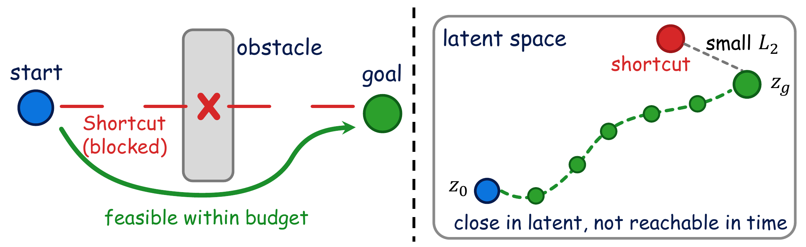
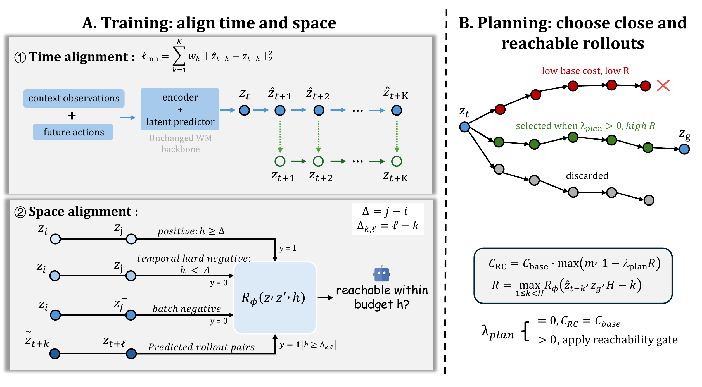
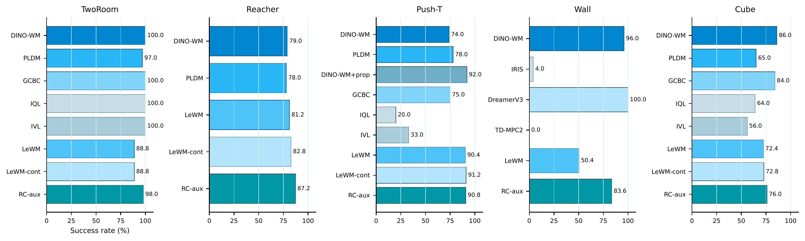
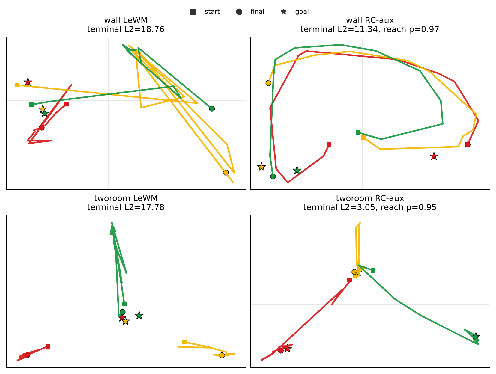

# Predictive but Not Plannable: RC-aux for Latent World Models

#

# 基本信息

- **arXiv:** 2605.07278
- **Authors:** Wenyuan Li, Guang Li, Keisuke Maeda, Takahiro Ogawa, Miki Haseyama
- **Categories:** cs.LG, cs.AI, cs.CV
- **一句话结论:** RC-aux 通过多步开环预测与预算条件可达性修正，使无重建潜世界模型从"可预测"走向"可规划"，在像素目标条件控制任务上以极小开销取得显著提升，尤其在障碍物约束任务上成功率提升超过 30 个百分点。

#

# 研究问题

论文要解决的核心问题是潜世界模型（latent world model）中"预测准确但规划困难"的结构性失配。在像素驱动的目标条件控制（goal-conditioned control from pixels）中，潜世界模型日益成为关键工具，但现有模型常在训练与测试之间存在时空失配：它们以局部单步预测为目标进行训练，却在测试时执行长程开环规划。这导致潜空间中的欧氏距离无法反映有限动作预算下的真实可达性，产生"潜空间捷径"（latent shortcuts）问题——规划器可能选中在潜空间接近目标但在物理环境中不可行的轨迹。本文与 World Model、Embodied AI 及机器人控制密切相关，研究如何在保持世界模型主干不变的情况下，通过轻量级辅助目标对齐潜空间的时序与几何结构，使模型真正服务于下游规划。

#

# 任务与挑战

具体任务为离线像素目标条件控制。输入为当前观测图像 $o_t$ 与目标图像 $o_g$，输出为动作序列 $a_{t:t+H-1}$。训练基于离线轨迹数据集 $\mathcal{D}=\{\tau^{(n)}\}$，其中 $\tau=(o_{1:T},a_{1:T-1})$；测试时，编码器将图像映射为潜状态 $z_t=e_\theta(o_t)$，规划器在潜空间中通过动作条件动态模型开环预测候选轨迹，并依据终端潜距离选择最优动作序列。

已有方法（如 LeWorldModel、DINO-WM、PLDM）虽能实现准确的短程潜状态预测，但面临两大挑战：
1. **时间失配**：训练时仅优化单步或短程预测误差，而测试时规划器需要评估多步开环 rollout，单步误差在多步传播中放大。
2. **空间失配**：潜空间中的欧氏距离 $\lVert z-z_g\rVert_2$ 是对称且无预算的，无法区分"最终可达"与"当前有限动作预算内可达"。在存在障碍物、不可逆动力学或接触约束的环境中，这会导致规划器被"潜空间捷径"误导。

#

# 核心 Insight

潜世界模型的规划能力不仅取决于预测精度，更取决于潜表示是否编码了下游搜索所需的时序与几何可达性结构。现有模型的"可预测但不可规划"（predictive but not plannable）现象源于两个耦合的失配：时间轴上，训练监督集中在短程预测，而规划器需要评估多步开环 rollout；空间轴上，潜空间欧氏距离是对称且无预算的，而真实规划需要非对称、预算条件的可达性谓词。



如上图所示，物理空间中被障碍物阻断的直线路径（shortcut）在潜空间中可能表现为 L2 距离很小的"伪近邻"。若规划器仅依据终端潜距离选择轨迹，便会选中实际不可行的"捷径"。RC-aux 的核心思想是在不修改世界模型主干的前提下，沿时间轴用多步开环预测直接对齐规划器查询的 rollout 分布，沿空间轴用预算条件可达性头（结合关键的时间硬负样本）强制潜空间编码"有限预算内是否可达"的时序几何结构。测试时，通过可达性感知规划器显式利用该信号，将基础终端潜距离 softly gate 于轨迹级可达性分数，筛选既靠近目标又在预算内可达的轨迹。

#

# 方法与公式

RC-aux 以无重建潜世界模型（实例化为 LeWM）为骨干，保留编码器 $e_\theta$ 与动作条件潜动态模型，但将训练监督重构为"规划对齐的双轴监督"。

**1. 时间对齐：多步开环预测**

从离线轨迹中采样片段，取上下文潜状态 $z_{t-L+1:t}$ 与未来动作 $a_{t:t+K-1}$。模型执行开环 rollout：将自身预测的潜状态递归输入动态模型，得到 $\hat z_{t+1:t+K} = F_\theta^{(K)}(z_{t-L+1:t}, a_{t:t+K-1})$。监督目标为对应编码观测得到的真实潜状态 $z_{t+1:t+K}$（不参与 rollout 输入）。

```math
\ell_{\mathrm{mh}}
=
\sum_{k=1}^{K}
w_k
\left\lVert
\hat z_{t+k}
-
z_{t+k}
\right\rVert_2^2
\tag{1}
```

其中 $\hat z_{t+k}$ 为第 $k$ 步开环预测潜状态，$z_{t+k}$ 为编码器对真实观测的编码，$w_k$ 为随 horizon 增加的权重。该损失直接训练模型在规划器实际查询的 rollout 长度上保持预测一致性，避免单步误差在多步传播中被放大。

**2. 空间对齐：预算条件可达性**

引入轻量可达性头 $R_\phi(z, z', h) = \sigma(r_\phi(z, z', h)) \in [0,1]$，估计从源潜状态 $z$ 到目标潜状态 $z'$ 在预算 $h$ 内是否可达。对于同轨迹对 $(z_i, z_j)$（$i<j$），轨迹偏移 $\Delta=j-i$，采样预算 $h \in \{0,\dots,H_{\max}\}$，构造轨迹诱导标签：

```math
y_{ijh}
=
\mathbf{1}[h \ge \Delta]
\tag{2}
```

- **可达正样本：** $h \ge \Delta$ 时标记为 1。
- **时间硬负样本：** $h < \Delta$ 时标记为 0。这是关键设计：它迫使模型对同一对 $(z_i, z_j)$ 在不同预算下给出不同预测，防止可达性头退化为仅区分"是否在同一条轨迹上"的平凡分类器。
- **批次负样本：** 跨轨迹对标记为 0。
- **预测 rollout 对：** 对开环预测得到的中间潜状态 $\tilde z_{t+k} = \operatorname{sg}(\hat z_{t+k})$（stop-gradient）与编码的未来目标 $z_{t+\ell}$ 构造对，偏移 $\Delta_{k,\ell}=\ell-k$，使可达性头校准于规划器实际查询的预测潜状态分布。

总可达性损失 $\ell_{\mathrm{reach}}$ 为编码对与预测对的加权 BCE 平均：

```math
\begin{aligned}
\ell_{\mathrm{reach}}
&=
\frac{1}{|\mathcal{B}_{\mathrm{enc}}|}
\sum_{(z,z',h,y)\in\mathcal{B}_{\mathrm{enc}}}
\omega_y\,
\ell_{\mathrm{bce}}(z,z',h,y)
\\
&\quad
+
\rho_{\mathrm{pred}}\,
\frac{1}{|\mathcal{B}_{\mathrm{pred}}|}
\sum_{(z,z',h,y)\in\mathcal{B}_{\mathrm{pred}}}
\omega_y\,
\ell_{\mathrm{bce}}(z,z',h,y)
\end{aligned}
\tag{3}
```

其中 $\ell_{\mathrm{bce}}$ 为二元交叉熵，$\omega_y$ 为可选的类别平衡权重，$\rho_{\mathrm{pred}}$ 控制预测潜状态监督的权重，$\mathcal{B}_{\mathrm{enc}}$ 与 $\mathcal{B}_{\mathrm{pred}}$ 分别为编码对与预测 rollout 对的集合。

最终 RC-aux 目标为：

```math
\ell_{\mathrm{RC\text{-}aux}}
=
\ell_{\mathrm{mh}}
+
\alpha \ell_{\mathrm{reg}}
+
\beta \ell_{\mathrm{reach}}
\tag{4}
```

其中 $\ell_{\mathrm{reg}}$ 为骨干原有的潜正则化（如 LeWM 的 SIGReg），$\alpha,\beta$ 为平衡系数。

**3. 测试时：可达性感知规划器家族**

对于候选动作序列 $\tau=a_{t:t+H-1}$，模型开环预测得到 $\hat z_{t+1:t+H}$。基础代价为终端潜距离：

```math
C_{\mathrm{base}}(\tau)
=
\left\lVert
\hat z_{t+H}
-
z_g
\right\rVert_2^2
\tag{5}
```

RC-aux 定义轨迹级可达性分数：

```math
R(\tau,z_g)
=
\max_{1\le k < H}
R_\phi
\left(
\hat z_{t+k},
z_g,
H-k
\right)
\tag{6}
```

最终规划代价为：

```math
C_{\mathrm{RC}}(\tau)
=
C_{\mathrm{base}}(\tau)
\cdot
\max
\left(
m,\,
1-\lambda_{\mathrm{plan}}R(\tau,z_g)
\right)
\tag{7}
```

其中 $m>0$ 为数值稳定性下限，$\lambda_{\mathrm{plan}}\in[0,1]$ 为可达性耦合权重。当 $\lambda_{\mathrm{plan}}=0$ 时退化为标准终端潜距离规划；当 $\lambda_{\mathrm{plan}}>0$ 时，高可达性轨迹获得代价折扣，低可达性轨迹则被惩罚。



#

# 贡献拆解

1. **轻量级规划对齐辅助目标 RC-aux**：在保持世界模型主干不变的前提下，首次联合修正了 rollout 长度不匹配与有限预算可达性几何不匹配两大问题。仅增加 3.74% 参数量与 <0.8 ms 的规划耗时，即可即插即用于任意潜世界模型主干。
2. **时间硬负样本机制**：通过在同轨迹对中引入预算不足的负样本（$h<\Delta$），使预算条件可达性头的预算变量 $h$ 可被识别，避免模型退化为仅区分同轨迹/跨轨迹对的视觉相似度分类器，从理论上保证了有限预算可达性的可学习性（附录 Proposition 2）。
3. **可达性感知规划器家族**：将训练时学习的可达性信号显式注入测试时搜索，通过软门控机制优先选择既靠近目标又在预算内可达的轨迹。消融实验表明，即使不使用该规划器（$\lambda_{\mathrm{plan}}=0$），仅训练目标本身即可带来显著提升，验证了表示学习的独立价值。

#

# 关键图表解读

**图 1：RC-aux 方法总览（figure-001-method.png）**

该图完整呈现了 RC-aux 的核心框架。左侧训练阶段分为时间对齐与空间对齐：时间对齐通过多步开环预测（蓝色链路）匹配真实编码潜状态（绿色虚线）；空间对齐通过预算条件可达性判别器 $R_\phi$ 处理正样本、时间硬负样本、批次负样本及预测 rollout 对。右侧规划阶段展示了三条候选轨迹：红色轨迹虽终端潜距离小但可达性低（low R），被排除；绿色轨迹因高可达性（high R）被选中；灰色轨迹因偏离目标被丢弃。读图时需注意，$\lambda_{\mathrm{plan}}$ 是控制可达性门控强度的关键超参，而 $C_{\mathrm{RC}}$ 的公式揭示了基础代价与可达性分数的耦合方式。

**图 2：潜在空间捷径示意图（figure-006-rc-aux-latent-shortcuts.png）**

该图直接图解论文核心动机。左侧物理空间中，起点到目标的直线路径被障碍物阻断（shortcut blocked），必须绕行；右侧潜空间中，该被阻断的捷径却表现为 L2 距离很小的"伪近邻"（small $L_2$）。此图解释了为何仅靠预测精度不足以保证可规划性：潜空间几何若不与有限预算可达性对齐，规划器必然选中不可行轨迹。读图时应注意，绿色虚线代表可行但弯曲的潜空间路径，说明 RC-aux 旨在将真实可达性结构嵌入潜空间，而非单纯追求预测误差最小化。

**图 3：五个任务主实验结果（figure-011-fig-old5-all-baselines.png）**

柱状图覆盖 TwoRoom、Reacher、Push-T、Wall、Cube 五个任务，对比了 DINO-WM、PLDM、GCBC、IQL、IVL、LeWM、LeWM-cont 与 RC-aux 的成功率。RC-aux 在 Wall 任务上表现最为突出（83.6% vs LeWM 50.4%），直接支撑了"障碍物约束任务最需要可达性修正"的论点。读图时需注意两点：一是 LeWM-cont 作为续训对照排除了额外训练轮数的干扰；二是 Push-T 上 RC-aux 与 LeWM-cont 几乎持平，说明在已处于高成功率的接触动力学任务中，空间对齐的边际收益有限。此外，DINO-WM 在 Wall 上高达 96.0% 的成功率表明基于外部预训练视觉编码器的方法具有优势，但 RC-aux 以远小的参数量（18.7M vs 42.2M）实现了有竞争力的性能。

**图 4：Wall 与 TwoRoom 潜空间轨迹诊断（figure-010-fig-latent-reachability-diagnostic-wall-tworoom-.png）**

该图通过 PCA 投影可视化潜空间中的实际 rollout 轨迹。LeWM 的终端潜距离大（Wall: 18.76, TwoRoom: 17.78）且轨迹发散；RC-aux 的终端潜距离显著更小（Wall: 11.34, TwoRoom: 3.05），且 reach probability 高达 0.97/0.95。读图时应注意，方块、圆点、星号分别代表起点、终点与目标，RC-aux 的终点几乎与目标重合，证明其潜空间几何确实将目标编码为可达状态。该图是 RC-aux 改善潜空间可达性结构的直接视觉证据。

#

# 实验与消融

实验在五个像素目标条件控制任务（TwoRoom、Reacher、Push-T、Wall、Cube）及 LIBERO-Goal 扩展上进行，以成功率为主要指标。本地 LeWM 家族对照包含 LeWM、续训控制 LeWM-cont 与 RC-aux，每组使用 5 个固定评估组（每组 50 episode）。此外在 LIBERO-Goal 上训练 OFT 风格动作头以测试表征迁移性。

**主结果**：RC-aux 在 5 项任务中的 4 项上显著优于 LeWM 家族基线。其中 **Wall 任务成功率从 50.4% 提升至 83.6%（+33.2%）**，是最强证据，因为 Wall 是典型的障碍物约束导航任务，直接暴露了"欧氏距离最近但路径被墙阻挡"的规划失效模式，验证了论文核心假设——有限预算可达性比预测精度更重要。在 LIBERO-Goal 上，RC-aux 表示迁移至 OFT 风格动作头后平均成功率从 0.712 提升至 0.812。

**消融实验**：通过设置 $\lambda_{\mathrm{plan}}=0$ 分离训练侧表征修正与测试时规划器修正。在 Wall 上，即使不使用可达性感知规划器，RC-aux 仍将从 50.4% 提升至 72.4%，说明训练目标本身已显著改善潜空间几何；加入规划器后进一步提升至 83.6%。TwoRoom 呈现类似模式（88.8% → 93.2% → 98.0%）。Reacher 则更多受益于规划器侧修正（81.2% → 87.2%）。

**最存疑证据**：Push-T 任务上 RC-aux（90.8%）相比续训对照 LeWM-cont（91.2%）出现 -0.4% 的轻微回落。Push-T 已处于高成功率平台期，且物体推动更依赖接触动力学与局部力闭合，而非长程可达性几何；这说明 RC-aux 对"障碍物/约束型任务"的增益远大于"精细接触型任务"，其空间对齐机制并非在所有场景下都能带来单调提升。

**计算开销**：RC-aux 仅增加 3.74% 参数量（18.034M → 18.710M），规划耗时增加 <0.8 ms/次，保持了 LeWM 的低成本优势。



#

# 局限性

1. **轨迹诱导标签的代理性**：可达性标签基于观测轨迹的时序偏移，而非真实 MDP 的最短路径可达性。若数据覆盖不足或行为策略高度次优，标签可能偏离真实可达性，论文未量化这种偏离对最终规划的敏感度。
2. **规划器门控过于简单**：测试时仅使用标量可达性的软门控（soft feasibility gate），缺乏完整的决策理论处理，如不确定性建模、风险敏感规划或可达性的概率解释。
3. **接触动力学任务增益有限**：Push-T 上未出现单调增益，暗示 RC-aux 对精细操作所需的物理约束捕捉不足，但论文未深入分析失败案例的物理原因。
4. **缺乏与拟度量学习的直接对比**：未与基于价值函数或拟度量（quasimetric）学习的表征方法（如 QRL、PcLast）进行直接对比，难以量化"预算条件可达性"相对于"连续距离学习"的边际优势与适用边界。

#

# 个人研究判断

面向"World Models assisting Embodied AI downstream tasks"的研究方向，本文值得持续追踪。理由如下：

- **问题定义精准**："可预测但不可规划"（predictive but not plannable）准确击中了当前潜世界模型在机器人控制中的痛点——预测精度与规划可靠性之间存在结构性鸿沟，而 RC-aux 以极低开销（+3.74% 参数，<0.8 ms 延迟）实现了规划对齐。
- **方法轻量且通用**：作为骨干无关的辅助目标，RC-aux 易于嵌入现有 VLA 或 World Model 框架（如 LeWM、DINO-WM、PLDM）作为几何对齐模块，对长程规划与目标条件控制具有直接实用价值。
- **对表示几何的启示**：论文明确指出，潜世界模型的价值不仅在于生成未来，更在于其潜空间是否为下游搜索编码了正确的时序与几何结构。这一观点对当前 World Model + Planning 的范式具有重要指导意义。
- **可扩展方向明确**：将预算条件可达性扩展至不确定性感知可达性、结合在线交互修正标签偏差、以及在更复杂的接触-rich 操作任务中验证鲁棒性，均为有潜力的后续研究方向。

不过，若读者的研究重心是接触-rich 的精细操作（如装配、拧螺丝），则需谨慎评估 RC-aux 的适用性，因为其在 Push-T 上的表现暗示该机制对接触动力学的建模帮助有限。总体而言，对于关注 World Model 表示几何与规划对齐的研究者，本文提供了直接且实用的范式。

## 关键图表解读



*Wall 与 TwoRoom 任务的潜在空间轨迹诊断图，对比 LeWM 与 RC-aux 的 terminal L2 和 reach probability。*
