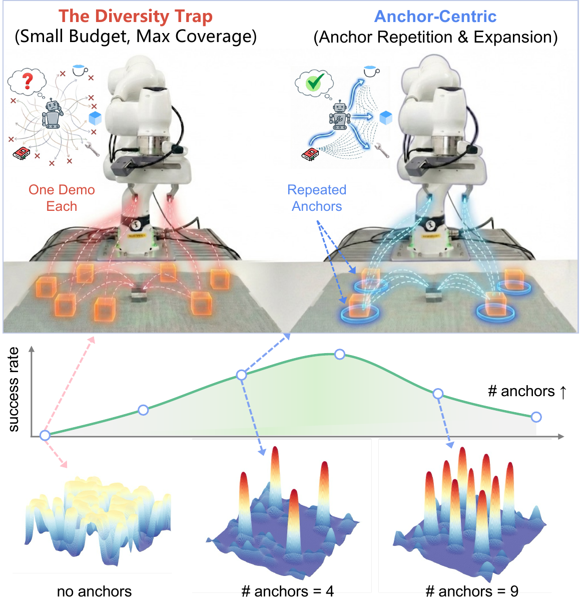
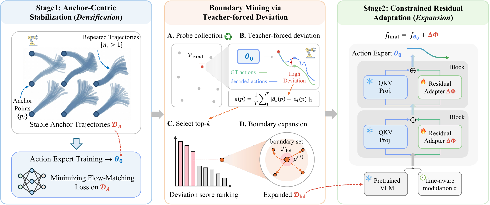
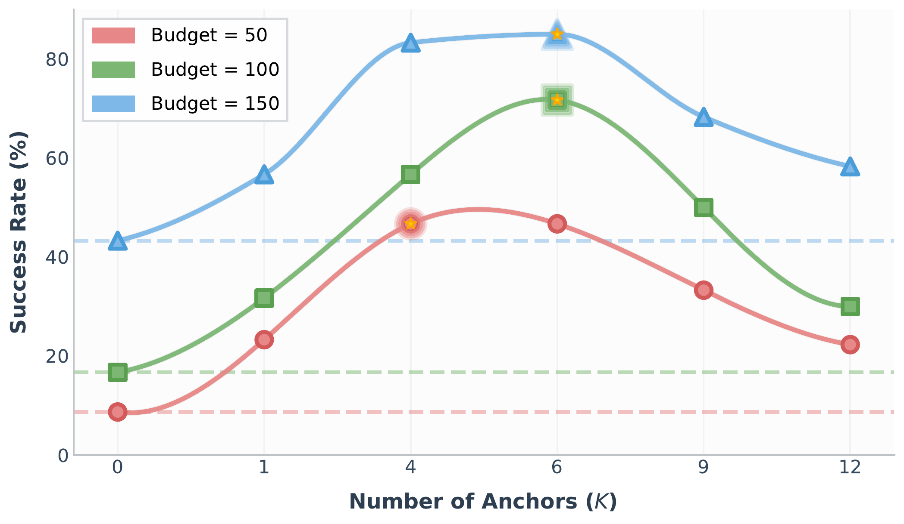
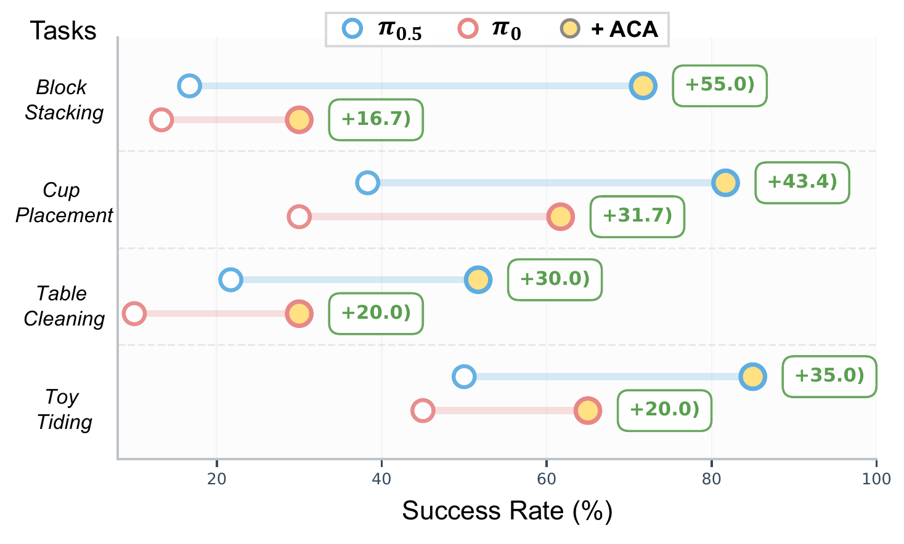

# Escaping the Diversity Trap in Robotic Manipulation via Anchor-Centric Adaptation

#

# 基本信息

- arXiv: 2605.07381
- Authors: Yanzhe Chen, Kevin Yuchen Ma, Qi Lv, Yiqi Lin, Zechen Bai, Chen Gao, Mike Zheng Shou
- Categories: cs.RO, cs.AI
- 一句话结论：在严格数据预算下，通过锚点中心的两阶段自适应框架（ACA）揭示并逃离“多样性陷阱”，将 VLA 模型在真实机器人上的平均成功率从 31.7% 提升至 72.5%。

#

# 研究问题

论文研究如何在极低数据预算（50–150 条真实机器人轨迹）下，将预训练的 Vision-Language-Action (VLA) 模型高效适配到特定硬件平台。核心科学问题是：在固定预算下，数据收集策略应如何平衡“条件覆盖范围”（coverage）与“局部样本密度”（density），以避免策略向量场因估计噪声而失稳。这与 Embodied AI 中 foundation model 的 post-training 和 sim-to-real 迁移密切相关。

#

# 任务与挑战

具体任务为四个真实桌面操作任务：Block Stacking、Cup Placement、Table Cleaning、Toy Tidying。输入为视觉观测和语言指令，输出为机械臂动作轨迹。训练设定在 Franka Panda 真机上进行，使用 leader-follower teleoperation 采集演示。挑战在于：1）真实世界演示成本高昂，预算极低；2）传统“最大化覆盖”的多样性采样导致每个条件的样本数过少，估计噪声无法收敛，策略在边界区域外推时崩溃；3）需要同时保证核心区域的稳定性和边界区域的泛化性。

#

# 核心 Insight

核心洞察是：在低预算下，盲目追求条件多样性会落入“多样性陷阱”（Diversity Trap），成功率随锚点数量增加呈倒 U 型变化。最优策略是“先重复、后扩展”——先在少量核心锚点上通过高密度重复采集构建稳定的策略骨架（policy skeleton），再针对高风险的边界区域进行局部扩展。



上图展示了两种范式的对比：左侧“多样性陷阱”将预算均匀分散到大量条件，每个条件仅一条轨迹，导致策略分布平坦、噪声大；右侧“锚点中心”策略通过重复采集锚点形成尖锐稳定的策略峰，再通过边界挖掘扩展覆盖。中部曲线揭示了成功率随锚点数量 $K$ 增加的倒 U 型关系，底部三维可视化展示了锚点数量从 0 增加到 9 时策略分布的变化。

#

# 方法与公式

#

## 理论框架：Coverage–Density Trade-off

作者将策略误差形式化为估计误差（密度）与外推偏差（覆盖）的权衡。设条件空间为 $\mathcal{P} \subset \mathbb{R}^d$，总预算为 $N$，分为 $K$ 个锚点，每个锚点重复 $n_i$ 次，满足 $\sum_{i=1}^K n_i = N$。

在回归目标 $y = f^\star(z, p, t) + \varepsilon$ 下，定义 fill distance：

```math
h := \sup_{p \in \mathcal{P}} \min_i \| p - p_i \|
\tag{1}
```

在 Lipschitz 条件（A1）、局部估计误差（A2）和最近邻代理（A3）假设下，最坏情况期望场误差有界：

```math
\sup_{p, z, t} \mathbb{E} \| \hat{f} - f^\star \| \le \underbrace{\max_{i} \mathbb{E} \| \hat{f}_i - f^\star_i \|}_{\text{Estimation (Density) Error}} + \underbrace{L h}_{\text{Extrapolation Bias}}
\tag{2}
```

对于准均匀锚点放置且均匀分配 $n_i = N/K$ 的情况，误差上界为：

```math
\mathcal{E}(K) \le C\sigma\sqrt{\frac{K}{N}} + L c K^{-1/d}
\tag{3}
```

其中 $C, c$ 为常数，$\sigma$ 为噪声水平，$L$ 为 Lipschitz 常数，$d$ 为条件空间维度。第一项随 $K$ 增加而增大（密度降低），第二项随 $K$ 增加而减小（覆盖改善）。

对 $\mathcal{E}(K)$ 求最小值，得到内部最优锚点数量：

```math
K^{\star} = \left( \frac{2 L c N^{1/2}}{d C \sigma} \right)^{\frac{2d}{d+2}} \propto \left( \frac{L^2 N}{\sigma^2} \right)^{\frac{d}{d+2}}
\tag{4}
```

此时最优误差率为 $\tilde O(\sigma^{\frac{2}{d+2}} L^{\frac{d}{d+2}} N^{-\frac{1}{d+2}})$。该结果表明，完全多样化采样（$K=N, n_i=1$）在噪声非零时是次优的，因为估计噪声项 $C\sigma$ 不会衰减。

为将场精度与任务行为关联，作者利用 Grönwall 不等式说明轨迹偏差可被放大：

```math
\|\hat z(T) - z(T)\| \le \frac{e^{\Lambda T}-1}{\Lambda} \cdot \delta(p)
\tag{5}
```

其中 $\Lambda$ 为场在状态 $z$ 上的 Lipschitz 常数，$\delta(p)$ 为场近似误差。这构成了两阶段方法的动机：先稳定核心，再修补边界。

#

## ACA 两阶段框架



**Stage 1：Anchor-Centric Stabilization（密度化）**

在工作空间内选取 $K$ 个稀疏核心锚点 $\{p_i\}_{i=1}^K$，每个锚点重复采集 $n_i > 1$ 条轨迹，构成高密度数据集 $\mathcal{D}_A$。冻结预训练 VLM，仅训练 Action Expert，通过最小化 flow-matching 损失得到稳定骨架参数 $\theta_0$：

```math
\theta_0 = \arg\min_{\theta}\; \mathbb{E}_{(a,p)\sim \mathcal{D}_{\mathrm{A}}}\!\left[\mathcal{L}_{\mathrm{FM}}(\theta; a,p)\right]
\tag{6}
```

**Boundary Mining：Teacher-Forced Deviation**

在候选条件集 $\mathcal{P}_{\text{cand}}$ 上采集 probe 轨迹（每个条件一条）。使用 teacher forcing 将演示观测序列输入 Stage 1 策略，解码预测动作 $\hat a_t(p)$，并与演示动作 $a_t(p)$ 计算 $L_1$ 偏差：

```math
e(p) = \frac{1}{T}\sum_{t=1}^{T} \left\lVert \hat a_t(p) - a_t(p) \right\rVert_{1}
\tag{7}
```

按 top-$k$ 规则选取偏差最大的条件作为边界集 $\mathcal{P}_{\text{bd}}$。这些 probe 轨迹被重用于 Stage 2，同时在 $\mathcal{P}_{\text{bd}}$ 附近局部采样额外轨迹，构成边界数据集 $\mathcal{D}_{\text{bd}}$。

**Stage 2：Constrained Residual Adaptation（扩展）**

冻结 $\theta_0$，在 Action Expert 中注入低秩适配（LoRA）残差分支 $\Delta_\phi$（rank=32, $\alpha$=32）。最终输出为加法形式：

```math
f_{\mathrm{final}}(z,p,\tau) = f_{\theta_0}(z,p,\tau) + \Delta_\phi(z,p,\tau)
\tag{8}
```

仅优化残差参数 $\phi$ 在 $\mathcal{D}_{\text{bd}}$ 上的 flow-matching 损失。LoRA 的零初始化确保训练起点严格等于 Stage 1 策略，将更新约束在低维子空间，防止核心区域漂移。

#

# 贡献拆解

1. **揭示“多样性陷阱”并形式化 Coverage–Density Trade-off**
   - 做了什么：首次指出在低预算 VLA 微调中，最大化覆盖的多样性采样会导致策略不稳定，成功率随锚点数量呈倒 U 型变化。
   - 为什么有效：通过将策略误差显式分解为估计误差与外推偏差，证明了固定预算下存在内部最优分配 $K^\star$，为数据收集提供了理论依据。
   - 与已有方法差别：不同于传统“多样性至上”的启发式，本文从理论上证明了重复采样的必要性。

2. **提出 Anchor-Centric Adaptation (ACA) 实用框架**
   - 做了什么：设计了两阶段流程——先通过锚点重复采集稳定策略骨架，再通过 teacher-forced deviation 挖掘边界，并用 LoRA 残差更新进行参数高效扩展。
   - 为什么有效：Stage 1 的高密度监督抑制了估计噪声；Stage 2 的残差更新在保持核心能力的同时局部修补边界，避免了全参数微调的灾难性遗忘。
   - 与已有方法差别：将主动学习中的误差驱动采集与参数高效微调结合，专门针对数据稀缺的机器人适配场景。

3. **在真实机器人上验证理论预测**
   - 做了什么：在 Franka Panda 上四个任务中，于 N=100 预算下将平均成功率从 31.7% 提升至 72.5%。
   - 为什么有效：真实硬件的非零噪声环境恰好符合理论假设，实验结果直接验证了 Coverage–Density 权衡的倒 U 型最优关系。
   - 与已有方法差别：大多数 VLA 自适应研究在仿真或大规模数据下进行，本文专注于极小规模预算的真实机器人部署。

#

# 关键图表解读

**图 1：Diversity Trap 与 Anchor-Centric 概念对比**


该图是论文的总览图。上半部分通过机器人示意图对比了两种数据收集范式：左侧红色路径表示“多样性陷阱”下的稀疏单条采样，策略向量场混乱；右侧蓝色路径表示锚点重复与扩展，策略稳定。下半部分展示了成功率随锚点数量变化的倒 U 型曲线，以及对应的策略分布三维地形图。读图时应注意：无锚点时策略平坦（无监督信号）；锚点过少（如 4 个）时核心区域形成稳定峰值；锚点过多（如 9 个）时预算分散导致峰值降低，验证了理论最优解的存在。

**图 2：ACA 方法架构**


该图详细展示了 ACA 的完整流程。左侧 Stage 1 显示在锚点上重复采集轨迹并训练 Action Expert 得到 $\theta_0$。中间 Boundary Mining 通过 Probe Collection、Teacher-forced Deviation、Top-$k$ 选择和局部扩展四步识别高风险边界。右侧 Stage 2 展示在冻结的 QKV 投影旁添加 LoRA 残差适配器 $\Delta\Phi$，实现约束更新。读图时应注意数据流向：边界挖掘的 probe 轨迹被回收用于 Stage 2，体现了预算的高效利用。

**图 3：锚点数量的倒 U 型曲线**



该图是理论分析的关键实验验证。横轴为锚点数量 $K$，纵轴为成功率，三条曲线分别对应预算 $N=50, 100, 150$。所有曲线均呈现先上升后下降的倒 U 型，且最优 $K$ 随预算增加而右移（$N=50$ 时最优约 4，$N=150$ 时最优约 6）。读图时应注意：$K=0$ 对应无锚点的随机采样，性能极低；超过最优值后，增加锚点反而降低成功率，直接证明了“多样性陷阱”。

**图 4：跨任务与跨模型性能增益**



该图展示了 ACA 在四个任务上相对于 $\pi_{0.5}$ 和 $\pi_0$ 基线的提升。蓝色空心圆表示基线，黄色实心圆表示加 ACA 后的性能，绿色框标注绝对增益。读图时应注意：ACA 在所有任务上均带来显著提升，其中 Block Stacking 提升最大（+55.0 个百分点），表明该方法对需要精确几何定位的任务尤为有效。

#

# 实验与消融

**数据集与设定**

实验在 7-DoF Franka Panda 真机上进行，配备 front/rear RealSense D435 及 wrist-mounted D405。使用 leader-follower teleoperation 采集演示。评估指标为 Region-Level Success Rates：S@1（核心 25% 区域）、S@2（中等 50% 区域）、S@3（近边界 90% 区域），每个区域每任务评估 20 次。

**主结果（表 1）**

在 $N=100$ 预算下，ACA 平均成功率达 72.5%，较多样性基线（31.7%）提升 40.8 个百分点。即使在 $N=50$ 时，ACA（46.3%）也接近基线在 $N=150$ 时的表现（52.9%）。在 Block Stacking 任务中，ACA 在 S@3 区域从基线的 0% 提升至 13/20（65%），证明了边界扩展的有效性。

**消融实验**

1. **锚点数量（图 3）**：验证了倒 U 型趋势和预算依赖的最优 $K$。
2. **锚点空间分布**：在 $N=100, K=6$ 下测试了 Center Rect、Circular、Top-Left 等布局。所有锚点配置均优于基线， centralized 布局（a, b）表现最佳，说明最小化最大外推距离比几何图案更重要。
3. **边界挖掘与残差更新（表 2）**：仅加残差更新（无挖掘）平均 58.8%；仅加挖掘（无残差，全参数微调）平均 64.2%；两者结合达 72.5%。说明误差驱动挖掘和残差约束具有协同效应。
4. **锚点预算比例 $N_A$**：在 $N=100$ 下，$N_A=80$ 时整体最优（72.5%），$N_A=100$ 时核心区域最好但边界下降，验证了保留部分预算用于边界扩展的必要性。
5. **跨模型兼容性（图 4）**：ACA 在 $\pi_0$ 和 $\pi_{0.5}$ 上均一致提升，且与更强的基线 $\pi_{0.5}$ 协同产生更大绝对增益。

**最强证据**

$N=100$ 时平均成功率 +40.8% 的绝对提升，以及成功率随 $K$ 变化的倒 U 型曲线，最直接地证明了“多样性陷阱”和 ACA 的有效性。

**最存疑证据**

理论预测的最优锚点标度律 $K^\star \propto N^{d/(d+2)}$ 未在实验中与真实最优 $K$ 进行严格的定量拟合验证；此外，实验仅在桌面操作任务上进行，未涉及长程或动态接触丰富的场景。

#

# 局限性

1. **理论假设的理想化**：分析依赖最近邻代理假设（A3），将深度策略理想化为最近邻查询器，与神经网络实际的光滑插值行为存在差距。虽然附录讨论了稳定插值器扩展，但核心标度律未在真实策略上严格验证。
2. **实验场景有限**：任务局限于桌面级静态操作，未涉及长程组合任务、动态接触或移动操作。边界挖掘的 top-$k$ 规则较为简单，未与更复杂的主动学习采集函数（如 BALD、不确定性估计）进行系统对比。
3. **预算与锚点数量的离散性**：理论给出的 $K^\star$ 是连续优化结果，而实际实验中 $K$ 为离散值，且最优 $K$ 的实验搜索范围较窄（$K \in \{0, \dots, 12\}$）。
4. **可复现性与硬件依赖**：真机实验依赖特定硬件配置（Franka Panda + RealSense）和 teleoperation 采集，不同操作者的演示质量可能引入差异，论文未报告采集者间差异。

#

# 个人研究判断

面向“World Models assisting Embodied AI downstream tasks”的研究方向，这篇论文**值得继续追踪**。

理由如下：

1. **问题定义精准**：它抓住了 foundation model 落地机器人时最核心的瓶颈之一——数据预算极低时的自适应策略。提出的 Coverage–Density Trade-off 不仅适用于 VLA，也可迁移到 World Model 的微调或 adapter 设计中。
2. **方法论可扩展**：ACA 的两阶段框架（核心稳定 + 边界残差更新）与 World Model 中的“先学稳定动力学核心，再扩展罕见事件边界”思路高度同构。特别是 teacher-forced deviation 作为一种轻量级外推风险估计器，可用于 World Model 的误差边界检测。
3. **理论-实验对齐**：尽管理论假设理想化，但真机实验确实复现了预测的倒 U 型趋势，说明其捕捉到了真实物理系统中的某种统计机制。后续可探索将锚点原则扩展到 World Model 的状态空间覆盖，或结合模型预测控制（MPC）进行在线锚点发现。

不过，若后续研究希望直接基于本文构建 World Model，需注意本文聚焦于条件空间 $p$（几何位姿）的覆盖，而非状态-动作空间的时序覆盖。将 ACA 扩展到时间维度或语义条件空间（如多任务指令）将是极具潜力的方向。
