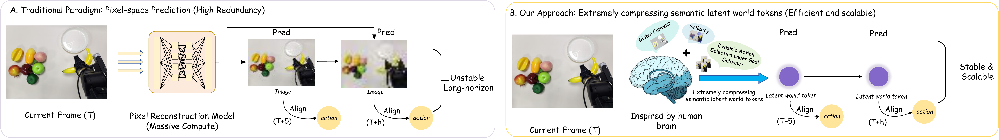
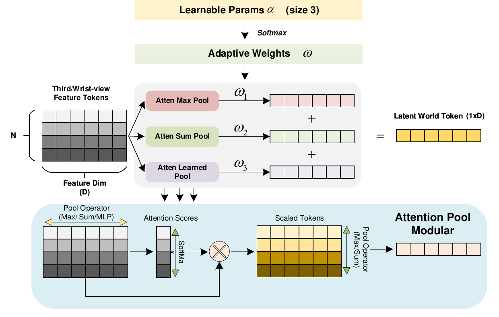
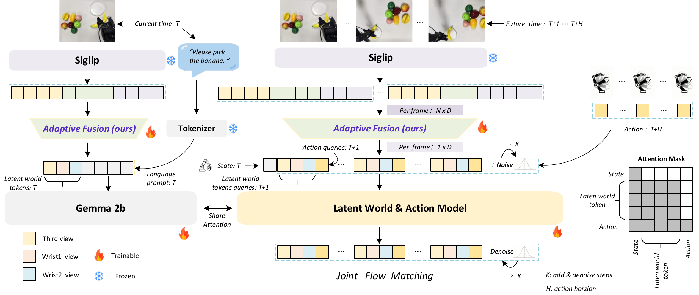
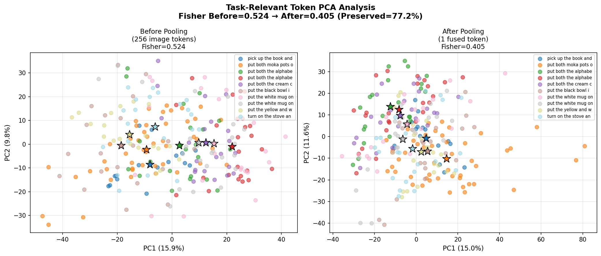

# One Token Per Frame: Reconsidering Visual Bandwidth in World Models for VLA Policy

#

# 基本信息

- **arXiv**: 2605.07931
- **Authors**: Zuojin Tang, Shengchao Yuan, Xiaoxin Bai, Zhiyuan Jin, De Ma, Gang Pan, Bin Liu
- **Categories**: cs.CV, cs.AI
- **一句话结论**: 在冻结预训练VLA主干的轻量适配范式下，通过Adaptive Attention Pooling将每帧视觉带宽压缩至单语义token，并与动作轨迹在联合流匹配目标下共同生成，可显著提升长程操作性能。

#

# 研究问题

论文要解决的核心问题是：在冻结预训练VLA主干、仅能以少量参数（如LoRA）进行适配的受限预算下，如何设计附加的世界模型模块才能有效支持长程控制？这一问题可拆解为两个子问题：

1. 世界模块的逐帧视觉带宽究竟需要多大？是否必须维持高分辨率像素流或密集token表示？
2. 压缩后的潜在流应如何与动作生成有效耦合，而非作为高成本的副产品或独立解码的旁路输出？

这与VLA、World Model和Embodied AI密切相关。现有工作通常假设世界模型需要高视觉带宽（每帧数百token的像素级或密集特征预测），但本文挑战了这一假设，首次系统性地探索了在生成式VLA上附加紧凑世界模块的设计空间，并证明极端压缩不仅可行，而且在特定训练机制下反而更有利。

#

# 任务与挑战

**具体任务**：语言条件下的机器人长程操作任务，涵盖仿真环境（MetaWorld MT50、LIBERO四套件）和真实机器人（Piper机械臂的Pick Banana、Fold Cloth、Pull Drawer）。

**输入输出**：输入为多视角图像（第三人称与双腕部视角）、语言指令、机器人状态；输出为未来动作序列及未来潜在世界token流。

**训练/评测设定**：基于预训练 $\pi_0$ (2B) 主干，仅引入14.71M LoRA参数，训练30K步（8×A800）。评测覆盖不同规划horizon（$H \in \{5,10,25,30\}$）及鲁棒性测试（光照偏移、位置扰动、未知干扰物）。

**已有方法不够好的原因**：
- **像素级世界模型**（如WorldVLA、DreamVLA）：每步计算量随图像分辨率 $N$ 和规划horizon $H$ 快速增长，在受限适配预算下难以扩展；预测目标被光度细节主导，而非控制相关动态。
- **高带宽视觉流**：在冻结主干+LoRA的受限预算下，将每帧数百token的视觉流输入世界模型，导致潜在表示与动作生成耦合松散，且长程展开时误差累积严重。
- **潜在空间世界模型**（如Dreamer、JEPA）：多在独立RL或自监督流程中开发，未有效迁移到预训练生成式VLA的适配场景。

#

# 核心 Insight

核心思想在于：世界模型在VLA中的角色应该是"为动作生成提供结构先验"，而非"重建未来像素"。因此，视觉带宽可以被极度压缩到每帧单token，只要压缩后的语义潜在流与动作轨迹在统一目标下联合演化。

具体而言，作者提出**瓶颈-展开耦合（bottleneck-rollout coupling）**：
1. **瓶颈（Bottleneck）**：通过Adaptive Attention Pooling将每视角每帧压缩为单token，使世界模块的每步token预算与图像分辨率解耦，仅随horizon线性增长。
2. **展开（Rollout）**：通过联合流匹配目标，让未来潜在token流与动作序列在同一Transformer生成器内共同去噪，使潜在动态成为动作生成的结构先验，而非通过独立解码器产生的副产品。



上图清晰展示了传统范式（A）与本文范式（B）的本质差异：传统方法在像素空间进行高冗余预测，长程展开不稳定且计算成本随horizon急剧上升；本文方法受人类大脑启发，将每帧压缩为单一语义潜在token，在紧凑潜在空间中预测，实现稳定且可扩展的长程规划。

#

# 方法与公式

OneWM-VLA包含两个相互依赖的组件：**Adaptive Attention Pooling**（瓶颈）和**Joint Flow Matching over Latents and Actions**（展开）。

#

## 1. Adaptive Attention Pooling

对于每个视角 $i \in \{r, w_1, w_2\}$，首先使用冻结的PaliGemma编码器 $\mathcal{E}_\phi$ 提取特征：

```math
\mathbf{X}_i \;=\; \mathcal{E}_\phi(\mathbf{I}_i) \;\in\; \mathbb{R}^{B\times T\times N\times D}
```

其中 $N=256$ 为每帧原始视觉token数，$D$ 为隐藏维度。

**多策略token池化**：使用三种互补的打分函数 $\phi_m$ 评估每个token的显著性：

```math
\phi_{\mathrm{Max}}(\mathbf{x}) \,=\, \max_{d}\, x^{(d)}, \quad
\phi_{\mathrm{Sum}}(\mathbf{x}) \,=\, \sum_{d=1}^{D} x^{(d)}, \quad
\phi_{\mathrm{Learn}}(\mathbf{x}) \,=\, Q_\theta(\mathbf{x})
```

分别对应通道维度的峰值响应、总响应，以及由视角专属小型MLP $Q_\theta$ 输出的任务感知响应。

每种打分函数经温度 $\tau$ 的softmax得到token级权重：

```math
w_m^{(n)} \;=\; \frac{\exp\!\bigl(\phi_m(\mathbf{x}_i^{(n)})/\tau\bigr)}{\sum_{j=1}^{N}\exp\!\bigl(\phi_m(\mathbf{x}_i^{(j)})/\tau\bigr)}
```

并聚合为三个pooled token。其中 $\mathrm{Max}$ 分支使用加权取最大，$\mathrm{Sum}$ 与 $\mathrm{Learn}$ 分支使用加权求和：

```math
\mathbf{p}_{\mathrm{Max}} \,=\, \max_{n}\bigl(w_{\mathrm{Max}}^{(n)}\,\mathbf{x}_i^{(n)}\bigr), \qquad
\mathbf{p}_{m} \,=\, \sum_{n=1}^{N} w_{m}^{(n)}\,\mathbf{x}_i^{(n)}, \;\; m\in\{\mathrm{Sum},\mathrm{Learn}\}
```

**自适应视图融合**：通过可学习标量 $\boldsymbol{\alpha}\in\mathbb{R}^{|\mathcal{M}|}$ 经softmax归一化得到固定融合权重 $\boldsymbol{\beta}$，将三个pooled token凸组合为单token：

```math
\mathbf{Z}_i \;=\; \sum_{m\in\mathcal{M}} \beta_m\,\mathbf{p}_m, \qquad
\beta_m \;=\; \frac{\exp(\alpha_m/\tau)}{\sum_{m'\in\mathcal{M}}\exp(\alpha_{m'}/\tau)}
```

输出 $\mathbf{Z}_i \in \mathbb{R}^{B\times T\times 1\times D}$。由于每视角仅贡献1 token，世界模块的每步token预算与图像分辨率 $N$ 解耦。



#

## 2. Joint Flow Matching over Latents and Actions

将未来动作序列 $a\in\mathbb{R}^{H\times D_a}$ 与未来潜在token序列 $z\in\mathbb{R}^{H\times D_z}$ 纳入同一概率路径。采用最优传输直线插值：

```math
x^a_t \,=\, t\,\epsilon_a + (1-t)\,a, \qquad
x^z_t \,=\, t\,\epsilon_z + (1-t)\,z, \qquad
t\sim\mathrm{Beta}(1.5,1)
```

对应的目标速度场为恒定向量：

```math
u^a_t \,=\, \epsilon_a - a, \qquad u^z_t \,=\, \epsilon_z - z
```

Transformer的输入序列为交错结构：当前token（当前帧的各视角 $\mathbf{Z}_i$、语言 $l$、机器人状态 $s$）与未来噪声查询 $\{x^{z_i}_{t+k}, x^a_{t+k}\}_{k=1}^{h}$ 交错排列。模型 $v_\theta$ 同时输出动作分支与潜在分支的速度预测，训练目标为：

```math
\mathcal{L} \;=\; \lambda_a\,\mathbb{E}\!\left[\left\lVert v^a_\theta - u^a_t \right\rVert_1\right] \;+\; \sum_{i\in\{r,w_1,w_2\}}\!\lambda_i\,\mathbb{E}\!\left[\left\lVert v^z_\theta - u^z_t \right\rVert_1\right]
\tag{1}
```

其中 $\lambda_a=1.0$，$\lambda_i=0.1$。由于两分支共享同一Transformer并在self-attention中共同演化，潜在流直接构成动作生成的结构先验。推理时，所有模态从高斯噪声联合去噪，仅动作流被执行。



#

# 贡献拆解

1. **单语义token极限压缩**：首次系统论证了在冻结主干+轻量适配的VLA范式中，世界模块的逐帧视觉带宽可以降低到单token而不损害长程控制性能。反直觉地发现，在固定训练预算下，增加每帧token数（1→12）反而导致成功率单调下降，说明单token在此机制下起到了有效的隐式正则作用。
   - *为什么有效*：极度压缩迫使模型丢弃光度细节，保留与控制相关的语义结构；同时低维潜在空间降低了联合生成器的优化难度。
   - *和已有方法差别*：不同于像素级预测（WorldVLA等）或固定降采样，本文通过任务感知的自适应池化实现语义保留的极限压缩。

2. **瓶颈-展开耦合（Bottleneck-Rollout Coupling）设计范式**：提出Adaptive Attention Pooling实现极限压缩，并通过联合流匹配实现潜在动态与动作生成的内生耦合。
   - *为什么有效*：瓶颈使联合目标在长程上可计算；联合目标反过来为瓶颈提供控制相关的监督信号，避免压缩后的token与动作生成脱节。
   - *和已有方法差别*：已有方法常将未来帧预测作为动作预测的副产品或通过独立解码器连接，本文则在单一模型内联合生成，使潜在流成为动作的结构先验。

3. **在仿真与真实机器人上的一致增益**：在MetaWorld MT50、LIBERO-Long及真实Piper机械臂的长程可变形操作（Fold Cloth）上均显著超越 $\pi_0$ / $\pi_{0.5}$ 基线。
   - *为什么有效*：单token设计使长程展开的每步计算量与图像分辨率解耦，仅随horizon线性增长，从而在长程任务上保持稳定。
   - *和已有方法差别*：在相同2B主干和极小适配预算（14.71M LoRA）下，超越了更大规模的 $\pi_{0.5}$ (3B)模型。

#

# 关键图表解读

**图1：传统范式 vs 本文范式（figure-003-motivation-new.png）**

该图通过左右对比直接呈现论文核心动机。左侧（A）展示传统像素空间预测范式：高带宽视觉流输入Pixel Reconstruction Model，导致每步计算量巨大（Massive Compute），长程展开时图像逐渐模糊（Unstable Long-horizon）。右侧（B）展示本文范式：受人类大脑启发，将每帧压缩为单一语义潜在世界token，结合全局上下文（Global Context）、显著性（Saliency）和目标引导的动态动作选择（Dynamic Action Selection under Goal Guidance），在潜在空间进行预测，实现Stable & Scalable的长程规划。读图关键：注意"Pred"箭头在潜在空间中是紧凑的紫色圆点，而非像素图像，这直观体现了"视觉带宽"的压缩。

**图2：OneWM-VLA整体架构（figure-001-onewm-vla.png）**

该图展示了完整的数据流与模型结构。上方：当前帧（T）经Siglip编码后通过Adaptive Fusion压缩为潜在世界token；未来帧（T+1...T+H）同样编码压缩。中间：当前状态token（含各视角、语言prompt、机器人状态）与未来噪声查询交错输入Latent World & Action Model（基于Gemma 2b）。右侧Attention Mask显示State、Latent world token、Action之间的注意力关系。下方：通过Joint Flow Matching进行K步加噪与去噪，最终输出动作序列。读图关键：注意"Per frame: N×D"到"Per frame: 1×D"的压缩，以及"Share Attention"机制，这是实现联合生成的核心。

**图3：Adaptive Fusion模块（figure-004-onewm-adaptive.png）**

该图详细揭示了Adaptive Attention Pooling的实现。输入为N个token（Feature Dim D），经过三个并行的Attention Pool分支（Max Pool、Sum Pool、Learned Pool），每个分支内部先计算Attention Scores，经Softmax后与输入相乘得到Scaled Tokens，再通过Pool Operator（Max/Sum/MLP）聚合。三个分支的输出经可学习参数 $\boldsymbol{\alpha}$（size 3）Softmax得到的Adaptive Weights $\boldsymbol{\omega}$ 加权融合，最终得到1×D的Latent World Token。读图关键：注意"Learnable Params α"和"Adaptive Weights ω"，这体现了"自适应"的本质——不同池化策略的权重是通过学习得到的，而非手工设计。

**图4：任务相关Token PCA分析（figure-002-pca-analysis.png）**

该图用定量可视化支撑"每帧视觉带宽可压缩至单token而不损害任务相关性能"的结论。左图：Pooling前256个image token的PCA分布，Fisher Ratio=0.524。右图：Pooling后1个fused token的PCA分布，Fisher Ratio=0.405，保留了77.2%的判别信息。读图关键：观察两类图中不同颜色（代表不同任务）的聚类结构。尽管从256 token压缩到1 token，各类别的中心（星形标记）相对位置关系基本保持，说明类间判别结构得以保留。这解释了为什么极端压缩不会破坏控制性能。

#

# 实验与消融

**数据集与设定**：
- **MetaWorld MT50**：50项操作任务，分Easy/Medium/Hard/Very Hard四档，评估 $H \in \{5,10,25,30\}$。
- **LIBERO**：四套件（Spatial/Object/Goal/Long），使用**单一训练checkpoint**，仅通过小验证网格调整每套件的推理action horizon与replan step。
- **真实Piper机械臂**：6-DoF平行夹爪，测试刚性抓取（Pick Banana）、长程可变形操作（Fold Cloth）与铰接物体（Pull Drawer），各20次试验，并附加光照偏移、位置扰动与未知干扰物测试。

**主结果**：
- MetaWorld MT50：平均成功率从 $\pi_0$ 的47.9%提升至61.3%（$H=30$ 时从37.98%提升至53.13%）。
- LIBERO-Long：达到95.6%，对比 $\pi_0$ 的85.2%和 $\pi_{0.5}$ 的92.4%。
- 真实Fold Cloth：达到60.0%，对比 $\pi_0$ 的20.0%和 $\pi_{0.5}$ 的25.0%。

**消融实验（Q1-Q5）**：
- **Q1（单token是否足够）**：在MetaWorld $H=30$ 上，每视角token数从1增加到12，成功率反而从53.13%单调降至20.54%，且全token（256）直接OOM。作者认为在30K步LoRA训练预算下，小latent起到隐式正则作用。
- **Q2（自适应池化是否必要）**：静态平均池化在LIBERO上平均下降20.5 pts；移除融合逻辑（No fusion logic）平均下降45.7 pts。在MetaWorld上，单独使用Max/Sum/Learn分支均不如三者组合（61.30% vs 22.38%-55.19%）。学习到的融合权重约为 $\beta_{\mathrm{Learn}} \approx 0.48\text{--}0.57$，$\beta_{\mathrm{Max}} \approx 0.20\text{--}0.28$，$\beta_{\mathrm{Sum}} \approx 0.20\text{--}0.28$。
- **Q3（语义空间 vs 像素空间）**：语义压缩（53.13%）显著优于像素空间压缩（35.85%），在Hard任务上差距最大（40.0% vs 22.0%）。
- **Q4（联合生成是否优于单纯增加容量）**：移除latent分支（No latent branch）下降15.05 pts；保留latent输入但移除latent损失（No latent loss）下降36.62 pts。说明latent监督不仅是辅助损失，而是耦合动态预测与动作生成的关键。
- **Q5（优势如何随horizon scaling）**：在MetaWorld上，OneWM-VLA的优势随horizon增长而扩大。$H=30$ 时比 $\pi_0$ 高15.15 pts，而 $H=10$ 仅高5.50 pts。$\pi_0$ 和 $\pi_{0.5}$ 随horizon增长性能下降，而OneWM-VLA保持稳定。

**最强证据**：真实Piper机械臂的长程可变形任务Fold Cloth（表3）。该任务涉及连续接触与细粒度交互，最能体现长程规划与动态预测的价值。OneWM-VLA达到60.0%，而 $\pi_0$ 仅20.0%，且在有观测噪声时优势进一步扩大（40.0% vs 0.0%）。

**最存疑证据**：每帧token数消融（表4）显示从1 token增加到12 token成功率单调下降。虽然作者将其归因于"小latent作为隐式正则化"，但在30K步LoRA训练预算下，这一反直觉结果可能受限于训练不充分，未必能推广到更长训练或更大适配预算的场景。此外，MetaWorld $H=10$ 时OneWM-VLA对 $\pi_0$ 的提升（+5.50 pts）显著小于 $H=5$（+17.31）和 $H=30$（+15.15），这一非单调趋势未被解释；联合消融中"No latent branch"的Hard任务成功率（66.00%）竟高于完整模型（60.00%），作者仅报告总体均值下降，未解释该反常。

#

# 局限性

1. **实验范围局限**：所有结论限定于 $\pi_0$ (2B) 单一主干、30K步LoRA适配预算及中等感知复杂度的操作任务。单token的反直觉优势（更多token更差）可能高度依赖于当前训练不充分的状态，作者也承认更长训练或更大预算下结论可能变化。
2. **理论论证不足**：论文主要通过实证消融支撑"单token足够"的结论，但未从信息论或表示学习角度给出压缩下界的理论分析。Fisher Ratio仅保留77.2%，剩余23%信息损失对哪些任务关键尚不明确。
3. **可复现性与算力依赖**：虽然仅训练14.71M LoRA参数，但实验需要8×A800 GPU，且真实机器人实验的20次试验统计量较小，方差估计不可靠。
4. **泛化性未充分验证**：未在更高视觉复杂度（如杂乱背景、非刚性物体大规模形变）或不同VLA主干（如OpenVLA、RDT）上验证。附录中提到的"perceptual settings beyond the ones considered here"正是作者自己指出的未解决问题。
5. **注意力掩码与交错序列设计的细节缺失**：论文对Latent World & Action Model内部的具体注意力掩码设计（图2右侧虽有示意，但正文中缺乏对latent token与action token交互机制的详细说明）和交错序列的构造方式描述较为简略，复现存在一定模糊性。

#

# 个人研究判断

面向"World Models assisting Embodied AI downstream tasks"的研究方向，这篇论文**值得继续追踪**。

理由如下：
1. **问题定义精准**：它抓住了当前VLA+World Model领域的一个关键工程痛点——在冻结主干+轻量适配的实际部署约束下，世界模型的视觉带宽与动作生成如何高效耦合。这种"受限预算"设定非常贴近工业界落地场景。
2. **设计范式有启发性**：瓶颈-展开耦合（Bottleneck-Rollout Coupling）不仅是一个具体模型，更是一种可迁移的设计思想。后续研究可将此范式扩展到其他主干（如Diffusion Policy、RDT）或结合更复杂的记忆机制（如token memory、KV cache压缩）。
3. **反直觉发现激发深入思考**：单token优于多token的现象，尽管可能受限于训练预算，但它提示我们重新审视"世界模型是否需要高保真视觉"这一前提。这对后续研究如何分配计算资源（压缩vs预测）具有指导意义。
4. **明确的延伸空间**：论文在Limitations中已指出未来方向——结合轻量token记忆机制以进一步降低长程推理的每步成本。这正是World Model领域的前沿方向之一。

不过，建议读者在跟进时重点关注：该结论在更大规模训练、更大backbone（如7B以上VLA）以及更高视觉复杂度任务（如室内导航、户外操作）上的迁移性验证。若单token设计在这些场景下依然成立，将可能重塑VLA世界模块的设计范式。

## 关键图表解读



*任务相关token的PCA分析，对比Pooling前后（256 token vs 1 token）的类间判别信息保留程度。*
