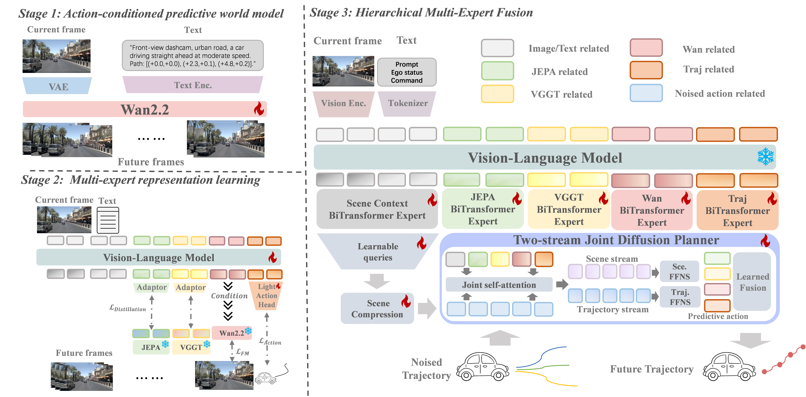
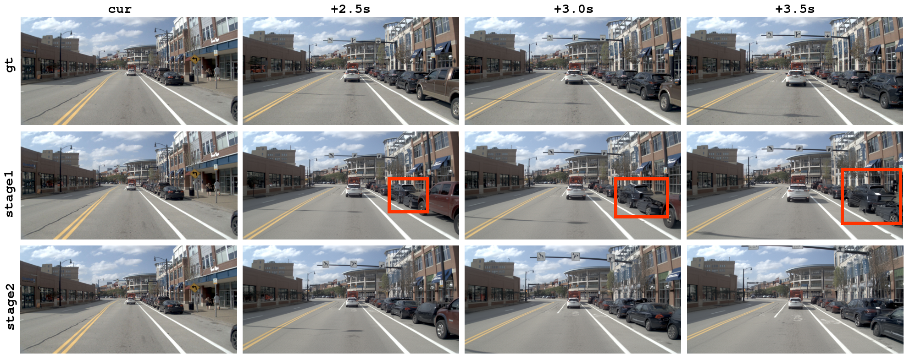
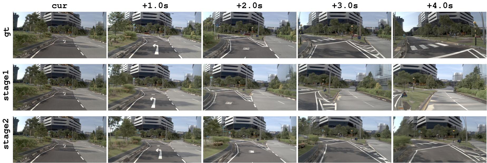
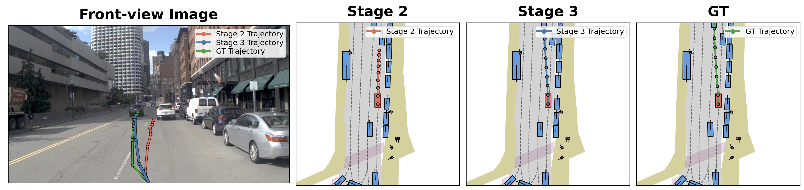

# CoWorld-VLA: Thinking in a Multi-Expert World Model for Autonomous Driving

#

# 基本信息

- arXiv: [2605.10426](http://arxiv.org/abs/2605.10426v1)
- Authors: Minqing Huang, Yujiao Xiang, Zihan Liang, Jiajie Huang, Jingqi Wang, Zhi Xu, Feiyang Tan, Hangning Zhou, Mu Yang, Gong Che
- Categories: cs.CV, cs.AI

#

# 研究问题

CoWorld-VLA: Thinking in a Multi-Expert World Model for Autonomous Driving

#

# 任务与挑战

Vision-Language-Action (VLA) models have emerged as a promising paradigm for end-to-end autonomous driving. However, existing reasoning mechanisms still struggle to provide planning-oriented intermediate representations: textual Chain-of-Thought (CoT) fails to preserve continuous spatiotemporal structure, while latent world reasoning remains difficult to use as a direct condition for action generation. In this paper, we propose CoWorld-VLA, a multi-expert world reasoning framework for autonomous driving, where world representations serve as explicit conditions to guide action planning. CoWorld-VLA extracts complementary world information through multi-source supervision and encodes it into expert tokens within the VLA, thereby providing planner-accessible conditioning signals. Specifically, we construct four types of tokens: semantic interaction, geometric structure, dynamic evolution, and ego trajectory tokens, which respectively model interaction intent, spatial structure, future temporal dynamics, and behavioral goals. During action generation, CoWorld-VLA employs a diffusion-based hierarchical multi-expert fusion planner, which is coupled with scene context throughout the joint denoising process to generate continuous ego trajectories. Experiments show that CoWorld-VLA achieves competitive results in both future scene generation and planning on the NAVSIM v1 benchmark, demonstrating strong performance in collision avoidance and trajectory accuracy. Ablation studies further validate the complementarity of expert tokens and their effectiveness as planning conditions for action generation. Code will be available at https://github.com/potatochip1211/CoWorld-VLA.

#

# 核心 Insight

这篇论文的核心价值需要结合原文继续复查。当前 fallback 笔记保留了日报分析、DeepResearch 草稿和已筛选图表，避免自动流程中断。

#

# 方法与公式

DeepResearch 未生成；请回看论文正文中的方法章节与关键公式。

#

# 贡献拆解

- 关键术语：未提取
- 加权评分：3.1/5.0

#

# 关键图表解读

*Fallback selection because visual JSON selection failed.*

*Fallback selection because visual JSON selection failed.*

*Fallback selection because visual JSON selection failed.*

*Fallback selection because visual JSON selection failed.*

#

# 实验与消融

请优先核对主结果表、消融实验和真实/仿真任务设置；若图表已选中，应结合上方图片逐项复查。

#

# 局限性

当前自动精读未能成功调用完整图文生成模型，因此局限性需要结合原文实验设置进一步人工确认。

#

# 个人研究判断

若该论文与 World Models assisting Embodied AI、VLA、robot policy 或 sim-to-real 强相关，建议进入人工精读队列。
