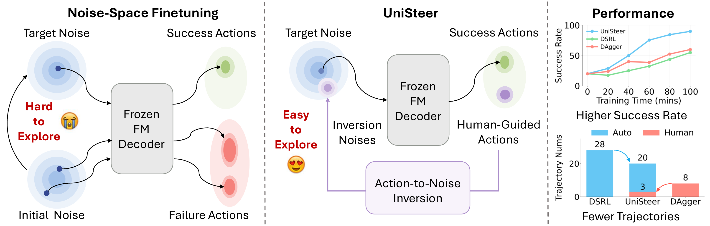
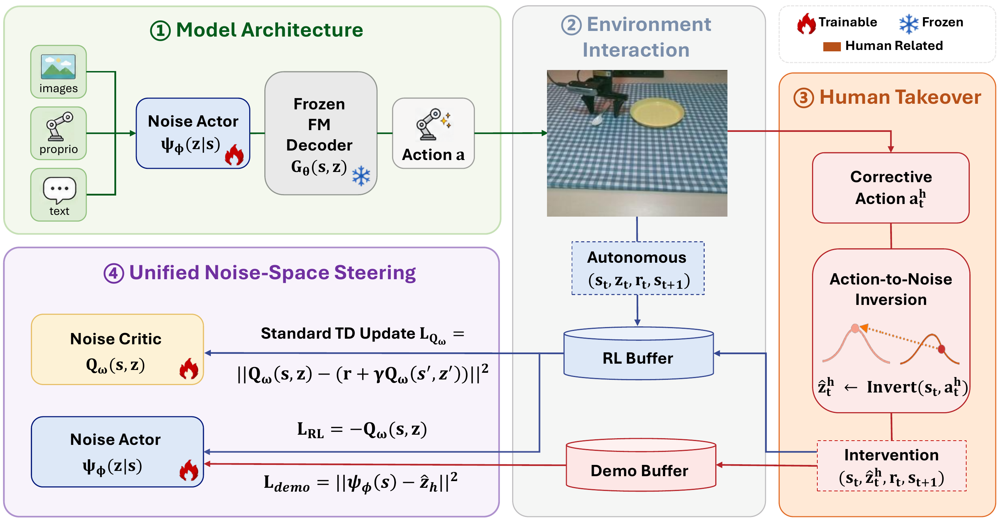
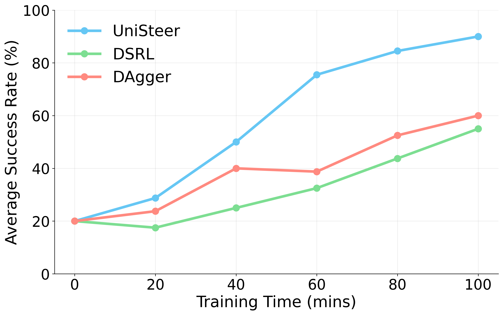
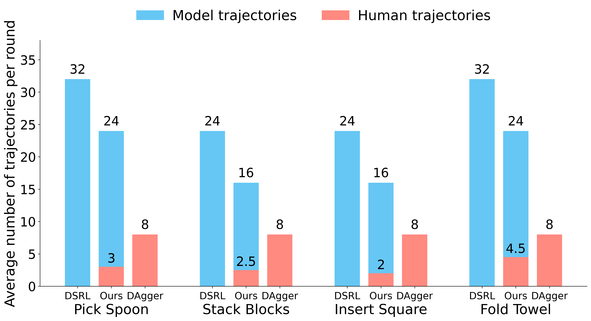

# Unified Noise Steering for Efficient Human-Guided VLA Adaptation

#

# 基本信息

- **arXiv**: 2605.10821
- **Authors**: Junjie Lu, Xinyao Qin, Yuhua Jiang, Kaixin Wang, Chuheng Zhang, Bin Liang, Jun Yang, Min Xu, Li Zhao
- **Categories**: cs.RO
- **一句话结论**: 通过近似动作到噪声的反演（Action-to-Noise Inversion），将人类纠正动作映射为噪声空间监督信号，并与噪声空间在线强化学习统一，实现冻结流匹配VLA的高效真实世界适配。

#

# 研究问题

论文聚焦于**基于流匹配（Flow Matching）的Vision-Language-Action（VLA）模型在真实世界部署时的分布偏移问题**。尽管预训练VLA策略具备强大的生成先验，但在面对新场景、新物体位姿或接触动力学变化时性能显著退化。端到端微调整个生成式策略计算代价高昂，而纯噪声空间强化学习（Noise-Space RL）受限于稀疏奖励下的低效自主探索。更关键的是，人类纠正反馈天然存在于动作空间（action space），与噪声空间（noise space）优化之间存在表征鸿沟，无法直接用于监督轻量级噪声Actor。因此，本文的核心科学问题是：**如何在保持预训练VLA解码器冻结的前提下，建立动作空间人类纠正与噪声空间策略优化之间的可逆接口，从而实现样本高效、人机协同的策略适配？**

#

# 任务与挑战

具体任务为在真实机器人平台上对预训练VLA策略进行在线适配。输入包括当前状态 $s$（多视角RGB图像、本体感知 proprioception、语言指令），输出为动作块（action chunk）$a$。训练设定为：冻结预训练的流匹配解码器 $G_\theta$，仅训练轻量级噪声Actor $\psi_\phi$ 和噪声Critic $Q_\omega$。评测在AgileX Piper机械臂上的四个操作任务（取勺子、堆叠方块、插入方块、叠毛巾）上进行，包含ID（分布内）和OOD（分布外）初始位姿。

已有方法的主要不足：

1. **纯噪声空间RL（如DSRL）**：仅依赖自主探索，在稀疏奖励下难以收集成功轨迹，OOD泛化差。
2. **动作空间模仿（如DAgger）**：直接聚合人类纠正动作进行监督，需频繁人类接管，且容易遗忘先前学到的行为，优化不稳定。
3. **端到端微调**：计算开销大，破坏预训练先验。

#

# 核心 Insight

本文的核心洞察在于：**流匹配VLA的解码过程在理论上具有可逆性，因此人类在动作空间提供的纠正可以被“反演”回初始噪声空间，从而统一人类监督与强化学习的优化接口**。传统噪声空间微调将探索压力完全放在噪声Actor上，由于初始噪声分布与成功动作对应的噪声区域相距甚远，自主探索极为困难。UniSteer通过Action-to-Noise Inversion，将人类纠正动作 $a^h$ 映射为噪声目标 $\hat{z}^h$，相当于在噪声空间中直接提供“成功先验”，大幅降低探索难度。



如上图所示，左侧传统方法在噪声空间中难以探索到成功动作；中间UniSteer通过反演将人类动作转化为噪声监督，使探索变得容易；右侧实验表明UniSteer收敛更快、所需轨迹更少。

#

# 方法与公式

#

## 模型架构与数据流

UniSteer的整体框架包含四个核心模块（见下图）：(1) 冻结的流匹配解码器 $G_\theta$ 与可训练的噪声Actor $\psi_\phi$；(2) 环境交互与数据收集；(3) 人类接管（Human Takeover）与Action-to-Noise反演；(4) 统一的噪声空间引导，通过RL Buffer与Demo Buffer联合训练Critic与Actor。



**冻结的流匹配策略**。给定状态 $s$，策略通过积分状态条件速度场 $v_\theta(z_t,t,s)$ 将初始噪声 $z_0 \sim \mathcal{N}(0,I)$ 映射为动作块 $a$：

```math
\frac{d z_t}{dt} = v_\theta(z_t,t,s)
```

```math
a = G_\theta(s, z_0) := z_1 = z_0 + \int_{0}^{1} v_\theta(z_t,t,s)\,dt
\tag{7}
```

实际实现采用 $K$ 步Euler离散化，步长为 $\Delta t$。

**噪声空间策略优化**。将MDP的动作定义为噪声变量 $z$，冻结解码器 $G_\theta$ 负责映射到动作空间。噪声Actor $\psi_\phi(z|s)$ 选择初始噪声，噪声Critic $Q_\omega(s,z)$ 估计折扣回报。Critic通过标准TD损失训练：

```math
\mathcal{L}_{Q_\omega} = \left\lVert Q_\omega(s,z) - \big(r + \gamma \bar{Q}_\omega(s',z')\big) \right\rVert^2
\tag{1}
```

其中 $\bar{Q}_\omega$ 为目标网络，$z' \sim \psi_\phi(\cdot|s')$。Actor的RL目标为最大化Q值：

```math
\mathcal{L}_{\mathrm{RL}} = -Q_\omega(s,z), \qquad z \sim \psi_\phi(s)
\tag{2}
```

#

## 近似动作到噪声反演（Action-to-Noise Inversion）

给定人类纠正动作 $a^h$，目标是恢复噪声目标 $\hat{z}$ 使得 $G_\theta(s, \hat{z}) \approx a^h$。由于 $G_\theta$ 是多步非线性流解码器，直接求逆困难。本文利用其Euler离散结构，从终端动作出发逐层反演。

理论保证方面，若速度场 $v_\theta(\cdot,t,s)$ 对 $z$ 全局Lipschitz连续，则映射 $G_\theta(s,\cdot)$ 是双射的（存在唯一逆）。对于单步Euler更新 $y = x + \Delta t\, v_\theta(x,t_k,s)$，其逆映射可写为固定点方程：

```math
x = y - \Delta t\, v_\theta(x,t_k,s) =: g_y(x)
\tag{4}
```

当 $\Delta t L < 1$（$L$ 为Lipschitz常数）时，$g_y$ 是压缩映射，可通过固定点迭代唯一求解。递归地，从 $a^h$ 出发逐层恢复噪声状态：

```math
\hat{z}_k = \mathrm{Inv}_k(\hat{z}_{k-1}, s), \quad k=1,\dots,K, \quad \hat{z}_0 = a^h
\tag{8}
```

其中每步反演通过 $M$ 次固定点迭代近似：

```math
z_k^{(m+1)} = \hat{z}_{k-1} - \Delta t\, v_\theta\!\left(z_k^{(m)}, t_k, s\right), \quad m=0,\dots,M-1
\tag{5}
```

最终得到初始噪声目标 $\hat{z} := \hat{z}_K$。附录中的误差分析表明，在Lipschitz假设下，递归反演误差可被几何级数控制：

```math
\|\hat z_K-z_K^\star\| \le \sum_{k=1}^{K} \left( C_k\rho_k^M \prod_{\ell=k+1}^{K} c_\ell \right)
\tag{6}
```

其中 $z_K^\star$ 为精确逆，$\rho_k \in (0,1)$，$c_\ell$ 为各步逆映射的Lipschitz常数。这意味着增加迭代次数 $M$ 可使误差指数级下降。

#

## 统一噪声引导训练

反演得到的噪声目标 $\hat{z}_t^h$ 被同时存入RL Buffer和Demo Buffer。Demo Buffer提供监督信号：

```math
\mathcal{L}_{\mathrm{demo}} = \left\lVert \psi_{\phi}(s) - \hat{z}_h \right\rVert_2^2
\tag{3}
```

RL Buffer则用于Critic和Actor的强化学习更新。训练采用**先SFT后RL**的调度策略：先用Demo Buffer进行监督微调，再用RL Buffer进行在线RL优化。两者共享同一个轻量级噪声Actor，实现人类先验与奖励反馈的协同。

#

# 贡献拆解

1. **统一噪声空间人机协同接口（UniSteer框架）**
   - **做了什么**：首次将人类纠正引导与噪声空间在线RL统一到同一框架，通过共享的噪声Actor接口同时接收人类监督与RL信号。
   - **为什么有效**：避免了动作空间直接优化大模型的不稳定性，同时利用人类纠正缓解纯RL的探索瓶颈。
   - **和已有方法差别**：DSRL无人类干预；DAgger在动作空间聚合纠正；UniSteer在噪声空间统一两者，保持解码器冻结。

2. **流匹配策略的近似动作到噪声反演**
   - **做了什么**：基于Euler离散的固定点迭代，从人类动作恢复噪声目标，并给出Lipschitz条件下的存在唯一性与误差收敛理论保证。
   - **为什么有效**：将动作空间的人类先验转化为与模型一致的噪声空间监督，避免直接回传梯度经过整个解码器链带来的计算开销与优化不稳定。
   - **和已有方法差别**：相比基于优化的反演（计算慢、误差大）和直接动作监督（需反向传播通过冻结解码器），固定点反演在精度、效率和稳定性上达到更好平衡。

3. **SFT-then-RL的训练调度与高效真实世界验证**
   - **做了什么**：提出先利用反演噪声目标进行监督微调（SFT），再进行RL优化的两阶段训练策略，并在四个真实世界任务上验证。
   - **为什么有效**：SFT阶段将噪声Actor快速拉向成功区域，为RL提供高质量探索先验；RL阶段在此基础上通过任务奖励进一步优化，避免模仿学习的过拟合与遗忘。
   - **和已有方法差别**：相比纯RL或纯模仿，该调度在ID和OOD设置下均取得最优成功率。

#

# 关键图表解读

#

## 图1：UniSteer整体框架（figure-007-frame.png）

该图展示了UniSteer的四大模块与数据流：

- **模块① Model Architecture**：噪声Actor $\psi_\phi(z|s)$ 接收图像、本体感知和文本，预测噪声 $z$，经冻结的FM Decoder $G_\theta(s,z)$ 解码为动作 $a$。只有Noise Actor可训练。
- **模块② Environment Interaction**：动作在真实环境中执行，自主交互产生的转移 $(s_t, z_t, r_t, s_{t+1})$ 存入RL Buffer。
- **模块③ Human Takeover**：当人类接管并提供纠正动作 $a_t^h$ 时，系统通过Action-to-Noise Inversion恢复 $\hat{z}_t^h$，执行纠正动作，并将干预转移存入Demo Buffer和RL Buffer。
- **模块④ Unified Noise-Space Steering**：Noise Critic $Q_\omega(s,z)$ 通过标准TD更新学习价值；Noise Actor同时接收Demo Loss（红色箭头，来自Demo Buffer）和RL Loss（蓝色箭头，来自RL Buffer）。

读图关键：注意红色代表Human Related数据流，蓝色/黑色代表自主交互，火焰代表可训练模块，雪花代表冻结模块。Demo Buffer和RL Buffer的并存是实现“统一”的关键。

#

## 图2：核心Insight与性能摘要（figure-008-head.png）

该图分为三部分：

- **左（Noise-Space Finetuning）**：传统方法直接在噪声空间探索，初始噪声与成功动作对应的噪声区域距离远，难以探索，容易落入失败动作区域。
- **中（UniSteer）**：通过Action-to-Noise Inversion，人类纠正动作被映射为“Inversion Noises”，这些噪声目标靠近成功区域，使探索变得容易（Easy to Explore）。
- **右（Performance）**：上方曲线显示UniSteer在100分钟内成功率接近100%，显著高于DSRL和DAgger；下方柱状图显示UniSteer仅需约3条人类轨迹和20条模型轨迹，而DSRL需要28条模型轨迹（无人类纠正但成功率低），DAgger需要8条纯人类轨迹。

读图关键：这张图直接支撑了论文的核心论点——反演机制将动作空间的人类先验转化为噪声空间的高效监督，从而在更少人类干预下实现更高成功率。

#

## 图3：在线适配成功率曲线（figure-005-online-adaptation-curve.png）

该图展示了UniSteer、DSRL和DAgger在四个任务上的平均成功率随训练时间（分钟）的变化。

- **UniSteer（蓝色）**：从20%起步，在约40分钟时达到50%，60分钟时约75%，100分钟时接近90%，收敛速度最快。
- **DAgger（红色）**：早期略优于DSRL，但增长缓慢，100分钟时约60%。
- **DSRL（绿色）**：前20分钟甚至略有下降（17.5%左右），之后缓慢上升，100分钟时约55%。

读图关键：DSRL在稀疏奖励下的低效探索表现为早期性能波动与长期低收敛；DAgger受限于动作空间模仿的瓶颈；UniSteer则体现了人类引导对探索效率的显著提升。

#

## 图4：轨迹组成分析（figure-006-trajectory-composition.png）

该柱状图按任务展示了每轮适配中各方法所需的模型自主轨迹（蓝色）与人类轨迹（红色）数量。

- **DSRL**：完全依赖模型轨迹，数量最多（24-32条），但无人类纠正。
- **Ours（UniSteer）**：模型轨迹数显著减少（16-24条），且人类轨迹极少（2-4.5条），远低于DAgger的8条纯人类轨迹。
- **DAgger**：每轮固定需要8条人类轨迹，无模型自主轨迹。

读图关键：UniSteer并非简单增加人类监督量，而是通过噪声空间反演高效利用少量人类纠正（平均每轮约0.98条纯人类轨迹），同时保留模型自主探索能力，实现“少量人类纠正+少量模型交互”的高效组合。

#

# 实验与消融

**数据集与设定**：四个真实世界操作任务（Pick up Spoon, Stack Blocks, Insert Square, Fold Towel），使用AgileX Piper机械臂，$\pi_0$架构预训练流匹配头，30条演示预热。观测包含双视角RGB、6D末端执行器位姿与夹爪状态，控制频率30Hz。

**基线**：

- **DSRL**：纯噪声空间RL，冻结解码器，无人类干预。
- **DAgger**：动作空间人类在环模仿学习，聚合纠正动作进行监督更新。

**主结果（表1）**：

- UniSteer平均成功率从初始20%提升至**90%**（+70%），训练时间平均66分钟。
- DSRL平均55%（+35%），DAgger平均60%（+40%）。
- **OOD泛化**：UniSteer在三个位姿相关任务上均达到**100% OOD成功率**；DSRL在OOD上几乎完全失败（0%, 0%, 25%）；DAgger表现不稳定（75%, 100%, 25%）。

**最强证据**：UniSteer在Insert Square任务上达到100% Overall成功率，且在OOD位姿上保持100%，证明噪声空间人类引导对高精度接触操作尤其有效。

**最存疑证据**：Fold Towel任务成功率仅75%，且训练时间最长（100分钟），说明对于可变形物体操作，当前方法仍面临较大挑战；此外，实验仅在单一机器人平台上进行，跨平台泛化性有待验证。

**关键消融**：

1. **反演策略对比（表2）**：固定点反演（Ours）在Pick up Spoon上反演时间仅23.05秒，动作重建MSE为0.00122，成功率8/8；优化反演时间157.83秒，MSE 0.06516，成功率3/8；直接动作监督虽成功率8/8，但训练时间193.22秒（需反向传播通过解码器）。固定点反演在效率、精度和下游性能上取得最佳平衡。

2. **固定点迭代数 $M$（表3）**：$M=4$时反演已较准确，$M=16$时误差接近饱和，时间成本可控（0.1117秒/样本），故选用 $M=16$。

3. **训练调度（表4）**：SFT-then-RL平均成功率95.0%，优于RL-then-SFT（80.0%）、Only SFT（82.5%）和Only RL（60.0%）。证明人类纠正提供的SFT先验对后续RL探索至关重要，而纯SFT存在过拟合与遗忘。

#

# 局限性

1. **反演依赖冻结解码器**：恢复的噪声目标可能与噪声Actor的初始训练分布存在轻微偏移，长期累积可能影响解码器输出质量（尽管实验未观察到显著退化）。
2. **实验规模有限**：仅在AgileX Piper单一平台和四个操作任务上验证，缺乏多机器人、更长程任务（如多阶段 household tasks）的测试。
3. **可变形物体挑战**：Fold Towel任务成功率相对较低（75%），且耗时最长，表明当前方法对高动态、可变形物体的适配仍有瓶颈。
4. **理论假设**：反演的收敛性依赖于速度场的Lipschitz条件，实际深度学习模型通常不严格满足全局Lipschitz，但实验表明固定点迭代在实践中仍稳定有效。
5. **人类纠正的覆盖度**：若人类纠正本身存在系统性偏差或未能覆盖关键状态区域，反演得到的噪声监督可能将策略引入局部最优。

#

# 个人研究判断

面向“World Models assisting Embodied AI downstream tasks”的研究方向，**本文值得继续追踪**。

理由如下：

- **技术路线的可扩展性**：UniSteer提出的“冻结大生成模型+轻量级噪声空间适配+人类反演监督”范式，与World Model研究中“冻结世界模型、训练高效策略接口”的趋势高度一致。若未来World Model同样采用流匹配或扩散架构，本文的Action-to-Noise Inversion可直接迁移为“Action-to-Latent Inversion”，为World Model辅助的下游任务提供人机协同微调接口。
- **样本效率与真实世界落地价值**：在真实机器人上实现66分钟内20%→90%的适配，且仅需极少人类干预，这对Embodied AI的落地极具实用价值。相比需要大量真实交互的端到端RL，该方法提供了一条更轻量、更稳定的适配路径。
- **理论贡献的启发性**：对流匹配ODE可逆性的形式化分析与固定点反演误差界，为后续研究生成式策略的隐空间可控性提供了分析工具，有助于理解World Model或VLA隐空间的结构特性。

后续可关注：将反演机制扩展到扩散模型（非流匹配）VLA、结合主动学习减少人类接管频率、以及在具有显式World Model预测的场景中利用反演进行隐空间规划。

## 关键图表解读



*不同方法随训练时间（分钟）变化的平均成功率曲线。*



*在四个真实任务上，DSRL、Ours和DAgger所需的模型轨迹与人类轨迹数量对比柱状图。*
