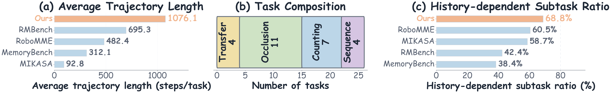
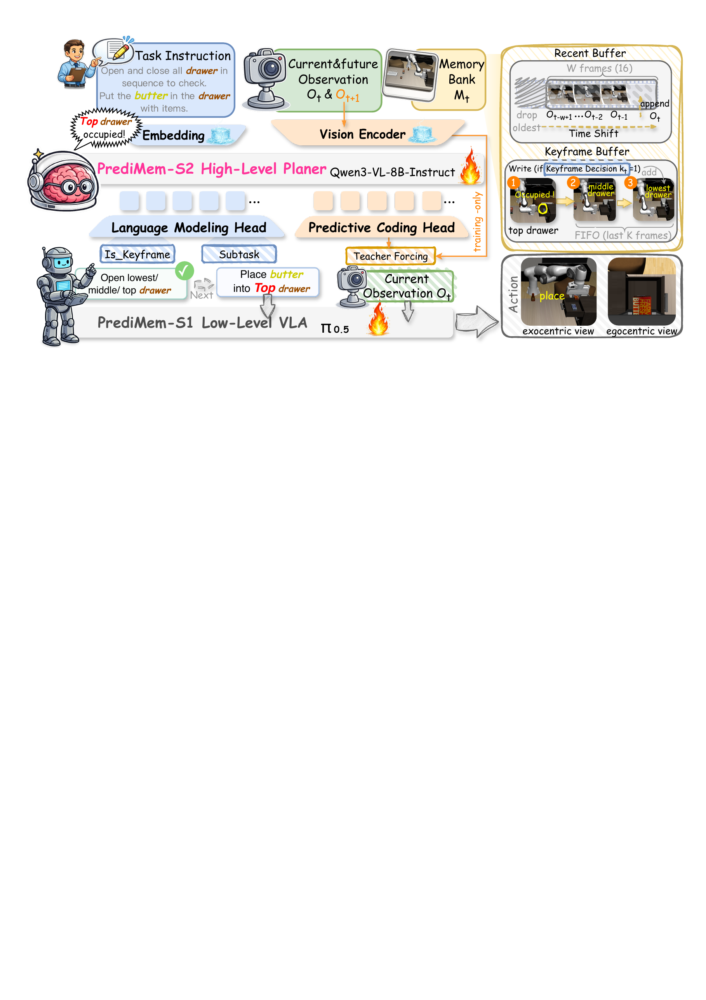
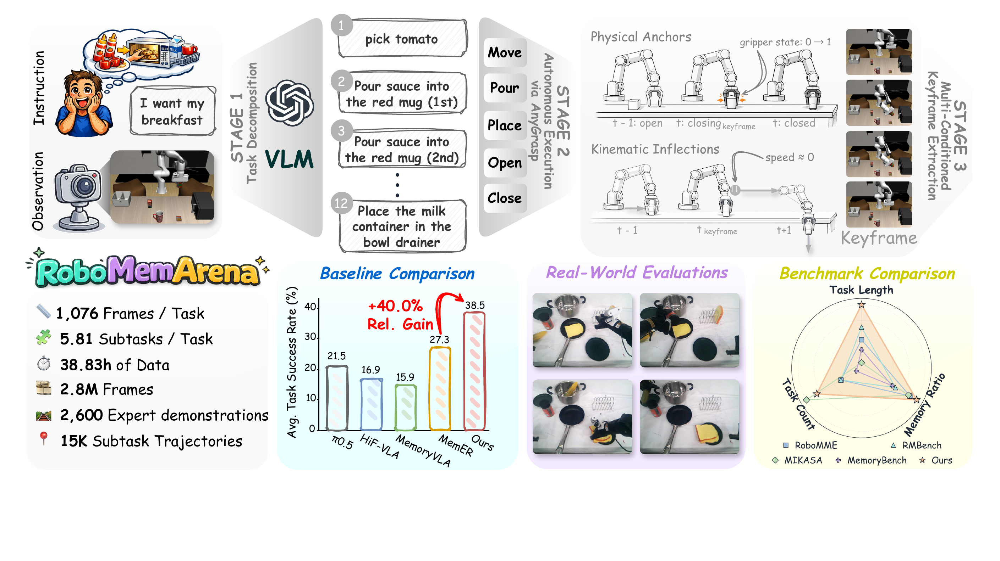
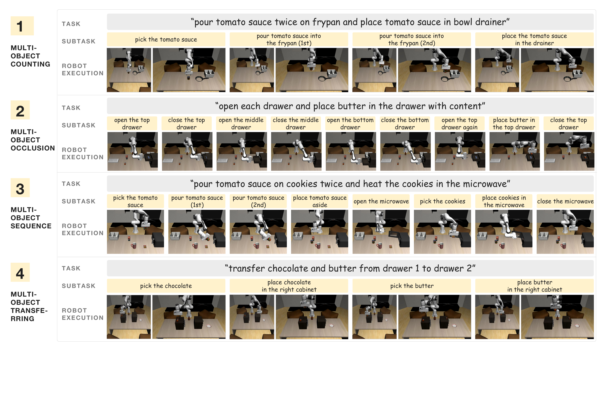

# RoboMemArena: A Comprehensive and Challenging Robotic Memory Benchmark

#

# 基本信息

- **arXiv:** 2605.10921
- **Authors:** Huashuo Lei, Wenxuan Song, Huarui Zhang, Jieyuan Pei, Jiayi Chen, Haodong Yan, Han Zhao, Pengxiang Ding, Zhipeng Zhang, Lida Huang, Donglin Wang, Yan Wang, Haoang Li
- **Categories:** cs.RO
- **一句话结论:** 本文提出了同时具备长程轨迹、原生多模态记忆标注与真实世界验证的机器人记忆基准 RoboMemArena，并设计了基于预测编码的异步双系统 VLA 框架 PrediMem，在仿真与物理实验中均显著优于现有反应式与记忆增强基线。

#

# 研究问题

现有机器人记忆基准在多模态记忆标注、任务覆盖度、结构复杂度和真实世界验证方面存在明显不足，难以有效评估具身智能体在长程部分可观测（partially observable）任务中的记忆能力。具体而言，主流基准或缺乏显式的子任务/关键帧监督信号，或轨迹过短、记忆依赖比例过低，或完全停留在仿真层面，导致基于 Vision-Language-Action（VLA）的策略无法得到 rigorous 的长程记忆评测。

与此紧密相关的是 VLA 与 World Model 的交叉问题：当前大多数 VLA 本质上是反应式策略（reactive policy），仅依据当前观测预测动作，在物体遮挡、重复计数、时序依赖等场景下必然失败。如何以可扩展的方式构建具备显式记忆机制、且能对物理状态转移保持敏感的端到端 VLA，是 Embodied AI 从短程操作迈向长程自主的关键瓶颈。本文通过基准建设与模型设计双管齐下，试图回答“机器人记忆应当如何被标注、评估与建模”这一核心问题。

#

# 任务与挑战

RoboMemArena 包含 **26 个仿真长程操作任务** 与 **5 个真实世界物理任务**，平均轨迹长度达 **1,076 步**，其中 **68.9%** 的子任务被定义为历史依赖（history-dependent）。任务覆盖四类核心记忆挑战：

1. **Multi-Object Transferring（物体迁移）：** 机器人需在视觉上相似的容器间迁移多个物体，并记住源-目标映射与已完成迁移的清单。
2. **Multi-Object Occlusion（遮挡）：** 物体被放入抽屉/柜子后视觉不可见，后续操作必须依赖对先前放置位置与容器状态的记忆。
3. **Multi-Object Counting（计数）：** 要求精确执行指定次数的动作（如“倒两次酱汁”），而连续动作间的视觉状态几乎相同。
4. **Multi-Object Sequence（时序/序列）：** 后续子任务依赖前置步骤的结果（如“将饼干与酱汁放入同一容器”），需要跨多步引用与状态跟踪。

输入为自然语言指令与视觉观测（包含第三人称与第一人称视角），输出为机器人动作序列。评测采用双指标：Task Success Rate（TSR）要求所有阶段验证谓词全部通过；Cumulative Success Rate（CSR）则衡量已完成验证阶段的比例，以区分部分进展与完全失败。

现有方法在此类任务上表现不佳：反应式 VLA（如 $\pi_{0.5}$）因缺乏历史记忆，在抽屉遮挡任务中反复打开同一抽屉陷入死循环；冻结的闭源大模型（如 GPT-5.4）虽具备通用记忆能力，但在物理动作理解上严重不足。与此同时，现有记忆基准在轨迹长度、记忆依赖比例与真实世界验证维度上均显著落后，难以支撑下一代记忆增强 VLA 的研发。



#

# 核心 Insight

本文的核心思想可概括为三点。首先，**机器人长程记忆需要显式的层次化记忆库，而非简单堆叠历史帧**。具体地，记忆库应同时维护一个固定长度的近期帧滑动窗口（Recent Buffer）与一个稀疏但事件驱动的关键帧库（Keyframe Bank）。前者捕捉短期动态，后者保留“信息瓶颈”式的决策关键状态，二者互补才能支撑部分可观测环境下的高层规划。

其次，**关键帧（Keyframe）是连接高层规划与低层执行的语义桥梁**。关键帧不应由固定频率采样获得，而应锚定于物理交互事件（如夹爪开合）与运动学拐点（如速度极小值或方向突变）。这种基于物理的提取方式能够原生地提供多模态记忆监督，使 VLM 在高层规划时直接访问经过压缩的任务级事件表征。

最后，**预测未来是理解现在的有效途径**。在高层 VLM 规划器中引入预测编码（Predictive Coding）头，迫使模型在训练时预测下一帧的视觉表征，可使隐状态对物理状态转移更加敏感。该辅助头仅在训练时使用，推理时完全丢弃，不增加任何额外开销，却能显著提升关键帧选择的准确性与表征的可分性。





#

# 方法与公式

#

## 1. 自动化数据生成与关键帧提取

RoboMemArena 的数据管线分为三阶段：VLM 驱动的任务分解、AnyGrasp 自主闭环执行、以及多条件关键帧提取。关键帧集合 $\mathcal{K}$ 由物理交互锚点与运动学拐点的并集构成：

```math
\mathcal{K} = \mathcal{K}_{\mathrm{phys}} \cup \mathcal{K}_{\mathrm{kin}}
\tag{1}
```

物理交互锚点捕捉夹爪状态切换时刻，其中 $g_t \in \{0,1\}$ 表示夹爪开闭状态：

```math
\mathcal{K}_{\mathrm{phys}} = \bigl\{ t \in [1, T] \mid g_t \neq g_{t-1} \bigr\}
\tag{2}
```

运动学拐点则标记末端执行器速度极小值或方向突变，设 $\mathbf{v}_t \in \mathbb{R}^3$ 为线速度，$\epsilon$ 与 $\theta$ 为阈值：

```math
\mathcal{K}_{\mathrm{kin}} = \left\{ t \in [1, T] \ \middle| \ \|\mathbf{v}_t\| < \epsilon \ \lor \ \frac{\mathbf{v}_t \cdot \mathbf{v}_{t-1}}{\|\mathbf{v}_t\| \, \|\mathbf{v}_{t-1}\|} < \cos(\theta) \right\}
\tag{3}
```

该并集策略避免了固定频率采样的冗余与遗漏，为后续 VLM 监督提供了紧凑且事件聚焦的记忆表征。

#

## 2. PrediMem 双系统架构

PrediMem 采用异步双系统设计：

- **S2（High-Level Planner）：** 基于 Qwen3-VL-8B-Instruct，维护记忆库 $\mathcal{M}_t = \mathcal{M}_t^{\mathrm{key}} \cup \mathcal{M}_t^{\mathrm{rec}}$，负责输出当前子任务 $c_t$ 与关键帧决策 $k_t$。
- **S1（Low-Level VLA）：** 基于 $\pi_{0.5}$ 的动作头，以更高控制频率执行动作。

S1 的动作生成公式为：

```math
a_t = \pi_{\mathrm{S1}}(o_t,\, c_t)
\tag{4}
```

其中 $a_t$ 为动作块，$o_t$ 为当前视觉观测，$c_t$ 为 S2 最新输出的子任务指令。S2 以约 1.06 Hz 异步运行，S1 以约 3.40 Hz 运行，每个 S2 更新覆盖约 2.92 个 S1 动作块。

#

## 3. 预测编码损失

为增强 S2 对物理状态转移的敏感性，PrediMem 在 S2 的 VLM 隐状态 $h_t$ 上接入预测编码头 $f_{\mathrm{Pre}}$，预测下一帧视觉特征 $\hat{Z}_{t+1} = f_{\mathrm{Pre}}(h_t)$，并以冻结 ViT 提取的真实特征 $Z_{t+1}$ 作为监督。损失函数为 MSE 与余弦距离之和：

```math
\mathcal{L}_{\mathrm{Pre}} = \mathrm{MSE}\!\bigl(\hat{Z}_{t+1}, \mathrm{sg}(Z_{t+1})\bigr) + \bigl(1 - \cos\!\bigl(\hat{Z}_{t+1}, \mathrm{sg}(Z_{t+1})\bigr)\bigr)
\tag{5}
```

其中 $\mathrm{sg}(\cdot)$ 为 stop-gradient 算子。S2 的总训练损失为：

```math
\mathcal{L}_\text{S2} = \mathcal{L}_{\mathrm{text}} + 0.1\mathcal{L}_{\mathrm{Pre}}
\tag{6}
```

$\mathcal{L}_{\mathrm{text}}$ 为子任务生成与关键帧决策的 next-token prediction 损失。推理时 $f_{\mathrm{Pre}}$ 被完全移除，不增加额外计算开销。

#

## 4. 评测指标

Task Success Rate（TSR）要求所有阶段验证谓词 $\psi(s_i^{(k)})$ 同时满足：

```math
\mathrm{TSR} = \frac{1}{N} \sum_{i=1}^{N} \prod_{k=1}^{K_i} \mathbf{1}\!\left[\psi\!\left(s_i^{(k)}\right)\right]
\tag{7}
```

Cumulative Success Rate（CSR）衡量平均完成阶段比例：

```math
\mathrm{CSR} = \frac{1}{N} \sum_{i=1}^{N} \frac{1}{K_i} \sum_{k=1}^{K_i} \mathbf{1}\!\left[\psi\!\left(s_i^{(k)}\right)\right]
\tag{8}
```

其中 $N$ 为任务总数，$K_i$ 为第 $i$ 个任务的验证阶段数。



#

# 贡献拆解

1. **综合记忆基准 RoboMemArena。** 这是首个同时满足“长程轨迹（>1000 步）、原生多模态记忆标注（关键帧+子任务指令）、可扩展自动化生成、配对真实世界评估”四项标准的机器人记忆基准。68.9% 的历史依赖子任务比例与 26 个任务的覆盖度，显著弥补了现有基准在记忆复杂度与物理验证上的缺口。

2. **零推理开销的预测编码记忆增强。** 在高层 VLM 中引入训练时预测编码头，通过预测未来视觉表征的 MSE+cosine 损失，使隐状态对物理状态转移更敏感。该头推理时可丢弃，以零额外成本提升了关键帧表征的可分性（t-SNE 显示同类关键帧聚类更紧致、类间分离更清晰）。

3. **异步双系统 VLA 框架 PrediMem。** 显式分离低频高层记忆规划（S2）与高频低层动作执行（S1），通过关键帧库与近期帧缓冲构成层次化记忆库。该设计直接解决了反应式 VLA 在长程任务中的状态混淆（state aliasing）与约束遗忘（constraint forgetting）问题。

4. **记忆系统的扩展律实证。** 通过系统消融验证了关键帧库容量、近期窗口大小与 S2 模型规模（1.7B → 4B → 8B）对记忆任务性能的影响，证明在机器人记忆场景中，显式记忆容量与模型规模的双重扩展均能带来持续增益。

#

# 关键图表解读

**figure-000-robo-mem.png（四类记忆任务示例）**
该图以四行分别展示 Multi-Object Counting、Occlusion、Sequence 与 Transferring 任务的完整执行序列。每行顶部为自然语言指令，中部黄色标签为子任务分解，下部为对应执行帧。读图时应注意：遮挡任务中抽屉关闭后目标物体完全不可见；计数任务中“倒两次”要求跨重复动作进行状态跟踪。该图直观证明了 RoboMemArena 任务对历史信息的刚性依赖。

**figure-001-teaser.png（总览与统计）**
此图信息密度极高，左侧展示三阶段数据生成管线（VLM 分解 → AnyGrasp 自主执行 → 关键帧提取）；左下给出基准核心统计（1,076 帧/任务、5.81 子任务/任务、38.83 小时数据、2600 条专家演示）；中部柱状图显示 PrediMem 以 38.5% 的平均 TSR 相比 $\pi_{0.5}$ 取得 +40.0% 的相对增益；右侧为真实世界评估照片与基准雷达图，雷达图显示 RoboMemArena 在 Task Length、Task Count、Memory Ratio 三个维度均领先于 RoboMME、MIKASA、RMBench 等现有基准。

**figure-004-subtask-decomposition.png（PrediMem 架构）**
该图是理解方法设计的核心。左侧为 PrediMem-S2 高层规划器，接收任务指令、当前与未来观测 $O_t$ & $O_{t+1}$、以及记忆库 $M_t$，通过 Language Modeling Head 输出子任务与关键帧决策，通过 Predictive Coding Head 在训练时预测未来视觉表征。右侧详细展示记忆库结构：Recent Buffer 维护 16 帧滑动窗口，Keyframe Buffer 以 FIFO 方式存储关键帧。下方 PrediMem-S1 低层 VLA 基于 $\pi_{0.5}$，在最新子任务条件下输出动作。注意图中明确标注 Predictive Coding Head 为 training-only，说明推理时无额外开销。

**figure-008-combined-summary-alt.png（基准对比统计）**
该图以三幅子图横向对比 RoboMemArena 与现有基准。(a) 平均轨迹长度：RoboMemArena 达 1076.1 步，远超 RMBench（695.3）、RoboMME（482.4）与 MIKASA（92.8）；(b) 任务组成：26 个任务中 Occlusion 占 11 个，Counting 占 7 个，Transfer 与 Sequence 各 4 个；(c) 历史依赖子任务比例：RoboMemArena 以 68.8% 高于 RoboMME（60.5%）与 MIKASA（58.7%）。该图直接支撑了“现有基准在长程记忆评估上存在结构性不足”的核心论点。

#

# 实验与消融

**数据集与设定。** 仿真部分包含 26 个任务、2,600 条专家演示、约 280 万帧、15,100 个关键帧对齐片段；真实世界部分包含 5 个任务，在 AgileX Cobot Mobile Aloha 双臂平台上评估。

**基线。** 包括反应式 VLA $\pi_{0.5}$、HiF-VLA（ hindsight/insight/foresight 运动表征）、MemoryVLA（token 级工作记忆）、MemER（双系统关键帧检索），以及冻结的 Qwen3-VL-8B 与 GPT-5.4。

**主结果（表 1）。** PrediMem 取得平均 TSR 38.5% 与 CSR 55.2%，显著优于 $\pi_{0.5}$（21.5% / 38.7%）与 MemER（27.3% / 49.1%）。冻结大模型表现极差：GPT-5.4 仅 8.7% TSR，证明通用 VLM 必须经过机器人数据微调才能胜任物理记忆任务。

**消融实验。**
- **Predictive Coding Head：** 移除后 TSR 降至 32.3%，在 Occlusion、Counting、Sequence 任务上下降最为明显，说明预测编码对捕捉抽屉关闭、物体消失、重复倾倒等微妙状态转移至关重要。
- **Keyframe Bank：** 移除后 TSR 暴跌至 17.7%，在 Occlusion 与 Sequence 任务上几乎失效，证明显式关键帧记忆是长程依赖的基石。
- **损失权重：** $\mathcal{L}_{\mathrm{Pre}}$ 权重为 0.1 时 TSR 最高（38.5%），权重过大（0.5 或 1.0）反而损害性能，说明预测损失需与语言建模损失谨慎平衡。
- **记忆库容量：** Recent Buffer 3–5 帧最佳；Keyframe Bank uncapped 时 CSR 最高，因为早期决策关键状态不会被后续观测挤出。
- **S2 规模扩展：** Qwen3-1.7B（19.9%）→ 4B（31.9%）→ 8B（38.5%），模型规模扩大带来持续且显著的提升。

**真实世界结果。** PrediMem 平均成功率 52%，在 Pour×2、Brush、Transfer、Shell Game 上均优于或持平 MemER。在长达 3 分钟的最复杂任务 Imitate Human to Make Breakfast（IHMB）上，PrediMem 是唯一成功的方法。

**最强证据：** 消融实验中移除 Keyframe Bank 导致 TSR 从 38.5% 降至 17.7%，差距超过 20 个百分点，是支撑“显式层次化记忆库必要性”的最强数据；配合 t-SNE 可视化，预测编码使关键帧表征聚类更紧致，形成定性+定量的双重支撑。

**最存疑证据：** 真实世界仅 5 个任务，且 IHMB 成功率仅 10%（尽管是唯一成功者），样本量与统计显著性有限；此外，仿真环境基于 RoboCasa 与 AnyGrasp，与真实世界存在域差距，仿真到物理的迁移增益仍需更大规模验证。

#

# 局限性

1. **真实世界验证规模有限。** 仅 5 个物理任务，部分长程任务（如 IHMB）成功率仍低，难以支撑强统计结论，且未覆盖更广泛的传感器模态（如力觉、触觉）。
2. **数据生成依赖启发式规则。** 关键帧提取依赖夹爪状态与运动学阈值，虽物理可解释，但未实现端到端可微学习，可能遗漏语义层面而非运动学层面的关键状态。
3. **系统复杂度与部署成本。** S2 采用 8B VLM，即便运行频率低（1.06 Hz），在边缘计算设备上的部署仍具挑战；异步双系统增加了工程调试与延迟管理的复杂度。
4. **任务域相对集中。** 当前任务以桌面操作、抽屉/柜子交互为主，未涉及开放环境导航、长程社交交互或动态人机协作等更复杂的记忆场景。
5. **预测编码头的监督粒度。** 预测目标为冻结 ViT 的下一帧特征，而非像素或物理状态，若 ViT 特征对特定物理事件（如液体倾倒完成时刻）不敏感，则预测编码的收益存在上限。

#

# 个人研究判断

面向“World Models assisting Embodied AI downstream tasks”的研究方向，**本文值得持续追踪**。

理由如下：首先，RoboMemArena 填补了长程物理记忆评估的关键空白，其预测编码机制与世界模型“通过预测未来表征以理解环境动态”的核心思想高度一致，为 World Model 在 VLA 中的轻量级落地提供了具体可复现的范式。其次，论文证明了显式符号化记忆（Keyframe Bank）与隐式神经动态感知（Predictive Coding）的互补性——前者提供可解释的事件边界，后者增强对状态转移的敏感度——这对未来设计兼具符号记忆与神经预测的混合记忆系统具有直接启发。第三，实验以扎实的数据揭示了闭源大模型在物理记忆任务上的“纸面优势”与“物理劣势”之间的巨大鸿沟（GPT-5.4 仅 8.7% TSR），为领域特定训练与记忆机制研究提供了强动机。

建议后续关注：RoboMemArena 数据集与真实世界协议是否完全开源；预测编码头能否扩展为更完整的世界模型（如视频生成或状态预测器）以支持模型预测控制（MPC）式规划；以及关键帧选择能否从基于物理规则的启发式进化为端到端可微的记忆写入机制。
