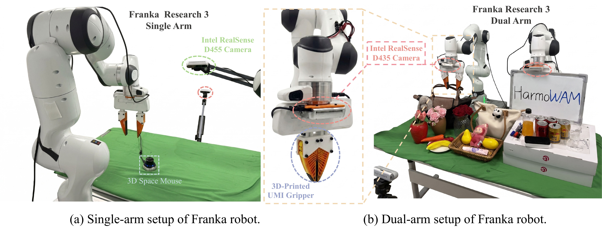
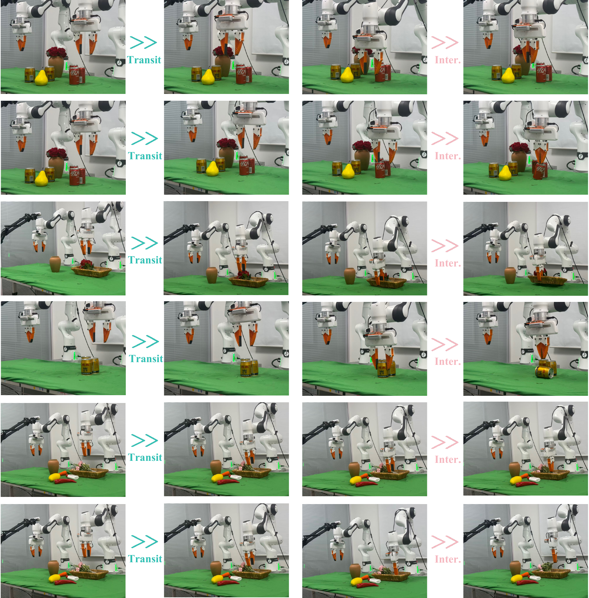
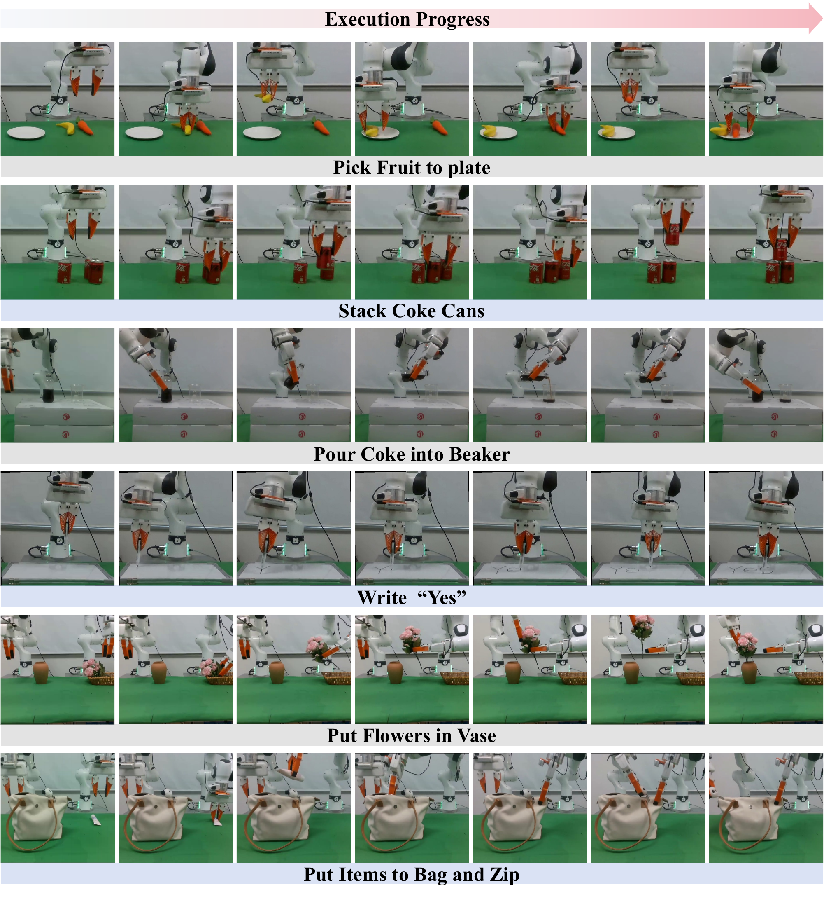
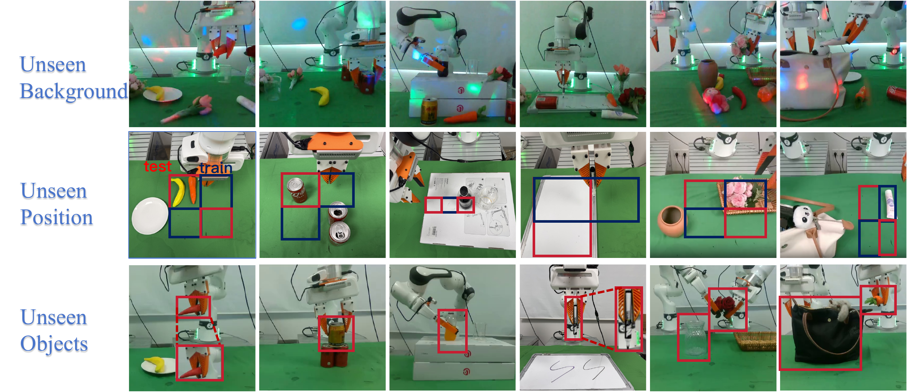

# HarmoWAM: Harmonizing Generalizable and Precise Manipulation via Adaptive World Action Models

#

# 基本信息

- arXiv: [2605.10942](http://arxiv.org/abs/2605.10942v1)
- Authors: Qiuxuan Feng, Jiale Yu, Jiaming Liu, Yueru Jia, Zhuangzhe Wu, Hao Chen, Zezhong Qian, Shuo Gu, Peng Jia, Siwei Ma, Shanghang Zhang
- Categories: cs.RO

#

# 研究问题

HarmoWAM: Harmonizing Generalizable and Precise Manipulation via Adaptive World Action Models

#

# 任务与挑战

World Action Models (WAMs) have emerged as a promising paradigm for robot control by modeling physical dynamics. Current WAMs generally follow two paradigms: the "Imagine-then-Execute" approach, which uses video prediction to infer actions via inverse dynamics, and the "Joint Modeling" approach, which jointly models actions and video representations. Based on systematic experiments, we observe a fundamental trade-off between these paradigms: the former explicitly leverages world models for generalizable transit but lacks interaction precision, whereas the latter enables fine-grained, temporally coherent action generation but is constrained by the exploration space of the training distribution. Motivated by these findings, we propose HarmoWAM, an end-to-end WAM that fully leverages a world model to unify predictive and reactive control, enabling both generalizable transit and precise manipulation. Specifically, the world model provides spatio-temporal physical priors that condition two complementary action experts: a predictive expert that leverages latent dynamics for iterative action generation, and a reactive expert that directly infers actions from predicted visual evolution. To enable adaptive coordination, a Process-Adaptive Gating Mechanism is proposed to automatically determine the timing and location of switching between them. This allows the world model to drive the reactive expert to expand the exploration space and the predictive expert to perform precise interactions across different stages of a task. For evaluation, we construct three training-unseen test environments across six real-world robotic tasks, covering variations in background, position, and object semantics. Notably, HarmoWAM achieves strong zero-shot generalization across these scenarios, significantly outperforming prior state-of-the-art VLA models and WAMs by margins of 33% and 29%, respectively.

#

# 核心 Insight

这篇论文的核心价值需要结合原文继续复查。当前 fallback 笔记保留了日报分析、DeepResearch 草稿和已筛选图表，避免自动流程中断。

#

# 方法与公式

DeepResearch 未生成；请回看论文正文中的方法章节与关键公式。

#

# 贡献拆解

- 关键术语：未提取
- 加权评分：3.0/5.0

#

# 关键图表解读

*Fallback selection because visual JSON selection failed.*

*Fallback selection because visual JSON selection failed.*

*Fallback selection because visual JSON selection failed.*

*Fallback selection because visual JSON selection failed.*

#

# 实验与消融

请优先核对主结果表、消融实验和真实/仿真任务设置；若图表已选中，应结合上方图片逐项复查。

#

# 局限性

当前自动精读未能成功调用完整图文生成模型，因此局限性需要结合原文实验设置进一步人工确认。

#

# 个人研究判断

若该论文与 World Models assisting Embodied AI、VLA、robot policy 或 sim-to-real 强相关，建议进入人工精读队列。
