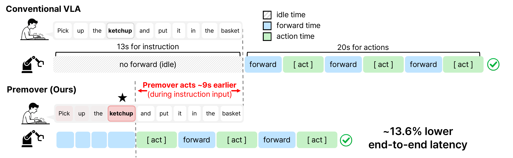
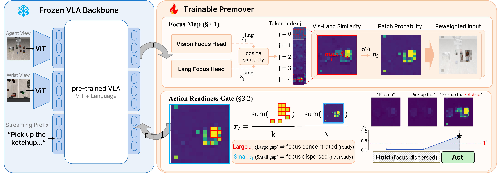
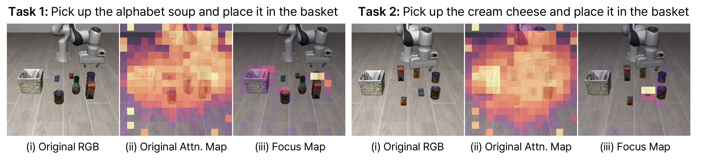
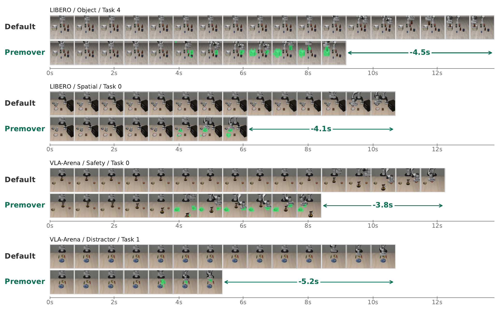

# Premover: Fast Vision-Language-Action Control by Acting Before Instructions Are Complete

#

# 基本信息

- **arXiv**: 2605.12160
- **Authors**: Joonha Park, Jiseung Jeong, Taesik Gong
- **Categories**: cs.RO, cs.AI
- **一句话结论**: 通过冻结 VLA 主干并外挂轻量级 Focus Map 与 Readiness Gate 模块，Premover 将用户输入指令的空转时间转化为有效预计算，在 LIBERO 上实现端到端壁钟时间降低 13.6% 且成功率持平全指令基线。

#

# 研究问题

论文指出当前 Vision-Language-Action (VLA) 策略存在一个被忽视的延迟来源：评估协议假设指令在机器人行动前已完整可用，但真实人机交互中用户打字或说话需要数秒时间。以 LIBERO 基准为例，指令输入时间平均占总交互时间的 39%，而传统 VLA 在此期间保持空闲。本文将这段空转期定义为流式前缀（streaming prefix）窗口，核心科学问题在于：如何在不修改大规模 VLA 主干、不重训模型参数的前提下，利用流式前缀进行安全的视觉预定位与动作预计算，从而将输入延迟转化为有效推理时间，同时避免因指令不完整而错误承诺动作导致的成功率崩塌。

#

# 任务与挑战

具体任务设定为：在指令逐 token 流式到达的场景下，机器人在每个控制步 $s$ 根据当前部分指令 $\ell_{1:k}$、当前图像观测和本体状态，决定是执行动作块 $a_{s:s+M}$ 还是继续等待。这与传统 VLA 设定（指令一次性完整给出）形成对比。

已有方法主要聚焦于指令到达后的推理加速（如动态早退、token 剪枝、模型蒸馏、动作序列压缩等），但无法优化用户输入期间的固有延迟。若直接在流式前缀上 naive 地每步执行动作（naive premoving），成功率会从 95.0% 暴跌至 66.4%，因为过早执行会在目标对象尚未明确时导致不可逆的状态偏移。因此，挑战在于同时解决两个耦合问题：(i) 在部分语言下确定视觉关注区域（where to focus）；(ii) 判断当前前缀是否已足够具体以安全释放动作（when to act）。

#

# 核心 Insight

Premover 的核心思想是将人机交互中的“输入时间”从死时间重新定义为可利用的计算资源。传统 VLA 在指令输入期间完全空闲，而 Premover 通过冻结主干上的轻量级外挂模块，在指令流式到达过程中持续进行视觉-语言 grounding，并在确认目标已足够明确时提前开始执行。



如图上所示，传统 VLA 在 13 秒指令输入期间完全空闲（idle），待指令完整到达后才开始前向传播与动作执行；而 Premover 在指令输入过程中即开始计算 Focus Map，并在就绪门控判定条件满足时提前约 9 秒开始执行动作，最终端到端延迟降低约 13.6%。这一范式的关键在于：提前行动必须配备明确的安全机制，否则将因错误承诺目标而导致灾难性失败。



整体架构如上图所示。左侧为完全冻结的 VLA 主干（如 $\pi_{0.5}$），接收 Agent View、Wrist View 和流式语言前缀；右侧为可训练的 Premover 模块，包含 Focus Map（解决 where）和 Action Readiness Gate（解决 when）。两个组件均只训练极小外挂参数（不足主干 1%），主干权重完全保留。

#

# 方法与公式

#

## Focus Map 生成

冻结 VLA 主干对当前观测和流式前缀进行前向传播，从中间层提取图像 patch 特征 $H^{\mathrm{img}} \in \mathbb{R}^{N \times d}$ 和语言 token 特征 $H^{\mathrm{lang}} \in \mathbb{R}^{L \times d}$。两个轻量级 2 层 MLP 投影头（含 GELU 激活）分别将其映射到共享潜空间，并进行 $\ell_2$ 归一化：

```math
z^{\mathrm{img}}_i = \frac{f_{\mathrm{img}}(H^{\mathrm{img}}_i)}{\left\lVert f_{\mathrm{img}}(H^{\mathrm{img}}_i) \right\rVert_2},
\qquad
z^{\mathrm{lang}}_j = \frac{f_{\mathrm{lang}}(H^{\mathrm{lang}}_j)}{\left\lVert f_{\mathrm{lang}}(H^{\mathrm{lang}}_j) \right\rVert_2}.
\tag{1}
```

其中 $N$ 为图像 patch 总数，$L$ 为流式前缀的有效 token 数，$d$ 为主干隐藏维度。逐 patch 计算与所有前缀 token 的最大余弦相似度，经固定 logit scale $s=6.0$ 和 sigmoid 后得到 focus map $p \in [0,1]^N$：

```math
S_{i,j} = \langle z^{\mathrm{img}}_i, z^{\mathrm{lang}}_j \rangle,
\qquad
p_i = \sigma\!\left( s \cdot \max_{j \in \{1,\dots,L\}} S_{i,j} \right).
\tag{2}
```

这里 $p_i$ 表示图像 patch $i$ 与当前流式前缀相关的概率。训练时，使用模拟器提供的实例分割掩码 $m^\star \in \{0,1\}^N$ 作为监督信号，采用类别平衡的 Binary Cross-Entropy (BCE) 损失：

```math
\mathcal{L}_{\mathrm{focus}}
=
-\, \frac{\sum_{i=1}^{N} \beta_i \left[ m^\star_i \log p_i + (1 - m^\star_i)\log(1 - p_i) \right]}
{\sum_{i=1}^{N} \beta_i}.
\tag{3}
```

正样本权重 $\beta_i = N_{-} / \max(N_{+}, 1)$（当 $m^\star_i=1$），负样本权重 $\beta_i = 1$（当 $m^\star_i=0$）。梯度仅流经两个投影头，主干参数保持冻结。

#

## Focus Map 跨步注入

为避免同帧二次前向传播，$t$ 步生成的 focus map $p_t$ 在 $t+1$ 步用于软重加权图像 token 嵌入。通过 floor scale $\alpha \in [0,1]$ 进行插值：

```math
w_{t,i} = \alpha + (1 - \alpha)\, p_{t,i},
\tag{4}
```

```math
\hat{e}^{\mathrm{img}}_{t+1,i} = w_{t,i} \cdot e^{\mathrm{img}}_{t+1,i}.
\tag{5}
```

其中 $e^{\mathrm{img}}_{t+1}$ 为 $t+1$ 步原始图像 token 嵌入，$\hat{e}^{\mathrm{img}}_{t+1}$ 为重加权后的输入。$\alpha=0.2$ 通过保留集校准选定，其作用是保留非目标 patch 的场景上下文（如避障、夹爪对齐），同时放大与指令相关的区域。

#

## Action Readiness Gate

Readiness score $r_t$ 衡量 focus map 的集中度，定义为 top-$K$ 均值与全局均值之差：

```math
r_t
=
\frac{1}{K}\sum_{i \in \mathcal{T}_K(p_t)} p_{t,i}
-
\frac{1}{N}\sum_{i=1}^{N} p_{t,i},
\tag{6}
```

其中 $\mathcal{T}_K(p_t)$ 表示 $p_t$ 中值最大的 $K$ 个 patch 的索引（实验中 $K=10$）。当 $r_t \geq \tau$ 时，策略开始执行动作；否则继续等待。$\tau \in \mathbb{R}$ 为单一可学习标量阈值。

训练时，若前缀中已出现目标对象则标签 $y=1$，否则 $y=0$。通过温度 $T=0.10$ 平滑决策边界，使用 BCE 损失：

```math
\mathcal{L}_{\mathrm{ready}}
=
\mathrm{BCE}\!\left( \frac{r_t - \tau}{T},\; y \right).
\tag{7}
```

对于目标尚未出现的训练样本，仅应用 readiness 损失，不应用 focus map 监督，避免注入噪声掩模。

#

## 联合训练目标

最终目标为两项损失的加权和：

```math
\mathcal{L}
=
\lambda_{\mathrm{focus}}\, \mathcal{L}_{\mathrm{focus}}
+
\lambda_{\mathrm{ready}}\, \mathcal{L}_{\mathrm{ready}}.
\tag{8}
```

实验中 $\lambda_{\mathrm{focus}} = \lambda_{\mathrm{ready}} = 1.0$。所有可训练参数仅包括 $f_{\mathrm{img}}$、$f_{\mathrm{lang}}$ 和 $\tau$，总计不足主干参数量的 1%。

#

# 贡献拆解

1. **流式前缀优化范式的确立**：首次系统地将 VLA 的加速视角从“指令到达后的推理优化”转向“指令输入期间的空转利用”，提出 streaming prefix 这一真实部署场景下的研究问题，并证明该空转期是可计算、可利用的。
   
2. **Focus Map + Readiness Gate 的耦合架构**：提出无需重训大 backbone、仅外挂 <1% 参数即可实现的轻量级模块。Focus Map 通过显式视觉-语言投影解决“看向何处”的问题；Readiness Gate 通过可学习的集中度阈值解决“何时执行”的问题。两者联合训练，实现了安全提前执行。

3. **时序决策与视觉聚焦的量化解耦**：通过消融实验揭示，在安全提前执行中，“何时执行”比“看向何处”贡献更大。Readiness Gate 单独恢复 21.9% 的成功率（从 66.5% 到 88.4%），Focus Map 在此基础上再补充 6.7%（达到 95.1%），说明时序门控是避免错误承诺的主导因素。

4. **极低推理开销的验证**：Focus Map 投影头的推理开销仅占主干前向传播时间的 0.35%，参数量仅 2.36M，证明了轻量辅助模块调制冻结策略的可行性。

#

# 关键图表解读



上图展示了 Focus Map 如何将冻结 VLA 主干原本分散的注意力收敛到目标对象。中间列（Original Attention Map）显示主干的隐式视觉-语言对齐存在显著泄漏，注意力质量分散在背景区域；右侧列（Focus Map）则通过监督学习将概率质量集中在目标物体及其邻近 affordance 区域（如把手、接触面）。这说明冻结主干的内部对齐不足以支撑流式前缀下的精确定位，而轻量投影头可以有效弥补这一缺口。



此图覆盖 LIBERO（Object、Spatial）和 VLA-arena（Safety、Distractor）的定性 rollout。Default 策略在指令输入期间保持静止，而 Premover 在指令未完成时即开始移动，最终分别节省 4.5s、4.1s、3.8s 和 5.2s。绿色高亮区域表示 focus map 概率 $\geq 0.8$ 的 patch，可见 Premover 在动作执行前已提前锁定目标，且该提前量在不同场景下均稳定存在。

#

# 实验与消融

**数据集与设定**：实验在 LIBERO（Spatial、Object、Goal、LIBERO-10 四个套件）和 VLA-arena Level-1（Extrapolation、Distractor、Safe、Long-horizon）上进行。使用冻结的 $\pi_{0.5}$ 作为 VLA 主干。流式评估协议按 52.24 WPM 的平均打字速度逐 token 暴露指令（每 token 约 12 个仿真步）。对比三种设置：Full-prompt（完整指令预给）、Naive premoving（每步都执行）、Premover（带 Focus Map 和 Readiness Gate）。

**主结果（LIBERO）**：

| Metric | Setting | Spatial | Object | Goal | L-10 | Mean |
|---|---|---|---|---|---|---|
| Success Rate | Full-prompt | 99.4% | 97.4% | 94.9% | 88.3% | 95.0% |
| Success Rate | Naive Premoving | 68.3% | 64.6% | 56.6% | 76.0% | 66.4% |
| Success Rate | Premover | 98.6% | 99.1% | 93.7% | 88.9% | 95.1% |
| Wall-Clock Time (All) | Full-prompt | 31.0s | 30.7s | 23.8s | 50.8s | 34.0s |
| Wall-Clock Time (All) | Premover | 22.7s | 24.4s | 21.9s | 48.6s | 29.4s |

Premover 将平均端到端壁钟时间从 34.0s 降至 29.4s（相当于基线的 86.4%），成功率 95.1% 几乎追平 full-prompt 的 95.0%。Naive premoving 虽然成功率崩塌至 66.4%，但其 Wall-Clock Time (All) 反而为 101.5%（因失败导致超时），而 Premover 同时优化了时间和成功率。

**主结果（VLA-arena）**：Premover 将平均壁钟时间降至 89.7%，成功率 30.9%，相比 full-prompt 的 33.0% 仅下降 2.1 个百分点。但 Long-horizon 套件所有方法成功率均为 0%，说明在长程任务中提前执行可能引入不可逆状态偏移。

**消融实验**：

| Stream | Focus | Ready | Avg Success |
|---|---|---|---|
| ✓ | | | 66.5% |
| ✓ | ✓ | | 69.5% |
| ✓ | | ✓ | 88.4% |
| ✓ | ✓ | ✓ | 95.1% |

Readiness Gate 单独贡献 21.9% 的成功率恢复（66.5%→88.4%），Focus Map 再补充 6.7%（88.4%→95.1%）。这验证了门控机制在安全提前执行中的核心地位。

**最强证据**：LIBERO 四套件上，Premover 在成功率持平（甚至 Object 套件超越）的同时，将端到端壁钟时间降低 13.6%，且消融明确量化了两个组件的互补作用。

**最存疑证据**：VLA-arena 上成功率下降 2.1%p，且 Long-horizon 套件完全失败。由于该基准对 $\pi_{0.5}$ 本身已极具挑战性，难以完全归因于流式前缀；此外，VLA-arena 的样本量较小（selected episodes 15–49），统计稳健性弱于 LIBERO。

#

# 局限性

1. **监督信号依赖模拟器掩模**：Focus Map 的训练强依赖模拟器渲染的实例分割掩模，真实机器人场景无此 oracle。虽然论文提及可用开放词汇检测器替代，但未在真实噪声条件下验证鲁棒性。
   
2. **跨域泛化性未验证**：投影头按基准单独训练，未验证跨域零样本迁移能力；且仅在 $\pi_{0.5}$ 单一主干上测试，对其他 VLA 架构（如 RT-2、OpenVLA）的适用性存疑。

3. **长程与复杂任务上的脆弱性**：VLA-arena Level-1 上成功率下降 2.1%p，且 Long-horizon 套件所有方法（包括 full-prompt）成功率均为 0%，说明在更难或长程任务中，基于部分前缀的提前执行可能引入不可逆状态偏移，论文对此未做深入错误分析。

4. **输入动力学过于简化**：实验采用固定打字速率（52.24 WPM，每 token 12 仿真步）的单调流式协议，未考虑真实人机交互中的回退、暂停、多轮修正等非单调前缀动力学。

#

# 个人研究判断

面向“World Models assisting Embodied AI downstream tasks”的研究方向，本文值得**持续追踪**，但更适合作为**效率优化与交互设计**的参考，而非 World Model 本身的直接推进。

**理由如下**：
- **正向价值**：本文重新定义了 VLA 部署中的延迟构成，将“人类输入动力学”纳入系统优化范畴，这对真实场景下的低延迟机器人控制具有直接启发。其“冻结主干+轻量外挂”的范式与当前 VLA 大模型趋势高度兼容，证明了无需重训即可通过辅助模块调制策略行为。
- **与 World Model 的关联**：虽然本文未显式构建 World Model，但其 Focus Map 本质上是一种基于语言条件的视觉注意力先验，可被视为一种轻量级的“视觉状态抽象”；Readiness Gate 则可理解为对“信念集中度”的元认知判断。未来若将此类门控机制与显式的世界模型状态不确定性估计结合，有望实现更安全的流式决策。
- **追踪建议**：后续可关注两个延伸方向：(i) 用开放词汇检测器或 SAM 替代模拟器掩模，验证真实场景下的鲁棒性；(ii) 将 Readiness Gate 与 World Model 的预测不确定性或价值函数结合，在更复杂的长程任务中实现自适应提前执行。若该团队后续发布真实机器人验证或跨主干泛化结果，影响力将显著提升。
