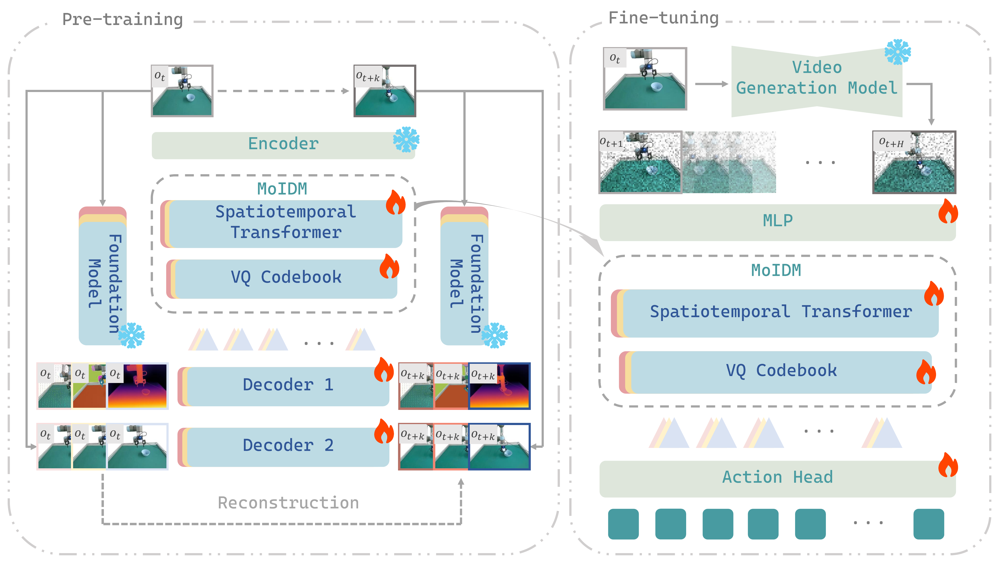
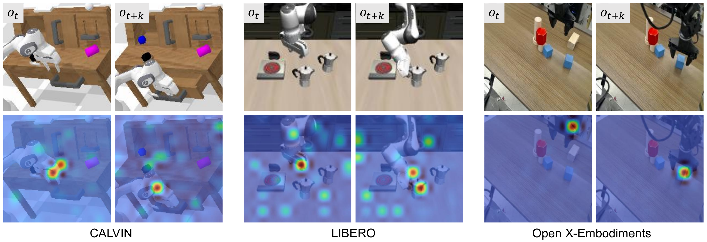
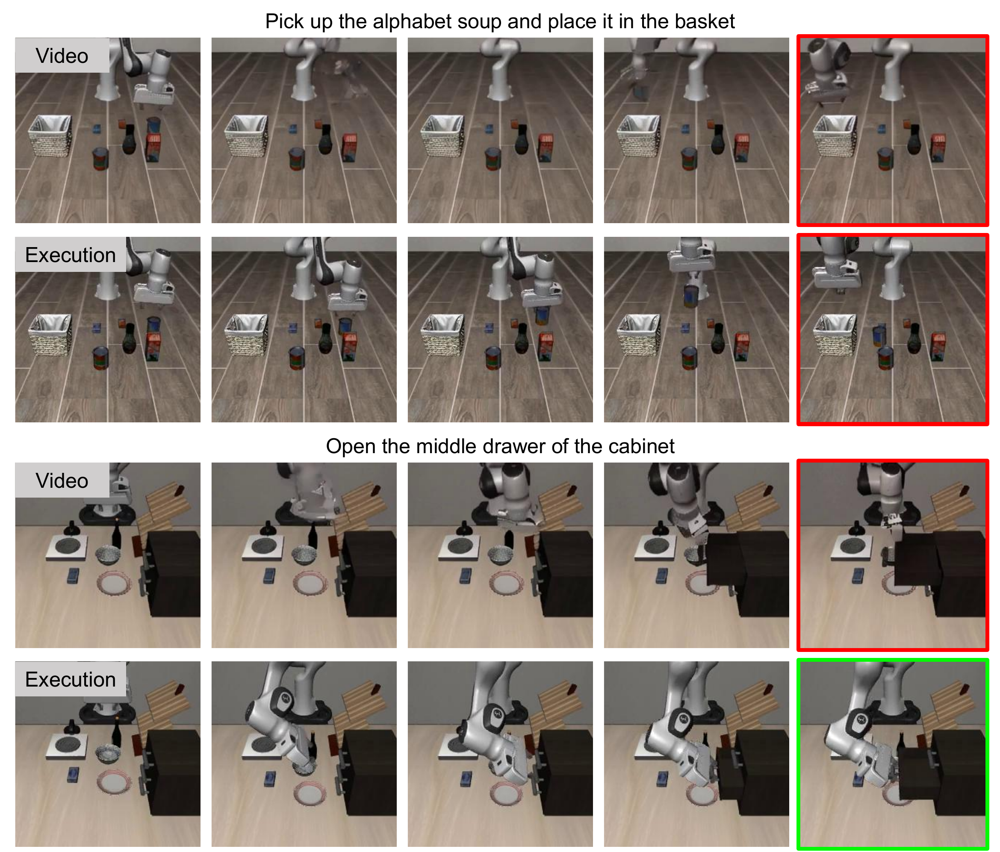
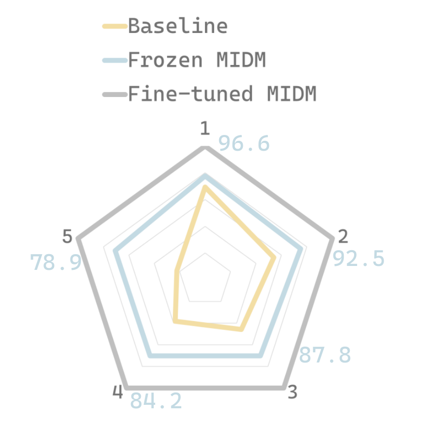

# From Imagined Futures to Executable Actions: Mixture of Latent Actions for Robot Manipulation

#

# 基本信息

- arXiv: 2605.12167
- Authors: Yajie Li, Bozhou Zhang, Chun Gu, Zipei Ma, Jiahui Zhang, Jiankang Deng, Xiatian Zhu, Li Zhang
- Categories: cs.RO, cs.CV
- 一句话结论: 提出MoLA，通过混合逆动力学模型（MoIDM）将视频生成模型的想象未来转换为结构化潜在动作表征，在CALVIN、LIBERO、LIBERO-Plus及真实世界UR5e上取得跨基准SOTA性能。

#

# 研究问题

本文解决的核心问题是视频生成模型预测的“想象未来”与机器人策略执行之间的**视觉真实感-控制相关性不匹配**。视频生成模型优化的是感知保真度（perceptual fidelity），而非状态转移背后的动作中心原因（action-centric causes）。这导致现有Video-Action方法要么将生成帧直接作为策略的视觉条件输入，要么尝试从像素级未来视频中解码动作，迫使策略处理与物理因果无关的纹理、光照和外观细节，而非状态转换本身。该问题直接制约了World Model在Embodied AI下游任务中的实际效用，亟需一种将“像素空间想象”转化为“动作空间推理”的结构化接口。

#

# 任务与挑战

具体任务为语言条件下的机器人操作（language-conditioned robot manipulation）。输入为当前RGB观测 $o_t^{\mathrm{rgb}}$ 与语言指令 $l$，输出为可执行的连续动作序列。训练采用三阶段渐进解耦策略：首先在混合机器人数据（RT-1、Bridge、CALVIN、LIBERO等约30万轨迹）上微调Stable Video Diffusion（SVD）；其次独立预训练三个模态特定的逆动力学模型；最后冻结视频生成模型，联合微调MoIDM与动作头。

已有方法面临根本性困难：将预测帧直接条件化于策略（如VPP）会把“观察-动作映射”的学习负担完全抛给动作头；而从生成视频中直接解码动作（如Vidar）则使控制对视频预测误差高度敏感。两者均未显式建模“视觉转换所隐含的动作”，导致控制间接、不稳定，且难以利用多模态物理线索。

#

# 核心 Insight

本文最核心的思想是：**不传递像素，而是传递“像素变化所隐含的动作”**。通过预训练逆动力学模型（IDM）将帧间视觉转换翻译成动作空间的结构化潜在表示，策略得以直接在动作空间而非图像空间中推理未来，从而将世界模型的想象空间与策略的执行空间解耦。

MoLA的整体架构是一个解耦的三级流水线：**视频生成模型提供想象未来 → MoIDM将视觉转换压缩为混合潜在动作 → DiT动作头解码为连续控制**。其中，MoIDM作为连接“想象”与“执行”的显式接口，通过三个模态感知的IDM分别捕获语义、深度与光流线索，并利用独立的VQ码本进行离散化，避免单一路径的表示纠缠。这种设计将视频生成的未来预测从“像素级条件”转化为“动作级条件”，从根本上缓解了视觉真实感与控制相关性的内在张力。



#

# 方法与公式

#

## 1. 视频想象模块（冻结）

采用Stable Video Diffusion（SVD）作为主干。给定当前观测 $o_t^{\mathrm{rgb}}$ 和语言指令 $l$，模型通过单步去噪生成未来帧序列 $\hat{o}_{t:t+H}^{\mathrm{rgb}}$。测试时仅使用单步去噪（耗时约0.13秒），生成的未来不需要照片级真实，只需保留控制相关的时间结构即可供下游IDM提取动作线索。

#

## 2. 混合逆动力学模型（MoIDM）

MoIDM是MoLA的核心接口，负责将“像素变化”转换为“动作表示”。其包含三个模态特定的IDM：语义感知IDM（SAM2监督）、深度感知IDM（Depth Anything v2监督）、光流感知IDM（CoTracker3监督）。

**特征编码**。给定当前帧 $o_t^{\mathrm{rgb}}$ 与未来帧 $o_{t+k}^{\mathrm{rgb}}$，ViT-based图像编码器提取特征：

```math
h_t^{\mathrm{rgb}} = E_{\mathrm{rgb}}(o_t^{\mathrm{rgb}}), \qquad
h_{t+k}^{\mathrm{rgb}} = E_{\mathrm{rgb}}(o_{t+k}^{\mathrm{rgb}})
\tag{1}
```

其中 $E_{\mathrm{rgb}}$ 为共享的ViT编码器，$h_t^{\mathrm{rgb}}$ 和 $h_{t+k}^{\mathrm{rgb}}$ 分别为当前帧与未来帧的RGB特征。

**时空交互与离散化**。引入可学习的潜在动作查询 $q^{(m)}$，通过模态特定的时空Transformer捕获跨帧对应关系：

```math
\tilde{h}_{t \rightarrow t+k} = T^{(m)}\!\left(q^{(m)}, h_t^{\mathrm{rgb}}, h_{t+k}^{\mathrm{rgb}}\right)
\tag{2}
```

其中 $T^{(m)}$ 为模态 $m$ 的时空Transformer。随后通过模态特定的VQ码本离散化为潜在动作token：

```math
z_{t \rightarrow t+k}^{(m)} = \mathrm{VQ}^{(m)}\!\left(\tilde{h}_{t \rightarrow t+k}\right)
\tag{3}
```

每个VQ码本包含128个码，维度为32。$z_{t \rightarrow t+k}^{(m)}$ 为压缩后的离散潜在动作，捕获了两帧间的因果转移。

**重建监督**。所有IDM共享RGB重建损失，同时各IDM还承担模态特定的重建损失。共享RGB解码器重建未来帧：

```math
\hat{o}_{t+k}^{\mathrm{rgb}} = D_{\mathrm{rgb}}\!\left(h_t^{\mathrm{rgb}}, z_{t \rightarrow t+k}^{(m)}\right)
\tag{4}
```

模态特定监督利用冻结的基础模型提取真值。令 $F^{(m)}$ 表示对应的基础编码器，则：

```math
h_t^{(m)} = F^{(m)}(o_t^{\mathrm{rgb}}), \qquad
g_{t+k}^{(m)} = F^{(m)}(o_{t+k}^{\mathrm{rgb}})
\tag{5}
```

其中 $g_{t+k}^{(m)}$ 为深度图、语义分割或光流的未来真值。模态特定解码器重建该表示：

```math
\hat{g}_{t+k}^{(m)} = D^{(m)}\!\left(h_t^{(m)}, z_{t \rightarrow t+k}^{(m)}\right)
\tag{6}
```

通过独立优化各IDM的重建目标，三个模型分别从语义、几何与运动视角理解状态转换。

**联合微调**。在下游任务中，视频生成模型权重冻结。对生成的未来帧 $\hat{o}_{t+k}^{\mathrm{rgb}}$，MoIDM提取混合潜在动作集合：

```math
\mathcal{Z}_{t \rightarrow t+k} =
\left\{ z_{t \rightarrow t+k}^{(\mathrm{sem})},\;
        z_{t \rightarrow t+k}^{(\mathrm{depth})},\;
        z_{t \rightarrow t+k}^{(\mathrm{flow})} \right\}
\tag{7}
```

该集合与生成帧的视觉特征共同作为条件输入，MoIDM与动作头进行端到端联合优化，使潜在动作适应生成未来的统计特性和下游控制目标。

#

## 3. 动作头

采用Diffusion Transformer（DiT）作为动作解码模块。与标准扩散训练不同，该模块使用Flow Matching目标进行优化，学习从噪声动作样本到干净目标动作的连续变换，从而更稳定地建模多模态动作分布。原文信息不足以完整复原Flow Matching的ODE或积分形式损失公式，但其核心在于通过条件生成将混合潜在动作映射为可执行的连续控制指令。

#

## 4. 训练流程

- **Stage I**：在混合机器人数据上微调SVD，适配任务特定的视觉动态与视角。
- **Stage II**：在相同数据上独立预训练三个模态特定的IDM。
- **Stage III**：冻结SVD，联合微调MoIDM与DiT动作头，实现从想象未来到可执行动作的端到端对齐。

#

# 贡献拆解

1. **控制导向的潜在动作接口（MoLA）**
   - **做了什么**：在视频生成与策略执行之间插入显式接口，不传递原始像素，而是传递由视觉转换推断出的结构化潜在动作表示。
   - **为什么有效**：将策略推理从图像空间转移到动作空间，避免了策略被迫学习与物理因果无关的纹理细节，从根本上缓解了视觉真实感与控制相关性的错位。
   - **与已有方法差别**：VPP等Video-Action模型直接将生成帧作为策略视觉输入；MoLA则通过IDM提取潜在动作，实现了想象空间与执行空间的解耦。

2. **模态解耦的混合逆动力学模型（MoIDM）**
   - **做了什么**：训练三个模态感知的预训练IDM（语义、深度、光流），各自拥有独立的时空Transformer和VQ码本，从互补物理视角捕获视觉转换中的动作线索。
   - **为什么有效**：语义变化传达任务意图，深度捕获几何结构，光流反映交互动力学。独立码本避免了多模态信号在单一潜在空间中的表示纠缠与目标干扰。
   - **与已有方法差别**：LAPA、UniVLA等使用单一路径的IDM或自监督特征；MoLA首次将多模态IDM混合体作为视频生成与策略之间的显式接口。

3. **DiT + Flow Matching动作头**
   - **做了什么**：将混合离散潜在动作解码为连续控制序列，利用Flow Matching稳定建模多模态动作分布。
   - **为什么有效**：相比自回归Transformer，DiT能更好地捕捉长程依赖、动作多模态性与时间相关性。
   - **与已有方法差别**：传统离散化动作头（如VQ-BeT）或自回归生成在长程连续控制上存在局限；Flow Matching提供了更稳定的生成式动作建模。

4. **跨基准SOTA与真实世界验证**
   - **做了什么**：在CALVIN ABC-D、LIBERO、LIBERO-Plus（10,030任务）及真实世界UR5e上展开系统验证。
   - **为什么有效**：三阶段解耦训练让IDM先在大规模异构数据上学到通用物理转换，再适应特定下游任务，兼顾泛化性与样本效率。
   - **与已有方法差别**：在极具挑战的LIBERO-Plus上，MoLA以92.7%的平均成功率领先最强基线OpenVLA-OFT+达13.2个百分点，证明了该范式在大规模多任务鲁棒性测试中的绝对优势。

#

# 关键图表解读

**图1：MoLA整体框架图（figure-004-6-model-img.png）**

该图完整展示了MoLA的两阶段架构。左侧为预训练阶段：Foundation Model编码当前帧 $o_t$ 与未来帧 $o_{t+k}$，三个模态特定的Spatiotemporal Transformer和VQ Codebook独立提取离散潜在动作，再通过Decoder 1/2重建RGB、深度图、光流与语义分割。右侧为微调阶段：冻结的Video Generation Model根据当前观测生成未来帧，经MLP处理后输入MoIDM提取混合潜在动作，最终由Action Head输出连续动作序列。读图时应注意“火焰”图标标识的可训练模块与“雪花”图标标识的冻结模块，这直观体现了三阶段解耦训练的设计哲学。

**图2：MoIDM注意力热图（figure-009-6-heatmap-img.png）**

该图展示了在CALVIN、LIBERO、Open X-Embodiments三个环境中，模型对 $o_t$ 与 $o_{t+k}$ 的注意力分布。每列上下两行分别为原始帧与对应的热图叠加。可以清晰看到，注意力始终聚焦于机械臂末端执行器及与之交互的物体区域（如抽屉把手、杯子、积木），而非背景或无关区域。这直接验证了MoIDM确实提取了动作中心（action-centric）的表征，而非纠缠于纹理细节，为论文关于“控制相关性”的核心论点提供了可视化证据。

**图3：视频生成预测与实际执行对比（figure-007-6-video-failure-img.png）**

该图通过两个任务展示了视频生成模型的预测帧与实际控制需求之间的鸿沟。上半部分任务“Pick up the alphabet soup...”中，Video行最后一帧（红框）显示机械臂未正确抓取物体，而Execution行（红框）却成功完成；下半部分任务“Open the middle drawer...”中，Video行预测失败（红框），Execution行却成功（绿框）。读图时应注意：生成视频可能偏离任务相关演化，但MoLA通过提取潜在动作而非直接依赖像素，仍可能成功执行；反之，若未来预测严重偏离任务语义，也可能误导策略。这有力支撑了论文的motivation——必须将视觉真实感与控制相关性解耦。

**图4：MoIDM微调策略消融雷达图（figure-011-4-exp-q3.png）**

该雷达图比较了Baseline、Frozen MIDM与Fine-tuned MIDM在5项任务上的性能。Fine-tuned MIDM（灰色）在所有维度均显著优于Frozen MIDM（浅蓝）和Baseline（黄色），外围数值分别为96.6、92.5、87.8、84.2、78.9。读图时应注意，Frozen MIDM虽优于Baseline，但明显弱于Fine-tuned版本，说明预训练权重提供了良好的初始化，但只有与动作头联合优化，才能使潜在动作充分适应下游控制目标与生成未来的统计特性。

#

# 实验与消融

**数据集与设定**：仿真环境覆盖CALVIN ABC-D（长程跨环境泛化）、LIBERO（4个任务套件）与LIBERO-Plus（10,030个任务，含7种受控扰动）。真实世界使用UR5e机械臂，配备RealSense D455（第三人称）与D405（腕部视角），在5个任务上各进行50次trial，评估分布内（放置瓶子、抓取碗）与分布外（干扰物体、光照变化）场景。

**主结果**：
- CALVIN ABC-D：平均连续完成任务长度（Avg. Len.）达**4.55**，超越DreamVLA（4.44）、VPP（4.33）等强基线。
- LIBERO：四个任务套件平均成功率**97.0%**，在Spatial、Object、Goal、Long-horizon上均取得最优。
- LIBERO-Plus：平均成功率**92.7%**，较最强基线OpenVLA-OFT+（79.5%）提升**13.2个百分点**，是证明MoLA多任务泛化优势的最强证据。
- 真实世界：MoLA平均成功率**73.0%**，显著优于Diffusion Policy（41.5%）、OpenVLA（38.0%）与VPP（62.0%），但低于公司级端到端VLA π0.5（77.5%）。

**关键消融**：
- **模态贡献**（Table Q1）：单模态中Flow-only表现最佳（Avg. Len. 4.39），Depth-only次之（4.35），Sem-only再次（4.31），三者组合达**4.55**。说明三模态互补，且运动线索对交互动力学建模最为关键。
- **预训练必要性**（Figure Q2）：移除预训练导致显著性能下降，证明在大规模异构数据上预训练是MoIDM能从生成未来帧中可靠推断动作的前提。
- **微调策略**（Figure Q3 / 雷达图）：Frozen MIDM一致弱于联合微调，端到端优化使潜在动作与策略共适应。
- **动作头设计**（Table supp_action_head）：DiT + Flow Matching（4.55）优于自回归Transformer（4.40），验证了生成式动作头对多模态动作分布的建模优势。
- **去噪步数**（Table supp_denoise_steps）：1步去噪Avg. Len.为4.55，10步仅微增至4.56，但推理耗时从0.13秒增至1.17秒。证明单步去噪即可提供足够的控制信号，系统不需要照片级未来视频。
- **显式未来必要性**（Table supp_future_controls）：用相同帧或噪声帧替代生成未来，性能分别降至4.22和4.14，证明显式的任务条件未来假设对推理至关重要。
- **视频骨干兼容性**（Table supp_video_backbone）：将SVD替换为Wan2.2 5B，性能提升至4.59，说明MoLA可自然兼容并受益于更强的视频生成骨干。

**最强证据**：LIBERO-Plus上92.7%的成功率，领先次优基线13.2个百分点。该基准包含10,030个任务并引入7种受控扰动，是极具挑战的大规模多任务鲁棒性测试，此提升证明MoLA的物理基础表示具有显著的泛化优势。

**最存疑证据**：真实世界实验中，MoLA平均成功率73.0%低于π0.5的77.5%，在分布外光照变化场景中仅64.0%（远低于π0.5的74.0%）。真实世界仅5个任务、各50次trial，样本量有限；结果暗示当训练数据规模极大时，端到端VLA可能直接学到更鲁棒的视觉-动作映射，而MoLA的多阶段分离（视频生成 → IDM → 动作）可能引入误差累积，其在真实复杂场景下的绝对性能优势并不稳固。

#

# 局限性

1. **缺乏高级语义推理与纠错能力**：论文明确承认未集成大语言模型，导致复杂指令理解、长程目标推理和异常纠错能力受限。附录中的失败案例显示，面对杯子倾倒等意外状态变化时，系统无法进行自我修正。
2. **真实世界性能被大规模端到端VLA压制**：在真实世界5任务50 trial的设置中，MoLA（73.0%）落后于π0.5（77.5%），分布外光照场景仅64.0%。这说明当数据规模足够大时，端到端VLA可能直接学到更鲁棒的映射，而MoLA的多阶段分离可能引入误差累积。
3. **视频生成错误与控制的系统性相关性未定量分析**：论文声称MoIDM对视频生成质量不敏感，但未定量分析视频生成错误率与最终控制性能的系统性传播关系。
4. **VQ码本粒度固定**：三个VQ码本大小固定为128，未探索不同粒度对精细操作（如附录中高精度连续控制任务成功率仅45%）的影响。
5. **真实世界实验规模有限**：仅5个任务、各50次trial，难以充分验证跨任务泛化与极端场景鲁棒性。

#

# 个人研究判断

面向“World Models assisting Embodied AI downstream tasks”的研究方向，本文**值得继续追踪**。

**理由**：
1. **范式价值**：MoLA建立了世界模型未来预测与策略执行之间的结构化桥梁，将“像素空间想象”转化为“动作空间推理”，是缓解视觉-控制错位的关键思路。后续研究可将此接口与LLM高层规划结合，形成“想象-规划-执行”的完整闭环。
2. **模态解耦的物理基础表示**：通过语义/深度/光流三模态IDM显式分离任务意图、几何结构与交互动力学，为如何利用多模态基础模型先验提供了可扩展框架，未来可扩展至力觉、点云等更多模态。
3. **与更强视频生成骨干的兼容性**：实验表明替换为Wan2.2 5B可进一步提升性能，说明该范式能持续受益于视频生成领域的进展，具备技术迭代空间。
4. **待解决问题明确**：真实世界性能差距、误差累积、LLM集成缺失等问题为后续工作指明了方向。探索“世界模型+IDM”与“端到端VLA”的混合架构——利用IDM提供物理基础结构化表示，同时利用大规模数据训练端到端模块以提升真实世界鲁棒性——可能是兼顾可解释性与性能的有前景路径。

## 关键图表解读



*展示$o_t$与$o_{t+k}$帧及模型注意力热图，证明其聚焦于与状态转移相关的动作区域。*



*视频生成预测与实际执行轨迹的对比，展示视觉保真度与控制相关性不匹配的案例。*



*消融实验雷达图，比较不同MIDM训练策略对任务成功率的影响。*
