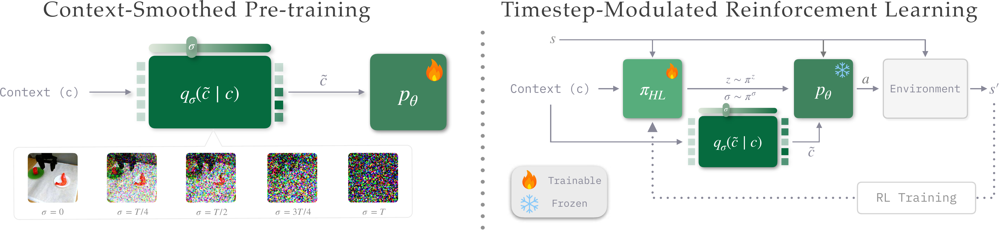
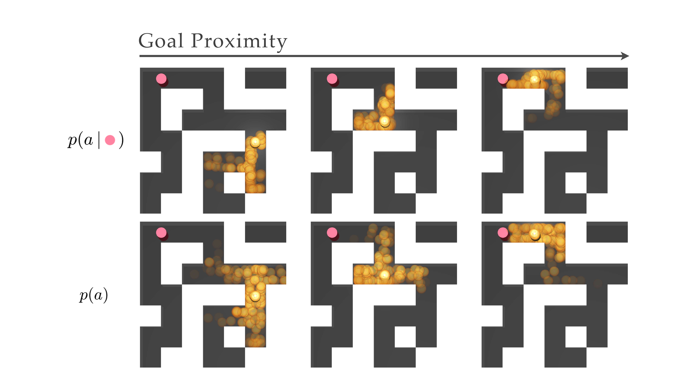
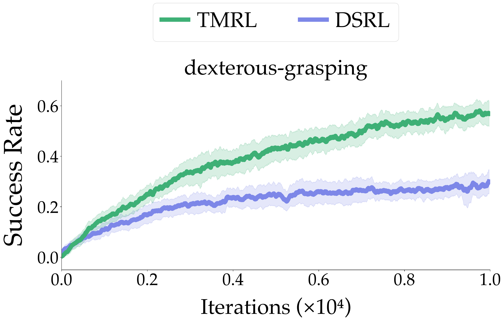
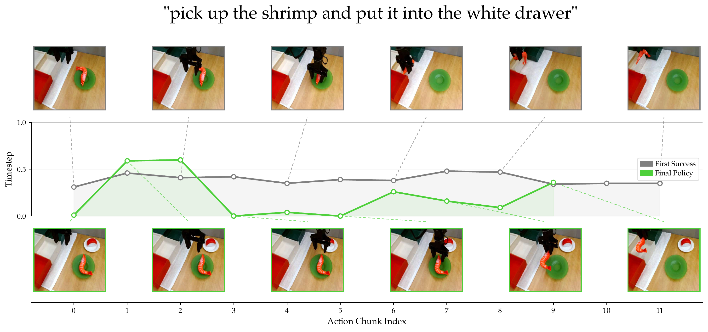

# TMRL: Diffusion Timestep-Modulated Pretraining Enables Exploration for Efficient Policy Finetuning

#

# 基本信息

- **arXiv:** 2605.12236
- **Authors:** Matthew M. Hong, Jesse Zhang, Anusha Nagabandi, Abhishek Gupta
- **Categories:** cs.RO, cs.AI, cs.LG
- **一句话结论:** 通过上下文平滑预训练（CSP）将扩散噪声注入策略输入以结构化扩展动作覆盖，并借助时间步调制强化学习（TMRL）将扩散时间步转化为可学习的探索旋钮，从而在模拟与真实机器人任务中实现高效的策略微调， notably 在真实复杂操作任务中实现不到一小时的 VLA 模型 RL 微调。

#

# 研究问题

论文针对行为克隆（BC）预训练策略在下游强化学习（RL）微调中的**探索瓶颈**展开研究。标准 BC 在分布外（OOD）或数据稀疏区域容易过度拟合，导致条件动作分布 $p(a \mid c)$ 的支撑集坍塌，在线 rollout 难以采样到能获得奖励信号的最优动作，RL 微调因此样本效率极低甚至完全失败。现有方法（如 PostBC）通过在动作空间注入无结构高斯噪声来扩展覆盖度，但会引入执行层面的“抖动”（dithering），且噪声强度无法根据任务进度自适应调节。本文的核心问题是：**如何在不牺牲动作连贯性的前提下，为预训练策略注入结构化、可自适应调节的动作覆盖度，以支撑高效的下游 RL 微调？** 该问题直接关联具身智能中扩散策略（Diffusion Policy）、视觉-语言-动作（VLA）基础模型与在线 RL 的协同范式。

#

# 任务与挑战

具体任务涵盖状态输入导航（OGBench）、图像/VLA 嵌入输入操作（LIBERO）、3D 点云输入灵巧抓取（IsaacLab）以及真实世界 WidowX 与 Franka 平台上的复杂操作。输入为上下文 $c$（状态、图像嵌入、点云或语言指令），输出为动作块 $a^{1:H}$。训练分为两阶段：先用离线演示数据进行 Context-Smoothed Pre-training（CSP），再用在线交互进行 Timestep-Modulated RL（TMRL）微调。

主要挑战有三：

1. **覆盖度与连贯性的权衡：** 动作空间加噪虽能扩展覆盖，但会破坏时间连贯性；直接在输入空间加噪又需保证借用自相似上下文的动作是安全且连贯的。
2. **探索-利用的自适应调节：** 固定噪声水平无法在轨迹不同阶段灵活切换探索与精确模仿。
3. **多模态输入的通用性：** 方法需兼容状态、VLM 嵌入、点云等多种策略输入，且能扩展到大规模 VLA 模型（如 $\pi_0$）。

#

# 核心 Insight

本文的核心思想是**将“噪声注入”从动作空间转移到策略输入（context）空间**，利用扩散前向过程对上下文进行加噪，使单一策略 $p_\theta(a \mid \tilde{c}, z, \sigma)$ 学会在精确的条件分布 $p(a \mid c)$ 与宽泛的边际分布 $p(a)$ 之间连续插值。当噪声水平 $\sigma$ 较低时，策略执行精确模仿；当 $\sigma$ 升高时，相似上下文在表示空间中发生混叠（aliasing），策略被迫从邻近上下文“借用”连贯的动作块，从而结构化地扩展动作覆盖。



在 RL 微调阶段，作者将扩散时间步 $\sigma$（即 context 噪声水平）显式暴露给高层 RL 策略 $\pi_{\mathrm{HL}}$，使其成为一个**可学习的“覆盖调节旋钮”**。大 $\sigma$ 对应高覆盖探索，小 $\sigma$ 对应精确利用，RL 智能体因此可以动态决定何时依赖模仿、何时向外探索。这一设计将生成式控制策略中的去噪进度语义重新诠释为探索强度，桥接了扩散模型与在线 RL 的微调鸿沟。



上图的二维迷宫示例直观展示了为何需要这种插值：在远离目标（粉色点）时，条件分布 $p(a \mid c)$ 过度拟合训练分布，采样轨迹反而使 agent（黄色）远离目标；而边际分布 $p(a)$ 覆盖更广，虽方差大但包含朝向目标的动作。最优策略应在轨迹初期更接近 $p(a)$，末期更接近 $p(a \mid c)$。CSP 预训练正是为了实现这种连续插值，而 TMRL 负责学习何时以及如何进行插值。

#

# 方法与公式

#

## 1. Context-Smoothed Pre-training (CSP)

CSP 在标准模仿学习的基础上，向策略输入 $c$ 注入前向扩散噪声。设 $q_\sigma(\tilde{c} \mid c)$ 为上下文腐蚀核，本文采用扩散模型的前向过程：

```math
q_\sigma(\tilde c \mid c)
\equiv
q_{t_c}(\tilde c \mid c)
=
\mathcal{N}\!\big(\sqrt{\bar{\alpha}_{t_c}}\,c,\ (1-\bar{\alpha}_{t_c})I\big)
\tag{1}
```

其中 $t_c \in \{0,\dots,T_c\}$ 为扩散时间步，$\bar{\alpha}_{t_c}$ 为累积方差调度参数。通过在该核上采样得到加噪上下文 $\tilde{c}$，策略网络以 $\tilde{c}$、初始噪声 $z$ 和噪声水平 $\sigma$（即 $t_c$）为条件进行训练：

```math
\min_\theta\ 
\mathbb{E}_{(c,a)\sim\mathcal{D}}
\ \mathbb{E}_{\substack{\sigma\sim\mathcal{S} \\ \tilde c\sim q_\sigma(\cdot\mid c)}}
\
\Big[
\ell\big(\theta;\ a, \tilde c, \sigma\big)
\Big]
\tag{2}
```

这里 $\mathcal{D}$ 为离线演示数据集，$\mathcal{S}$ 为噪声水平分布，$\ell$ 为适用于生成式控制策略（如扩散或流匹配）的监督损失。与标准 BC 相比，CSP 仅多了一步上下文加噪和将 $\sigma$ 作为显式条件输入，实现简单却能在所有噪声水平上训练单一策略。

#

## 2. Timestep-Modulated RL (TMRL)

预训练完成后，低层策略 $p_\theta$ 被冻结。TMRL 训练一个高层策略 $\pi_{\mathrm{HL}}(z, \sigma \mid s)$，在每个决策步同时选择初始噪声 $z$ 和上下文噪声水平 $\sigma$：

```math
\max_{\pi_{\mathrm{HL}}}\ \mathbb{E}\Big[\sum_{t\ge 0}\gamma^t r_t \Big]
\tag{3}
```

约束条件为：

```math
(z_t,\sigma_t)\sim \pi_{\mathrm{HL}}(\cdot\mid s_t),
\quad
\tilde c_t \sim q_{\sigma_t}(\cdot \mid c(s_t)),
\quad
a_t^{1:H}\sim p_\theta(\cdot\mid \tilde c_t, z_t, \sigma_t)
\tag{4}
```

高层策略通过任意 off-policy RL 算法（如 SAC 或 RLPD）优化。$\sigma$ 的语义是**覆盖度调节器**：增大 $\sigma$ 会抹平上下文细节，使策略从相似上下文中借用动作，扩大探索覆盖；减小 $\sigma$ 则恢复精确条件模仿，提升利用效率。$\pi_{\mathrm{HL}}$ 通常分解为 $\pi_{\mathrm{HL}}^z$ 与 $\pi_{\mathrm{HL}}^{t_c}$ 两个独立分布，以便分别设置动作边界与目标熵。

#

## 3. 理论保证

论文对高斯上下文平滑给出形式化分析。定义高斯平滑后的条件动作分布：

```math
p_\sigma(\cdot\mid c) \ \coloneqq\ \mathbb{E}_{w\sim\mathcal{N}(0,I_d)}\big[p(\cdot\mid c+\sigma w)\big]
\tag{5}
```

**定理 1（平滑增加重叠并使策略关于上下文 Lipschitz 连续）：** 对任意两个上下文 $c, c' \in \mathbb{R}^d$，有

```math
\mathrm{TV}\!\big(p_\sigma(\cdot\mid c),p_\sigma(\cdot\mid c')\big) ~\le~ \frac{\mathbb{E}\|w\|}{\sigma}\,\|c-c'\|
\tag{6}
```

等价地，重叠度 $\mathrm{Ov}(P,Q)\coloneqq 1-\mathrm{TV}(P,Q)$ 满足：

```math
\mathrm{Ov}\!\big(p_\sigma(\cdot\mid c),p_\sigma(\cdot\mid c')\big) ~\ge~ 1-\frac{\mathbb{E}\|w\|}{\sigma}\,\|c-c'\|
\tag{7}
```

该定理表明：

- **增大 $\sigma$** 会降低不同上下文间动作分布的总变差距离，强制增加重叠（覆盖度）。
- **相近上下文**（$\|c-c'\|$ 小）的重叠保证更大，确保覆盖扩展是“结构化借用”而非无结构随机噪声。

进一步地，若原始策略对某对上下文具有局部可辨识性下界 $\mathrm{TV}(p(\cdot|c), p(\cdot|c')) \ge m\|c-c'\|$，则当 $\sigma \ge \mathbb{E}\|w\|/m$ 时，平滑后的重叠度一定不小于原始重叠度，即上下文平滑严格增加了动作覆盖。

#

# 贡献拆解

1. **Context-Smoothed Pre-training（CSP）**
   - **做了什么：** 将覆盖度扩展从动作空间的无结构噪声转向输入空间的结构化扩散噪声，通过前向扩散核 $q_\sigma(\tilde{c}|c)$ 对策略输入加噪，训练单一策略覆盖所有噪声水平。
   - **为什么有效：** 相似上下文在噪声下发生混叠，策略被迫学习从邻近上下文借用连贯动作块，既扩展了支撑集又保持了时间连贯性；理论证明高斯平滑可保证覆盖度提升。
   - **与已有方法差别：** PostBC 在动作空间注入高斯噪声，导致 dithering 且不可自适应；CSP 在输入空间加噪，动作输出仍由生成模型产生，保持块级连贯。

2. **Timestep-Modulated RL（TMRL）**
   - **做了什么：** 将扩散时间步 $\sigma$ 作为高层 RL 策略的显式输出动作之一，由 RL 动态调节。
   - **为什么有效：** 把探索-利用权衡显式化为可学习的连续控制变量，使智能体能根据状态自适应选择“精确模仿”或“广泛借用”。
   - **与已有方法差别：** DSRL 等 steering 方法只能在冻结策略的原始条件支撑集内操作；TMRL 通过调节 $\sigma$ 使低层策略在 $p(a|c)$ 与 $p(a)$ 之间插值，突破了原始支撑集限制。

3. **多模态与真实世界验证**
   - **做了什么：** 在状态、图像（VLA 嵌入）、3D 点云三种输入模态的模拟任务以及 WidowX/Franka 真实机器人上验证。
   - **为什么有效：** 上下文平滑与输入模态无关，仅需对策略输入加噪即可。
   - **与已有方法差别：** 首次展示在 $\pi_0$ 等大规模 VLA 模型上，通过不到一小时的在线 RL 微调完成真实复杂操作任务，而基线完全失败。

#

# 关键图表解读

**图 1：CSP 与 TMRL 系统框架（figure-009-method-single.png）**

该图分为左右两部分。左侧展示预训练阶段：上下文 $c$ 经腐蚀核 $q_\sigma(\tilde{c}|c)$ 加噪后输入策略 $p_\theta$，底部可视化不同 $\sigma$（从 $0$ 到 $T$）下图像上下文逐渐被噪声淹没的过程。右侧展示 RL 微调阶段：高层策略 $\pi_{HL}$ 接收状态 $s$，输出初始噪声 $z$ 和噪声水平 $\sigma$；$\sigma$ 控制上下文腐蚀程度后送入冻结的低层策略 $p_\theta$ 生成动作。图中火焰图标表示可训练参数，雪花图标表示冻结参数。读图时应注意 $\sigma$ 的双重角色：既是预训练时的条件输入，又是 RL 时的探索控制变量。

**图 2：二维迷宫中的分布插值动机（figure-004-pedagogical.png）**

该图对比了条件分布 $p(a|c)$（上行）与边际分布 $p(a)$（下行）在 agent 逐渐接近目标（粉色点）过程中的动作采样。左列远离目标时，$p(a|c)$ 的样本集中在错误区域，而 $p(a)$ 的样本更分散且包含正确方向；右列接近目标时，$p(a|c)$ 变得有效。读图关键是理解：单一固定分布无法同时满足远距离探索与近距离精确控制，而 CSP 提供的连续插值恰好解决此矛盾。

**图 3：灵巧抓取成功率曲线（figure-008-dexterous-grasping.png）**

该图展示 IsaacLab 灵巧抓取任务中 TMRL（绿）与 DSRL（蓝）的成功率随训练迭代变化。TMRL 最终成功率约 0.58，DSRL 约 0.28，TMRL 达到 DSRL 的约 2.5 倍，且在整个训练过程中样本效率显著更高。读图时应注意两条曲线的差距不仅体现在渐近性能，更体现在早期上升斜率，说明 TMRL 的探索机制能更快发现有效抓取策略。

**图 4：真实世界任务中的时间步动态调制（figure-011-shrimp-timesteps.png）**

该图展示 WidowX 机器人执行 "pick up the shrimp and put it into the white drawer" 任务时，首次成功（灰线）与最终收敛策略（绿线）在不同 action chunk 下选择的扩散时间步（归一化到 $[0,1]$）。上方为首次成功的视觉序列，下方为最终策略序列。读图时应注意：最终策略在操作关键期（如抓取和放置的中间阶段）使用更低的时间步（更小的 $\sigma$，更精确的条件模仿），而在某些阶段允许更高噪声以维持覆盖；这直观证明了 TMRL 确实学会了动态调节探索-利用权衡。

#

# 实验与消融

**数据集与设定。** 实验覆盖四类输入模态与任务：

- **状态输入：** OGBench 的 `pointmaze-giant`（导航）与 `cube-single`（操作），训练数据与评估任务分布不同。
- **图像/VLA 嵌入输入：** LIBERO 基准的 `libero-goal` 与长程任务 `libero-90`，基于 $\pi_0$ VLA 模型，对 VLM 嵌入进行上下文平滑。
- **3D 点云输入：** IsaacLab 灵巧抓取，训练于三个罐状物体，评估于未见过的马克笔。
- **真实世界：** WidowX（BridgeData-v2）与 Franka（DROID）平台，微调 $\pi_0$。

**基线。** 包括 RLPD（off-policy RL + 高斯动作噪声）、SPiRL（分层技能 RL）、DSRL（扩散策略噪声空间 steering）以及 PostBC（动作空间加噪 + DSRL）。

**主结果。**

- **OGBench：** `pointmaze-giant` 上 TMRL 最终成功率比最优基线 DSRL 高 14%；`cube-single` 上 DSRL 接近 0，TMRL 高出约 200%。
- **LIBERO：** `libero-goal` 上 TMRL 与 RLPD 均达 100%；但在长程任务 `libero-90` 上，仅 TMRL 能取得非平凡成功率，DSRL 因过度拟合到单一物体而失败。
- **灵巧抓取：** TMRL 成功率约为 DSRL 的 2.5 倍，点云上下文平滑有效促进了跨物体抓取策略迁移。



- **真实世界：** 在 WidowX 的 `sausage-in-pot`、`shrimp-in-white-drawer` 与 DROID 的 `press-button` 任务中，TMRL 在不到一小时内将 $\pi_0$ 微调至接近完美成功率，DSRL 几乎无法学习。



**消融与分析。**

- **CFG-RL 对比（TMRL-CFG）：** 将分类器自由引导（CFG）的插值系数 $w$ 作为 RL 动作输出，结果完全失败。原因是 CFG 仍依赖原始条件 $p(a|c)$ 的梯度，在 OOD 上下文上无法有效外推；而 TMRL 通过上下文腐蚀将 OOD 上下文“拉回”分布内。
- **探索行为可视化：** 在 LIBERO 任务中，DSRL 的探索局限于基础策略的狭窄条件支撑集；TMRL 通过平滑上下文借用相似任务的动作序列，形成更广泛且连贯的探索分布。
- **时间步动态变化：** 轨迹初期 TMRL 倾向于使用较大的 $t_c$（高噪声）以扩展覆盖；接近任务完成时降低 $t_c$，转向精确模仿。这表明高层策略确实学会了将 $\sigma$ 作为探索-利用旋钮。

**最强证据：** 横跨模拟/真实、低维/高维动作空间的多模态结果一致表明，TMRL 能将 CSP 带来的覆盖度优势转化为实打实的 RL 样本效率，尤其在 $\pi_0$ 等大规模 VLA 模型的真实微调中展现出基线无法比拟的实用性。

**最存疑证据：** 真实世界实验明确省略了 PostBC 基线，作者称其在模拟中表现与 DSRL 接近且需额外重训练步骤，但真实世界与模拟的分布偏移特性不同，该省略削弱了结论的完备性；此外，CFG-RL 消融的实现方式（将 $w$ 作为 RL 动作输出）偏离标准 CFG 的推理时引导范式，可能低估了 CFG 类方法的潜力。

#

# 局限性

1. **安全性缺口：** 上下文混叠（context aliasing）可能导致策略从相似但危险的上下文中借用动作，引发不安全行为。论文仅提出未来可结合安全过滤器或世界模型，未在实验中给出缓解方案，这是从实验室走向工业部署的主要障碍。
2. **样本效率仍有限：** 尽管真实世界可在 1 小时内完成微调，但对于更复杂的长程任务，当前样本效率仍不实用，需要更高效的 steering 算法或更优的腐蚀核设计。
3. **实验报告的选择性：** 真实世界实验未包含 PostBC 基线；CFG-RL 消融的实现方式与标准 CFG 不同，对比可能不公平。
4. **理论与实现的间隙：** 理论分析基于高斯平滑假设，而实际实现使用离散扩散调度器与复杂网络架构（DiT、VLA），理论保证的精确适用边界未完全厘清。
5. **超参数敏感性：** 真实世界实验中需对 TMRL 设置较低的动作噪声边界并限制最大时间步，以避免采样到接近边际分布 $p(a)$ 的不安全动作序列，说明方法对边界设置仍有一定敏感。

#

# 个人研究判断

面向 **“World Models assisting Embodied AI downstream tasks”** 的研究方向，**这篇论文值得继续追踪**。

理由如下：

- **输入空间噪声作为覆盖度调节器** 应成为机器人预训练的标准设计之一。CSP 揭示了一个被忽视的原则：预训练目标不仅要拟合 $p(a|c)$，更要为下游 RL 预留可扩展的动作覆盖度。这要求重新思考机器人基础模型的预训练损失与数据配比。
- **扩散时间步的语义化** 为生成式策略与 RL 的结合提供了新接口。将 $\sigma$ 从“去噪进度”重新诠释为“探索强度”，打开了通过 RL 自适应调度生成过程的新范式，后续可探索基于不确定性或世界模型预测的更精细 $\sigma$ 调度机制。
- **VLA/Foundation Model 时代的 RL 微调路径。** 论文证明了在 $\pi_0$ 等 VLA 模型上，仅需对输入嵌入进行轻量加噪预训练，即可在极短真实交互时间内完成 RL 微调，这为 foundation model 在具身智能中的高效迁移和 sim-to-real 部署提供了可直接落地的技术路径。后续可结合世界模型进行安全过滤，进一步释放该框架的潜力。
