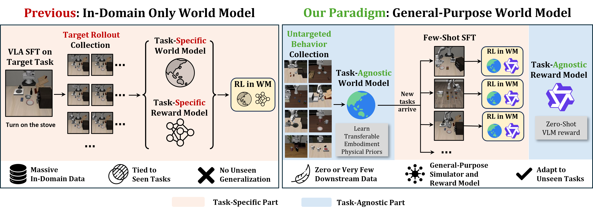
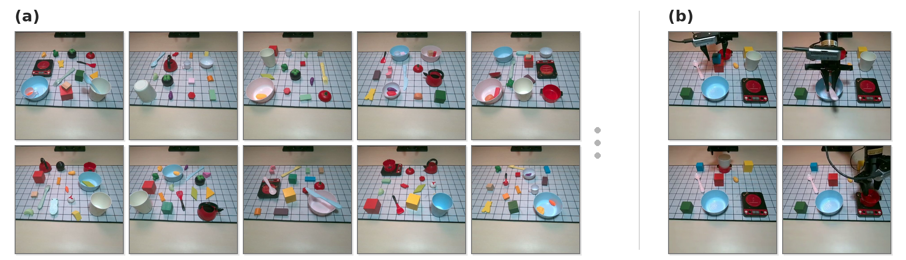
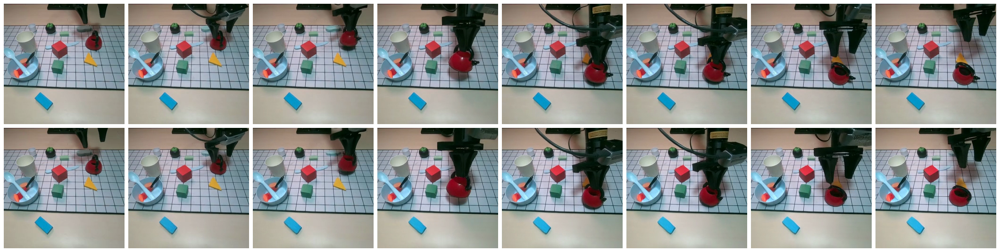

# Reinforcing VLAs in Task-Agnostic World Models

#

# 基本信息

- **arXiv**: 2605.12334
- **Authors**: Yucen Wang, Rui Yu, Fengming Zhang, Junjie Lu, Xinyao Qin, Tianxiang Zhang, Kaixin Wang, Li Zhao
- **Categories**: cs.AI
- **一句话结论**: 本文提出 RAW-Dream 范式，首次将世界模型学习与下游任务完全解耦，利用通用物理先验与零样本 VLM 奖励实现 VLA 在未见任务上的高效想象强化学习，显著降低对昂贵任务特定数据的依赖。

#

# 研究问题

现有基于世界模型（World Model, WM）的 Vision-Language-Action（VLA）后训练方法（如 WMPO、WoVR）虽能降低真实交互成本，但其世界模型与奖励模型仍依赖大量任务特定数据微调，无法泛化到未知任务，严重制约可扩展性。本文要解决的核心问题是：**如何打破世界模型对目标任务轨迹的强依赖，使其成为可复用的通用物理模拟器？** 这与 Embodied AI 中 World Model 的泛化性、VLA 的策略后训练以及机器人学习的数据效率密切相关。

#

# 任务与挑战

具体任务是在严格的目标任务数据稀缺约束下，对预训练 VLA 策略进行 RL 后训练以适配新任务。输入为机器人初始视觉观测与语言指令，输出为动作序列；世界模型则接收动作序列与上下文潜在状态，自回归地推出未来视频帧。训练在 LIBERO 仿真（四个完全未见任务套件：Spatial、Object、Goal、Long）和真实 AgileX Piper 机械臂上展开。

已有方法不够好，原因在于它们将世界模型和奖励模型与已知目标任务紧耦合：每次面对新任务都需收集数千条目标域轨迹重新训练或微调 WM 与奖励分类器，导致 WM 沦为“一次性数据增强工具”，从根本上丧失了向未见任务扩展的能力。

#

# 核心 Insight

本文的核心思想建立在一条基本观察之上：机器人工作空间中的物理动力学本身与任务语义无关——无论指令是“把碗放到架子上”还是“把碗推到一边”，碗的滑动动力学是相同的。因此，世界模型完全可以在多样化、无任务标签的行为数据（如 play 数据或带噪探索数据）上预训练，仅学习可迁移的物理先验；而任务成功与否的判断可直接交由现成的视觉语言模型（VLM）以零样本方式完成。这样，WM 和奖励函数均与下游任务解耦，VLA 可在零样本想象中完成任意新任务的强化学习微调。

此外，由于任务无关 WM 在未见任务上更容易产生幻觉，作者引入**双噪声验证（Dual-Noise Verification, DNV）**机制：利用扩散模型固有的随机性，对同一动作序列以不同初始噪声重播，若 VLM 奖励不一致则判定为不可靠轨迹并剔除，从而抑制假阳性奖励黑客。



#

# 方法与公式

RAW-Dream 的 pipeline 分为三个核心阶段：**任务无关世界模型构建**、**长程自回归推出**与**带 DNV 过滤的 GRPO 优化**。

#

## 1. 世界模型训练

作者基于 WAN 2.1-T2V-1.3B 的 DiT 骨干构建动作条件视频生成器。动作嵌入通过一个从头训练的 MLP 投影为 AdaLN 的 scale、shift、gate 参数，与扩散时间步的 AdaLN 参数融合后调制每个 DiT 块的注意力输出。为防止未来动作泄漏，时间自注意力严格采用**因果掩码**。网络在多样化的无任务行为数据上训练，使用 rectified flow matching 目标监督速度场预测：

```math
\mathcal{L}
= \mathbb{E}_{\tau,\mathbf{z},\boldsymbol{\epsilon},\mathbf{a}}
\left[
\left\lVert
v_\theta(\mathbf{z}^{\tau}, \tau, \mathbf{a}, \mathbf{z}_{ctx})
-
(\boldsymbol{\epsilon} - \mathbf{z}^{0})
\right\rVert^2
\right]
\tag{1}
```

其中，$\tau$ 为扩散时间步；$\mathbf{z}^{\tau} = \tau \boldsymbol{\epsilon} + (1-\tau) \mathbf{z}^{0}$ 为加噪后的潜在状态；$\mathbf{z}^{0}$ 为真实潜在状态；$\boldsymbol{\epsilon} \sim \mathcal{N}(\mathbf{0}, \mathbf{I})$ 为标准高斯噪声；$\mathbf{a}$ 为条件动作；$\mathbf{z}_{ctx}$ 为上下文潜在状态；$v_\theta$ 为待学习的速度场网络。

#

## 2. 长程自回归推出与渐进锚定噪声

推理时，WM 以自回归方式生成长视频：每步预测 2 个潜在状态（对应 OpenVLA-OFT 的 8 帧动作块），上下文窗口为 6。为保持场景一致性，每一自回归步都以第一帧作为锚定条件。然而，零样本迁移时模型会过度锚定初始帧，导致**第一帧鬼影**（first-frame ghosting）——已移动的物体在原位重现。

为此，作者引入**渐进锚定噪声**：从第 3 个 AR 步起，对锚定帧线性增加扩散噪声：

```math
t_{\mathrm{anchor}}^{(s)} = \min\!\big(10 \cdot \max(s-3, 0),\; 300\big)
```

其中 $s$ 为自回归步数。该噪声使锚定帧的影响随时间平滑衰减，迫使模型依赖近期上下文学习到的物理动力学。非锚定上下文帧则固定注入噪声步长 $t_c = 50$。

#

## 3. 零样本 VLM 奖励与双噪声验证

策略在 WM 中采样生成 $G=8$ 条想象轨迹后，由冻结的 Qwen3-VL 直接根据视频和指令输出二元成功判断作为奖励 $R_i$。为抑制 WM 幻觉导致的假阳性，DNV 对 VLM 判定为成功的轨迹执行二次验证：使用**独立重采样的初始扩散噪声**在 WM 中重播相同动作序列；若 VLM 改判为失败，则该成功被视为幻觉，该轨迹的奖励被替换为组内可靠轨迹的均值（优势置零）。若单组内超过 2 条轨迹被标记为幻觉，则整组丢弃以保证优化稳定性。

#

## 4. GRPO 策略优化

在过滤后的可靠子集 $\mathcal{R}$ 上计算组相对优势，执行裁剪后的策略梯度更新：

```math
\mathcal{J}(\theta)
= \mathbb{E}_{s_0 \sim \mathcal{D}, \{\tau_i\} \sim \pi_{\theta_{\mathrm{old}}}}
\left[
\frac{1}{G_{\mathcal{R}}}
\sum_{i \in \mathcal{R}}
\frac{1}{T_i}
\sum_{t=1}^{T_i}
\min\!\big(
r_{i,t}(\theta)\hat{A}_i,\;
\mathrm{clip}(r_{i,t}(\theta), 1-\epsilon_{\mathrm{low}}, 1+\epsilon_{\mathrm{high}})\hat{A}_i
\big)
\right]
\tag{2}
```

```math
r_{i,t}(\theta)
= \frac{\pi_{\theta}(a_{i,t} \mid s_{i,t})}{\pi_{\theta_{\mathrm{old}}}(a_{i,t} \mid s_{i,t})},
\qquad
\hat{A}_i
= \frac{R_i - \mathrm{mean}(\{R_j\}_{j \in \mathcal{R}})}{\mathrm{std}(\{R_j\}_{j \in \mathcal{R}})}
\tag{3}
```

其中，$r_{i,t}(\theta)$ 为新策略与旧策略在轨迹 $\tau_i$ 第 $t$ 步的动作概率比；$\hat{A}_i$ 为基于可靠子集 $\mathcal{R}$ 归一化的组相对优势；$G_{\mathcal{R}}$ 为可靠轨迹数量；$T_i$ 为轨迹长度；$\epsilon_{\mathrm{low}}$ 和 $\epsilon_{\mathrm{high}}$ 为概率比裁剪阈值。

#

# 贡献拆解

1. **任务无关的 RAW-Dream 范式**：首次将世界模型学习与下游任务语义完全解耦。WM 在通用 play/探索数据上预训练，仅学习物理动力学；奖励由冻结的现成 VLM 零样本提供，无需任何目标任务数据或微调。两者均为任务无关，使 VLA 可完全在零样本想象中完成 RL 微调，将目标域数据需求从数千条降至零。
2. **渐进锚定噪声机制**：针对零样本 WM 自回归推出时的“第一帧鬼影”现象，在推理时随 AR 步数逐渐增加第一帧锚定条件的扩散噪声，平滑衰减其影响，迫使模型依赖近期上下文与学到的物理动力学，而非机械复制初始观测。
3. **双噪声验证（DNV）**：在不引入额外判别模型或人工标注的情况下，利用 DiT 扩散噪声的固有随机性进行语义级幻觉检测。通过检测同一动作序列在不同噪声下的 VLM 奖励一致性，识别并过滤 WM 幻觉，有效解决了任务无关 WM 在未见任务上幻觉加剧的问题，稳定了长程想象 RL。
4. **数据效率的极限验证**：在仿真和真实机器人上系统量化了“通用物理先验”与“任务特定数据”之间的权衡。ID-FT WM 仅注入 500 条目标轨迹即全面超越 WoVR 用 2500 条目标轨迹从头训练的 WM（66.0% vs 60.9%），证明了强先验上的少量数据收益远超大量数据的从头训练。

#

# 关键图表解读

#

## 图 1：范式对比（figure-005-motivation.png）


该图以左右对比形式清晰展示了传统方法与 RAW-Dream 的核心差异。左侧（Previous）显示：VLA 需在目标任务上 SFT，随后收集大量目标域轨迹训练任务特定的 WM 和奖励模型，最后才能进行 RL。这导致流程 tied to seen tasks，且无法泛化到未见任务。右侧（Our Paradigm）显示：WM 仅在多样化无任务行为数据上预训练，学习可迁移的物理先验；下游新任务到达时，仅需极少量的 Few-Shot SFT 锚定语义，即可在任务无关 WM 中通过零样本 VLM 奖励进行 RL。读图时应注意底部图例：左侧所有模块均为 Task-Specific，而右侧蓝色区域为 Task-Agnostic Part，这是本文可扩展性论断的视觉化支撑。

#

## 图 2：数据多样性与真实任务（figure-006-paper-figure-play-and-tasks.png）



该图支撑了“任务无关数据足以学习通用物理先验”的论点。子图 (a) 展示了用于预训练 WM 的 play 数据场景，包含丰富的物体排列、桌面布局和交互方式，证明数据覆盖度足以支撑跨任务迁移。子图 (b) 展示了真实 AgileX Piper 机械臂上的四个下游评估任务（Stack Block、Place Pot、Put Spoon、Place Cup）。读图时应注意：这些下游任务的场景布局在 WM 训练时完全不可见，从而强制验证了零样本迁移能力。

#

## 图 3：真实世界 WM Rollout（figure-000-rollout-testdata10-121f.png）



该图展示了任务无关 WM 在真实物理环境中的长程自回归推出效果。时间序列帧显示，尽管 WM 仅在约 4 小时的未策划 play 数据上训练，且从未见过该下游任务布局，它仍能较准确地预测机械臂的运动轨迹、物体交互和接触动力学。这直接验证了通用物理先验在真实机器人上的有效性，是“想象 RL 可替代真实交互”这一核心结论的最直观证据。

#

# 实验与消融

#

## 数据集与设定

- **仿真**：WM 在 LIBERO-90 的多样化探索数据（带噪策略推出）上预训练；下游在四个完全未见套件（Spatial、Object、Goal、Long）上评估。每个套件 10 个任务，VLA 先进行 1-shot SFT（每任务 1 条专家演示），再在 WM 中进行 GRPO。
- **真实世界**：WM 在约 4 小时未策划的 play 数据上预训练；下游为 AgileX Piper 机械臂上的 4 个接触丰富操作任务，VLA 进行 3-shot SFT。
- **WM 条件**：Zero-Shot（零目标数据）、Co-Train（复用 SFT 的 10 条演示联合微调）、ID-FT（500 条目标轨迹）、WoVR（2500 条目标轨迹从头训练）。

#

## 主结果

| 核心对比 | 平均成功率 | 相对 1-shot SFT 增益 | 目标域数据成本 |
|---|---|---|---|
| 1-shot SFT | 43.4% | — | 10 条演示 |
| Zero-Shot WM + RL | 52.3% | **+8.9%** | 0 条额外轨迹 |
| Co-Train WM + RL | 57.1% | **+13.7%** | 10 条演示（复用） |
| ID-FT WM + RL | 66.0% | **+22.6%** | 500 条轨迹 |
| WoVR WM + RL | 60.9% | +17.5% | 2500 条轨迹 |
| Online RL (Long) | 58.8% | +15.4% | ~2500 条真实交互 |

关键发现：
- **Zero-Shot WM** 在零目标数据下即超越消耗约 500 真实回合的 Online RL (Short)（52.3% vs 47.9%）。
- **Co-Train WM** 在零额外收集成本下逼近消耗约 2500 真实回合的 Online RL (Long)（57.1% vs 58.8%）。
- **ID-FT WM** 以 1/5 数据全面超越 WoVR（66.0% vs 60.9%），证明通用物理先验的数据效率优势。
- **真实机器人**：3-shot SFT 基线 50.0%，RAW-Dream 提升至 71.7%（+21.7%）。

#

## 消融实验

- **奖励模型对比**（表 4）：零样本 Qwen3-VL 奖励（平均 52.3%）显著优于 1-shot 微调的 VideoMAE 分类器（31.7%），后者因过拟合专家演示而灾难性误判 WM 推出结果。Qwen3-VL 甚至接近 oracle Robometer（50.6%）。
- **DNV 有效性**（表 4）：在 Zero-Shot WM 上，DNV 在 LIBERO-Long 上将增益从 +10.6% 提升至 +15.6%。DNV 对长程任务尤为关键，因为自回归累积的不确定性在长 horizon 上更容易产生幻觉。
- **渐进锚定噪声**：定性实验（附录图）显示，该机制有效消除了 first-frame ghosting，使物体运动预测更符合物理一致性。

#

## 最强证据与最存疑证据

- **最强证据**：ID-FT WM 仅用 500 条目标轨迹即全面超越 WoVR 的 2500 条轨迹从头训练，且 Zero-Shot WM 在 Long 套件上显著优于长程 Online RL，证明通用物理先验的数据效率优势。
- **最存疑证据**：LIBERO-Object 套件上 Zero-Shot WM 的 RL 增益仅 +0.8%，与其极差零样本质量（FVD=233）直接对应；更反常的是 LIBERO-Goal 套件，Co-Train WM 的仿真指标（FVD=50.33）显著优于 Zero-Shot WM（FVD=89.83），但 RL 结果反而更低（58.4% vs 60.2%）。作者归因于 VLM 奖励在该套件上 F1 仅 35.0% 的语义判断失效，却未解释为何更高保真度的 WM 未能缓解此问题。

#

# 局限性

1. **VLM 奖励的语义天花板**：零样本 VLM 在 LIBERO-Goal 上 F1 仅 35.0%（Precision 61.1%, Recall 24.5%），严重制约 RL 上限。该瓶颈无法通过提升 WM 保真度解决（Co-Train WM 在 Goal 上 RL 反而略低于 Zero-Shot WM），暗示现成 VLM 对抽象空间关系与语义目标的判断仍不可靠。
2. **WM 质量的天花板效应**：当视觉输入分布发生剧烈偏移（如 LIBERO-Object 的全新物体类别）时，Zero-Shot WM 的 FVD 高达 233，导致 RL 增益几乎为零。此时仍需少量目标数据（Co-Train）弥补，论文未深入分析 WM 在此类分布偏移下具体缺失了何种物理/视觉表征。
3. **DNV 的适用边界与代价**：DNV 约带来 1.3 倍的 WM 推理开销；当 WM 整体不可靠（如 Object Zero-Shot）或 VLM 本身系统性误判（如 Goal 套件）时，DNV 无法挽救性能。其“超过 2 条标记则整组丢弃”的策略在训练早期可能过度保守，降低有效样本效率。
4. **实验范围**：真实世界实验仅在单台 AgileX Piper 上进行，任务数量较少；未在更多样化的真实环境（如不同光照、背景）中验证泛化性。

#

# 个人研究判断

面向 “World Models assisting Embodied AI downstream tasks” 的研究方向，**本文非常值得继续追踪**。

理由如下：
- **范式意义**：RAW-Dream 首次清晰论证了通用物理先验对任务特定数据的替代效应，将世界模型从“单次任务专用模拟器”转变为可复用的通用物理基础设施。这种“预训练一次、多任务复用”的范式与 LLM/VLM 的发展路径一致，具备极强的可扩展性。
- **技术启发**：渐进锚定噪声和 DNV 为扩散式世界模型的长程自回归推理提供了实用的工程解决方案，DNV 的思想更可推广至一般扩散模型的语义级幻觉检测。
- **未来空间**：随着基础世界模型（如更大规模的视频生成模型）和 VLM 能力的持续提升，该范式的性能上限将同步提高。后续研究可探索轻量级 VLM 校准（如利用少量自动阈值调整或偏好学习）以提升零样本奖励稳定性，以及在 WM 中显式解耦物体外观与物理动力学，从而真正实现对新物体、新场景的零样本可靠模拟。
