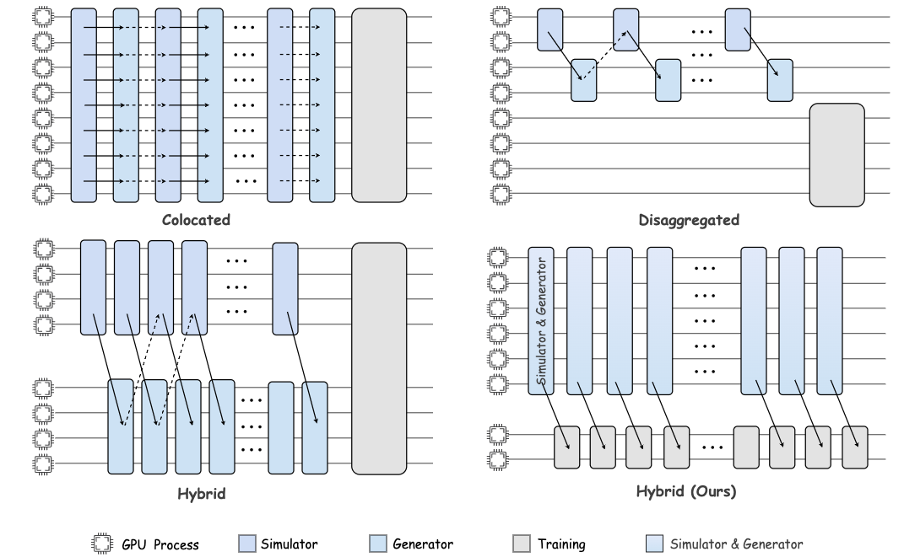
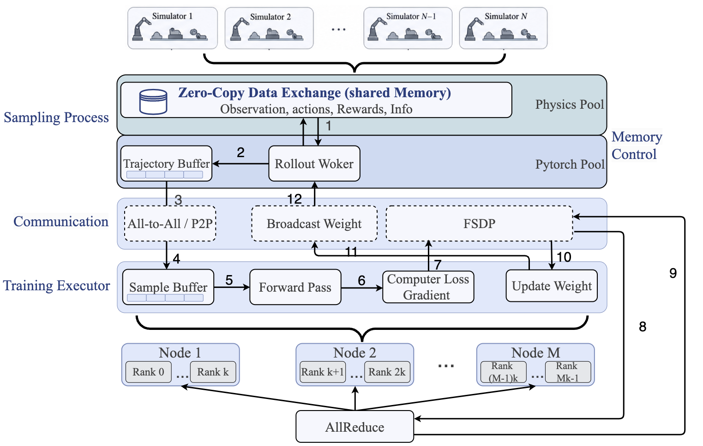
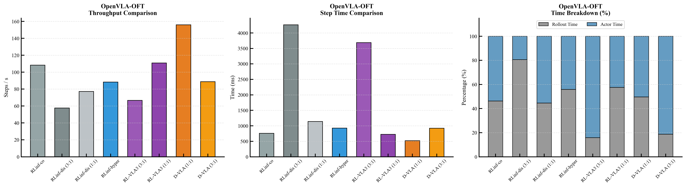
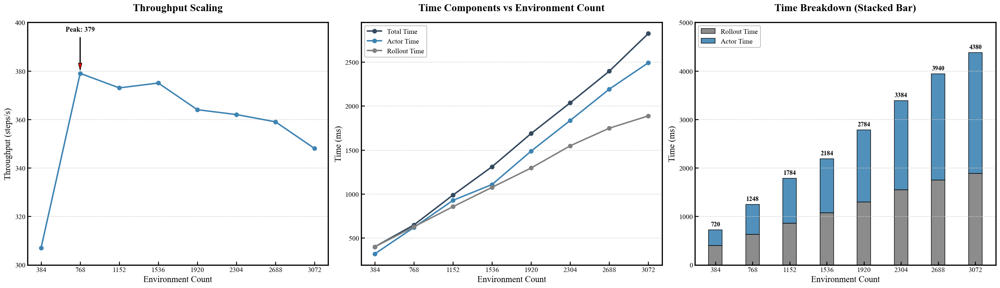

# D-VLA: A High-Concurrency Distributed Asynchronous Reinforcement Learning Framework for Vision-Language-Action Models

#

# 基本信息

- **arXiv**: 2605.13276
- **Authors**: Yucheng Guo, Yongjian Guo, Zhong Guan, Wen Huang, Haoran Sun, Haodong Yue, Xiaolong Xiang, Shuai Di, Zhen Sun, Luqiao Wang, Junwu Xiong, Yicheng Gong
- **Categories**: cs.AI, cs.RO
- **一句话结论**: D-VLA 通过 Plane Decoupling 与四线程异步 Swimlane 流水线，在物理层面隔离仿真与训练负载，在十亿参数 VLA 模型上实现高达 86.26% 的吞吐量提升，并在 16 GPU 多节点扩展中保持近线性加速与策略收敛性。

#

# 研究问题

本文解决的核心工程问题是：**大规模具身智能训练中，高保真物理仿真与深度学习优化之间的系统性资源冲突**。具体而言，VLA 模型（如 $\pi_{0.5}$、OpenVLA-OFT）的 RL 训练需要同时运行物理引擎（高频、碎片化 CPU/GPU 占用）和巨大的神经网络（密集显存与带宽需求）。现有框架（如 RLinf-VLA、RL-VLA³）通过混合资源分配或三阶段异步流水线缓解了部分压力，但未能从根本上消除仿真与优化在执行平面上的耦合争用，导致系统吞吐量被最慢的物理步进或同步开销阻塞。该问题直接制约了从监督微调（SFT）向在线强化学习范式的转型，也限制了 World Model 与具身智能体在复杂长序列交互任务中的规模化训练。

#

# 任务与挑战

**任务设定**：在 ManiSkill 物理仿真环境中，对两种代表性 VLA 模型进行分布式在线 RL 训练：

- **$\pi_{0.5}$**：基于扩散（Diffusion）的迭代去噪策略，计算密度高；
- **OpenVLA-OFT**：基于自回归 Transformer 的大型模型，采用 PEFT 微调，参数量大。

输入为多模态观测（视觉+语言指令），输出为动作块（action chunking）。训练采用 Group Relative Policy Optimization（GRPO）作为策略优化算法。

**核心挑战**：

1. **资源争用**：物理引擎频繁的内存分配/释放导致 PyTorch 显存碎片化；仿真与推理共享 GPU 计算单元引发内核级阻塞。
2. **通信开销**：高分辨率图像观测在跨进程传输时产生严重序列化开销；传统同步分布式 RL 中权重广播与数据回传争抢 NCCL 带宽。
3. **流水线气泡**：现有异步方案（如 RL-VLA³ 的三阶段流水线）仍受限于组件间速度不匹配，导致 GPU 空转或准同步退化。
4. **扩展性瓶颈**：跨节点训练时，高频张量流与全局梯度归并相互干扰，难以在保持线性加速的同时维持样本效率。

#

# 核心 Insight

D-VLA 的核心设计哲学是 **"Plane Decoupling"（平面解耦）**：不再试图在同一执行流中"平衡"仿真与训练，而是从底层架构上**物理隔离高频数据交互平面与低频权重控制平面**。高频环境交互数据（观测、动作、奖励）走 Training Data Plane，利用 NCCL 等高性能集合通信；低频但要求确定性的模型权重同步走 Weight Control Plane，被显式卸载到 CPU 后端（Gloo），避免触发 GPU 同步调用。这种隔离消除了物理仿真流与深度学习流之间的内核级争用和死锁风险。

在此基础上，D-VLA 构建了 **四线程异步 "Swimlane" 流水线**，将采样、权重接收、梯度训练、权重分发拆分为四个独立物理线程，通过轻量级信号量同步。只要各组件的耗时保持对称，就能实现计算与通信的完全重叠，将传统同步 RL 中的 "GPU 气泡" 压缩到接近零。



上图对比了 Colocated、Disaggregated、Hybrid 与 Hybrid (Ours) 四种部署模式。D-VLA 的 Hybrid (Ours) 模式将 Simulator & Generator 与 Training 在物理上分离，并通过独立的 Control Plane 传输权重，从而在执行层面彻底解耦仿真与优化。

#

# 方法与公式

D-VLA 的系统架构如下图所示，整体分为 Sampling Process、Communication 与 Training Executor 三层，并基于双池显存与拓扑感知复制实现大规模扩展。



**组件划分与数据流**：

- **Rollout Workers**：每个 Rollout GPU **同地部署**（co-locate）PhysX 加速的并行仿真环境与一个**冻结（frozen）**的策略推理副本。完成固定步长（fixed-horizon）的 rollout epoch 后，轨迹数据通过 NCCL all-to-all（Data Plane）发送至 Actor GPU。
- **Actor Workers**：接收轨迹后，在 **FSDP** 下计算 GRPO 优势与裁剪策略梯度。更新后的权重通过**后台 Gloo 通道**（Control Plane）广播回 Rollout 侧，该通道刻意与 CUDA 解耦，避免与 PhysX 仿真流发生内核级争用。

**Swimlane 四线程异步流水线**：

系统将执行周期定义为四个独立物理线程：

1. **主采样线程**：驱动环境步进与观测收集；
2. **异步权重接收线程**：在后台监听 Control Plane 的新权重广播；
3. **训练执行线程**：执行前向/反向传播与参数更新；
4. **权重分发线程**：将更新后的权重推送到 Control Plane。

四线程运行在各自的资源轨道上，通过轻量级信号量同步 epoch 边界，确保硬件不会在等待特定信号时空转。

**双池显存管理**：

为防止物理引擎频繁的内存操作导致 PyTorch 显存碎片化，D-VLA 将显存显式切分为：

- **Model Computation Pool**：由 PyTorch Caching Allocator 管理，专用于模型权重、激活与梯度；
- **Environment Auxiliary Pool**：预留给物理引擎临时对象（如接触点、刚体状态）。

**拓扑感知扩展**：

跨节点场景下，D-VLA 采用**局部拓扑复制**策略：在每个节点内部构建完整的“采样-推理”闭环，将高频张量流限制在节点内高速互联（如 NVLink）；全局梯度归约通过 FSDP 完成，而权重广播因被卸载到 Control Plane，不会反向拖慢本地采样效率。

**训练目标**：

本文采用 GRPO 作为策略优化算法。原文信息不足以完整复原其显式损失函数公式，但可确认其核心思想为：在组内计算相对优势，并通过裁剪策略梯度（clipped policy gradient）更新策略，以适配稀疏奖励和长序列交互任务。

系统吞吐量的定义为：

```math
\mathrm{Throughput} = \frac{N_{\mathrm{steps}}}{T_{\mathrm{elapsed}}} \quad (\mathrm{steps/s})
```

其中 $N_{\mathrm{steps}}$ 为总环境步数，$T_{\mathrm{elapsed}}$ 为经过时间。在动作块大小（action chunk size）固定时，该指标等价于单位时间内执行的动作推理步数。

#

# 贡献拆解

1. **Plane Decoupling 与四线程 Swimlane 异步流水线**
   - **做了什么**：首次在系统架构层面物理隔离 Training Data Plane（NCCL/GPU）与 Weight Control Plane（Gloo/CPU），并在此基础上构建四线程 Swimlane 流水线，实现采样、推理、梯度计算、权重分发的完全并行重叠。
   - **为什么有效**：消除了物理仿真与深度学习之间的内核级资源争用和同步阻塞；通过线程级并行将通信延迟隐藏在计算中。
   - **与已有方法差别**：RLinf-VLA 系列仅在同一执行平面内做混合/分离部署；RL-VLA³ 的三阶段异步流水线仍共享通信后端。D-VLA 通过物理隔离双平面，从源头解决了争用问题。

2. **双池显存管理与零拷贝数据交换**
   - **做了什么**：显式划分 Model Computation Pool 与 Environment Auxiliary Pool；在同地部署时通过共享内存实现观测数据的零拷贝访问。
   - **为什么有效**：物理引擎的频繁分配/释放不再污染 PyTorch 的显存池，避免了碎片化导致的 OOM 与性能抖动；零拷贝消除了高分辨率图像的序列化开销。
   - **与已有方法差别**：传统框架依赖单一显存池，物理引擎与深度学习框架相互干扰；D-VLA 通过显存隔离与共享内存机制实现了真正的无缝数据流。

3. **拓扑感知复制与多节点线性扩展**
   - **做了什么**：在节点内构建采样-推理闭环，节点间通过 FSDP 做梯度归约，通过 Control Plane 做权重广播。
   - **为什么有效**：将高频数据流限制在节点内高速互联，仅让低频控制流跨节点传输，优化了通信计算比。
   - **与已有方法差别**：现有框架在跨节点时往往让高频轨迹数据直接跨节点传输，成为带宽瓶颈；D-VLA 通过局部拓扑复制实现了可扩展的异步训练。

4. **大规模 VLA 训练的端到端性能验证**
   - **做了什么**：在 $\pi_{0.5}$ 与 OpenVLA-OFT 两种异构 VLA 上完成单节点与 16 GPU 多节点评测，覆盖 384 至 3072 并行环境的扩展性压力测试。
   - **为什么有效**：证明了系统级优化不仅提升吞吐量，同时不损害策略收敛性。
   - **与已有方法差别**：提供了跨模型范式（扩散 vs 自回归）与跨规模（单节点至多节点）的系统级基准。

#

# 关键图表解读

**图 1：四种部署模式对比（figure-005-placement.png）**

该图展示了 Colocated、Disaggregated、Hybrid 与 Hybrid (Ours) 四种 GPU 资源组织方式。Colocated 模式将所有组件堆叠在同一 GPU 上，导致仿真与训练严重串行；Disaggregated 将 Simulator 与 Training 完全分离，但通信路径长；传统 Hybrid 仍存在部分资源共享。D-VLA 的 Hybrid (Ours) 将 Simulator & Generator 与 Training 在物理上隔离，并通过独立的 Control Plane 传输权重，直观体现了 Plane Decoupling 的核心思想。

**图 2：D-VLA 系统框架（figure-003-framwork3.png）**

该图是理解 D-VLA 数据流的总览。上层 Physics Pool 通过 Zero-Copy Data Exchange（共享内存）与 Pytorch Pool 交互；Rollout Worker 完成采样后将轨迹推入 Trajectory Buffer，再经 All-to-All / P2P 通信进入 Training Executor 的 Sample Buffer。值得注意的是，权重更新通过 Broadcast Weight（Control Plane）与 FSDP 两条独立路径完成，最终经 AllReduce 同步。图中编号 1–12 清晰展示了数据在采样、通信、训练三层的流动顺序，验证了 Swimlane 流水线的非阻塞设计。

**图 3：OpenVLA-OFT 主实验结果（figure-001-openvla-data.png）**

左图显示 D-VLA (1:1) 在 OpenVLA-OFT 上达到 156.0 steps/s，较 RLinf-co（108.24）提升 44.44%，且显著高于 RL-VLA³（110.88）。中图的单步耗时对比表明 D-VLA 将总步时压缩至约 520 ms，远低于 RLinf-hyper 与 RL-VLA³。右图的时间分解最为关键：D-VLA (1:1) 中 Rollout Time 与 Actor Time 占比接近平衡（约 50% 与 50%），使得异步掩码机制能够最大化重叠效率；而 RLinf-dis (3:1) 的 Rollout Time 占比高达 80%，说明其 Actor 侧严重空闲。



**图 4：扩展性与瓶颈分析（figure-004-scale.png）**

左图展示吞吐量随环境数增加先快速上升、在 768 环境时达到峰值 379 steps/s，随后缓慢回落至 3072 环境的约 360 steps/s。中图显示 Total Time、Actor Time 与 Rollout Time 均随环境数线性增长，且两者保持对称，验证了异步掩码的有效性。右图的堆叠柱状图进一步揭示：当环境数超过 768 后，Actor Time 的增长斜率略大于 Rollout Time，逐渐成为主导瓶颈，这反映了扩散模型在超大规模并发推理下对计算单元的极端压力。



#

# 实验与消融

**实验设置**：

- **环境**：ManiSkill（GPU 渲染 + 并行物理核），引入真实的异构资源竞争。
- **模型**：$\pi_{0.5}$（扩散模型，迭代去噪）与 OpenVLA-OFT（自回归 Transformer，PEFT）。
- **基线**：RLinf-VLA（co-located / disaggregated 1:1 / disaggregated 3:1 / hybrid）、RL-VLA³（1:1 / 3:1）。
- **指标**：吞吐量（steps/s）、单步耗时（Step Time）、Rollout Time、Actor Time；16 GPU 多节点扩展测试；策略成功率曲线。

**主结果**：

- **单节点**：$\pi_{0.5}$ 在 3:1 配置下达到 **237.0 steps/s**，较 RLinf-co（127.24）提升 **86.26%**；OpenVLA-OFT 在 1:1 配置下达到 **156.0 steps/s**，较 RLinf-co 提升 **44.44%**。
- **16 GPU 多节点**（关键数据）：
  - $\pi_{0.5}$：D-VLA (3:1) 达到 **376.00 steps/s**，较 RLinf-co（232.23）提升约 61.9%，较 RL-VLA³（250.77）提升约 49.9%。
  - OpenVLA-OFT：D-VLA (1:1) 达到 **250.90 steps/s**，较 RLinf-co（87.20）提升约 187.7%，较 RL-VLA³（170.48）提升约 47.2%。

**扩展性压力测试**：

环境数从 384 扩展至 3072，吞吐量在 **768 环境时达到峰值 379 steps/s**，之后缓慢下降并稳定在约 360 steps/s。Rollout 与 Actor 时间保持对称增长，验证了异步流水线的稳定性。

**最强证据**：

16 GPU 多节点下，D-VLA 在两种异构 VLA 模型上均显著且一致地超越 RLinf-VLA 与 RL-VLA³ 的所有配置，证明 Plane Decoupling 与 Swimlane 流水线在分布式场景下的绝对吞吐量优势。

**最存疑证据**：

- **资源配比敏感**：OpenVLA-OFT 在 3:1 配置下吞吐量骤降至 **154.23 steps/s**，远低于其 1:1 配置（250.90）。论文解释为 Actor 侧推理负载过重导致“准同步退化”，但所谓的“自适应调整”在实验中仅体现为手动切换固定比例，并非真正的在线动态重分配。
- **峰值后下降归因**：768 环境后吞吐量下降被归因于 GPU 显存带宽与计算单元饱和，但文中未提供显存带宽占用率、SM 利用率等底层监控数据，结论带有一定推测性。
- **样本效率未充分验证**：虽然成功率曲线显示策略收敛，但未提供与基线在**相同样本量**下的严格对比，无法完全排除单步权重陈旧（weight staleness）对收敛速度的潜在负面影响。

#

# 局限性

1. **资源配比依赖人工调优**：框架性能对 Rollout 与 Actor 的 GPU 分区高度敏感，缺乏基于实时延迟反馈的动态负载感知重分配机制。
2. **学习性能对比不充分**：仅展示了 $\pi_{0.5}$ 在 ManiSkill 上的成功率曲线，未在严格控制的相同样本量下与 RLinf-VLA 或 RL-VLA³ 进行样本效率对比，难以量化异步机制对策略收敛速度的影响。
3. **可扩展性归因缺乏硬件级直接证据**：环境数超过 768 后的性能下降缺乏 SM 利用率、显存带宽占用率等底层指标支撑。
4. **算法验证范围有限**：实验仅基于 GRPO，未验证在 PPO、SAC 等其他 RL 算法上的通用性；且主要在仿真环境（ManiSkill）中验证，未涉及真实机器人平台的系统开销。

#

# 个人研究判断

面向 **"World Models assisting Embodied AI downstream tasks"** 的研究方向，D-VLA **值得持续追踪，但需区分关注角度**。

**理由如下**：

- **系统层面的参考价值高**：World Model 与具身智能体的训练同样面临“环境模拟（或世界模型推演）”与“策略优化”之间的资源耦合问题。D-VLA 提出的 Plane Decoupling 与 Swimlane 流水线思想，可直接迁移到 World Model 辅助的决策循环中——例如，将世界模型的推演流（高频、高并发）与策略/价值网络的训练流（低频、大参数）进行物理隔离，从而提升整体采样效率。
- **对算法研究的直接启发有限**：本文是一篇典型的系统论文，核心贡献在于分布式训练框架而非新的学习算法或 World Model 架构。若研究重心是 World Model 的表征学习、因果推理或长程规划，则 D-VLA 提供的主要是工程基础设施层面的支撑，而非算法创新。
- **规模化训练的必选项**：随着 VLA 与 World Model 参数规模迈向万亿级，系统级瓶颈将愈发凸显。D-VLA 在十亿参数模型上已展现出近线性扩展能力，其拓扑感知复制与双池显存管理对后续构建超大规模具身智能训练集群具有重要借鉴意义。

综上，若你的研究涉及**大规模具身模型的分布式训练系统**或**World Model 与策略的协同训练工程**，D-VLA 是一篇值得精读的工作；若仅关注算法原理或单节点小规模实验，则可重点借鉴其 Plane Decoupling 的设计思想，而无需深入实现细节。
