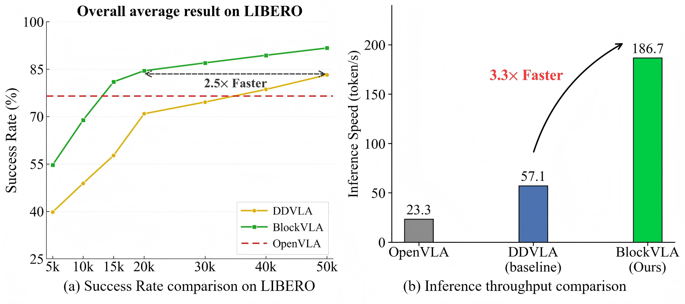
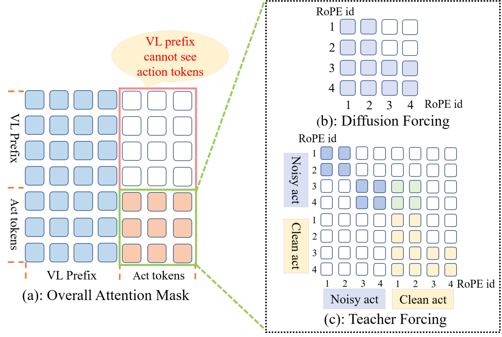
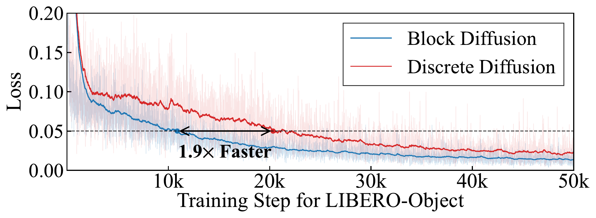

# BlockVLA: Accelerating Autoregressive VLA via Block Diffusion Finetuning

#

# 基本信息

- **arXiv**: 2605.13382
- **Authors**: Ruiheng Wang, Shuanghao Bai, Haoran Zhang, Badong Chen, Xiangyu Xu
- **Categories**: cs.RO
- **一句话结论**: 通过块级离散扩散微调，将预训练自回归VLA适配为兼具因果一致性与并行生成能力的高效机器人策略，在LIBERO上实现91.7%成功率与3.3倍推理加速。

#

# 研究问题

论文聚焦如何突破现有离散Vision-Language-Action (VLA) 模型在推理延迟与训练效率上的双重瓶颈。自回归（AR）VLA（如OpenVLA）依赖逐token解码，导致长程任务中误差累积严重且推理延迟高；而标准离散扩散VLA（如DDVLA）虽支持并行去噪，但全序列双向注意力破坏了KV缓存复用，且需要大量函数评估次数（NFE），实际部署效率受限。此外，机器人场景中的VLA训练存在独特的多模态不对称性：视觉-语言（VL）前缀作为稳定条件，动作序列才是生成目标，直接将文本领域的扩散适配方案迁移到机器人策略学习会面临训练-推理分布不一致的问题。

#

# 任务与挑战

具体任务为机器人操作中的动作块生成。输入为多模态前缀 $\mathbf{c} = [\textbf{BOS}, \mathbf{v}, \mathbf{p}, \mathbf{l}]$（视觉、本体感知、语言token），输出为离散化的动作token序列 $\mathbf{a}$。动作经分位数分箱（1st–99th percentile）离散为256个bin，每步动作编码为7个token（3平移+3旋转+1夹爪），预测时域 $H$ 与维度 $D$ 决定总动作序列长度 $L=H \times D$。

训练与评测在LIBERO（Spatial/Object/Goal/Long四个套件）和SimplerEnv WidowX上进行。已有方法的主要不足在于：AR模型无法并行生成；标准离散扩散模型难以复用前缀KV缓存，且将VL前缀与动作token等同对待，忽略了条件与生成目标的不对称性，导致优化与部署存在鸿沟。

#

# 核心 Insight

BlockVLA的核心思想是**在动作序列上建立“块间自回归、块内并行扩散”的半自回归结构**。与全序列离散扩散不同，该方法将动作序列切分为 $B$ 个块，块与块之间保持严格的因果依赖（第 $b$ 块只能依赖前缀及前序块），从而保留AR模型的全局时序一致性与前缀KV缓存复用能力；而在每个块内部，token之间采用双向注意力，支持并行离散去噪，显著降低单步推理延迟。

针对VLA独特的多模态不对称性，作者进一步提出**非对称块级掩码**：VL前缀内部允许双向交互，但前缀token绝对不可见动作token，防止动作信息泄漏；动作块间因果、块内双向。这种设计确保了训练时的条件分布与推理时的前缀编码严格一致。配合**Diffusion Forcing**训练策略（当前块基于带噪前序块进行条件生成），模型在训练阶段即暴露于历史预测噪声，显著增强了对推理时自回归误差累积的鲁棒性。



#

# 方法与公式

#

## 1. 离散扩散与块扩散基础

离散扩散语言模型（dLLM）直接在离散词表 $\mathcal{V}$ 上定义扩散过程。设干净序列 $\mathbf{x}_0 \in \mathbb{R}^{L \times V}$ 为one-hot行向量序列，前向过程独立腐蚀每个token：

```math
q(\mathbf{x}_t \mid \mathbf{x}_0)
=
\prod_{i=1}^{L}
\mathrm{Categorical}\!\left(
\mathbf{x}_t^{(i)};\,
p = \mathbf{x}_0^{(i)} \bar{\mathbf{Q}}_t
\right),
\quad
\bar{\mathbf{Q}}_t = \bar{\alpha}_t \mathbf{I} + (1-\bar{\alpha}_t)\mathbf{1}\mathbf{m}^{\top}
\tag{1}
```

其中 $\bar{\alpha}_t$ 为保留系数（由噪声调度决定），$\mathbf{1} \in \mathbb{R}^{V \times 1}$ 为全1向量，$\mathbf{m}$ 为对应 **[MASK]** token的one-hot向量。$\bar{\mathbf{Q}}_t$ 确保每个token以概率 $\bar{\alpha}_t$ 保持原状态，否则转为mask。

模型 $p_\theta(\mathbf{x}_0 \mid \mathbf{x}_t)$ 训练目标为仅在被mask位置计算交叉熵：

```math
\mathcal{L}(\theta)
=
-\mathbb{E}_{t,\mathbf{x}_0,\mathbf{x}_t}
\left[
\frac{1}{t}
\sum_{i=1}^{L}
\mathbf{1}\!\left[\mathbf{x}_t^{(i)}=\textbf{[MASK]}\right]
\log p_\theta\!\left(\mathbf{x}_0^{(i)} \mid \mathbf{x}_t\right)
\right]
\tag{2}
```

**块扩散（Block Diffusion）** 将 $\mathbf{x}_0$ 划分为 $B$ 个有序块 $[\mathbf{x}_0^1, \dots, \mathbf{x}_0^B]$，每块含 $L'=L/B$ 个token。联合似然分解为：

```math
\log p_\theta(\mathbf{x}_0)
=
\sum_{b=1}^{B}
\log p_\theta(\mathbf{x}_0^b \mid \mathbf{x}_0^{<b})
\tag{3}
```

每块内部采用离散扩散，块间保持自回归。总体训练目标为各块mask去噪损失的均值：

```math
\mathcal{L}_{\mathrm{BD}}(\theta)
=
\frac{1}{B}
\sum_{b=1}^{B}
\mathbb{E}_{t_b,\mathbf{x}_0,\mathbf{x}_{t_b}^b}
\left[
-\frac{1}{t_b}
\sum_{i=1}^{L'}
\mathbf{1}\!\left[(\mathbf{x}_{t_b}^b)^{(i)}=\textbf{[MASK]}\right]
\log p_\theta\!\left(
(\mathbf{x}_0^b)^{(i)}
\mid
\mathbf{x}_{t_b}^b,\mathbf{h}^{<b}
\right)
\right]
\tag{4}
```

其中 $\mathbf{h}^{<b}$ 表示块级历史：Teacher Forcing下为干净历史 $\mathbf{x}_0^{<b}$，Diffusion Forcing下为带噪历史 $\mathbf{x}_{t'}^{<b}$。

#

## 2. BlockVLA架构与掩码设计

BlockVLA以OpenVLA的Prismatic-7B（SigLIP + DINOv2视觉编码器，Llama语言骨干）为预训练基础。输入序列构造为：

```math
\mathbf{x}
=
[\textbf{BOS}, \mathbf{v}, \mathbf{p}, \mathbf{l},
a_1^{(1)}, \dots, a_H^{(D)}, \textbf{EOS}]
\tag{5}
```

动作序列 $\mathbf{a}$ 被均分为 $B$ 个块 $[\mathbf{a}^1, \dots, \mathbf{a}^B]$。

**非对称块级掩码** 是适配VLA多模态不对称性的关键：

- **VL前缀** $\mathbf{c}$：内部双向注意力，但**不可见任何动作token**，防止条件表示在训练时泄漏未来动作信息，确保推理时前缀KV缓存的分布一致性。
- **动作块间**：严格因果。第 $b$ 块仅可 attend to 前缀 $\mathbf{c}$ 及前序块 $\mathbf{a}^{<b}$。
- **动作块内**：双向注意力，支持并行去噪。



#

## 3. Teacher Forcing vs. Diffusion Forcing

论文对比了两种块级条件策略：

**Teacher Forcing** 在输入末尾拼接干净动作后缀 $\mathbf{a}_0$，当前块基于干净历史生成：

```math
p_{\theta}(\mathbf{a}_0^b \mid \mathbf{a}_{t_b}^b, \mathbf{a}_0^{<b}, \mathbf{c})
\tag{6}
```

输入构造为 $[\mathbf{c}, \mathbf{a}_{\mathbf{t}}, \textbf{EOS}, \mathbf{a}_0]$。需注意：干净后缀不参与扩散损失（目标设为ignore index），且其RoPE位置索引需与对应噪声块对齐，以提供正确的KV上下文。

**Diffusion Forcing**（默认）不拼接干净后缀，当前块基于带噪历史生成：

```math
p_{\theta}(\mathbf{a}_0^b \mid \mathbf{a}_{t_b}^b, \mathbf{a}_{t'}^{<b}, \mathbf{c})
\tag{7}
```

输入仅为 $[\mathbf{c}, \mathbf{a}_{\mathbf{t}}, \textbf{EOS}]$。该策略使训练分布更贴近推理时历史块含噪的真实场景，增强对累积误差的鲁棒性。

#

## 4. Token Shift的移除

传统AR模型使用token shift（位置 $n-1$ 预测位置 $n$）。作者通过消融发现，在扩散微调中**移除token shift**（直接让位置 $i$ 预测位置 $i$）反而在LIBERO-Object上获得更高成功率（5k步时59.6% vs 51.2%）。因此BlockVLA与DDVLA基线均不采用token shift。

#

## 5. 推理流程

推理分为三阶段：
1. **前缀预填充**：编码 $\mathbf{c}$，存储其KV缓存。
2. **逐块生成**：对第 $b$ 块，初始化为全 **[MASK]**，执行固定步数（默认2步）的并行离散去噪。去噪过程中前缀及已完成块的KV缓存固定。
3. **缓存更新**：一块去噪完成后，将该块最终token再过一次前向传播，追加其KV状态到缓存，更新RoPE位置索引，进入下一块。

#

# 贡献拆解

1. **块扩散范式向VLA的首次迁移**
   - **做了什么**：将纯文本领域提出的Block Diffusion扩展到机器人VLA，建立从大规模AR预训练VLA到高效离散扩散策略的平滑适配路径。
   - **为什么有效**：块级因果结构保留了预训练AR模型的推理逻辑与KV缓存效率，块内并行扩散满足高频控制需求。
   - **和已有方法差别**：不同于DDVLA的全序列双向扩散（破坏KV缓存、NFE高），BlockVLA通过半自回归结构在因果一致性与并行生成之间取得平衡。

2. **面向VLA多模态不对称性的非对称掩码与Diffusion Forcing**
   - **做了什么**：针对VL前缀为条件、动作为生成目标的特性，设计了前缀-动作隔离的块级掩码，并采用Diffusion Forcing训练目标。
   - **为什么有效**：防止前缀在训练时“偷看”动作，保证训练-推理条件分布一致；Diffusion Forcing让模型在训练阶段即适应历史噪声，提升长程任务稳定性。
   - **和已有方法差别**：传统dLLM将序列视为同质目标，而BlockVLA显式区分条件与生成目标，更符合VLA的数据结构。

3. **训练与推理效率的双重提升**
   - **做了什么**：通过块内并行去噪与前缀KV缓存复用，将每块去噪步数压缩至2步。
   - **为什么有效**：块级因果掩码使已完成块成为固定上下文，避免全序列反复迭代；块内双向注意力允许单步并行预测多个动作token。
   - **和已有方法差别**：相比AR基线实现8.0倍吞吐提升，相比标准离散扩散实现3.3倍加速，且训练收敛速度提升1.9倍。

#

# 关键图表解读

#

## 图1：BlockVLA整体架构（figure-011-page-2-xref-662.png）

该图展示了从预训练AR VLA到BlockVLA的三阶段适配流程。**左侧**为继承自OpenVLA的因果AR骨干；**中间**对比了基线DDVLA的全序列双向掩码与BlockVLA的块级因果掩码——前者将动作序列全部双向化，后者仅在块内开放双向、块间保持因果；**右侧**展示推理时的差异：标准离散扩散需全序列迭代，而Block Diffusion以块为单位自回归推进，已完成块进入KV缓存。该图直接支撑论文关于“平滑过渡”与“缓存复用”的核心论点，读图时应注意块级因果掩码（绿色框）与全序列双向掩码（红色框）的注意力模式差异。

#

## 图2：注意力掩码与RoPE设计（figure-004-mask.png）

该图详解了非对称掩码的矩阵形式与两种Forcing策略下的RoPE id分配。**左子图(a)** 展示Overall Attention Mask：VL Prefix区域（蓝色）内部双向，但不可见右侧Action tokens；Action tokens区域中，当前块（橙色）可看前缀及所有前序块，但不可见后续块。**右子图(b)(c)** 对比Diffusion Forcing与Teacher Forcing的RoPE id：Teacher Forcing需在序列末尾拼接Clean act，并通过位置索引回退使其与Noisy act共享RoPE id；Diffusion Forcing则无需后缀，实现更简洁。读图关键注意前缀对动作的严格隔离（红色框标注“VL prefix cannot see action tokens”），这是保证条件分布一致性的设计基础。

#

## 图3：LIBERO主结果与推理吞吐（figure-000-merge.png）

**左子图(a)** 为LIBERO四个套件平均成功率随训练步数的变化曲线。BlockVLA（绿色）在5k步时即达55%，20k步时已达85%，而DDVLA（黄色）在20k步时才达到约70%，标注“2.5× Faster”指达到相近性能所需的训练步数比例。红色虚线为OpenVLA报告值（76.5%），BlockVLA在15k步左右即超越该水平。**右子图(b)** 为单张NVIDIA RTX 4090上的推理吞吐实测：OpenVLA为23.3 tokens/s，DDVLA为57.1 tokens/s，BlockVLA达186.7 tokens/s，相对DDVLA实现3.3倍加速。读图时应注意两条曲线的早期收敛差距，这是块级因果结构对长程依赖建模效率的直接体现。


#

## 图4：训练损失收敛曲线（figure-003-loss-curve-plot.png）

该图展示LIBERO-Object上Block Diffusion（蓝色）与Discrete Diffusion（红色）的训练损失（EMA平滑后）。Block Diffusion在约12k步时损失降至0.05，而Discrete Diffusion需要约23k步才达到同一水平，标注“1.9× Faster”。此外，蓝色曲线的波动幅度明显小于红色，说明块级因果结构带来了更稳定的梯度更新。该图直接支撑论文关于“训练效率提升”的结论，读图时应注意两条曲线在10k-20k区间的分离速度，这解释了为何BlockVLA在长程任务（LIBERO-Long）上能早期快速启动。



#

# 实验与消融

#

## 数据集与设定

实验在LIBERO（Spatial/Object/Goal/Long，每套件10任务×50演示）和SimplerEnv WidowX（4个pick-and-place任务，每任务24回合）上进行。以OpenVLA为AR基线，DDVLA（全序列离散扩散，12步去噪）为扩散基线。BlockVLA默认每块2步去噪，块大小 $B=14$（对应2个时间步的动作token）。

#

## 主结果

在LIBERO上，BlockVLA训练50k步达到平均成功率**91.7%**，显著高于DDVLA的83.2%与OpenVLA报告值的76.5%。尤其在LIBERO-Long长程套件上，BlockVLA在15k步即达**60.0%**，而DDVLA仅3.8%，体现了块级因果结构对复杂时序依赖的捕捉优势。推理吞吐达**186.7 tokens/s**，相对DDVLA（57.1）加速3.3倍，相对OpenVLA（23.3）加速8.0倍。

SimplerEnv结果（表4）显示BlockVLA与DDVLA互有胜负，优势不一致（如"Put Carrot on Plate" 60k步时Success Count为4/24，低于DDVLA的5/24）。由于每任务仅24回合，统计波动较大，且论文未深入分析块扩散在真实到模拟环境中优势减弱的原因。

#

## 消融实验

- **块大小**：$B=14$ consistently 优于 $B=7$。更大的块允许模型在单次去噪中联合建模两个连续时间步的动态关联，提升运动连续性。
- **Diffusion Forcing vs. Teacher Forcing**：Diffusion Forcing在两个套件上均更优，验证了带噪历史条件对推理鲁棒性的增益。
- **每块去噪步数**：1–4步范围内，3步达到性能峰值，2–3步为速度与精度的最佳平衡点。步数增加虽提升生成保真度，但线性增加延迟。
- **Token Shift**：移除token shift在LIBERO-Object 5k步时带来8.4%的绝对成功率提升（59.6% vs 51.2%）。

#

## 证据评估

**最强证据**：LIBERO-Long上的早期收敛曲线（15k步 60.0% vs 3.8%）与单卡实测吞吐（186.7 tokens/s，3.3×加速）共同证明了块扩散在长程任务与实时推理中的双重优势。**最存疑证据**：SimplerEnv上的结果波动与样本量过小（24回合）使得跨平台泛化性结论支撑较弱；此外，OpenVLA对比数据为原文报告值，训练步数与数据规模未必完全对齐。

#

# 局限性

1. **跨平台性能优势不一致**：SimplerEnv上BlockVLA与DDVLA差距微小且互有胜负，论文未解释块扩散在真实到模拟环境中优势减弱的原因（可能块大小与任务时序粒度不匹配，或扩散步数压缩导致精度损失）。
2. **超参数探索范围有限**：块大小仅在7与14之间对比，每块去噪步数仅探索1–4步，缺乏理论指导或自适应机制，不同任务是否需要动态块大小未讨论。
3. **预训练能力保留的定量证据不足**：虽然块级因果结构有助于平滑过渡，但论文未在零样本或分布外任务上与AR基线对比，无法确认预训练VLM的泛化能力是否被完全保留。
4. **机制解释深度不足**：移除token shift对扩散微调有益（表2），但论文未深入解释其机理；Diffusion Forcing在极长序列上是否会因块间自回归误差累积而抵消块内并行优势，亦缺乏理论或实验分析。

#

# 个人研究判断

面向“World Models assisting Embodied AI downstream tasks”的研究方向，**BlockVLA值得继续追踪**。

理由如下：该工作首次将块扩散范式系统引入机器人VLA，为“如何在不抛弃预训练AR VLA知识的前提下，获得扩散模型的并行生成能力”提供了可落地的工程范式。其提出的非对称掩码与Diffusion Forcing不仅适用于动作生成，也可迁移到任何具有“条件-生成”不对称结构的多模态序列建模场景（如世界模型中的未来帧预测、规划token生成）。此外，块级因果结构与KV缓存复用的结合，为在边缘设备上部署大规模VLA提供了关键的速度优化路径。

后续可重点关注：将块扩散与流匹配（Flow Matching）或一致性模型（Consistency Models）结合以进一步压缩每块NFE；探索动态块大小与自适应去噪步数；以及在真实机器人硬件上验证端到端控制延迟与长期稳定性。该论文的局限恰恰指明了下一步的改进空间。
