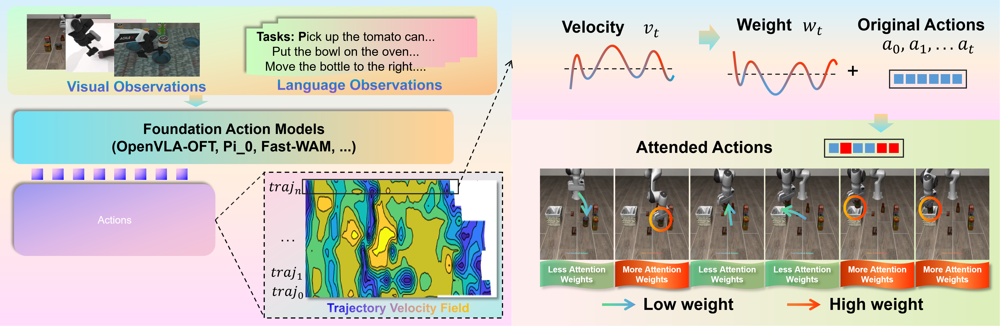
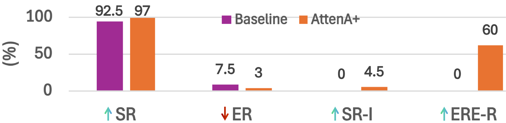
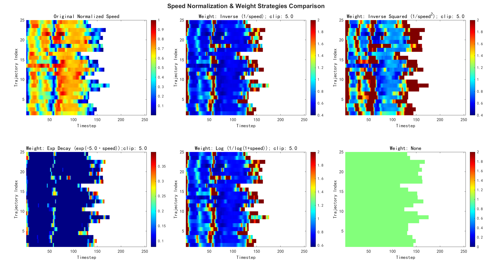
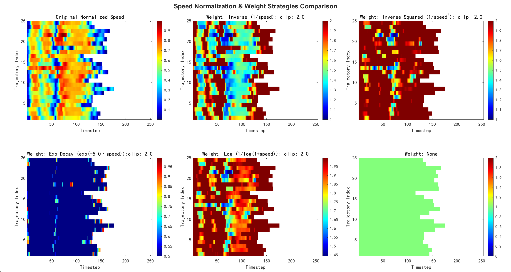

# AttenA+: Rectifying Action Inequality in Robotic Foundation Models

#

# 基本信息

- **arXiv**: 2605.13548
- **Authors**: Daojie Peng, Fulong Ma, Jiahang Cao, Qiang Zhang, Xupeng Xie, Jian Guo, Ping Luo, Andrew F. Luo, Boyu Zhou, Jun Ma
- **Categories**: cs.RO, cs.AI
- **一句话结论**: 通过速度场驱动的动作注意力机制重新加权训练目标，在不修改模型架构与增加参数的前提下，纠正了机器人基础模型对动作时间步一视同仁的“扁平”优化偏差，显著提升了 VLA 与 WAM 在长程精确操作任务上的性能天花板。

#

# 研究问题

论文指出，当前 Vision-Language-Action (VLA) 与 World-Action Model (WAM) 等机器人基础模型在训练时隐含地继承了 NLP 的“时间同质性”假设，即对所有动作时间步赋予相同的优化权重。然而，机器人轨迹在物理层面本质上是异质的：低速段通常对应精密交互（如抓取、对准、放置），决定任务成败；高速段多为自由空间过渡，容错性高。这种**统一损失权重与物理关键性之间的结构性错位**导致模型浪费表征容量学习冗余动作，却欠优化真正关键的高精度段，从而限制了复杂长程任务的成功率上限。

#

# 任务与挑战

具体任务为端到端的机器人操作控制：给定视觉观测 $\mathcal{I}$ 与语言指令 $L$，模型需输出连续动作序列 $\mathcal{A} = \{a_1, \dots, a_T\}$。训练数据为专家示教轨迹，评测在 Libero、RoboTwin 2.0 仿真基准及 Franka 真机上进行。

已有方法（如 OpenVLA-OFT、$\pi_0$、Fast-WAM、Diffusion Policy）的共性挑战在于：

1. **优化范式僵化**：无论判别式回归还是生成式流匹配/扩散，均默认每步动作对梯度的贡献相同。
2. **物理层次缺失**：未利用轨迹内部的运动学层次结构，导致“最后一厘米”精度不足。
3. **长程误差累积**：关键段欠优化使得复杂序列任务中早期微小偏差被放大。

#

# 核心 Insight

本文的核心洞察是：**末端执行器的瞬时速度可作为精度需求的自然反比代理**。速度越低，动作越关键；速度越高，动作越冗余。因此，只需在训练时按速度倒数（或更一般的非线性映射）重新加权损失，即可将模型的学习能力与操作物理需求对齐，而无需修改网络结构或引入额外参数。



上图展示了 AttenA+ 的完整流程：从视觉/语言观测输入基础动作模型，同时从 ground-truth 动作序列提取轨迹速度场，经注意力函数 $F_A$ 映射为权重，对原始动作进行重加权，得到 Attended Actions。低速关键步（如对准、抓取）获得高权重（红色），高速过渡步获得低权重（蓝色）。

#

# 方法与公式

#

## 1. 动作不平等的形式化

现有模型的均匀优化目标可统一写为：

```math
\theta^* = \arg\min_\theta \mathbb{E}_{\tau \sim \mathcal{D}} \left[ \sum_{t=1}^{T} \mathcal{L}_t (\pi_\theta(s_t), \boldsymbol{a}_t) \right]
\tag{1}
```

其中 $\mathcal{L}_t$ 为每步损失（判别式中为 L1/L2，生成式中为 score-matching 或向量场目标）。该式隐含假设每步动作 token 对整体梯度贡献相同，即**时间同质性**。

#

## 2. 速度场与注意力权重

对 ground-truth 动作 $\boldsymbol{a}_t^{gt}$，定义其瞬时速度幅度：

```math
v_t = \left\lVert \boldsymbol{a}_t^{gt} \right\rVert_2 = \sqrt{\sum_{d=1}^{D_{pos}} (a_{t,d}^{gt})^2}
\tag{2}
```

其中 $D_{pos}$ 为平移/旋转自由度（如 Libero 中取前 6 维关节速度，忽略二值夹爪状态）。速度 $v_t$ 作为无监督代理，表征该步的物理关键性。

注意力权重通过映射函数 $F_A$ 生成 $w_t = F_A(v_t)$。论文提供四种手工策略：

```math
w_{b,t} = \frac{1}{v_{b,t}}
\tag{3}
```

```math
w_{b,t} = \frac{1}{v_{b,t}^2}
\tag{4}
```

```math
w_{b,t} = e^{-\alpha \cdot v_{b,t}}, \quad \alpha=5.0
\tag{5}
```

```math
w_{b,t} = \frac{1}{\log(1 + v_{b,t})}
\tag{6}
```

#

## 3. 正则化

为防止近静态时间步梯度爆炸，AttenA+ 引入两项正则：

- **权重裁剪**：将权重限制在 $[1/\mathrm{clip}_{\mathrm{max}}, \mathrm{clip}_{\mathrm{max}}]$。
- **损失归一化**：可选地使 $\frac{1}{T}\sum_{t=1}^T w_t \simeq 1$，保持全局学习率与基线一致。

#

## 4. 范式无关的加权目标

**判别式模型（AttenA+Disc）**：将标准 L1 损失改为速度加权 L1：

```math
\theta^* = \arg\min_\theta \mathbb{E}_{(\mathcal{I}, L, \mathcal{A}^{gt}) \sim \mathcal{D}} \left[ \frac{1}{T \cdot D} \sum_{t=1}^T \sum_{d=1}^D w_t \cdot \left| a_{t,d}^{\mathrm{pred}} - a_{t,d}^{gt} \right| \right]
\tag{7}
```

**流匹配模型（AttenA+FM）**：用于 $\pi_0$ / $\pi_{0.5}$ 等生成框架：

```math
\phi^* = \arg\min_\phi \mathbb{E}_{\substack{(\mathcal{I}, L, \mathcal{A}^{gt}) \sim \mathcal{D} \\ \epsilon \sim \mathcal{N}(\mathbf{0}, \mathbf{I})}} \left[ \frac{1}{T \cdot D} \sum_{t=1}^T \sum_{d=1}^D w_t \cdot \left\lVert u_t(\epsilon; \mathcal{I}, L) - (a_{t,d}^{gt} - \epsilon_d) \right\rVert_2^2 \right]
\tag{8}
```

其中 $u_t$ 为预测的流场。通过放大低速段的回归精度，生成模型能更好地捕捉高精度动作的细微差别。

**扩散模型（AttenA+Diff）**：类似地将去噪损失加权：

```math
\psi^* = \arg\min_\psi \mathbb{E}_{\substack{(\mathcal{I}, L, \mathcal{A}^{gt}) \sim \mathcal{D} \\ k \sim \mathrm{Uniform}(1,K) \\ \epsilon_k \sim \mathcal{N}(0, I)}} \left[ \frac{1}{T \cdot D} \sum_{t=1}^T \sum_{d=1}^D w_t \cdot \left\lVert \epsilon_k^{\mathrm{pred}} - \epsilon_k \right\rVert_2^2 \right]
\tag{9}
```

#

# 贡献拆解

1. **形式化揭示“动作不平等”（Action Inequality）现象**
   - **做了什么**：首次系统论证了机器人轨迹中动作时间步的物理异质性，指出当前 VLA/WAM 训练范式与操作物理层级之间存在根本性错位。
   - **为什么有效**：将“低速=高精度=高重要性”的物理直觉转化为可计算的训练先验，为领域提供了新的问题视角。
   - **与已有方法差别**：不同于 VLA-ADP 等仅裁剪冗余快动作的工作，AttenA+ 明确建立速度与学习优先级的连续映射，且无需额外监督。

2. **提出速度场驱动的动作注意力机制 AttenA+**
   - **做了什么**：设计了一个架构无关、即插即用的损失重加权模块，支持逆速度、逆平方、指数衰减、对数等多种映射，并包含裁剪与归一化正则。
   - **为什么有效**：在不修改骨干网络、不增加可训练参数的情况下，将优化焦点与运动学关键性对齐。
   - **与已有方法差别**：兼容判别式回归、流匹配、扩散策略等任意范式，而此前动作加权方法多局限于单任务或需额外开销。

3. **在仿真与真实机器人上实现 SOTA 提升**
   - **做了什么**：在 Libero 上将 OpenVLA-OFT 推至 98.6%，在 RoboTwin 2.0 上将 Fast-WAM 推至 92.46%，并在 Franka 真机上验证。
   - **为什么有效**：实验设计覆盖高基线模型与长程任务，证明物理感知重加权在数据/模型 scaling 之外提供了独立的边际收益。
   - **与已有方法差别**：在已有极高基线上实现绝对增益，且通过真机闭环验证了 sim-to-real 价值。

#

# 关键图表解读

#

## 图 1：方法架构与物理直觉（figure-007-workflow1.png）

该图直观展示了 AttenA+ 的“即插即用”特性。左侧：视觉与语言观测输入 Foundation Action Models（OpenVLA-OFT、$\pi_0$、Fast-WAM 等），输出原始动作序列。右侧：从 ground-truth 动作计算 Velocity $v_t$，经 $F_A$ 映射为 Weight $w_t$，与 Original Actions 相加（实际为损失重加权，图中以“+”示意）得到 Attended Actions。下方机器人操作序列显示：抓取、放置等低速关键步被赋予高权重（红色/高亮），而快速接近步被赋予低权重（蓝色/暗淡）。这张图支撑了论文的核心论点——**注意力应作用于输出动作序列，而非仅输入视觉-语言流**。

#

## 图 2：真实世界性能对比（figure-011-real-bins2.png）



该图量化了 Franka 真机实验的四项指标：

- **SR（成功率）**：从 92.5% 提升至 97%（+4.5%）。
- **ER（错误率）**：从 7.5% 降至 3%（相对降低 60%）。
- **SR-I（成功率提升）**：4.5%。
- **ERE-R（相对错误率降低）**：60%。

读图时需注意：SR 与 ER 为互补指标，AttenA+ 在降低错误率方面效果尤为显著，说明方法确实减少了关键步的失败。但图中未显示标准差，且简单任务（如关抽屉）基线已达 100%，无法体现差异。

#

## 图 3：权重策略消融（clip=5.0，figure-008-object-clip05-0.png）



该热力图展示了 Libero-Object 任务上不同速度-权重映射策略的时空分布。横轴为时间步，纵轴为轨迹索引，颜色深浅代表权重值。

- **Original Normalized Speed**：原始速度场，暖色为高速、冷色为低速。
- **Inverse / Inverse Squared / Log**：低速段（右侧/末端）被显著放大，但 clip=5.0 时权重极端化程度较高，部分高速段被过度抑制为深蓝。
- **Exp Decay**：权重分布极为稀疏，仅极少数极低速步获得高权重，其余几乎被抹平。
- **None**：均匀权重（绿色常数）。

读图关键：clip=5.0 允许权重在 $[0.2, 5]$ 之间大幅波动，虽能增强对比度，但 Exp Decay 已出现过度稀疏化，预示训练稳定性风险。

#

## 图 4：权重策略消融（clip=2.0，figure-010-object-clip02-0.png）



与 clip=5.0 对比，clip=2.0 将权重限制在 $[0.5, 2]$，各策略的权重分布更温和：

- **Inverse / Inverse Squared**：低速段仍获得清晰的高权重（红色），但高速段未被完全压制为 0，保留了一定梯度信号。
- **Exp Decay**：稀疏性有所缓解，但仍呈现明显的“尖峰”特征。
- **Log**：整体最平滑，高低速过渡自然。

读图关键：该图支撑了论文消融结论——**适当的裁剪阈值对稳定性至关重要**。clip=2.0 在强调关键步与保持训练稳定之间取得了更好平衡，而 clip=5.0 的极端权重易导致不稳定。

#

# 实验与消融

#

## 数据集与设定

- **Libero**：四个子集（Spatial、Object、Goal、10）。AttenA+OFT 基于 OpenVLA-OFT，每子集训练 200k 步，选验证成功率最高 checkpoint，报告 4 随机种子均值。
- **RoboTwin 2.0**：50 项双臂任务，含 clean 与 random 环境。AttenA+WAM 基于 Fast-WAM，冻结视觉编码器与 WAM 骨干，仅微调 action head 并接入 AttenA+，训练 1 epoch。
- **Franka 真机**：4 类任务（关抽屉、单物体放置、多物体、长程序列），每类测试 50 次。采集时刻意将关键段速度降为基线 1/3 以强化速度-关键性关联。

#

## 主结果

- **Libero**：AttenA+OFT 平均成功率 **98.6%**（+1.5%），错误率从 2.9% 降至 1.4%，其中长程任务（Libero-10）提升达 **+2.1%**。
- **RoboTwin 2.0**：AttenA+WAM 达到 **92.46%**（+0.6%），超越 Fast-WAM 与 LingBot-VA，且未使用 Embodied Pre-training。
- **生成式模型**：$\pi_{0.5}$ 集成 AttenA+ 后平均提升 **+1.10%**。
- **真机实验**：平均成功率从 92.5% 提升至 **97.0%**，多物体与长程任务增益最大（分别 +8% 与 +6%）。

#

## 消融实验

论文对四种权重函数与三种 clip 阈值进行交叉消融：

- **无单一策略通吃所有任务**：Inverse squared 在 Spatial 最优，Inverse 在 Object 最优，Exp decay 与 Log 在长程任务表现突出。
- **Clip 阈值敏感**：$\mathrm{clip}_{\mathrm{max}}=1.0$ 时退化为均匀基线；$2.0$ 或 $3.0$ 时普遍提升；$5.0$ 时因极端权重引入训练不稳定，部分任务性能下降。

#

## 最强证据与最存疑证据

- **最强证据**：Libero 上 OpenVLA-OFT 基线已高达 97.1%，AttenA+ 仍能绝对提升 1.5% 并将错误率相对降低 51.7%。在极高基线上通过纯训练目标重加权获得增益，证明了挖掘物理先验的效率。
- **最存疑证据**：Franka 真机实验每项仅测试 50 次且未报告标准差；Long-horizon 任务从 84% 到 90% 的 6% 提升样本量较小，统计显著性不足。此外 RoboTwin 2.0 上 LingBot-VA 使用了 Embodied Pre-training 而 AttenA+WAM 未使用，严格来说训练设置不完全对等。

#

# 局限性

1. **启发式假设的物理边界**：速度-关键性对应关系在动态任务（如高速抓取、击球）中可能失效。速度作为单一指标无法涵盖力控、接触力矩、触觉反馈等更丰富的模态。
2. **真实世界统计严谨性不足**：真机每项 50 次测试未报告标准差或置信区间；简单任务基线已达 100%，无法体现方法差异。
3. **权重函数缺乏可学习性**：四种映射均为手工设计，虽经消融验证，但论文未提供自动选择或端到端学习最优权重函数的方案，留下“如何自适应不同任务动力学”的开放问题。
4. **速度信息的来源依赖**：训练时速度来自 ground-truth 专家动作；若部署时需从视觉或低精度传感器估计速度，误差传播对注意力机制的影响未被讨论。
5. **机制归因分析不足**：长程任务性能提升是否完全源于关键段精度提升，还是也受益于过渡段权重降低带来的梯度噪声抑制？论文缺乏对机制层面的深入归因。

#

# 个人研究判断

面向“World Models assisting Embodied AI downstream tasks”的研究方向，**本文值得继续追踪**。

理由如下：

- **问题意识具有普遍性**：动作不平等现象不仅存在于 VLA，也适用于任何基于模仿学习的机器人控制。将物理先验（运动学层次）注入训练目标，是与标准 scaling law 互补的高效路径。
- **方法论轻量且通用**：AttenA+ 的范式无关性意味着可无缝迁移至当前主流的 VLA、WAM 及扩散策略框架，对提升长程精确操作和 sim-to-real 迁移具有直接指导意义。
- **可扩展性强**：未来可自然延伸至 World Model 场景——若世界模型能预测未来速度场，则可进一步发展为在线自适应的动作注意力，甚至与力/触觉等多模态物理信号融合，构建可学习的动作注意力网络。

然而，也需关注其**物理假设的边界**：在依赖高速动态接触的任务中，单一速度代理可能失效。后续研究应着力于多模态可学习注意力与更严格的统计验证，以突破手工启发式的局限。
