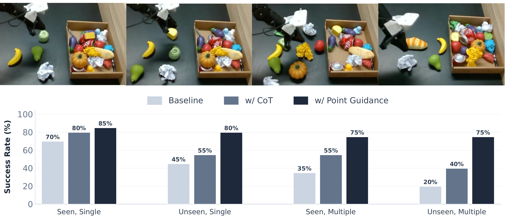
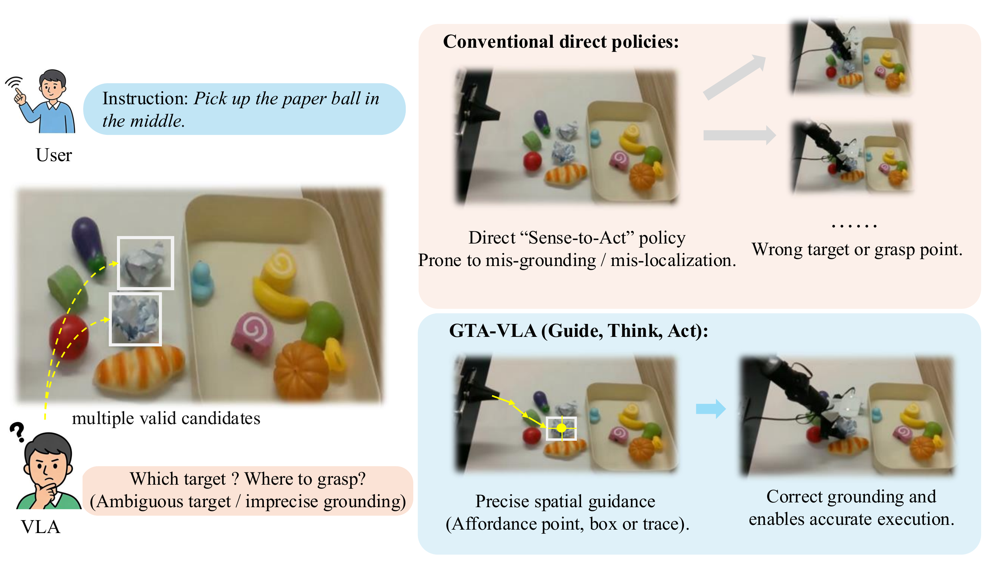
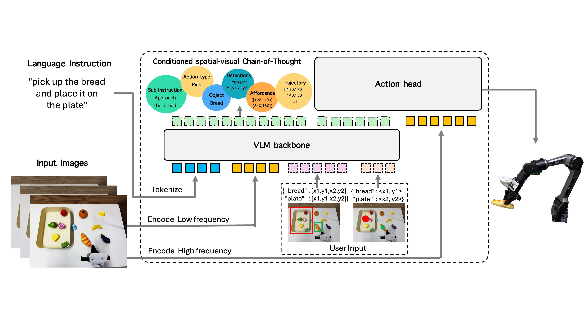
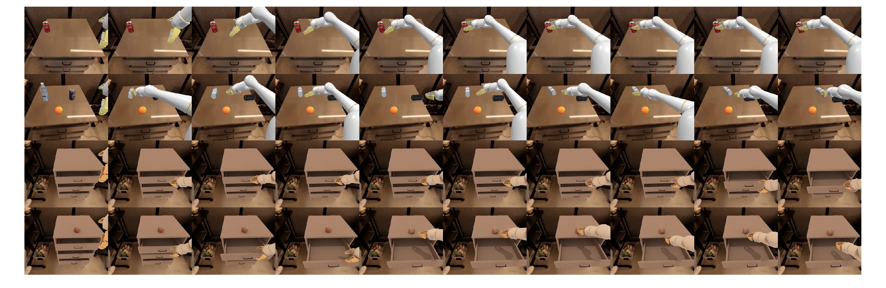

# Guide, Think, Act: Interactive Embodied Reasoning in Vision-Language-Action Models

#

# 基本信息

- **arXiv:** 2605.13632
- **Authors:** Yiran Ling, Qing Lian, Jinghang Li, Qing Jiang, Tianming Zhang, Xiaoke Jiang, Chuanxiu Liu, Jie Liu, Lei Zhang
- **Categories:** cs.RO, cs.CV
- **一句话结论：** 本文提出 GTA-VLA 框架，通过将可选的 2D 空间先验（点、框、轨迹）显式条件化到结构化空间-视觉 Chain-of-Thought 推理中，并以异步慢-快架构生成动作，在标准操控基准与 OOD 扰动下均实现了当前最优或显著提升的交互式具身推理性能。

#

# 研究问题

现有 Vision-Language-Action（VLA）模型大多学习从多模态观测到机器人动作的直接“感知-动作”映射。这类紧耦合策略虽然在训练分布内表现良好，但在分布外（Out-of-Distribution, OOD）视觉偏移、空间歧义或失败场景下既脆弱又难以纠正。近期具身 Chain-of-Thought（CoT）方法虽然暴露了中间推理步骤以提升可解释性，但其推理过程仍完全依赖模型内部信念，缺乏让人类通过直观空间信号（如指点、画框）直接修正推理与行为的机制。本文旨在解决这一核心缺口：如何使 VLA 策略具备可交互、可空间引导的具身推理能力，从而在自主执行的同时支持失败恢复与歧义消解。

#

# 任务与挑战

**具体任务：** 单臂机器人操控。策略在时刻 $t$ 接收多视角 RGB 观测 $\mathcal{I}_t$（主视角 + 腕部视角）、自然语言指令 $L$、机器人本体状态 $s_t$，以及可选的二维空间先验 $P_{\mathrm{spatial}}$，预测未来 $k$ 步的连续动作块 $A_t$。

**训练与评测设定：** 训练基于构建的 Interact-306K 数据集（从 OXE、DROID、RoboMind 等来源的 306K 条真实轨迹通过自动标注管道生成结构化 CoT 监督）。评测涵盖：
- **标准基准：** LIBERO（sim-to-sim 多任务）与 SimplerEnv WidowX（real-to-sim 零样本迁移）。
- **OOD 基准：** 本文提出的 SimplerEnv-Plus，系统性地在视觉、机器人状态、语言、物体四个维度引入扰动。
- **交互评测：** 在歧义场景（未见物体、干扰物）下评估单次稀疏视觉引导（点、框、轨迹）的成功率提升。

**已有方法的不足：** 传统直接策略在存在多个有效候选目标时容易发生错误定位（mis-localization）或错误接地（mis-grounding）；现有具身 CoT 方法虽生成中间推理，但推理链无法被外部空间信号直接条件化，导致人类难以在失败时直观介入并纠正。

#

# 核心 Insight

本文的核心思想是将单次策略推理解耦为 **Guide → Think → Act** 三个阶段，把“人类空间意图”编码为推理链的约束条件，而非动作层的后验残差修正。

在 **Guide** 阶段，用户可通过点、框、轨迹等稀疏 2D 几何信号提供可选的空间先验。在 **Think** 阶段，VLM 并非直接输出动作，而是自回归生成结构化的空间-视觉 CoT，包含任务分解、视觉定位与机器人运动草图，并显式条件于外部空间先验。在 **Act** 阶段，轻量级 Flow-Matching 动作头以高频异步方式运行，复用最新缓存的推理隐状态生成连续动作块，从而解决自回归 VLM 推理延迟与实时控制频率之间的矛盾。



上图直观展示了这一范式的优势：当语言指令“捡起中间的纸球”存在歧义时，传统直接策略因缺乏显式接地机制而抓取错误目标；GTA-VLA 则通过一次性的空间引导（如 affordance 点）锚定正确目标，经由显式推理生成精准动作。

#

# 方法与公式

#

## 整体架构与问题形式化

论文将机器人操控形式化为条件序列建模问题。标准 VLA 策略表示为：

```math
\pi : (\mathcal{I}_t, L, s_t) \rightarrow A_t
\tag{1}
```

其中 $\mathcal{I}_t = \{I_t^{(v)}\}_{v=1}^{V}$ 为多视角观测，$L$ 为语言指令，$s_t$ 为本体状态，$A_t = [a_t, a_{t+1}, \dots, a_{t+k-1}]$ 为动作块。

GTA-VLA 引入可选的空间先验 $P_{\mathrm{spatial}}$，将策略扩展为：

```math
\pi : (\mathcal{I}_t, L, s_t, P_{\mathrm{spatial}}) \rightarrow A_t
\tag{2}
```

$P_{\mathrm{spatial}}$ 可以是 affordance 点 $P_{\mathrm{point}}$、边界框 $P_{\mathrm{bbox}}$ 或轨迹 $P_{\mathrm{trace}}$。其中轨迹先验表示为有序点序列：

```math
P_{\mathrm{trace}} = \big[(x_1, y_1), (x_2, y_2), \dots, (x_m, y_m)\big]
\tag{3}
```

#

## Guide：多模态空间先验接口

空间先验被序列化为与 Qwen3-VL 原生坐标 token 空间兼容的相对坐标整数（范围 $[0,999]$），并与文本指令拼接后送入 VLM。该接口支持两种注入时机：episode 开始时的前置引导（up-front），或执行中发现错误时的中途介入（mid-episode）。

#

## Think：条件化空间-视觉 CoT

VLM 主干（Qwen3-VL-2B）生成结构化的空间-视觉推理序列 $C$，组织为三个功能段：

```math
C = [C_{\mathrm{task}}, C_{\mathrm{vision}}, C_{\mathrm{robot}}]
\tag{4}
```

- $C_{\mathrm{task}}$：高层语义子任务分解；
- $C_{\mathrm{vision}}$：基于观测与空间先验的显式视觉定位（目标框与 affordance 点）；
- $C_{\mathrm{robot}}$：末端执行器的粗粒度 2D 运动草图（waypoints）。

推理过程显式条件于空间先验：

```math
P(C \mid \mathcal{I}_t, L, P_{\mathrm{spatial}})
\tag{5}
```

当 $P_{\mathrm{spatial}}$ 存在时，它直接约束视觉定位与运动草图的生成，实现“人类意图对齐自主决策”。推理完成后，提取对应 token 的隐状态作为缓存的推理记忆：

```math
H_{\mathrm{reasoning}} \in \mathbb{R}^{N \times D}
\tag{6}
```

其中 $N$ 为推理 token 数量，$D$ 为隐藏维度。

#

## Act：异步 Flow-Matching 动作生成

为避免每步控制都等待 VLM 自回归解码，系统采用异步慢-快架构：

- **慢速推理模块**（约 2 Hz）：周期性执行 Guide + Think，更新 $H_{\mathrm{reasoning}}$。
- **快速动作模块**（约 10 Hz）：Flow-Matching 动作头接收当前控制观测（主视角、腕部视角、本体状态），并通过 Cross-Attention 注入最新缓存的 $H_{\mathrm{reasoning}}^{\mathrm{latest}}$，预测连续动作块。

VLM 在低频率下的映射为：

```math
(\mathcal{I}^{\mathrm{main}}_t, L, P_{\mathrm{spatial}}) \;\longrightarrow\; C,\; H_{\mathrm{reasoning}}
\tag{7}
```

动作头在高频率下建模的向量场为：

```math
v_\theta(x, \tau \mid \mathcal{I}^{\mathrm{main}}_t, \mathcal{I}^{\mathrm{wrist}}_t, s_t, H_{\mathrm{reasoning}}^{\mathrm{latest}})
\tag{8}
```

其中 $x$ 为动作变量，$\tau$ 为 flow time。积分该向量场即可得到条件于当前观测与最新推理上下文的连续动作块。



#

## 数据构造与训练流程

为支持规模化训练，作者构建 **Interact-306K** 数据集，通过自动标注管道从现有机器人演示中生成结构化 CoT 监督：基于关键帧推断任务分解，通过开放词汇定位与跟踪获取物体框，将末端执行器轨迹投影到主视角生成 affordance 点与 2D 运动草图。训练分两个阶段：

- **Stage 1：** 在 Interact-306K 上预训练 VLM 的 Guide 与 Think 能力，并以 0.5 概率注入随机合成的空间先验（点、框、轨迹或无引导）。
- **Stage 2：** 在特定机器人数据（如 BridgeData V2）上联合微调完整策略，对齐目标 embodiment。



#

# 贡献拆解

1. **可交互的空间-视觉推理框架：** 提出首个将显式人类空间引导（affordance 点、框、轨迹）与结构化具身 CoT 推理统一交互的 VLA 框架。与仅在动作层后验修正的方法不同，本文将空间先验直接条件化到推理生成过程中，使策略默认自主运行、失败时可被自然修正。

2. **可扩展的自动数据生成管道：** 建立 Interact-306K 及配套自动标注流程，无需人工采集干预轨迹，即可从现有机器人数据集中合成大规模交互式空间推理监督，显著降低了交互式 VLA 的数据门槛。

3. **异步慢-快执行架构：** 将慢速自回归 VLM 推理与基于 Flow-Matching 的高频动作生成分离，通过缓存的推理隐状态 $H_{\mathrm{reasoning}}$ 实现语义推理与实时控制的解耦，兼顾了 VLM 的语义能力与控制的响应性。

4. **OOD 交互式评测基准与系统验证：** 提出 SimplerEnv-Plus 基准，在模拟与真实世界中验证了：在视觉偏移与空间歧义下，单次稀疏视觉交互即可带来大幅成功率提升，系统论证了交互式推理在具身控制中的价值。

#

# 关键图表解读

**图 1：传统直接策略与 GTA-VLA 对比（`figure-009-fig3-combined.png`）**

该图位于论文 teaser 位置，直观呈现研究动机。左侧展示语言歧义场景（“捡起中间的纸球”）下存在多个有效候选，VLA 面临“哪个目标？何处抓取？”的困境。右上展示传统直接策略因缺乏显式接地机制而频繁出现错误目标或错误抓取点。右下展示 GTA-VLA 通过一次性空间引导（如 affordance 点）锚定正确目标，经由显式推理实现精准执行。该图支撑了“紧耦合感知-动作映射在歧义下脆弱”与“稀疏空间引导可纠正接地”两条核心论点。

**图 2：GTA-VLA 整体框架（`figure-007-over-view.png`）**

该图展示模型的完整数据流与三阶段设计。左侧为输入层：语言指令与多视角图像（主视角编码为低频 token，腕部视角与本体状态进入动作头）。中间虚线框内为“条件化空间-视觉 CoT”：VLM 主干生成包含 Sub-instruction、Action type、Object、Detections、Affordance、Trajectory 的结构化推理序列，并输出隐状态至 Action head。右侧为机器人执行端。读图时应注意：VLM 仅接收主视角与语言/引导信息，而动作头额外接收腕部视角与本体状态，体现了解耦设计；黄色方块代表推理隐状态的缓存与注入。

**图 3：不同方法在四种实验设置下的成功率对比（`figure-005-google.png`）**

该柱状图对比了 Baseline、w/ CoT 与 w/ Point Guidance 在 Seen Single / Unseen Single / Seen Multiple / Unseen Multiple 四种设置下的表现。核心读图要点：在 Seen Single 场景下三者差距较小（70% → 80% → 85%），但在 Unseen Multiple 场景下差距急剧拉大（20% → 40% → 75%）。这说明纯语言基线在未见物体与多候选歧义下严重退化，而加入 CoT 与点引导可大幅提升泛化性与歧义消解能力。值得注意的是，该图来自 SimplerEnv Google Robot 基准（补充材料），其趋势与主实验一致，即空间引导对 OOD 与歧义场景的增益远大于分布内简单场景。

**图 4：Interact-306K 数据引擎（`figure-011-page-4-xref-522.png`）**

该图左侧为数据集来源分布饼图（含 Bridge、Fractal、DROID、RoboMind 等），右侧为自动标注管道流程：关键帧提取 → 任务分解 → 开放词汇接地与跟踪 → 结构化子任务指令与时序一致的物体标注。该图支撑了方法的可扩展性论点，表明交互式引导能力可通过自动伪标签规模化训练，而非依赖昂贵的人工干预轨迹采集。

#

# 实验与消融

**数据集与基线：** 主实验在 LIBERO（Spatial、Object、Goal、Long 四个套件）与 SimplerEnv WidowX（Spoon、Carrot、Cube、Eggplant）上进行。OOD 评测在本文提出的 SimplerEnv-Plus 上开展，涵盖视觉偏移、机器人状态偏移、语言偏移与物体偏移。基线包括 OpenVLA、$\pi_0$、GR00T-N1、X-VLA、ThinkAct 等。

**主结果：**
- **LIBERO：** GTA-VLA 平均成功率 98.6%，与 X-VLA（98.1%）等强基线相当或略优，表明引入显式空间推理未损害分布内性能。
- **SimplerEnv WidowX：** 平均成功率 81.2%，显著高于 X-VLA 的 76.0% 与 GR00T-N1 的 57.1%。该 real-to-sim 基准的跨域视觉迁移难度更高，直接验证了显式空间-视觉推理对桥接开放世界语义与机器人控制的价值。
- **SimplerEnv-Plus OOD：** 平均成功率 61.4%，显著优于 X-VLA 的 52.3%，在视觉、物体等扰动下均保持领先。

**引导有效性（最强证据）：** 在 SimplerEnv-Plus 的歧义场景中，单次视觉交互带来巨大提升：
- 未见物体歧义：纯语言指令平均成功率 27.8%，加入 Point Guide 提升至 40.9%，加入 Box Guide 进一步提升至 56.9%。
- 干扰物歧义：Point Guide 平均成功率 54.2%，Box Guide 为 43.7%。
这表明稀疏几何引导能有效解决语言不足以唯一确定目标时的失败。

**消融实验：**
- **结构化 CoT 字段消融：** 在 SimplerEnv-Bridge 上，移除 $C_{\mathrm{vision}}$ 导致平均成功率下降 14.5%（81.2% → 66.7%），说明显式视觉接地是 cluttered 场景下的关键；移除 $C_{\mathrm{task}}$ 下降 12.4%，确认语义分解对指令-物体映射的重要性；移除 $C_{\mathrm{robot}}$ 仅下降 3.1%，表明动作头可从视觉推理中部分恢复低级运动意图。
- **Free-form vs. Structured CoT：** 在相同伪标签监督下，自由文本 CoT 平均成功率 65.6%，低于结构化 CoT 的 81.2%，说明结构化字段在当前机器人数据规模下更可控、更稳定。

**人在回路失败恢复（最存疑证据）：** 在 SimplerEnv-Bridge 的失败 episode 上注入人工空间引导，整体成功率从 81.2% 提升至 86.1%。但该实验存在明显局限：每任务仅重跑 10 个失败 episode，总样本量极小，统计置信度不足；且作者明确承认该引导无法纠正低级控制错误（如夹爪姿态、过早释放），仅对定位/路径类错误有效，存在选择性偏差。

**真实世界部署：** 在 AgileX Piper 机械臂上验证了未见物体与指代消歧任务的有效性。但补充材料中仅给出定性描述与有限图表，未报告与模拟实验严格对齐的定量数字，难以独立验证跨域迁移强度。

#

# 局限性

1. **2D 空间限制：** 空间引导与推理均局限于 2D 图像空间，缺乏 3D 几何推理与深度感知引导，限制了在复杂三维遮挡场景中的通用性。作者已在结论中承认这是未来重要方向。

2. **人在回路实验的统计可靠性不足：** 失败恢复实验样本量极小（每任务仅 10 个失败 episode），且原始成功率已高达 81.2%，失败基数有限；同时实验明确排除了低级控制错误，导致结果存在选择偏差。

3. **真实世界定量证据薄弱：** 真实世界实验仅给出定性描述与概括性图表，缺乏与模拟基准严格对应的可复现定量指标，难以评估 sim-to-real 迁移的真实强度。

4. **自动标注的噪声敏感性：** 自动标注管道依赖 2D 投影与伪标签，在严重遮挡或深度歧义场景下，生成的 affordance 与运动草图可能引入系统性噪声。

5. **未探讨引导噪声与主动请求机制：** 当人类提供的空间引导本身存在噪声或歧义时，模型的鲁棒性如何？以及模型应何时主动请求引导（基于不确定性或失败检测），文中明确将此留作未来工作。

#

# 个人研究判断

面向“World Models assisting Embodied AI downstream tasks”的研究方向，本文**值得继续追踪**。

**理由：** GTA-VLA 代表了 VLA 从“被动紧耦合执行”向“可交互、可纠正”范式的重要转变。其将人类空间意图显式条件化到具身推理过程中的机制，为 World Model 与下游机器人任务之间建立了一个直观且可解释的接口：World Model 可负责生成或验证空间-视觉推理链，而人类或高层模块可通过稀疏信号介入修正。异步慢-快架构也为解决大模型推理延迟与实时控制的矛盾提供了可行路径。此外，自动数据管道降低了交互式策略的数据门槛，有利于社区复现与扩展。

**需关注的后续方向：** 该工作的 2D 限制与 World Model 天然需要的 3D 物理一致性之间存在张力；未来应关注其 3D 扩展版本，以及将“主动请求引导”的决策边界（基于模型不确定性或价值函数）与 World Model 的预测能力相结合，实现更自主、更鲁棒的交互式具身智能。

## 关键图表解读



*不同方法在四种实验设置下的成功率柱状图对比。*
