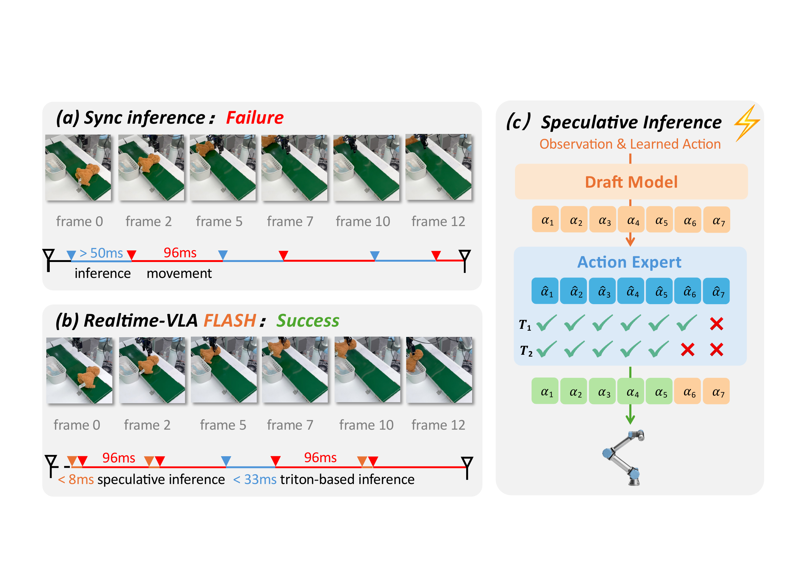
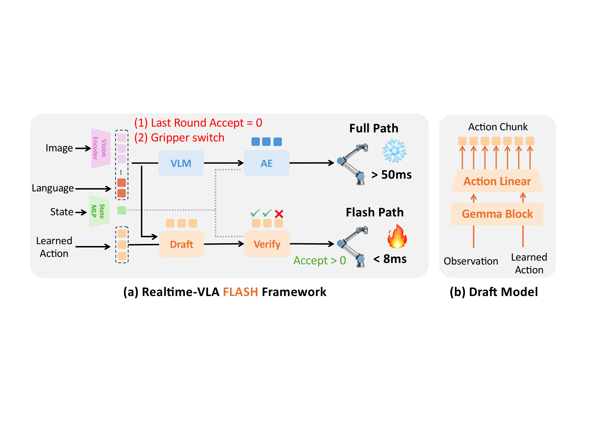
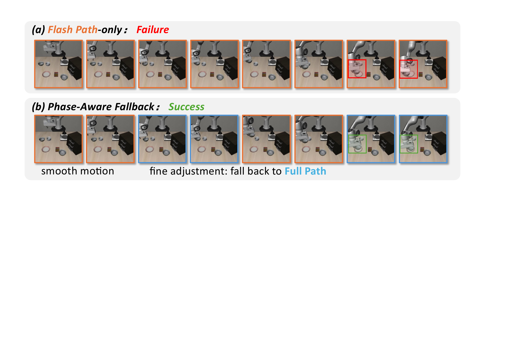
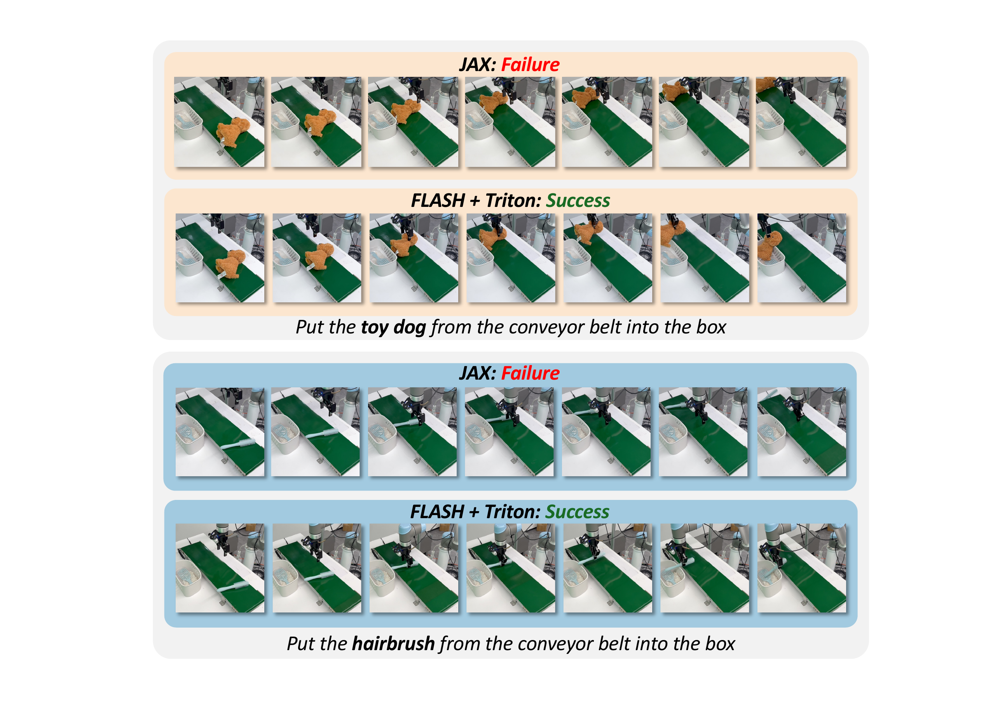

# Realtime-VLA FLASH: Speculative Inference Framework for Diffusion-based VLAs

#

# 基本信息

- arXiv: 2605.13778
- Authors: Jiahui Niu, Kefan Gu, Yucheng Zhao, Shengwen Liang, Tiancai Wang, Xing Hu, Ying Wang, Huawei Li
- Categories: cs.RO, cs.CV
- 一句话结论：本文提出面向扩散式视觉-语言-动作模型（dVLA）的投机推理框架 FLASH，通过轻量级 Draft Model 生成候选动作块、主模型 Action Expert 并行验证以及相位感知回退机制，在几乎不损失任务成功率的前提下将推理延迟降低 3.04 倍，首次实现了流匹配连续动作空间中的高效投机推理。

#

# 研究问题

扩散式视觉-语言-动作模型（dVLA，如 $\pi_0$）通过流匹配（Flow Matching）生成连续动作块，在复杂具身操作任务中展现出强大潜力。然而，其完整推理链路包含图像编码、VLM Prefill 与多步 Action Denoise，单轮重规划延迟高达 58 ms。在延迟敏感的物理交互（如高速传送带分拣）中，这种高延迟导致动作更新滞后、机器人反应迟缓，严重限制了 dVLA 在实时控制场景中的部署。现有针对自回归模型的投机推理技术依赖离散 token 概率，无法直接应用于基于流匹配的连续动作生成，因为缺乏自然的接受准则与并行验证手段。本文正是要填补这一空白：在不修改主模型训练范式的前提下，为连续动作空间的 dVLA 构建一套低延迟、高保真的投机推理运行时。

#

# 任务与挑战

具体任务包括 LIBERO 仿真套件（Spatial、Object、Goal、10）中的桌面操作，以及真实世界 UR5 机械臂的高速传送带分拣任务。输入为多视角图像、语言指令和机器人状态，输出为未来 $H=50$ 步的连续动作块（包含末端位姿、旋转与夹爪状态），每执行 12 步后触发一次重规划。

已有方法不够好体现在三个层面：

1. **系统级加速存在天花板**：Triton 内核优化虽能将单轮延迟从 58 ms 降至 39.7 ms，但仍无法避免每轮都执行完整的 VLM Prefill 与 Action Denoise。
2. **自回归投机推理不适用**：Eagle、Speculative Decoding 等 LLM 加速方案依赖离散 token 的逐概率验证，而 dVLA 的动作空间是连续的，且流匹配的去噪过程具有顺序性，难以直接并行。
3. **简单草稿模型误差会累积**：若仅用小模型快速生成动作而不加验证，在长程任务（如 LIBERO-10）中成功率会从 94% 暴跌至 58%，说明必须有主模型的一致性检验与关键阶段回退机制。

#

# 核心 Insight

本文的核心洞察是：**流匹配（Flow Matching）的训练结构本身就蕴含了“并行验证”的可能性**。在训练时，模型沿着高斯噪声与目标动作端点之间的线性插值路径学习局部速度场；在推理时，给定 Draft Model 提出的候选动作端点，我们可以将其与噪声插值构造中间状态，利用主模型的 Action Expert 在少量选定时间步上并行重建端点，通过距离阈值检验草稿与主策略的局部一致性。这相当于把原本需要 10 步顺序去噪的验证过程，压缩为若干单步并行前向计算，从而在不修改原始流匹配公式的前提下实现投机推理。



上图左侧直观展示了同步推理的困境：当推理耗时超过 50 ms 时，传送带上的物体已经移出可抓取范围；而 FLASH 通过 $<8$ ms 的投机推理与 $<33$ ms 的 Triton 推理交错执行，使机器人能够及时反应。右侧则揭示了投机推理的流水线：Draft Model 一次性生成动作块 $\alpha_{1:7}$，Action Expert 在多个时间步 $T_1, T_2$ 上并行重建端点 $\hat{\alpha}_{1:7}$，取所有时间步都通过验证的最长前缀（绿色）执行，其余（橙色）丢弃。

#

# 方法与公式

Realtime-VLA FLASH 采用**双路径推理架构**：Full Path 执行标准 dVLA 的完整前向链路（Image Encoder → VLM Prefill → Action Denoise）；Flash Path 则通过轻量级 Draft Model 生成候选动作块，经主模型 Action Expert 并行验证后输出可执行前缀，必要时回退至 Full Path。



#

## 1. Draft Model 架构与训练

Draft Model 由单个 Gemma Transformer Block 与线性动作头组成，参数量仅约 110M，远小于主 VLM（约 2.7B）。输入为当前图像编码、语言指令、机器人状态，并附加 $H$ 个可学习的 action slots 作为显式输出查询。通过 Blockwise Attention Mask，这些 action slots 能够互相交互并 attend 到视觉-语言前缀，从而在一个前向传播中并行解码出完整动作块：

```math
\hat a_{t+h-1}^{d} = W_{\mathrm{act}} z_h + b_{\mathrm{act}}, \qquad h=1,\dots,H
\tag{1}
```

其中 $z_h$ 为第 $h$ 个 action slot 的最终隐状态，$W_{\mathrm{act}}$ 与 $b_{\mathrm{act}}$ 为共享线性头参数，$\hat a_{t+h-1}^{d}$ 为 Draft Model 预测的第 $t+h-1$ 步动作。

训练时，Draft Model 以冻结主模型生成的动作块为回归目标，采用带前缀加权的 Huber Loss：

```math
\mathcal{L}_{\mathrm{draft}}=\sum_{h=1}^{H} w_h\,\ell\!\left(\hat a_{t+h-1}^{d},\; a_{t+h-1}\right)
\tag{2}
```

其中 $w_h$ 为步长相关权重（前缀动作权重更高，$\gamma_{\mathrm{prefix}}=0.9$），$\ell(\cdot,\cdot)$ 为 Smooth L1 / Huber 损失。该设计让早期可执行动作获得更高精度，因为验证后的前缀将直接被执行。

#

## 2. 流匹配与并行验证机制

主模型 Action Expert 在流匹配框架下定义了一个观测条件的 ODE：

```math
\frac{d A_t^\tau}{d\tau} = v_\theta(A_t^\tau,\tau,o_t), \qquad A_t^0 \sim \mathcal{N}(0,I)
\tag{3}
```

其中 $A_t^\tau$ 为去噪时间步 $\tau$ 上的含噪动作状态，$v_\theta$ 为学习的速度场，$o_t$ 为当前观测。

验证的核心在于利用流匹配的线性插值结构。给定 Draft 端点 $\hat A_t^{(d)}$ 与高斯噪声 $\epsilon$，构造中间插值状态：

```math
\tilde A_\tau = \tau \hat A_t^{(d)} + (1-\tau)\epsilon
\tag{4}
```

Action Expert 在该中间状态上预测局部速度场，并重建端点：

```math
\hat A_t(\tau) = \tilde A_\tau + (1-\tau)\, v_\theta(\tilde A_\tau,\tau \mid c_t,\, s_t)
\tag{5}
```

这里 $c_t$ 为复用的 KV Cache，$s_t$ 为最新机器人状态。若 Draft 与主策略一致，重建端点 $\hat A_t(\tau)$ 应接近 $\hat A_t^{(d)}$。

对选定的 $K$ 个时间步 $\mathcal{T}=\{\tau_1,\dots,\tau_K\}$ 并行执行上述重建，检查重建端点与 Draft 在连续通道（位置、旋转）上的距离。算法返回**最长的一致前缀长度 $L$**：

```math
L = \min_{k=1,\dots,K} \sum_{h=1}^{H} \prod_{j=1}^{h} \mathbf{1}\!\left[d_j^{(k)} \le \delta\right]
\tag{6}
```

其中 $d_j^{(k)} = \mathrm{Dist}_{\mathrm{cont}}(\hat a_{t+j-1}^{(d)}, \hat a_{t+j-1}^{(k)})$ 为第 $k$ 个验证时间步上第 $j$ 个动作的距离，$\delta$ 为距离阈值。若 $L=0$ 则拒绝 Draft 并回退 Full Path。

#

## 3. 相位感知回退（Phase-aware Fallback）

夹爪通道（gripper）编码离散语义（开/关）。当 Draft 动作块中检测到夹爪状态切换（标准化后过零阈值）时，系统判定进入精细调整阶段，立即回退至 Full Path 生成高精度动作，防止 Draft 误差在关键阶段放大。



上图展示了 LIBERO-Spatial 中 bowl-to-plate 任务的 3D 轨迹。仅使用 Flash Path 时，最终放置阶段（fine adjustment）的轨迹漂移导致任务失败（红框）；而 Phase-Aware Fallback 在检测到夹爪切换后回退到 Full Path（蓝框），成功完成任务。这说明局部一致性验证不足以保证关键相位的精度，必须引入基于任务语义的回退机制。

#

# 贡献拆解

**贡献 1：首次将投机推理范式扩展到基于流匹配的连续动作 dVLA**

- **做了什么**：针对 $\pi_0$ 风格的流匹配 dVLA，设计了完整的 Draft-Verify-Accept 投机推理闭环，突破了此前投机推理仅适用于离散自回归 token 或随机扩散核的局限。
- **为什么有效**：利用流匹配训练时学习的线性插值路径，将“顺序多步去噪验证”转化为“单步并行端点重建”，在不修改主模型与训练范式的前提下实现了低代价验证。
- **和已有方法差别**：不同于 LLM 的 token-level 概率验证或随机扩散模型的转移核检验，FLASH 提出了基于连续动作空间距离阈值的一致性准则，填补了连续动作空间缺乏高效验证手段的空白。

**贡献 2：轻量级 Draft Model 与双路径运行时**

- **做了什么**：提出仅 110M 参数的单 Gemma Block Draft Model，配合可学习 action slots 并行生成动作块；构建 Full Path / Flash Path 双路径运行时，支持动态前缀执行与自动回退。
- **为什么有效**：Draft Model 结构上与主 VLM 对齐，可直接复用主模型的 Action Expert 进行验证；双路径设计将平均重规划延迟从 58 ms 降至 19.1 ms（3.04× 加速）。
- **和已有方法差别**：相比直接蒸馏少步数策略（如 RDT-2、Mean-Teacher）需要重新训练主模型，FLASH 的 Draft Model 仅作为运行时辅助，主模型保持原始流匹配公式不变，部署更灵活。

**贡献 3：相位感知回退与周期性全路径刷新机制**

- **做了什么**：以夹爪开关为启发式信号，在精细调整阶段主动回退至高精度 Full Path；同时引入周期性全路径刷新（Periodic Full-path Refresh, PF）修正长程漂移。
- **为什么有效**：验证本身是局部一致性检验，无法预见关键相位转换；夹爪切换对应抓取/释放等精度敏感事件，回退机制防止了 Draft 误差在这些阶段的灾难性放大。LIBERO-10 上，纯 Flash Path 成功率仅 58.4%，加入 FB & PF=2 后恢复至 84.6%。
- **和已有方法差别**：现有加速工作（如 Triton-$\pi_0$）专注于算子优化，缺乏对任务阶段语义的感知；FLASH 在控制循环层面引入了任务敏感的回退策略，与系统级加速正交互补。

#

# 关键图表解读

**图 1：Realtime-VLA FLASH 框架总览与 Draft Model 内部结构（figure-005-framework-v1.png）**

- **展示内容**：左侧为双路径架构：Full Path（蓝色）包含 VLM + Action Expert（AE），延迟 $>50$ ms；Flash Path（橙色）包含 Draft + Verify，延迟 $<8$ ms。右侧为 Draft Model 细节：单个 Gemma Block 接收 Observation 与 Learned Action，通过 Action Linear 输出 Action Chunk。
- **支撑论点**：说明 FLASH 如何在控制循环层面绕过昂贵的 VLM Prefill，同时保持与主模型的结构兼容性（Draft 与 VLM 共享 Gemma 结构，便于 Verify 阶段复用 AE）。
- **读图注意**：注意 Flash Path 仍需执行 Image Encoder（无法跳过），因此延迟下限受视觉编码制约；Draft Model 的输入包含 Learned Action（可学习查询），这是实现并行解码的关键。

**图 2：同步推理与 FLASH 的时间线对比及推测推理流程示意（figure-001-overview-wo-title.png）**

- **展示内容**：左侧 (a)(b) 对比了同步推理（96 ms 推理+运动周期导致失败）与 FLASH（投机推理 $<8$ ms + Triton 推理 $<33$ ms 交错执行导致成功）的帧级差异。右侧 (c) 展示了 Draft Model 生成 $\alpha_{1:7}$，Action Expert 在 $T_1, T_2$ 并行重建并逐动作检验，最终取最长接受前缀（绿色）执行。
- **支撑论点**：直观证明“降低推理延迟”直接决定“物理任务成败”；右侧流程图解释了为何 FLASH 能在不修改流匹配训练的情况下实现投机推理。
- **读图注意**：注意 $T_1$ 和 $T_2$ 两个时间步的检验结果可能不同（如 $T_2$ 在第 6 步失败），最终前缀长度取保守的交集（min），这是保证执行安全性的关键设计。

**图 3：Naive 推测推理与 Phase-Aware Fallback 的 3D 轨迹对比（figure-002-action-visualization.png）**

- **展示内容**：(a) 纯 Flash Path 执行时，轨迹在最终放置阶段漂移，导致碗与盘子错位（红框）；(b) Phase-Aware Fallback 在 fine adjustment 阶段回退到 Full Path（蓝框），成功完成放置。
- **支撑论点**：证明局部一致性验证（Verifier）本身不足以保证长程或关键相位的精度，必须结合任务语义回退机制。
- **读图注意**：橙色边框表示 Flash Path 执行，蓝色边框表示 Full Path 执行。观察到最后两帧（关键放置）由 Full Path 接管，而前期平滑运动由 Flash Path 完成，体现了“该快时快、该精时精”的分阶段策略。

**图 4：真实世界传送带分拣任务中基线与 FLASH 的定性结果对比（figure-000-conveyor-demo.png）**

- **展示内容**：在 15 m/min 高速传送带上，JAX-$\pi_0$ 因延迟过高导致抓取失败（错过物体或夹爪闭合过晚），而 FLASH+Triton 成功完成 toy dog 与 hairbrush 的分拣。
- **支撑论点**：在真实延迟敏感场景中，FLASH 的加速直接转化为任务成功率的提升，且对细长物体（hairbrush）这种容错性低的任务同样有效。
- **读图注意**：注意 hairbrush 任务中基线失败更频繁，因为细长几何对位姿和时序误差更敏感；FLASH 的成功表明 per-action latency 的降低（1.9 ms）对高速反应式操作至关重要。

#

# 实验与消融

**数据集与设定**

- **仿真**：LIBERO 四个套件（Spatial、Object、Goal、10），每任务 50 次试验，动作块大小 $H=50$，每 12 步重规划。
- **真实世界**：UR5 + RealSense D435i，传送带分拣（toy dog / hairbrush），速度分 Medium（10 m/min）、High（13 m/min）、Extra High（15 m/min），每条件 10 次试验。

**基线**

- Torch-$\pi_0$：原始实现，58.0 ms/轮。
- Triton-$\pi_0$：内核优化版，39.7 ms/轮。
- FLASH-$\pi_0$：本文框架（无 Triton）。
- FLASH+Triton-$\pi_0$：FLASH 与 Triton 叠加。

**主结果（LIBERO 仿真）**

FLASH+Triton-$\pi_0$ 将任务级平均延迟从 58.0 ms 降至 **19.1 ms**（**3.04× 加速**），per-action latency 从 5.0 ms 降至 **1.9 ms**（2.63× 降低）。平均成功率仅下降 **0.3%**（93.8% vs 94.1%），基本保持任务性能。

**最强证据**：LIBERO 主结果与真实世界传送带结果。特别是 Extra High（15 m/min）速度下，FLASH+Triton 是唯一仍有非零成功率（toy dog 20%，hairbrush 10%）的方法，直接证明降低推理延迟可扩展 dVLA 的物理速度边界。

**最存疑证据**：LIBERO-10 上纯 Flash-path（无阶段感知回退与周期性全路径刷新）的成功率仅为 **58.4%**，加入 FB & PF=2 后才恢复到 84.6%。这表明推测路径本身在复杂长程任务上误差累积严重，高度依赖启发式回退机制来“修补”性能，而非 Draft + Verification 本身足够鲁棒。此外，验证阈值 $\delta=0.15$ 和验证步数 $K=2$ 为固定启发式值，缺乏轨迹级自适应性（附录 Future Work 也承认了这一点）。

**消融实验**

1. **Verifier 阈值敏感性（附录表 5）**：在 LIBERO-10 上固定 $K=2$，当 $\delta=0.15$ 时成功率 58.4%、延迟 13.3 ms；$\delta=0.05$ 时成功率升至 93.5%，但延迟也升至 44.9 ms。说明阈值是延迟-精度的强耦合变量。
2. **组件消融（表 6）**：仅加 Periodic Refresh（PF=2）成功率从 58.4% 升至 80.6%；仅加 Phase-aware Fallback（FB）升至 66.8%；两者结合（FB & PF=2）达到 84.6%。证明两个机制对长程精度缺一不可。
3. **Flash Path 统计（表 4）**：FLASH+Triton-$\pi_0$ 有 66.8% 的重规划轮次走 Flash Path，平均接受前缀占 replan 窗口的 69.7%，说明投机执行覆盖了大部分决策周期。

#

# 局限性

1. **验证准则的启发性**：距离阈值 $\delta$ 和验证时间步 $K$ 为固定超参，缺乏轨迹级自适应能力。论文附录明确指出，当前 verifier 是局部一致性启发式，而非形式化保证，其误差受重建误差 $\epsilon_{\mathrm{AE}}$、条件失配 $\epsilon_{\mathrm{cond}}$ 与路径失配 $\epsilon_{\mathrm{path}}$ 共同影响，无法严格确保接受前缀与 Full Path 完全等价。

2. **Draft Model 的蒸馏依赖**：Draft 并非直接拟合原始演示数据，而是回归冻结主模型生成的动作块（教师蒸馏）。这增加了部署前约 6 小时（4×RTX 4090D）的额外训练开销，且 Draft 的性能上限受限于主模型，未形成独立的性能增益。

3. **回退信号的单一性**：Phase-aware Fallback 仅以夹爪开关（gripper switch）作为相位转换信号，未验证在旋转、按压、装配等更复杂任务中是否存在同样明确的低维相变信号。若任务缺乏明显的 gripper 语义切换，该机制可能失效。

4. **真实世界场景有限**：真实实验仅涉及单一传送带分拣场景，物体种类仅两种，且控制循环为同步推理（排除异步执行混淆）。在接触丰富（contact-rich）或长程多阶段真实操作中，框架的鲁棒性尚未验证。

5. **可复现性与硬件依赖**：主实验依赖 NVIDIA RTX 4090D 与 Triton 内核优化，Flash Path 的延迟优势与特定 GPU 算力和内存带宽相关；在边缘设备上，Image Encoder 可能成为更紧的瓶颈，而 FLASH 并未跳过该阶段。

#

# 个人研究判断

**值得继续追踪，但更适合作为“推理加速基线”而非“世界模型结合点”**。

理由如下：

- **对 Embodied AI 的即时价值**：FLASH 首次证明了投机推理在流匹配 dVLA 中的可行性，将控制循环延迟降低了 3 倍，且可与内核优化正交叠加。对于关注实时机器人控制的读者，这是一套可落地的即插即用加速方案，值得在后续 VLA 部署工作中作为标准对比基线。
- **与世界模型的潜在结合点**：FLASH 的验证机制本质上是“用主模型作为世界模型”检验 Draft 动作的一致性。未来可以引入显式的世界模型（World Model）或价值函数来替代固定的距离阈值 $\delta$，实现动态、可学习的接受准则；或者利用世界模型预测未来状态，提前判断 Draft 在长程任务中的可行性，从而减少对周期性 Full Path 刷新的依赖。论文附录也提到“基于不确定性估计或价值函数的动态验证阈值”是未来方向。
- **局限与风险**：该论文的核心贡献在系统与算法工程层面，理论创新相对有限；其对任务语义的利用（gripper switch）较为朴素，在通用长程任务中的扩展性存疑。若读者的研究重心是 World Model 的生成或预测能力，FLASH 本身并未提供新的世界模型训练目标或架构，更多是“下游任务中如何用好现有模型”的启示。

综上，建议将 FLASH 视为连接“高效 VLA 推理”与“World Model 辅助决策”的桥梁性工作：它揭示了“低代价验证”在实时控制中的重要性，为后续用 World Model 替代启发式 Verifier 提供了明确的切入点。

## 关键图表解读



*真实世界传送带分拣任务中基线与 FLASH 的定性结果对比*
