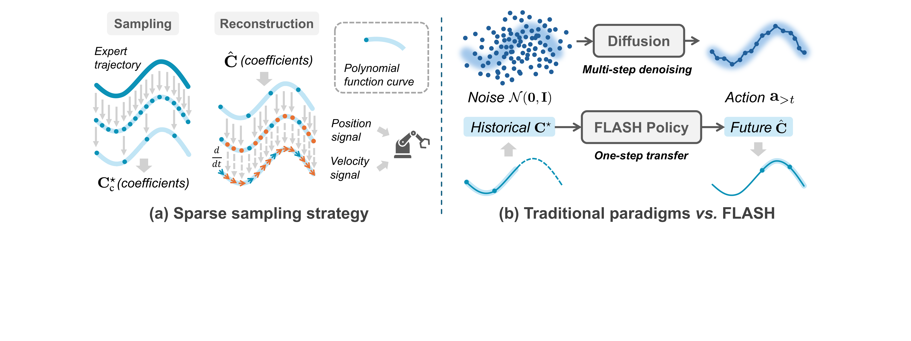
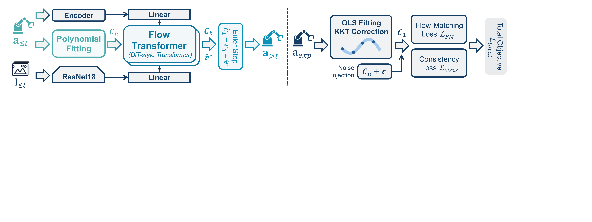
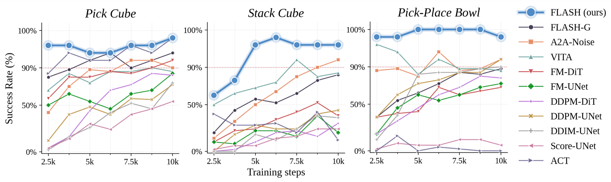
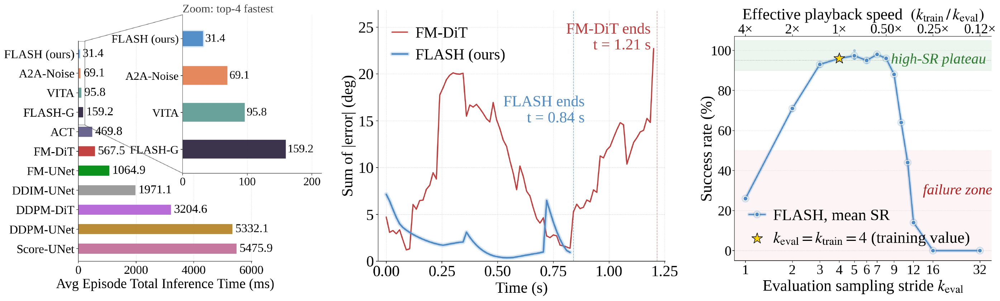

# FLASH: Efficient Visuomotor Policy via Sparse Sampling

#

# 基本信息

- **arXiv:** 2605.15492
- **Authors:** Jiaqi Bai, Jindou Jia, Yuxuan Hu, Gen Li, Xiangyu Chen, Tuo An, Kuangji Zuo, Jianfei Yang
- **Categories:** cs.RO, cs.CV
- **一句话结论:** 通过 Legendre 多项式系数空间中的稀疏采样与历史锚定流匹配，FLASH 在保持 ≥92% 任务成功率的同时，将视觉运动策略的推理压缩至单步（NFE=1），实现相较扩散策略最高 175 倍的推理加速，并为低层扭矩控制提供解析速度前馈。

#

# 研究问题

本文针对视觉运动模仿学习（visuomotor imitation learning）中的实时性瓶颈。当前基于扩散模型（Diffusion Policy）或流匹配（Flow Matching）的生成式策略虽然擅长建模多模态动作分布，但其依赖多步迭代去噪或 ODE 数值积分，推理延迟极高，难以满足真实机器人控制的实时需求。此外，现有方法普遍采用离散动作块（action chunk）表征，导致策略必须在短时段内高频重推理；若直接延长预测时域以降低调用频率，输出维度会随 horizon 线性膨胀，引发“维度灾难”。因此，核心科学问题是：**如何在保持控制精度与平滑性的前提下，实现低频推理并覆盖长时域动作规划？** 这与 VLA（Vision-Language-Action）和 World Model 研究密切相关：高效、低延迟的动作生成模块是连接高层感知/规划与底层硬件控制的关键接口。

#

# 任务与挑战

论文考虑标准模仿学习设定：策略将历史观测映射到未来动作轨迹。输入包括历史动作序列 $\mathbf{a}_{\le t}$、对应图像流 $\mathbf{I}_{\le t}$，输出为未来动作 $\mathbf{a}_{>t}$。训练基于专家示教，评测覆盖 5 个模拟任务（Roboverse / RLBench / ManiSkill / LIBERO）及 2 个真实世界 Franka 操作任务。

已有方法面临三重挑战：
1. **推理效率：** 扩散/流匹配基线需要数十至上百步 NFE（Number of Function Evaluations），单回合总推理时间可达数秒。
2. **维度-时域耦合：** 离散动作点表征下，延长 action horizon $T_a$ 会直接增加网络输出维度，导致训练困难与计算开销剧增。
3. **段间不连续与跟踪误差：** 分块预测的动作在拼接处易产生位置/速度跳变，离散点表征也无法直接为扭矩控制器提供解析速度前馈。

#

# 核心 Insight

FLASH 的核心观察是：机器人运动本质平滑且低频，一段轨迹可用少量正交多项式系数紧凑刻画。基于此，作者提出三项协同设计：

第一，**稀疏时域采样下的 Legendre 多项式参数化**。不再逐点预测离散动作，而是在归一化时间 $s\in[0,1]$ 上将动作轨迹展开为 Legendre 多项式系数 $\mathbf{C}$。通过以 stride $k$ 对专家轨迹进行稀疏采样拟合，单次网络推理即可覆盖 $k \times H_{\text{poly}}$ 的物理执行时长，且输出维度仅由多项式次数 $K$ 决定，与预测时域解耦。

第二，**历史锚定流匹配（history-anchored flow matching）**。传统流匹配从标准高斯噪声 $\mathcal{N}(\mathbf{0},\mathbf{I})$ 出发，传输距离长，必须多步积分。FLASH 将流匹配的起点替换为从历史动作拟合得到的多项式系数 $\mathbf{C}_h$。由于相邻动作段共享强运动学结构，$\mathbf{C}_h$ 通常非常接近目标 $\mathbf{C}_1$，传输距离极短，从而可用单步 Euler 积分实现准确生成（NFE=1）。

第三，**跨段 $C^1$ 连续性与解析微分**。相邻多项式段通过 KKT 校正强制满足位置与速度连续；同时，利用多项式的可微性直接解析计算速度信号，作为前馈注入扭矩控制器，显著降低跟踪误差。



上图直观展示了 FLASH 与传统范式的差异：传统方法（右上）从噪声出发经多步去噪生成离散动作点；FLASH（右下）则在系数空间中，将历史系数 $\mathbf{C}^\star$ 经单步转移得到未来系数 $\hat{\mathbf{C}}$，再解析重建连续轨迹。

#

# 方法与公式

#

## 1. 稀疏多项式参数化

FLASH 将动作轨迹表示为归一化时间 $s$ 上的连续函数，并在正交基上展开：

```math
\mathbf{a}(s) \;=\; \sum_{j=0}^{K} \mathbf{c}_{j}\,\Phi_{j}(s),
\qquad
s \;=\; \frac{\tau - \tau_{\text{start}}}{\tau_{\text{end}} - \tau_{\text{start}}} \in [0,1]
\tag{1}
```

其中 $\Phi_j(s)$ 为标量基函数，$\mathbf{c}_j \in \mathbb{R}^{d_a}$ 为对应系数向量，$K$ 为多项式次数，$d_a$ 为动作维度。论文采用移位 Legendre 多项式，其通过 Bonnet 递推定义：

```math
(n+1)P_{n+1}(x) = (2n+1)\,x\,P_{n}(x) - n\,P_{n-1}(x),
\qquad
P_0(x)=1,\; P_1(x)=x
\tag{2}
```

在 $x = 2s-1$ 处求值后，Legendre 族在 $[-1,1]$ 上正交，保证拟合时 Gram 矩阵良态且系数分布量级可比，这对后续流匹配的稳定性至关重要。

**稀疏采样拟合：** 以时域 stride $k$ 从专家轨迹提取节点，使 $H_{\text{poly}}$ 个稀疏节点覆盖 $k \cdot H_{\text{poly}}$ 个物理步。令 $\mathbf{Q}$ 为堆叠的稀疏动作矩阵，$\mathbf{S}$ 为对应时刻的 Legendre 基矩阵，则最优系数可通过普通最小二乘（OLS）闭式求解：

```math
\mathbf{C}^{\star} = (\mathbf{S}^{\top}\mathbf{S})^{-1}\mathbf{S}^{\top}\mathbf{Q}
\tag{3}
```

**跨段 $C^1$ 连续性：** 独立求解相邻段会在拼接处引入不连续。论文通过两段扩展（overlap + fit padding）在段边界设置运动学锚点，再用闭式 KKT 校正将无约束解投影到约束流形：

```math
\mathbf{C}^{\star}_{\text{c}}
\;=\;
\mathbf{C}^{\star}
\;-\;
(\mathbf{S}^{\!\top}\mathbf{S})^{-1}\mathbf{A}^{\!\top}
\!\big[\mathbf{A}(\mathbf{S}^{\!\top}\mathbf{S})^{-1}\mathbf{A}^{\!\top}\big]^{-1}
\!\big(\mathbf{A}\mathbf{C}^{\star} - \mathbf{b}\big)
\tag{4}
```

其中 $\mathbf{A}$ 与 $\mathbf{b}$ 分别编码边界处的位置与速度等式约束。该校正保证训练目标在段间 $C^1$ 光滑。

**解码与频率解耦：** 部署时对预测系数 $\hat{\mathbf{C}}$ 进行稠密上采样，恢复可执行轨迹及其解析导数：

```math
\hat{\mathbf{a}}(s_i) \;=\; \sum_{j=0}^{K} \hat{\mathbf{c}}_j \Phi_j(s_i)
\tag{5}
```

```math
\hat{\mathbf{v}}(s_i) \;=\; \frac{1}{T}\sum_{j=0}^{K}\hat{\mathbf{c}}_j \Phi'_j(s_i)
\tag{6}
```

其中 $T = k\,H_{\text{poly}}/f_{\text{expert}}$ 为物理时段长度。由于轨迹形状固定在归一化时间轴上，仅通过改变评估 stride $k_{\text{eval}}$ 即可事后调节执行速度，无需重训练。

#

## 2. 历史锚定流匹配

传统流匹配从噪声分布 $p_0$ 传输到目标 $p_1$，条件速度为 $\mathbf{v}^\star = \mathbf{a}_1 - \mathbf{a}_0$。FLASH 改为在系数空间中构造从历史到未来的直线路径：

首先，对观测到的本体历史 $\mathbf{a}_{\le t}$ 做 Tikhonov 正则化最小二乘，得到历史系数 $\mathbf{C}_h$：

```math
\mathbf{C}_{h}
\;=\;
\big(\mathbf{S}_{h}^{\!\top}\mathbf{S}_{h} + \lambda_{h}\mathbf{I}\big)^{-1}
\mathbf{S}_{h}^{\!\top}\,\mathbf{a}_{\le t}
\tag{7}
```

正则项 $\lambda_h>0$ 防止窄窗口稠密采样导致的数值病态，确保起点分布有界。随后定义线性插值与恒定条件速度：

```math
\mathbf{C}_\tau \;=\; (1-\tau)\,\mathbf{C}_{h} + \tau\,\mathbf{C}_{1},
\qquad
\mathbf{v}^{\star}(\mathbf{C}_\tau,\tau) \;=\; \mathbf{C}_{1} - \mathbf{C}_{h}
\tag{8}

```math

网络采用 DiT-style Transformer $f_\theta(\mathbf{C}_\tau,\tau,\mathbf{e})$ 回归该速度，其中全局条件 $\mathbf{e}$ 由 ResNet-18 编码图像并与本体历史拼接得到。由于 $\mathbf{C}_h$ 已接近 $\mathbf{C}_1$，单步 Euler 更新即足够：

```math
\hat{\mathbf{C}}_{1} \;=\; \mathbf{C}_{h} + f_\theta(\mathbf{C}_{h},0,\mathbf{e})
\tag{9}
```


#

## 3. 学习目标

**流匹配损失** 监督整条路径上的向量场：

```math
\mathcal{L}_{\text{FM}}
\;=\;
\mathbb{E}_{\tau\sim\mathcal{U}[0,1],\,\mathbf{C}_{h},\,\mathbf{C}_{1}}
\Big\lVert f_\theta\!\big(\mathbf{C}_{\tau},\tau,\mathbf{e}\big) - (\mathbf{C}_{1} - \mathbf{C}_{h})\Big\rVert_{2}^{2}
\tag{10}
```

**多项式一致性损失** 显式约束训练时 $\tau=0$ 处的单步 Euler 更新，弥合连续流目标与离散单步推理之间的鸿沟：

```math
\mathcal{L}_{\text{cons}}
\;=\;
\mathbb{E}_{\mathbf{C}_{h},\,\mathbf{C}_{1}}
\Big\lVert \mathbf{C}_{h} + f_\theta\!\big(\mathbf{C}_{h},\,0,\,\mathbf{e}\big) - \mathbf{C}_{1}\Big\rVert_{2}^{2}
\tag{11}

```math

**总目标：**

```math
\mathcal{L}_{\text{total}} \;=\; \mathcal{L}_{\text{FM}} \;+\; \lambda_{\text{cons}}\,\mathcal{L}_{\text{cons}}
\tag{12}
```


其中 $\lambda_{\text{cons}}>0$ 为标量权重。训练时向 $\mathbf{C}_h$ 注入少量高斯噪声 $\boldsymbol{\epsilon}\sim\mathcal{N}(\mathbf{0},\sigma_{h}^{2}\mathbf{I})$ 以增强对离策略历史的鲁棒性。



上图左半部分展示推理流程：历史动作经多项式拟合得到 $\mathbf{C}_h$，与视觉特征融合后输入 DiT-style Flow Transformer，单步 Euler 预测未来系数并解码为动作与速度。右半部分展示训练流程：专家动作经 OLS 拟合与 KKT 校正得到目标系数，再经噪声注入后由 Flow-Matching Loss 与 Consistency Loss 联合监督。

#

# 贡献拆解

1. **稀疏采样 Legendre 多项式动作表征**
   - **做了什么：** 以时域 stride $k$ 对专家轨迹稀疏采样，拟合为少量 Legendre 系数；部署时通过解析上采样恢复任意频率的连续轨迹。
   - **为什么有效：** 正交多项式将轨迹的“形状”与“时长”解耦，网络输出维度仅取决于次数 $K$ 而非物理 horizon，避免了延长预测时域带来的维度灾难。
   - **与已有方法差别：** 不同于 MPD、FlowMP 等仅在规划层使用 B-spline 的工作，FLASH 将多项式系数作为策略的直接输出，并与稀疏采样结合以降低推理频率。

2. **历史锚定流匹配与单步推理**
   - **做了什么：** 将流匹配的源分布从标准高斯噪声替换为历史动作拟合的多项式系数 $\mathbf{C}_h$，并引入一致性损失 $\mathcal{L}_{\text{cons}}$ 专门优化单步 Euler 更新。
   - **为什么有效：** 历史系数提供了强运动学先验，显著缩短传输距离；一致性损失弥合了训练（连续时间）与推理（离散单步）之间的差异，使 NFE=1 时仍保持高精度。
   - **与已有方法差别：** A2A-Noise 虽也利用历史动作作为先验，但仍在离散动作空间操作；FLASH 将其提升到轨迹级系数空间，并实现了比 A2A-Noise 更快的单步生成。

3. **跨段 $C^1$ 连续性与解析速度前馈**
   - **做了什么：** 通过 KKT 校正强制相邻多项式段在边界处位置与速度连续；利用多项式可微性直接计算解析速度 $\hat{\mathbf{v}}$，注入扭矩控制器作为前馈。
   - **为什么有效：** KKT 校正消除了段间抖动；解析速度前馈避免了数值微分噪声，使关节位置跟踪 MAE 从 $2.90^\circ$ 降至 $1.33^\circ$（J7 关节）。
   - **与已有方法差别：** 现有基于多项式的规划方法（如 Crowd-FM、BEAST）未将解析导数实际用于低层扭矩控制前馈，FLASH 填补了这一空白。

4. **事后执行速度调节（post-hoc speed modulation）**
   - **做了什么：** 由于轨迹形状固定在归一化时间轴，仅改变评估 stride $k_{\text{eval}}$ 即可加速或减速执行，无需重训练。
   - **为什么有效：** 速度命令 $\hat{\mathbf{v}}\propto 1/T$ 随物理时长自动解析缩放，控制器仍获得平滑高频信号。
   - **与已有方法差别：** 离散动作块策略难以在推理时连续调节速度，而 FLASH 的连续表征天然支持在线变速。

#

# 关键图表解读



**图：训练效率对比（Pick Cube / Stack Cube / Pick-Place Bowl）**
- **展示内容：** 11 种方法在 2.5k 至 10k 训练步下的成功率曲线。
- **支撑论点：** FLASH 的收敛速度显著快于所有基线。在 *Pick Cube* 上，FLASH 仅用 2.5k 步即达到约 96% 成功率，而 ACT 需 10k 步才达到相近水平，训练速度提升约 4 倍；在 *Stack Cube* 上，FLASH 于 6.25k 步达到 98%，同期最强基线 VITA 仅约 72%。这说明在系数空间中学习可大幅降低样本复杂度与优化负担。
- **读图注意：** 纵轴为成功率百分比，横轴为训练步数。FLASH（蓝色大圆点）始终位于最上方且方差小；扩散/流匹配基线（如 DDPM-UNet、FM-DiT）收敛慢且波动大；ACT 在部分任务上虽最终性能接近，但长时域任务（如 Pick-Place Bowl）完全失效（0%）。



**图：推理效率、跟踪误差与事后速度调节**
- **左栏（总推理时延）：** 在 *Stack Cube* 上统计单回合所有推理调用的累计耗时。FLASH 为 31.4 ms，比 Score-UNet（5475.9 ms）快 175 倍，比同架构但使用噪声先验的 FLASH-G（159.2 ms）快 5.1 倍，比次快的 A2A-Noise（69.1 ms）快 2.2 倍。该图直接量化了“稀疏采样 + 历史锚定”双重机制带来的速度收益。
- **中栏（跟踪误差累积）：** 在 *Pick Cube* 上记录 7 关节绝对误差和随时间的变化。FM-DiT 的误差在每一段边界处出现尖峰（段间抖动），任务完成时间 1.21 s；FLASH 的误差曲线平滑且幅值低 4.7 倍，完成时间仅 0.84 s。这证明了多项式表征在平滑性与控制精度上的双重优势。
- **右栏（事后速度调节）：** 固定训练 stride $k_{\text{train}}=4$，改变评估 stride $k_{\text{eval}}$。成功率在 $k_{\text{eval}}\in[3,8]$（对应 0.5× 至 1.33× 播放速度）内保持 ≥93% 的高原平台，仅在极端加速/减速时下降。这说明 FLASH 可在不重新训练的情况下灵活调节执行速度。

#

# 实验与消融

**数据集与设定：** 5 个模拟任务（*Close Box*、*Pick Cube*、*Stack Cube*、*Open Drawer*、*Pick-Place Bowl*）分别来自 RLBench、ManiSkill、LIBERO；2 个真实世界 Franka 任务（*Place Cube*、高精度 *Insert Cube*）。所有模拟实验使用 100 或 40 条专家示教，训练 10k 步，评估 50 个随机初始状态回合。

**基线：** 涵盖扩散策略（DDPM-UNet、DDPM-DiT、DDIM-UNet、Score-UNet）、流匹配策略（FM-UNet、FM-DiT）、Transformer 策略（ACT、VITA）、历史先验策略（A2A-Noise）以及同架构消融（FLASH-G，即从噪声而非历史系数出发）。

**主结果（成功率）：** FLASH 在全部 5 个模拟任务上达到 ≥92% 成功率（NFE=1），其中 *Close Box* 100%、*Pick Cube* 98%、*Stack Cube* 96%、*Open Drawer* 92%、*Pick-Place Bowl* 98%。相比同架构的 FLASH-G 平均提升 17.6 个百分点，相比最强单步基线 A2A-Noise 平均提升 4.8 个百分点。在真实世界毫米级精度 *Insert Cube* 任务中，FLASH 达到 100% 成功率，领先其余 7 个基线平均 47%。

**最能支撑的论据：** 单回合总推理时间仅 31.4 ms（175× 于扩散策略），且同时保持最高成功率，说明速度提升并非以牺牲精度为代价。

**最存疑的论据：** 真实世界实验仅报告 2 个任务且样本量较小（5 次 rollout 用于跟踪误差，50 次用于成功率），在更复杂的接触-rich 场景中的泛化性仍需验证。

**消融实验：**
- **稀疏采样 stride $k$：** 在 *Stack Cube* 上，$k=1$（无稀疏采样）成功率仅 24%，$k=4$ 跃升至 96%（+72 pp）；$k\in[3,8]$ 为性能甜点，$k\ge 13$ 因多项式表达力不足而崩溃。
- **Fit Padding 与 KKT 连续性：** 在 *Close Box* 上，两者皆无仅 75.0%；仅加 fit padding 恢复至 86.0%（+11.0 pp）；再加 KKT $C^1$ 校正达到 97.5%（+11.5 pp）。
- **NFE 扫掠：** 在 *Close Box* 上，单步 NFE=1 成功率 80%，反而优于 NFE=2/4/6（54%/56%/68%），验证了 $\mathcal{L}_{\text{cons}}$ 对单步推理的专门化；NFE>10 后性能饱和于约 86–96%，但延迟线性增长，故 NFE=1 是严格更优的部署选择。
- **速度前馈：** 去除解析速度前馈后，J7 关节位置跟踪 MAE 从 $1.33^\circ$ 恶化至 $2.90^\circ$（2.18×），配对 $t$-检验 $p<10^{-100}$，Cohen's $d=1.78$，效应量极大。

#

# 局限性

1. **固定多项式次数：** 训练前必须选定 $K$（全文使用 $K=6$），推理时无法调整。对于高频、尖锐或接触丰富的轨迹（如灵巧手内操作），固定低次多项式可能表达力不足。
2. **全局恒定执行速度：** 虽然可通过 $k_{\text{eval}}$ 事后调节速度，但同一 rollout 中速度恒定，无法根据任务动态在线自适应（例如接近插入时自动减速、自由空间加速）。
3. **真实世界验证范围：** 仅在 Franka 机械臂上验证了两个操作任务，未涉及更复杂的双臂协调或移动操作场景；模拟到真实的域迁移讨论有限。
4. **历史动作可观测假设：** 方法假设历史动作可直接观测（通过本体感知），在动作与状态语义不完全对齐的系统中可能需要额外适配。

#

# 个人研究判断

面向“World Models assisting Embodied AI downstream tasks”方向，**FLASH 值得持续追踪**。理由如下：

1. **低延迟动作生成的基线价值：** 当前 VLA 与 World Model 研究多聚焦于高层语义理解与长程规划，而 FLASH 提供了从策略输出到扭矩控制的高效桥梁。其单步推理（NFE=1）特性使其非常适合作为 World Model 的 action decoder，避免多步去噪成为系统级延迟瓶颈。
2. **与世界模型天然兼容的表征：** Legendre 系数空间的紧凑性与解析可微性，便于 World Model 在隐空间中进行轨迹预测与优化；稀疏采样机制也降低了世界模型需要预测的时间分辨率。
3. **可扩展性：** 历史锚定流匹配的思想可推广至其他结构化隐变量（如 B-spline、频域系数），为后续研究提供了“缩短传输距离 + 单步推理”的通用范式。

然而，若下游任务涉及高频接触切换或需要在线变速（如人形机器人全身控制），需先解决固定 $K$ 与恒定速度的限制。建议关注作者是否会在后续工作中引入自适应多项式次数或闭环速度调节机制。
