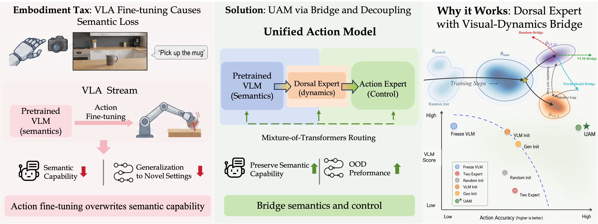
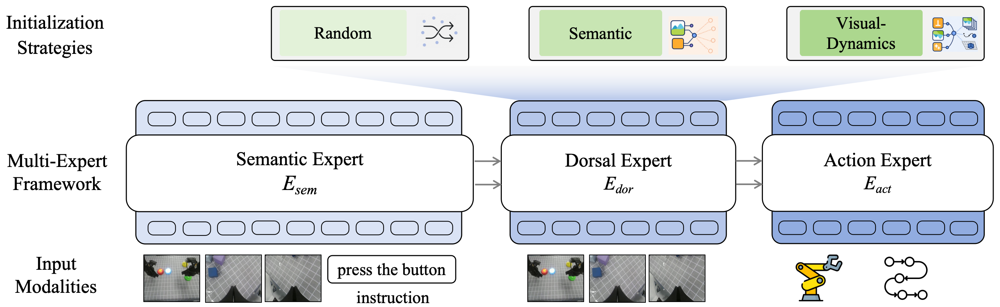
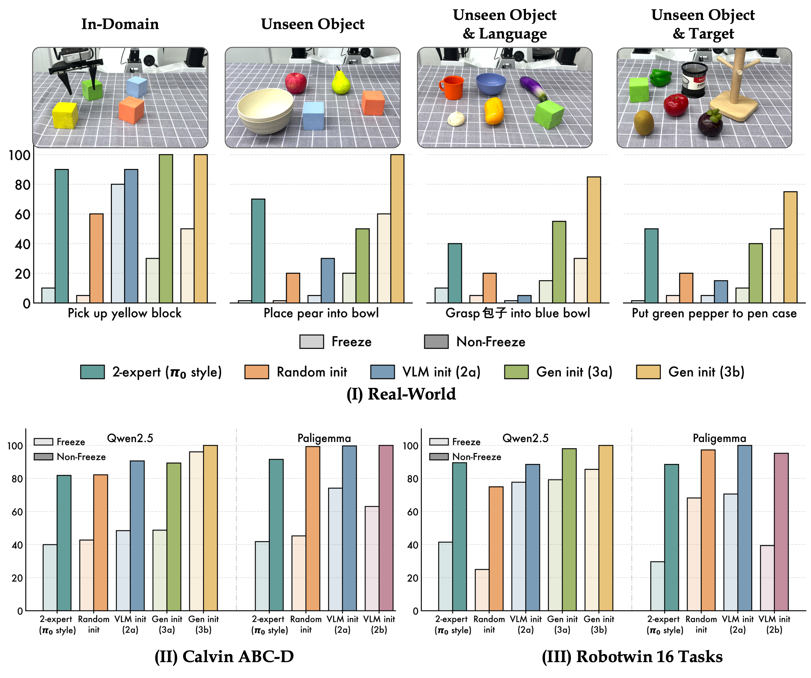
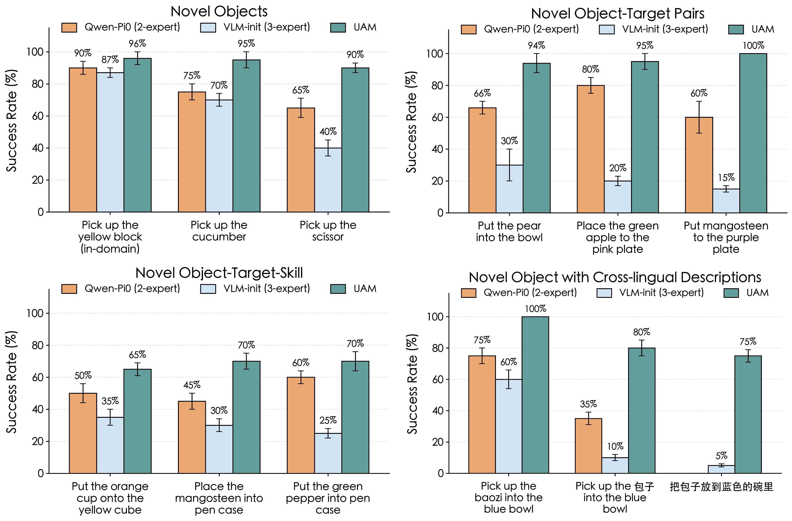

# UAM: A Dual-Stream Perspective on Forgetting in VLA Training

#

# 基本信息

- arXiv: 2605.15735
- Authors: Jianke Zhang, Yuanfei Luo, Yucheng Hu, Xiaoyu Chen, Yanjiang Guo, Ziyang Liu, Hongbin Xu, Tian Lan, Jianyu Chen
- Categories: cs.CV, cs.AI
- 一句话结论：通过引入背侧专家（Dorsal Expert）构建双流 VLA 架构，在无需冻结参数或辅助 VL 数据的情况下，将 VLM 语义能力保留率提升至 95% 以上，同时达到最优的 OOD 操作性能。

#

# 研究问题

本文要解决的核心问题是 VLA 模型在仅使用机器人动作数据进行端到端微调时，预训练 VLM 的多模态语义能力被系统性破坏的现象，作者称之为 **Embodiment Tax**。这与 VLA、World Model 和 Embodied AI 的深层关系在于：VLA 的价值不仅在于动作头，更在于继承 VLM 的开放词汇识别、空间推理与指令跟随能力；然而动作学习的密集梯度会覆盖语义表征，导致灾难性遗忘。本文进一步提出，World Model（视觉动力学）不仅可以作为策略学习的辅助信号，更可被用作塑造独立控制通路的先验，从而在架构层面连接高层语义与低层控制，实现“不忘词也能学抓球”。

#

# 任务与挑战

具体任务为语言条件的机器人操作，涵盖真实世界 ALOHA 双机械臂平台与 Calvin、RoboTwin 模拟环境。

- **输入**：当前 RGB 观测 $I_t$、自然语言指令 $L$、本体感状态 $p_t$。
- **输出**：低层动作 $a_t$（连续末端执行器位姿与夹爪状态）。
- **训练设定**：模型在纯动作数据上端到端训练，不使用辅助视觉-语言共训练数据，不冻结 VLM 参数，也不使用梯度阻断。
- **评测设定**：采用双维度解耦评估——语义保留维度（MMMU、MME、MMBench 等 VQA 基准）与动作性能维度（域内成功率、OOD 泛化）。

已有方法不够好：
- **冻结 VLM**：虽能完全保留语义，但动作性能严重受限；
- **辅助 VL 数据共训练**（如 ChatVLA、$\pi_{0.5}$）：依赖额外大规模语料，且因动作与 QA 目标冲突仍导致显著遗忘；
- **单一视觉编码器**：同时承载语义识别与视觉运动控制，形成表征瓶颈，是遗忘的结构根源而非单纯优化问题。

#

# 核心 Insight

本文的核心洞察是：VLA 微调中的灾难性遗忘并非单纯的优化问题，而是**结构性的表征冲突**——单一视觉编码器被迫同时处理“是什么”（语义识别）和“在哪里/如何做”（视觉运动控制）两种本质不同的视觉需求。受生物视觉腹侧-背侧双通路（Ventral-Dorsal）启发，作者指出解决之道不在于外部约束（冻结权重或数据回放），而在于**架构层面的功能分离**。

具体而言，UAM 在 VLM 语义通路（腹侧）旁并行引入 Dorsal Expert（背侧专家），该专家从预训练生成式统一多模态模型（如 Bagel）初始化，并通过视觉动力学目标（预测场景视觉动态）进行训练。三专家（语义、背侧、动作）通过 Mixture-of-Transformers（MoT）并行路由耦合，使动作学习负担从 VLM 转移至背侧通路，从而在端到端训练中实现语义能力的自动保留。注意力可视化进一步证实，这种分离在训练中自然涌现：语义流关注目标物体与语言实体，背侧流关注机械臂、交互边界与空间关系。



#

# 方法与公式

UAM 是一个三专家并行架构，通过 MoT 路由实现功能分离。

**模型结构**：
- **Semantic Expert** $E_{\mathrm{sem}}$：继承预训练 VLM（如 Bagel/Qwen2.5-VL）权重，负责语言 grounded 语义理解与视觉识别（腹侧通路）。接收 ViT 编码的视觉 token 与语言指令。
- **Dorsal Expert** $E_{\mathrm{dor}}$：从预训练生成式统一多模态模型初始化，负责控制相关的视觉动态与空间特征（背侧通路）。接收 VAE 编码的视觉 token 与本体感信息。
- **Action Expert** $E_{\mathrm{act}}$：聚合 $E_{\mathrm{sem}}$ 与 $E_{\mathrm{dor}}$ 的输出，预测低层动作。

**关键公式**：

首先，定义 VLM 能力遗忘度量 $\Delta$：

```math
\Delta(f_{\mathrm{VLA}}) = 1 - \frac{S(f_{\mathrm{VLA}})}{S(f_{\mathrm{VLM}})}
\tag{1}
```

其中 $S(\cdot)$ 表示模型在标准多模态理解基准上的平均得分。$\Delta=0$ 表示无遗忘，$\Delta=1$ 表示能力完全丧失。

标准 VLA（如 MLP 或 MoT 头）的形式为单一编码器瓶颈：

```math
a_t = E_{\mathrm{act}}\!\left(E_{\mathrm{sem}}(I_t, L;\theta_{\mathrm{sem}});\,\theta_{\mathrm{act}}\right)
\tag{2}
```

这里 $E_{\mathrm{sem}}$ 被迫同时编码语言 grounded 语义和视觉运动控制特征，控制优化的密集梯度会覆盖语义表征。

UAM 通过引入独立背侧通路将其解耦：

```math
Z_{\mathrm{sem}} = E_{\mathrm{sem}}(I_t, L; \theta_{\mathrm{sem}})
\tag{3}
```

```math
Z_{\mathrm{dor}} = E_{\mathrm{dor}}(X_{\mathrm{dor}}; \theta_{\mathrm{dor}})
\tag{4}
```

```math
a_t = E_{\mathrm{act}}(Z_{\mathrm{sem}}, Z_{\mathrm{dor}};\,\theta_{\mathrm{act}})
\tag{5}
```

其中 $X_{\mathrm{dor}}\in\{I_t,\, q\}$ 为 Dorsal Expert 的输入（原始观测或可学习查询），$Z_{\mathrm{sem}}$ 和 $Z_{\mathrm{dor}}$ 分别为语义与动态视觉 token。

UAM 的总训练目标在动作损失外增加视觉动态预测损失：

```math
\mathcal{L}_{\mathrm{total}}=\mathcal{L}_{\mathrm{act}}+\lambda\mathcal{L}_{\mathrm{wm}}(\hat{I}_{t+1}, I_{t+1})
\tag{6}
```

其中 $\mathcal{L}_{\mathrm{act}}$ 为动作预测损失（如 Flow Matching 框架下的去噪损失），$\mathcal{L}_{\mathrm{wm}}$ 为视觉动态预测损失（基于单步去噪预测下一帧观测），$\lambda$ 为平衡系数。该目标迫使 $E_{\mathrm{dor}}$ 学习场景演化的中级推理，而非被动复制语义特征。

**数据流与推理**：
输入图像经双编码器处理：ViT 生成 252 个语义视觉 token，VAE 生成 192 个动态视觉 token。MoT 层通过构造注意力掩码，强制语义 token 仅进入 $E_{\mathrm{sem}}$，动态 token 与本体感信息进入 $E_{\mathrm{dor}}$，动作查询 token 进入 $E_{\mathrm{act}}$ 并聚合全局信息。推理时采用单步去噪机制，避免完整图像重建，降低计算开销。



#

# 贡献拆解

1. **揭示 VLA 遗忘的结构根源**：证明单一视觉编码器瓶颈导致的表征冲突是 embodiment tax 的核心原因；发现即使用 MoT 并行路由，只要控制与语义共享同一视觉编码器，遗忘就无法根除。这为架构层面的解耦提供了实证动机。
2. **提出 UAM 并实现无约束语义保留**：首次证明通过腹侧-背侧结构性分离，可在**无任何参数冻结、无辅助数据回放、无梯度停止**的纯动作数据训练下，保留超过 95% 的 VLM 多模态能力，同时达到最优的 OOD 操作性能。
3. **实证功能分离的自发涌现**：通过注意力可视化与表示分析，证明 UAM 在端到端训练中自然习得双通路分工——$E_{\mathrm{sem}}$ 关注语义实体（What），$E_{\mathrm{dor}}$ 关注机械臂与空间交互（Where/How），且保留的语义能力可直接转化为真实世界 OOD 操作优势。
4. **视觉动力学作为控制通路的归纳偏置**：将 World Model（视觉动态预测）不仅作为策略学习的辅助信号，而是用于塑造独立于语义理解的视觉运动表征，展示了世界模型先验作为连接高层语义与低层控制桥梁的巨大潜力。

#

# 关键图表解读

**图1：论文总览图（figure-001-overview-last.png）**

该图完整呈现了论文的叙事逻辑。左栏揭示“Embodiment Tax”：直接动作微调会覆盖 VLM 语义表征，导致语义能力与 OOD 泛化性双降。中栏提出 UAM 解决方案：通过 MoT 将语义专家、背侧专家与动作专家解耦，背侧专家作为桥梁连接语义与控制。右栏解释为何有效：在损失景观中，随机初始化与 VLM 初始化均存在较大的语义-动作差距；而采用生成式初始化+视觉动态监督的 Dorsal Expert 能缩小该差距，使 UAM 同时达到高 VLM 得分与高动作准确率。读图时应注意三栏的因果递进关系，以及右下角散点图中 UAM 相对于其他变体的帕累托最优位置。

**图2：UAM 多专家框架与初始化策略（figure-007-method-dorsal.png）**

该图清晰刻画了 UAM 的宏观架构与关键设计选择。底部展示输入模态：多视角 RGB 图像、语言指令、本体感状态与机器人动作。中部展示三专家级联：Semantic Expert $E_{\mathrm{sem}}$ 处理 ViT 编码的语义 token，Dorsal Expert $E_{\mathrm{dor}}$ 处理 VAE 编码的动态 token，Action Expert $E_{\mathrm{act}}$ 聚合输出。顶部展示 Dorsal Expert 的三种初始化策略：Random（无先验）、Semantic（VLM 权重复制）、Visual-Dynamics（生成式统一多模态模型初始化）。读图关键在于理解 UAM 采用第三种初始化，这使得背侧通路在训练伊始即具备视觉生成与场景演化的先验，为后续视觉动态监督奠定基础。

**图3：多数据集主实验与消融（figure-004-method-exp-all.png）**

该图横跨 Real-World、Calvin ABC-D、Robotwin 16 Tasks 三大基准，系统验证了不同 Dorsal Expert 设计的动作性能。每组柱状图对比了 Freeze $E_{\mathrm{sem}}$（浅灰）与 Non-Freeze（深灰/彩色）两种设置。关键读图点：在 Real-World OOD 任务中，UAM（Gen init 3b，黄色）显著优于 2-expert 基线（青色）和 Random init（橙色）；在 Calvin 和 Robotwin 上，UAM 在 Non-Freeze 下达到或接近最优。更重要的是，在 Freeze $E_{\mathrm{sem}}$ 探测下，UAM 仍保持较高性能，证明 Dorsal Expert 独立承载了控制所需的视觉信息，而非寄生在语义通路之上。



**图4：真实世界 OOD 泛化实验（figure-006-exp-real-v.png）**

该图聚焦四类 OOD 场景：Novel Objects（未见物体）、Novel Object-Target Pairs（新组合）、Novel Object-Target-Skill（新技能组合）与 Cross-lingual Descriptions（跨语言指令，含拼音、中英混合、全中文）。UAM（绿色）在所有场景下均大幅领先 Qwen-$\pi_0$（2-expert，橙色）和 VLM-init（3-expert，浅蓝）。特别值得注意的是跨语言场景：UAM 在“Pick up the baozi into the blue bowl”上达到 100% 成功率，而 VLM-init 仅 60%；在“把包子放到蓝色的碗里”上 UAM 为 75%，VLM-init 仅 5%。这直接证明，只有具备生成式视觉动态先验的背侧通路，才能有效桥接保留的语义能力与动作执行。



#

# 实验与消融

**数据集与设定**：
- 真实世界：ALOHA 双机械臂平台，3k 条演示轨迹，评估 OOD 任务（未见物体、新物体-目标组合、干扰物、中英文混合/拼音/全中文指令变化）。
- 模拟：Calvin ABC-D（1000 条长度 5 的任务，报告平均完成长度）；RoboTwin 16 Tasks（从 50 个任务中精选最难的 16 个，每任务 50 条演示）。
- 语义保留：MMMU、MME、MMBench、MathVista、MMStar、TextVQA。

**基线**：
- OpenVLA（7B，纯动作微调）：完全遗忘（VQA 得分 0）。
- ChatVLA、$\pi_{0.5}$-base（带 VL 共训练）：仍有显著下降。
- Qwen-$\pi_0$（2-expert MoT）：动作性能较好但 OOD 泛化不足，且存在语义遗忘。
- VLM-init（3a/3b）：Dorsal Expert 用 VLM 权重初始化，OOD 性能显著弱于 UAM。

**主结果**：
- 语义保留：UAM 平均保留 >95% VLM 能力（遗忘率 <5%）。在 MMMU 53.7、MME-P 1607、MMBench 83.7 等基准上，远超 OpenVLA（0 分）和共训练方法，接近原始 Qwen2.5-VL/Bagel。
- 动作性能：Real-World OOD 平均成功率最优；Calvin 和 Robotwin 上达到或接近最优。
- 消融：Random-init Dorsal Expert 无效；VLM-init 有改善但 OOD 差；Gen-init + Visual-dynamics（UAM）最佳。

**最强证据**：
1. 语义保留维度：UAM 在纯动作数据训练后，VQA 能力接近原始 VLM，而 OpenVLA 完全崩溃，证明架构分离本身即可实现语义保留。
2. 控制独立维度：Freeze $E_{\mathrm{sem}}$ 探测实验显示，UAM 在冻结语义专家后仍保持高动作性能，证明 Dorsal Expert 独立承载控制负荷，而非依赖语义通路的特征泄露。
3. OOD 泛化维度：UAM 在跨语言指令和新物体-目标组合上优势巨大，证明保留的语义能力确实迁移到了操作泛化。

**最存疑证据**：
1. 推理延迟：UAM（7B+7B+2B MoT）单步延迟约 1500ms，是 2.3B 小模型基线（~250ms）的 6 倍。尽管作者强调同尺寸 backbone 下增加 Dorsal Expert 的边际影响小，但绝对延迟对高频实时闭环控制仍是潜在瓶颈。
2. 真实世界数据规模：仅基于 3k 条 ALOHA 轨迹，任务类型以抓取放置为主，未验证在更复杂、更大规模数据上的扩展性。
3. Backbone 局限性：论文明确回避了 PaliGemma 系列的充分验证（称需“额外对齐”），主要结论建立在 Qwen/Bagel 单一模型族上，泛化性存疑。

#

# 局限性

1. **推理与部署成本**：UAM 引入额外的 7B Dorsal Expert，单步推理延迟约 1500ms，总参数量达 16B 量级，对计算资源受限的机器人边缘部署构成挑战。
2. **实验规模与 Backbone 局限**：真实世界实验仅基于 3k 条 ALOHA 轨迹，任务类型有限；且未在 PaliGemma 等广泛使用的 VLM 上充分验证，结论的跨架构通用性受限。
3. **视觉动态损失的消融不足**：视觉动态损失权重 $\lambda$ 的选取依据、单步去噪训练动态及其与动作损失的精确交互关系缺乏深入消融，读者难以判断该损失的独立贡献边界。
4. **任务范围**：实验主要涉及刚性物体的抓取与放置，未涉及非刚性物体、高频接触操作或长程复杂任务，Dorsal Expert 的生成式先验在这些场景下的有效性未知。
5. **可复现性与依赖**：方法依赖 Bagel 等特定生成式统一多模态模型的预训练权重，且真实世界实验需要 ALOHA 硬件平台，复现门槛较高。

#

# 个人研究判断

面向“World Models assisting Embodied AI downstream tasks”的研究方向，这篇论文**非常值得继续追踪**。

理由如下：
1. **范式层面的启示**：本文将 World Model 从传统的“策略学习辅助信号”重新定位为“控制通路的自然归纳偏置”，证明了视觉动力学不仅可以用于视频生成或规划，更可以用于在架构层面塑造独立于语义理解的视觉运动表征。这为 World Model 如何深度辅助具身智能提供了新的架构级思路。
2. **生物启发与可扩展性**：腹侧-背侧分离的思想具有强可扩展性。当前 UAM 仅实现了视觉上的双流分离，未来可自然扩展至多模态多流架构（如引入触觉专家、力觉专家、3D 场景动力学专家），构建更丰富的具身感知-动作接口。
3. **解决真实痛点**：VLA 的语义遗忘是社区普遍面临的工程瓶颈，UAM 证明该问题可以通过架构设计本身缓解，而非依赖冻结或数据回放等“治标”手段，这对构建可大规模预训练的通用 VLA 具有深远意义。
4. **明确的研究延伸点**：论文在推理延迟、大规模跨机器人数据预训练、非刚性操作等方面的局限，恰好为后续研究指明了方向。特别是如何将 Dorsal Expert 的设计与更高效的推理机制（如蒸馏、稀疏激活）结合，是一个极具价值的下一步。
