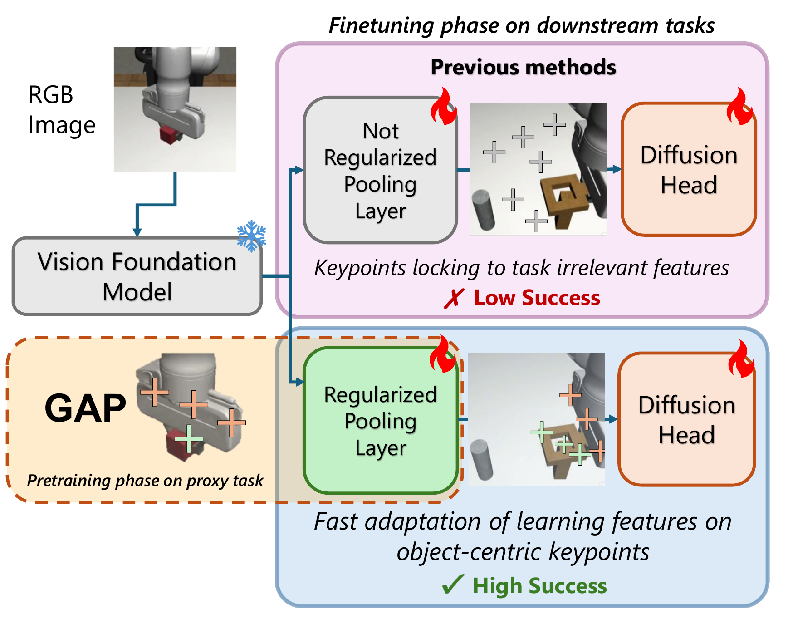
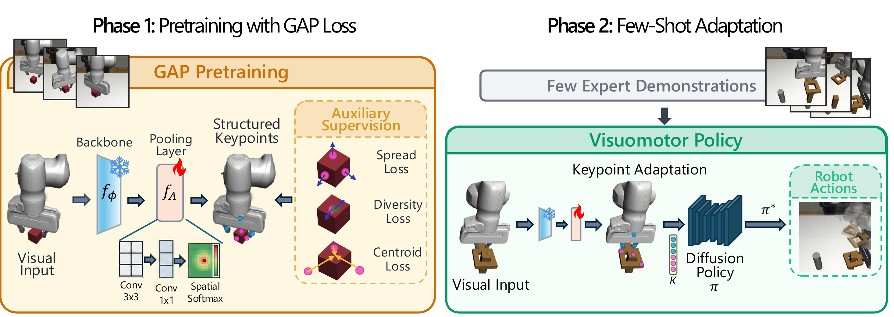
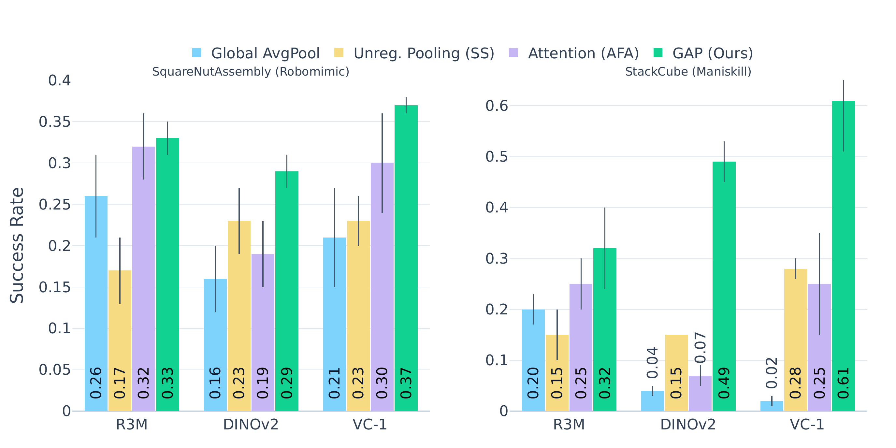
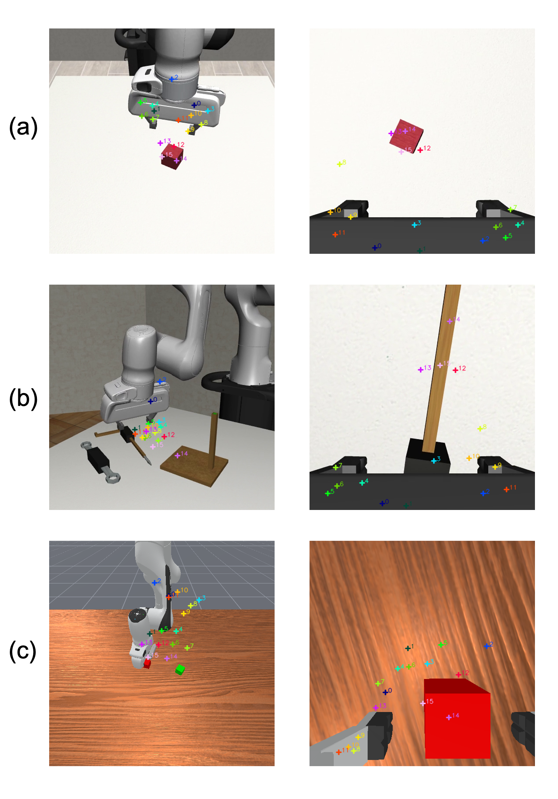

# GAP: Geometric Anchor Pre-training for Data-Efficient Visuomotor Learning of Manipulation Tasks

#

# 基本信息

- **arXiv:** 2605.15836
- **Authors:** Davide Buoso, Andrea Protopapa, Stefano Di Carlo, Francesca Pistilli, Giuseppe Averta
- **Categories:** cs.RO, cs.AI
- **一句话结论:** GAP 通过在廉价模拟代理任务上以无动作标签的几何损失预训练空间池化层，为冻结的 Vision Foundation Model（VFM）提供稳定的物体中心关键点接口，在 15–50 条演示的极端少样本机器人模仿学习中实现跨任务、跨模拟器的最优性能。

#

# 研究问题

论文要解决的核心问题是：**在数据极度稀缺的视觉运动模仿学习中，如何防止冻结 VFM 下游的空间池化层发生“瓶颈坍塌”（bottleneck collapse）**。具体而言，当仅有 15–50 条专家演示时，轻量级空间适配器（Spatial Adapter）被迫承担全部任务适应压力，极易过拟合到背景纹理、光照等无关捷径，导致产生的 2D 关键点丢失物体几何锚定，策略对微小场景扰动极为敏感。

该问题与 Embodied AI 和 VLA（Vision-Language-Action）研究密切相关：当前 VLA 模型通常依赖大规模数据端到端训练，而 GAP 揭示了在**极低数据**下，显式几何归纳偏置比高容量语义注意力池化器更可靠。GAP 提供了一种轻量级的结构化视觉表征接口，可作为 World Model 或下游策略网络的低维几何输入，弥合语义 VFM 与精确空间控制之间的鸿沟。

#

# 任务与挑战

**具体任务:** 在模拟环境中完成接触丰富的机器人操作任务，包括 RoboMimic 的 `PickAndPlace Can`、`Square Nut Assembly`、`Tool Hang`，以及 ManiSkill3 的 `StackCube`。

**输入输出:** 观测为双视角 RGB 图像（agent-centric 与 wrist-mounted 相机各一路）；策略输出为机器人动作，由 Diffusion Policy 建模为多模态动作分布。

**训练与评测设定:** 
- **Phase 1（预训练）:** 在廉价代理任务（如 RoboMimic 的 `LiftCube`）上预训练空间适配器 $f_A$。利用模拟器免费提供的物体分割掩码 $\mathcal{M}_t$ 进行几何监督，**无需任何专家动作标签**。预训练约 40 分钟（10,000 步，单张 A40 GPU）。
- **Phase 2（下游适应）:** 冻结视觉骨干 $f_\phi$，仅用 15、20、30 或 50 条下游任务专家演示微调适配器 $f_A$ 并训练 Diffusion Policy。所有基线共享相同的下游 U-Net 扩散头，唯一区别在于池化层设计及其训练方式。

**已有方法的不足:**
- **端到端微调（E-E）:** 需更新约 56M 参数，在极少样本下易过拟合，数据效率低。
- **无正则化 Spatial Softmax（SS）:** 参数量约 2M，但缺乏几何约束，关键点常锁定在背景或高对比度干扰物上。
- **注意力池化器（AFA 等）:** 参数量约 3M，依赖大量数据学习 query-key 映射；在 15–50 条演示下，高容量反而导致语义漂移与表征坍塌，性能常低于更简单的 SS。

#

# 核心 Insight

本文最核心的思想是：**在极低数据下，空间池化层需要的不是更强的语义选择能力，而是“几何锚定”的先验约束**。GAP 通过在简单代理任务上进行一次轻量级的“热身”（warm-up），利用模拟器掩码强制空间适配器产生三类性质——关键点落在物体上、覆盖物体空间范围、彼此不冗余。这些性质不依赖下游动作标签，却为后续的 Diffusion Policy 提供了一个稳定、可解释的坐标接口（coordinate interface）。 downstream policy 的学习负担从“同时发现物体在哪+如何动作”简化为“在已知几何接口上学习动作映射”。

这一策略与“语义注意力”形成鲜明对比：AFA 试图让网络自己决定关注哪里，但在数据稀缺时，这种自由度过高导致网络追逐统计捷径；GAP 则通过显式几何损失（中心对齐、扩散、多样性）将自由度“锁死”在物体几何上，以牺牲部分语义灵活性换取极端少样本下的鲁棒性。



上图直观展示了这一动机：Previous methods 的无正则化池化层在微调时，关键点（白色十字）散落在背景与无关区域，导致策略失败；而 GAP 的正则化池化层将关键点锚定在机械臂与操作物体上，形成物体中心的几何接口，从而实现高成功率。

#

# 方法与公式

**整体架构与数据流。** 如上图所示，GAP 采用两阶段流水线。第一阶段，冻结的视觉骨干 $f_\phi$（如 VC-1、DINOv2、R3M）提取密集特征图；轻量级适配器 $f_A$ 通过两层卷积（$3\times3$ 接 $1\times1$）将特征投影为 $K$ 张空间激活图 $\Phi_t \in \mathbb{R}^{K \times h \times w}$，再经 Spatial Softmax 压缩为 $K$ 个 2D 关键点 $P_t = \{p_{k,t}\}_{k=1}^K$。第二阶段，这些关键点与可选的附加观测拼接后，输入 Diffusion Policy $\pi$ 生成动作。

**Spatial Softmax 坐标提取。** 适配器将激活图转换为可微分的 2D 关键点坐标：

```math
p_{k,t} = \sum_{x=1}^{w} \sum_{y=1}^{h} \begin{bmatrix} x \\ y \end{bmatrix} \frac{\exp(\Phi_{t, k, x, y})}{\sum_{x',y'} \exp(\Phi_{t, k, x', y'})}
\tag{2}
```

其中 $\Phi_{t, k, x, y}$ 表示第 $k$ 个通道在位置 $(x,y)$ 的激活值。该操作将密集视觉特征压缩为 $K$ 个稀疏坐标，把视觉运动学习转化为“基于关键点的状态学习”。

**Diffusion Policy 训练目标。** 下游策略采用条件去噪扩散模型，其训练损失为噪声预测误差：

```math
\mathcal{L}_{\mathrm{diff}} = \mathbb{E}_{\epsilon \sim \mathcal{N}, k \sim \mathcal{U}, \tau \sim \mathcal{D}} \left[ \left\lVert \epsilon - \epsilon_\theta(a_t^{(k)}, k, E(o_t)) \right\rVert_2^2 \right]
\tag{1}
```

这里 $\epsilon$ 为高斯噪声，$k$ 为扩散时间步，$E(o_t)$ 为视觉嵌入（即 GAP 产生的关键点表征），$\epsilon_\theta$ 为去噪网络。

**GAP 几何损失函数。** 在预训练阶段，GAP 利用模拟器提供的物体掩码 $\mathcal{M}_t$ 对适配器进行三项几何监督：

1. **Centroid Alignment（中心对齐）** 强制关键点质心靠近物体掩码质心，防止关键点漂移到背景：

```math
\mathcal{L}_{\mathrm{center}} = \left\lVert \bar{p}_t - c_t \right\rVert_2^2
\tag{3}
```

其中 $\bar{p}_t = \frac{1}{K} \sum_{k=1}^K p_{k,t}$ 为预测关键点质心，$c_t$ 为掩码 $\mathcal{M}_t$ 的 spatial moment 质心。

2. **Geometric Spread（几何扩散）** 防止所有关键点坍塌到质心（导致方向与边界信息丢失），要求关键点空间方差匹配物体尺度：

```math
\mathcal{L}_{\mathrm{spread}} = \left\lVert \sigma_p - \sigma_{\mathrm{target}} \right\rVert_2^2
\tag{4}
```

其中 $\sigma_p = \frac{1}{K} \sum_{k=1}^K \left\lVert p_{k,t} - \bar{p}_t \right\rVert_2$ 为关键点平均偏移，目标尺度 $\sigma_{\mathrm{target}} = 0.8 \times \sqrt{A_t / \pi}$ 由掩码面积 $A_t$ 近似得到。

3. **Keypoint Diversity（关键点多样性）** 通过成对距离惩罚冗余，鼓励关键点发现物体的不同几何极值：

```math
\mathcal{L}_{\mathrm{div}} = \frac{1}{K} \sum_{k=1}^K \left[ \max\left(0, \delta_{\mathrm{min}} - \min_{j \neq k} \left\lVert p_{k,t} - p_{j,t} \right\rVert_2 \right) \right]^2
\tag{5}
```

$\delta_{\mathrm{min}}$ 为最小间距阈值（实现中取 0.15，归一化图像坐标）。

**总预训练目标。** 三项损失协同形成“推拉”动态：被拉向物体中心（$\mathcal{L}_{\mathrm{center}}$），同时被推向外围覆盖几何（$\mathcal{L}_{\mathrm{spread}}$）并彼此分离（$\mathcal{L}_{\mathrm{div}}$）：

```math
\mathcal{L}_{\mathrm{GAP}} = \lambda_c \mathcal{L}_{\mathrm{center}} + \lambda_s \mathcal{L}_{\mathrm{spread}} + \lambda_d \mathcal{L}_{\mathrm{div}}
\tag{6}
```

权重设置为 $\lambda_c = 0.3$、$\lambda_s = 0.5$、$\lambda_d = 2.0$。

**Object-Centric Keypoint Allocation。** 若场景中有 $M$ 个语义实体（如机械臂与操作物），$K$ 个关键点被划分为 $M$ 个不相交子集，分别对各实体的掩码独立施加 $\mathcal{L}_{\mathrm{GAP}}$。这使得下游微调无需从零学习物体分离，预训练的子集可直接作为独立的语义-几何追踪器快速重锚定到新物体。



#

# 贡献拆解

1. **提出 GAP：一种无动作标签的空间池化层预训练策略。** 在廉价代理任务上，利用免费模拟器掩码通过几何损失正则化适配器，防止少样本微调时的瓶颈坍塌。与端到端预训练不同，GAP 完全解耦于下游任务，仅需约 40 分钟单 GPU 训练即可复用。
2. **设计三项协同几何损失（中心对齐、几何扩散、多样性）。** 三者分别解决“关键点漂移到背景”“关键点坍塌为单点”“关键点冗余重叠”三类失效模式，共同产生稳定、覆盖物体空间范围的 2D 几何锚点。
3. **在极端少样本下实现跨任务、跨模拟器的最优性能。** 在 RoboMimic 与 ManiSkill3 的 15–50 条演示设定下，GAP  consistently 优于端到端微调与注意力池化基线；预训练于 RoboMimic `LiftCube` 的模型可直接迁移到 ManiSkill `StackCube`，证明学习的是域无关几何先验而非特定纹理。
4. **通过对照实验揭示“额外数据≠更好表征”。** 即使让基线在相同代理数据上进行端到端动作监督预训练，其下游性能反而下降（负迁移），而 GAP 取得显著提升。这说明显式几何正则化比单纯增加数据或动作监督更为关键。

#

# 关键图表解读

**图 1（figure-002-iros-2026-teaser-e.png）：核心动机对比。** 该图将 Previous methods（无正则化池化）与 GAP（正则化池化）在微调阶段进行并列对比。上方分支显示，无正则化的池化层在极少样本下将关键点锁定在背景纹理等任务无关特征上，导致 Diffusion Head 接收到的空间信号不稳定，最终成功率低。下方分支显示，GAP 预训练后的正则化池化层将关键点锚定在机械臂与操作物体上，形成物体中心的几何接口，使下游策略能快速适应并取得高成功率。读图时应注意：该图强调的是“微调阶段”而非预训练阶段，说明 GAP 的核心价值在于为下游小样本学习提供良好的初始化。

**图 2（figure-003-iros-2026-method-d.png）：两阶段方法总览。** 左半部分（Phase 1）展示了 GAP 预训练的完整数据流：Visual Input → Backbone $f_\phi$（冻结，雪花标记）→ Pooling Layer $f_A$（带火焰标记，表示可训练）→ Structured Keypoints。右侧虚线框列出三项 Auxiliary Supervision：Spread Loss、Diversity Loss、Centroid Loss。右半部分（Phase 2）展示 Few-Shot Adaptation：利用少量专家演示，将预训练的关键点表征输入 Diffusion Policy $\pi$，输出 Robot Actions。读图时应注意 Backbone 在全程保持冻结，只有 Pooling Layer 和 Diffusion Policy 参与下游训练，参数量仅约 2M。

**图 3（figure-004-task-ablation-plot.png）：跨骨干主实验结果。** 该柱状图对比了四种池化策略（Global AvgPool、Unreg. Pooling SS、Attention AFA、GAP）在三种 VFM 骨干（R3M、DINOv2、VC-1）下的成功率。左侧为 RoboMimic `SquareNutAssembly`（30 demos），右侧为 ManiSkill `StackCube`（30 demos）。关键读图点：在 StackCube 上，VC-1+GAP 达到 0.61，而 VC-1+SS 仅 0.02，VC-1+AFA 仅 0.25，Global AvgPool 仅 0.02；在 SquareNutAssembly 上，VC-1+GAP 达到 0.37，显著高于所有基线。误差线显示 GAP 的方差通常更小，说明其稳定性更高。该图直接支撑了“GAP 兼容任意骨干，且在数据稀缺时显著优于高容量注意力池化器”的论点。



**图 4（figure-005-page-4-xref-253.png）：关键点定性可视化。** 该图展示了三行（a/b/c）机器人操作任务的第三人称（左）与第一人称/特写（右）视角，以及 GAP 预测的 16 个关键点（彩色十字）分布。(a) 为预训练代理任务 RoboMimic `LiftCube`：关键点均匀覆盖机械臂夹爪与红色方块。(b) 为迁移到同模拟器的另一任务：关键点仍锚定在机械臂与目标物体上。(c) 为迁移到不同模拟器 ManiSkill 的任务：尽管视觉域发生显著变化（木质桌面、不同光照），关键点依然保持对物体几何的锚定。读图时应注意：该图证明了 GAP 产生的关键点具有跨任务、跨模拟器的几何一致性，且未出现背景漂移。



#

# 实验与消融

**数据集与设定。** 在 RoboMimic（`Can`、`Square`、`Tool Hang`）和 ManiSkill3（`StackCube`）上评估。观测使用双相机流，每路独立经过各自的 VFM 与 GAP 适配器，关键点拼接后输入 Diffusion Policy。所有任务在 15、20、30、50 条专家演示下训练，结果取 3 个种子平均。

**基线与指标。** 基线包括：ResNet50 端到端全微调（E-E）、R3M+SS、DINOv2+SS、VC-1+SS，以及当前最佳注意力池化器 AFA。指标为任务成功率。

**主结果。** GAP 在所有设定下 consistently 取得最高成功率：
- `Can`（15 demos）：GAP 0.62，较 AFA（0.46）提升 16%，较 E-E（0.55）提升 7%；50 demos 时达到 0.96。
- `Square`（50 demos）：GAP 0.53，较 AFA（0.43）与 E-E（0.38）显著领先。
- `Tool Hang`（50 demos）：GAP 0.63，较最佳竞争对手 R3M+SS（0.50）提升 13%。
- `StackCube`（30 demos）：GAP 0.61，较 E-E（0.50）提升 11%，较 AFA（0.25）提升 140%。

**消融实验。**
1. **损失函数消融（Square, 30 demos）：** 完整 GAP 为 0.37。移除 $\mathcal{L}_{\mathrm{div}}$ 降至 0.24（关键点坍塌为质心，丢失边界信息）；移除 $\mathcal{L}_{\mathrm{spread}}$ 降至 0.32（关键点聚集，覆盖不足）；移除 $\mathcal{L}_{\mathrm{center}}$ 降至 0.26（关键点漂离物体）。证明三项损失缺一不可。
2. **预训练目标消融（Square, 30 demos）：** 在相同代理数据上，用动作监督端到端预训练 SS 或 AFA，然后只迁移编码器与适配器。结果 SS 从 0.23 降至 0.19，AFA 从 0.31 降至 0.27，均出现负迁移；而 GAP 从 0.23 提升至 0.37。这说明**单纯增加代理数据与动作监督无法替代显式几何正则化**。
3. **跨域迁移消融（StackCube, 30 demos）：** 在“同桌面”（ManiSkill 代理任务）、“跨桌面”（白色背景代理任务）、“跨模拟器”（RoboMimic 代理任务）三种预训练条件下，GAP 分别取得 0.56、0.54、0.59，无统计显著差异，且均大幅优于无预训练的 VC-1+SS（0.28）。证明 GAP 学习的是域无关几何先验。
4. **数据规模消融：** 在 `Square` 上使用 100 条演示时，VC-1+SS（0.64）、AFA（0.65）与 GAP（0.68）差距明显缩小。说明 GAP 的相对增益在数据稀缺时最为关键，但在数据充足时仍具优势。

**最强证据：** 跨模拟器预训练（RoboMimic → ManiSkill）仍显著优于所有基线；且预训练目标消融表明，即使基线获得与 GAP 完全相同的代理数据外加动作标签，其下游性能仍下降，而 GAP 提升 14%。这强有力地证明了 GAP 的几何损失设计本身是其性能增益的来源。

**最存疑证据：** 所有定量实验均在模拟环境中完成；真实世界仅提供了一张 zero-shot 定性截图（Figure \ref{fig:real_world}），未在真实机器人上进行系统性的策略学习与评估。此外，代理任务预训练依赖模拟器提供的完美分割掩码，真实场景下需借助 SAM 等外部模型，可能引入噪声与偏差。

#

# 局限性

1. **对模拟器掩码的依赖。** GAP 的预训练阶段需要 ground-truth 物体分割掩码，这在真实世界中无法直接获取。若改用 SAM 等现成分割模型，掩码噪声可能污染几何监督信号，影响预训练质量。
2. **真实世界验证缺失。** 论文仅在模拟环境中进行定量评估，虽然提供了一张真实视频的关键点定性可视化，但未在真实机器人上验证少样本策略学习的实际效果。
3. **几何假设的适用范围。** 当前基于质心与面积的目标尺度估计（$\sigma_{\mathrm{target}}$）假设物体具有相对规则的几何形状。对于可变形物体或高度不规则几何，该归纳偏置可能失效。
4. **代理任务的工程开销。** 尽管预训练仅需 40 分钟，但仍需搭建代理任务环境并生成掩码，增加了系统复杂度；且最优代理任务的选择尚未被系统研究。

#

# 个人研究判断

面向“World Models assisting Embodied AI downstream tasks”的研究方向，**GAP 值得继续追踪**。

理由如下：GAP 的核心价值在于揭示了“在极低数据下，显式几何结构先验比高容量语义注意力更可靠”。这与 World Model 研究中“物体中心表征（object-centric representations）”和“结构化世界模型”的趋势高度一致。GAP 提供了一种轻量级、可迁移的“几何接口”预训练范式，其产生的低维关键点表征可直接作为 World Model 的状态输入，降低世界模型学习高维视觉动态的负担。此外，GAP 与冻结 VFM 的解耦设计使其易于嵌入现有的 VLA 流水线中，作为视觉编码器与策略头之间的“几何适配层”。

然而，其对完美掩码的依赖和缺乏真实世界定量验证是主要障碍。若后续研究能结合自监督或对比学习消除对掩码的依赖，并在真实机器人上验证其少样本迁移能力，GAP 有望成为 Embodied AI 中数据高效视觉运动学习的基础组件。建议关注其是否向真实世界扩展，以及能否与在线 World Model 预测模块结合实现闭环几何校正。
