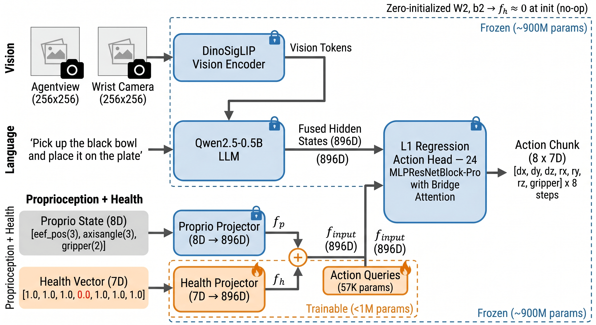

# Health-Conditioned Vision-Language-Action Models for Malfunction-Aware Robot Control

#

# 基本信息

- **arXiv:** 2605.16056
- **Authors:** Hüseyin Arslan, Özgür Erkent
- **Categories:** cs.RO
- **一句话结论:** 通过零初始化的轻量级 Health Projector 将机器人关节健康向量注入冻结的 VLA-Adapter，实现参数高效（<1M）的故障感知机器人控制，在单关节退化场景下显著恢复任务成功率。

#

# 研究问题

现有视觉-语言-动作（VLA）模型通常假设机器人硬件处于完美物理状态，其动作预测完全基于健康本体的演示数据学习得到。然而，真实场景中机器人常面临关节退化、执行器部分失效、电机扭矩减弱等物理故障。这种“健康假设”导致预训练 VLA 在硬件退化时不可避免地发生任务失败。本文针对这一空白，首次形式化地提出 malfunction-aware VLA 问题：如何让 VLA 策略显式感知并适应机器人本体的物理退化，从而在受限的运动学条件下依然完成操作任务。

#

# 任务与挑战

本文在 LIBERO-Spatial 任务套件上开展研究，任务要求机器人根据语言指令（如“Pick up the black bowl and place it on the plate”）完成拾取放置操作。输入包括双视角 RGB 图像（Agentview 与 Wrist Camera，256×256）、语言指令、8D 本体状态（末端执行器位姿 + 夹持器）以及 7D 关节健康向量 $\mathbf{h} \in [0,1]^7$。输出为 8 步动作块（$C=8$），每步 7D 末端执行器增量动作。

核心挑战在于：

1. **分布外退化：** 预训练策略仅在健康数据上训练，面对关节力矩与运动范围受限时，运动学分布发生偏移。
2. **参数效率：** 为避免灾难性遗忘并降低微调成本，需要冻结主干网络，仅引入极少量可训练参数。
3. **数据稀缺：** 物理退化数据难以获取，本文仅通过遥操作收集 178 条片段（128 故障 + 50 健康）。

#

# 核心 Insight

本文的核心思想是：将机器人关节的健康状态显式编码为一个低维向量，并通过一个零初始化的轻量级投影器将其映射到 VLA 的潜空间，与本体感知特征相加后注入动作头的注意力模块。这种“加性条件化”设计在初始化时等价于恒等映射（no-op），从而完整保留预训练策略的行为；在微调后，动作头能够根据当前关节的健康状况自适应地调整运动规划，例如利用其他关节补偿退化关节的运动学限制。



#

# 方法与公式

**基础架构。** 本文以 VLA-Adapter Pro 为基座，其主干为冻结的 Qwen2.5-0.5B 语言模型与 DINOv2–SigLIP 融合视觉编码器。动作头是一个 24 层的残差 MLP 网络（MLPResNetBlock-Pro），每层包含 8 头注意力，通过 Bridge Attention 聚合三类 token：动作潜态（self）、适配器 token（可学习的 Action Queries 与本体感知特征）以及任务 token（视觉-语言特征）。

**健康条件化策略。** 标准 VLA 策略将视觉观测 $\mathbf{o}_t$ 和语言指令 $l$ 映射为动作块：

```math
\hat{\mathbf{a}}_{t:t+C} = \pi_\theta(\mathbf{o}_t, l)
\tag{1}
```

本文提出的健康条件化策略额外接收健康向量 $\mathbf{h}$：

```math
\hat{\mathbf{a}}_{t:t+C} = \pi_\theta(\mathbf{o}_t, l, \mathbf{h})
\tag{2}
```

其中 $\mathbf{h} = [h_0, h_1, \dots, h_6] \in [0,1]^7$，$h_j=1$ 表示关节完全健康，$h_j=0$ 表示关节完全锁死。

**Health Projector。** 该模块为一个两层 MLP，将 7D 健康向量映射到与主干 LLM 对齐的 896 维潜空间：

```math
\mathbf{f}_h = W_2 \, \mathrm{GELU}(W_1 \mathbf{h} + b_1) + b_2
\tag{3}
```

关键设计在于最终层参数 $W_2, b_2$ 采用**零初始化**，使得训练开始时 $\mathbf{f}_h = \mathbf{0}$。这保证了预训练动作头在初始化阶段不受影响。

**特征融合。** 本体状态经 Proprio Projector 映射为 $\mathbf{f}_p \in \mathbb{R}^{896}$，随后与健康特征逐元素相加：

```math
\mathbf{f}_{input} = \mathbf{f}_p + \mathbf{f}_h
\tag{4}
```

融合后的特征与 Action Queries 拼接，作为 adapter token 送入动作头的注意力层。由于初始化时 $\mathbf{f}_h=\mathbf{0}$，注意力模式在初始阶段被完整保留。

**训练目标。** 动作头通过 L1 回归预测未来动作块，损失函数为预测动作与真实动作之间的 L1 距离。仅 Health Projector（810K 参数）和 Action Queries（57K 参数）参与训练，总计约 900K 可训练参数，主干约 900M 参数保持冻结。

**训练配置。** 使用 AdamW 优化器，学习率 $2\times 10^{-4}$，batch size 8，梯度累积 2 步，共训练 15K 步。学习率线性预热 500 步，在 10K 步时衰减 10 倍。动作经 Q99 边界统计归一化到 $[-1,1]$。

#

# 贡献拆解

1. **形式化故障感知 VLA 问题并引入显式健康条件化。**  
   做了什么：将机器人关节健康向量 $\mathbf{h}$ 作为显式输入引入 VLA，定义了 health-conditioned policy。  
   为什么有效：相比隐式域随机化或语义故障恢复，显式健康描述符直接告知模型当前运动学边界，使动作生成过程具备可解释的物理约束感知。  
   与已有方法差别：已有 VLA 假设完美硬件；已有故障容忍研究多聚焦语义任务失败检测（如 AHA、iFailSense），而非本体物理退化适配。

2. **零初始化的轻量级 Health Projector（<1M 参数）。**  
   做了什么：仅训练一个两层 MLP 和 Action Queries，其余 ~900M 参数冻结。  
   为什么有效：零初始化确保预训练策略不被破坏，加性融合不改变 token 数量与注意力结构，实现参数高效微调。  
   与已有方法差别：传统全量微调或 Adapter 层可能干扰预训练表示；本文的加性零初始化设计在数学上保证了初始化时的行为等价性。

3. **面向 LIBERO 的故障遥操作数据收集框架与系统评估。**  
   做了什么：开发鼠标键盘遥操作接口，模拟单关节退化等级 $w \in \{0.3,0.5,0.7,0.9\}$，收集 128 条故障与 50 条健康片段。  
   为什么有效：针对基线完全失败的退化配置采集数据，直接支撑策略学习补偿行为。  
   与已有方法差别：首次为 VLA-Adapter 提供系统的单关节退化基准测试，量化了不同关节的运动学关键性。

#

# 关键图表解读

**图 1：Health-Conditioned VLA 架构图（`figures/figure-000-healthvla-arch.png`）**

该图展示了端到端的输入输出与模块冻结/训练划分，支撑论文“参数高效故障感知”的核心论点。

- **输入侧：** 左侧列出四类输入：双视角视觉（Agentview + Wrist Camera）、语言指令、8D 本体状态（eef_pos, axisangle, gripper）以及 7D 健康向量（示例中第 4 维标红为 0.0，表示该关节故障）。
- **编码与投影：** 视觉经冻结的 DinoSigLIP 编码为 Vision Tokens；语言经冻结的 Qwen2.5-0.5B 处理；本体状态经冻结的 Proprio Projector 映射为 $\mathbf{f}_p$；健康向量经**可训练**的 Health Projector（7D→896D）映射为 $\mathbf{f}_h$。
- **融合机制：** $\mathbf{f}_p$ 与 $\mathbf{f}_h$ 相加得到 $\mathbf{f}_{input}$，与可训练的 Action Queries（57K 参数）一并送入动作头。图中明确标注 Health Projector 的 $W_2, b_2$ 零初始化，确保 $f_h \approx 0$ 初始无操作。
- **输出侧：** 动作头为 24 层 MLPResNetBlock-Pro with Bridge Attention，输出 8×7D 动作块。
- **参数划分：** 蓝色虚线框内为冻结的 ~900M 参数（视觉编码器、LLM、动作头主体），橙色虚线框内为可训练的 <1M 参数（Health Projector + Action Queries）。读图时需特别注意：动作头主体（L1 Regression Action Head）在图中标注为 Frozen，但 Action Queries 是可训练的，这种“冻结网络 + 可训练输入查询”的设计是 VLA-Adapter 系列的关键特征。

#

# 实验与消融

**数据集与设定。** 实验仅在 LIBERO-Spatial 的 10 个任务（T0–T9）上进行。基线（预训练 VLA-Adapter Pro）与本文模型在每个任务×关节×退化等级组合上评估。基线运行 4 个 episode，本文模型运行 10 个 episode。指标为二元任务成功率。

**基线脆弱性分析（最强证据）。** 原文 Table 1 显示，基线在健康状态下成功率达 97.5%，但面对关节退化时暴露严重脆弱性：

- J1（肩）在 $w=0.3$ 时骤降至 45%，$w \geq 0.7$ 时完全失效（0%）。
- J3（肘）在 $w=0.3$ 时降至 42.5%，$w \geq 0.5$ 时降至 0%。

这证明承担主要伸展与抬升运动的近端关节对退化极度敏感，而 J4（前臂）几乎不受影响（97.5%），J5、J6 具有一定鲁棒性。

**健康条件化结果。** 原文 Table 2 对比显示：

- **零初始化未损害健康性能：** 健康向量全为 1 时，本文模型成功率 99.0%，与基线 97.5% 持平。
- **关键关节显著恢复：** J1 $w=0.3$ 从 45% 提升至 89%；J3 $w=0.5$ 从 0% 恢复至 34%；J3 $w=0.7$ 从 0% 恢复至 3%。
- **高退化等级保持优势：** J5 $w=0.7$ 从 65% 提升至 82%，$w=0.9$ 从 67.5% 提升至 79%；J6 $w=0.9$ 从 72.5% 提升至 82%。

**最存疑证据。** 部分原本表现优异的关节出现性能下降：J0（基座）在 $w=0.3$–$0.9$ 从近 100% 降至 71–91%；J4 从 97.5% 降至 89–97%。作者归因于数据集覆盖不足——训练数据主要包含基线失败的退化配置，而缺少基线成功的健康/轻度退化轨迹，导致模型在某些组合上“遗忘”了先验策略。此外，J1 与 J3 在 $w=0.9$ 时仍无法成功（0%），表明当关节几乎完全锁死时，动作自适应存在物理极限。

**任务级分析。** 原文 Table 3 的 per-task 结果显示，模型在特定任务上学会补偿策略（如 T5 J2 $w=0.9$：25%→90%；T8 J3 $w=0.5$：0%→80%），但在运动学冗余度低的任务上提升有限。

#

# 局限性

1. **单关节退化限制：** 当前方法仅在单关节退化场景下验证，未覆盖多关节同时退化的组合空间。虽然架构支持多关节输入，但数据收集尚未展开。
2. **显式健康向量依赖：** 需要外部提供准确的 $\mathbf{h}$，未实现从本体感知或动作反馈中隐式估计健康状态。
3. **数据集规模与覆盖：** 仅 178 条片段，且故障数据集中在基线失败的配置，导致部分健康/轻度退化组合出现性能回退（J0、J4）。
4. **仿真到现实的鸿沟：** 全部实验在 LIBERO 仿真中完成，未在真实机器人或跨本体环境中验证。真实场景的传感器噪声、未建模动力学与更复杂的故障模式仍是开放问题。
5. **高退化物理极限：** 对于承担主要运动学的关节（J1、J3），在 $w=0.9$ 时成功率仍无法突破 0%，说明仅靠动作重规划无法克服极端运动学约束。

#

# 个人研究判断

从“World Models assisting Embodied AI downstream tasks”的视角看，本文并非 World Model 研究，但其核心思想——**显式将机器人本体物理状态（健康向量）作为条件注入策略**——与 World Model 的发展方向高度相关。未来的 World Model 若要在真实机器人上可靠运行，必须显式建模本体物理参数（如关节健康、摩擦、质量）及其对状态转移的影响。本文证明，即使是极轻量的显式条件化（<1M 参数），也能显著提升策略对物理退化的适应能力，这为 World Model 中的“本体状态条件化未来预测”提供了实证支持。

是否值得继续追踪？**值得，但需关注其扩展性。** 理由如下：

- **价值：** 首次在 VLA 领域形式化故障感知问题，并给出参数高效的解决方案，对提升 VLA 在真实场景的鲁棒性具有直接启发。
- **风险：** 当前工作仍局限于单关节、单仿真环境、小规模遥操作数据。若后续研究能解决隐式健康估计、多关节组合退化及真实机器人迁移，该方向将产生更大影响。建议关注其代码与数据集开源后的社区反馈，以及是否向多关节退化或真实硬件拓展。
