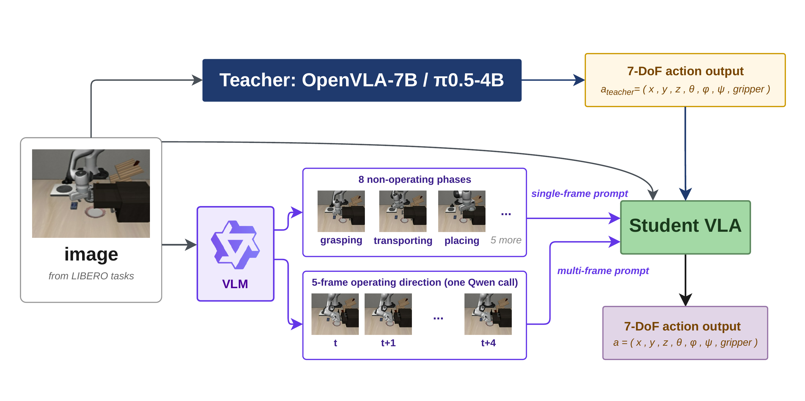
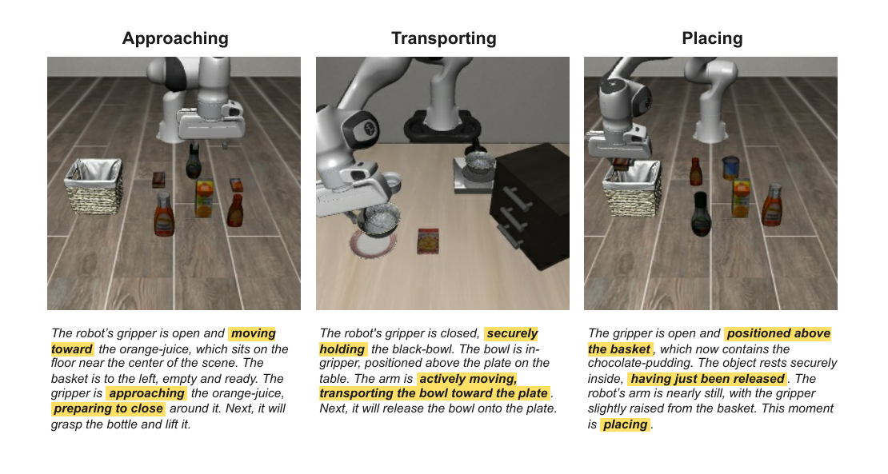
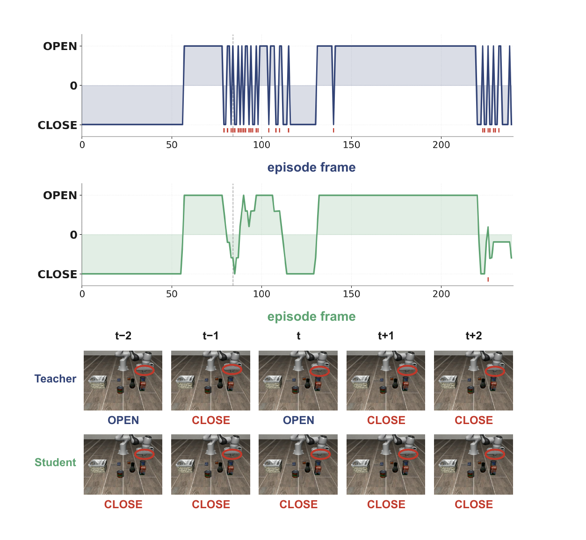
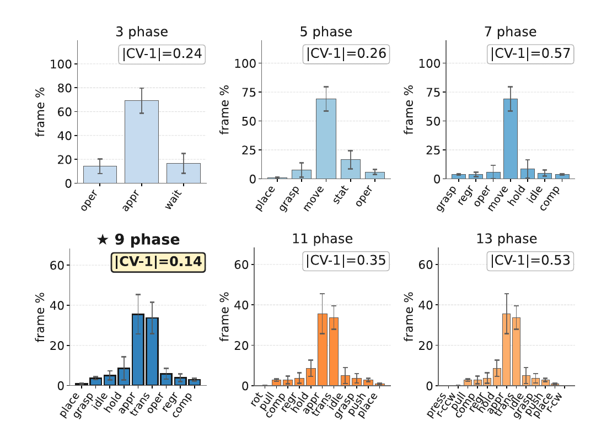

# Offline Semantic Guidance for Efficient Vision-Language-Action Policy Distillation

#

# 基本信息

- **arXiv:** 2605.16241
- **Authors:** Jin Shi, Brady Zhang, Yishun Lu
- **Categories:** cs.CV, cs.AI
- **一句话结论:** 通过离线VLM语义引导（任务阶段锚点+多帧运动方向），可将大参数VLA教师高效蒸馏为158M参数的轻量学生策略，在实现44倍模型压缩与3.28倍推理加速的同时，闭环性能与教师差距仅0.27%，且对教师动作噪声具有显著鲁棒性。

#

# 研究问题

论文针对视觉-语言-动作（VLA）基础模型在机器人操作中的部署瓶颈：数十亿参数规模的教师策略（如OpenVLA-7B、$\pi_{0.5}$-4B）虽具备强大的多任务泛化与指令跟随能力，但其推理延迟过高，难以在边缘设备上支持实时闭环控制。标准行为克隆（BC）蒸馏虽可压缩模型，但轻量学生策略容易因复合误差与分布偏移而在线执行失败，且会盲目过拟合教师动作中的高频噪声（如夹爪抖动）。本文探索的核心问题是：**如何在训练阶段利用视觉语言模型（VLM）的语义理解能力，为轻量学生提供稳定、可迁移的高层监督信号，从而在不增加任何部署开销的前提下，提升蒸馏效率与闭环鲁棒性。**

#

# 任务与挑战

**任务设定：** 在LIBERO基准的三个套件（`libero_object`、`libero_spatial`、`libero_goal`）上进行语言条件的机器人操作。输入为当前RGB图像与语言指令，输出为7-DoF动作向量，包含3D平移增量、3D旋转增量与1维夹爪状态。训练数据由大参数VLA教师成功执行的轨迹构成，每帧配对教师的离散化动作目标。

**核心挑战：**
1. **教师噪声与分布偏移：** 教师策略在闭环执行中存在约3%的系统噪声（如夹爪指令高频翻转），标准BC蒸馏会使学生继承这些错误，导致在线执行时策略崩溃或振荡。
2. **单帧语义歧义：** 在操作阶段（如推拉抽屉），单帧图像无法区分运动方向，造成监督信号混淆。
3. **VLM语言随机性：** 让VLM自由描述场景会产生措辞差异（如"grabbing" vs "reaching for"），轻量学生缺乏冗余容量吸收这种语言方差。
4. **语言捷径风险：** 若学生过度依赖文本描述，可能在部署时因缺少VLM输入而失效。

#

# 核心 Insight

VLA-AD的核心思想是将VLM定位为**离线语义翻译器**而非在线控制器。在训练阶段，VLM（Qwen2.5-VL）通过两类结构化语义信号辅助学生理解操作逻辑：一是基于启发式规则锚定的九阶段任务相位描述（phase anchors），为连续轨迹提供稳定的语义坐标；二是针对操作阶段的多帧运动方向元组（element+direction），解决单帧视觉歧义。测试阶段，学生策略完全独立运行，无需教师VLA或VLM，实现零额外推理开销。

这种设计的本质是让学生同时学习“如何做”（教师动作）与“正在做什么”（VLM语义），从而将高层操作意图与低层连续控制解耦。相位锚点不仅抑制了VLM的语言随机性，还使学生能够识别并平滑掉教师的帧级噪声；多帧方向则确保在视觉高度相似的操作状态下，学生仍能推断出正确的运动意图。



#

# 方法与公式

#

## 整体架构与数据流

VLA-AD的离线训练流程分为三阶段：首先，执行教师VLA（OpenVLA-7B或$\pi_{0.5}$-4B）收集成功轨迹，保留视觉观测与对应的7-DoF教师动作 $a_{\mathrm{teacher}} = (x, y, z, \theta, \phi, \psi, \mathrm{gripper})$；其次，利用VLM生成两类语义标注——单帧相位描述（8个非操作阶段+1个操作阶段）与多帧操作方向描述；最后，轻量学生VLA（Long-CLIP编码器+LoRA适配器+三流MLP头）以动作块长度 $K=5$ 进行端到端训练。

#

## 双路径训练损失

为防止学生依赖语言捷径，论文采用双路径监督。令 $x_t$ 为时刻 $t$ 的图像观测，$\tau$ 为语言指令，$d_t$ 为VLM生成的语义描述，$a_t^* \in \{0,\ldots,255\}^7$ 为教师动作逐维离散化后的目标。总损失为完整路径与纯图像路径的加权和：

```math
\mathcal{L}_{\mathrm{total}}
=
\mathcal{L}_{\mathrm{full}}(x_t, \tau, d_t)
+
\alpha \cdot \mathcal{L}_{\mathrm{img}}(x_t, \tau)
\tag{1}
```

其中每条路径的损失为带维度权重与动作块权重的交叉熵，预测时域为 $K$ 步：

```math
\mathcal{L}_{\bullet}
=
\sum_{k=1}^{K}\sum_{j=1}^{7} w_j \cdot \mathrm{CE}\!\big(\pi_S^{(k,j)}(\cdot \mid \bullet),\, a^{*}_{t+k,j}\big)
\tag{2}
```

**变量说明：**
- $\alpha$：纯图像路径的权重系数，按套件扫参（object/goal取1.0，spatial取0.5）。
- $w = (1, 1, 1, 2, 2, 2, 1)$：动作维度权重，用于补偿旋转通道（第4–6维）数值幅度较小的问题。
- $\pi_S^{(k,j)}$：学生策略对第 $k$ 步第 $j$ 维动作的预测分布。
- $a^{*}_{t+k,j}$：教师动作在离散化后的目标token。

纯图像路径 $\mathcal{L}_{\mathrm{img}}$ 通过mask掉描述通道，强制视觉表征保持自洽，确保部署时学生仅凭图像与指令即可稳定输出。

#

## 阶段锚点视觉描述（Phase-Anchored Visual Description）

为抑制VLM自由描述的语言随机性，论文引入基于启发式规则（利用夹爪状态、3D速度、任务进度）的相位分类器，将每帧强制归入9个相位之一：idle、approaching、grasping、transporting、holding、placing、operating、regrasping、completed。该相位标签及其定义被注入VLM prompt，迫使Qwen在固定语义坐标下描述场景上下文。



9-phase的选择经过系统性消融：通过计算帧分布的变异系数偏差 $|CV-1|$ 评估粒度均衡性，9-phase达到最低值0.14，既避免了粗粒度下的信息坍缩，又避免了细粒度下的长尾稀疏。

#

## 多帧操作方向（Multi-Frame Operating Direction）

针对operating阶段的方向歧义（如抽屉是正在被拉开还是推上），论文提出多帧方向信号，形式为元组 $(\mathrm{element}, \mathrm{direction})$。当连续帧被分类为operating时，从该段中均匀采样5帧一并送入VLM，由其推断被操作物体/部位及其运动方向。该元组随后广播至该段内所有帧，与相位标签拼接，构成时序稳定且无歧义的语义锚点。

#

# 贡献拆解

1. **VLM辅助的零开销蒸馏框架**
   - **做了什么：** 在训练阶段并行引入VLM作为离线语义监督器，部署阶段完全移除教师与VLM。
   - **为什么有效：** 语义信号仅在训练时注入，不增加任何推理延迟；学生模型仅158M参数，在RTX 4090上达到12.5 Hz，相比OpenVLA-7B提升3.28倍。
   - **与已有方法差别：** 不同于依赖在线VLM查询或动态路由的方法（如CEED-VLA、ActDistill），VLA-AD实现了真正的训练-推理解耦。

2. **教师无关的语义监督**
   - **做了什么：** 同一套语义蒸馏流程无需修改即可迁移至OpenVLA-7B与$\pi_{0.5}$-4B两种教师。
   - **为什么有效：** VLM生成的相位与方向锚点捕捉的是超越特定教师动作分布的可迁移操作结构。
   - **与已有方法差别：** 蒸馏结果不受限于单一教师性能，学生在$\pi_{0.5}$-4B上甚至超过教师，表明语义监督引入了额外的物理常识与任务结构。

3. **相位锚点与多帧方向机制**
   - **做了什么：** 提出9阶段规则锚定分类与5帧操作方向描述，分别解决VLM语言随机性与单帧视觉歧义。
   - **为什么有效：** 相位锚点为连续轨迹提供稳定语义坐标，使学生优先关注物理过程而非帧级噪声；多帧方向通过时序上下文消除操作歧义。
   - **与已有方法差别：** 相比单纯的动作块平滑（如ACT）或历史观测条件，VLA-AD显式引入高层语义接地，对教师噪声的抑制更具解释性。

#

# 关键图表解读

**图1：VLA-AD整体蒸馏框架（figure-002-pipeline-overview.png）**
该图清晰呈现了教师-学生-VLM的三元关系。左侧输入为LIBERO任务的单帧图像，经VLM后分流为两条语义监督路径：上方是8个非操作阶段的单帧相位锚点（如grasping、transporting），下方是operating阶段的5帧方向描述。两者与原始图像共同输入学生VLA，而教师VLA仅提供7-DoF动作监督。右侧强调测试时学生独立输出动作，与教师及VLM完全解耦。读图时应注意VLM的“离线”属性——它只出现在训练阶段的数据流中。

**图2：相位描述定性示例（figure-001-fig4-phase-examples.png）**
展示了Approaching、Transporting、Placing三个阶段的仿真画面及对应的VLM自然语言描述。高亮文本（如"moving toward"、"securely holding"）体现了相位锚定如何强制VLM使用与阶段标签一致的语义词汇。该图支撑了方法中“抑制语言随机性”的论点：尽管场景细节不同，描述的结构和关键词被严格约束在相位定义范围内。

**图3：夹爪抖动鲁棒性分析（figure-000-gripper-oscillation.png）**
上图对比了教师（蓝色）与学生（绿色）在240帧episode中的夹爪开闭指令时序。教师存在27次高频虚假翻转（红色标记），而学生仅1次。下图展示了5个连续关键帧：在视觉几乎相同的场景下，教师输出Open/Close/Open的矛盾的指令，学生则保持一致的Close。该图是论文“鲁棒性”声明的最直接证据，说明相位级监督使学生学会了“holding”的物理意图，而非盲目模仿帧级标签。

**图4：相位数量消融（figure-003-phase-distribution.png）**
展示了3/5/7/9/11/13种相位分类下的帧占比分布及 $|CV-1|$ 指标。9-phase的 $|CV-1|=0.14$ 为最低，其分布呈现两个主要峰值（approaching约35.6%，transporting约33.6%）且尾部类别充分填充。相比之下，3/5/7-phase将过多帧合并为单一主导类别，11/13-phase则产生稀疏长尾。读图时需注意误差棒较窄，说明9-phase的均衡性在不同教师-套件组合上具有稳定性，而非偶然。

#

# 实验与消融

**数据集与设定：** 在LIBERO三个套件（object、spatial、goal）上进行闭环评估，每套件10个任务，每任务20个episode，共600次试验，最大步长520步。学生为158M参数，使用Long-CLIP编码器、rank-8 LoRA与三流MLP头，动作块长度 $K=5$。

**基线与指标：** 对比无Qwen的纯BC蒸馏基线、教师本身（OpenVLA-7B与$\pi_{0.5}$-4B），以及不同 $\alpha \in \{0.3, 0.5, 0.8, 1.0\}$ 的VLA-AD变体。指标为闭环任务成功率与推理延迟。

**主结果：**
- **OpenVLA-7B教师：** 学生平均成功率73.8%，与教师74.0%仅差0.27%（相对差距）。其中`libero_goal`套件从无Qwen的61.0%提升至79.5%，增益最大。
- **$\pi_{0.5}$-4B教师：** 学生在`libero_object`（96.5% vs 90.0%）与`libero_spatial`（93.0% vs 87.0%）上超过教师，在`libero_goal`上仅差0.53%。

**消融实验：**
- **$\alpha$ 扫参：** object与goal任务在 $\alpha=1.0$ 时最佳，表明视觉控制应占主导、语义作为锚点；spatial任务在 $\alpha=0.5$ 最佳，显式关系语言对空间配置更具价值。
- **相位粒度：** 9-phase在验证集上的next-action token准确率最高（均值63.6%），显著优于3-phase（53.2%）与13-phase（55.0%）。
- **双路径设计：** 纯图像路径的引入防止了学生对文本描述的过度依赖，是保证部署独立性的关键。

**最强证据：** 跨教师泛化实验（学生在$\pi_{0.5}$上超过教师）与夹爪噪声抑制实验（虚假翻转降低9倍）共同证明，离线语义监督确实捕捉到了超越动作模仿的物理任务结构。

**最存疑证据：** 所有闭环评估仅使用单一随机种子，统计可靠性依赖每条件200次试验而非多种子方差；且全部在LIBERO仿真域内完成，未涉及真实机器人或OOD场景。

#

# 局限性

1. **统计与评估范围：** 闭环实验仅使用单一随机种子；未在LIBERO-PRO、真实机器人或长程跨套件设定上验证。
2. **教师无关性的样本量：** 仅验证了OpenVLA-7B与$\pi_{0.5}$-4B两位教师，对更弱、更大或架构差异更大的VLA教师泛化性未知。
3. **超参数依赖：** 双路径权重 $\alpha$ 需按任务套件扫参，迁移至新域时仍需小规模调参。
4. **数据筛选偏差：** 蒸馏数据集仅保留教师成功轨迹，学生未见过教师失败模式，可能限制其从OOD状态恢复的能力。
5. **边缘设备未验证：** 推理延迟仅在RTX 4090桌面GPU上测量，Jetson等边缘平台的实际性能未知。
6. **阶段分类器的环境依赖：** 规则式相位分类依赖LIBERO特定的夹爪与本体感知信号，迁移到新环境需重新设计启发式规则。

#

# 个人研究判断

面向“World Models assisting Embodied AI downstream tasks”方向，**本文值得持续追踪**。VLA-AD的核心价值在于提出了一种“VLM作为离线语义标注器”的范式：它不将VLM用于在线规划或直接控制，而是利用其强大的场景理解与常识推理，为策略学习注入结构化语义监督。这与World Model的研究高度互补——World Model可生成未来帧的想象轨迹，而VLM可为这些想象轨迹提供相位锚点与方向标签，共同用于蒸馏或在线模型预测控制（MPC）。此外，论文对教师噪声的分析揭示了当前大VLA模型在细粒度控制上的隐忧，为后续结合World Model进行动作去噪或教师策略修复提供了切入点。若能在真实机器人上验证该框架，并探索自适应的在线VLM标注（如基于不确定性的主动查询），其影响力将进一步扩大。

## 关键图表解读



*教师与学生策略在夹持器开闭动作上的时序对比，以及关键帧可视化。*



*不同phase数量（3/5/7/9/11/13）下的帧占比分布及|CV-1|指标对比。*
