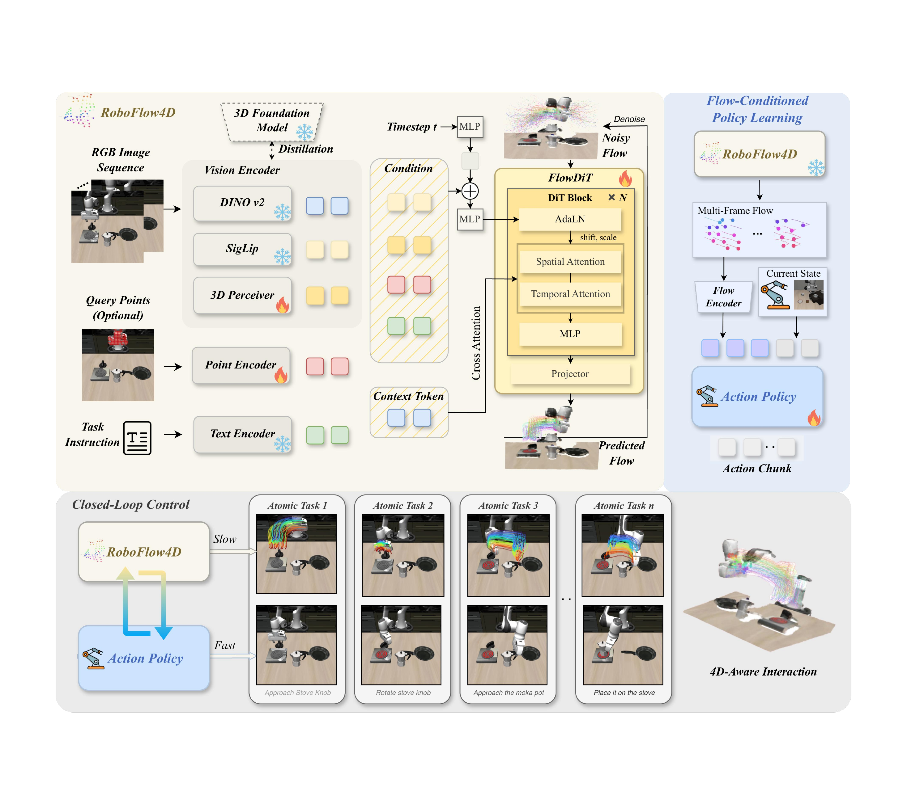
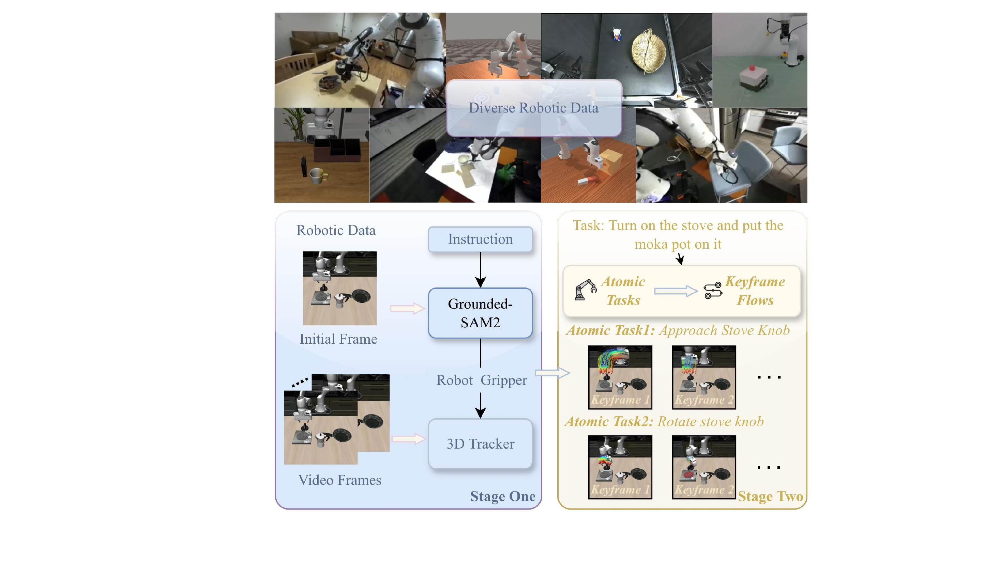
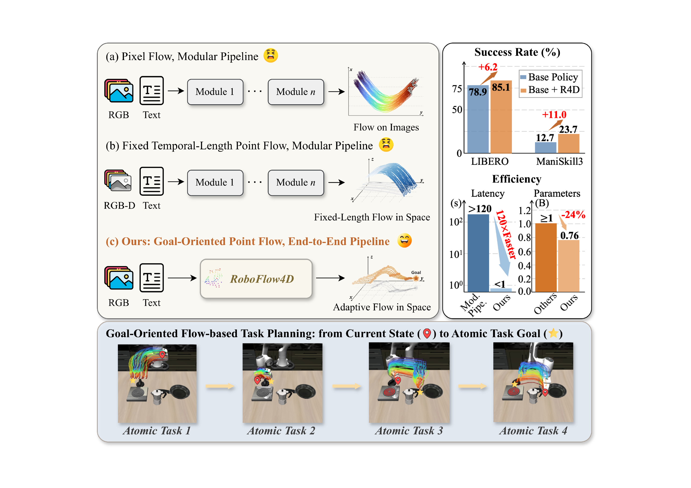
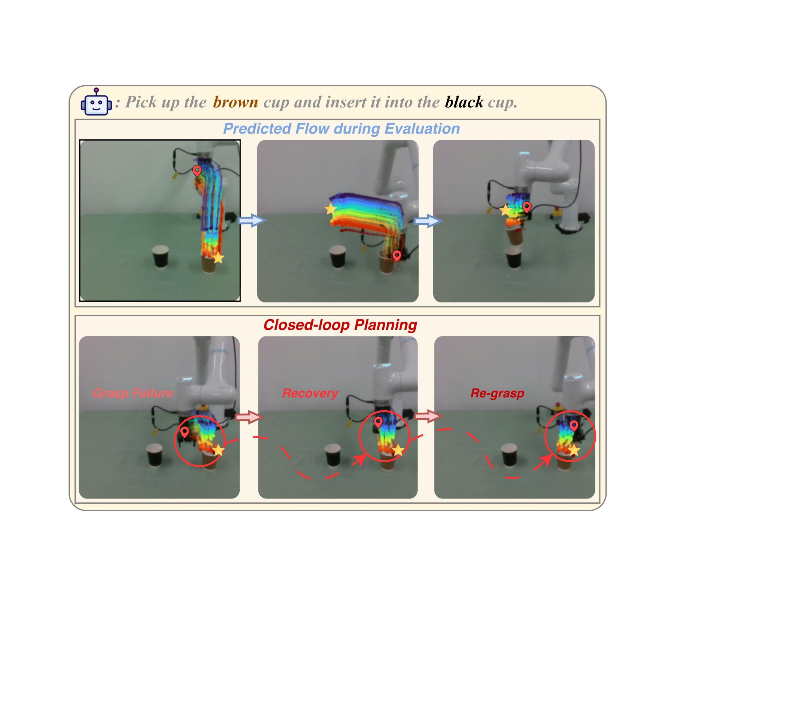

# RoboFlow4D: A Lightweight Flow World Model Toward Real-Time Flow-Guided Robotic Manipulation

#

# 基本信息

- arXiv: 2605.17522
- Authors: Sixu Lin, Junliang Chen, Huaiyuan Xu, Zhuohao Li, Guangming Wang, Yixiong Jing, Sheng Xu, Runyi Zhao, Brian Sheil, Lap-Pui Chau, Guiliang Liu
- Categories: cs.RO
- 一句话结论：提出了一种 0.76B 参数的端到端 4D 流世界模型，将 3D 流规划延迟从分钟级压缩至亚秒级，在仿真与真实机器人任务中显著提升了下游动作策略的成功率与执行效率。

#

# 研究问题

论文要解决的核心问题是：**如何在资源受限的机器人平台上实现实时、轻量且具备显式 3D 几何感知的流规划**。现有基于流的机器人操作方法大多采用级联式专家管道（如先视频生成、再深度估计、分割 grounding、2D 点跟踪，最后提升为 3D 流），导致端到端延迟高达数分钟，且 2D 像素流缺乏深度与几何信息，易产生物理不可行的运动。这与 VLA（Vision-Language-Action）、World Model 和 Embodied AI 密切相关——它试图构建一个轻量级的世界模型接口，为下游策略提供低延迟、高信息量的 4D 运动先验，而非直接端到端映射观测到动作。

#

# 任务与挑战

具体任务为：给定历史 RGB 图像序列、可选的 2D 查询点以及自然语言指令，模型需预测未来多帧 3D 点流（即 4D 时空流），并将其编码为条件，指导下游动作策略（如 Diffusion Policy 或 DiT Policy）生成机器人动作块。

主要挑战包括：
1. **实时性瓶颈**：级联模块化管道的推理延迟（3–11 分钟）无法满足真实机器人闭环控制需求。
2. **2D 到 3D 的歧义性**：从单目或有限视角 RGB 直接推断 3D 运动存在固有的几何歧义。
3. **长程时序稳定性**：长程操作任务若直接预测全程流，容易累积误差且训练困难。
4. **即插即用性**：流规划模块需与现有轻量策略兼容，不能引入过重的计算负担。

#

# 核心 Insight

现有方法将“感知—提升—规划”解耦为多个独立模块，不仅延迟高，而且误差会在模块间级联放大。RoboFlow4D 的核心思想是**将感知与规划统一为单一的端到端扩散 Transformer**，直接从 RGB 观测与语言指令预测目标导向的多帧 3D 流（4D 时空流）。它通过三项关键设计实现实时且轻量的 4D 规划：

1. **统一架构**：以 0.76B 参数的 FlowDiT 一次性完成多模态编码、3D 几何注入与流去噪，摒弃了级联专家模块，将规划延迟从分钟级压缩至亚秒级。
2. **目标导向的原子任务流**：基于夹爪开闭信号将长程演示自动分解为原子任务，并在每个原子任务内部通过非线性时间扭曲在目标附近密集采样关键帧，使流预测的长度与密度自适应于物理交互阶段。
3. **快慢闭环双系统**：将流世界模型作为低频“慢”规划器（约 0.68 s/次），动作策略作为高频“快”执行器（约 0.20 s/步，输出 20 步动作块），在原子任务边界处重新观测并触发重规划，形成观察-规划-执行闭环。



#

# 方法与公式

#

## 多模态编码与 3D 感知

RoboFlow4D 的输入为历史 RGB 图像序列 $\mathcal{I}=\{I_1,\dots,I_n\}$、可选 2D 查询点 $\mathcal{Q}\in\mathbb{R}^{m\times 2}$ 以及文本指令。视觉编码器使用 DINOv2 提取局部 patch token $T_{\mathrm{local}}$，使用 SigLIP 提取全局图像 token $T_{\mathrm{global}}$；局部 token 经可学习查询通过多头自注意力聚合为上下文 token $L$：

```math
L = \mathrm{MHA}(\mathrm{query}=Q_{\mathrm{local}},\ \mathrm{key}=T_{\mathrm{local}},\ \mathrm{value}=T_{\mathrm{local}})
\tag{1}
```

其中 $Q_{\mathrm{local}}$ 为零初始化的可学习查询，$L\in\mathbb{R}^{n_{\mathrm{local}}\times C}$。对于可选的 2D 查询点，Point Encoder 先通过 MLP 投影为点 token $T_{\mathrm{point}}$，再经 MHA 聚合为紧凑的机器人锚点嵌入 $Q$：

```math
Q = \mathrm{MHA}(\mathrm{query}=q_{\mathrm{point}},\ \mathrm{key}=T_{\mathrm{point}},\ \mathrm{value}=T_{\mathrm{point}})
\tag{2}
```

当未提供查询点时，$Q$ 设为零向量。为从 2D 观测注入 3D 几何先验，3D Perceiver 使用一组可学习的 3D 查询，通过 Resampler（堆叠交叉注意力与 FFN）从视觉上下文 $L$ 中聚合几何信息，再经 MLP 投影为 3D 条件 token $T_{\mathrm{3D}}$。该 token 通过对齐损失与冻结 VGGT 模型的特征对齐，强制模型学习 3D 结构感知。

#

## 数据生成与目标导向的监督构建

训练数据通过两阶段管道自动生成。第一阶段使用 Grounded-SAM2 在夹爪区域生成掩码，并用 SpatialTrackerV2 跟踪 3D 点轨迹；经三阶段过滤（去静态、去离群点、去过大位移）得到 gripper-centric 流。第二阶段根据夹爪开闭信号 $g_t$ 的二值化状态 $b_t=\mathbb{I}[g_t>0]$ 将长程轨迹切分为原子任务段 $\tau_i=[s_i,e_i]$。

在每个原子任务段内，模型不采用固定帧率采样，而是使用单调时间扭曲规则在目标附近密集采样 $K$ 个关键帧：

```math
u_k = \left(\frac{k}{K-1}\right)^{\gamma},\quad
t_k = \left\lfloor s_i + u_k\,(e_i-s_i)\right\rfloor
\tag{3}
```

其中 $\gamma>1$ 使采样点更集中于段末目标时刻。关键帧处的 3D 点位置构成语义 4D 流监督：

```math
\mathbf{x}_0[k,n] = \mathbf{P}_{t_k}[n], \qquad
\mathbf{x}_0 \in \mathbb{R}^{K\times N\times 3}
\tag{4}
```

这里 $\mathbf{P}_{t_k}[n]$ 表示第 $n$ 个跟踪查询点在关键帧 $t_k$ 的 3D 位置。



#

## FlowDiT 去噪网络与训练目标

FlowDiT 以 $N$ 个 DiT 块为骨干，接收带噪流 $\mathbf{x}_t$ 与多模态条件 $T_{\mathrm{cond}}=[G;T_{\mathrm{3D}};Q;T_{\mathrm{text}}]$（沿通道拼接），并通过 AdaLN 进行条件调制。每个 DiT 块将标准 MHA 替换为时空分解注意力：时间轴注意力跨帧、点轴注意力跨关键点，以降低计算复杂度；早期层还引入与视觉上下文 $L$ 的交叉注意力，稳定原子任务级别的流生成。

训练采用条件扩散框架。前向过程对真值流 $\mathbf{x}_0$ 加噪：

```math
\mathbf{x}_t = \sqrt{\bar{\alpha}_t}\,\mathbf{x}_0 + \sqrt{1-\bar{\alpha}_t}\,\boldsymbol{\epsilon},
\quad \boldsymbol{\epsilon}\sim\mathcal{N}(\mathbf{0},\mathbf{I})
\tag{5}
```

其中 $\bar{\alpha}_t$ 为噪声调度累积系数。网络使用稳定的 $v$-prediction 参数化：

```math
\mathbf{v}_t = \sqrt{\bar{\alpha}_t}\,\boldsymbol{\epsilon} - \sqrt{1-\bar{\alpha}_t}\,\mathbf{x}_0
\tag{6}
```

训练网络 $\mathbf{v}_\theta(\mathbf{x}_t,t,\mathbf{c},\mathbf{m})$ 预测 $\mathbf{v}_t$，其中 $\mathbf{c}$ 为条件、$\mathbf{m}$ 为上下文。推理时采用分类器自由引导（CFG）：

```math
\hat{\mathbf{v}}_\theta
=
(1+w)\,\mathbf{v}_\theta(\mathbf{x}_t,t,\mathbf{c})
-
w\,\mathbf{v}_\theta(\mathbf{x}_t,t,\varnothing)
\tag{7}
```

$w$ 为引导尺度，$\varnothing$ 表示丢弃条件。

整体训练目标由三项损失组成：

**扩散去噪损失**采用可见性加权均方误差：

```math
\mathcal{L}_{\mathrm{diff}}=
\mathbb{E}_{t,\boldsymbol{\epsilon}}
\left[
\frac{1}{\sum_{k,n} w_{k,n}}
\sum_{k=1}^{K}\sum_{n=1}^{N}
w_{k,n}
\left\lVert
\mathbf{v}_\theta(\mathbf{x}_t,t,\tilde{\mathbf{c}},\mathbf{m})[k,n]
-
\mathbf{v}_t[k,n]
\right\rVert_2^2
\right]
\tag{8}
```

$w_{k,n}\in[0,1]$ 降低被遮挡或低置信度点的权重。

**3D 对齐损失**将 3D Perceiver 输出的条件特征 $\mathbf{c}_{\mathrm{3D}}$ 经可学习投影器 $g_\phi$ 与冻结 VGGT 教师特征 $\mathbf{h}$ 对齐：

```math
\mathcal{L}_{\mathrm{align}}
=
\left\lVert g_{\phi}(\mathbf{c}_{\mathrm{3D}}) - \mathbf{h} \right\rVert_2^2
\tag{9}
```

**时序平滑损失**对去噪后的流 $\hat{\mathbf{x}}_0$ 施加二阶时序差分的 Charbonnier 惩罚，保证轨迹连贯：

```math
\Delta^2 \hat{\mathbf{x}}_0[k,n]
=
\hat{\mathbf{x}}_0[k+1,n] - 2\hat{\mathbf{x}}_0[k,n] + \hat{\mathbf{x}}_0[k-1,n]
\tag{10}
```

```math
\mathcal{L}_{\mathrm{smooth}}
=
\frac{1}{\sum_{k,n} w_{k,n}}
\sum_{k=2}^{K-1}\sum_{n=1}^{N}
w_{k,n}
\sqrt{\left\lVert\Delta^2 \hat{\mathbf{x}}_0[k,n]\right\rVert_2^2 + \epsilon^2}
\tag{11}
```

总损失为：

```math
\mathcal{L}
=
\mathcal{L}_{\mathrm{diff}}
+
\lambda_{\mathrm{align}}\,\mathcal{L}_{\mathrm{align}}
+
\lambda_{\mathrm{smooth}}\,\mathcal{L}_{\mathrm{smooth}}
\tag{12}
```

其中 $\lambda_{\mathrm{align}}$ 与 $\lambda_{\mathrm{smooth}}$ 为标量权重。

#

## 流条件策略与闭环推理

在推理阶段，RoboFlow4D 作为低频“慢”规划器输出多帧 3D 流计划 $\mathcal{F}\in\mathbb{R}^{n_{\mathrm{kp}}\times K\times 3}$。Flow Encoder 先通过 MLP 提取关键点特征：

```math
F_{\mathrm{kp}} = \mathrm{MLP}(\mathcal{F})
\tag{13}
```

再经注意力池化聚合为全局流条件：

```math
f_{\mathrm{flow}} = \mathrm{AttnPool}(F_{\mathrm{kp}})
\tag{14}
```

最终与当前状态（视觉-语言+本体感知）编码的基条件 $f_{\mathrm{base}}$ 拼接，形成策略输入：

```math
f_{\mathrm{cond}} = \left[ f_{\mathrm{base}} \Vert f_{\mathrm{flow}} \right]
\tag{15}
```

动作策略（如 Diffusion Policy 或 DiT Policy）在冻结的 RoboFlow4D 指导下生成动作块。系统采用快慢双频协作：RoboFlow4D 约每 0.68 s 重规划一次流先验，动作策略约每 0.20 s 执行一步并输出 $H=20$ 步的动作块；每完成一个原子任务后重新观测并触发下一次规划，形成闭环。

#

# 贡献拆解

1. **端到端轻量级 4D 流世界模型**：RoboFlow4D 以单一 0.76B 参数网络统一感知与规划，直接输出 4D 时空流，摒弃了级联专家模块。相比 Dream2Flow（3–11 分钟）与 NovaFlow（约 2 分钟）的模块化管道，它将规划延迟降至 0.68 秒，实现约 120 倍加速，同时模型规模较其他流模型减少 24% 以上。
2. **目标导向的原子任务流预测机制**：基于夹爪开闭信号自动分解长程任务为原子任务，并通过非线性时间扭曲在目标时刻附近密集采样关键帧。这种自适应时域监督使模型更关注交互关键阶段，避免了固定长度流预测在长程任务中的不稳定问题。
3. **快慢双系统闭环控制架构**：将流世界模型作为低频“慢”规划器，动作策略作为高频“快”执行器，通过观察-规划-执行闭环实现实时且资源高效的操作。该架构不仅降低了推理延迟，还赋予了系统在失败时（如抓取滑脱）通过重规划恢复的能力。
4. **系统性的跨仿真与真实世界验证**：在 LIBERO、ManiSkill3 及真实 ROKAE 机械臂上验证了即插即用性。实验严格隔离了流规划模块与下游策略的增益，证明显式 3D 流先验对多种策略（DP/DiT）均具有通用提升作用。

#

# 关键图表解读



**图：三种流设计范式对比及主实验结果**

这张图分为左右两部分。左侧通过三种范式的系统级对比，直观展示了 RoboFlow4D 的差异化设计：(a) Pixel Flow 在图像空间做模块化流水线，缺乏 3D 几何；(b) Fixed-Length Point Flow 虽在 3D 空间预测，但仍依赖模块化管道且时间长度固定；(c) RoboFlow4D 以端到端统一网络直接输出目标导向的自适应 3D 流。右侧柱状图给出了主实验的核心效率指标：在 LIBERO 上 Base Policy + R4D 相比 Base Policy 提升 6.2%，在 ManiSkill3 上提升 11.0%；延迟方面，模块化管道大于 120 s，而 RoboFlow4D 小于 1 s，实现约 120 倍加速；参数量方面，RoboFlow4D 仅 0.76 B，比其他流模型减少 24%。读图时应注意，成功率提升在困难任务（ManiSkill3）上更为显著，而在简单任务上边际收益递减。



**图：真实世界评估中的预测流与闭环失败恢复案例**

这张图定性展示了真实世界评估中 RoboFlow4D 的预测流与闭环恢复能力。上半部分显示针对指令"Pick up the brown cup and insert it into the black cup"，模型为连续原子任务预测了从当前状态（红色定位标记）到目标（黄色星标）的 3D 流。下半部分展示了闭环规划的关键价值：当发生 Grasp Failure 时，系统通过重新观测当前状态，生成 Recovery 流计划，引导策略完成 Re-grasp。该图直接支撑了"快慢闭环控制能够在执行失败时通过重规划恢复"的论点。读图时需注意，流的色彩编码表示时序进展，且重规划完全基于当前视觉观测，无需人工干预。

#

# 实验与消融

**数据集与设定**：
- **LIBERO**： lifelong 学习基准，含 5 个套件共 130 个任务，评估空间泛化（Spatial）、物体泛化（Object）、目标泛化（Goal）与长程任务（Long）。使用第三视角与腕部相机双视角输入。
- **ManiSkill3**：单视角困难设置，聚焦 PushCube、PickCube、StackCube 三项操作，每任务 100 条运动规划演示。
- **真实世界**：ROKAE 六轴机械臂 + JODELL 夹爪，使用 RealSense D435（第三视角+腕部）。4 项任务（Pick-and-Place、Stack、Assemble、Drawer），每任务 50 条遥操作演示，初始状态在 ±2 cm 范围内随机。

**基线与指标**：
- 仿真中与 VLA 模型（Octo、CogACT、OpenVLA、TraceVLA、SpatialVLA、4D-VLA）及轻量策略（BC、ACT、DP、DiT）对比。
- 真实世界中与 $\pi_0$、$\pi_0$-Fast 对比。
- 指标包括成功率（Success Rate, %）、任务完成时间（Completion Time, s）以及 3D L2 误差（用于模块消融）。

**主结果**：
- **LIBERO**：DP 接入 RoboFlow4D 后平均成功率从 78.9% 提升至 85.1%（+6.2%）；DiT 从 83.7% 提升至 87.7%（+4.0%），在 Spatial 与 Long 套件上提升尤为明显。
- **ManiSkill3**：DP 平均提升 9.7%（12.3% → 22.0%）；DiT 平均提升 11.0%（12.7% → 23.7%）。
- **真实世界**：DP 平均成功率提升 12.5%，DiT 提升 11.3%；任务完成时间分别平均缩短 1.4 s 与 1.2 s。DiT + RoboFlow4D 达到 43.8% 平均成功率与 38.3 s 平均耗时，优于 $\pi_0$ 的 41.3% 与 40.7 s。

**消融实验**：
- **模块消融**（LIBERO 评估集 3D L2 误差）：完整模型误差为 0.0142。移除 Context Token 升至 0.0152，移除 Query Points 升至 0.0158，移除 3D Alignment 升至 0.0160，验证了每个模块对 4D 预测精度的贡献。
- **快慢频率消融**（LIBERO-10）：在快系统每执行 $r\in\{4,2,1\}$ 步后触发一次慢系统更新的设定下，DP 与 DiT 的成功率保持稳定（DP 约 71–72%，DiT 约 74.6–75.2%），证明双系统对更新频率不敏感，具备良好的部署灵活性。

**最强证据与最存疑证据**：
- **最强证据**：ManiSkill3 单视角困难设置下，DiT 基线平均成功率仅为 12.7%，接入 RoboFlow4D 后提升至 23.7%（+11.0%）。该场景空间线索极度匮乏，基线几乎失效，而显式 3D 流规划使成功率接近翻倍，最能体现其核心价值。
- **最存疑证据**：在 LIBERO-Object 套件上，DiT 基线已高达 96.3%，接入 RoboFlow4D 后仅提升至 97.0%（+0.7%）。该任务本身较为简单且基线接近饱和，流规划的边际增益极小，难以证明在此类场景中的必要性。

#

# 局限性

1. **真实世界实验规模有限**：仅包含 4 个桌面操作任务，每任务约 20 次试验，且初始状态随机范围仅 ±2 cm。统计显著性与复杂开放环境的泛化性声明受限。
2. **原子任务分解强依赖夹爪状态**：该机制对于无夹爪或夹爪状态不明确的本体（如多指灵巧手、推杆、软体操作器）适用性未验证，限制了方法的一般性。
3. **缺乏误差传播的系统性分析**：论文未深入剖析流预测误差（如 3D 位置偏差）如何具体导致动作执行失败，也未提供定量的事故归因或不确定性估计。
4. **动态与遮挡场景验证不足**：实验主要在受控的桌面环境中进行，对于高度动态、严重遮挡或开放域长程任务的鲁棒性尚未充分探索。

#

# 个人研究判断

面向"World Models assisting Embodied AI downstream tasks"的研究方向，**这篇论文值得继续追踪**。

理由如下：RoboFlow4D 首次在 3D 流规划领域实现了端到端轻量级实时化，为 World Model 与下游策略的协作提供了可落地的即插即用接口。它证明了显式 4D 流作为运动先验在单视角、空间线索匮乏场景下具有显著价值，且其快慢双系统设计为资源受限的机器人平台提供了可行的部署范式。这些特性对 VLA 架构中"何时需要显式规划器"以及 sim-to-real 迁移中的低延迟适配均有直接参考价值。

然而，需警惕其任务分解假设（强依赖夹爪状态）带来的通用性边界，以及真实世界验证规模较小的问题。后续研究可重点关注：不依赖夹爪信号的通用视觉任务分解方法、流预测的不确定性量化与安全回退机制，以及向非夹爪操作器和更复杂开放域任务的扩展。
