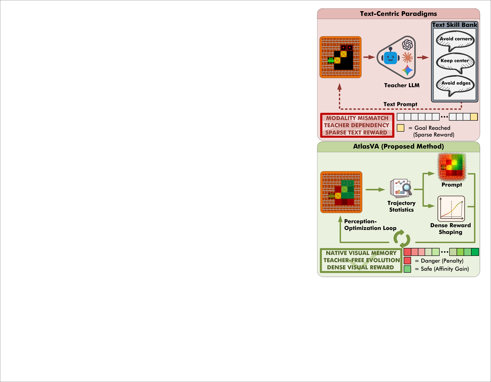
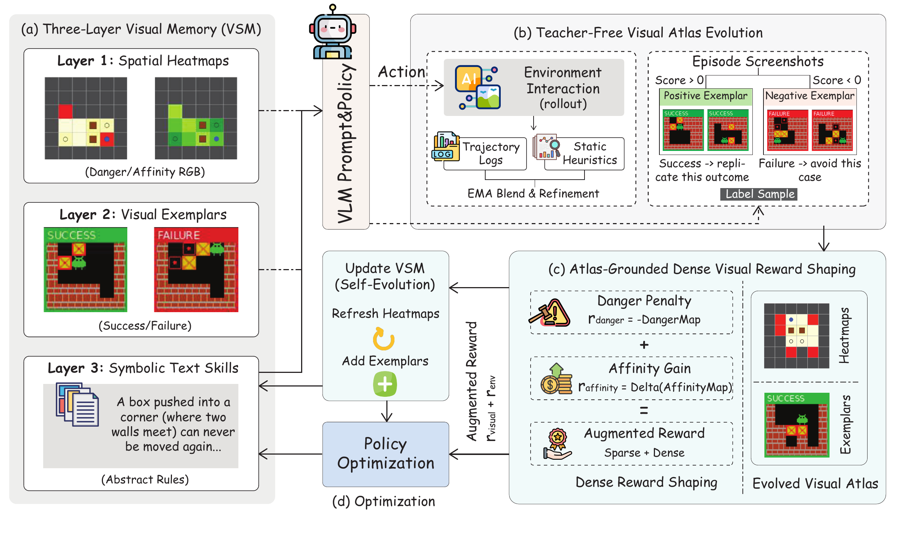
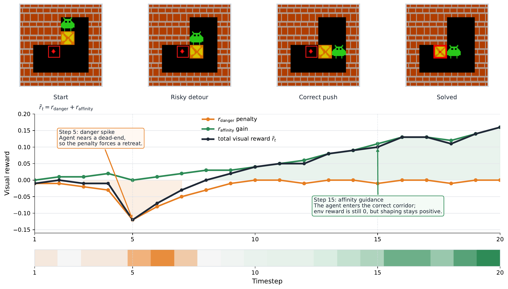
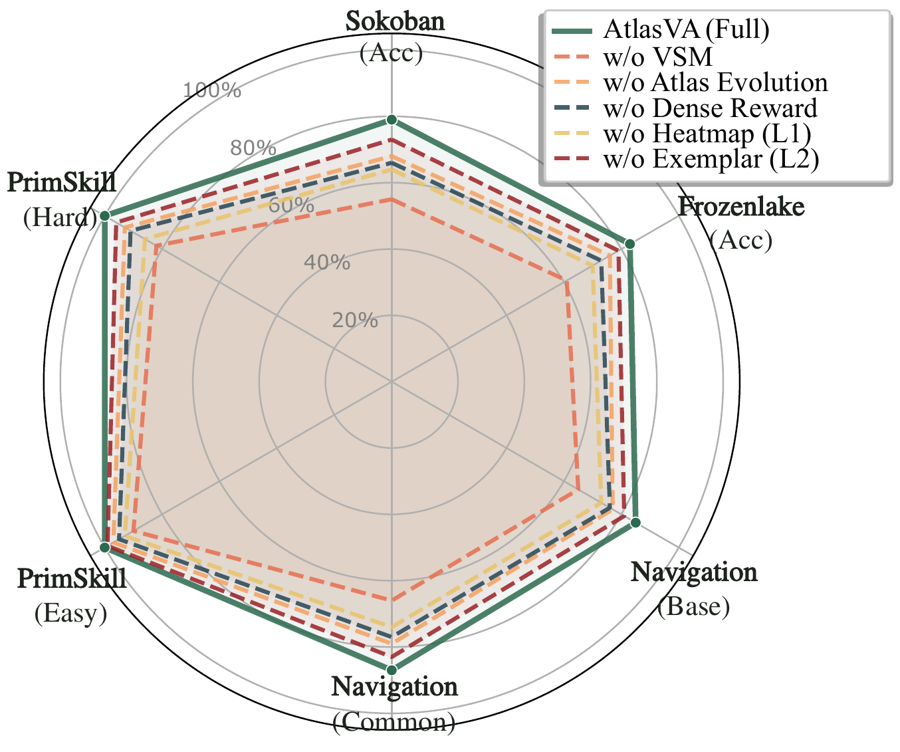

# AtlasVA: Self-Evolving Visual Skill Memory for Teacher-Free VLM Agents

#

# 基本信息

- **arXiv**: 2605.17933
- **Authors**: Pan Wang, Yihao Hu, Xiujin Liu, Jingchu Yang, Hang Wang, Zhihao Wen
- **Categories**: cs.CV
- **一句话结论**: 本文提出 AtlasVA，一种完全无需外部教师监督的三层视觉技能记忆框架，通过自进化空间热图与基于势函数的密集视觉奖励塑形，使 3B 参数的 VLM 智能体在空间密集型任务上达到平均成功率 0.93，显著超越 GPT-5 与 o3 等专有模型。

#

# 研究问题

现有视觉-语言模型（VLM）智能体在长程空间决策任务中普遍采用文本中心记忆范式：将历史经验压缩为自然语言规则，并依赖专有教师 LLM 进行总结与精炼。这种设计在推箱子（Sokoban）、冰湖（FrozenLake）、三维具身导航及机器人操作等空间密集型任务中面临根本性失配：二维几何拓扑被压缩为一维文本导致严重的模态错位（modality mismatch）；外部教师依赖破坏了自主进化的闭环；稀疏的终端奖励无法提供坐标级密集反馈，加剧了信用分配困难。本文的核心问题是：**如何在不依赖外部教师模型的情况下，让 VLM 智能体在原生视觉模态中存储、进化并复用空间经验，从而替代有损的文本翻译与稀疏反馈？**

#

# 任务与挑战

论文评估的任务覆盖离散网格世界与连续三维空间：

- **Sokoban / FrozenLake**：2D 离散网格谜题，要求智能体在推箱子或避陷阱时进行长程拓扑规划；
- **3D Embodied Navigation**：基于 AI2-THOR 的连续空间导航，需处理障碍物规避与目标朝向；
- **PrimitiveSkill（ManiSkill3）**：3D 桌面机器人操作，包括 Place、Stack、Drawer、Align 及 Swap 等多回合细粒度操控。

输入为环境渲染的 RGB 帧与语言任务描述，输出为离散动作。训练采用 PPO + GAE，环境仅提供稀疏二值奖励 $r^{env} \in \{0, 1\}$。已有方法（如 VAGEN）虽引入记忆增强 RL，但仍以文本记忆为主，无法避免几何信息损失；而 GPT-5、o3 等专有模型虽参数规模巨大，却缺乏持续的空间先验积累机制，在 Sokoban 等任务上成功率不足 0.70。

#

# 核心 Insight

AtlasVA 的核心洞察是：**可复用的空间经验应当保留在 VLM 的原生视觉模态内，而非被翻译为文本。** 为此，作者提出视觉技能记忆（Visual Skill Memory, VSM）的三层层次结构：L1 空间热图（危险图与亲和图）直接以 RGB 形式注入 VLM 视觉编码器，避免了几何拓扑的有损压缩；L2 视觉范例提供具体的历史关键帧作为少样本参考；L3 符号文本保留高层规则。更重要的是，AtlasVA 完全通过轨迹统计自举（bootstrapping）来进化 L1 与 L2，无需调用外部教师 LLM，从而将“感知—记忆—优化”统一为自主闭环。



如上图所示，传统范式（Text-Centric Paradigms）将观察输入教师 LLM，输出文本技能库，再经文本提示反馈给策略，存在三重瓶颈。AtlasVA 则直接在视觉模态中构建自进化的空间图谱（Visual Atlas），并将其同时用于上下文提示（作为 VLM 的辅助视觉输入）与密集奖励塑形（作为 RL 的动态势函数），实现了真正的视觉 grounded 自主进化。



整体架构如上图所示：(a) 三层 VSM 以多模态提示形式注入策略；(b) 通过环境交互轨迹与静态启发式进行无教师图谱演化；(c) 将进化后的空间先验转化为密集奖励；(d) 策略优化产生更高质量轨迹，反过来刷新 VSM，形成闭环。

#

# 方法与公式

AtlasVA 将标准 POMDP 扩展为带动态视觉记忆的决策过程。设标准 POMDP 为 $\langle \mathcal{S}, \mathcal{A}, \mathcal{O}, \mathcal{T}, \mathcal{R}, \gamma \rangle$，其中观察 $o_t$ 为 RGB 帧，奖励 $r^{env}_t \in \{0, 1\}$ 极度稀疏。

**增强观察空间。** 策略不再仅依赖原始观察 $o_t$，而是接收增强的多模态提示：

```math
\tilde{o}_t = \langle o_t,\, \mathcal{M}_{k}^{(heatmap)},\, \mathcal{M}_{k}^{(exemplar)},\, \mathcal{M}_{k}^{(text)} \rangle
```

其中 $\mathcal{M}_{k}$ 表示第 $k$ 个训练周期时三层 VSM 的状态。L1 热图 $\mathcal{M}_{k}^{(heatmap)}$ 包含危险图（Danger Map，红色通道）与亲和图（Affinity Map，绿色通道），以独立 RGB 图像 token 注入，避免与前景物体混淆；L2 范例池通过冻结的 DINOv2 编码器提取特征，按余弦相似度检索 top-$k$ 相关历史帧；L3 文本规则直接取自环境规则书，无需教师 LLM 生成。

**无教师图谱演化（Teacher-Free Atlas Evolution）。** 训练时，AtlasVA 利用模拟器提供的 privileged `GridState` 获取主操作实体坐标 $\mathbf{p}_t$（仅用于训练，评估时不使用）。对当前批次轨迹，分别提取失败轨迹集 $\mathcal{T}_{fail}$ 与成功轨迹集 $\mathcal{T}_{succ}$，构造批次级统计图：

```math
M_{batch}^{danger}(\mathbf{p}) = \frac{1}{|\mathcal{T}_{fail}|} \sum_{\tau \in \mathcal{T}_{fail}} \mathbb{I}(\mathbf{p}_T = \mathbf{p})
\tag{1}
```

```math
M_{batch}^{affinity}(\mathbf{p}) = \frac{1}{|\mathcal{T}_{succ}|} \sum_{\tau \in \mathcal{T}_{succ}} \sum_{\mathbf{p} \in \tau} \frac{\mathbb{I}(\mathbf{p}_t = \mathbf{p})}{|\tau|}
\tag{2}
```

式 (1) 将失败轨迹的终点坐标累积为危险图；式 (2) 将成功轨迹的访问频率按路径长度归一化后累积为亲和图。随后通过指数移动平均（EMA）更新历史统计：

```math
M_{stat} \leftarrow \alpha \, M_{stat} + (1 - \alpha) \, M_{batch}
\tag{3}
```

其中 $\alpha = 0.85$ 为衰减率。最终热图融合静态网格启发式 $M_{heuristic}$（BFS 距离场、角点陷阱检测等）与 EMA 统计，并通过退火系数 $\beta_k \in [0,1]$ 实现从冷启动到经验驱动的平滑过渡：

```math
M_{final} = (1 - \beta_k) \, M_{heuristic} + \beta_k \, M_{stat}
\tag{4}
```

$\beta_k$ 随训练周期从 $0$ 退火至 $1$，早期依赖静态几何安全探索，后期转向数据驱动的经验细化。

**基于图谱的密集视觉奖励塑形（Atlas-Grounded Dense Visual Reward Shaping）。** 为缓解稀疏奖励瓶颈，AtlasVA 将自进化热图同时解析为基于势函数的塑形奖励。定义视觉势场 $\Phi$ 直接由亲和图导出，则塑形项 $F$ 为：

```math
\tilde{r}_t = r^{env}_t + F(o_t, a_t, o_{t+1})
\tag{5}
```

```math
F(o_t, a_t, o_{t+1}) = \big[\Phi_{\mathrm{affinity}}(o_{t+1}) - \Phi_{\mathrm{affinity}}(o_t)\big] - \beta \cdot \mathbb{I}(\mathrm{enters\_danger}(o_{t+1}))
\tag{6}
```

其中 $\Phi_{\mathrm{affinity}}(o_t)$ 评估当前位置在亲和图上的势值，其基线层包含 BFS 距离梯度，因此向目标靠近时差分为正，远离时为负。危险惩罚项 $\mathbb{I}(\mathrm{enters\_danger})$ 在智能体进入历史死锁区域时触发负向惩罚，作为启发式安全约束（故意非势函数基，以优先选择安全路径）。在实际实现中，总视觉奖励写作：

```math
r_{visual} = \lambda_{\mathrm{affinity}} \cdot r_{affinity} + \lambda_{\mathrm{danger}} \cdot r_{danger}
\tag{7}
```

```math
r_{affinity} = M_{final}^{affinity}(\mathbf{p}_{t+1}) - M_{final}^{affinity}(\mathbf{p}_{t})
\tag{8}
```

```math
r_{danger} = -M_{final}^{danger}(\mathbf{p}_{t+1})
\tag{9}
```

式 (8) 为亲和增益，式 (9) 为危险惩罚。最终优化奖励为 $r^{env}_t + r_{visual}$，不同任务中 $\lambda$ 的取值不同（如 Sokoban 为 0.05，PrimitiveSkill 为 0.3）。



上图展示了在 Sokoban 单条轨迹中，危险惩罚（橙色）在智能体接近死胡同时产生尖锐负向信号，强制其回撤；亲和增益（绿色）在智能体进入正确通道时提供持续正向引导。即使环境稀疏奖励仍为 0，视觉塑形奖励已能提供密集的坐标级梯度，显著改善信用分配。

**闭环优化。** 策略网络采用 Qwen2.5-VL-3B-Instruct，经 PPO 更新后产生更高质量轨迹；这些轨迹通过 EMA 刷新热图与范例池，热图反过来提供更准确的势函数与观察增强，形成自举（self-bootstrapping）循环。

#

# 贡献拆解

1. **原生视觉化的三层技能记忆（VSM）**  
   做了什么：将空间经验以 RGB 热图、视觉范例与符号文本的层次结构存储，并直接作为视觉 token 注入 VLM。  
   为什么有效：避免了文本翻译导致的几何信息损失，使 VLM 能利用预训练视觉编码器进行零样本空间模式匹配。  
   与已有方法差别：VAGEN 等基线仅依赖文本记忆；AtlasVA 首次系统性地将 VLM 智能体的可复用记忆迁移到原生视觉模态。

2. **完全无教师的空间图谱自进化机制**  
   做了什么：仅通过环境交互轨迹统计（失败终点累积危险图、成功路径频率累积亲和图）与轻量级网格启发式，以 EMA 自举更新空间先验。  
   为什么有效：消除了对专有教师 LLM 的 API 调用依赖，降低计算成本，同时保证记忆随策略改进持续进化。  
   与已有方法差别：Reflexion、ExpeL、SkillRL 等框架依赖外部 LLM 总结或精炼记忆；AtlasVA 的演化完全内嵌于 RL 训练循环，无需外部监督。

3. **视觉势场驱动的密集奖励塑形**  
   做了什么：将自进化热图同时解析为基于势函数的亲和增益与启发式危险惩罚，把稀疏环境奖励转化为密集坐标级优化信号。  
   为什么有效：Potential-Based Reward Shaping 保证了策略最优性不变（亲和分支），而危险惩罚提供了额外的安全约束；两者结合显著缓解了长程稀疏奖励任务中的样本效率瓶颈。  
   与已有方法差别：传统 PBRS 依赖手工设计的势函数；AtlasVA 的势场是自学习的视觉图谱，自动适应不同环境布局。

#

# 关键图表解读

**图 1：AtlasVA 整体架构（figure-001-arch.png）**  
该图系统阐述了 AtlasVA 的四大核心组件与数据流。(a) 三层 VSM 展示了 L1 空间热图（Danger/Affinity RGB）、L2 视觉范例（Success/Failure 帧）与 L3 符号文本（抽象规则）如何共同构成增强提示。(b) 无教师图谱演化揭示了轨迹日志与静态启发式通过 EMA 融合刷新热图、挖掘范例的离线过程。(c) 密集奖励塑形将热图分解为危险惩罚与亲和增益，补充稀疏环境奖励。(d) 优化闭环显示策略改进与记忆演化之间的双向反馈。读图时应注意：热图与范例仅在训练环境演化，验证时完全隔离，确保零样本泛化评估的公平性。

**图 2：范式对比（figure-004-teaser.png）**  
上图以极简方式揭示了论文的动机与核心创新。上半部分（Text-Centric Paradigms）指出教师 LLM + 文本技能库的三重缺陷：模态错位、教师依赖、稀疏文本奖励。下半部分（AtlasVA）展示原生视觉记忆、无教师演化与密集视觉奖励如何一一对应解决上述问题。该图的关键在于强调 AtlasVA 并非简单增加一个记忆模块，而是将记忆模态从文本“迁移”到视觉，从而统一了感知与记忆的表示空间。

**图 3：消融实验雷达图（figure-006-radar-ablation.png）**  
雷达图在六个任务维度（Sokoban、FrozenLake、Navigation Base/Common、PrimSkill Easy/Hard）上同时对比完整模型与五种消融变体。完整模型（AtlasVA Full）在所有维度上均占据最外层。移除整个 VSM（w/o VSM）导致空间密集型任务（如 Sokoban、FrozenLake）性能断崖式下跌，验证了几何信息必须保留在视觉模态；移除图谱演化（w/o Atlas Evolution）使模型退化为静态启发式，性能全面退化；移除密集奖励（w/o Dense Reward）则让长程任务收敛困难。值得注意的是，单独移除热图（w/o Heatmap, L1）或范例（w/o Exemplar, L2）均造成明显性能损失，说明两层视觉记忆互补，缺一不可。



**图 4：Sokoban 轨迹奖励瀑布（figure-009-trajectory-reward-sokoban.png）**  
该图以具体游戏轨迹为例，直观证明自进化图谱如何提供细粒度视觉引导。上方四帧显示智能体从起点出发，经历危险绕行（Risky detour），最终正确推箱并求解。下方曲线分解了各时间步的 $r_{danger}$、$r_{affinity}$ 与总奖励 $\tilde{r}_t$。Step 5 附近，智能体接近死胡同，危险惩罚产生尖锐负峰，强制策略回撤；Step 15 后进入正确通道，亲和增益持续为正，即使环境奖励仍为 0，塑形奖励已提供明确优化方向。底部色带进一步可视化整条轨迹的奖励极性（橙=危险，绿=亲和）。读图时应注意：该案例同时验证了危险惩罚的“纠错”功能与亲和增益的“导航”功能，两者协同避免了局部最优。

#

# 实验与消融

**数据集与设定。** 实验覆盖 2D 离散网格（Sokoban、FrozenLake）、3D 具身导航（AI2-THOR）及 3D 机器人操作（PrimitiveSkill via ManiSkill3，含 Place、Stack、Drawer、Align 及新增的 Swap 任务）。基座模型为 Qwen2.5-VL-3B-Instruct，使用 PPO + GAE 训练，批次大小 128。所有记忆组件仅在训练环境演化，验证集严格隔离。

**基线与指标。** 对比了 GPT-5、o3、o4-mini、GPT-4o、Gemini 系列、Claude Sonnet 系列等专有模型，以及 Qwen2.5-VL-72B/7B/3B、VLM-R1-3B、VAGEN 等开源基线。指标为任务成功率。

**主结果。** AtlasVA（3B）平均成功率达 0.93，显著超越 GPT-5（0.69）、o3（0.71）及最强开源基线 VAGEN（0.78）。在 Sokoban 上，零样本 Qwen2.5-VL-3B 仅 0.14，AtlasVA 提升至 0.79；在 PrimitiveSkill 全部五项操作任务上达到 1.00，而 GPT-5 在 Drawer 任务上为 0.00。3D 导航平均成功率 0.86。这些结果强有力地证明：小模型 + 视觉记忆可以在空间密集型任务上击败大模型 + 文本记忆。

**消融实验。** 雷达图（figure-006-radar-ablation.png）显示：
- **w/o VSM**：性能全面崩溃，尤其在 Sokoban 与 FrozenLake 上，证明文本中心记忆无法承载几何拓扑；
- **w/o Atlas Evolution**：热图退化为静态启发式，跨任务性能下降，证明数据驱动的 EMA 演化至关重要；
- **w/o Dense Reward**：长程任务收敛缓慢，证明密集视觉奖励对信用分配的关键作用；
- **w/o Heatmap (L1)** 与 **w/o Exemplar (L2)**：单独移除任一层均导致性能损失，验证了三层结构的互补性。

**最强证据。** Sokoban 上 0.14 → 0.79 的提升与 PrimitiveSkill 五项 1.00 的完美成功率，最直接支撑了“视觉记忆替代文本记忆”的核心论点。

**最存疑证据。** PrimitiveSkill 的 Drawer 任务中 GPT-5 与 o3 成功率均为 0.00，与 AtlasVA 的 1.00 差距过于悬殊。该异常可能部分源于专有模型对特定动作格式或 API 调用的敏感性，而非纯粹的空间推理缺陷，论文未对此基线失败模式进行深入诊断。此外，不同任务的奖励权重 $\lambda$ 差异较大（Sokoban 0.05 vs. PrimitiveSkill 0.3），但论文未提供系统的超参选择方法论，仅给出经验值。

#

# 局限性

1. **3D 空间投影的维度损失。** 3D 操作任务依赖 `GridState` 将连续空间投影为 2.5D 网格（x-y 平面离散化 + z 轴元数据）。这种降维难以处理高度遮挡、 ego-centric 视角或复杂 3D 交互的真实机器人场景，论文在结论中已明确承认。
2. **静态文本层未协同演化。** L3 符号文本技能在整个训练过程中保持静态，直接取自环境规则书，未与视觉层（L1、L2）共同进化。其最优融合比例或动态权重机制尚未探索。
3. **超参数敏感性与任务依赖性。** 危险/亲和奖励权重 $\lambda$ 在不同任务间差异显著，且 EMA 衰减率 $\alpha$、范例池容量等超参缺乏跨任务的自动适配机制，限制了即插即用的泛化性。
4. **基线诊断不足。** 专有模型在部分操作任务上的 0.00 成功率可能包含提示工程或动作解析格式因素，论文未对失败模式进行归因分析，使得“小模型击败大模型”的结论在空间推理之外的其他干扰因素上略显绝对。

#

# 个人研究判断

面向 **“World Models assisting Embodied AI downstream tasks”** 的研究方向，AtlasVA 值得持续追踪，理由如下：

- **视觉记忆与 World Model 的天然接口。** AtlasVA 的自进化热图本质上是一种轻量级的 2.5D 空间 World Model，记录了环境的危险与亲和统计。未来可将其与真正的 3D 神经场（NeRF / 3D Gaussian Splatting）结合，摆脱 2.5D 投影限制，构建可预测未来状态转移的完整视觉世界模型。
- **样本高效的机器人策略学习。** 论文证明，通过视觉势场提供密集奖励，3B VLM 即可在 3D 操作任务上达到完美成功率。这对资源受限的真实机器人部署具有直接借鉴意义：无需调用昂贵的大模型 API，仅通过环境交互自举即可实现高效策略优化。
- **VLA 架构设计的范式启示。** AtlasVA 提示我们，VLA（Vision-Language-Action）模型的记忆不应局限于文本，而应充分利用视觉编码器的原生能力。后续研究可探索 VSM 与 Transformer 记忆机制（如在线提示学习、视觉 token 压缩）的深度融合，以及 L3 文本层与视觉层的动态协同演化。

然而，若研究目标是高度动态、非结构化、遮挡严重的真实世界机器人任务，则需注意 AtlasVA 当前的 2.5D 网格抽象与 privileged state 依赖可能构成瓶颈。建议在其基础上引入点云或神经辐射场表示，并开发任务自适应的奖励权重元学习机制，以进一步逼近通用具身智能。
