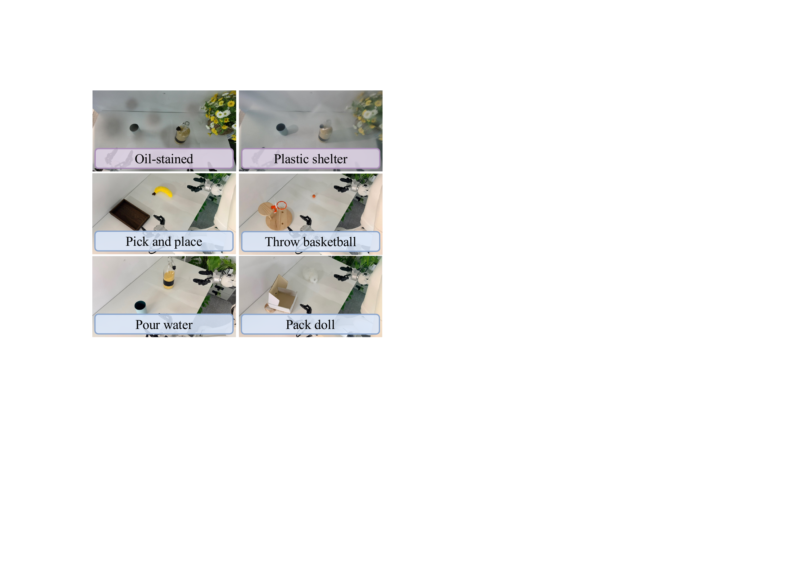
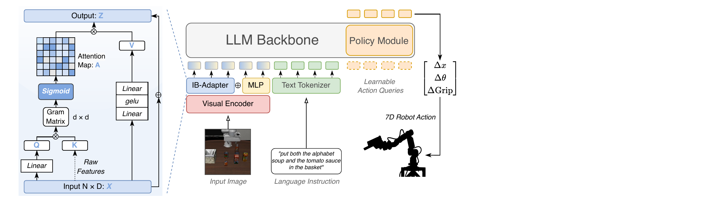
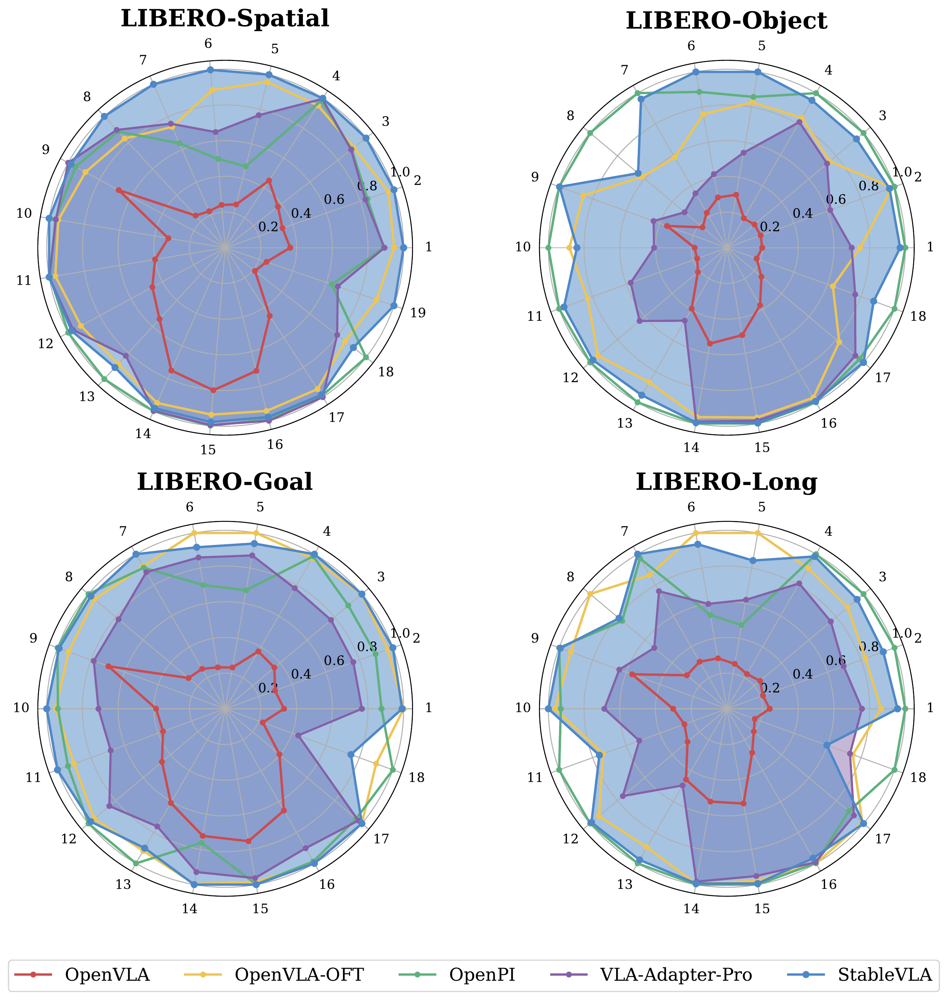
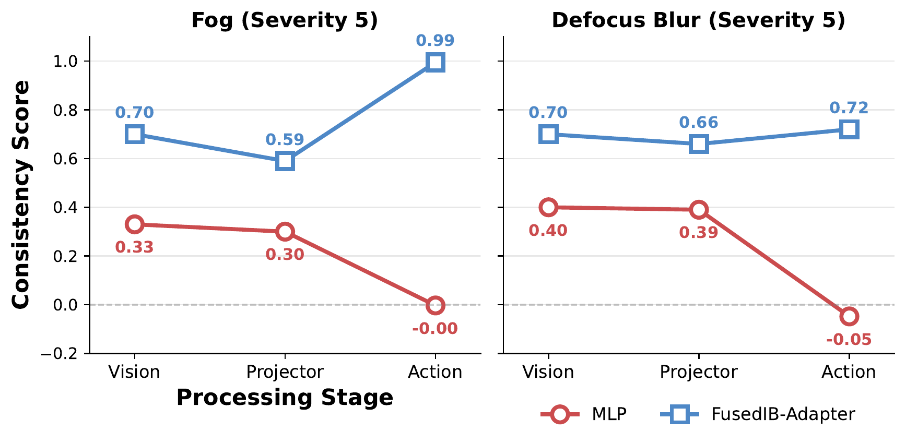

# StableVLA: Towards Robust Vision-Language-Action Models without Extra Data

#

# 基本信息

- **arXiv**: 2605.18287
- **Authors**: Yiyang Fu, Chubin Zhang, Shukai Gong, Yufan Deng, Kaiwei Sun, Qiyang Min, Qibin Hou, Yansong Tang, Jianan Wang, Daquan Zhou
- **Categories**: cs.CV, cs.RO
- **一句话结论**: 本文提出基于信息瓶颈（Information Bottleneck, IB）的轻量适配器 IB-Adapter 及其融合版本 Fused IB-Adapter，在不引入任何额外训练数据或损坏增强的前提下，赋予 Vision-Language-Action（VLA）模型对未见视觉干扰的零样本内在鲁棒性。

#

# 研究问题

现有 VLA 模型（如 OpenVLA、OpenPi、VLA-Adapter）在理想视觉条件下表现优异，但在面对真实世界中未见的视觉干扰（传感器噪声、运动模糊、天气扰动、物理遮挡等）时，策略成功率会急剧下降甚至归零。传统解决方案依赖数据增强、域随机化或大规模预训练，但计算成本高昂且难以覆盖无限的噪声组合，容易退化为对特定噪声模式的记忆而非学习真正不变的鲁棒特征。本文核心问题是：**能否仅通过架构设计，在不使用额外数据的情况下，为 VLA 模型赋予内在的视觉鲁棒性？** 该问题直接关乎具身智能在真实开放环境中的可靠部署，也是连接 World Model 与下游机器人控制的关键接口问题。

#

# 任务与挑战

论文在仿真基准与真实机器人上展开评估。仿真侧采用 LIBERO（Spatial / Object / Goal / Long 四个任务套件）与 CALVIN 基准。每个模型在干净数据上训练，仅在训练时使用轻度几何与光度增强（裁剪、颜色抖动），**绝不暴露于 ImageNet-C 的 19 种合成损坏**；测试时则在 Severity 3–5 的零样本损坏条件下评估成功率或平均完成任务数。真实世界侧在 Astribot S1 双臂机器人上执行四项任务（Pick and Place、Throw Basketball、Pour Water、Pack Doll），并引入数字损坏（高斯噪声、离焦模糊）与物理损坏（镜头油污、塑料遮盖）。



挑战在于：VLA 的视觉编码器通常被冻结以保留语义先验，输入噪声会完整传播至投影器；而现有标准 MLP 投影器缺乏显式的 nuisance 过滤机制，成为鲁棒性瓶颈。此外，精细操作（如倒水、装箱）需要保留高频空间细节，简单的特征压缩可能损害动作精度。

#

# 核心 Insight

本文的核心洞察是将模态对齐（modality alignment）重新建模为信息瓶颈（Information Bottleneck, IB）优化问题。与在空间维度做 token 聚合的传统 IB 解释不同，作者指出在 VLA 的投影阶段，语义与噪声在**通道维度**上呈异质分布，因此应在通道维度进行语义子空间聚类。

具体而言，IB-Adapter 通过计算通道间的 Gram 矩阵（协方差）捕捉语义相关性，并基于**独立伯努利潜变量假设**推导出 **Sigmoid 门控**机制——每个通道与语义簇的关联被视为独立的二元决策，从而允许独立抑制噪声通道，避免 Softmax 带来的强制竞争与语义能量抵消。为了兼顾精细操作所需的高频空间细节，作者进一步提出 Fused IB-Adapter：一条标准 MLP 通路保留高保真空间信息，另一条 IB 通路提供鲁棒语义，通过可学习融合系数与随机路径丢弃（SPD）动态平衡两者。



这一设计使得轻量模型（0.5B 参数，无 Open X-Embodiment 预训练）在损坏场景下的鲁棒性可与 7B 规模的 OpenVLA-OFT 及 3B 的 OpenPi-0.5 相抗衡。

#

# 方法与公式

StableVLA 的整体架构遵循 VLA-Adapter 的高效微调范式，但将其 MLP 投影器替换为 Fused IB-Adapter。数据流如下：冻结的视觉编码器 $\mathcal{E}$（DINO-SigLIP）提取视觉 token $\mathbf{X}_v \in \mathbb{R}^{N \times D_v}$；经 Fused IB-Adapter 映射为 $\mathbf{Z}$ 后与文本嵌入拼接，输入经 LoRA 微调的 LLM（Qwen2.5-0.5B），自回归预测 7D 机器人动作 $\mathbf{a}$。

**IB 目标函数。** 将投影器视为信息瓶颈，目标是在压缩视觉输入的同时保留与任务相关的干净语义 $\mathbf{S}$：

```math
\mathcal{L}_{IB} = I(\mathbf{X}_v; \mathbf{Z}) - \beta I(\mathbf{Z}; \mathbf{S})
\tag{1}
```

其中 $\beta$ 控制压缩与信息保留的权衡，$I(\cdot;\cdot)$ 表示互信息。

**通道维度 IB 注意力。** 在通道维度上，IB 的迭代最优解等价于如下注意力形式（Proposition 1）：

```math
\mathbf{Z} = \mathbf{V} \cdot \sigma\left( \beta \mathbf{Q}^\top \mathbf{K} \right)
\tag{2}
```

这里 $\mathbf{Q}, \mathbf{K}, \mathbf{V} \in \mathbb{R}^{N \times D}$ 是输入 $\mathbf{X}_v$ 的线性投影。关键区别在于归一化函数 $\sigma(\cdot)$：在独立伯努利潜变量假设下为 Sigmoid，在分类潜变量假设下为 Softmax。本文选择 Sigmoid 以实现独立通道门控。

**IB-Adapter 的逐头计算。** 输入 $\mathbf{X}' \in \mathbb{R}^{N \times D}$ 被分为 $H$ 个头，每头 $\mathbf{X}'_h \in \mathbb{R}^{N \times d}$（$d=D/H$）。查询与键分别定义为：

```math
\mathbf{Q}_h = \mathbf{X}'_h \mathbf{W}_q, \quad \mathbf{K}_h = \mathbf{X}'_h
\tag{3}
```

键使用恒等映射以保留原始几何流形。跨空间聚合的通道协方差由 Gram 矩阵刻画：

```math
\mathbf{G}_h = \mathbf{Q}_h^\top \mathbf{K}_h \in \mathbb{R}^{d \times d}
\tag{4}

```math

**Sigmoid 子空间门控。** 对 Gram 矩阵应用可学习的 Sigmoid 门控：

```math
\mathbf{A}_h = \sigma\left( \mathbf{G}_h \cdot \boldsymbol{\tau}_h \right) \in [0,1]^{d \times d}
\tag{5}
```

$\boldsymbol{\tau}_h$ 为可学习温度。与 Softmax 不同，Sigmoid 不强制通道间竞争，可将与语义无关的噪声通道独立置零。

**非线性值变换与重构。** 值向量经两层 MLP 与 GELU 激活生成：

```math
\mathbf{V}_h = \mathrm{Norm}\left( \mathrm{GELU}\left( \mathbf{X}_h \mathbf{W}_{v1} \right) \mathbf{W}_{v2} \right)
\tag{6}
```

随后经门控调制并重构输出：

```math
\mathbf{Z}_h = \mathbf{V}_h \mathbf{A}_h
\tag{7}
```

多头输出拼接为 $\mathbf{Z}_{IB}$。

**Fused IB-Adapter。** 双路径融合公式为：

```math
\mathbf{Z} = \mathrm{MLP}(\mathbf{X}) + \tanh(\lambda) \cdot \mathbf{Z}_{IB}
\tag{8}
```

$\lambda$ 为可学习融合系数。训练时以概率 $p_{\text{drop}}$ 随机丢弃 IB 路径（SPD），强制策略网络适应不同路径特征。不同任务套件采用不同的 $p_{\text{drop}}$（如 LIBERO-Long 设为 0.0 以保留空间精度，CALVIN 设为 0.3 以增强语义鲁棒性）。

#

# 贡献拆解

1. **定位 VLA 鲁棒性瓶颈并揭示投影器的关键作用**：通过跨模型、跨损坏类型的系统评估，证实当前 SOTA VLA 在零样本视觉损坏下性能暴跌，并将脆弱性根源定位到连接视觉编码器与 LLM 的投影模块，而非编码器本身。
2. **从信息瓶颈理论导出通道级 Sigmoid 门控机制**：将模态对齐形式化为 IB 优化，证明在通道维度上 IB 迭代解等价于协方差注意力；引入独立伯努利潜变量假设，从理论上说明应使用 Sigmoid 而非 Softmax 进行独立通道抑制，避免语义能量竞争抵消。
3. **提出即插即用的 Fused IB-Adapter 双路径架构**：标准 MLP 通路保留高频空间细节以支持精细操作，IB 通路提供鲁棒语义；通过可学习融合系数与 SPD 策略，在参数量增加不到 10M 的情况下，实现鲁棒性与精度的动态平衡。
4. **在仿真与真实机器人上验证架构创新可弥合规模差距**：StableVLA（0.5B，无 OpenX 预训练）在 19 种合成损坏及真实物理干扰下，鲁棒性达到或超过 7B 级 OpenVLA-OFT 与 3B 级 OpenPi-0.5，为资源受限场景下的鲁棒 VLA 部署提供了可行路径。

#

# 关键图表解读

**图 1：真实世界任务与损坏示例（figure-003-real-vis.png）**
该图展示了 Astribot S1 平台上的四项真实机器人任务（Pick and Place、Throw Basketball、Pour Water、Pack Doll）以及两种物理损坏（Oil-stained、Plastic shelter）。它直观说明了本文所针对的真实场景：不仅是数字噪声，还包括镜头油污、塑料遮盖等物理退化。读图时应注意，这些任务涵盖了从简单抓取到长程规划的多种操作类型，且物理损坏会直接改变光学路径，比合成损坏更具挑战性。

**图 2：IB-Adapter 结构与整体 VLA 框架（figure-005-main-arch.png）**
左图详细展示了 IB-Adapter 的数学结构：Raw Features 经 Linear 得到 Q 与 K，计算 Gram Matrix（$d \times d$），经 Sigmoid 生成 Attention Map，再与经 MLP 变换的 V 做元素级调制得到 Output Z。右图展示了完整 VLA 流程：Visual Encoder 提取图像特征，经 IB-Adapter + MLP 的 Fused 模块对齐后，与 Text Tokenizer 输出的语言指令一起送入 LLM Backbone，最终由 Policy Module 输出 7D 动作（$\Delta x, \Delta \theta, \Delta \mathrm{Grip}$）。读图关键是理解左图的通道级协方差注意力如何嵌入到右图的模态对齐阶段，替代传统投影器。

**图 3：LIBERO 四任务套件雷达图（figure-009-radar-4tasks-with-clean.png）**
四幅雷达图分别对应 LIBERO-Spatial、Object、Goal、Long，每条轴代表一种损坏类型，半径表示归一化后的鲁棒性分数。StableVLA（蓝色）在绝大多数损坏轴上包围或逼近外圈，显著优于同规模的 VLA-Adapter-Pro（紫色）和 OpenVLA（红色），并与 OpenVLA-OFT（黄色）、OpenPi（绿色）等大规模模型相当。读图时应注意 LIBERO-Long 长程任务中，StableVLA 在保持干净性能的同时，损坏场景下的面积明显大于基线，说明其对长程语义漂移的抑制能力。



**图 4：特征一致性级联分析（figure-010-cascade-3types.png）**
该图对比了 MLP（红色）与 FusedIB-Adapter（蓝色）在 Vision、Projector、Action 三个处理阶段的一致性分数（Consistency Score）。在 Fog 与 Defocus Blur（Severity 5）下，MLP 投影器的一致性从 Vision 到 Action 持续下降，最终接近 0；而 FusedIB-Adapter 在 Projector 阶段通过 IB 门控过滤噪声，使 Action 阶段的一致性回升至接近 1.0（Fog）或保持高位（Defocus Blur）。这直接定量证明了 IB-Adapter 在模态对齐阶段修复特征退化的能力，支撑了“无需额外数据即可提升鲁棒性”的核心结论。



#

# 实验与消融

**数据集与设定。** 仿真评估在 LIBERO（4 个任务套件，每套件 10 个子任务，共 500 回合）和 CALVIN（零样本环境，1000 个连续任务）上进行，覆盖 19 种 ImageNet-C 损坏（Severity 3–5）。真实世界在 Astribot S1 上执行 4 项任务，每项 10 次试验，测试数字损坏（高斯噪声、离焦模糊）与物理损坏（油污、塑料遮盖）。

**基线与指标。** 对比三类范式：(1) OpenX 预训练的 7B 模型 OpenVLA / OpenVLA-OFT；(2) OpenX+Web 协同训练的 3B 模型 OpenPi-0.5；(3) 同架构直接微调的 VLA-Adapter-Pro（0.5B）。指标为成功率（LIBERO）、平均完成任务数（CALVIN）及真实世界相对干净条件的性能下降幅度（percentage points）。

**主结果。** 在 LIBERO Severity 5 条件下，StableVLA 相比 VLA-Adapter-Pro 的相对提升达 40.2% 至 139.6%。在 CALVIN 上，StableVLA 的 Clean 性能（4.17）与 VLA-Adapter-Pro（4.14）持平，但在损坏条件下显著优于后者（S5: 1.51 vs 1.44，且在中等损坏下优势更大）。真实世界中，StableVLA 在 Pick and Place 任务的平均性能下降仅 17.5 个百分点，远低于 VLA-Adapter-Pro 的 49.2 个百分点与 π0.5 的 30.1 个百分点。

**消融实验。** 表 `tab:ablation` 显示：
- **双路径必要性**：去除 MLP 路径的纯 IB-Adapter 在 LIBERO 损坏数据上平均成功率下降 3.1 个百分点，在 CALVIN 上平均完成任务数从 2.13 降至 1.44，证明 MLP 通路对保留空间细节至关重要。
- **Sigmoid vs. Softmax**：将 Sigmoid 替换为 Softmax 的 Fused IB-SM 在 CALVIN 上平均完成任务数从 2.13 崩溃至 0.46，在 LIBERO 上下降 16.3 个百分点， empirically 验证了独立伯努利假设的合理性。

**最强证据与最存疑证据。** 最强证据是 LIBERO 四套件在 Severity 5 下的全面领先，以及真实世界物理干扰（Oil、Shelter）下 StableVLA 的最小性能下降，证明其内在鲁棒性不依赖数据增强。最存疑的证据是真实世界实验仅覆盖 4 个任务，统计显著性有限；且 StableVLA 在 Pour Water 任务的 Clean 成功率（40.0%）显著低于 π0.5（70.0%），说明其绝对性能仍受基础 VLM 能力与数据规模限制；此外，CALVIN 的 Clean 性能优势微弱，暗示该架构对干净数据的绝对上限提升有限。

#

# 局限性

1. **真实世界评估规模与绝对性能**：真实实验仅覆盖 4 个任务，物理损坏类型（镜头涂油、塑料遮盖）较为单一；StableVLA 在部分干净任务（如 Pour Water）上的绝对成功率仍落后于大规模预训练基线 π0.5，表明架构创新尚不能弥补数据与模型规模的差距。
2. **理论假设的约束**：IB-Adapter 的推导依赖高斯分布与独立伯努利潜变量假设，实际视觉特征分布可能更复杂；论文未深入探讨在严重非高斯或结构化噪声下该假设的松弛边界。
3. **鲁棒性提升存在天花板**：由于视觉编码器被冻结以保留语义先验，输入噪声已在前向传播中引入特征退化，IB-Adapter 只能在投影阶段进行事后过滤，未能从根本上解决编码器层面的特征鲁棒性问题。
4. **融合系数的任务依赖性**：Fused IB-Adapter 的 SPD 率 $p_{\text{drop}}$ 和融合系数 $\lambda$ 需针对不同任务套件手动调优，缺乏基于输入质量的动态自适应机制。

#

# 个人研究判断

面向“World Models assisting Embodied AI downstream tasks”的研究方向，本文**值得继续追踪**。

理由如下：
1. **范式价值**：StableVLA 首次系统地将信息瓶颈理论引入 VLA 的模态对齐阶段，证明了不依赖额外数据或更大规模预训练，仅通过投影器的架构创新即可实现显著的零样本鲁棒性提升。这为 World Model 与具身智能的接口设计提供了新的理论视角——即对齐模块本身应被视为一个“鲁棒信息瓶颈”。
2. **实用价值**：IB-Adapter 参数量不到 10M，可即插即用替换现有 VLA 的投影器，对计算资源受限或视觉条件恶劣的真实场景（如户外机器人、工业检测）极具吸引力。
3. **后续空间**：论文明确指出了当前局限（冻结编码器、静态融合、任务规模小），为后续研究留下清晰接口。例如，可将 IB 思想扩展至视觉编码器内部，或结合 World Model 的预测能力实现动态自适应门控，进一步释放鲁棒性潜力。在构建具身智能的标准化鲁棒性基准方面，本文的评估协议也具有重要参考价值。
```
