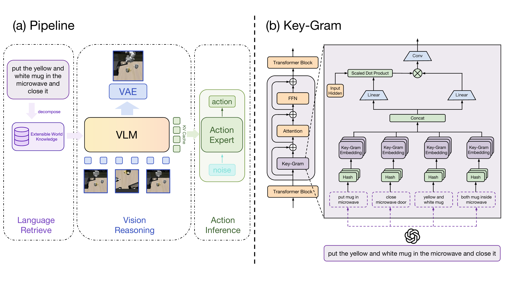
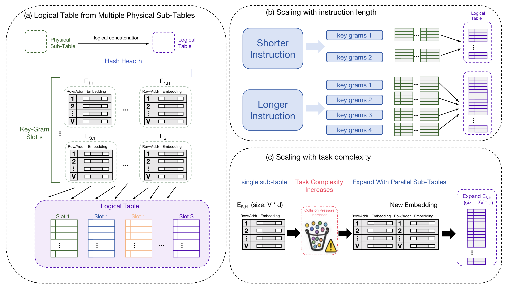
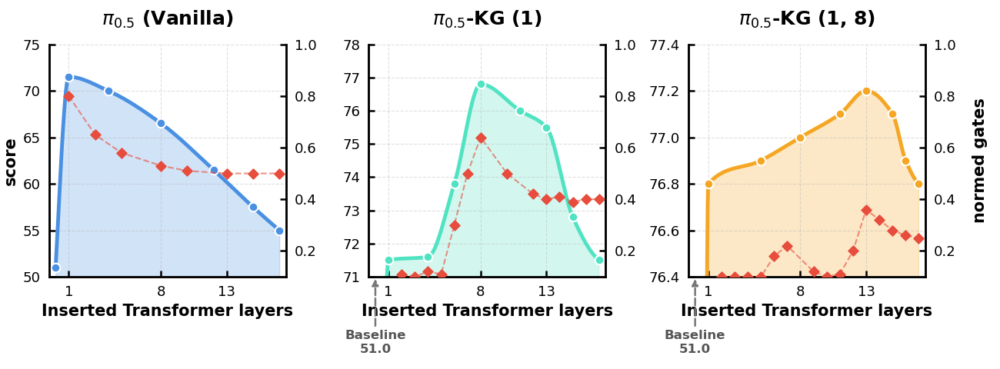
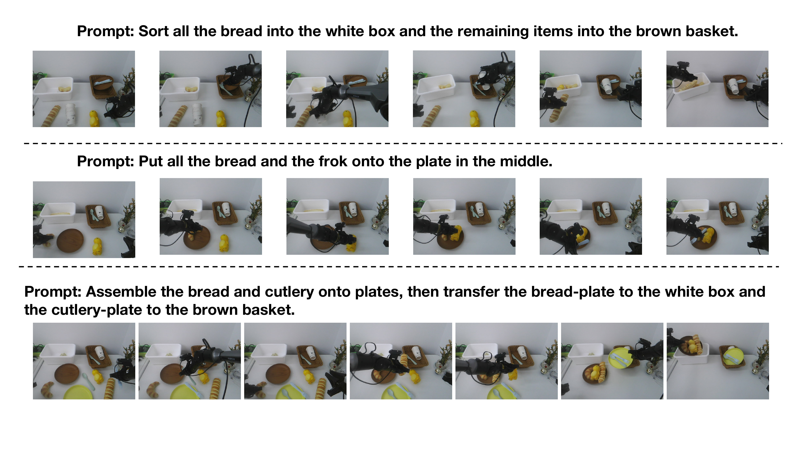

# Key-Gram: Extensible World Knowledge for Embodied Manipulation

#

# 基本信息

- **arXiv**: 2605.18556
- **Authors**: Jingjing Fan, Siyuan Li, Botao Ren, Zhidong Deng
- **Categories**: cs.RO, cs.AI
- **一句话结论**: Key-Gram 通过将语言指令分解为任务级 key-gram，并以确定性哈希从外部可扩展记忆表中检索静态语言先验，以残差形式注入 VLA 主干，实现了语言世界知识与视觉物理推理的功能解耦，在模拟与真实世界操控任务中带来一致且显著的性能提升。

#

# 研究问题

当前视觉-语言-动作（VLA）策略与世界动作模型（WAM）通常将**可复用的静态语言知识**与**在线动态视觉推理**紧耦合在同一主干或条件路径中。这种纠缠导致两个结构性痛点：一是少量语言 token 与大量视觉 token 在共享注意力流中发生**模态竞争**，稀释指令信息；二是知识扩展必须依赖主干参数的更新，容易引发**灾难性遗忘**，使模块化持续学习变得脆弱。

本文旨在回答：在具身控制中，能否将语言侧的世界知识检索与视觉侧的场景动力学推理按**功能**而非模态进行分离？具体而言，如何让视觉主干专注于未来状态预测与物理演化，同时将语言指令所承载的抽象任务先验以外部记忆的形式独立存储、高效检索与模块化扩展？

#

# 任务与挑战

**具体任务**：语言条件下的双臂机器人操控，涵盖模拟基准（RoboTwin2.0、LIBERO/LIBERO-Plus）与真实世界（Piper 双臂平台）的长程组合任务。

**输入与输出**：
- 输入：自然语言指令 $\mathcal{I}$ 与初始视觉观察 $\mathcal{V}_0$。
- 输出：动作轨迹（由流匹配去噪生成）与未来视觉状态的紧凑 VAE 隐变量。

**训练与评测设定**：
- 模拟环境：在 $\pi_0$ 与 $\pi_{0.5}$ 主干上全参数训练，测试包含域随机化的 Easy/Hard 双设置。
- 真实世界：3 个长程任务（拾取、排序、组合装配）与 5 个扩展任务（分布内执行、未见对象组合重组、顺序适应）。
- 核心挑战：在强域随机化、长程时序保持、组合泛化与零样本迁移场景下，验证外部记忆对指令敏感型操控的增益。

**已有方法的不足**：
- **密集融合**（如 RT-2、$\pi_0$）：语言 token 与视觉 token 在输入层或深层共享同一注意力流，语言信息易被密集视觉特征淹没。
- **条件生成**（如 Diffusion Policy、DreamZero）：语言被编码为全局条件向量或提示信号，但组合世界知识仍隐式烘焙在生成主干中，扩展时需重写参数，无法避免遗忘。

#

# 核心 Insight

本文的核心洞察在于：**在具身控制中，语言不应参与低层物理演化，而应作为“可复用的抽象任务先验索引”**。视觉计算应专注于场景动力学、未来状态预测与控制演化；而语言所承载的对象、关系、技能与约束等世界知识，应当通过轻量、确定性的检索机制从外部注入，按需激活。这种按功能解耦的设计，使得新增知识只需追加外部记忆条目，无需触碰主干权重，从而将知识增长从“参数重写”转变为“模块化扩展”。

Key-Gram 通过三步实现这一原则：首先，将指令解析为少量高信息量的 key-gram（如 "put mug in microwave"）；其次，通过确定性多哈希查表以 $O(1)$ 复杂度从静态嵌入表中检索对应记忆；最后，在视觉 Transformer 的选定层通过上下文门控与轻量卷积将记忆残差注入，使主干的主要容量仍用于视觉推理。



#

# 方法与公式

#

## 整体流程

Key-Gram 以语言指令 $\mathcal{I}$ 和视觉观察 $\mathcal{V}_0$ 为输入，分离“语言知识检索”与“视觉-动作推理”两条路径。外部解析器将 $\mathcal{I}$ 分解为 $K$ 个短 key-grams；随后通过确定性哈希从外部静态表中检索对应嵌入；在视觉 Transformer 的选定层（如 Layers 1, 8, 13）通过门控与卷积融合注入记忆；最终主干同时输出未来视觉隐变量和动作轨迹。

#

## 稀疏 Key-Gram 检索

**Key-gram 提取**：使用轻量语言模型或 API 解析器将指令拆分为固定数量的 key-grams（模拟中 $K=8$，真实世界 $K=16$），每个短语不超过 $M$ 个词，保留动作、对象、关系等高信息语义。

**哈希映射**：设提取的 key-grams 为 $\mathcal{G}=\{g_i\}_{i=1}^{K}$，每个 $g_i$ 包含至多 $M$ 个词。将每个词转为整数标识符并右补零，得到固定长度键 $\bar{g}_i=(a_{i,1},\ldots,a_{i,M})$。对第 $\ell$ 层的第 $h$ 个哈希头，索引计算为：

```math
z^{(\ell,h)}_i
=
\left(
\bigoplus_{j=1}^{M}
a_{i,j} \, r^{(\ell,h)}_{j}
\right)
\bmod P^{(\ell,h)}
\tag{1}
```

其中 $\oplus$ 表示按位异或（bitwise XOR），$r^{(\ell,h)}_{j}$ 为确定性奇数乘子，$P^{(\ell,h)}$ 为质数表长。该设计避免了端到端可微检索器的复杂训练，保证推理时无需搜索即可定位记忆。

**嵌入检索**：从该层该头的嵌入表 $E^{(\ell,h)}$ 中取出 $e^{(\ell,h)}_i$，拼接 $H$ 个头得到：

```math
e^{(\ell)}_i = \mathop{\Vert}_{h=1}^{H} e^{(\ell,h)}_i
\tag{2}
```

所有 $K$ 个 key-gram 的检索结果拼接成记忆向量 $M^{(\ell)} \in \mathbb{R}^{B \times 1 \times d_m}$，其中 $d_m = K H d_h$。

#

## 上下文自适应融合

在选定 Transformer 层的前注意力位置插入残差模块。设 $H^{(\ell)} \in \mathbb{R}^{B \times L \times d}$ 为第 $\ell$ 层注意力前的隐藏状态，$L$ 为视觉 token 数。记忆向量经可学习矩阵投影为键与值：

```math
K_m^{(\ell)} = M^{(\ell)} W_K^{(\ell)}, \quad
V_m^{(\ell)} = M^{(\ell)} W_V^{(\ell)}
\tag{3}
```

其中 $K_m^{(\ell)}, V_m^{(\ell)} \in \mathbb{R}^{B \times 1 \times d}$。以视觉隐藏状态为 Query，计算 token 级门控：

```math
A^{(\ell)}
=
\sigma\!\left(
H^{(\ell)} {K_m^{(\ell)}}^\top / \sqrt{d}
\right),
\qquad
A^{(\ell)} \in \mathbb{R}^{B \times L \times 1}
\tag{4}
```

该门控衡量每个视觉 token 对当前记忆的需求程度，实现知识先验的按需注入。

**卷积混合与残差注入**：执行 $A^{(\ell)} \odot V_m^{(\ell)}$，并通过长跨度 1D 卷积（跨度 $w = K$）在 token 维度混合不同 key-gram 的记忆片段，显式建模 key-gram 间关系：

```math
\Delta H^{(\ell)}
=
\mathrm{Conv}_{\mathrm{span}}
\!\left(
A^{(\ell)} \odot V_m^{(\ell)}
\right)
\tag{5}
```

最终以残差形式注入主干：

```math
\widetilde{H}^{(\ell)} = H^{(\ell)} + \Delta H^{(\ell)}
\tag{6}
```

$\widetilde{H}^{(\ell)}$ 随后进入标准自注意力计算。该残差设计确保外部记忆不干扰主干的视觉计算容量。

#

## 耦合视觉与动作预测

- **视觉预见**：最终层状态经可学习查询做交叉注意力，上采样后映射为 VAE 视觉隐变量，实现未来状态预测。
- **动作解码**：复用主干的 KV cache 作为条件，驱动轻量级同构动作专家执行流匹配去噪，生成动作轨迹。

#

## 可扩展且系统高效的内存分配

逻辑记忆表由多个 slot-head 子表构成（每个子表 $V=8192$ 行，$d_e=32$ 维）。训练时可跨设备分区；推理时因哈希确定性，可实现 $O(1)$ 查找并将大表置于 CPU 内存。

- **随指令长度扩展**：增加 key-gram slot 数量（如真实世界 $S=16$），每个 slot 引入 $H$ 个哈希头子表。
- **随任务复杂度扩展**：通过增加并行子表或扩大行数 $V$ 来降低哈希碰撞压力，无需修改视觉主干。



#

# 贡献拆解

**1. 功能解耦的架构原则**

- **做了什么**：首次在具身控制中系统性地将“语言知识检索”与“视觉物理推理”按功能分离，提出语言应作为“可复用先验索引”而非“竞争 token”或“生成提示”。
- **为什么有效**：通过将语言负担从视觉主干中卸载，减少了模态竞争，使主干的主要容量专注于场景动力学与未来状态推理。
- **与已有方法的差别**：不同于 RT-2/$\pi_0$ 的密集 token 融合，也不同于 DreamZero 的粗粒度全局条件注入，Key-Gram 在任务级语义单元上进行稀疏检索与局部残差注入。

**2. 可扩展的外部记忆机制**

- **做了什么**：通过确定性乘法-XOR 哈希查表和逻辑子表分区，构建了无需端到端训练检索器的外部记忆。
- **为什么有效**：$O(1)$ 检索复杂度使大容量知识表可在推理时置于 CPU 内存；子表结构支持分布式训练与模块化扩展。
- **与已有方法的差别**：相比 product-key memory 或 RAG 等需复杂检索索引的方法，Key-Gram 的确定性哈希更适合实时机器人控制的低延迟需求。

**3. 跨模拟与真实世界的一致增益**

- **做了什么**：在 $\pi_0$ 与 $\pi_{0.5}$ 两个主流主干上，于 RoboTwin2.0、LIBERO-Plus 和真实世界双臂任务中均取得显著提升。
- **为什么有效**：外部记忆在组合泛化（未见对象-关系重组）和长程任务（多步装配）中提供了显式的结构化先验。
- **与已有方法的差别**：证明了将语言侧世界知识外部化，比单纯扩大主干规模或增加训练数据具有更强的归纳偏置，尤其在分布偏移场景下。

#

# 关键图表解读

**图 1：Key-Gram 整体架构与核心模块设计（figure-002-keygram-overview.png）**

该图分为左右两部分。左侧 (a) 展示整体 Pipeline：语言指令经分解后进入“Language Retrieval”路径，通过外部可扩展世界知识库检索记忆；视觉观察经 VAE 编码后进入“Vision Reasoning”路径，由 VLM 处理；检索到的记忆以 KV Cache 形式注入 VLM 选定层；最终由 Action Expert 基于噪声生成动作。右侧 (b) 放大 Key-Gram 模块内部：输入隐藏状态与经 Hash 和 Embedding 检索到的多组 key-gram 记忆经 Concat、Linear 投影后，通过 Scaled Dot Product 计算门控，与另一路 Linear 投影相乘，再经 Conv 混合后残差输出。读图时应注意：Key-Gram 是插在 Transformer Block 内部的轻量残差分支，而非独立并行模块，这保证了它对主干计算流的非侵入性。

**图 2：逻辑表构建与扩展机制（figure-003-keygram-extensibility.png）**

该图解释了 Key-Gram 如何突破单一大表的限制。(a) 展示逻辑表由多个 Physical Sub-Table（按 Slot $s$ 与 Head $h$ 划分）逻辑拼接而成，支持分布式存储；(b) 展示随指令长度增加时，通过增加 key-gram slots 来扩展检索内容；(c) 展示随任务复杂度增加时，通过并行追加子表或扩大行数来缓解哈希碰撞压力。读图时应注意：扩展仅发生在记忆表侧，视觉主干结构完全不变，这是“模块化知识增长”的关键工程实现。

**图 3：层位消融与门控探测（figure-004-ablation.png）**

三张子图分别对应 $\pi_{0.5}$ Vanilla、$\pi_{0.5}$-KG (1) 和 $\pi_{0.5}$-KG (1, 8)。蓝色实线为任务得分，红色虚线为归一化门控值。Vanilla 在浅层插入时得分最高，深层插入时迅速衰减；KG(1) 在 Layer 8 附近出现得分峰值，但门控在浅层已被大量吸收；KG(1,8) 进一步将得分提升至 77.2，且门控在 Layer 13 附近出现二次激活。读图时应注意：浅层（Layer 1）注入记忆最为关键，能有效卸载主干的指令理解负担；深层门控的二次激活说明长程任务中仍需在深层补充结构化先验，但边际收益递减。



**图 4：真实世界长程任务执行序列（figure-001-real-world-long-horizon.png）**

三组真实世界任务（排序、组合拾取、多步装配）的连续帧展示了 $\pi_{0.5}$-KG 对复杂语言指令的执行过程。第一行展示“将面包放入白盒、其余物品放入棕篮”的排序任务；第二行展示“将面包和叉子放到中间盘子上”的组合拾取；第三行展示“将面包和餐具组装到盘子上，再分别转移到白盒和棕篮”的多步装配。读图时应注意：这些任务涉及多对象关系、长程时序与工具使用，视觉场景高度相似但指令语义差异大，Key-Gram 通过检索结构化语言先验，帮助模型在视觉歧义中保持正确的任务结构。



#

# 实验与消融

**数据集与设定**：
- **RoboTwin2.0**：50 个任务，Easy/Hard 双设置（Hard 含强域随机化）。
- **LIBERO / LIBERO-Plus**：标准 4 套件与分布扩展设置，测试零样本迁移与 fine-tuned 性能。
- **真实世界 Piper 双臂**：3 个长程任务（各 300 条轨迹）与 5 个扩展任务（训练 A+B，测试 A+C 的组合重组与顺序适应）。

**基线与指标**：以 $\pi_0$、$\pi_{0.5}$ 为基线，对比 X-VLA、OpenVLA-OFT；指标为任务成功率。

**主结果**：
- **RoboTwin2.0**：$\pi_0$-KG 平均成功率从 65.9/58.4 提升至 80.3/75.6，相对增益 **21.9% / 29.5%**；$\pi_{0.5}$-KG 从 82.7/76.8 提升至 89.0/84.4，增益 **7.6% / 9.9%**。
- **LIBERO-Plus 零样本迁移**：$\pi_0$-KG 提升 **35.8%**，$\pi_{0.5}$-KG 提升 **4.5%**；fine-tuned 后分别达 88.5 与 92.6。
- **真实世界长程**：平均提升 **15.4% / 8.1%**，Assembly 任务最高提升 **26.9% / 17.1%**。
- **真实世界扩展（未见组合）**：Task 3 提升 **34.6% / 18.8%**，Task 4 提升 **41.7% / 21.2%**；顺序适应 Task 5 提升 **10.0% / 4.7%**。

**消融实验**：
- **层位贪婪搜索**：Layer 1 单点插入即可将加权得分从 51.0 提升至 71.5；加入 Layer 8 达 76.8；再加入 Layer 13 达 77.2。证明早期卸载语言负担最关键。
- **门控探测**：一旦浅层（Layer 1）插入记忆，后续相邻层的门控被显著抑制，说明语言先验已被有效吸收，深层无需重复处理。

**最强证据**：RoboTwin2.0 Hard 设置下 $\pi_0$ 从 58.4% 提升至 75.6%（相对 +29.5%），以及真实世界扩展任务中未见组合配对最高提升 41.7%，直接证明外部记忆在强域随机化、长程时序保持与组合泛化上的决定性作用。

**最存疑证据**：真实世界分布内 Task 1 中 $\pi_0$-KG 反而下降 2.2%（90.0% vs 92.0%），LIBERO fine-tuned 上 $\pi_{0.5}$-KG 微降 0.2%（96.7% vs 96.9%）。这表明在基线已饱和的简单或分布内任务中，外部记忆可能因检索噪声或门控误激活引入轻微干扰，但论文未深入分析这种“过度干预”现象。

#

# 局限性

1. **解析器瓶颈与人工设计依赖**：key-gram 提取依赖外部 LLM/API 解析器和高度手工设计的提示模板（固定 8 个关键词、2–4 词等硬规则）。解析错误会直接传播到检索阶段，且论文未量化解析错误率对最终性能的影响。在开放世界中，这种硬编码模板的可扩展性存疑。

2. **增益的不对称性与边际递减**：提升在较弱主干（$\pi_0$）上远大于强主干（$\pi_{0.5}$），在简单任务（LIBERO in-domain）上接近零甚至微负。这说明外部记忆主要补偿了主干自身的语言理解缺陷，而非在所有场景下都提供“净增益”。

3. **记忆内容的静态性**：当前记忆表存储的是静态语言嵌入，缺乏与视觉经验的交互更新机制。在真实世界中，对象属性可能是新奇的或随时间变化的，静态哈希表无法自适应地修正或丰富知识。

4. **持续学习未充分验证**：虽然架构设计上承诺防止灾难性遗忘并支持持续扩展，但实验仅展示了短周期的顺序适应（真实世界 Task 5），未进行大规模 lifelong learning 的严格验证。

5. **记忆初始化交代模糊**：论文未明确说明记忆表嵌入是随机初始化还是注入了外部语言模型知识，而这直接决定了外部记忆是否真正携带了“世界知识”还是仅仅作为可训练的适配器参数。

#

# 个人研究判断

面向 **“World Models assisting Embodied AI downstream tasks”** 的研究方向，这篇论文**值得继续追踪**。

**理由**：
- **范式价值**：Key-Gram 提出了一种轻量且可扩展的知识组织新范式，将语言侧的世界知识检索与视觉侧的物理推理分离。这对 World Model 作为下游任务辅助模块的设计具有直接启发——世界模型可专注于视觉动力学预测，而结构化任务知识通过类似 Key-Gram 的机制外挂注入，避免两者在参数空间纠缠。
- **工程可行性**：确定性哈希查表避免了端到端可微检索器的复杂性与不稳定性，$O(1)$ 检索和 CPU 内存卸载特性使其在真实机器人部署中具有工程优势。
- **组合泛化与持续累积**：其在未见组合指令上的显著提升（最高 +41.7%）证明了结构化外部记忆对组合泛化的强归纳偏置；模块化扩展特性也为开放世界中的持续知识累积提供了可行路径。

**需关注的后续方向**：
- 探索**无解析器的 key-gram 发现**（如从语言模型内部注意力自动提取关键短语），降低人工模板依赖。
- 将静态记忆扩展为**视觉-语言联合动态记忆**，允许机器人在交互中动态写入和更新记忆条目（如记录新对象的物理属性），而不仅仅是读取预存先验。
- 对于已具备强语言理解能力的大模型主干，外部记忆的设计应从“补偿语言缺陷”转向“组织结构化物理知识”（如 affordance、约束、技能库），以在强基线上获得更大的边际收益。
