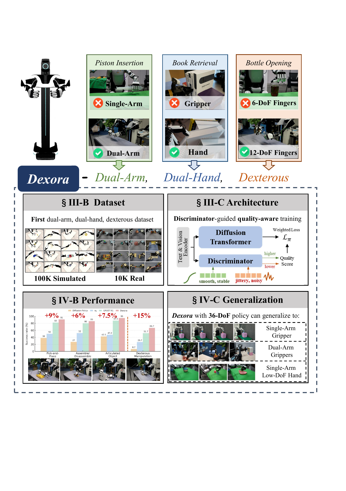
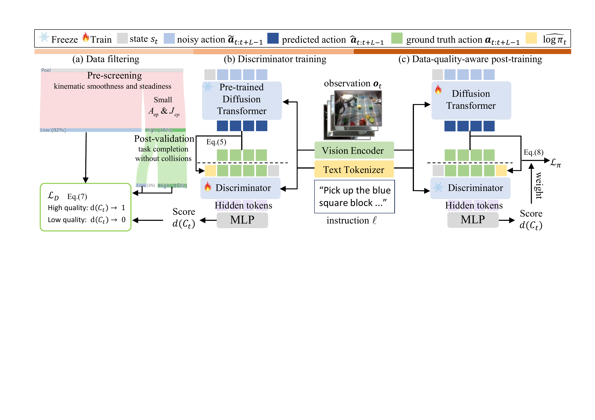
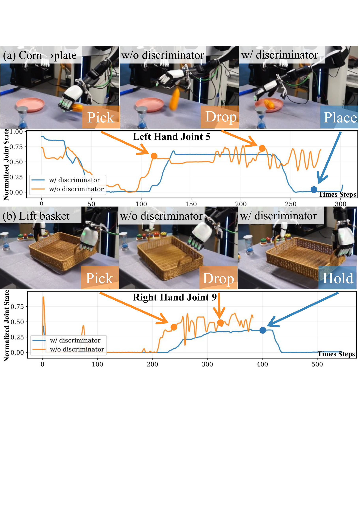
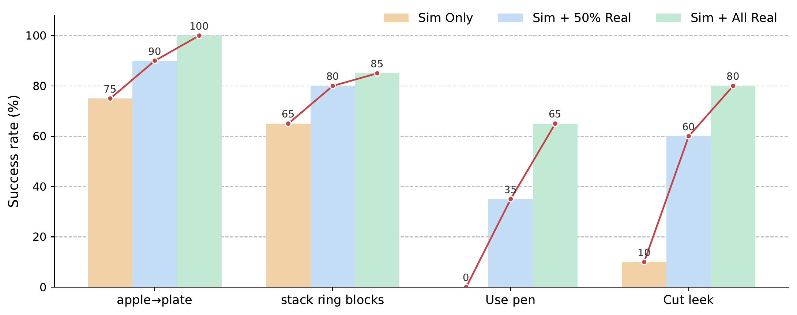

# Dexora: Open-source VLA for High-DoF Bimanual Dexterity

#

# 基本信息

- arXiv: 2605.18722
- Authors: Zongzheng Zhang, Jingrui Pang, Zhuo Yang, Kun Li, Minwen Liao, Saining Zhang, Guoxuan Chi, Jinbang Guo, Huan-ang Gao, Modi Shi, Dongyun Ge, Yao Mu, Jiayuan Gu, Rui Chen, Hao Dong, Huazhe Xu, Li Yi, Yixin Zhu, Hang Zhao, Pengwei Wang, Shanghang Zhang, Guocai Yao, Jianyu Chen, Hongyang Li, Hao Zhao
- Categories: cs.RO
- 一句话结论：首个开源的双臂双手36-DoF VLA系统，通过混合遥操作构建仿真-真实互补数据集，并引入判别器引导的质量感知扩散Transformer训练，在基础任务上达到约90%成功率、灵巧任务上达到66.7%平均成功率，同时展现出跨具身泛化能力。

#

# 研究问题

现有Vision-Language-Action（VLA）模型大多局限于单臂或低自由度夹爪控制，无法完成需要双臂协调与精细手指动作的高自由度灵巧任务（如活塞插入、拧瓶盖、从拥挤书架取书）。此外，高自由度遥操作数据普遍存在人为抖动、传感器噪声与遮挡等问题，直接在混合质量数据上训练策略容易导致性能退化。本文旨在填补开源VLA在双臂双手高自由度灵巧操作领域的空白，并解决遥操作数据质量参差不齐带来的训练不稳定问题。

#

# 任务与挑战

具体任务分为12项基础操作（Pick-and-Place、Assemble/Disassemble、Articulated Objects）与6项灵巧操作（Use pen、Fetch book、Cut leek、Place plates、Rough dough、Twist cap）。系统输入为多视角RGB图像、自然语言指令与36-DoF本体状态，输出为长度 $L=32$ 的动作块，控制频率20 Hz。训练数据包含约100K条仿真轨迹（6.5M帧）与10K条真实遥操作轨迹（2.92M帧）。已有方法如GR00T N1虽支持双臂但仅使用6-DoF手，$\pi_0$与Diffusion Policy在低维到高维的动作空间映射中性能急剧下降，证明现有VLA架构与数据均不足以支撑原生高自由度双手协调。

#

# 核心 Insight

本文的核心洞察在于：第一，高自由度灵巧操作必须原生支持双臂与双手的端到端VLA学习，而非简单地将低自由度策略扩展到高维空间；第二，遥操作数据中的噪声与抖动是隐形的性能瓶颈，通过离线判别器自动识别片段质量并加权损失，可在保留大规模数据多样性的同时抑制低质量示教的负面影响；第三，在高维灵巧空间训练的策略向低维具身投影（维度缩减）比反向映射（维度提升）更良定，为构建通用机器人控制器提供了可行路径。



#

# 方法与公式

Dexora的完整pipeline可分为硬件遥操作、数据集构建、数据质量筛选、判别器训练与三阶段策略训练五个层次。

**1. 硬件与混合遥操作**

系统由两条6-DoF AIRBOT手臂与两只12-DoF XHAND灵巧手组成，共36-DoF。作者将粗手臂运动学与精细手指运动解耦：手臂关节角由定制轻量化外骨骼背包直接捕捉并映射到机器人关节空间；手指姿态通过Apple Vision Pro进行无标记3D手部骨骼追踪，经校准后重定向到XHAND并施加关节限幅与安全约束。同一套接口同时驱动物理机器人与MuJoCo数字孪生，确保观察-动作协议完全一致。

**2. 数据集构建**

仿真数据基于200个任务，利用DexMimicGen对3–5条种子演示进行状态随机化与动作重定向，生成约100K条轨迹（6.5M帧）。真实数据通过混合遥操作采集10K条片段（2.92M帧），覆盖基础与灵巧任务，并遵循LIBERO-2.1标准开源。

**3. 数据质量筛选（Episode-level）**

由于遥操作存在人为抖动与传感器噪声，作者设计了两阶段筛选。首先计算每条轨迹的均方根加速度 $A_{\mathrm{ep}}$ 与急动度 $J_{\mathrm{ep}}$，保留各自最低20%的交集（约18%数据）。随后对预筛选集合进行开环重放，仅保留任务成功且无碰撞的片段，最终得到约15%的高质量正例集 $\mathcal{S}_{\mathrm{high}}$。

状态维度经min-max归一化后，速度、加速度与急动度采用中心差分计算（$t=4,\dots,T-3$）：

```math
v_t = \frac{s_{t+1}-s_{t-1}}{2\Delta t}, \quad
a_t = \frac{v_{t+1}-v_{t-1}}{2\Delta t}, \quad
j_t = \frac{a_{t+1}-a_{t-1}}{2\Delta t}
\tag{1}
```

进而定义片段级的RMS加速度与急动度：

```math
A_{\mathrm{ep}}(\tau) = \sqrt{\frac{1}{(T-6)D}\sum_{t=4}^{T-3}\sum_{k=1}^{D} a_{t,k}^{2}}
\tag{2}
```

```math
J_{\mathrm{ep}}(\tau) = \sqrt{\frac{1}{(T-6)D}\sum_{t=4}^{T-3}\sum_{k=1}^{D} j_{t,k}^{2}}
\tag{3}
```

其中 $s_t \in \mathbb{R}^{D}$ 为 $D=36$ 维本体状态，$\Delta t$ 为采样间隔。数值越低表明运动越平滑稳定。

**4. 判别器模型**

判别器为12层、512 hidden size、8头的Transformer（30M参数）。对于每个片段 $C_k$，其输入token包含本体状态 $s_t$、动作块 $\mathbf{a}_{t:t+L-1}$、以及一个log-$\pi$ proxy。该proxy利用预训练扩散策略的负去噪残差能量 $E_t$ 经z-score标准化得到，衡量策略对该片段的“解释程度”：

```math
E_t = \frac{1}{|\mathcal{S}|L}\sum_{s\in\mathcal{S}}\sum_{\tau=t}^{t+L-1} \left\lVert \varepsilon_{\theta}\left(\mathbf{o}_{\tau},\ell,\mathbf{a}_{\tau:\tau+L-1},s_\tau\right)-\varepsilon \right\rVert_2^2
\tag{4}
```

```math
\widehat{\log\pi}_t = -\,\mathrm{zscore}\left(E_t\right)=-\frac{E_t - \mathrm{Mean}(E)}{\sqrt{\mathrm{Var}(E)+\varepsilon}}
\tag{5}
```

其中 $\mathcal{S}$ 为少量扩散时间步集合，$\varepsilon_{\theta}$ 为策略去噪网络，$\varepsilon$ 为真实噪声，$\mathrm{Mean}(E)$ 与 $\mathrm{Var}(E)$ 为能量分布的统计量。$\widehat{\log\pi}_t$ 越大，说明预训练策略越“认可”该片段。

判别器输出片段质量分数 $d(C_k)\in(0,1]$。训练采用正例-未标注（PU）学习：以 $\mathcal{S}_{\mathrm{high}}$ 为正例，其余真实数据 $\mathcal{U}$ 为负例，优化带 $\eta=0.5$ 的BCE损失，并将分数裁剪至 $[0.1,0.9]$ 以稳定训练：

```math
\mathcal{L}_{D} = \eta\,\mathbb{E}_{\tau\in \mathcal{S}_{\mathrm{high}}}\left[-\log d(\tau)\right] + \mathbb{E}_{\tau\in \mathcal{U}}\left[-\log (1-d(\tau))\right]
\tag{6}
```

**5. 扩散Transformer策略与三阶段训练**

策略采用28层、1024 hidden size、16头的decoder-only Transformer作为扩散模型。输入包含当前观察 $\mathbf{o}_t$、语言指令 $\ell$、本体状态 $s_t$ 与带噪动作 $\widetilde{\mathbf{a}}_{t:t+L-1}$，经T5与SigLip编码条件后，预测动作噪声 $\widehat{\varepsilon}$，进而得到动作序列 $\widehat{\mathbf{a}}_{t:t+L-1}$。训练使用DDPM，推理使用DPMSolver++加速。

三阶段训练流程如下：

- **阶段一（预训练）**：在仿真数据上训练扩散Transformer策略 $\pi_\theta$，获得基础操作能力。
- **阶段二（判别器训练）**：冻结 $\pi_\theta$，按式(4)(5)计算所有真实片段的log-$\pi$ proxy，按式(6)训练判别器。
- **阶段三（后训练）**：在真实数据上继续训练 $\pi_\theta$，将判别器分数通过DWBC映射转换为权重 $w_i$，加权扩散损失：

```math
\mathcal{L}_{\pi} = \sum_{i=1}^{L} w_i \left\lVert \varepsilon_{\theta}(\cdot)-\varepsilon \right\rVert_2^2
\tag{7}
```

并采用短权重预热策略。推理时仅使用策略 $\pi_\theta$，输出动作块长度 $L=32$。



#

# 贡献拆解

1. **开源双臂双手高自由度VLA系统与数据集**：发布了首个面向36-DoF双手机器人的开源VLA系统Dexora，包括硬件接口、混合遥操作方案、仿真-真实互补数据集与代码。该系统填补了现有VLA在双臂灵巧操作领域的空白，为社区提供了完整的基准。

2. **判别器引导的质量感知扩散训练**：提出基于离线Transformer判别器的PU学习与DWBC加权策略。通过自动识别遥操作片段质量并调整扩散损失权重，在不丢弃大量中等质量数据的前提下，有效抑制抖动与噪声，显著提升策略平滑度与成功率。

3. **跨具身泛化的可行路径验证**：通过系统的跨具身实验，提供了“在高自由度复杂具身上训练、向低自由度简单具身投影”的证据。通过动作维度填充与观察掩码，策略可迁移至单臂夹爪、双臂夹爪和单臂低自由度手，支持了高维到低维映射更良定的假设。

#

# 关键图表解读

- **figure-002-teaser.png（Dexora总览）**：该图以四象限形式同时展示了四大核心贡献。左上“Dataset”表明系统基于100K仿真与10K真实轨迹；右上“Architecture”展示了判别器引导的质量感知训练范式，即判别器为扩散Transformer提供加权信号；左下“Performance”以柱状图呈现Dexora在基础任务上相对GR00T N1等基线有+6%到+15%的提升；右下“Generalization”展示了36-DoF策略向单臂夹爪、双臂夹爪和单臂低自由度手的迁移能力。读图时应注意，性能提升在灵巧任务上尤为显著，而泛化实验主要展示了视觉-语言-动作策略的 embodiment-compatible 潜力。

- **figure-009-method.png（三阶段训练流程）**：该图详细对应论文第III-C节与第III-D节的方法论。(a) 数据过滤阶段通过运动学平滑度（低加速度/急动度）预筛选82%的数据，再经重放验证剔除碰撞与失败片段，最终保留约15%高质量正例；(b) 判别器训练阶段冻结预训练扩散Transformer，利用其去噪残差能量构建log-$\pi$ proxy，训练判别器输出 $d(C_t)$；(c) 质量感知后训练阶段将判别器分数映射为权重 $w_i$，嵌入扩散损失 $\mathcal{L}_\pi$。读图关键在于理解“冻结策略训练判别器”与“加权损失后训练”的解耦设计，这保证了判别器评分对策略优化的稳定性。

- **figure-005-discriminator-effectiveness.png（判别器消融可视化）**：该图通过真实机器人操作视频与关节状态曲线，直观证明了判别器对抑制抖动的关键作用。上排Corn→plate任务中，无判别器时左手关节5出现高频振荡导致玉米掉落（Drop），有判别器时轨迹平滑并成功放置（Place）；下排Lift basket任务中，无判别器时右手关节9抖动导致篮子滑落，有判别器时保持稳定托举（Hold）。读图时应注意，橙色曲线（无判别器）在持物阶段仍存在大幅波动，而蓝色曲线（有判别器）在达到目标姿态后迅速稳定，这说明质量感知训练不仅提升成功率，更改善了运动平滑度。

- **figure-010-scaling.png（数据组成消融）**：该图定量展示了仅使用仿真数据（Sim Only）、加入50%真实数据（Sim + 50% Real）以及加入全部真实数据（Sim + All Real）对四项任务成功率的影响。基础任务如apple→plate和stack ring blocks在仿真数据上已有较高起点，加入真实数据后稳步提升；而灵巧任务Use pen与Cut leek在仅使用仿真数据时成功率极低（0%与10%），随真实数据比例增加分别提升至65%与85%。读图时应注意，真实数据对灵巧操作具有不可替代性，因为仿真难以精确建模工具使用中的接触力与手指协同。

#

# 实验与消融

**数据集与基线**：评测涵盖12项基础任务（抓取放置、组装拆卸、关节物体）与6项灵巧任务（用笔、取书、切韭菜、摆盘、揉面、拧瓶盖）。基线包括Diffusion Policy（DP）、$\pi_0$与GR00T N1。所有方法在相同观察条件、控制频率（20 Hz）与动作块长度（$L=32$）下公平对比。

**主结果**：

- 基础任务：Dexora平均成功率达89.6%，显著优于GR00T N1（82.1%）、$\pi_0$（50.4%）与DP（34.2%）。在需要双手协调的任务（如双手传递、分离嵌套碗）上优势尤为明显。
- 灵巧任务：Dexora平均成功率达66.7%，相比GR00T N1（51.7%）、$\pi_0$（26.7%）与DP（6.7%）均有大幅提升。其中GR00T N1因仅使用6-DoF手，在需要拇指-食指协同与侧向摆动的拧瓶盖（Twist cap）任务上完全失败（0%），而Dexora达到25%。

**OOD泛化**：在未见背景、光照、物体、遮挡、杂乱及高度变化等六种分布外条件下，Dexora在“Pick apple to plate”任务上均保持高成功率，展现出强鲁棒性。

**跨具身泛化**：将36-DoF策略通过动作维度填充与观察掩码迁移至单臂夹爪（Franka）、双臂夹爪（ALOHA）与单臂低自由度手（Unitree G1 + Inspire Hand）。实验表明抓取类任务迁移顺利，但灵巧任务差距最大。该实验支持了高维到低维映射更良定的假设，但论文未给出灵巧任务迁移的定量数字，也缺乏直接在目标具身上从头训练的对比。

**消融实验**：

- **判别器有效性**：在Corn→plate任务中，判别器将成功率从85%提升至95%，归一化加速度从0.034降至0.020，急动度从0.043降至0.032；在Lift basket任务中，成功率从55%提升至80%。时间序列显示判别器显著抑制了关节抖动与往复运动。
- **数据缩放**：仿真数据可有效启动基础技能，但灵巧任务极度依赖真实数据。Use pen任务在Sim Only时为0%，加入全部真实数据后提升至65%；Cut leek从10%提升至85%。

**最强证据**：灵巧任务上Dexora相对最强基线GR00T N1提升15个百分点，且在拧瓶盖任务上GR00T N1完全失败而Dexora成功完成，直接证明了12-DoF双手与双臂训练语料对灵巧任务的不可替代性。

**最存疑证据**：跨具身泛化实验。虽然作者声称高→低维度投影更良定，但仅通过填充未使用动作维度与掩码缺失相机在3种简化机器人上各用100条演示微调即完成迁移。然而论文未报告这些迁移实验在灵巧任务上的具体成功率数字，且缺乏与直接在目标具身上从头训练的对比，难以严格证明高维预训练确实带来了正向迁移而非简单的任务适配。





#

# 局限性

1. **灵巧任务性能天花板**：尽管Dexora在灵巧任务上领先基线，但绝对成功率仍有较大提升空间，尤其是拧瓶盖任务仅25%。作者归因于缺乏触觉反馈与低摩擦刚性指尖，导致在需要精确法向力调节与防滑的接触力敏感任务上表现脆弱。

2. **判别器正例构造的局限性**：高质量正例集 $\mathcal{S}_{\mathrm{high}}$ 依赖人工定义的运动学指标（加速度/急动度）与重放成功，这种两阶段筛选可能遗漏“运动不光滑但任务成功”的有效策略，且未在正例集中考虑语言-视觉-动作对齐的语义质量。

3. **跨具身泛化证据不充分**：跨具身实验缺乏严格的定量对比（如与直接在目标具身上从头训练的模型比较），且灵巧任务迁移性能未给出具体数字，“高维预训练有助于低维迁移”的结论证据尚不充分。

4. **硬件与成本约束**：系统依赖定制外骨骼背包与Apple Vision Pro，硬件成本与校准复杂度较高，限制了数据采集的可扩展性与普通研究者的复现门槛。

#

# 个人研究判断

面向“World Models assisting Embodied AI downstream tasks”的研究方向，Dexora值得继续追踪。理由如下：首先，它填补了开源VLA在高自由度双手灵巧操作领域的空白，其发布的完整数据、代码与模型为社区提供了重要的双臂灵巧操作基准；其次，基于判别器的质量感知训练方法对处理含噪遥操作数据具有普适借鉴意义，可迁移至其他依赖人类示教的机器人学习场景；最后，其“在高维灵巧空间训练、向低维本体投影”的泛化思路，为构建通用机器人控制器提供了可行路径。然而，后续需重点关注触觉感知闭环的引入、数据质量评估从纯运动学指标向任务语义与物理一致性联合度量的升级，以及更严格的跨具身泛化基准测试。对于关注VLA架构、扩散策略与sim-to-real迁移的读者，Dexora不仅验证了端到端高维动作生成的可行性，也释放了大规模灵巧操作数据的潜力，是推动具身智能从简单抓取迈向复杂双手协作的重要节点工作。
