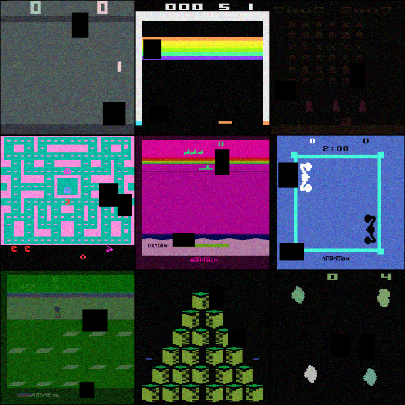
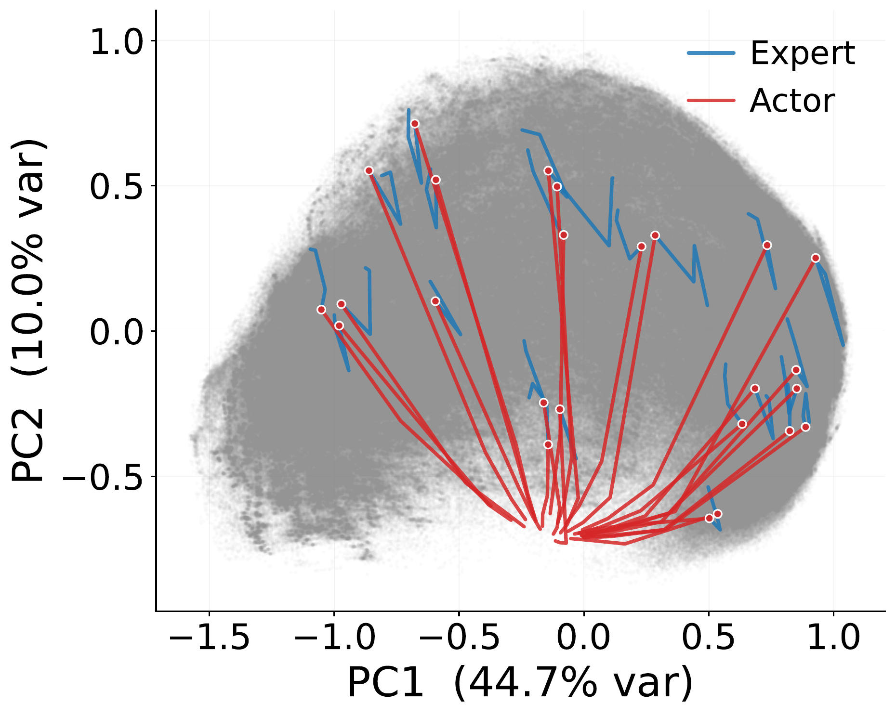
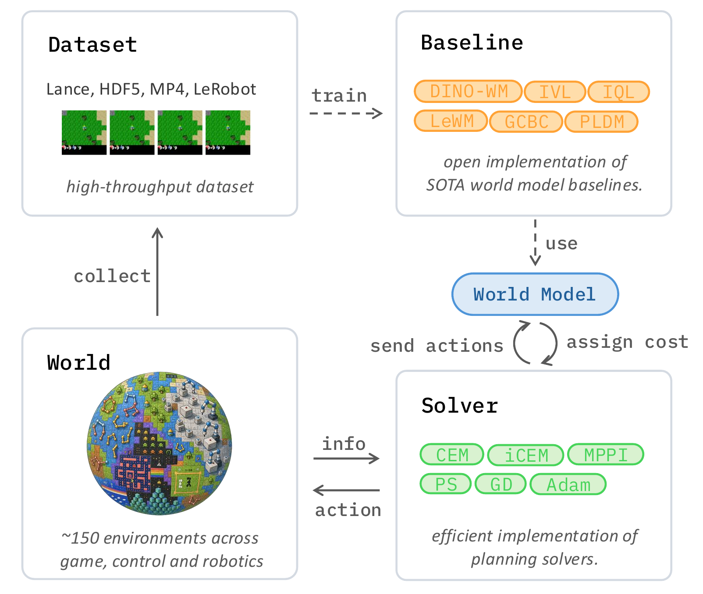
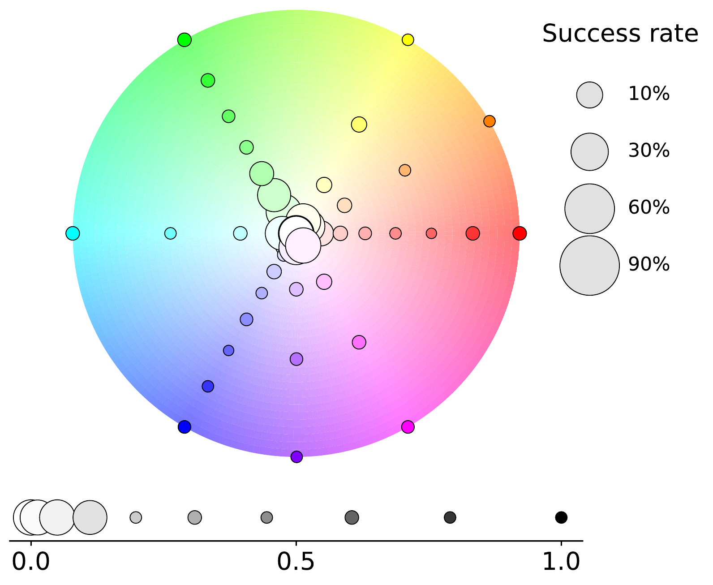

# stable-worldmodel: A Platform for Reproducible World Modeling Research and Evaluation

#

# 基本信息

- arXiv: [2605.21800](http://arxiv.org/abs/2605.21800v1)
- Authors: Lucas Maes, Quentin Le Lidec, Luiz Facury, Nassim Massaudi, Ayush Chaurasia, Francesco Capuano, Richard Gao, Taj Gillin, Dan Haramati, Damien Scieur, Yann LeCun, Randall Balestriero
- Categories: cs.LG, cs.RO

#

# 研究问题

世界模型开源平台统一数据、基线与评测

#

# 任务与挑战

当前世界模型研究高度碎片化：各实验室独立维护代码库、数据管道与评测协议，导致复现困难且难以公平对比。具体存在三大瓶颈：脆弱的临时代码库、视频数据加载缓慢造成的GPU饥饿，以及缺乏标准化的泛化与鲁棒性评测基准。这些问题严重阻碍了世界模型在推理、规划与泛化方面的可信进展。

为此，作者提出开源平台 stable-worldmodel（swm），基于 PyTorch 与 Gymnasium 构建，覆盖从数据采集、模型训练到系统评测的完整管线。其核心包含三大组件：（1）基于 Lance 的高性能数据层，原生支持 MP4、HDF5 与 LeRobot 数据集格式，实现高效的随机读取与云端流式传输；（2）经过充分测试的现代世界模型基线（如 DINO-WM、PLDM、LeWM、TD-MPC2）与规划求解器（CEM、MPPI、iCEM、梯度下降、GRASP 等）实现；（3）涵盖经典控制、MuJoCo、Atari、机器人操作与开放世界环境的评测套件，并引入可控的视觉、几何与物理变化因素（FoV），支持对动力学理解、控制性能与分布外泛化的系统化评估。

实验表明，Lance 数据格式在本地与 S3 远程存储上的吞吐率均显著优于 HDF5 与视频格式（本地可达 4,815 samples/sec）。在 Push-T 等机器人操作基准上，平台成功复现了已有基线的规划成功率。然而，系统性鲁棒性测试揭示了当前世界模型的严重脆弱性：即使在颜色、尺寸、形状等轻微视觉扰动下，规划成功率也大幅下降；且预测误差与规划成功之间的相关性较弱，说明分布外输入本身而非预测精度是失败的主因。

对从事具身智能与世界模型研究的学者而言，swm 不仅通过统一基础设施大幅降低了研究门槛与工程开销，更提供了标准化、可复现的评测框架，使得不同模型与规划器之间的公平比较成为可能。其引入的受控 FoV 评测体系为诊断模型在物理理解与视觉鲁棒性上的缺陷提供了有力工具，对推动面向机器人操作、运动控制与长程规划的高可靠性世界模型具有重要价值。

#

# 核心 Insight

这篇论文的核心价值需要结合原文继续复查。当前 fallback 笔记保留了日报分析、DeepResearch 草稿和已筛选图表，避免自动流程中断。

#

# 方法与公式

#

# 第一模块：一分钟核心速写

1. 论文领域：**WorldModel**

2. **TL;DR**: Lucas Maes 等人提出了一个基于 **Lance 列式存储** 与 **统一评估接口** 的开源平台 **stable-worldmodel (swm)**，以解决世界模型研究中代码碎片化、视频数据加载瓶颈与缺乏标准化泛化基准的痛点，在 Push-T 等任务上实现了数倍于 HDF5 的数据吞吐（本地 4,815 samples/sec），并系统量化了现有基线在视觉与物理分布偏移下的脆弱性。

3. **研究动机**: 现存方案最大的痛点是各实验室重复造轮子（例如 CEM 规划器在五年内被独立重复实现至少五次）、多模态轨迹加载导致 GPU 饥饿、以及标准基准仅在训练分布内测试，无法诊断模型是否真正学会了环境动态。本文的切入点非常巧妙：不提出新模型，而是做一个**全栈基础设施**，用高性能数据层和可控因素变化（FoV）把以往 ad-hoc 的鲁棒性分析变成标准化、可复现的实验。

   **核心机制**: 平台通过三个极简抽象（**World**、**Policy**、**Solver**）解耦环境交互、动作生成与规划优化；数据层采用 **Lance** 列式存储替代 HDF5/MP4，实现高吞吐随机访问与零拷贝；评估层引入**原生模拟器级（Native）**与**观测边界级（Wrapper）**的可控 FoV，支持对视觉、几何、物理属性进行系统化干预。

4. **关键数据**:
   - 最能证明有效性的一组核心数据：**Lance 本地加载吞吐达到 4,815 samples/sec**，是本地 HDF5（1,416）的 3.4 倍，S3 流式（3,184）更是远超 HDF5 S3（仅 9），同时磁盘占用保持适中。这直接证明了数据层瓶颈被有效消除，且平台成功复现了 DINO-WM 与 PLDM 的原始规划成功率。
   - 存疑的试验结果：**TD-MPC2 在 offline Push-T 上成功率仅 12%、OGB-Cube 仅 4%**，作者推测是生成 OOD action 导致 predictor 失效，但未提供严格的消融实验（如在相同 offline 数据上与其他方法的异常程度对比）。该结果与 TD-MPC2 作为 SOTA 方法的声誉反差极大，可能隐含实现或配置偏差，而非纯粹的方法论缺陷。

---

#

# 第二模块：核心架构解释

**swm** 的架构围绕“非侵入式标准化”哲学展开：不限制用户的模型结构与训练代码，但对数据、评估与规划进行强统一。整个流水线可分为四层：

**1. 数据层（Data Layer）**
- 采用 **Lance** 作为默认列式存储格式，支持快速随机访问、高压缩比、零拷贝与云对象存储流式读取。
- 提供一键转换工具，兼容 MP4、HDF5 与 **LeRobot** 数据集，允许研究者直接复用已有数据。
- 通过存储连续时间块（而非单帧文件）解决视频头冗余解码问题，消除 GPU 饥饿。

**2. 环境抽象层（World & FoV）**
- **World**：统一的环境包装器，基于 Gymnasium 接口，内置向量化执行（EnvPool）、渲染与日志记录。
- **Factors of Variation (FoV)**：每个原生环境暴露层次化的 `variation_space`，支持在 reset 时通过 `options` 参数对模拟器内部状态进行干预（如 `agent.color`、`physics.floor.friction`）。
- **Wrappers**：针对 Atari、Craftax 等黑盒环境，在观测边界施加视觉扰动（噪声、模糊、遮挡、色度键替换等），无需修改源码。

**3. 模型与策略层（Model & Policy）**
- **Policy**：统一接口 `get_actions(info)`，支持随机策略、专家策略、前馈策略（GCRL）与 **MPCPolicy**。
- **MPCPolicy**：将任意世界模型与 Solver 绑定，在每个时间步将当前观测编码为隐状态，委托 Solver 求解有限时域最优控制问题（Eq. 1）。
- 内置基线覆盖两大范式：
  - **GCRL**：GCBC、GCIQL、GCIVL（均使用冻结 DINOv2 编码）。
  - **Latent World Models**：DINO-WM（冻结编码器+ViT 预测器）、PLDM（JEPA+VICReg 正则）、LeWM（JEPA+SIGReg 单正则）、TD-MPC2（隐式奖励驱动模型）。

**4. 规划与控制层（Solver Layer）**
- 所有 Solver 通过世界模型的 `get_cost` 方法评估动作序列，分为两类：
  - **采样类（Zeroth-Order）**：CEM、iCEM、MPPI、Predictive Sampling、Categorical CEM，无需模型可微。
  - **梯度类（First-Order）**：Gradient Descent、PGD（离散动作简单形投影）、GRASP（并行优化虚拟中间状态）、Lagrangian（不等式约束）。
- 支持执行前 K 步后重新规划（MPC 闭环）。

**实验流程**：统一使用 **dataset-driven evaluation**，从同一轨迹中按固定时距 Δ=25 采样起始观测与目标观测，确保目标可达；每回合预算 B=50 步；规划器默认使用 CEM（L=30, N=300, E=30）。

**Python 风格伪代码（核心逻辑）**：

```python
import stable_worldmodel as swm

# 1. 实例化向量化世界，并声明可控 FoV

world = swm.World(
    env_name="swm/PushT-v1",
    num_envs=8,
    max_episode_steps=1000
)

# 2. 数据收集：使用专家策略，同时变化 agent 颜色与 block 尺寸

expert = swm.policy.LoadedPolicy("sac_pusht.pt")
world.set_policy(expert)
world.collect(
    dataset_path="pusht_expert.lance",
    episodes=5000,
    options={
        "variation": ["agent.color", "block.scale"]
    }
)

# 3. 用户自定义世界模型训练（以 LeWM 为例）

model = LeWorldModel(
    encoder=ViTEncoder(),
    predictor=TransformerPredictor()
)
model.train_from("pusht_expert.lance", epochs=100)

# 4. 构建 MPC 规划器：CEM Solver + MPCPolicy

planner = swm.solver.CEMSolver(
    model,
    horizon=5,
    n_candidates=300,
    n_elites=30,
    n_iterations=30
)
policy = swm.policy.MPCPolicy(planner)

# 5. OOD 评估：在视觉与几何扰动下测试零样本泛化

world.set_policy(policy)
metrics = world.evaluate(
    episodes=256,
    options={
        "variation": [
            "agent.color",
            "background.color",
            "agent.size",
            "block.shape"
        ]
    },
    video="videos/"
)
print(metrics["success_rate"])
```

---

#

# 第三模块：核心学术问答

Q1: 这篇论文试图解决什么核心问题？

A1: 世界模型研究目前极度碎片化：各实验室使用独立的代码库、数据管道和评估协议，导致重复实现、隐藏 bug 和结果不可复现。同时，多模态视频轨迹的数据加载存在严重的 I/O 瓶颈，且现有基准大多只在训练分布内测试，缺乏标准化的零样本泛化与鲁棒性诊断工具。本文旨在通过统一的全栈开源平台消除这些摩擦，使世界模型的训练与评估变得可复现、可对比、可扩展。

Q2: 作者提出的核心解决方案（创新点）是什么？

A2:
- **高性能 Lance 数据层**：用列式存储 Lance 替代 HDF5/MP4，解决多模态轨迹随机访问与吞吐瓶颈，提供一键格式转换与云流式支持。
- **解耦的三大抽象（World / Policy / Solver）**：在不限制用户模型架构的前提下，标准化环境交互、动作生成与规划求解接口，提供经过端到端测试的基线（DINO-WM、PLDM、LeWM、TD-MPC2 等）与规划器（CEM、MPPI、GRASP 等）。
- **可控因素变化（FoV）评估套件**：在原生模拟器层面（视觉、几何、物理参数）与观测边界层面（Wrapper 扰动）引入系统化干预，构建跨 Classic Control、MuJoCo、Atari、机器人操作与开放世界游戏的零样本泛化基准。

Q3: 实验设计的关键支撑（或巧妙之处/数据集特点）是什么？

A3:
- **统一数据源与协议**：所有基线在 Push-T 上使用 DINO-WM 发布的同一份专家数据集训练，评估采用 dataset-driven 协议（从轨迹中按固定 Δ=25 采样起始与目标观测），消除了“目标不可达”带来的歧义。
- **统一规划配置**：使用相同的 CEM 超参数（L=30, N=300, E=30, σ₀=1）和相同的执行预算（B=50 步）评估所有模型，确保性能差异来源于模型本身而非规划器调参。
- **分层 FoV 干预**：通过 `variation_space` 与 `extra_wrappers` 的组合，可以在不修改环境源码的情况下，独立或联合施加视觉、几何、物理扰动，实现从 in-distribution 到极端 OOD 的渐进式压力测试。

Q4: 这篇论文最显著的贡献点（Top 3）是什么？

A4:
- **开源平台统一了世界模型研究的全流程**（数据-训练-评估-规划），显著降低研究开销，并首次将 CEM、MPPI、GRASP 等求解器与多种世界模型在统一接口下实现与测试。
- **引入 Lance 数据格式解决多模态轨迹加载的 I/O 瓶颈**，本地吞吐提升至 HDF5 的 3.4 倍，S3 流式提升两个数量级，且保持合理的磁盘压缩率。
- **构建大规模、多领域、带可控 FoV 的基准套件**，首次系统性量化了现有世界模型（LeWM、PLDM、DINO-WM）在视觉与物理分布偏移下的脆弱性，证明当前模型远未达到鲁棒的零样本泛化。

Q5: 这项工作在哪些相关研究的基础上做了推进？（列举1-2个最核心的前置工作即可）

A5:
- **DINO-WM / PLDM / LeWM / TD-MPC2**：平台直接实现了这些近期世界模型基线，并在统一数据与评估协议下复现/对比了它们的性能，解决了这些工作各自代码库碎片化的问题。
- **LeRobot 与 Gymnasium**：平台与这些现有生态无缝集成，补充了它们所缺乏的世界模型专用组件（高效轨迹存储、模型预测控制求解器、标准化 FoV 评估）。

Q6: 客观评价：这篇论文的局限性、漏洞或"未讲明的故事"是什么？对后续科研有何启发？

A6:
- **局限性**：平台目前完全聚焦于仿真环境（sim-to-real 仅列为未来工作），缺乏在真实机器人硬件上的验证；此外，虽然支持在线训练循环，但论文中的核心实验均为 offline 设定，未充分探索在线世界模型训练（如 TD-MPC2 的在线交替采集-训练流程）在统一平台下的表现。
- **漏洞/未讲明的故事**：TD-MPC2 在 offline 设置下的异常低分（Push-T 12%）被归因于 OOD action，但论文未提供充分的诊断实验（例如，在相同数据上对比其他方法对 OOD action 的敏感度，或展示 TD-MPC2 在平台 online 模式下的恢复程度），这使得该结果的可解释性存疑，读者难以区分是模型缺陷还是平台实现/配置偏差。此外，论文明确指出**预测 MSE 与规划成功率几乎脱钩**（Fig. 4），但未深入探讨应如何重新设计训练目标或表示学习来对齐“预测准确性”与“规划可用性”，留下了关键的方法论空白。
- **后续启发**：世界模型社区需要超越“重建误差/预测误差”的单一优化目标，转而开发能够显式保证 latent dynamics 在分布偏移下保持物理一致性与时间稳定性的训练框架；同时，社区应采纳类似 swm 的标准化 OOD 评估协议，将鲁棒性测试从“可选加分项”变为“基础准入项”。

#

# 贡献拆解

- 关键术语：World Models, Model Predictive Control, Factors of Variation, Lance, JEPA
- 加权评分：4.25/5.0

#

# 关键图表解读



*Fallback selection because visual JSON selection failed.*



*Fallback selection because visual JSON selection failed.*



*Fallback selection because visual JSON selection failed.*



*Fallback selection because visual JSON selection failed.*

#

# 实验与消融

请优先核对主结果表、消融实验和真实/仿真任务设置；若图表已选中，应结合上方图片逐项复查。

#

# 局限性

当前自动精读未能成功调用完整图文生成模型，因此局限性需要结合原文实验设置进一步人工确认。

#

# 个人研究判断

若该论文与 World Models assisting Embodied AI、VLA、robot policy 或 sim-to-real 强相关，建议进入人工精读队列。
