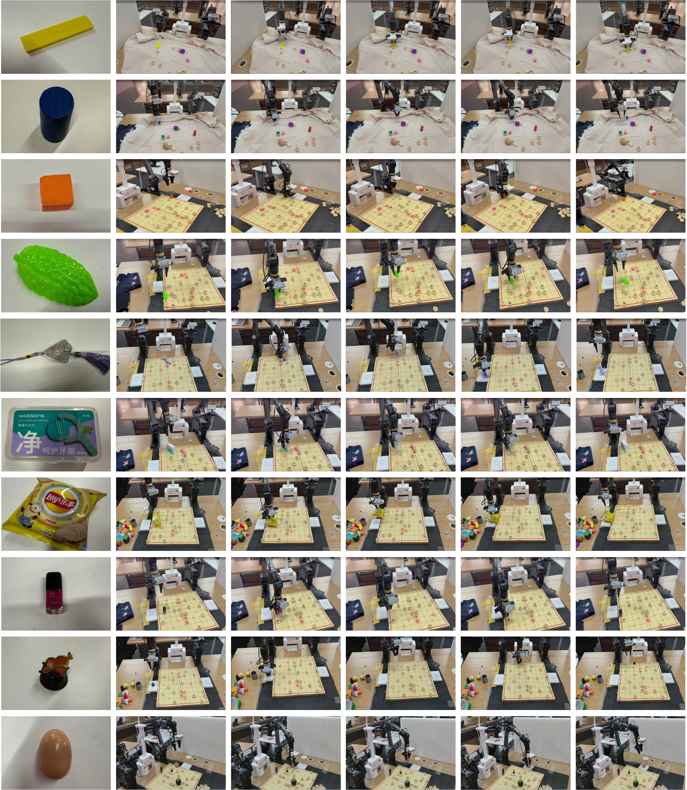
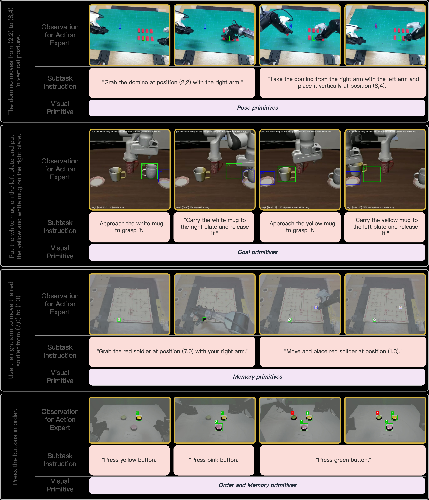
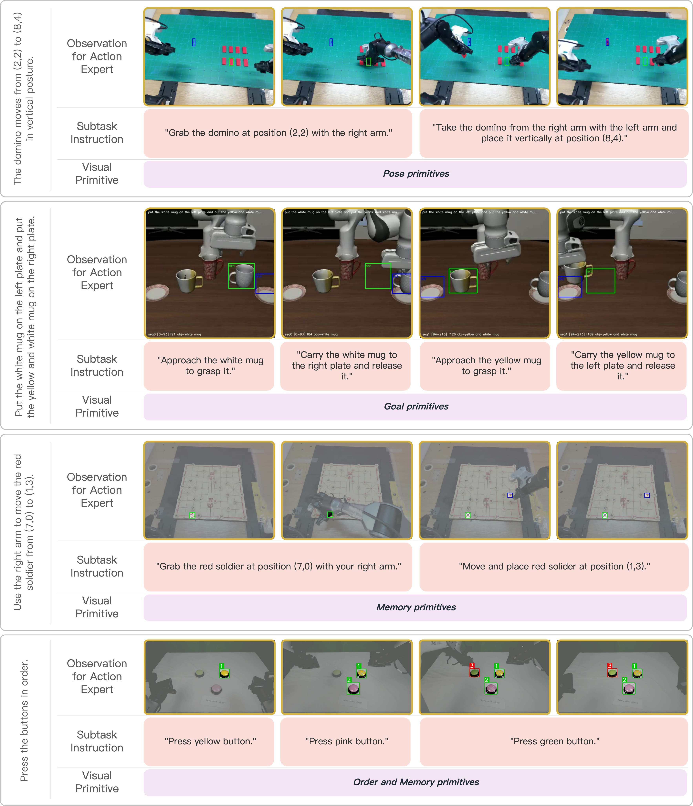
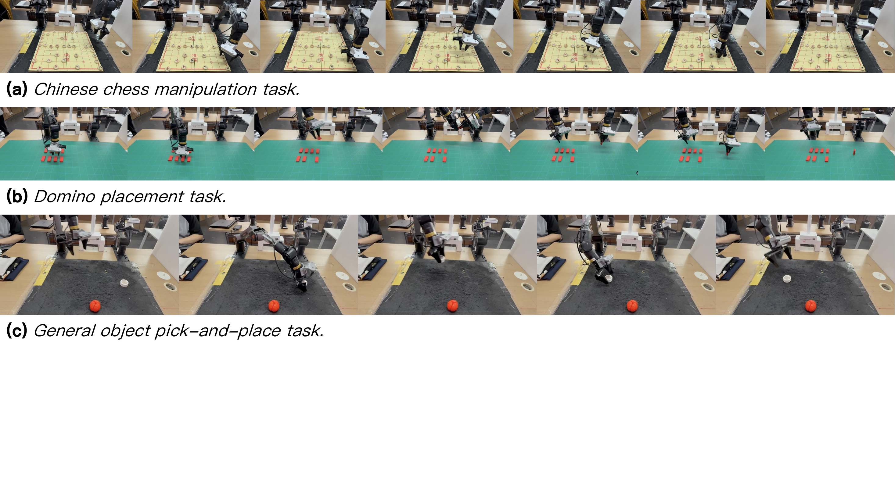

# Action with Visual Primitives

#

# 基本信息

- arXiv: [2605.22183](http://arxiv.org/abs/2605.22183v1)
- Authors: Weilong Guo, Yuchen Wang, Renping Zhou, Yunfeng Zhang, Rui Fang, Yue Meng, Wenda Xu, Yuan He, Gao Huang
- Categories: cs.RO, cs.AI

#

# 研究问题

视觉基元解耦VLA推理与动作生成

#

# 任务与挑战

当前Vision-Language-Action（VLA）模型通常将语言指令与视觉观测直接映射为动作，导致指令理解、空间场景感知与运动控制纠缠在单一学习目标中。这种耦合迫使动作专家隐式地重新学习预训练VLM已具备的认知与感知能力，不仅降低了数据效率，也限制了模型在物体、布局或环境变化时的泛化性能。现有工作尝试通过子任务语言描述或外部视觉提示来缓解该问题，但纯语言接口难以传递细粒度空间信息，而依赖外部感知模型（如SAM）的级联方案则会引入显著的推理延迟与误差累积。

本文提出AVP（Action with Visual Primitives），一种端到端的VLA架构，通过视觉基元中心接口显式解耦VLM与动作专家的学习职责。具体而言，VLM首先解析当前子任务并推断下一阶段目标，随后通过自回归解码器生成离散化的视觉基元（如点、边界框等）；这些基元被投影到视觉token空间后，作为显式条件驱动基于流匹配（flow-matching）的动作专家生成机器人动作。关键创新在于，视觉基元的监督信号完全来源于末端执行器运动学——通过检测夹爪状态变化提取交互关键帧，结合相机内外参将三维位姿投影至图像平面，自动生成空间锚点标签，无需任何外部感知模型或人工标注。

在真实机器人实验（AgileX Piper双臂平台）中，AVP在中国象棋精细操作、多米诺定向放置及通用物体拾取放置任务上均显著优于基线。与π_0.5相比，AVP在通用拾取放置任务上的成功率提升27.61%，在中国象棋任务上平均成功率达90.28%（π_0.5为62.67%）。更重要的是，AVP展现出强大的空间组合泛化能力：在仅见过间接路径（A→C→B）的训练数据上，能够零样本执行直接转移（A→B）；同时，在仅由中国象棋数据训练的模型上，实现了对45种未见物体及不同背景的零样本跨域迁移，而π_0.5在此类分布偏移下严重退化。

该工作为VLA架构设计提供了重要启示：轻量级视觉基元作为中间表示，既保留了端到端联合优化的优势，又避免了外部模块的延迟与脆弱性。其基于运动学的自监督标注管线几乎不增加数据成本，具备良好的可扩展性。对于关注世界模型辅助具身智能的读者，AVP展示了如何将高层任务推理与低层运动控制解耦，并为构建可泛化、数据高效的机器人策略提供了实用框架。

#

# 核心 Insight

这篇论文的核心价值需要结合原文继续复查。当前 fallback 笔记保留了日报分析、DeepResearch 草稿和已筛选图表，避免自动流程中断。

#

# 方法与公式

#

# 第一模块：一分钟核心速写

1. **论文领域**：VLA

2. **TL;DR**：作者提出了一种基于**视觉原语（Visual Primitives）**的端到端 VLA 架构 **AVP**，让 VLM 内部自回归生成离散视觉原语 token 来显式条件化 flow-matching 动作专家，以解决现有 VLA 中**指令理解、空间感知与运动控制纠缠在单一学习目标**导致的效率低与泛化差的问题，在真实机器人拾取放置任务上比 $\pi_{0.5}$ 提升 **27.61%** 的平均成功率。

3. **研究动机**：现存方案最大的痛点是，VLM 已经具备的语义与空间推理能力，在标准 VLA 中被迫与动作生成纠缠，动作专家不得不在隐式特征里重新“学会”这些认知能力；而 Point-VLA / VP-VLA 等外部视觉提示方法虽引入空间 grounding，却造成多阶段级联延迟与误差累积。本文的切入点极其直接：**把 VLM 和动作专家的职责彻底解耦**，让 VLM 用视觉原语“告诉”动作专家目标在哪里，动作专家只负责“如何执行”；更巧妙的是，视觉原语的监督标签并非来自外部感知模型，而是**直接从末端执行器运动学自动提取**，实现零额外标注成本。

4. **核心机制**：在单一 VLA 内部，VLM 先推理下一阶段子任务并自回归预测离散化的视觉原语（点、框、掩码等），该原语被投影为视觉 token 后与原始观测融合，形成对 flow-matching 动作专家的显式条件；整个流程端到端可导，无需任何外部检测器或 API 调用。

5. **关键数据**：
   - **最能证明有效性的数据**：中国象棋操控任务平均成功率 **90.28%**（Ours） vs **62.67%**（$\pi_{0.5}$），提升 **27.61%**。理由：这是论文反复强调的主实验结果，覆盖指令跟随（98.61% vs 74.00%）、抓取（90.28% vs 72.00%）与放置（81.94% vs 42.00%）三项指标，且在完全相同的机器人本体、数据与评估协议下获得，说服力最强。
   - **存疑的试验结果**：通用物体拾取放置任务中 $\pi_{0.5}$ 的放置成功率仅 **23.08%**（Table 4），而 AVP 为 68.29%。理由：该基线数值异常低，远低于其在中国象棋（42%）和多米诺（64.58%）上的表现，论文未充分解释此断崖式下跌是否源于任务设计对基线特别不利（如动作空间适配问题），存在对比公平性的潜在疑问。

---

#

# 第二模块：核心架构解释

#

## 模型架构与流程

AVP 的核心是建立一个**视觉原语为中心的通信接口**，将 VLM 的“高层决策”与动作专家的“低层执行”显式分离。整体架构包含三个可学习模块：预训练 VLM、自回归视觉原语解码器（Visual-Primitive Decoder）、以及 flow-matching 动作专家。

**前向流程如下**：

1. **多模态编码**：给定语言指令 $l$、多视角图像观测 $o_t$ 和机器人本体状态 $s_t$，VLM 提取多模态上下文 token。
2. **视觉原语预测**：视觉原语解码器 $D_\psi$ 以 VLM 输出为条件，**自回归地**预测离散化的视觉原语 $p_t$（例如目标点的网格坐标或边界框参数）。
3. **视觉空间投影**：将离散原语 $p_t$ 投影回视觉 token 空间，得到 $z_t^{vp} = \mathrm{Proj}(p_t, o_t)$。这一步相当于在潜在视觉空间“画出”空间标记。
4. **特征融合与动作生成**：将 $z_t^{vp}$ 与原始多模态 token 融合为增强表示 $z_t^{aug}$，送入 flow-matching 动作专家 $\pi_\theta$，预测未来动作序列 $a_{t:t+h}$。

**监督与损失**：

- **动作损失** $\mathcal{L}_{act}$：标准的 flow-matching 动作预测损失。
- **视觉原语损失** $\mathcal{L}_{vp}$：对预测原语 $p_t$ 与伪标签 $y_t^{vp}$ 做交叉熵。伪标签的生成完全**脱离外部感知模型**：
  - 通过检测夹爪状态变化 $|\Delta g_t| > \delta$ 提取交互关键帧；
  - 读取该时刻末端执行器 3D 位置 $P_t$；
  - 利用相机内参 $K$ 与外参 $T_R^C$ 投影到 2D 图像平面 $(u_t, v_t)$；
  - 离散化为网格标签 $y_t^{vp}$。
- **总损失**：$\mathcal{L} = \mathcal{L}_{act} + \lambda \mathcal{L}_{vp}$。

#

## 实验流程

论文在 AgileX Piper 双臂桌面平台上开展真实机器人实验，动作空间统一为 14 维。所有对比方法在相同本体、相同训练数据与相同评估协议下复现。

- **任务一：中国象棋操控**（主任务）。棋子密集且视觉相似，要求精确覆盖棋盘交叉点。训练数据 11.2 小时，评估 72 条指令序列。
- **任务二：多米诺放置**。评估带水平/垂直朝向约束的精细双臂操作，额外报告朝向成功率。
- **任务三：通用物体拾取放置**。评估跨物体外观与几何形状的泛化。
- **泛化测试**：
  - **空间组合泛化**：训练时仅见分解路径（$A \to C \to B$），测试时要求直接路径（$A \to B$）。
  - **跨域零样本泛化**：仅在中国象棋数据上训练，直接在 45 个未见物体、不同背景上测试。

#

## Python 风格伪代码

```python
class AVP:
    def __init__(self):
        self.vlm = PretrainedVLM()               

# 预训练 VLM

        self.vp_decoder = AutoregressiveDecoder() 

# 视觉原语解码器

        self.projector = PrimitiveProjector()     

# 原语 -> 视觉 token 投影

        self.action_expert = FlowMatchingActionExpert()
        self.lambda_vp = 1.0

    def forward(self, obs_img, instruction, proprio_state):
        

# 1. VLM 提取多模态上下文

        multimodal_tokens = self.vlm(obs_img, instruction)
        
        

# 2. 自回归预测离散视觉原语 (e.g., 网格坐标或框参数)

        vp_logits = self.vp_decoder(multimodal_tokens)
        vp_pred = sample(vp_logits)  

# 训练时用 gumbel/straight-through, 推理时 argmax

        
        

# 3. 投影为视觉原语 token 并与原始观测融合

        vp_tokens = self.projector(vp_pred, obs_img)
        aug_tokens = fuse(multimodal_tokens, vp_tokens)
        
        

# 4. 动作专家生成动作序列

        action = self.action_expert(aug_tokens, proprio_state)
        return action, vp_pred

    def compute_loss(self, obs, instr, state, action_gt, vp_gt):
        action_pred, vp_pred = self.forward(obs, instr, state)
        loss_act = flow_matching_loss(action_pred, action_gt)
        loss_vp = cross_entropy(vp_pred, vp_gt)
        return loss_act + self.lambda_vp * loss_vp


# ============================================================

# 离线视觉原语监督生成（零外部标注）

# ============================================================

def generate_kinematic_vp_labels(trajectory, K, T_R_C, delta=0.1, grid_size=32):
    """
    trajectory: 包含 gripper_state 和 end_effector_pose 的列表
    K: 相机内参 [3,3]
    T_R_C: 机器人基座到相机的外参 SE(3)
    """
    labels = []
    for t in range(1, len(trajectory)):
        g_t = trajectory[t].gripper_state
        g_prev = trajectory[t-1].gripper_state
        
        

# 1. 检测夹爪状态突变关键帧

        if abs(g_t - g_prev) > delta:
            P_t = trajectory[t].end_effector_pos  

# 3D 位置 (base frame)

            
            

# 2. 投影到图像平面

            P_cam = T_R_C @ np.append(P_t, 1.0)
            uv1 = K @ P_cam[:3]
            u, v = uv1[:2] / uv1[2]
            
            

# 3. 离散化为网格标签

            grid_u = int(u // (image_width / grid_size))
            grid_v = int(v // (image_height / grid_size))
            labels.append((grid_u, grid_v))
    return labels
```

---

#

# 第三模块：核心学术问答

Q1: 这篇论文试图解决什么核心问题？

A1: 现有 VLA 架构将语言指令理解、空间场景理解与低层运动控制纠缠在单一学习目标中，导致动作专家被迫在隐式特征层面重新学习 VLM 已具备的感知与推理能力，限制了数据效率与泛化性能；同时，依赖外部大模型或 SAM 生成视觉提示的方法引入多阶段级联延迟与误差累积。本文旨在通过一种显式的、端到端可学的视觉原语接口，解耦 VLM 的“决策”与动作专家的“执行”，从而提升真实机器人操控的样本效率、空间精度与跨域泛化能力。

Q2: 作者提出的核心解决方案（创新点）是什么？

A2: 作者提出 AVP 架构，其核心创新包含三点：
- **内部视觉原语解码器**：在 VLA 内部自回归预测离散视觉原语（点、框、掩码等），完全替代外部感知模型，消除级联误差与 API 延迟。
- **视觉原语-动作专家显式接口**：将预测的原语投影为视觉 token 并与原始观测融合，作为 flow-matching 动作专家的条件，显式分离“做什么/在哪里”与“如何执行”。
- **运动学驱动的自动监督**：利用末端执行器运动学自动提取交互关键帧并投影到图像平面，生成视觉原语的伪标签，实现零额外人工或模型标注成本的端到端训练。

Q3: 实验设计的关键支撑（或巧妙之处/数据集特点）是什么？

A3: 实验设计的巧妙之处体现在：
- **中国象棋密集场景**：棋子视觉相似且棋盘交叉点密集，对细粒度空间推理构成极端考验，能有效区分“真空间理解”与“粗略记忆”。
- **空间组合泛化测试**：训练时强制模型仅见分解路径（$A \to C \to B$），测试时要求直接执行未见过的 $A \to B$ 过渡，迫使模型验证是否真正掌握可组合的子轨迹，而非过拟合训练分布。
- **跨域零样本测试**：模型仅在中国象棋数据上训练，直接在 45 个未见物体及不同背景上评估，检验视觉原语是否实现了物体无关的空间迁移。
- **严格受控对比**：与 $\pi_{0.5}$ 等基线共享完全相同的机器人本体、训练数据量与评估协议，最大程度排除无关变量干扰。

Q4: 这篇论文最显著的贡献点（Top 3）是什么？

A4:
- [贡献1] 提出视觉原语作为 VLM 与动作专家之间的显式通信协议，将高层语义推理与低层运动控制解耦，使动作专家专注于可迁移的运动技能而非重复学习感知能力。
- [贡献2] 实现完全端到端的视觉原语预测与动作学习，无需外部检测器或分段模型，避免多阶段误差累积和推理延迟，同时通过运动学自动提取监督实现零额外标注成本。
- [贡献3] 在真实机器人上验证，相比 $\pi_{0.5}$ 提升 27.61% 成功率，并在空间组合泛化和跨域物体迁移上展现显著优势，证明视觉原语接口对数据效率和泛化性的实际价值。

Q5: 这项工作在哪些相关研究的基础上做了推进？（列举1-2个最核心的前置工作即可）

A5:
- [前置工作1] $\pi_{0.5}$：采用 flow-matching 动作专家的 VLA 基线，但使用隐式特征接口。AVP 直接在其框架上构建，保留 flow-matching 动作专家，但将接口替换为显式视觉原语，实现职责解耦。
- [前置工作2] Point-VLA / VP-VLA：首次将视觉提示（点、框）作为 VLA 中间表示，但依赖外部大模型或 SAM 生成提示，造成级联延迟和误差。AVP 将此外部流程内部化并端到端联合优化，消除了外部依赖。

Q6: 客观评价：这篇论文的局限性、漏洞或"未讲明的故事"是什么？对后续科研有何启发？

A6: 局限性与未讲明的故事包括：
- **视觉原语表达能力边界**：当前原语局限于点、框、掩码等简单几何形式，对于需要复杂接触面推理或形变操作的任务，其表达能力可能不足；论文未讨论当任务需要多指灵巧手或接触姿态（contact pose）时，原语应如何扩展。
- **运动学监督的隐含假设**：自动监督假设交互关键帧可通过夹爪状态变化可靠检测，且末端执行器 3D 位置即为任务相关空间锚点；对于接触-rich 或柔性物体操作（如推、拉、折叠），该假设可能失效，论文未在此类任务上验证。
- **推理延迟与计算开销**：AVP 的推理延迟为 0.27s，虽远低于 Point-VLA 的 37.32s，但仍高于 $\pi_{0.5}$ 的 0.16s；在需要高频控制（>10Hz）的任务中，额外的原语解码与投影开销可能成为瓶颈，论文未对此做量化分析。
- **基线性能异常**：通用物体任务中 $\pi_{0.5}$ 放置成功率仅 23.08%，论文未充分解释此断崖式下跌的具体原因，读者难以判断该提升在多大程度上源于 AVP 的优越性，而非基线在该特定任务上的实现缺陷。
- **任务范围局限**：实验集中在拾取放置类任务，对非抓握操作（如滑动、工具使用）及长程多阶段任务（原语需跨帧记忆与更新）的验证有限。

对后续科研的启发：
- 视觉原语可沿时间轴扩展为动态序列或记忆增强形式，以支持长程任务；同时，可将视觉原语与物理约束（如接触法向、摩擦力锥）结合，实现更精细的接触面原语。
- 该工作表明，VLA 中“显式通信接口”的设计可能比单纯堆叠模型参数更能有效提升数据效率与泛化，提示社区重新关注模型内部职责划分与中间表示学习，而非一味追求端到端黑箱 scaling。

#

# 贡献拆解

- 关键术语：Vision-Language-Action, Visual Primitives, Flow Matching, Kinematic Supervision, Robotic Manipulation
- 加权评分：4.15/5.0

#

# 关键图表解读



*Fallback selection because visual JSON selection failed.*



*Fallback selection because visual JSON selection failed.*



*Fallback selection because visual JSON selection failed.*



*Fallback selection because visual JSON selection failed.*

#

# 实验与消融

请优先核对主结果表、消融实验和真实/仿真任务设置；若图表已选中，应结合上方图片逐项复查。

#

# 局限性

当前自动精读未能成功调用完整图文生成模型，因此局限性需要结合原文实验设置进一步人工确认。

#

# 个人研究判断

若该论文与 World Models assisting Embodied AI、VLA、robot policy 或 sim-to-real 强相关，建议进入人工精读队列。
