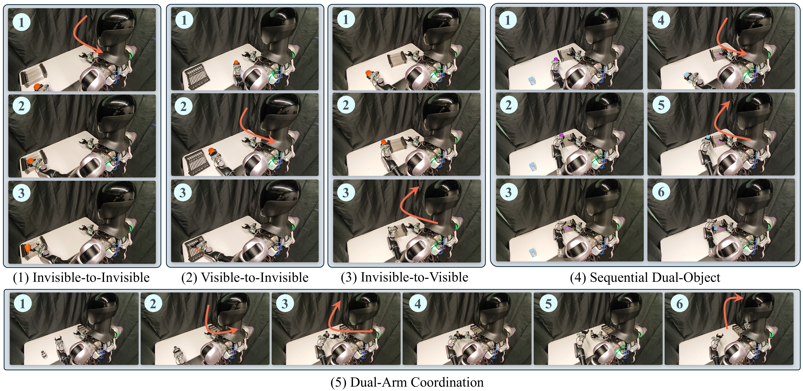
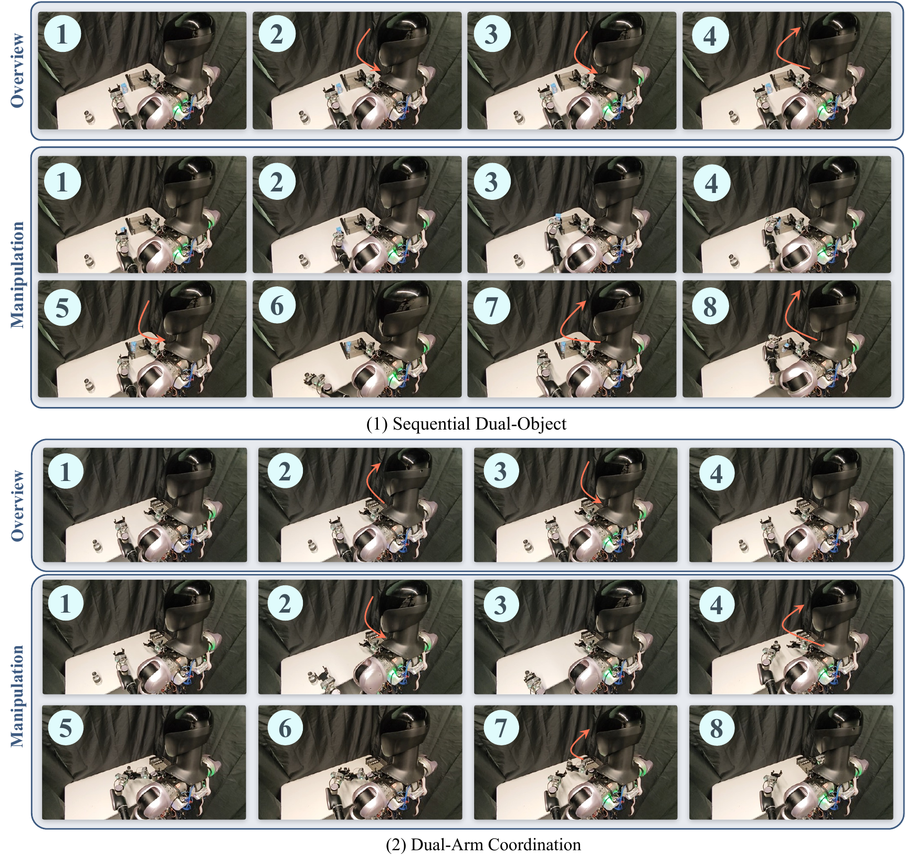
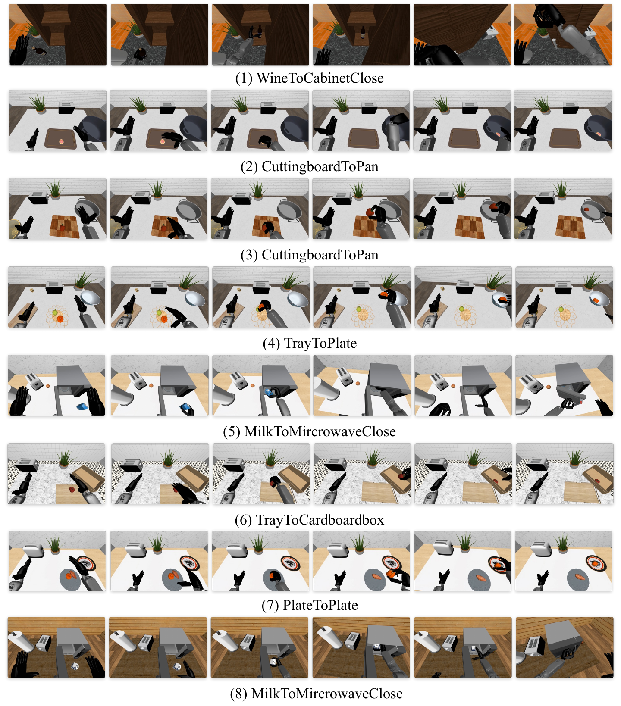
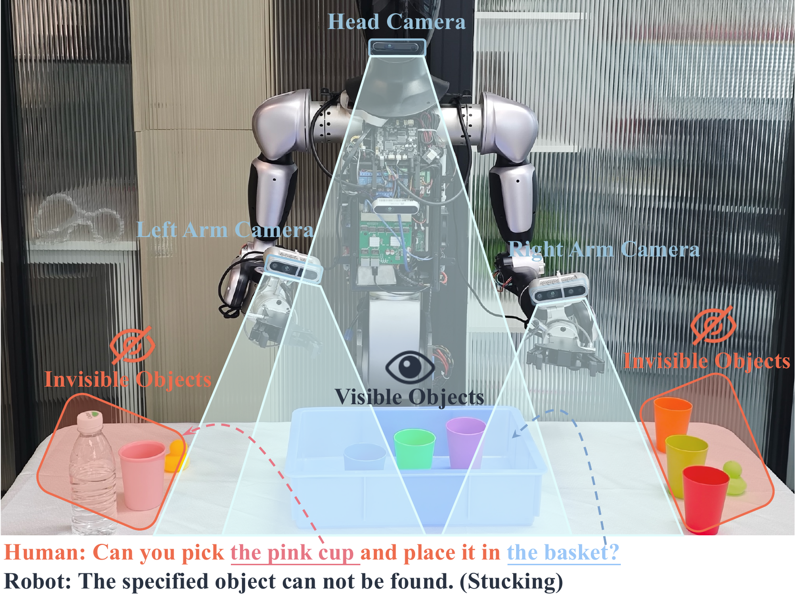

# Spatial Memory for Out-of-Vision Manipulation in Vision-Language-Action

#

# 基本信息

- arXiv: [2605.22283](http://arxiv.org/abs/2605.22283v1)
- Authors: Pengteng Li, Weiyu Guo, He Zhang, Tiefu Cai, Xiao He, Yandong Guo, Hui Xiong
- Categories: cs.RO

#

# 研究问题

为VLA引入持久空间记忆实现视野外操作

#

# 任务与挑战

现有视觉-语言-动作（VLA）模型大多隐含假设任务相关物体始终可见，导致目标离开相机视场时产生脆弱的反应式行为。本文针对这一“视野受限”难题，提出SOMA框架，通过可移动头部相机获取多视角观测，构建持久化的空间-语义记忆，使机器人能够在当前视觉平截头体之外进行推理与操作。

SOMA包含三个核心组件：首先是空间记忆构建（Spatial Memory Construction），在操作前若目标不可见，机器人主动扫描场景，利用YOLO-World进行实例检测与语义提取、DINOv3获取外观先验、VGGT估计几何与相机位姿，将多视角信息融合为统一的全局空间-语义记忆；其次是动态记忆精化（Dynamic Memory Refinement），在交互过程中通过语义相似度与动态融合分数计算自适应更新系数，以指数移动平均方式融合新观测，保持记忆的全局一致性；最后是上下文记忆检索（Contextual Memory Retrieval），通过交叉注意力将指令相关的空间线索注入VLM的多模态表征，再经DiT块与动作解码器生成动作片段。

实验在五个真实世界视野外（OOV）操作任务上进行，涵盖单臂/双臂、单步/多步场景。结果表明，SOMA不仅显著优于GR00T-N1.5、StarVLA和SpatialVLA等基线，还诱导出定性不同的行为模式：首次注视时间、头部搜索路径、视角修正次数和抓取尝试次数均减少40%–60%，实现近单次抓取。消融实验表明，单纯的扫描探索不足以解决OOV问题，持久记忆及其动态更新是性能提升的关键。此外，在RoboCasa Tabletop GR1和SimplerEnv的完全可观测设置中，SOMA仍取得最优或次优表现（如GR1上300 demo平均成功率52.0%），验证了空间记忆在常规场景下的普适价值。

对关注具身智能与世界模型的读者而言，SOMA的意义在于突破了VLA“仅依赖瞬时视觉”的瓶颈，将感知范式从反应式提升为记忆引导式。其模块化设计可与现有VLM backbone无缝集成，并在小样本场景下展现出强样本效率。该工作为构建具备持久环境状态表征、能在部分可观测条件下完成长程操作的通用机器人系统提供了重要技术路径。

#

# 核心 Insight

这篇论文的核心价值需要结合原文继续复查。当前 fallback 笔记保留了日报分析、DeepResearch 草稿和已筛选图表，避免自动流程中断。

#

# 方法与公式

#

## 第一模块：一分钟核心速写

**论文领域**：VLA

**TL;DR**：本文作者提出了一种基于持久空间-语义记忆的VLA框架 **SOMA**，以解决现有VLA模型隐含假设目标物体始终可见、导致视野外（Out-of-Vision, OOV）操作时必然失效的痛点，在五个真实世界OOV操作任务及RoboCasa GR1、SimplerEnv模拟基准上实现了显著的成功率提升与定性行为改变（更快定位、更少搜索、近一次抓取）。

**研究动机**：现存VLA绝大多数基于固定视角或反应式感知，其核心缺陷在于**view-bound assumption**——默认指令中的物体在决策时刻一定位于当前相机视野内。一旦目标被遮挡或离开视锥，模型既无历史观测留存，也无法进行物理 grounded 的空间推理，只能盲目探索或失败。本文的切入点非常直接：不依赖MLLM内部脆弱的空间先验推理，而是**通过可移动头部相机主动扫描，显式构建并维护一个持久、全局、可查询的3D空间-语义记忆**，使VLA的感知从“瞬时反应”转变为“记忆中心的推理”。

**核心机制**：SOMA的本质创新是一个**对象级空间-语义记忆令牌（object-centric spatial-semantic memory tokens）**的构建-更新-检索流水线。它通过离线扫描聚合多视角观测为全局记忆，在操作过程中以**自适应相似性感知融合（similarity-aware EMA）**动态修正记忆，最后通过**交叉注意力**将指令相关的空间线索选择性注入DiT动作解码器，实现视野外的目标定位与操作。

**关键数据**：

- **最能证明有效性的核心数据**：在RoboCasa Tabletop GR1基准的300 demos设置下，SOMA平均成功率达到**52.0%**，相比同骨干的GR00T N1.5（**44.3%**）提升7.7个百分点；在SimplerEnv Visual Matching设置下，SOMA平均成功率**63.2%**，大幅超过GR00T N1.5的**45.0%**。这组数据来自标准模拟基准、跨方法对比，且SOMA在30-shot低数据下（48.3%）即可超越GR00T全数据表现，证明空间记忆提供了更强的结构化归纳偏置与样本效率。

- **存疑的试验结果**：真实世界OOV任务中每任务仅评估**20个episode**（Figure 3 caption），样本量过小，成功率的统计置信度有限；此外，在RoboCasa全数据（Full）设置下，SOMA平均成功率**49.3%**对比GR00T N1.5的**45.9%**，优势收窄至3.4%，且在个别类别（如Cooking Preparation Full: 46.4% vs GR00T 49.2%）未超越基线，说明在完全可观测、数据充足时，空间记忆的边际收益显著递减。同时，SimplerEnv的Open/Close Drawer任务中SOMA表现（VM 31.5%, VA 25.4%）远低于其自身在Pick Coke Can上的表现，暗示该机制对需精确状态交互的任务帮助有限。

---

#

## 第二模块：核心架构解释

SOMA的整体流程分为三个阶段：**Spatial Memory Construction**（扫描构建全局记忆）、**Dynamic Memory Refinement**（在线动态修正记忆）、**Contextual Memory Retrieval**（指令感知的记忆检索与动作生成）。

**1. Spatial Memory Construction（空间记忆构建）**

在操作前，若轻量检测器发现指令目标不在当前视野，机器人触发头部相机沿预设轨迹扫描。对扫描视频均匀采样帧后，每帧通过三条并行感知流处理：
- **几何流**：VGGT预测相机位姿与场景几何先验；
- **检测流**：YOLO-World输出2D检测框与类别；
- **外观流**：DINOv3提取特征图，经空间平均池化得到实例级外观嵌入 $\mathbf{f}_j^{(i)} \in \mathbb{R}^C$。

每个2D检测框借助VGGT的位姿被提升到全局3D坐标系，得到3D包围盒 $\mathbf{b}_j^{(i)} \in \mathbb{R}^{8 \times 3}$。跨帧实例通过**类内联合外观-几何相似度**进行关联：计算DINOv3嵌入的余弦相似度与3D空间一致性，超过阈值即合并，外观与几何均取平均。最终得到 $N_I$ 个全局实例，每个实例编码为统一记忆令牌：


```math
\mathbf{m}_k^0 = \Phi_{\text{mem}}(\mathbf{f}_k) + \Phi_{\text{pos}}(\mathbf{b}_k)
```


集合 $\mathcal{M}_0 = \{\mathbf{m}_k^0\}_{k=1}^{N_I}$ 即为初始场景记忆。

**2. Dynamic Memory Refinement（动态记忆修正）**

操作过程中，头部相机新观测 $o_h^t$ 经同样编码得到当前记忆令牌 $\mathcal{M}_t = \{\mathbf{m}_j^t\}$。对每一观测实例，在同类别的历史记忆 $\mathcal{M}_{t-1}$ 中寻找匹配。匹配后计算两个门控分数：
- 语义相似度 $s_{kj}^t = \sigma(\Phi_{\text{sim}}([\mathbf{m}_k^{t-1} - \mathbf{m}_j^t]))$
- 动态融合分数 $g_{kj}^t = \sigma(\Phi_{\text{fuse}}([\mathbf{m}_k^{t-1}, \mathbf{m}_j^t]))$

二者乘积构成自适应更新系数 $\alpha_{kj}^t = g_{kj}^t \cdot s_{kj}^t$，记忆通过EMA更新：


```math
\mathbf{m}_k^t = \alpha_{kj}^t \, \mathbf{m}_j^t + (1 - \alpha_{kj}^t) \, \mathbf{m}_k^{t-1}
```


未匹配的新实例直接追加，未匹配的旧实例保留以处理遮挡。输出为当前精炼记忆 $\hat{\mathcal{M}}_t$。

**3. Contextual Memory Retrieval（上下文记忆检索）**

将VLM输出的视觉-语言令牌 $\mathbf{X}_{\text{vl}}$ 作为Query，记忆 $\hat{\mathcal{M}}_t$ 经 $\Phi_{\text{align}}$ 对齐到VLM空间后作为Key/Value，执行交叉注意力：


```math
\mathbf{X}_{\text{boost}} = \text{softmax}\left(\frac{\mathbf{Q}\mathbf{K}^\top}{\sqrt{C}}\right)\mathbf{V}
```


增强后的 $\mathbf{X}_{\text{boost}}$ 作为全局空间-语义先验注入DiT块，与原始视觉-语言令牌、机器人状态及噪声动作嵌入共同经DiT与动作解码器，预测未来 $H$ 步的动作块。

**实验流程**

- **真实世界**：自研人形平台（双7-DoF Realman ZM73臂 + 2-DoF主动头），头部与双腕搭载RealSense D435。每任务采集400条VR遥操作演示，扫描阶段用于构建记忆，操作阶段用于训练。训练使用32张NVIDIA H200，batch size 60，共30k步；推理在RTX 4090上执行，通过轻量检测器触发扫描。
- **模拟**：RoboCasa Tabletop GR1（24项桌面人形操作）与SimplerEnv Fractal suite（Google Robot任务，含Visual Matching与Variant Aggregation两种协议）。

**核心伪代码**

```python
import torch
import torch.nn as nn

class SOMA:
    def __init__(self):
        

# 外部感知模型（冻结或预训练）

        self.vggt = VGGT()          

# 几何与位姿

        self.yolo = YOLOWorld()     

# 2D检测

        self.dinov3 = DINOv3()      

# 外观特征

        
        

# 可学习模块

        self.phi_pos = MLP(in_dim=24, out_dim=384)      

# 3D bbox -> pos emb

        self.phi_mem = MLP(in_dim=384, out_dim=384)     

# 外观 -> memory空间

        self.phi_sim = MLP(in_dim=384, out_dim=1)       

# 相似度打分

        self.phi_fuse = MLP(in_dim=768, out_dim=1)      

# 融合打分

        self.phi_align = MLP(in_dim=384, out_dim=vlm_dim)
        self.cross_attn = CrossAttention(d_model=vlm_dim, n_heads=32)
        self.dit = DiTActionDecoder(...)

    def construct_memory(self, scan_frames, sample_interval=20):
        """
        Spatial Memory Construction: 从扫描视频构建全局记忆 M0
        """
        instances = []  

# [(f_emb, cls, bbox3d), ...]

        
        for frame in scan_frames[::sample_interval]:
            pose, geometry = self.vggt(frame)           

# 全局位姿

            detections = self.yolo(frame)                 

# 2D框+类别

            feat_map = self.dinov3(frame)                 

# HxWxC

            
            for det in detections:
                

# 实例外观特征: spatial average pooling

                crop = roi_align(feat_map, det.bbox)
                f_emb = crop.mean(dim=(0, 1))             

# f_j ∈ R^C

                
                

# 2D -> 3D 提升

                bbox3d = lift_2d_to_3d(det.bbox, geometry, pose)  

# 8x3

                instances.append((f_emb, det.cls, bbox3d))
        
        

# 类内跨视角融合（外观+几何相似度阈值关联）

        fused_instances = fuse_by_similarity(instances, thresh=0.7)
        
        M0 = []
        for f_k, c_k, b_k in fused_instances:
            p_k = self.phi_pos(b_k.view(-1))            

# Φ_pos(b_k), b_k展平为24维

            m_k = self.phi_mem(f_k) + p_k               

# m_k^0 = Φ_mem(f) + p

            M0.append(m_k)
        
        return torch.stack(M0)                          

# [N_I, C]

    def refine_memory(self, M_prev, obs_frame):
        """
        Dynamic Memory Refinement: 用当前观测更新记忆
        """
        M_obs = self.construct_memory([obs_frame])      

# [N_t, C]

        M_hat = M_prev.clone()
        matched = set()
        
        for m_obs in M_obs:
            best_alpha, best_k = -1.0, None
            
            for k, m_prev in enumerate(M_prev):
                

# 公式(1): 语义相似度与融合分数

                s = torch.sigmoid(self.phi_sim(m_prev - m_obs))
                g = torch.sigmoid(self.phi_fuse(torch.cat([m_prev, m_obs])))
                alpha = s * g                           

# 自适应更新系数

                
                if alpha > best_alpha:
                    best_alpha, best_k = alpha, k
            
            if best_k is not None and best_k not in matched:
                

# 公式(2): 指数移动平均更新

                M_hat[best_k] = best_alpha * m_obs + (1 - best_alpha) * M_prev[best_k]
                matched.add(best_k)
            else:
                

# 未匹配则追加新实例

                M_hat = torch.cat([M_hat, m_obs.unsqueeze(0)], dim=0)
        
        return M_hat                                    

# \hat{M}_t

    def retrieve_and_decode(self, M_hat, vl_tokens, robot_state, noised_action):
        """
        Contextual Memory Retrieval + Action Decoding
        """
        

# 记忆对齐到VLM空间

        M_aligned = self.phi_align(M_hat)               

# [N_M, d_vlm]

        
        

# 交叉注意力: X_boost = softmax(QK^T/sqrt(d))V

        Q = vl_tokens                                   

# [N_q, d_vlm]

        K = V = M_aligned
        scores = (Q @ K.T) / (Q.size(-1) ** 0.5)
        attn = torch.softmax(scores, dim=-1)
        X_boost = attn @ V                              

# [N_q, d_vlm]

        
        

# DiT解码动作块

        action_chunk = self.dit(
            vl_tokens=vl_tokens,
            memory_boost=X_boost,
            robot_state=robot_state,
            noised_action=noised_action
        )
        return action_chunk
```

---

#

## 第三模块：核心学术问答

Q1: 这篇论文试图解决什么核心问题？

A1: 论文解决的是现有Vision-Language-Action（VLA）模型在部分可观测条件下的脆弱性问题。绝大多数VLA隐含假设任务相关物体始终位于当前相机视野内，缺乏对视野外（OOV）、被遮挡或历史观测过的物体的持久空间表示，导致目标一旦离开视锥即无法推理和操作。SOMA旨在让VLA具备超越瞬时视觉输入的空间记忆能力，实现可靠的视野外操作。

Q2: 作者提出的核心解决方案（创新点）是什么？

A2: 作者提出SOMA框架，其核心创新可归纳为三点：
(1) **Spatial Memory Construction**：利用可移动头部相机主动扫描，融合VGGT几何先验、YOLO-World语义检测与DINOv3外观特征，构建全局统一的空间-语义记忆 $\mathcal{M}_0$。
(2) **Dynamic Memory Refinement**：在操作过程中通过语义相似度 $s_{kj}^t$ 与动态融合分数 $g_{kj}^t$ 的乘积作为自适应EMA系数，持续修正记忆，保持跨时间全局一致性。
(3) **Contextual Memory Retrieval**：将记忆作为Key-Value库，通过交叉注意力对VLM的Vision-Language tokens进行指令相关的空间线索增强，再注入DiT动作解码器生成动作。
本质创新在于将VLA的感知范式从“反应式当前视图”转变为“记忆中心的全局空间推理”。

Q3: 实验设计的关键支撑（或巧妙之处/数据集特点）是什么？

A3: 实验设计的关键支撑包括：
- **真实世界OOV任务分级**：作者设计了五个难度递增的真实世界OOV pick-and-place任务，从单物体不可见到双臂协调，系统探测空间记忆在部分可观测下的行为级影响。
- **行为级指标**：除成功率外，定义了First-Fixation Time、Head Search Path Length、Viewpoint Correction Count、Grasp Attempt Count、Time-to-Grasp五项指标，量化证明SOMA不仅提升成功率，更带来定性不同的操作行为（如Time-to-Grasp降低40-60%）。
- **严格消融解耦**：通过Scan+GR00T（扫描但无记忆）、No-Scan SOMA（单帧初始化记忆）、Scan-only SOMA（扫描记忆但不更新）与Full SOMA的对比，证明性能提升主要来自持久记忆及其动态更新，而非扫描本身。
- **跨基准验证**：在自设计的真实世界OOV任务外，还在标准全观测模拟基准RoboCasa GR1和SimplerEnv上验证，证明空间记忆即使在完全可观测条件下仍具收益。

Q4: 这篇论文最显著的贡献点（Top 3）是什么？

A4:
[贡献1] 提出了SOMA，首个系统解决VLA视野外操作问题的空间记忆框架，通过显式的3D空间-语义记忆令牌将多视角感知与VLA动作生成深度耦合，突破了现有VLA的视锥边界限制。
[贡献2] 设计了实例级动态记忆修正与上下文检索机制，实现了跨视角、跨时间的空间一致性保持，以及指令驱动的空间线索选择性激活，为VLA提供了可查询的全局场景表示。
[贡献3] 构建了真实世界OOV操作基准与细粒度行为评估体系，实证证明空间记忆不仅提升任务成功率，更从根本上改变了机器人行为模式（减少45-60%的搜索路径与抓取时间，实现近一次抓取）。

Q5: 这项工作在哪些相关研究的基础上做了推进？（列举1-2个最核心的前置工作即可）

A5:
[前置工作1] **GR00T N1.5** (NVIDIA, 2025)：SOMA直接采用GR00T N1.5的DiT-based VLA架构作为骨干，包括其多模态输入处理与动作解码范式，并在此基础上扩展了空间记忆模块以实现OOV推理。
[前置工作2] **VGGT / YOLO-World / DINOv3** (2024-2025)：SOMA并非重新发明底层感知，而是整合这些强视觉基础模型的几何先验、物体检测与语义嵌入能力，其核心推进在于将这些异构感知信号融合为持久记忆并注入VLA动作生成流程。

Q6: 客观评价：这篇论文的局限性、漏洞或"未讲明的故事"是什么？对后续科研有何启发？

A6: 这篇论文的局限性与未讲明的故事包括：
- **统计量与场景受限**：真实世界每任务仅20个episode，统计可靠性不足；实验局限于受控桌面环境，未涉及动态场景、密集遮挡或大范围移动操作。
- **全观测下收益收窄**：RoboCasa全数据设置下SOMA（49.3%）相比GR00T（45.9%）优势仅3.4%，且在Cooking Preparation等类别上未超越基线，说明空间记忆在数据充足、视野良好时的边际收益有限。
- **手工规则与延迟**：实例关联与融合依赖固定阈值和类内匹配规则，在开放词汇或密集 clutter 下鲁棒性未知；推理延迟1.58s高于GR00T的1.30s，对实时闭环控制构成潜在瓶颈。
- **未讲明的故事**：失败分析（Table 6、7）揭示，真实世界主要失败并非记忆定位错误，而是“头相机仍在移动时如何将可靠的空间记忆转化为精确抓取位姿”；模拟环境中则暴露“无关记忆条目在检索时被错误激活”以及“对象级记忆无法区分抽屉开/关等状态变化”的问题。这意味着空间记忆解决了“知道目标在哪”，但未完全解决“如何在动态视角下精确执行”和“如何感知任务阶段状态”。
- **后续启发**：VLA的瓶颈正从语言推理转向感知持久化与空间 grounding；未来工作可探索头-臂协调稳定化、任务阶段感知的记忆门控、以及结合SLAM/体素级表示的层级记忆结构，但需在记忆粒度与推理延迟之间做明确权衡。

#

# 贡献拆解

- 关键术语：Spatial Memory, Vision-Language-Action, Out-of-Vision Manipulation, Dynamic Memory Refinement, Contextual Memory Retrieval
- 加权评分：4.35/5.0

#

# 关键图表解读



*Fallback selection because visual JSON selection failed.*



*Fallback selection because visual JSON selection failed.*



*Fallback selection because visual JSON selection failed.*



*Fallback selection because visual JSON selection failed.*

#

# 实验与消融

请优先核对主结果表、消融实验和真实/仿真任务设置；若图表已选中，应结合上方图片逐项复查。

#

# 局限性

当前自动精读未能成功调用完整图文生成模型，因此局限性需要结合原文实验设置进一步人工确认。

#

# 个人研究判断

若该论文与 World Models assisting Embodied AI、VLA、robot policy 或 sim-to-real 强相关，建议进入人工精读队列。
