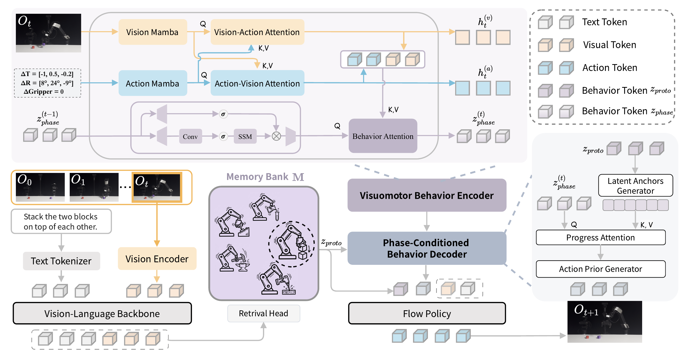
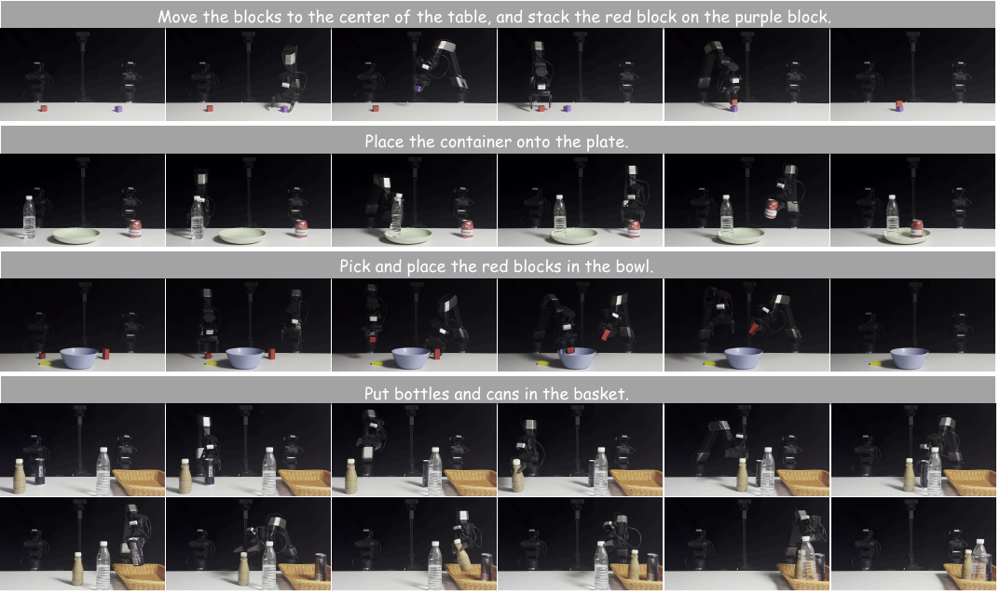
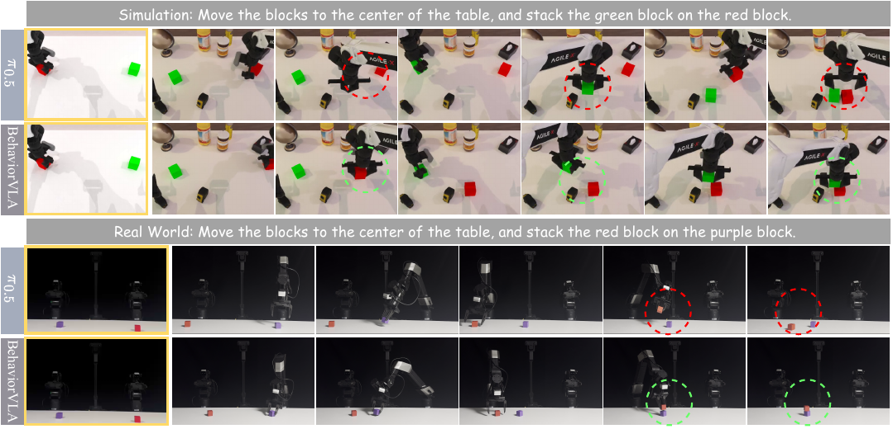
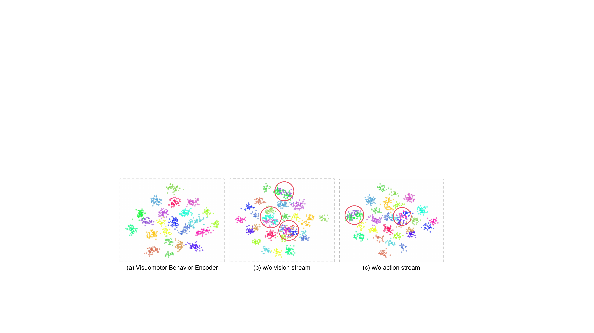

# From Abstraction to Instantiation: Learning Behavioral Representation for Vision-Language-Action Model

#

# 基本信息

- arXiv: [2605.22671](http://arxiv.org/abs/2605.22671v1)
- Authors: Bing Hu, Zaijing Li, Rui Shao, Junda Chen, April Hua Liu, Wei-Shi Zheng, Liqiang Nie
- Categories: cs.CV

#

# 研究问题

学习行为表征增强VLA泛化与迁移能力

#

# 任务与挑战

现有Vision-Language-Action（VLA）模型在分布偏移下性能显著下降，难以学习跨环境的泛化行为表征。现有方法多基于动作中心的隐变量构建行为表征，但受限于短程时序碎片化与静态执行对齐，导致复杂场景中的行为不一致，并严重制约sim-to-real迁移能力。

为此，本文提出BehaviorVLA框架，核心包含两个对称模块：一是Visuomotor Behavior Encoder（VBE），采用因果三流（视觉、动作、行为）Mamba架构，通过JEPA式联合预测重建、全局任务对比聚类与局部进度InfoNCE约束，将长程轨迹聚合为统一的行为表征，并解耦为时不变的全局原型（离线记忆库检索）与时变的相位状态（在线递归更新）；二是Phase-conditioned Behavior Decoder（PBD），遵循Predictor-Corrector范式，先将全局原型展开为潜在锚点并通过相位查询进行Progress-Attention插值得到结构先验，再以加性嵌入方式引导条件流匹配策略（Flow Matching）修正残差动力学，实现全局结构稳定与局部精细控制的平衡。

实验在RoboTwin 2.0（Hard）、LIBERO与CALVIN三大基准上取得SOTA表现：成功率分别为58%、98%与平均序列长度4.36。在真实世界双臂机器人评测中，BehaviorVLA在泛化任务与长程任务上分别取得70%与55%的成功率，较π0.5提升显著；尤其在sim-to-real数据效率方面，仅使用50%的示教数据即可匹敌OpenVLA-OFT的完整微调性能。消融实验验证了VBE与PBD的互补性，并揭示引导强度λ需在全局稳定性与局部灵活性之间取得平衡。

该研究的意义在于为VLA模型引入显式的低维行为流形约束与相位感知的层次化解码，提供了一种可扩展且数据高效的鲁棒操作策略。其“特定到一般”的抽象与“一般到特定”的实例化范式，与世界模型辅助具身智能的核心目标高度契合，为后续在接触丰富的长程操作及少样本真实迁移研究提供了重要基线与技术路径。

#

# 核心 Insight

这篇论文的核心价值需要结合原文继续复查。当前 fallback 笔记保留了日报分析、DeepResearch 草稿和已筛选图表，避免自动流程中断。

#

# 方法与公式

#

# 第一模块：一分钟核心速写

**论文领域：** VLA

**TL;DR：** 作者提出了一种基于因果Mamba行为编码与相位条件行为解码的VLA框架 **BehaviorVLA**，以解决现有VLA因短程时间碎片化与静态执行对齐导致的分布偏移下性能退化问题，在RoboTwin 2.0（58%）、LIBERO（98%）、CALVIN（Avg.Len 4.36）及真机sim-to-real上取得SOTA性能，并以50%真机演示数据匹敌OpenVLA-OFT全量数据性能。

**研究动机：** 现存方案通过动作中心潜变量构建行为表征，但最大痛点是**短程时间碎片化**（将轨迹切分为独立块或离散码，无法捕获长程依赖）与**静态执行对齐**（解码时无视实时执行进度），导致跨域漂移、长程时序不一致与接触不稳定。本文切入点巧妙：将行为视为低维流形上的层次坐标——**全局原型**（任务拓扑）与**局部相位**（执行进度），实现“从具体到抽象”的压缩与“从抽象到具体”的实例化闭环。

**核心机制：** **VBE**以因果三流Mamba架构将长程视觉-动作轨迹压缩为解耦的全局原型（时序不变）与局部相位（时序因果递归）；**PBD**采用Predictor-Corrector范式，先以相位注意力将全局原型展开为与实时进度对齐的高斯动作先验（预测骨架），再通过条件流匹配修正局部动态（修正细节），将结构稳定性与局部精确性统一。

**关键数据：**
- **最能证明有效性的一组数据：** 真机sim-to-real实验中，BehaviorVLA仅使用OpenVLA-OFT **50%**的演示数据即达到与其相当的性能。这是全篇最能支撑“数据效率”与“跨域泛化”核心声明的证据，直接验证了VBE通过行为流形抽象过滤环境噪声后，显著降低了对大规模真机数据的依赖。
- **存疑的试验结果：** LIBERO基准上，BehaviorVLA平均成功率**98.0%**，相较基线π0.5的**96.9%**仅提升**1.1个百分点**，且Spatial/Object套件已接近饱和（>99%）。考虑到LIBERO以短程单任务为主，本文所强调的长程时序一致性优势在此基准上被严重稀释，增益可能更多来自训练正则化而非架构本质创新。

---

#

# 第二模块：核心架构解释

BehaviorVLA的整体 pipeline 分为两阶段：第一阶段训练 **Visuomotor Behavior Encoder (VBE)** 以学习行为流形；第二阶段冻结VBE，将其输出的层次化行为坐标（全局原型 + 局部相位）作为先验，联合微调 **Phase-conditioned Behavior Decoder (PBD)** 与基于π0.5的视觉-语言主干。

#

## 1. VBE：因果三流行为流形学习

VBE的输入为长程轨迹序列（视觉观测与动作），输出为解耦的流形坐标。

- **三流独立时序过滤：** 架构包含Vision流（$S_v$）、Action流（$S_a$）与Behavior流（$S_z$）。每流独立通过**因果Mamba**（选择性状态空间模型，SSM）进行时序建模。Mamba的输入相关时间尺度 $\boldsymbol{\Delta}_t$ 使其充当选择性滤波器，动态抑制无关观测（如背景杂乱），保留关键任务事件。其线性复杂度 $\mathcal{O}(L)$ 支持长程轨迹处理。
- **空间跨模态融合：** 时序过滤后，Vision流与Action流通过**交叉注意力**互相增强，解决语义歧义；随后Behavior流查询融合后的联合上下文 $\mathcal{K}_t = [\tilde{h}^{(v)}_t; \tilde{h}^{(a)}_t]$，提取全局任务结构，充当信息瓶颈。
- **流形坐标参数化：**
  - **全局原型 $z_{\text{proto}}$：** 对Behavior流输出沿时间维度做均值池化，得到场景不变的任务拓扑表征。推理时，根据初始观测与指令从离线Memory Bank中检索top-$K$原型并加权聚合。
  - **局部相位 $z_{\text{phase}}$：** 取Behavior流当前时刻的因果隐状态，递归更新以跟踪实时执行进度。

**Phase 1 训练目标**为复合损失：


```math
\mathcal{L}_{\text{Stage1}} = \mathcal{L}_{\text{rec}} + \alpha \mathcal{L}_{\text{global}} + \beta \mathcal{L}_{\text{local}}
```


- $\mathcal{L}_{\text{rec}}$：JEPA联合预测重建损失，包含未来动作预测与未来视觉隐状态预测（目标视觉编码器采用EMA更新）。
- $\mathcal{L}_{\text{global}}$：有监督对比损失，同任务轨迹为正视图，迫使 $z_{\text{proto}}$ 聚类。
- $\mathcal{L}_{\text{local}}$：InfoNCE损失，同一时间步为正样本、不同时间步为负样本，防止 $z_{\text{phase}}$ 拓扑坍塌。

#

## 2. PBD：Predictor-Corrector 行为实例化

PBD将VBE的抽象坐标解码为精确动作，遵循**预测-修正**范式。

- **Predictor（相位引导拓扑展开）：** 生成器 $\mathcal{G}_\phi$ 将全局原型 $\hat{z}_{\text{proto}}$ 展开为 $H$ 个潜在锚点 $\mathbf{M} \in \mathbb{R}^{H \times D}$，并叠加位置编码 $\mathbf{P}_{\text{pos}}$ 以引入规范时序几何。当前相位 $z_{\text{phase}}^{(t)}$ 作为查询，通过**Progress-Attention**从锚点中插值得到局部几何上下文 $c_t$，再投影为**高斯动作先验** $\mathcal{N}(\mu_{\text{prior}}, \text{diag}(\exp(\sigma_{\text{prior}})))$。
- **Corrector（几何引导流匹配）：** 采用条件流匹配策略。训练时，从数据动作 $\mathbf{a}_0$ 与噪声 $\mathbf{a}_1$ 构造插值 $\mathbf{a}_\sigma = \sigma \mathbf{a}_1 + (1-\sigma)\mathbf{a}_0$。先验均值 $\mu_{\text{prior}}$ 经投影后以强度 $\lambda$ 作为残差嵌入注入噪声动作嵌入：
  

```math
\mathbf{h}_\sigma = e(\mathbf{a}_\sigma) + m \cdot \text{Proj}_\phi(\mu_{\text{prior}})
```


  其中 $m \sim \text{Bernoulli}(p)$ 为**随机Dropout掩码**，防止策略过度依赖先验而忽略当前观测（后验坍塌）。向量场 $v_\theta$ 以 $\mathbf{h}_\sigma$、流时间 $\sigma$、视觉-语言特征 $\Phi(O_t, L)$ 及 $\hat{z}_{\text{proto}}$ 为条件，回归目标速度 $\mathbf{a}_1 - \mathbf{a}_0$。

**Phase 2 训练目标**为：


```math
\mathcal{L}_{\text{Stage2}} = \mathcal{L}_{\text{flow}} + \lambda_{\text{prior}} \mathcal{L}_{\text{prior}}
```


- $\mathcal{L}_{\text{flow}}$：条件流匹配均方误差。
- $\mathcal{L}_{\text{prior}}$：专家动作在预测高斯先验下的负对数似然（NLL）。

#

## 3. 实验流程

- **仿真：** RoboTwin 2.0（20任务，Hard设置，强域随机化，100 rollouts）、LIBERO（Spatial/Object/Goal/Long四套件，各500 rollouts）、CALVIN（ABC→D长程组合设置，500 rollouts）。
- **真机：** Galaxea R1 Lite双臂平台，评估Generalization Tasks（4任务，各100演示/50 rollouts，变光照/布局/物体实例）与Long-horizon Tasks（4任务，各150-200演示/50 rollouts）。
- **实现：** 基于π0.5主干，8×A800 GPU，Batch Size 256，学习率 $5 \times 10^{-5}$，训练30k步。VBE预提取的行为坐标离线缓存，避免重复计算。

#

## 4. Python 风格伪代码

```python
import torch
import torch.nn as nn

# ==================== Phase 1: VBE Training ====================

class CausalMambaStream(nn.Module):
    def forward(self, x):
        

# x: [T, D]; selective SSM with input-dependent timescale Delta

        

# returns filtered hidden states [T, D]

        pass

class VBE(nn.Module):
    def __init__(self, dim=256):
        super().__init__()
        self.vision_enc = LightweightCNN(proj_dim=dim)
        self.target_vision_enc = EMA(self.vision_enc, decay=0.99)
        
        self.stream_v = CausalMambaStream(dim)
        self.stream_a = CausalMambaStream(dim)
        self.stream_z = CausalMambaStream(dim)
        
        self.task_head = nn.Sequential(nn.Linear(dim, 256), nn.ReLU(), nn.Linear(256, 128))
        self.progress_head = nn.Sequential(nn.Linear(dim, 256), nn.ReLU(), nn.Linear(256, 128))
    
    def forward(self, obs_seq, act_seq, task_ids):
        

# obs_seq: [T, 3, 224, 224]; act_seq: [T, D_a]

        v_tokens = self.vision_enc(obs_seq)          

# [T, D]

        a_tokens = act_seq                            

# [T, D] (after proj)

        
        

# 1. Independent temporal filtering

        h_v = self.stream_v(v_tokens)                 

# [T, D]

        h_a = self.stream_a(a_tokens)                 

# [T, D]

        
        

# 2. Spatial cross-modal fusion

        h_v = h_v + cross_attn(Q=h_v, K=h_a, V=h_a)
        h_a = h_a + cross_attn(Q=h_a, K=h_v, V=h_v)
        context = torch.cat([h_v, h_a], dim=-1)       

# [T, 2D]

        
        h_z = self.stream_z(...)                      

# behavior stream tokens [T, D]

        h_z = h_z + cross_attn(Q=h_z, K=context, V=context)
        
        

# 3. Manifold coordinates

        z_proto = h_z.mean(dim=0)                     

# [D], global prototype

        z_phase = h_z                                 

# [T, D], local phase (causal)

        
        

# 4. Losses

        pred_a = predict_action(h_z[:-1])
        pred_v = predict_vis(h_z[:-1])
        loss_rec = mse(pred_a, act_seq[1:]) + mse(pred_v, self.target_vision_enc(obs_seq[1:]).detach())
        
        loss_global = supervised_contrastive(self.task_head(z_proto), labels=task_ids)
        loss_local = info_nce(self.progress_head(z_phase), positive_mask=eye(T), negative_mask=1-eye(T))
        
        return loss_rec + 1.0*loss_global + 1.0*loss_local, z_proto, z_phase


# ==================== Phase 2: PBD + Flow Matching ====================

class PBD(nn.Module):
    def __init__(self, dim=256, H=16):
        super().__init__()
        self.generator = nn.Linear(dim, H * dim)      

# unfold z_proto to anchors

        self.progress_attn = CrossAttention(dim, dim)
        self.mu_proj = nn.Linear(dim, D_action)
        self.logsig_proj = nn.Linear(dim, D_action)
        self.prior_proj = nn.Linear(D_action, dim)
        self.flow_net = ConditionalFlowTransformer(dim)
    
    def predictor(self, z_proto, z_phase_t):
        M = self.generator(z_proto).view(H, dim) + positional_encoding(H, dim)  

# [H, D]

        c_t = self.progress_attn(Q=z_phase_t.unsqueeze(0), K=M, V=M).squeeze(0)   

# [D]

        mu_prior = self.mu_proj(c_t)
        logsig_prior = self.logsig_proj(c_t)
        return mu_prior, logsig_prior
    
    def corrector(self, a_sigma, sigma, vl_feat, z_proto, mu_prior, lambda_guide, dropout_mask):
        

# a_sigma: noisy action [B, D_action]; sigma: flow time [B, 1]

        prior_emb = self.prior_proj(mu_prior)         

# [B, D]

        h_sigma = action_embed(a_sigma) + lambda_guide * dropout_mask * prior_emb  

# [B, D]

        v_field = self.flow_net(h_sigma, sigma, vl_feat, z_proto)  

# [B, D_action]

        return v_field                                

# target: a_noise - a_data

def train_stage2(vbe, pbd, policy_backbone, batch, memory_bank):
    obs_t, lang, action_gt = batch                    

# action_gt: [B, H, D_a]

    
    

# Retrieve hierarchical behavior coordinates

    z_proto = memory_bank.retrieve(obs_t[:,0], lang)  

# [B, D], fixed per episode

    with torch.no_grad():
        z_phase = vbe(obs_seq, act_prev_seq)[2][:,-1] 

# [B, D], online causal

    
    

# Predictor: structural prior

    mu_prior, logsig_prior = pbd.predictor(z_proto, z_phase)
    
    

# Corrector: conditional flow matching

    a1 = torch.randn_like(action_gt)
    sigma = torch.rand(B, 1)
    a_sigma = sigma * a1 + (1 - sigma) * action_gt
    
    m = torch.bernoulli(torch.full((B,1), p))       

# stochastic dropout

    v_pred = pbd.corrector(a_sigma, sigma, policy_backbone.encode(obs_t, lang), 
                           z_proto, mu_prior, lambda_guide=1.0, dropout_mask=m)
    
    loss_flow = mse(v_pred, a1 - action_gt)
    loss_prior = -gaussian_nll(action_gt, mu_prior, logsig_prior).mean()
    
    return loss_flow + 0.1 * loss_prior
```

---

#

# 第三模块：核心学术问答

Q1: 这篇论文试图解决什么核心问题？

A1: 现有VLA模型在分布偏移（如sim-to-real转移、背景/光照/物体变化）下性能急剧退化，根源在于其行为表征学习存在两个根本缺陷：一是**短程时间碎片化**，即将轨迹切分为独立动作块或离散潜码，无法捕获长程依赖与全局任务拓扑；二是**静态执行对齐**，即解码时仅依赖静态潜变量，缺乏对实时执行进度的感知。这导致模型在复杂长程任务中出现时序漂移、接触不稳定和跨域泛化失败。

Q2: 作者提出的核心解决方案（创新点）是什么？

A2: 作者提出BehaviorVLA框架，核心创新是层次化解耦的行为坐标与Predictor-Corrector解码机制。
(1) **Visuomotor Behavior Encoder (VBE)**：采用因果三流Mamba架构，将长程视觉-动作轨迹压缩为两个正交流形坐标——时间不变的**全局原型** $z_{\text{proto}}$（捕获任务拓扑）和时间变化的**局部相位** $z_{\text{phase}}$（因果递归跟踪执行进度），实现特定到一般的抽象。
(2) **Phase-conditioned Behavior Decoder (PBD)**：遵循Predictor-Corrector范式。Predictor通过Progress-Attention将全局原型展开为与实时相位对齐的高斯动作先验；Corrector以此先验作为几何引导，通过条件流匹配策略修正局部动态，实现一般到具体的实例化。
(3) **随机先验Dropout**：训练时以Bernoulli掩码随机丢弃先验嵌入，防止流匹配策略过度依赖结构捷径而忽略当前视觉观测，避免后验坍塌。

Q3: 实验设计的关键支撑（或巧妙之处/数据集特点）是什么？

A3: 实验设计的关键支撑在于多维度、互补性地验证了“抽象-实例化”机制：
- **基准覆盖层次分明：** LIBERO检验短程单任务泛化，CALVIN ABC→D检验跨场景长程任务组合能力，RoboTwin 2.0 Hard检验强域随机化下的双臂协调鲁棒性，三者分别对应不同时间尺度与复杂度。
- **真机数据效率对照：** 在Galaxea R1 Lite上设置Generalization与Long-horizon两套任务，并刻意使用50%与75%的演示数据量与OpenVLA-OFT及π0.5对比，直接验证VBE过滤环境噪声后降低了对大规模真机数据的依赖。
- **独立模块消融：** 通过分别移除VBE与PBD，量化了抽象模块对跨域泛化（无VBE时Generalization下降5%）与相位解码模块对长程稳定性（无PBD时Long-horizon下降10%）的独立贡献。

Q4: 这篇论文最显著的贡献点（Top 3）是什么？

A4:
[贡献1] 提出因果三流Mamba行为编码器（VBE），首次在VLA中通过解耦的全局原型与局部相位坐标显式建模长程行为流形，突破了传统动作分块（ACT）与离散码（VQ-BeT）的短程碎片化限制。
[贡献2] 提出相位条件行为解码器（PBD），以Predictor-Corrector范式将结构先验与流匹配生成策略结合，解决了生成式策略中因缺乏进度感知导致的时序漂移与高频抖动问题。
[贡献3] 在仿真与真机实验中实现SOTA性能，并以50%真机演示数据达到与OpenVLA-OFT全量数据相当的sim-to-real迁移效果，证明了显式行为表征在数据效率与鲁棒性上的双重优势。

Q5: 这项工作在哪些相关研究的基础上做了推进？（列举1-2个最核心的前置工作即可）

A5:
[前置工作1] **π0.5** (Physical Intelligence, 2025)：作为本文直接采用的VLA主干，π0.5提供了基于PaliGemma的视觉-语言基础与流匹配动作生成框架。BehaviorVLA在此基础上外挂VBE与PBD，将其从无结构先验的生成模型升级为层次化行为制导的策略。
[前置工作2] **MTIL / RoboSSM** (Zhou et al., 2025; Yoo et al., 2025)：这些工作将Mamba引入机器人策略以提升长上下文效率。BehaviorVLA进一步挖掘Mamba的选择性状态空间特性，将其作为跨模态（视觉-动作-行为）三流架构的时序骨干，用于显式行为流形学习而非单纯的动作预测。

Q6: 客观评价：这篇论文的局限性、漏洞或"未讲明的故事"是什么？对后续科研有何启发？

A6: 局限性与漏洞：
(1) **离线原型记忆的拓扑覆盖瓶颈：** 作者承认当新任务显著偏离预训练行为流形时，检索到的原型可能功能错误，但全文未提供任何量化实验（如极端OOD任务上的性能边界）来界定该瓶颈的具体影响，仅停留在定性声明。
(2) **推理延迟与计算开销未量化：** 流匹配的迭代积分与三流Mamba的交叉注意力带来额外延迟，论文虽在Limitation中提及，但未报告具体推理频率（Hz）或GPU内存占用，难以评估其在资源受限真机上的实时性。
(3) **短程基准增益稀释：** 在LIBERO等短程任务上，BehaviorVLA相较π0.5的绝对提升仅约1%，且已接近性能天花板（Spatial达99.2%）。这使得该机制在长程任务上的核心优势被弱化，也引发疑问：是否仅需更简单的正则化或数据增强即可达到类似效果？
(4) **真机实验规模有限：** 真机仅测试8个任务，且缺乏跨不同机器人本体（embodiment）的验证，泛化性声明的统计支撑不足；此外，真机对比基线的具体数值仅以柱状图形式呈现，未附完整表格与标准差。

后续启发：
- **在线流形扩展：** 结合自监督探索或增量学习动态更新原型记忆库，突破离线拓扑覆盖限制，使模型能适应训练分布之外的全新任务拓扑。
- **蒸馏加速：** 将PBD的迭代流匹配蒸馏为单步或少数步推理（如一致性模型/一致性蒸馏），在保留结构引导的同时满足高频控制需求。
- **显式行为表征应成为VLA标配：** 本文证明，在基础VLA之上显式注入行为流形，是平衡数据效率与泛化鲁棒性的有效路径。未来可进一步探索更细粒度的接触相位（contact phase）表征与多模态（力觉/触觉）流形，以稳定高频物理交互。

#

# 贡献拆解

- 关键术语：Vision-Language-Action, Behavior Representation, Flow Matching, Sim-to-Real, Mamba
- 加权评分：4.25/5.0

#

# 关键图表解读



*Fallback selection because visual JSON selection failed.*



*Fallback selection because visual JSON selection failed.*



*Fallback selection because visual JSON selection failed.*



*Fallback selection because visual JSON selection failed.*

#

# 实验与消融

请优先核对主结果表、消融实验和真实/仿真任务设置；若图表已选中，应结合上方图片逐项复查。

#

# 局限性

当前自动精读未能成功调用完整图文生成模型，因此局限性需要结合原文实验设置进一步人工确认。

#

# 个人研究判断

若该论文与 World Models assisting Embodied AI、VLA、robot policy 或 sim-to-real 强相关，建议进入人工精读队列。
