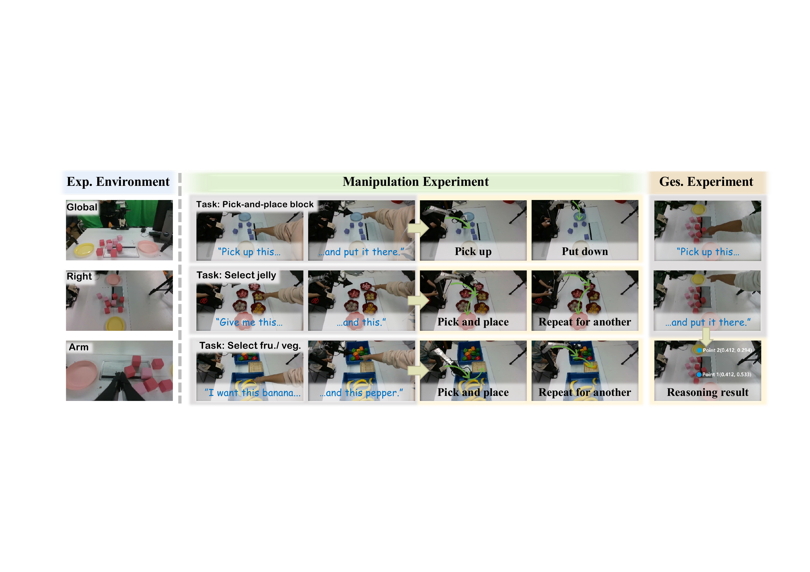
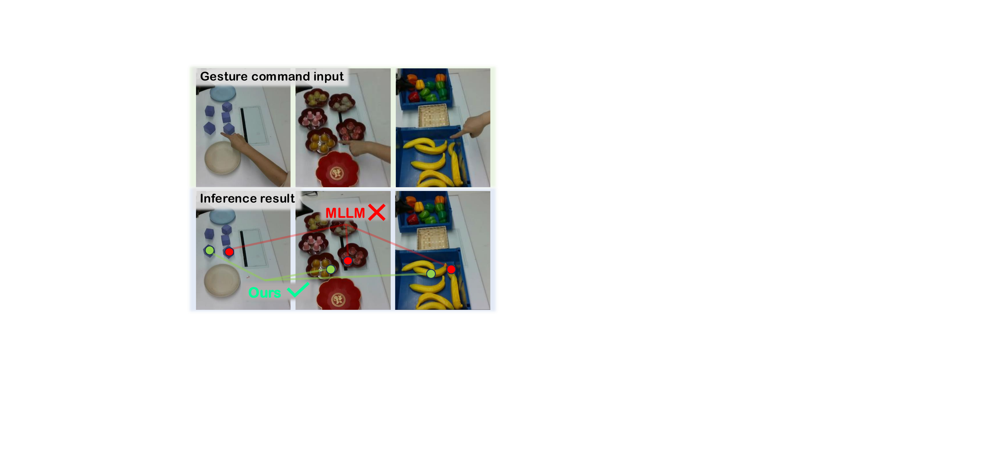
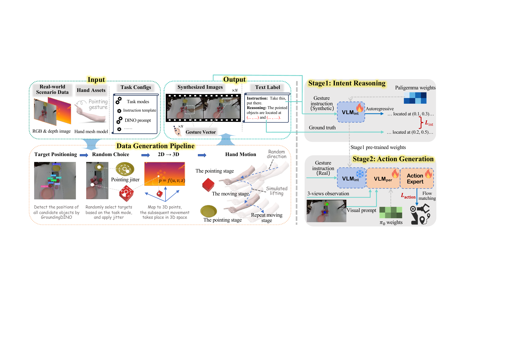
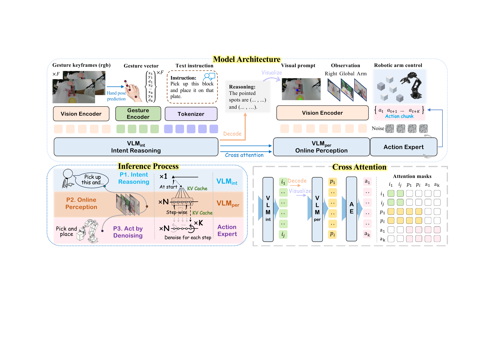

# GesVLA: Gesture-Aware Vision-Language-Action Model Embedded Representations

#

# 基本信息

- arXiv: [2605.22812](http://arxiv.org/abs/2605.22812v1)
- Authors: Wenxuan Guo, Ziyuan Li, Meng Zhang, Yichen Liu, Yimeng Dong, Chuxi Xu, Yunfei Wei, Ze Chen, Erjin Zhou, Jianjiang Feng
- Categories: cs.RO, cs.CV

#

# 研究问题

手势感知VLA模型增强机器人空间指令理解

#

# 任务与挑战

现有视觉-语言-动作（VLA）模型主要依赖文本指令，在包含多个相似物体的复杂场景中难以消除空间歧义。语言描述往往无法精确定位目标，而人类通常通过指向手势直观地完成空间锚定。然而，现有工作多将手势作为辅助信号或后处理输入，缺乏与VLA核心推理过程的深度融合，且大规模带精确指向标注的机器人手势数据稀缺，制约了模型对细粒度手势的理解能力。

为此，本文提出GesVLA，一种手势感知的VLA框架。方法上，采用MediaPipe提取手部关键点并通过MLP投影为潜在token，将手势作为与视觉、语言并行的指令模态。架构上设计双VLM结构：VLM_int负责手势-语言联合意图推理，VLM_per通过交叉注意力接收VLM_int的潜在表示进行在线感知，最后由基于流匹配（flow matching）的动作专家生成连续动作轨迹。非对称注意力设计使VLM_int只需计算一次即可复用，提升推理效率。数据层面，构建可扩展的半合成数据引擎，将手势模型渲染到真实RGB-D场景上，生成约16k条带精确3D指向标注的多模态数据，有效缩小sim-to-real视觉差距。

实验在真实机器人（7自由度ARX5机械臂）上开展，涵盖积木搬运、果冻选取和果蔬选取任务。结果表明，GesVLA在意图推理任务上达到94.3%的准确率，显著高于几何管线（59.1%）和提示式多模态大模型（38.6%）。在操作任务中，GesVLA平均成功率为83.3%，远超纯文本VLA（31.7%）和几何管线+VLA（41.7%）基线。消融实验验证了坐标抖动对泛化性的关键作用（去除后降至42.0%）、两阶段训练策略的有效性（冻结VLM_int达83.3%，联合训练仅45.0%），以及视觉提示对目标锚定的重要性。

该研究将手势提升为VLA中的一等模态，通过潜在空间耦合避免了离散化文本转换带来的信息损失，为解决复杂场景下的空间歧义提供了有效途径。其可扩展的数据生成范式对缺乏大规模手势标注的具身智能研究具有重要借鉴意义。对于关注VLA架构、多模态人机交互及sim-to-real迁移的研究者而言，GesVLA在架构设计与数据工程两方面均提供了有价值的参考。

#

# 核心 Insight

这篇论文的核心价值需要结合原文继续复查。当前 fallback 笔记保留了日报分析、DeepResearch 草稿和已筛选图表，避免自动流程中断。

#

# 方法与公式

#

# 第一模块：一分钟核心速写

1. **论文领域**：VLA

2. **TL;DR**：本文作者提出了一种基于**手势latent嵌入**与**非对称双VLM架构**的 **GesVLA** 模型，以解决纯文本指令在杂乱真实场景中引发的空间歧义问题，在真实机器人操作任务上将平均成功率从 **31.7%** 提升至 **83.3%**。

3. **研究动机**：现存VLA系统仅依赖语言指令，面对多相似物体场景时无法精确grounding目标（如“把这个放到那里”）。本文将手势提升为与语言并行的第一级模态，切入点巧妙在于**不将手势转为文本或离散坐标**，而是直接编码为连续latent token，让手势同时参与高层意图推理与底层动作生成，从根本上消除空间歧义。

4. **核心机制**：通过MediaPipe提取手部关键点并投影为latent embedding，采用**非对称双VLM架构**（VLM_int 专司手势-语言意图推理并缓存KV，VLM_per 通过cross-attention直接读取该缓存并融合场景观察），最后由flow matching action expert生成动作；配合**半合成手势数据引擎**（在真实RGB-D场景上渲染手部轨迹）与**两阶段训练**实现sim-to-real迁移。

5. **关键数据**：
   - **最能证明有效性的数据**：真实机器人操作实验（Table 1）中，GesVLA在三个任务上平均成功率达 **83.3%**，较text-only VLA（**31.7%**）提升超过50个百分点；尤其在 **Pick-and-Place Block Hard** 场景中优势最大（**9/10 vs 3/10**），直接证明手势对 cluttered 场景空间消歧的决定性作用。
   - **存疑的试验结果**：**Select Jelly Hard** 任务成功率仅 **60%（6/10）**，显著低于其他Hard场景（Block Hard 90%、Fruit/Veg Hard 80%），但论文未对该任务特有的失败模式（如透明材质反光、顺序记忆错误等）进行针对性分析；此外，意图推理测试集仅 **88个样本**，统计代表性有限。

---

#

# 第二模块：核心架构解释

#

## 整体架构流程

GesVLA的输入包含三部分：**多视角RGB场景观察** $\mathcal{O}$、**语言指令** $\mathcal{T}$、**手势视频** $\mathcal{G}$。整个系统分为三个功能模块：

1. **手势编码与关键帧提取**
   - 基于手部运动动态，从手势视频中提取运动停滞帧作为关键帧 $\{g_i\}_{i=1}^F$。
   - 每帧使用MediaPipe提取4个关键点（手腕 + 食指3个关节），各含 $(x, y, d)$ 坐标，拼接为12维向量 $\mathbf{h}_i \in \mathbb{R}^{12}$。
   - 经多层MLP $\phi(\cdot)$ 投影为手势latent token：$\mathbf{z}_i^{g} = \phi(\text{Pose}(g_i))$。

2. **非对称双VLM架构**
   - **VLM_int（意图推理VLM）**：基于PaliGemma-2B，接收手势token $\mathbf{z}_i^{g}$ 与语言指令 $\mathcal{T}$，输出推理结果 $\mathbf{y}$（包含文本目标描述与视觉提示）以及每层KV缓存 $(\mathcal{K}^{\text{int}}, \mathcal{V}^{\text{int}})$。训练时，目标坐标被离散化为bin token，通过自回归交叉熵损失优化。
   - **VLM_per（在线感知VLM）**：基于$\pi_0$的VLM骨干，接收场景观察 $\mathcal{O}$、语言 $\mathcal{T}$ 与推理输出 $\mathbf{y}$，并通过**cross-attention层**直接 attend to VLM_int 的 $(\mathcal{K}^{\text{int}}, \mathcal{V}^{\text{int}})$，输出 $(\mathcal{K}^{\text{per}}, \mathcal{V}^{\text{per}})$。
   - **Action Expert**：接收初始噪声 $\mathbf{x}_0 \sim \mathcal{N}(\mathbf{0}, \mathbf{I})$、机器人状态 $\mathbf{s}_t$ 与VLM_per的latent表示，通过**flow matching**迭代去噪生成连续动作块 $\mathbf{a}_{1:K}$。

3. **非对称交互与推理效率**
   - 信息流向严格为：$\text{VLM}_{\text{int}} \rightarrow \text{VLM}_{\text{per}} \rightarrow \text{Action Expert}$。
   - VLM_int不关注下游模块，因此推理时**只计算一次**并复用KV缓存；VLM_per每个控制步执行一次；Action Expert每步执行$N$次去噪迭代。计算比例为 $1:T:T \times N$。

#

## 数据引擎与训练流程

- **半合成数据生成**：在真实RGB-D场景上，用GroundingDINO检测候选物体，随机采样目标并施加坐标抖动，通过深度与相机内参反投影3D目标点；随后生成平滑接近轨迹（带抛物线抬升过渡），渲染手部网格，得到约 **16k** 样本。
- **两阶段训练**：
  - **Stage 1**：VLM_int在半合成数据上预训练，学习手势条件的空间推理。
  - **Stage 2**：在真实机器人演示上训练VLM_per与Action Expert，**VLM_int冻结**，防止合成数据分布主导动作学习。

#

## 核心伪代码

```python
import torch
import torch.nn as nn

class GestureEncoder(nn.Module):
    def __init__(self, input_dim=12, latent_dim=512):
        super().__init__()
        self.mlp = nn.Sequential(
            nn.Linear(input_dim, 256),
            nn.ReLU(),
            nn.Linear(256, latent_dim)
        )
    
    def forward(self, keypoints_seq):
        

# keypoints_seq: [F, 12], F keyframes, each 12-dim (4 joints * 3 coords)

        z_g = self.mlp(keypoints_seq)  

# [F, latent_dim]

        return z_g


class GesVLA(nn.Module):
    def __init__(self):
        super().__init__()
        self.gesture_encoder = GestureEncoder()
        self.vlm_int = PaliGemma2B()      

# Intent reasoning VLM

        self.vlm_per = PaliGemma2B()      

# Perception VLM

        self.action_expert = FlowMatchingPolicy()
        
    def inference(self, obs, text, gesture_video, robot_state):
        

# 1. Gesture keyframe selection based on motion stagnation

        keypoints = mediapipe_extract(gesture_video)  

# [F, 12]

        z_g = self.gesture_encoder(keypoints)
        
        

# 2. VLM_int computes intent reasoning ONCE

        

# y: reasoning outputs (text + visual prompt tokens)

        

# kv_int: cached key-value states for cross-attention

        y, kv_int = self.vlm_int(gesture_tokens=z_g, text_tokens=text)
        
        

# 3. Control loop

        while not task_done:
            

# VLM_per attends to scene and VLM_int's latent state via cross-attention

            kv_per = self.vlm_per(
                obs_tokens=obs, 
                text_tokens=text, 
                reasoning_output=y, 
                kv_intent=kv_int
            )
            
            

# Action expert: flow matching denoising

            x = torch.randn_like(dummy_action_chunk)
            for _ in range(num_denoise_steps):
                velocity = self.action_expert(x, robot_state, kv_per)
                x = x + velocity * dt  

# Euler integration along probability flow ODE

            action_chunk = x
            
            execute(action_chunk)
            obs, robot_state = update_observation()
            
    def forward_stage1(self, gesture_video, text, target_tokens):
        

# Stage 1: Intent reasoning pre-training on semi-synthetic data

        keypoints = mediapipe_extract(gesture_video)
        z_g = self.gesture_encoder(keypoints)
        logits = self.vlm_int(
            gesture_tokens=z_g, 
            text_tokens=text, 
            target_tokens=target_tokens
        )
        

# Target includes discretized coordinate bins + text tokens

        loss = cross_entropy(logits, target_tokens)
        return loss
    
    def forward_stage2(self, obs, text, gesture_video, robot_state,
                       noisy_action, target_action, t):
        

# Stage 2: Policy training on real robot demos

        keypoints = mediapipe_extract(gesture_video)
        z_g = self.gesture_encoder(keypoints)
        
        with torch.no_grad():
            y, kv_int = self.vlm_int(gesture_tokens=z_g, text_tokens=text)
        
        kv_per = self.vlm_per(
            obs_tokens=obs, 
            text_tokens=text,
            reasoning_output=y, 
            kv_intent=kv_int
        )
        
        

# Flow matching: predict velocity along straight-line path

        velocity_pred = self.action_expert(noisy_action, t, robot_state, kv_per)
        velocity_target = target_action - noisy_action
        loss = mse_loss(velocity_pred, velocity_target)
        return loss
```

---

#

# 第三模块：核心学术问答

Q1: 这篇论文试图解决什么核心问题？

A1: 现有VLA模型主要依赖文本指令，在包含多个相似物体的杂乱真实场景中无法精确解析空间指代（例如“把这个放到那里”），导致目标grounding失败。本文旨在将人类指向手势引入VLA作为并行的第一级指令模态，通过端到端的latent空间融合，消除空间歧义并提升人机交互效率。

Q2: 作者提出的核心解决方案（创新点）是什么？

A2: 
- **手势latent嵌入**：不将手势转为文本或几何射线，而是将MediaPipe提取的12维手部关键点序列经MLP投影为连续latent token，直接注入VLM的推理与动作生成流程。
- **非对称双VLM架构**：VLM_int专司手势-语言意图推理并缓存KV，VLM_per通过cross-attention直接读取该缓存并融合视觉观察，避免中间离散化造成的信息损失；VLM_int单向不关注下游，推理时只算一次，保障效率。
- **可扩展半合成数据引擎**：在真实RGB-D场景上渲染合成手部轨迹，配合坐标抖动与外观增强，以低成本生成带精确3D指向标注的16k样本，支撑sim-to-real迁移。
- **两阶段训练**：先以半合成数据预训练VLM_int的意图推理，再在真实机器人数据上冻结VLM_int、联合训练VLM_per与flow matching动作专家，防止合成数据主导优化。

Q3: 实验设计的关键支撑（或巧妙之处/数据集特点）是什么？

A3: 
- **半合成数据引擎的巧妙之处**：利用真实场景图像作为背景，仅合成手部运动，既保留了真实视觉分布，又获得了精确的3D指向标注；通过随机坐标抖动和手部外观增强，强制模型学习几何指向关系而非过拟合固定坐标，消融显示去除抖动会使意图推理准确率从94.3%暴跌至42.0%。
- **真实任务分层设计**：将每个任务分为Simple/Hard子集（如积木数量<5 vs ≥5，单物体 vs 多物体顺序选取），系统性地验证手势在 clutter 和顺序指令中的增益。
- **强基线对比**：不仅对比text-only VLA，还构建了MLLM前端+VLA、几何管线+VLA等强基线，证明端到端latent耦合优于模块化拼接。

Q4: 这篇论文最显著的贡献点（Top 3）是什么？

A4:
- 将手势提升为VLA中与视觉、语言并列的核心指令模态，并设计了端到端的latent融合机制，突破了传统文本指令的空间歧义瓶颈。
- 提出了非对称双VLM架构，在保持计算效率（VLM_int一次计算复用）的同时，实现了意图推理与动作生成之间的紧密latent耦合。
- 构建了可扩展的半合成手势数据生成管线，以低成本解决了手势-动作对齐数据稀缺问题，并配合两阶段训练策略实现了有效的sim-to-real迁移。

Q5: 这项工作在哪些相关研究的基础上做了推进？（列举1-2个最核心的前置工作即可）

A5:
- **π_0 (Black et al., 2024)**：作为底层VLA骨干与flow matching动作生成的基础框架，GesVLA继承了其连续动作建模能力，但扩展了手势模态与双VLM架构以解决空间歧义。
- **PaliGemma (Beyer et al., 2024)**：作为VLM_int与VLM_per的骨干网络，提供了视觉-语言预训练基础；GesVLA在此基础上进行了模态扩展与任务特化的两阶段微调。

Q6: 客观评价：这篇论文的局限性、漏洞或"未讲明的故事"是什么？对后续科研有何启发？

A6: 
- **局限1：手势模态单一**。系统仅支持简单的指向（pointing）手势，未涵盖更丰富的手语或动态手势，限制了其在复杂协作场景中的表达能力。
- **局限2：关键实验样本量与故障分析不足**。意图推理测试集仅88个样本，统计显著性有限；Select Jelly Hard任务成功率（60%）明显低于其他Hard任务，但作者未提供针对性的故障分析（如是否因透明材质、遮挡或顺序记忆导致），使读者难以判断模型瓶颈究竟在感知、推理还是动作执行。
- **局限3：两阶段训练的真实数据成本被淡化**。虽然Stage 1使用合成数据，但Stage 2仍需真实机器人演示；论文未报告真实演示数据的规模与采集成本，且unfrozen VLM_int（80.0%）略差于frozen（83.3%）的反直觉现象仅被简单提及，缺乏深入分析。
- **后续启发**：该工作证明了将人类非语言信号（如手势、注视）作为第一级模态直接嵌入latent空间的价值，未来可探索多模态人类意图信号（如眼动、语音语调）与VLA的端到端融合，并需建立更大规模的真实世界多模态指令数据集以支撑联合训练。

#

# 贡献拆解

- 关键术语：Vision-Language-Action, gesture-aware, dual-VLM, sim-to-real, flow matching
- 加权评分：4.15/5.0

#

# 关键图表解读



*Fallback selection because visual JSON selection failed.*



*Fallback selection because visual JSON selection failed.*



*Fallback selection because visual JSON selection failed.*



*Fallback selection because visual JSON selection failed.*

#

# 实验与消融

请优先核对主结果表、消融实验和真实/仿真任务设置；若图表已选中，应结合上方图片逐项复查。

#

# 局限性

当前自动精读未能成功调用完整图文生成模型，因此局限性需要结合原文实验设置进一步人工确认。

#

# 个人研究判断

若该论文与 World Models assisting Embodied AI、VLA、robot policy 或 sim-to-real 强相关，建议进入人工精读队列。
