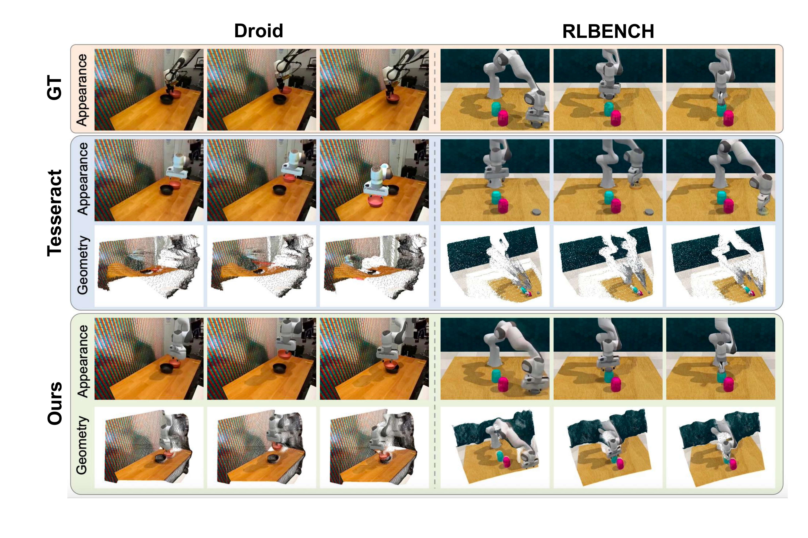
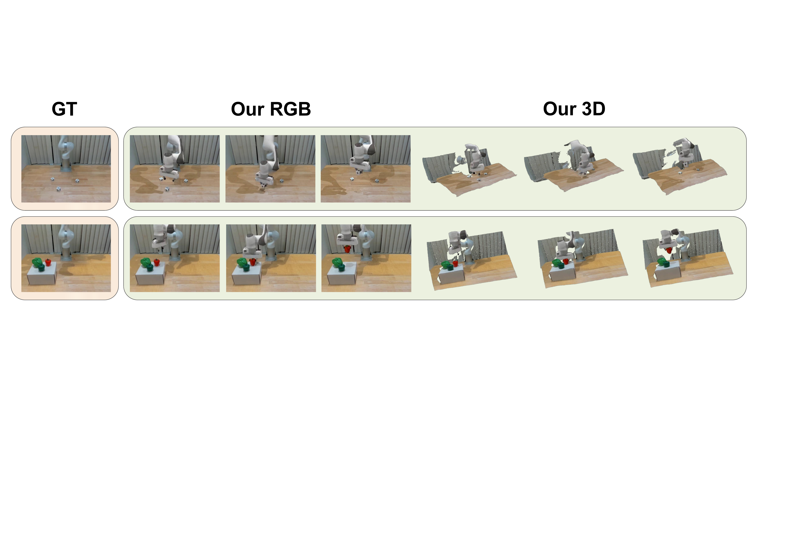
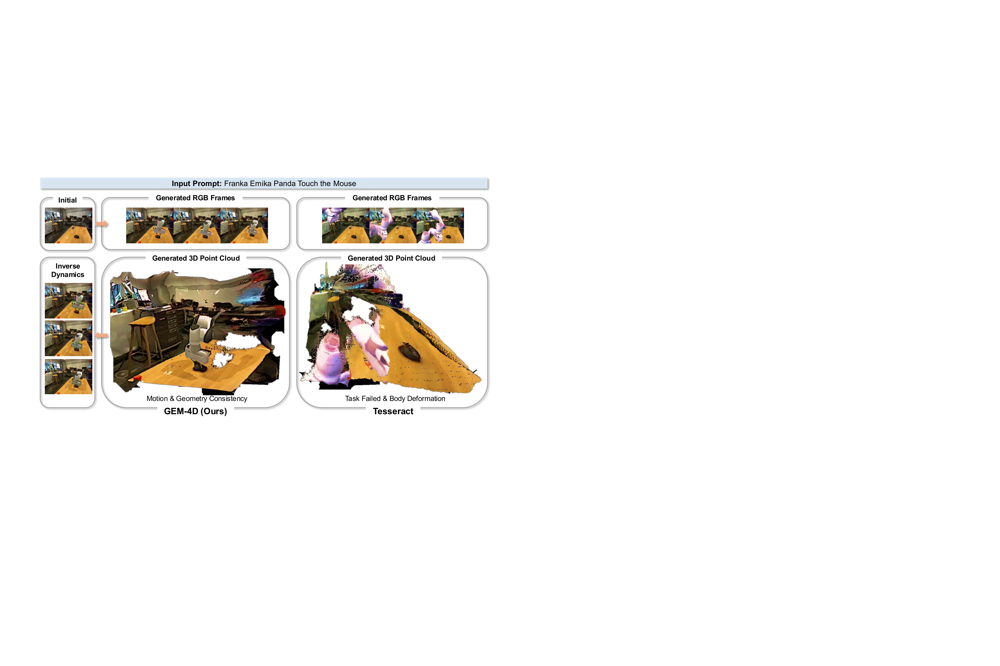
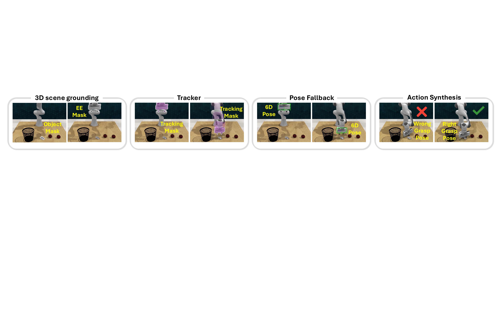

# GEM-4D: Geometry-Enhanced Video World Models for Robot Manipulation

#

# 基本信息

- arXiv: [2605.22882](http://arxiv.org/abs/2605.22882v1)
- Authors: Kaichen Zhou, Yuzhen Chen, Fangneng Zhan, Hang Hua, Grace Chen, Xinhai Chang, Ao Qu, Yilun Du, Zhuang Liu, Paul Pu Liang, Mengyu Wang
- Categories: cs.CV, cs.RO

#

# 研究问题

几何增强4D视频世界模型用于机器人操作

#

# 任务与挑战

现有视频世界模型虽能生成视觉逼真的未来帧，但普遍存在时序几何不一致问题——同一3D表面点在不同帧中的投影缺乏稳定的对应关系，导致生成的视频缺乏物理 groundedness。这种"看似合理、实则失真"的现象严重阻碍了下游机器人操作任务的执行，因为精确的动作提取依赖于像素级运动一致性。

GEM-4D的核心思想是"几何监督即对应关系监督"。作者在训练阶段引入了一个并行的几何流匹配分支：视频DiT的中间特征作为条件，驱动一个几何DiT预测预训练4D几何基础模型（如PAGE-4D、Depth Anything V3）提取的几何表征的速度场。由于几何基础模型的特征隐式编码了深度、相机位姿和场景流，迫使视频骨干网络在内部表征中内禀化对应关系一致性。关键设计在于该几何分支在推理时完全丢弃，不增加任何推理开销，保持单流架构。此外，作者提出了自适应逆动力学系统（AIDS），通过双标准置信度门控跟踪器和几何-运动学姿态回退机制，将生成的一致视频转换为可执行的6-DoF末端执行器轨迹。

实验在RLBench仿真环境和Droid真实环境上进行。在4D场景预测方面，GEM-4D在RGB指标（FVD、SSIM、PSNR）和几何指标（AbsRel、Chamfer Distance）上均达到SOTA。在真实世界操作中，相比最强基线（61%成功率），GEM-4D将操作成功率提升至81%；在Droid的三个子集上分别达到75%、83%、87%。在RLBench的7项任务中，成功率达到63%-82%，显著优于TesserAct等基线。

该工作的核心贡献在于首次将4D几何基础模型作为训练时的正则化器而非直接的几何输出预测器，通过表征蒸馏在不改变视频生成模型输出空间的前提下实现对应关系一致性。这为"生成式世界模型如何可靠地服务于具身智能"提供了新的技术路径，对基于世界模型的策略学习、VLA架构设计以及sim-to-real迁移均具有重要启发意义。

#

# 核心 Insight

这篇论文的核心价值需要结合原文继续复查。当前 fallback 笔记保留了日报分析、DeepResearch 草稿和已筛选图表，避免自动流程中断。

#

# 方法与公式

#

## 第一模块：一分钟核心速写

1. **论文领域**：World Model

2. **TL;DR**：本文作者提出了一种基于**预训练4D几何基础模型特征蒸馏**的视频世界模型 **GEM-4D**，以解决现有视频世界模型生成帧几何不一致、无法可靠提取机器人动作轨迹的核心痛点，在真实世界与仿真机器人操作任务上实现了视频预测与几何一致性的双SOTA，并将真实世界操作成功率从 **61% 提升至 81%**。

3. **研究动机与核心机制**：
   - **现存痛点**：当前视频扩散模型仅靠像素级损失训练，无法保证帧间点级对应关系，导致物体非刚性形变、接触漂移、深度任意跳变；显式4D监督方法（如TesserAct）需修改模型输出空间并依赖大量几何标注，约束了预训练视频骨干的表达能力。
   - **切入点**：作者发现预训练4D几何基础模型（如PAGE-4D）的表示已内嵌深度、相机位姿与场景流，即已编码完整对应结构。因此提出**"几何监督即对应监督"**原则：无需显式对应损失，只需蒸馏几何模型的表示即可强制对应一致性。
   - **核心机制**：训练时，视频DiT的中间特征 **m_t** 作为唯一条件输入给一个并行的几何DiT，后者负责预测几何表示的流匹配速度。由于几何DiT不接触原始像素，**m_t 必须编码足够的3D结构信息**，从而迫使视频骨干内生几何一致性。推理时几何分支被完全丢弃，恢复单流生成，**零额外参数与零额外推理开销**。

4. **关键数据**：
   - **核心有效数据**：在真实世界Droid数据集上，GEM-4D相对最强基线TesserAct，操作成功率在AUTOLab/CLVR/RAIL分别提升 **17%/18%/28%**（58/65/59 → 75/83/87）；在RLBench仿真任务上平均成功率从约 **25% 跃升至 75%**。这组数据直接证明：仅有视觉逼真度不足以支持机器人控制，几何一致性才是决定下游动作提取可行性的瓶颈。
   - **存疑结果**：消融实验中，使用 **VGGT** 作为几何先验反而导致性能下降（FVD 33.68 vs GEM-4D的31.82，SSIM降至75.89）。论文归因于VGGT偏向静态/准静态场景，与机器人操作的动态场景不匹配。这暴露了方法对几何教师模型领域适配性的敏感依赖，且论文未深入分析动态程度变化时的蒸馏鲁棒性。

---

#

## 第二模块：核心架构解释

GEM-4D的架构分为**训练阶段的双流耦合**与**推理阶段的单流生成**，并通过**自适应逆动力学系统（AIDS）**完成从视频到机器人动作的闭环。

**1. 训练阶段：Geometry-Enhanced Velocity Alignment**

整体采用流匹配（Flow Matching）框架。给定初始观测与语言指令，视频DiT负责预测视频潜变量的速度场，同时其内部中间特征被强制用于驱动一个并行的几何DiT。

- **视频流**：对VAE编码的视频潜变量 **z_t**，视频DiT骨干 **E_θ^vid** 提取中间特征 **m_t**，经输出头得到速度 **v_θ^vid**，通过均方误差回归目标速度。
- **几何流**：冻结的4D几何基础模型 **G** 从真实视频序列中提取密集几何表示 **g_0**（编码深度、相机位姿、场景流）。几何DiT以 **m_t 作为唯一的场景级条件**，预测 **g_t** 的速度场 **v_ψ^geo**。最小化此项损失要求 **m_t** 必须包含完整的几何结构信息。
- **联合目标**：总损失为 **L = L_FM^vid + α · L_FM^geo**。梯度通过 **m_t** 回传，使视频骨干同时优化外观生成与几何对应一致性。

**2. 推理阶段：零开销单流生成**

推理时完全丢弃几何DiT与冻结的几何教师模型。仅保留视频DiT，执行标准流匹配ODE积分生成未来帧，不增加任何参数或计算开销。

**3. 自适应逆动力学系统（AIDS）**

AIDS将生成的几何一致视频转换为可执行的6-DoF末端执行器轨迹，包含四个级联步骤：

- **3D场景Grounding**：利用 **Qwen3.5-VL** 与 **SAM-2** 根据指令分割目标物体与末端执行器（EE），结合深度图与CAD模型，通过 **FoundationPose** 恢复初始EE位姿。
- **双标准置信度门控跟踪**：在视频展开上运行 **CoTracker3** 跟踪EE关键点。监控两个统计量：
  - **s_t**：锚点保留率（反映渐进漂移）
  - **Δs_t**：帧间保留率变化（反映突然崩溃）
  若 **s_t < τ**，重新采样锚点；若 **Δs_t < -δ**，调用VLM重新定位EE掩码。
- **几何-运动学姿态回退**：每帧用FoundationPose估计EE位姿与置信度 **κ_t**。若置信度低于阈值 **κ*** 或位姿跳跃超过平移/旋转阈值，则拒绝该估计：平移通过EE掩码内有效像素的深度反投影质心恢复；旋转通过在时间轴上做球面线性插值（slerp）恢复。
- **抓取插入与动作合成**：利用 **GraspGen** 在目标点云上生成抓取候选，按与参考位姿的加权偏差排序，选取最优抓取插入轨迹，经平滑与逆运动学（IK）转换为关节级动作序列。

**Python风格伪代码：**

```python
# ========== 训练阶段：双流耦合 ==========

def train_step(video_latent_z0, geometry_repr_g0, text_cond_c, alpha=1.0):
    t = sample_timestep()
    
    

# 视频流匹配

    z_t = interpolate(z0, noise_z1, t)
    m_t = video_dit_backbone(z_t, t, text_cond_c)   

# 中间特征

    v_vid = video_output_head(m_t)
    loss_vid = mse_loss(v_vid, target_v_vid)
    
    

# 几何流匹配：以 m_t 为唯一条件

    g_t = interpolate(g0, noise_g1, t)
    v_geo = geometry_dit(g_t, t, condition=m_t)     

# 关键设计

    loss_geo = mse_loss(v_geo, target_v_geo)
    
    

# 联合损失与反向传播

    loss = loss_vid + alpha * loss_geo
    loss.backward()   

# 梯度通过 m_t 注入视频骨干

    
# ========== 推理阶段：单流生成（零额外开销） ==========

def generate_rollout(initial_image, instruction, num_steps):
    z = vae_encode(initial_image)
    for t in linspace(0, 1, num_steps):
        m_t = video_dit_backbone(z, t, instruction)
        v = video_output_head(m_t)
        z = z + v * dt
    frames = vae_decode(z)
    return frames

# ========== AIDS：视频到动作 ==========

def extract_actions(frames, instruction, cad_model, camera_intrinsics):
    

# 1. 3D场景Grounding

    masks = sam2_segment(qwen_vl_grounding(frames[0], instruction))
    ee_pose_0 = foundation_pose(masks['ee'], depth[0], cad_model)
    
    

# 2. 双标准置信度门控跟踪

    tracks = cotracker3(frames, sample_keypoints(masks['ee']))
    for t in range(1, len(frames)):
        s_t = retention_ratio(tracks, t)          

# 锚点保留率

        delta_s = s_t - retention_ratio(tracks, t-1)
        
        if s_t < TAU:                             

# 渐进漂移

            reanchor_tracker(masks['ee'], t)
        elif delta_s < -DELTA:                    

# 突然崩溃

            masks['ee'][t] = qwen_vl_grounding(frames[t], instruction)
            reanchor_tracker(masks['ee'], t)
    
    

# 3. 几何-运动学姿态回退

    poses = [ee_pose_0]
    for t, frame in enumerate(frames[1:], start=1):
        pose, kappa = foundation_pose(frame, depth[t], masks['ee'][t], cad_model)
        if (kappa < KAPPA_STAR or 
            translation_jump(pose, poses[-1]) > EPS_T or 
            rotation_jump(pose, poses[-1]) > EPS_R):
            

# 回退：平移用深度质心，旋转用slerp插值

            T = centroid(backproject(depth[t], masks['ee'][t]))
            R = slerp_nearest_accepted(poses, t)
            pose = (R, T)
        poses.append(pose)
    
    

# 4. 抓取插入与动作合成

    ref_pose = select_nearest_to_object(poses, object_point_cloud)
    grasp_candidates = grasp_gen(object_point_cloud)
    best_grasp = argmin(
        lambda_t * translation_error(g, ref_pose) + 
        lambda_R * rotation_error(g, ref_pose)
        for g in grasp_candidates
    )
    trajectory = insert_and_smooth(poses, best_grasp)
    actions = inverse_kinematics(trajectory)
    return actions
```

---

#

## 第三模块：核心学术问答

Q1: 这篇论文试图解决什么核心问题？

A1: 现有视频世界模型虽能生成视觉逼真的未来帧，但缺乏帧间点级别的几何一致性（即对应关系），导致物体非刚性扭曲、接触漂移和深度跳变。这种"看似合理但物理上不可信"的视频无法可靠地提取机器人操作所需的精确6-DoF轨迹。本文旨在让视频世界模型在保持单流生成架构与零推理开销的同时，内生地编码一致的几何结构，从而支撑下游动作提取。

Q2: 作者提出的核心解决方案（创新点）是什么？

A2: 
- **"几何监督即对应监督"原则**：形式化地指出预训练4D几何基础模型（如PAGE-4D）的表示已内嵌深度、相机位姿和场景流，等价于编码了完整帧间对应结构。因此，对几何表示的预测监督可充当对应一致性损失，无需显式像素级对应标注。
- **非对称双流流匹配架构**：训练时，视频DiT的中间特征作为并行几何DiT的唯一条件，迫使视频骨干编码几何信息；推理时丢弃几何分支，恢复单流，实现**零额外参数与零额外推理开销**的对应感知生成。
- **自适应逆动力学系统（AIDS）**：针对生成视频的渐进漂移与突然崩溃两种失效模式，设计双标准置信度门控跟踪器与几何-运动学姿态回退机制，将几何一致的视频展开鲁棒地转换为可执行机器人轨迹。

Q3: 实验设计的关键支撑（或巧妙之处/数据集特点）是什么？

A3: 
- **跨域训练与测试**：训练覆盖ManiSkill3、RLBench、Bridge、RT-1；测试覆盖真实世界Droid（400未见样本，深度由Depth Anything V3估计，跟踪由CoTracker3估计）与仿真RLBench（780未见样本，真值深度），验证泛化性。
- **评估维度分离**：第一部分专测4D场景质量（RGB外观、深度精度、点云Chamfer距离、对应跟踪精度δ^vis_avg），第二部分专测具身动作规划（真实场景人工评估、仿真场景轨迹重放成功率），清晰区分"生成质量"与"控制可用性"。
- **基线控制严格**：对比了通用视频模型（CogVideoX、WAN 2.2-14B）、机器人世界模型（TesserAct）和表示对齐方法（Geometry Forcing），并明确排除了输入输出模态不同的方法，保证公平性。

Q4: 这篇论文最显著的贡献点（Top 3）是什么？

A4:
[贡献1] **理论原则贡献**：形式化了几何基础模型表示与帧间对应关系的等价性，证明几何表示预测可作为表示级正则化器，强制视频骨干编码对应一致的结构，而无需修改输出空间。
[贡献2] **训练架构贡献**：GEM-4D的非对称双流设计在训练时蒸馏4D几何特征，推理时恢复单流，首次在视频世界模型中实现了"零推理开销"的对应感知生成。
[贡献3] **闭环系统贡献**：完整的生成-控制流水线在真实世界Droid任务上将操作成功率从61%提升至81%，在RLBench上达到63%-82%，定量证明了几何一致性是世界模型可靠转化为机器人动作的关键瓶颈。

Q5: 这项工作在哪些相关研究的基础上做了推进？（列举1-2个最核心的前置工作即可）

A5:
[前置工作1] **TesserAct** (Zhen et al., 2025)：联合生成RGB、深度和表面法线的4D具身世界模型。GEM-4D推进在于无需修改输出空间或显式预测几何量，仅通过内部表示蒸馏即可达到更优的几何一致性，且推理无额外开销。
[前置工作2] **REPA** (Yu et al., 2025)：表示对齐范式，将视觉编码器特征蒸馏到生成模型以提升语义对齐。GEM-4D将其具体化到4D几何领域，首次利用4D几何基础模型作为训练时正则化器，建立了几何蒸馏与对应一致性之间的因果联系。

Q6: 客观评价：这篇论文的局限性、漏洞或"未讲明的故事"是什么？对后续科研有何启发？

A6: 
- **对几何教师模型的强依赖**：消融显示VGGT在动态场景下蒸馏反而损害性能，说明方法有效性受限于预训练几何模型的领域覆盖度。论文未探讨当几何模型本身存在系统性偏差或面对域外动态物体时的鲁棒性。
- **AIDS的误差累积与部署开销**：虽然视频生成零额外开销，但AIDS级联了Qwen-VL、SAM-2、CoTracker3、FoundationPose、GraspGen等多个大模型，实际部署时延迟和累积误差不可忽视。论文未报告AIDS的推理耗时、各环节失败率分解或端到端系统延迟。
- **真实实验的覆盖度**：真实世界实验仅在UF机械臂上展示，任务数量有限，未与端到端VLA方法在相同任务上进行直接对比，难以断言其相对于直接预测动作范式的绝对优越性，也未讨论长时域展开中的误差累积。
- **启发**：将"几何一致性"作为世界模型的内在表示属性而非后处理约束，是提升生成模型物理可信度的有效路径；未来可探索在线自适应几何教师、端到端可微动作提取，或轻量级逆动力学模块，以进一步压缩从视频到控制的部署间隙。

#

# 贡献拆解

- 关键术语：4D correspondence, geometry distillation, video world model, inverse dynamics, flow matching
- 加权评分：4.25/5.0

#

# 关键图表解读



*Fallback selection because visual JSON selection failed.*



*Fallback selection because visual JSON selection failed.*



*Fallback selection because visual JSON selection failed.*



*Fallback selection because visual JSON selection failed.*

#

# 实验与消融

请优先核对主结果表、消融实验和真实/仿真任务设置；若图表已选中，应结合上方图片逐项复查。

#

# 局限性

当前自动精读未能成功调用完整图文生成模型，因此局限性需要结合原文实验设置进一步人工确认。

#

# 个人研究判断

若该论文与 World Models assisting Embodied AI、VLA、robot policy 或 sim-to-real 强相关，建议进入人工精读队列。
