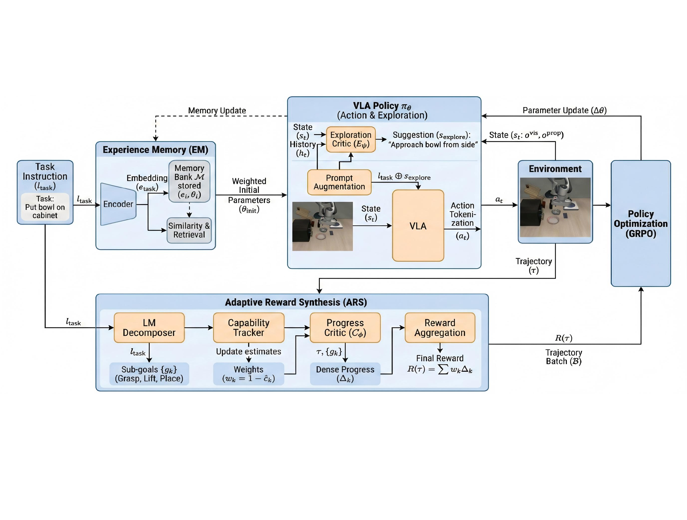
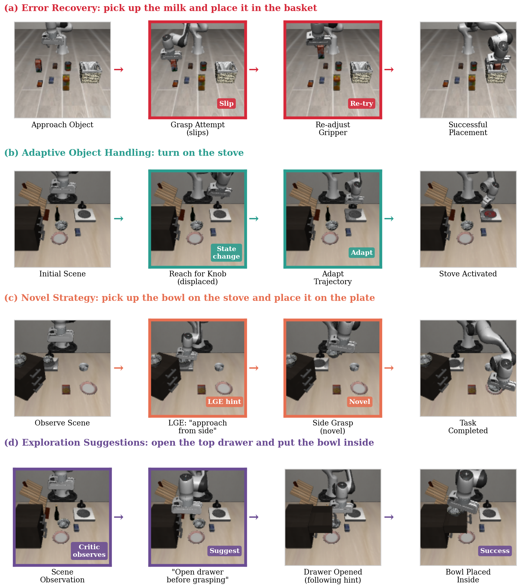

# Agentic-VLA: Efficient Online Adaptation for Vision-Language-Action Models

#

# 基本信息

- arXiv: [2605.22896](http://arxiv.org/abs/2605.22896v1)
- Authors: Ruofan Jin, Zaixi Zhang
- Categories: cs.RO, cs.AI, cs.LG

#

# 研究问题

面向VLA的智能体高效在线自适应框架

#

# 任务与挑战

当前Vision-Language-Action（VLA）模型主要依赖监督微调，面临泛化性差、需要大量专家演示数据以及缺乏在线纠错与自适应能力等瓶颈。近期虽有研究尝试通过强化学习对VLA进行在线适应，但普遍存在奖励信号噪声大、随机探索效率低下以及难以跨任务迁移知识等问题。本文针对上述挑战，提出Agentic-VLA——一种智能体化的训练框架，旨在让VLA在部署过程中能够高效、自主地持续学习与适应。

该方法包含三项核心创新。（1）自适应奖励合成（Adaptive Reward Synthesis）：利用大语言模型根据任务指令自动将复杂长程任务分解为子目标，并基于VLA对各子目标的实时掌握程度（通过指数移动平均成功率估计）动态调整奖励权重，从而形成细粒度的自动课程学习，稳定提供密集反馈。（2）语言引导探索（Language-Guided Exploration）：以Qwen3-VL-8B-Instruct作为探索评价模型，根据当前视觉观测与任务上下文生成自然语言建议（如“从左侧接近物体”），将建议与原始任务指令拼接后引导VLA生成动作，替代低效的随机探索；建议频率随学习进度自适应衰减。（3）经验记忆（Experience Memory）：基于任务指令嵌入维护已适应策略权重的记忆库，新任务通过语义相似度检索Top-k相关历史权重进行加权插值，实现热启动初始化，加速收敛并促进跨任务迁移。整体训练采用GRPO算法进行策略优化。

在LIBERO基准上，Agentic-VLA取得平均97.8%的成功率，较SFT基线提升8.6%，较此前最优的RL方法EVOLVE-VLA提升2.0%；其中长程任务（LIBERO-Long）提升高达12.3%。在极具挑战性的单样本学习场景中，平均成功率达70.5%，较基线提升26.9%。跨任务迁移实验表明，在无任何任务特定演示的情况下，成功率可从0%提升至31.2%。训练效率方面，达到90%成功率仅需700轮，收敛速度提升2.4倍。在双臂RoboTwin 2.0基准（含Hard随机化设置）上，该方法同样保持显著优势。消融与受控对比实验验证了各模块的协同效应，并证实所提出的能力感知课程、语言引导探索及相似度检索均优于通用替代方案。

该工作将“智能体化”思想系统性地引入VLA在线适应，通过动态奖励生成、结构化语言探索与经验记忆的紧耦合，显著降低了对大规模演示数据的依赖，并有效提升了长程任务完成能力与跨任务泛化性。对于关注VLA架构、样本高效机器人学习及持续自适应的研究者而言，本文提供了一个可直接扩展的框架，是推动VLA从静态模仿向真实部署时持续学习演进的重要一步。

#

# 核心 Insight

这篇论文的核心价值需要结合原文继续复查。当前 fallback 笔记保留了日报分析、DeepResearch 草稿和已筛选图表，避免自动流程中断。

#

# 方法与公式

#

## 第一模块：一分钟核心速写

1. **论文领域**：VLA

2. **TL;DR**：作者提出了一种基于 **agentic 训练框架** 的 **Agentic-VLA**，通过自适应奖励合成、语言引导探索与经验记忆三大机制，解决现有 VLA 模型在新环境泛化差、训练效率低、依赖大量示教数据的问题，在 LIBERO 长程任务上取得 **+12.3%** 的提升，在单样本学习上提升 **+26.9%**，并实现 **2.4 倍**收敛加速与零样本跨任务迁移（**0% → 31.2%**）。

3. **研究动机**：现存 VLA 通过模仿学习训练，泛化脆弱且数据效率低；近期在线适应方法又受限于噪声奖励、随机探索低效与知识无法跨任务复用。本文的切入点是将"学习过程本身智能化"——用多个智能体主动编排奖励、探索与记忆，而非将其视为固定流程。

4. **核心机制**：剥离公式后，本质是用一个 LLM 动态拆解任务并基于实时掌握度调整子目标奖励权重（课程学习），用一个 VLM 生成自然语言提示来引导策略探索而非随机试错，再用一个记忆库存储并插值历史策略权重以实现相似任务的**热启动**。

5. **关键数据**：
   - **最能证明有效性的数据**：LIBERO-Long 成功率从 OpenVLA-OFT 的 85.8% 提升至 **98.1%**（+12.3%），且相比前 SOTA 在线适应方法 EVOLVE-VLA（94.4%）仍有 **+3.7%** 优势；在严格匹配 rollout 预算的控制对比中（Table 5），ARS、LGE、EM 均优于通用替代方案（如固定课程、RND/ICM 探索、随机检索），证明增益来自具体设计而非通用组件。
   - **存疑的试验结果**：摘要声称 1-shot 提升 **+28.5%**，但正文 Table 2 显示相对 SFT 基线的平均提升为 **+26.9%**（70.5% vs 43.6%），两者存在口径差异；RoboTwin 2.0 仅报告了**代表性子集**（representative subset）而非全部 50 个任务的完整结果，子集选择虽声称保留趋势，但无法完全排除选择性报告偏差；此外，附录指出 **12%** 的失败案例源于奖励劫持（reward hacking），说明自适应奖励信号与真实环境成功标准存在结构性错位。

---

#

## 第二模块：核心架构解释

**整体架构与流程**

Agentic-VLA 在标准 VLA 策略（基于 OpenVLA-OFT，使用离散动作 token）之上，构建了一个由三个智能体模块协同驱动的在线适应闭环：

1. **Experience Memory (EM)**：在训练开始前，根据新任务的语言指令，从记忆库中检索语义最相近的历史任务策略权重，通过带温度（τ=0.1）的 softmax 加权平均初始化当前策略，实现热启动。
2. **Adaptive Reward Synthesis (ARS)**：使用 Llama-3-8B 将任务指令自动分解为子目标序列；维护每个子目标的 capability estimate（ĉ_k，近期成功率的指数移动平均，α=0.9）；奖励权重按 w_k = 1 − ĉ_k 计算， struggling 的子目标获得更高权重。轨迹总奖励为各子目标进度变化（由预训练 critic VLAC 估计）的加权和。
3. **Language-Guided Exploration (LGE)**：使用 Qwen3-VL-8B-Instruct 作为零样本探索评判器，根据当前视觉观测生成自然语言建议（如"从左侧接近"），通过 prompt 拼接注入 VLA 的动作生成过程。建议频率随近期平均奖励指数衰减（p_max=0.8, λ=0.5），早期多引导，后期逐渐退火。

**训练流程**：策略以 EM 热启动权重初始化 → 在环境中 rollout，期间按概率注入 LGE 建议 → ARS 计算 capability-aware 奖励 → 使用 GRPO（Group Relative Policy Optimization）更新策略参数 → 更新子目标 capability estimate → 循环直至收敛 → 将适应后的权重存入 EM。

**实验流程**：主实验在 LIBERO 四个套件（Spatial/Object/Goal/Long，每任务 50 条专家示教）上进行，对比 SFT 方法（Octo、OpenVLA、π0、OpenVLA-OFT）与 RL 方法（VLA-RL、SimpleVLA-RL、EVOLVE-VLA），报告 5 独立种子的均值±标准差。额外在 RoboTwin 2.0 双臂基准（含 Hard 随机化设置）验证跨平台泛化。消融实验采用逐步添加/移除组件，控制对比实验在匹配 rollout 与优化预算下替换单一组件。

**Python 风格伪代码**

```python
import torch
import torch.nn.functional as F
from transformers import AutoModel, AutoTokenizer

class ExperienceMemory:
    def __init__(self, capacity=100, k=3, tau=0.1):
        self.bank = []          

# list of (embedding, theta, metadata)

        self.capacity = capacity
        self.k = k
        self.tau = tau
        self.encoder = AutoModel.from_pretrained("sentence-transformer")
    
    def retrieve(self, task_instruction):
        e_new = self.encoder.encode(task_instruction)
        

# 检索 top-k 最相似任务

        sims = [torch.cosine_similarity(e_new, e_i, dim=-1) for (e_i, _, _) in self.bank]
        topk_idx = torch.topk(torch.stack(sims), self.k).indices
        neighbors = [self.bank[i] for i in topk_idx]
        

# 带温度 softmax 加权

        logits = torch.stack([sims[i] for i in topk_idx]) / self.tau
        weights = F.softmax(logits, dim=0)
        theta_init = sum(w * theta_j for w, (_, theta_j, _) in zip(weights, neighbors))
        return theta_init
    
    def update(self, task_instruction, theta, metadata):
        e = self.encoder.encode(task_instruction)
        self.bank.append((e, theta, metadata))
        if len(self.bank) > self.capacity:
            

# 基于覆盖度与成功率进行淘汰

            self.bank = self._evict(self.bank)

class AdaptiveRewardSynthesis:
    def __init__(self, alpha=0.9):
        self.alpha = alpha
        self.capability = {}    

# subgoal -> c_hat

        self.decomposer = AutoModel.from_pretrained("llama-3-8b")
        self.critic = VLAC()    

# 预训练进度估计器

    
    def decompose(self, task_instruction):
        subgoals = self.decomposer.generate(task_instruction)
        for g in subgoals:
            if g not in self.capability:
                self.capability[g] = 0.0
        return subgoals
    
    def compute_reward(self, trajectory, subgoals):
        total_reward = 0.0
        for g in subgoals:
            delta = self.critic.progress(trajectory, g)
            w = 1.0 - self.capability[g]
            total_reward += w * delta
        return total_reward
    
    def update_capability(self, subgoal_successes):
        for g, success in subgoal_successes.items():
            c_old = self.capability[g]
            self.capability[g] = self.alpha * c_old + (1 - self.alpha) * float(success)

class LanguageGuidedExploration:
    def __init__(self):
        self.vlm = Qwen3VL("8B-Instruct")
        self.p_max = 0.8
        self.lam = 0.5
    
    def should_suggest(self, smoothed_reward):
        p = self.p_max * torch.exp(-self.lam * smoothed_reward)
        return torch.bernoulli(p).item() == 1.0
    
    def get_suggestion(self, obs_image, task_instruction):
        prompt = (
            f"Task: {task_instruction}\n"
            "Analyze the scene and provide ONE concise, actionable suggestion "
            "about gripper positioning, approach angle, or obstacles."
        )
        suggestion = self.vlm.generate(obs_image, prompt)
        return suggestion

def train(task_instruction, base_policy, memory: ExperienceMemory):
    

# 1. Experience Memory 热启动

    theta = memory.retrieve(task_instruction)
    policy = base_policy.load_weights(theta)
    
    

# 2. ARS 初始化

    ars = AdaptiveRewardSynthesis()
    subgoals = ars.decompose(task_instruction)
    
    

# 3. LGE 初始化

    lge = LanguageGuidedExploration()
    recent_rewards = deque(maxlen=50)
    
    for iteration in range(N_ITER):
        batch = []
        subgoal_logs = {g: [] for g in subgoals}
        
        

# Rollout 阶段

        for _ in range(N_BATCH):
            obs = env.reset()
            traj = []
            for t in range(HORIZON):
                if lge.should_suggest(sum(recent_rewards)/len(recent_rewards) if recent_rewards else 0):
                    sugg = lge.get_suggestion(obs, task_instruction)
                    action = policy.generate(obs, task_instruction + " " + sugg)
                else:
                    action = policy.generate(obs, task_instruction)
                obs, _, done = env.step(action)
                traj.append((obs, action))
                if done:
                    break
            batch.append(traj)
        
        

# 奖励计算

        rewards = [ars.compute_reward(traj, subgoals) for traj in batch]
        recent_rewards.extend(rewards)
        
        

# GRPO 策略更新

        policy = grpo_update(policy, batch, rewards, lr=1e-5, group_size=8)
        
        

# 更新 capability estimate

        for traj in batch:
            successes = evaluate_subgoal_completion(traj, subgoals)
            ars.update_capability(successes)
    
    

# 存入经验记忆

    memory.update(task_instruction, policy.get_weights(), metadata={"success": evaluate(policy)})
    return policy
```

---

#

## 第三模块：核心学术问答

Q1: 这篇论文试图解决什么核心问题？

A1: 论文试图解决现有 VLA 模型在部署时面临的两大核心瓶颈：一是**泛化脆弱**，即基于模仿学习训练的模型在环境分布稍有偏移时即发生级联失败，且缺乏错误恢复能力；二是**训练效率低下**，传统方法需要数百条专家示教，且现有在线适应方法又受限于噪声奖励信号误导学习、随机探索浪费样本、以及知识无法跨任务复用。本质上，作者希望让 VLA 在部署后能够**高效、自主、持续地在线适应**新任务与新环境。

Q2: 作者提出的核心解决方案（创新点）是什么？

A2: 作者提出了 Agentic-VLA，一个将奖励设计、探索与知识迁移"智能化"的统一框架，包含三个核心创新：
- **Adaptive Reward Synthesis (ARS)**：利用 LLM 自动分解任务为子目标，并根据 VLA 对各子目标的实时掌握度（capability estimate）动态调整奖励权重，形成细粒度的自动课程学习。
- **Language-Guided Exploration (LGE)**：利用预训练 VLM 的零样本推理能力生成结构化自然语言建议，通过 prompt 拼接注入 VLA，替代低效的随机探索，并随学习进度自适应退火。
- **Experience Memory (EM)**：维护一个基于任务语义 embedding 的策略权重记忆库，通过 top-k 相似检索与软插值为新任务提供热启动，实现跨任务知识迁移。

Q3: 实验设计的关键支撑（或巧妙之处/数据集特点）是什么？

A3: 实验设计的关键支撑包括：
- **多维度基准覆盖**：主实验使用 LIBERO 的四个套件（Spatial/Object/Goal/Long），分别测试空间泛化、物体泛化、目标条件与长程任务；并在双机械臂平台 RoboTwin 2.0（含 Hard 域随机化）上验证跨平台泛化。
- **严格统计与对照**：所有主实验报告 5 独立种子的均值±标准差；消融实验不仅逐步添加组件，还设计了**匹配 rollout 预算的控制对比**（Table 5），将 ARS/LGE/EM 分别替换为固定课程、RND/ICM 探索、随机检索，证明增益来自具体机制而非"加了课程/探索/记忆就行"的通用效应。
- **极端数据稀缺与零样本场景**：专门测试了 1-shot 学习（每任务仅 1 条示教）和跨任务零样本迁移（在 Long 上训练，直接在 Object 上测试，无任务特定示教），强力验证了框架的数据效率与迁移能力。

Q4: 这篇论文最显著的贡献点（Top 3）是什么？

A4:
- **贡献1**：提出了首个面向 VLA 在线适应的 agentic 统一框架，将自适应奖励合成、语言引导探索与经验记忆集成到单一闭环中，实现了从"静态模仿"到"动态自主适应"的范式转变。
- **贡献2**：设计了基于能力感知的自适应奖励机制，通过子目标级别的动态课程学习，显著提升了长程任务表现（LIBERO-Long +12.3%）并达到 97.8% 的平均成功率。
- **贡献3**：实现了有效的跨任务权重迁移与热启动，在零任务特定示教的情况下将跨任务成功率从 0% 提升至 31.2%，并将收敛速度提升 2.4 倍，为 VLA 的持续学习提供了可行路径。

Q5: 这项工作在哪些相关研究的基础上做了推进？（列举1-2个最核心的前置工作即可）

A5:
- **前置工作1**：**OpenVLA-OFT**（Kim et al., 2025）。本文将其作为基础 VLA 架构与 SFT 基线，在其之上引入在线 RL 适应机制，突破了纯模仿学习的性能天花板。
- **前置工作2**：**EVOLVE-VLA**（Bai et al., 2025）。该工作提出了测试时训练与渐进式 horizon 扩展的课程学习。本文在其基础上推进，将课程粒度从任务/horizon 级别细化到子目标级别，并额外引入语言引导探索与经验记忆，在相同基准上全面超越其性能。

Q6: 客观评价：这篇论文的局限性、漏洞或"未讲明的故事"是什么？对后续科研有何启发？

A6: 论文的局限性与未讲明的故事包括：
- **奖励劫持（Reward Hacking）**：附录指出 12% 的失败案例源于 VLAC 进度估计器给出的高分状态并不满足环境的真实成功标准，说明自适应奖励信号与硬编码环境规则之间存在结构性错位，而作者仅将其列为未来工作，未在框架内提供有效的校准或约束机制。
- **经验记忆的理论与扩展性缺口**：EM 通过在权重空间插值历史策略进行热启动，尽管论文用低温度 top-k 和共享预训练起点进行了经验性辩护，但**权重空间插值的理论保证仍然缺失**；同时存储完整策略权重在任务规模扩大时（如数千任务）将面临显存与检索效率瓶颈，附录虽提及但未给出紧凑表示（如 LoRA/adapter）的实际方案。
- **仿真到现实的鸿沟**：所有实验均在仿真环境中完成。作者承认 Agentic-VLA 是一个组件丰富的系统（VLM 推理、进度估计、在线策略更新、记忆检索），真实机器人部署时任何单点误差都可能级联放大，而论文未提供任何真实硬件验证或 sim-to-real 迁移结果。
- **选择性报告风险**：RoboTwin 2.0 仅展示了代表性子集结果，虽然声称保留完整趋势，但读者无法独立验证全部 50 任务的分布。

对后续科研的启发在于：未来工作应优先研究**奖励信号的显式校准机制**（如结合环境成功判别器或人类反馈）以抑制奖励劫持；探索**参数高效的记忆表示**（如任务嵌入到低秩残差的映射）以提升经验记忆的可扩展性；并尽快开展**分阶段的真实世界验证**，从单模块（如仅 ARS）逐步过渡到全系统部署，验证 agentic 框架在物理世界中的鲁棒性与安全性。

#

# 贡献拆解

- 关键术语：Vision-Language-Action, Online Adaptation, Agentic RL, Curriculum Learning, Cross-Task Transfer
- 加权评分：4.05/5.0

#

# 关键图表解读



*Fallback selection because visual JSON selection failed.*



*Fallback selection because visual JSON selection failed.*


*Fallback selection because visual JSON selection failed.*


*Fallback selection because visual JSON selection failed.*

#

# 实验与消融

请优先核对主结果表、消融实验和真实/仿真任务设置；若图表已选中，应结合上方图片逐项复查。

#

# 局限性

当前自动精读未能成功调用完整图文生成模型，因此局限性需要结合原文实验设置进一步人工确认。

#

# 个人研究判断

若该论文与 World Models assisting Embodied AI、VLA、robot policy 或 sim-to-real 强相关，建议进入人工精读队列。
