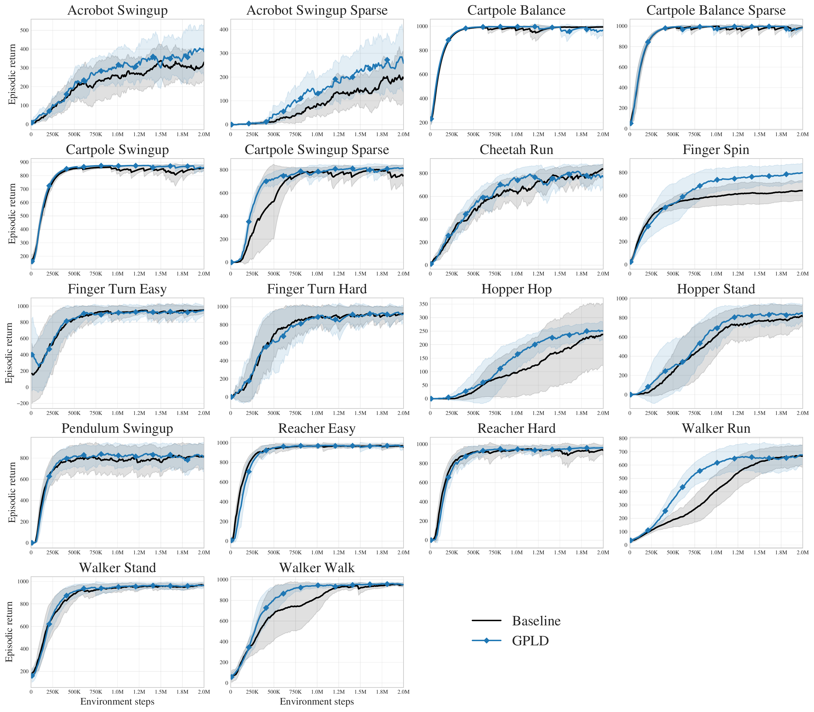
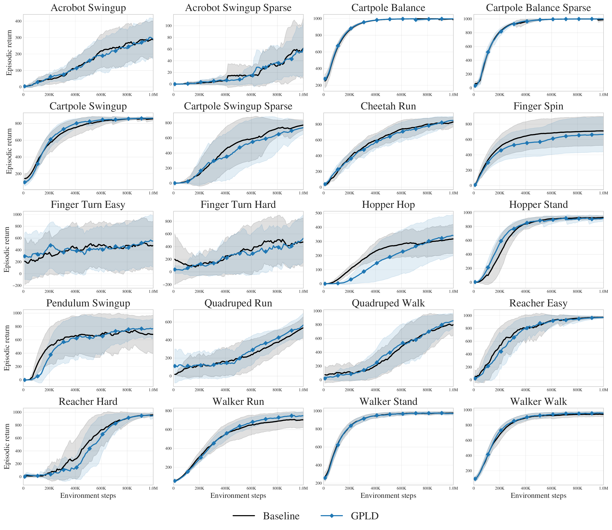
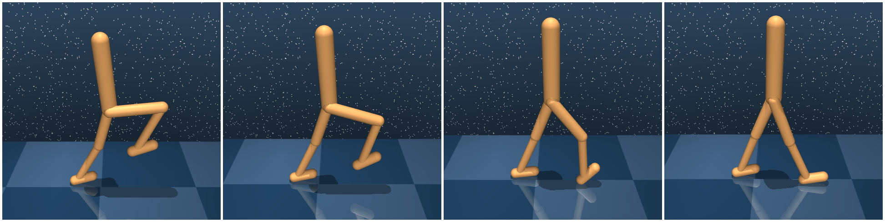
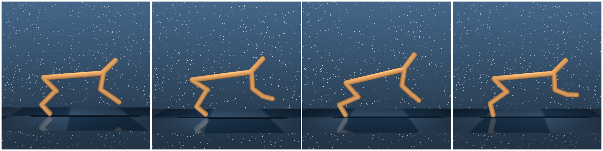

# Dreaming Smoothly and Sample Efficiently with Gradient Penalized Latent Dynamics

#

# 基本信息

- arXiv: [2605.23089](http://arxiv.org/abs/2605.23089v1)
- Authors: Romil V. Sonigra, P. R. Kumar
- Categories: cs.LG, cs.AI

#

# 研究问题

梯度惩罚潜动态正则化提升DreamerV3样本效率

#

# 任务与挑战

现有基于潜变量的世界模型（如DreamerV3）在学习转移动态时未显式利用局部平滑性这一归纳偏置，导致在连续控制任务中样本效率受限，尤其在复杂运动环境中需要大量交互数据才能学到可靠的动态模型。

本文提出GPLD（Gradient-Penalized Latent Dynamics），通过对DreamerV3的后验潜变量概率分布施加逐行Frobenius雅可比惩罚，显式鼓励局部平滑的转移学习。作者从理论上建立了离散MDP中有限差分平滑到连续潜空间雅可比正则的离散-连续对应关系，并利用Hutchinson随机探针（Rademacher噪声）高效估计该惩罚，避免了完整雅可比矩阵的高额计算开销。此外，GPLD仅正则化后验分布并采用随时间平方根衰减的惩罚系数，以平衡训练早期与后期的平滑约束。

在DeepMind Control（DMC）本体感知任务上，GPLD在不进行逐环境调参的情况下将归一化聚合样本效率提升17.7%，在高复杂度运动任务上提升达34.6%；在困难的四足任务上，GPLD在400万步长时程中更早达到高回报并表现出更稳定的后期学习。像素观测实验显示收益较弱，说明当视觉表征与动态学习耦合时，潜动态平滑正则化的作用会被部分掩盖。

该工作为潜变量世界模型引入了一种简单有效的局部平滑正则化手段，直接提升了基于模型的强化学习在机器人运动控制中的样本效率与长期稳定性。其理论动机（离散到连续的平滑性推导）和开源实现为后续在操作、sim-to-real等具身智能下游任务中改进世界模型提供了可复用的技术基础。

#

# 核心 Insight

这篇论文的核心价值需要结合原文继续复查。当前 fallback 笔记保留了日报分析、DeepResearch 草稿和已筛选图表，避免自动流程中断。

#

# 方法与公式

#

# 第一模块：一分钟核心速写

**1. 论文领域：** WorldModel

**2. TL;DR:** Sonigra & Kumar 提出了一种基于 **行级 Frobenius Jacobian 惩罚** 的 **GPLD-DreamerV3** 框架，以解决 **现有隐世界模型（如 DreamerV3）未显式利用局部转移平滑先验** 的问题，在 **DeepMind Control 本体感受任务** 上实现了 **归一化聚合样本效率提升 17.7%（高复杂度运动任务达 34.6%）**。

**3. 研究动机:** 现存方案（DreamerV3 等）最大的痛点是：它们将转移动力学视为通用函数逼近问题，忽略了连续控制系统中“邻近状态产生相似短程转移”这一基本结构先验，导致需要更多交互数据才能学到有效的转移结构。本文的切入点极其巧妙——它将 **离散嵌入状态 MDP 中的有限差分平滑** 严格推广到连续可微隐空间，自然导出 Frobenius Jacobian 正则化，并通过 Hutchinson 随机探针实现高效估计，最终仅对 DreamerV3 的后验隐概率图施加轻量正则。

**核心机制:** 在 DreamerV3 的后验隐概率图上施加行级 Jacobian 惩罚，强制相邻隐输入的后验类别分布变化平缓；利用 Rademacher 随机向量通过一次向量-雅可比积（VJP）无偏估计 Frobenius 范数，且仅正则化后验（而非先验）并随训练逐步衰减惩罚强度。

**4. 关键数据:**
- **最能证明有效性的一组核心数据：** 在 DMC 本体感受基准上，GPLD 以单一超参配置跨任务运行，在 1M 环境步取得 **17.7% 归一化聚合增益**，在高复杂度运动子集（cheetah-run、hopper-hop、walker-run 等）上达 **34.6%**，其中 hopper-hop 提升 **141.3%**。这组数据最具说服力，因为它排除了逐任务调参的干扰，直接证明局部平滑先验的普适价值。
- **存疑的试验结果：** **像素观测任务**上的增益显著减弱（仅“milder aggregate gains”）。论文自身也指出，当动力学学习与高维视觉编码耦合时，GPLD 的效果被削弱；此外，quadruped 任务在 1M 步内基线与 GPLD 均表现嘈杂，优势需到 4M 步长程才显现，说明其短期样本效率提升并非在所有困难任务上均一致成立。

---

#

# 第二模块：核心架构解释

#

## 模型架构与流程

**DreamerV3 基础。** GPLD 建立在 DreamerV3 的循环状态空间模型（RSSM）之上。在每个时间步 $t$，模型维护确定性隐状态 $h_t$、随机隐状态 $z_t$、编码器输出 $e_t$ 与动作 $a_t$。世界模型训练目标包含三部分：预测损失 $\mathcal{L}_{\mathrm{pred},t}$（重构、奖励、终止预测）、动态 KL $\mathcal{L}_{\mathrm{dyn},t}$（后验与先验的 KL，先验 stop-gradient）以及表征 KL $\mathcal{L}_{\mathrm{rep},t}$（后验与先验的 KL，后验 stop-gradient）。

**GPLD 正则化项。** 作者将后验输入记为 $u_t = [h_t, e_t]$。后验网络 $q_\phi$ 输出一个 $K \times C$ 的概率表（$K=32$ 个类别变量，$C=16$ 个类），其中第 $i$ 行为 $q_\phi^{(i)}(u_t) \in \Delta^{C-1}$。GPLD 对该后验隐概率图施加行级 Frobenius Jacobian 惩罚：


```math
\mathcal{R}_{\mathrm{GPLD}}(u_t) = \frac{1}{K}\sum_{i=1}^{K} \left\| J_{q_\phi^{(i)}}(u_t) \right\|_F^2.
```


为避免显式计算完整 Jacobian，作者采用 **Hutchinson 风格随机探针**：对每一行 $i$ 采样 Rademacher 噪声 $\epsilon_i \in \{-1,+1\}^C$，计算标量 $s_{k,i} = \langle \epsilon_{k,i}, \mathbf{q}_{k,i} \rangle$，再通过自动微分求 $g_{k,i} = \nabla_{x_k} s_{k,i}$。由于 $\mathbb{E}[\epsilon_i\epsilon_i^\top]=I_C$，有 $\mathbb{E}[\|g_{k,i}\|_2^2] = \|J\|_F^2$，从而无偏估计惩罚项。

**仅正则化后验。** GPLD 刻意不直接惩罚先验 $p_\phi(z_t \mid h_t)$。原因是后验直接依赖编码观测 $e_t$，正则化后验可约束从真实环境数据学到的隐表示；而先验通过 DreamerV3 的 $\mathcal{L}_{\mathrm{dyn},t}$ 与后验耦合，间接被平滑。消融实验证实，后验-only 的性能-成本权衡优于先验-only 或联合正则化。

**时间衰减策略。** 固定平滑惩罚在训练后期可能过度限制已收敛的模型。因此作者采用平方根衰减：


```math
\lambda^{\mathrm{post}}_T = \max\left( \frac{\lambda^{\mathrm{post}}_0}{\sqrt{1 + T_{\mathrm{updates}}/c}},\ \lambda_{\min} \right).
```


这符合有限状态直觉：数据匮乏早期需要显式平滑，数据充足后应减弱。

**实验流程。** 主实验在 DeepMind Control Suite 上进行，重点使用 **本体感受（proprioceptive）观测**（低维物理状态），次要评估 **像素（pixel）观测**（$64\times64$ 图像）。对比基线为相同超参的 DreamerV3。评估指标为样本效率（环境步数 vs. 平均回合回报），并报告原始与归一化聚合分数（每任务按 DreamerV3 最终分数归一化）。消融涵盖后验/先验/联合正则化、采样比例 $\rho$、惩罚系数 $\lambda$ 与衰减策略。此外包含局部敏感性诊断（扰动输入测 KL 变化）与计算开销测量。

#

## Python 风格伪代码

```python
import torch
import torch.nn.functional as F

def gpld_penalty(h, e, q_model, lambda_0, T_updates, c, lambda_min, rho, K=32, C=16):
    """
    h: [B, H_dim] 确定性隐状态
    e: [B, E_dim] 编码观测
    q_model: 后验网络，输出 logits [B, K, C]
    """
    

# 1. 时间衰减系数

    s = 1.0 + T_updates / c
    lambda_T = max(lambda_0 / (s ** 0.5), lambda_min)

    B = h.size(0)
    N = int(rho * B)
    if N == 0:
        return 0.0

    

# 2. 采样 batch 子集

    idx = torch.randperm(B)[:N]
    h_s = h[idx]
    e_s = e[idx]
    x = torch.cat([h_s, e_s], dim=-1)  

# [N, D]

    x.requires_grad_(True)

    

# 3. 前向得到后验概率表 [N, K, C]

    logits = q_model(x)
    q = F.softmax(logits, dim=-1)

    

# 4. Hutchinson 估计行级 Frobenius Jacobian 能量

    L_gp = 0.0
    for i in range(K):
        

# 每行独立采样 Rademacher 噪声

        eps = torch.randint(0, 2, (N, C), device=x.device).float() * 2.0 - 1.0
        

# 标量输出 s_i = <eps, q_i>

        s_i = (q[:, i, :] * eps).sum(dim=-1)  

# [N]

        

# 反向求梯度 g = nabla_x s_i

        grad = torch.autograd.grad(s_i.sum(), x, create_graph=True)[0]  

# [N, D]

        L_gp += (grad ** 2).sum()

    L_gp = L_gp / (K * N)
    return lambda_T * L_gp


# DreamerV3 + GPLD 训练循环示意

for batch in replay_buffer.sample():
    obs, action, reward, next_obs = batch

    

# RSSM 前向

    h, e, z, prior_logits, post_logits = dreamer_v3_world_model(obs, action)

    

# 标准 DreamerV3 损失

    loss_pred = reconstruction_loss + reward_loss + continue_loss
    loss_dyn = kl_divergence(sg(posterior), prior)
    loss_rep = kl_divergence(posterior, sg(prior))

    

# GPLD 正则化（仅施加于后验隐概率图）

    loss_gpld = gpld_penalty(
        h, e, q_posterior_net,
        lambda_0=0.5, T_updates=global_step,
        c=1000, lambda_min=0.001, rho=0.5
    )

    total_loss = (beta_pred * loss_pred 
                  + beta_dyn * loss_dyn 
                  + beta_rep * loss_rep 
                  + loss_gpld)
    total_loss.backward()
    optimizer.step()
```

---

#

# 第三模块：核心学术问答

Q1: 这篇论文试图解决什么核心问题？

A1: 现有基于隐世界模型的 MBRL（以 DreamerV3 为代表）在学习转移动力学时，未显式编码连续控制系统的局部平滑先验——即邻近状态应具有相似的短程转移行为。这导致世界模型需要更多环境交互才能学到有效的转移结构，样本效率受限，尤其在复杂运动环境中表现明显。

Q2: 作者提出的核心解决方案（创新点）是什么？

A2: 作者提出 GPLD（Gradient-Penalized Latent Dynamics），其核心创新包括三点：第一，建立从离散嵌入状态 MDP 的有限差分平滑到连续可微隐模型的 Frobenius Jacobian 正则化的严格理论推导；第二，在 DreamerV3 的后验隐概率图上施加行级 Jacobian 惩罚，并使用 Hutchinson 随机探针将其估计成本降至一次向量-雅可比积；第三，采用仅正则化后验（而非先验）并结合平方根时间衰减的策略，在几乎不改动原架构的前提下提升样本效率。

Q3: 实验设计的关键支撑（或巧妙之处/数据集特点）是什么？

A3: 实验设计的关键支撑包括：第一，在 DMC 本体感受任务上使用单一 GPLD 超参配置跨任务评估，无逐环境调参，证明方法的泛化性与易用性；第二，明确区分本体感受与像素观测设置，揭示视觉表征学习与动力学学习的耦合会削弱 GPLD 效果；第三，通过 4M 步的长程 quadruped 实验补充 1M 步结果，展示平滑正则化在困难任务上的长期一致性收益；第四，系统消融验证仅后验正则化优于先验/联合正则化，且平方根衰减优于固定惩罚。

Q4: 这篇论文最显著的贡献点（Top 3）是什么？

A4:
[贡献1] 理论桥梁：严格推导出离散嵌入状态 MDP 中的有限差分平滑在连续可微极限下等价于 Frobenius Jacobian 正则化，为隐世界模型的局部平滑提供了离散到连续的理论依据。
[贡献2] 实用正则化器 GPLD：以极低的实现侵入性（仅在后验上加 Jacobian 惩罚）显著提升 DreamerV3 在本体感受任务上的样本效率，归一化聚合增益达 17.7%，高复杂度运动任务达 34.6%。
[贡献3] 实证边界洞察：通过像素 vs. 本体感受对比、编码器-解码器热启动诊断和局部敏感性分析，量化了隐动力学正则化与视觉表征学习耦合时的效果边界，指出解耦视觉编码是释放 GPLD 潜力的关键。

Q5: 这项工作在哪些相关研究的基础上做了推进？（列举1-2个最核心的前置工作即可）

A5:
[前置工作1] DreamerV3（Hafner et al., 2025）：作为当前最先进的隐世界模型基线，GPLD 直接在其 RSSM 架构与训练目标上施加正则化，保留了其可扩展的训练与想象机制。
[前置工作2] 转移平滑性与 Lipschitz 动力学（Asadi et al., 2018 等）：前人从理论上证明了转移模型的 Lipschitz 约束可收紧多步估计误差界，但未给出适用于随机隐世界模型的可微局部 Jacobian 正则化方法；GPLD 填补了这一空白，将平滑性先验显式注入隐空间。

Q6: 客观评价：这篇论文的局限性、漏洞或"未讲明的故事"是什么？对后续科研有何启发？

A6: 局限性包括：第一，像素观测下增益显著减弱，论文虽通过编码器-解码器热启动诊断指出视觉表征学习的干扰，但未提出根本解决耦合问题的方案；第二，计算开销的 wall-clock 测量存在较大不确定性，默认配置报告 1.51× 开销，但同采样率下不同惩罚系数的运行时间差异显著（如 1.23× vs. 1.51×），说明测量可能受系统噪声影响，算法本身的精确开销仍不清晰；第三，局部平滑先验在本质上不适用于具有主导性不连续动力学的环境，而论文仅在 DMC 平滑运动任务上验证，其泛化到接触丰富、高度非光滑的真实机器人任务存疑。对后续科研的启发：可将 GPLD 与解耦视觉预训练（如先训练视觉编码器再固定或微调）结合，以分离表征与动力学学习；此外，探索自适应平滑强度（如基于模型不确定性的动态 $\lambda$）或将其扩展至扩散/流模型世界模型中的 score-based 平滑约束，是值得推进的方向。

#

# 贡献拆解

- 关键术语：latent world models, DreamerV3, Jacobian regularization, sample efficiency, continuous control
- 加权评分：4.0/5.0

#

# 关键图表解读



*Fallback selection because visual JSON selection failed.*



*Fallback selection because visual JSON selection failed.*



*Fallback selection because visual JSON selection failed.*



*Fallback selection because visual JSON selection failed.*

#

# 实验与消融

请优先核对主结果表、消融实验和真实/仿真任务设置；若图表已选中，应结合上方图片逐项复查。

#

# 局限性

当前自动精读未能成功调用完整图文生成模型，因此局限性需要结合原文实验设置进一步人工确认。

#

# 个人研究判断

若该论文与 World Models assisting Embodied AI、VLA、robot policy 或 sim-to-real 强相关，建议进入人工精读队列。
