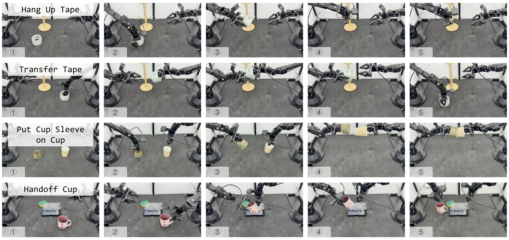
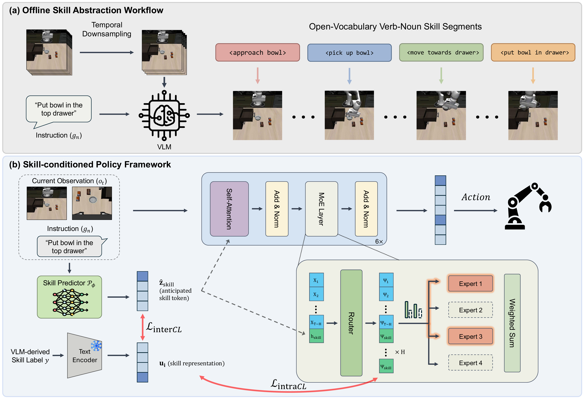
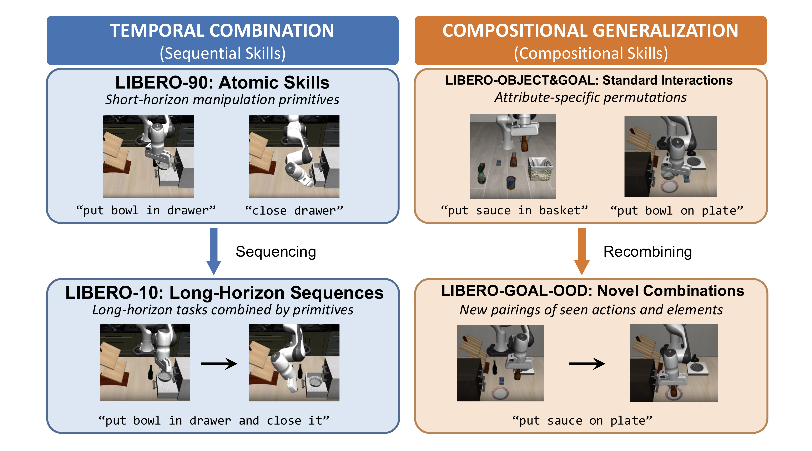
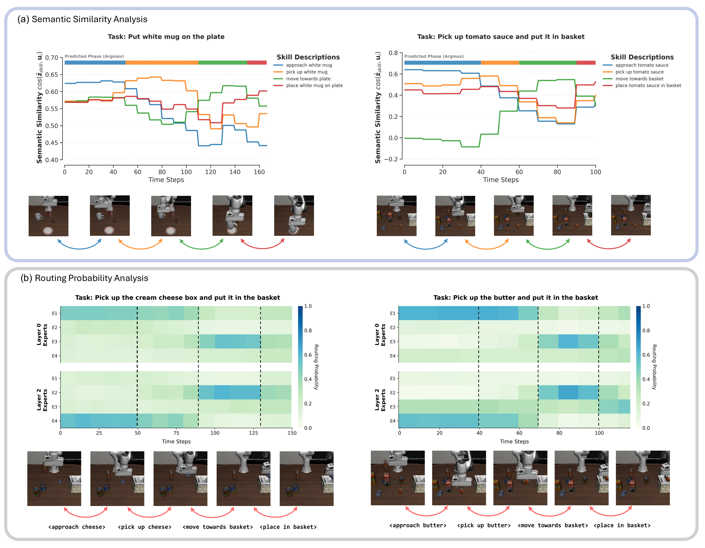

# Semantically Structured Mixture-of-Experts for Compositional Robotic Manipulation

#

# 基本信息

- arXiv: [2605.23477](http://arxiv.org/abs/2605.23477v1)
- Authors: Chengyu Deng, Guanqi Chen, Yizhou Chen, Zejia Liu, Zhiwen Ruan, Guanhua Chen, Jia Pan
- Categories: cs.RO

#

# 研究问题

语义结构化混合专家扩散策略实现可组合机器人操作

#

# 任务与挑战

扩散策略在机器人操作中已成为精确控制的新标准，但在多任务场景下面临严重的可扩展性瓶颈：高性能模型计算成本高昂，而轻量级替代方案难以在多样化的多任务环境中泛化。混合专家（MoE）架构通过稀疏激活参数提供了效率与容量权衡的解决思路，但现有MoE路由机制多依赖低层噪声或潜在统计特征，忽略了操作任务的组合本质，导致可复用的行为片段被分散到不同专家中，限制了模型的可解释性与跨任务迁移能力。

本文提出语义结构化混合专家扩散策略（SMoDP），将专家专精性与语义任务结构相锚定。该方法首先利用视觉-语言模型（VLM）离线自动标注示范数据，提取开放词汇的动词-名词技能片段；随后训练轻量级的推理时技能预测器，基于多模态上下文预测即将到来的技能嵌入。在MoE扩散策略中，SMoDP通过技能嵌入引导专家路由，并引入双重对比对齐策略：跨模态对比学习（InterCL）将预测的技能表征与语言定义的技能语义对齐；模态内对比学习（IntraCL）则在功能相关但视觉不同的行为之间强制路由一致性，确保语义相似的技能激活重叠的专家子集，从而实现块级别的一致路由。

实验在LIBERO模拟基准（含LIBERO-90/10/OBJECT/GOAL/GOAL-OOD）和真实ALOHA双臂机器人平台上开展。结果表明，SMoDP在多任务基准上优于代表性的扩散策略与MoE基线（包括DP-T、DP-CNN、SDP、MoDE及其预训练变体），在LIBERO-10和LIBERO-90上取得最高平均成功率，且数据效率显著：仅用50%数据即可媲美使用完整数据集并经过OXE预训练的MoDE。在少样本迁移实验中，SMoDP冻结专家参数、仅微调技能预测器与路由器（13.7M可训练参数，占总参数3.4%），在LIBERO-10的1/5/10样本设置下成功率分别达52.0%、76.5%和84.0%，大幅领先MoDE+LoRA。真实机器人实验中，SMoDP平均成功率达91.25%，较MoDE的47.50%提升近一倍。

SMoDP的意义在于为扩散策略的多任务扩展提供了一种语义感知的模块化方案。通过将语言衍生的技能结构显式注入MoE路由，该方法不仅提升了参数效率与数据效率，还实现了可解释的专家专精化与组合式迁移。对于关注世界模型辅助具身智能、VLA架构与扩散策略的读者而言，本文在动作生成中利用高层语义先验组织模型计算的思路，为构建可扩展、可迁移的机器人策略提供了重要参考。

#

# 核心 Insight

这篇论文的核心价值需要结合原文继续复查。当前 fallback 笔记保留了日报分析、DeepResearch 草稿和已筛选图表，避免自动流程中断。

#

# 方法与公式

DeepResearch 未生成；请回看论文正文中的方法章节与关键公式。

#

# 贡献拆解

- 关键术语：Mixture-of-Experts, Diffusion Policy, Vision-Language Models, Compositional Manipulation, Semantic Routing
- 加权评分：4.15/5.0

#

# 关键图表解读

*Fallback selection because visual JSON selection failed.*

*Fallback selection because visual JSON selection failed.*

*Fallback selection because visual JSON selection failed.*

*Fallback selection because visual JSON selection failed.*

#

# 实验与消融

请优先核对主结果表、消融实验和真实/仿真任务设置；若图表已选中，应结合上方图片逐项复查。

#

# 局限性

当前自动精读未能成功调用完整图文生成模型，因此局限性需要结合原文实验设置进一步人工确认。

#

# 个人研究判断

若该论文与 World Models assisting Embodied AI、VLA、robot policy 或 sim-to-real 强相关，建议进入人工精读队列。
