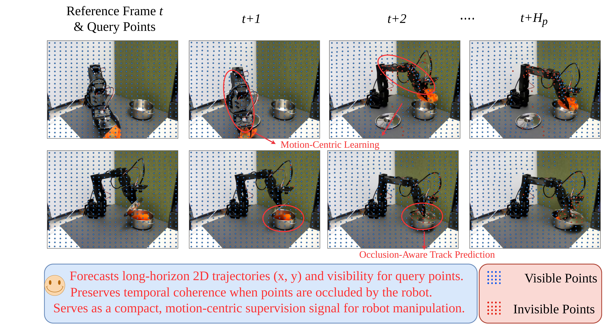
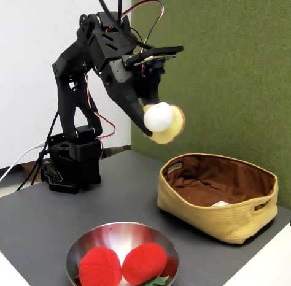
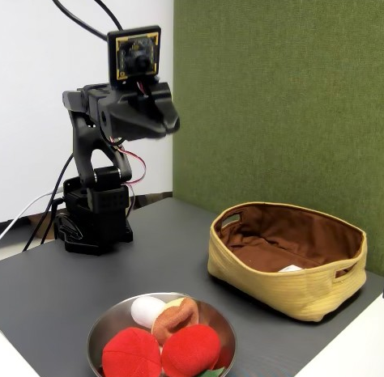

# Point Tracking Improves World Action Models

#

# 基本信息

- arXiv: [2605.23856](http://arxiv.org/abs/2605.23856v1)
- Authors: Jiarui Guan, Wenshuai Zhao, Yue Pei, Ziliang Chen, Arno Solin, Juho Kannala
- Categories: cs.RO

#

# 研究问题

联合像素与轨迹的世界动作模型提升机器人长程操作鲁棒性

#

# 任务与挑战

机器人策略学习日益依赖世界动作模型（WAM）来捕捉环境动力学，但现有方法大多将未来状态 instantiated 为像素或视觉token，导致动力学与光照、纹理等无关因素纠缠。尽管VLA模型在语义理解上表现强劲，却普遍缺乏对物理动态的显式建模，且近期研究表明仅基于像素的视频预训练并不总能提升下游操作成功率。因此，核心问题在于：什么样的未来状态表示能更好地桥接视频预测与机器人控制？

本文提出JOPAT，一种联合像素-轨迹世界动作模型。其核心思想是将2D点轨迹（含可见性）与视觉潜变量、机器人动作置于同一个去噪扩散Transformer（DiT）中联合建模。模型以当前观测为条件，在共享的扩散序列中同时对动作token、未来视觉潜变量和轨迹坐标进行去噪，并辅以可见性预测头。轨迹通过现成的点跟踪器（CoTrackerV3）提取，并以“轨迹即视频”的方式通过3D卷积进行patchify编码。训练时，无动作视频仅监督视觉与轨迹分支，机器人演示数据则监督全部分支，从而实现可扩展的预训练与策略微调。

在LIBERO四个任务套件上，JOPAT取得平均97.8%的成功率，创下新SOTA，尤其在长程任务LIBERO-Long上达到96.4%。真实机器人实验（LeRobot SO-101）中，平均成功率达57.5%，显著优于ACT（40%）和UWM（32.5%）。消融实验表明，联合建模至关重要：纯潜变量模型在Long上仅77.4%，纯轨迹模型仅26.2%。可见性预测头在真实任务中平均提升10个百分点。此外，利用DROID或OpenVid-1M进行无动作视频预训练，在仅10条演示的低数据场景下将成功率从11.9%提升至64.2%（DROID），展现了极强的数据效率。

该工作对世界动作模型的核心贡献在于“状态接口设计”：通过将点轨迹作为显式的运动表示引入生成式未来状态，JOPAT使动作token能够与对应层级的运动变量直接交互，而非仅从外观主导的潜变量中隐式推断运动。这不仅提升了对遮挡、离屏运动和长程时序依赖的鲁棒性，也为利用海量无动作视频进行可扩展预训练提供了有效途径。对于关注世界模型与具身智能交叉领域的研究者，JOPAT提供了一种将几何对应关系与像素语义紧密结合的实用框架。

#

# 核心 Insight

这篇论文的核心价值需要结合原文继续复查。当前 fallback 笔记保留了日报分析、DeepResearch 草稿和已筛选图表，避免自动流程中断。

#

# 方法与公式

#

# 第一模块：一分钟核心速写

1. **论文领域**：World Model 增强 VLA

2. **TL;DR**：JOPAT 团队提出了一种基于**联合像素-轨迹去噪扩散 Transformer** 的 World-Action Model，以解决像素级世界模型中**动力学与外观（纹理、光照）纠缠**的问题，在 LIBERO 和真实 LeRobot 任务上实现了 SOTA，其中 LIBERO 平均成功率达 **97.8%**，且在长程遮挡与出帧运动场景下提升最大。

3. **研究动机**：现存 WAM 将未来状态表示为像素或视觉 latent，导致运动变量被外观统计淹没，且对遮挡和出帧运动只能隐式处理，长程任务易漂移。本文的切入点极其直接：将 **2D 点轨迹及其可见性**作为显式运动表示纳入生成式未来状态，使动作 token 在扩散采样中直接与对应层级的运动变量交互，而非从外观中间接推断。

4. **核心机制**：在一个共享的 DiT 中，将**动作 token、未来视觉 latent token、轨迹坐标 token**视为联合去噪序列中的平等模态，通过双向全注意力让动作生成与显式运动对应关系及视觉语义共同推理；轨迹的可见性头则显式监督“证据缺失”状态。

5. **关键数据**：
   - **最能证明有效性的数据**：LIBERO-Long 上 **Joint 模型 96.4%** vs. **Latent-only 77.4%**，提升 **19 点**。这是在相同架构、相同预训练与微调协议下直接剥离轨迹变量的因果证据，证明轨迹对长程一致性的决定性作用。
   - **存疑的试验结果**：OOD 压力测试中，$\pi_{0.5}$ fine-tuned 在 **Book-Candy (0.95)**、**Soup-Cheese (0.82)**、**Moka-Moka (0.70)** 共 3/5 的任务上超过 JOPAT。理由：这说明大规模 VLA 的语义先验在部分视觉分布偏移下仍具尖锐优势，JOPAT 的显式运动建模并非在所有 OOD 场景都占主导，其优势更多体现在平均稳定性与抗干扰一致性上。

---

#

# 第二模块：核心架构解释

#

## 整体流程

**条件编码**：JOPAT 以最近 **2 帧 RGB 观察**作为输入，通过 **ResNet-18** 编码为全局条件特征 $\mathbf{c}_t$，随后通过 AdaLN 注入每一层 DiT Block。

**多模态目标构造**：
- **视觉分支**：未来 2 帧观察（offset $H=16$）经**冻结的 SDXL VAE** 编码为紧凑视觉 latent $\mathbf{z}^o$。
- **轨迹分支**：以当前帧 $o_t$ 为参考，在其上初始化 **$25\times25$ 网格查询点**（$N=625$），利用 **CoTracker3** 在 $H_p=19$ 步上跟踪，得到坐标 $\mathbf{P}\in\mathbb{R}^{H_p\times N\times 2}$ 与可见性 $\mathbf{V}\in\{0,1\}^{H_p\times N}$。坐标被 reshape 为时空网格 $\mathbf{G}^p\in\mathbb{R}^{2\times H_p\times 25\times 25}$，再经 **3D 卷积 Patchify（kernel 2×5×5）**压缩为轨迹 token $\mathbf{z}^p$。
- **动作分支**：末端执行器位姿增量与夹爪指令被 tokenize 为 $\mathbf{z}^a$。

**联合去噪**：将三类 noisy token 与 **8 个可学习 register token** 拼接为统一序列：


```math
\mathbf{Z}=[\tilde{\mathbf{z}}^a,\tilde{\mathbf{z}}^o,\tilde{\mathbf{z}}^p,\mathbf{r}]
```


一个 **12 层、768 维、12 头**的 DiT 对全序列施加双向自注意力，并独立接收模态专属扩散时间步 $\tau_a,\tau_o,\tau_p$。输出经独立头解码为：动作噪声、视觉 latent 噪声、轨迹坐标噪声、以及**可见性 logits**。

**训练目标**：
- 动作、视觉、轨迹坐标均使用标准扩散 MSE 损失；可见性使用 BCE。
- 对于**动作标注演示** $\mathcal{D}$，监督全部四个分支；对于**无动作视频** $\mathcal{V}$，mask 动作分支，仅监督视觉与轨迹分支。

**推理**：采用 **DDIM 10 步**联合去噪。视觉与轨迹 token 虽不被执行，但作为隐式未来状态变量在自注意力中与动作 token 交互。最终仅解码动作块 $\hat{a}_{t:t+K-1}$，执行前 **8 步**后重规划。

#

## Python 风格伪代码

```python
class JOPAT(nn.Module):
    def __init__(self):
        

# 编码器

        self.cond_enc = ResNet18()               

# 观察历史 -> 条件特征 c_t

        self.vae = FrozenSDXLVAE()               

# 未来观察 -> 视觉 latent z^o

        self.track_patchify = Conv3dPatchify(
            kernel=(2, 5, 5)
        )                                        

# 轨迹时空网格 -> z^p

        
        

# 共享骨干与输出头

        self.dit = DiT(
            depth=12, dim=768, heads=12, 
            registers=8
        )
        self.head_a = NoiseHead(dim=768)         

# 动作噪声

        self.head_o = NoiseHead(dim=768)         

# 视觉 latent 噪声

        self.head_p = NoiseHead(dim=768)         

# 轨迹坐标噪声

        self.head_vis = VisibilityHead(dim=768)  

# 可见性 logits (仅从轨迹 token 预测)

    def encode_tracks(self, P):
        

# P: [B, H_p, 625, 2]

        G = P.reshape(B, 2, H_p, 25, 25)
        z_p = self.track_patchify(G)             

# [B, d, L_p]

        return z_p.flatten(2).transpose(1, 2)    

# [B, L_p, d]

    def forward(self, obs_ctx, future_obs, P, V, actions=None):
        c = self.cond_enc(obs_ctx)               

# [B, d]

        
        

# 构造 clean target tokens

        z_o = self.vae.encode(future_obs)        

# [B, L_o, d]

        z_p = self.encode_tracks(P)              

# [B, L_p, d]

        z_a = tokenize(actions) if actions is not None else None
        
        

# 独立加噪

        tokens, noise, taus = {}, {}, {}
        for key, z in [('o', z_o), ('p', z_p), ('a', z_a)]:
            if z is None:
                continue
            eps = torch.randn_like(z)
            t = randint(0, 100)                  

# 训练使用 100 步扩散

            tokens[key] = sqrt_alpha[t] * z + sqrt_1m_alpha[t] * eps
            noise[key] = eps
            taus[key] = t
        
        

# 拼接序列: [action, visual, track, registers]

        Z = torch.cat([
            tokens.get('a', empty),
            tokens['o'], 
            tokens['p'], 
            self.register_tokens.expand(B, -1, -1)
        ], dim=1)
        
        

# 共享 DiT 去噪

        out = self.dit(Z, c, taus)               

# 统一输出序列，按位置拆分

        
        

# 计算损失

        loss = 0.0
        if 'a' in noise:
            loss += mse(self.head_a(out['a']), noise['a'])
        loss += mse(self.head_o(out['o']), noise['o'])
        loss += mse(self.head_p(out['p']), noise['p'])
        loss += bce(self.head_vis(out['p']), V)  

# 可见性监督

        
        return loss

    @torch.no_grad()
    def infer(self, obs_ctx):
        c = self.cond_enc(obs_ctx)
        

# 从噪声初始化

        z_a = torch.randn(B, K, d)
        z_o = torch.randn(B, L_o, d)
        z_p = torch.randn(B, L_p, d)
        
        for t in reversed(ddim_steps(num_steps=10)):
            Z = torch.cat([z_a, z_o, z_p, self.register_tokens], dim=1)
            out = self.dit(Z, c, taus={'a': t, 'o': t, 'p': t})
            
            

# 各模态独立 DDIM 更新

            z_a = ddim_step(z_a, self.head_a(out['a']), t)
            z_o = ddim_step(z_o, self.head_o(out['o']), t)
            z_p = ddim_step(z_p, self.head_p(out['p']), t)
        
        actions = decode_action(z_a)
        return actions[:, :8]                    

# 执行前 8 步后重规划

```

---

#

# 第三模块：核心学术问答

Q1: 这篇论文试图解决什么核心问题？

A1: 现有 World-Action Model 将未来状态表示为像素或视觉 latent，导致运动变量与外观（纹理、光照、背景）纠缠，无法显式表达遮挡、出帧、物体位移等控制相关动态。本文旨在设计一种未来状态接口，在保留视觉语义的同时显式暴露可控制的运动对应关系，从而让无动作视频预训练真正服务于机器人策略学习。

Q2: 作者提出的核心解决方案（创新点）是什么？

A2: 提出 JOPAT，将 2D 点轨迹（含可见性）与视觉 latent 并列为生成式未来状态，在一个共享的去噪扩散 Transformer 中联合建模动作、像素 latent 和轨迹坐标。轨迹作为显式的对应层运动接口，使动作 token 在采样过程中直接与运动变量交互，而非仅从外观 latent 中隐式推断运动；可见性头则显式建模“证据缺失”状态，避免遮挡点产生虚假运动监督。

Q3: 实验设计的关键支撑（或巧妙之处/数据集特点）是什么？

A3: 
- **双数据源解耦**：大规模无动作视频（DROID / OpenVid-1M）预训练像素-轨迹动态，少量动作标注演示（LIBERO / LeRobot）对齐控制，验证轨迹接口的可扩展性。
- **严格模态消融**：Latent-only、Track-only、Joint 在相同预训练与微调协议下对比，直接证明二者互补性（Joint 96.4% vs. Latent-only 77.4% vs. Track-only 26.2%）。
- **OOD 压力测试**：通过扩展物体初始化范围、替换未见背景物体、添加空间干扰物，专门测试遮挡与干扰下的长程稳定性。

Q4: 这篇论文最显著的贡献点（Top 3）是什么？

A4:
[贡献1] 提出像素-轨迹联合未来状态接口，将点轨迹的显式运动对应关系纳入世界-动作模型的生成式框架，而非仅作为策略输入或辅助损失。
[贡献2] 在 LIBERO 上达到 97.8% 平均成功率（SOTA），并通过大量消融证明轨迹对长程任务（+19% over latent-only）和遮挡鲁棒性的关键作用。
[贡献3] 证明无动作视频预训练可通过像素-轨迹目标有效迁移到下游控制，在仅 10 条演示的低数据下将成功率从 11.9% 提升至 64.2%。

Q5: 这项工作在哪些相关研究的基础上做了推进？（列举1-2个最核心的前置工作即可）

A5:
[前置工作1] Unified World Models (UWM) 等像素级 WAM：建立了联合视频预测与动作生成的扩散 Transformer 框架，JOPAT 在此基础上扩展了轨迹模态作为显式运动接口。
[前置工作2] CoTracker / TAP-Vid 等点跟踪器：提供了从普通视频中提取密集 2D 轨迹的监督信号，使 JOPAT 的轨迹目标可扩展且无需人工标注。

Q6: 客观评价：这篇论文的局限性、漏洞或"未讲明的故事"是什么？对后续科研有何启发？

A6: 
- **局限1**：网格轨迹稀疏（25×25）且固定，难以捕捉亚厘米级形变和精细接触几何，导致 Insert-Peg 类任务失败率极高（仅 10% SR）。
- **局限2**：依赖离线 CoTracker 生成监督，存在性能天花板——模型无法学习跟踪器未能捕捉的动态，且论文未分析跟踪误差如何传播到控制。
- **局限3**：推理速度约 10 Hz，难以满足高频控制（>20 Hz）需求；且针对静态相机优化，未处理移动相机/自运动。
- **未讲明的故事**：轨迹与视觉 latent 在 Transformer 内部的交互机制（如跨模态注意力权重分布）缺乏深入分析；真实世界实验仅 4 个任务且每任务 10 次 rollout，统计显著性有限。
- **后续启发**：未来应探索轨迹-3D 几何-触觉的融合，以及将跟踪器内嵌为可学习模块以突破监督瓶颈；同时需在更大规模真实任务与移动相机场景下验证该状态接口的普适性。

#

# 贡献拆解

- 关键术语：World-Action Model, Point Tracking, Diffusion Transformer, Robot Manipulation, Action-Free Pretraining
- 加权评分：4.15/5.0

#

# 关键图表解读



*Fallback selection because visual JSON selection failed.*


*Fallback selection because visual JSON selection failed.*



*Fallback selection because visual JSON selection failed.*



*Fallback selection because visual JSON selection failed.*

#

# 实验与消融

请优先核对主结果表、消融实验和真实/仿真任务设置；若图表已选中，应结合上方图片逐项复查。

#

# 局限性

当前自动精读未能成功调用完整图文生成模型，因此局限性需要结合原文实验设置进一步人工确认。

#

# 个人研究判断

若该论文与 World Models assisting Embodied AI、VLA、robot policy 或 sim-to-real 强相关，建议进入人工精读队列。
