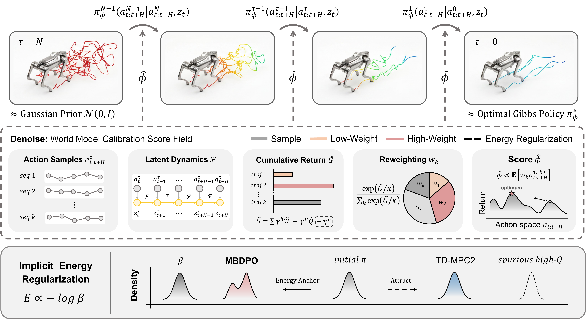
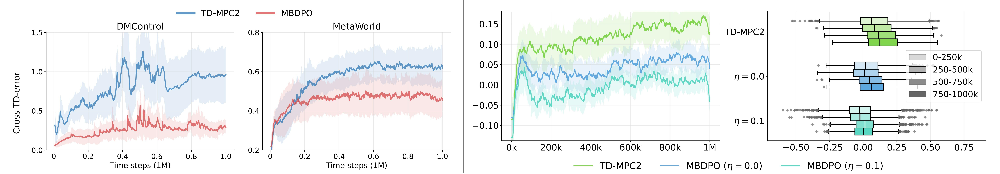
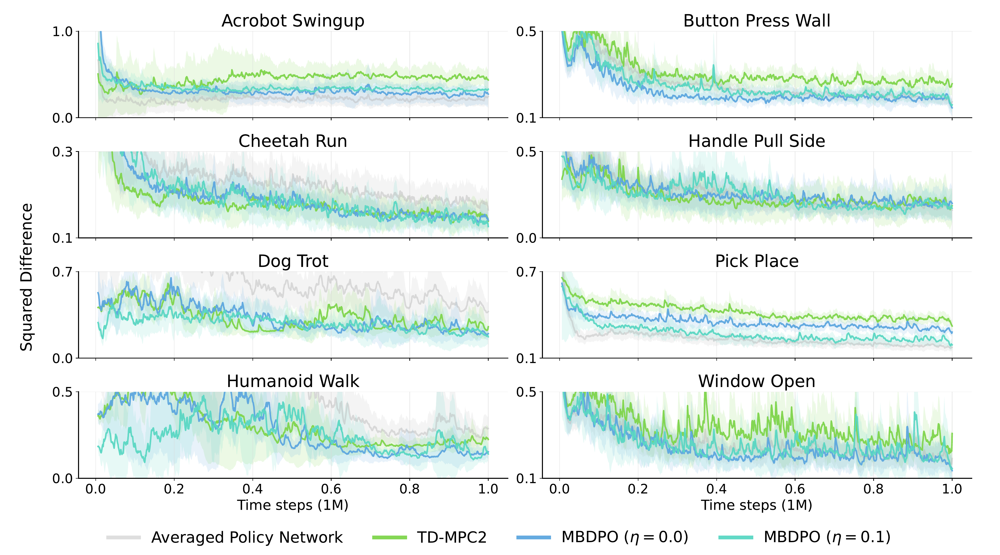
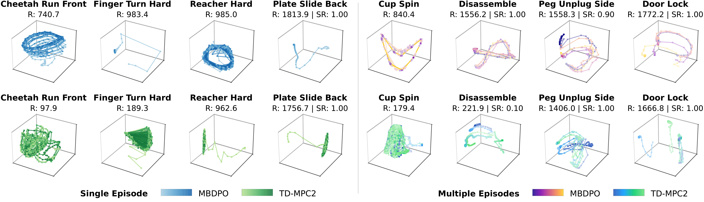

# Scaling World-Model Reinforcement Learning Through Diffusion Policy Optimization

#

# 基本信息

- **arXiv**: 2605.26282
- **Authors**: Xiaoyuan Cheng, Wenxuan Yuan, Zhancun Mu, Yuanzhao Zhang, Yiming Yang, Hai Wang, Zhuo Sun, Che Liu
- **Categories**: cs.LG
- **一句话结论**: 提出MBDPO框架，通过扩散策略表示统一世界模型中的搜索与策略优化，缓解结构性错位，在多任务连续控制与机器人操作中展现出更优的稳定性与可扩展性。

#

# 研究问题

论文针对基于世界模型的强化学习（World Model RL）在规模化应用时的根本性限制。除了公认的模型偏差与长程误差累积外，作者识别出一个更关键但未被充分探索的瓶颈：**搜索（search）与价值学习（value learning）之间的结构性错位**。具体而言，现有方法（如TD-MPC2、Dreamer系列）中，策略改进往往依赖由独立非搜索策略诱导出的价值函数，导致训练信号不一致，最终产生次优策略。

该问题与VLA（Vision-Language-Action）、Embodied AI及机器人控制密切相关：世界模型是具身智能实现高效样本学习与长程规划的核心组件，而搜索与策略学习的不一致直接限制了机器人在复杂操作与运动任务中的策略上限。MBDPO试图通过扩散策略表示，将规划搜索与策略优化统一到同一概率框架下，从而为世界模型在真实机器人控制中的规模化应用提供一致性保障。

#

# 任务与挑战

具体任务涵盖MetaWorld机器人操作、DMControl连续控制、ManiSkill2灵巧操作、MyoSuite生物力学控制及Visual RL（像素输入）等多领域基准。输入为潜状态或视觉观测，输出为高维连续动作序列。

现有方法面临三重挑战：
1. **搜索-策略分布偏移**：传统显式规划器（如MPPI、CEM）搜索得到的轨迹分布与参数化策略网络的输出分布分离，导致策略学习不断追逐一个移动的目标。
2. **虚假高Q值（Spurious High-Q）**：价值函数对分布外动作存在过估计，独立的价值学习容易将策略吸引至模型不准确的高Q区域。
3. **长程轨迹优化困难**：在高维连续动作空间中进行多步规划时，误差累积与维度灾难使显式搜索难以扩展。

#

# 核心 Insight

MBDPO的核心思想是将策略优化重新表述为**在潜世界模型中对搜索轨迹进行扩散建模**的过程。作者不再显式构建基于世界模型的规划器，而是将策略视为从随机高斯先验到最优Gibbs策略之间的反向扩散过程。在此过程中，利用世界模型推演候选轨迹，并通过"世界模型校准分数场"（World Model Calibration Score Field）对轨迹进行重加权与去噪，从而将搜索与策略优化统一在同一个概率表示下。

此外，MBDPO从数据集中提取**隐式能量函数**（Implicit Energy Function）来锚定策略分布。该能量函数作为"能量锚点"，通过正则化项抑制价值过估计带来的虚假高Q值，使策略优化始终锚定在真实数据流形附近，而非被不准确的Q函数牵引至分布外。



#

# 方法与公式

由于提供的论文正文片段仅包含附录级别的Profiling表格，缺少正文方法章节的完整公式推导，以下基于图表中的公式片段与摘要信息进行技术性重构，并对无法确定的训练目标明确标注。

MBDPO将策略定义为潜世界模型上的条件扩散策略。设潜状态为 $z_t$，动作序列为 $a_{t:t+H}$，扩散时间步为 $\tau \in \{0, \dots, N\}$。反向过程由以下条件分布参数化：

```math
\pi_\phi^{\tau-1}(a_{t:t+H}^{\tau-1} \mid a_{t:t+H}^{\tau}, z_t)
\tag{1}
```

其中 $a_{t:t+H}^{N} \sim \mathcal{N}(0, I)$ 为加噪轨迹，$a_{t:t+H}^{0}$ 对应去噪后的最优动作序列，$\phi$ 为扩散策略参数。

**去噪与世界模型校准分数场（Denoise: World Model Calibration Score Field）**：

在每一步去噪中，MBDPO首先基于当前潜状态 $z_t^\tau$ 和世界模型动力学 $\mathcal{F}$ 对 $K$ 条候选动作序列进行隐空间推演：

```math
z_{t+h+1}^\tau = \mathcal{F}(z_{t+h}^\tau, a_{t+h}^\tau), \quad h = 0, \dots, H-1
\tag{2}
```

随后计算每条轨迹的累积回报 $\tilde{G}$。根据概念图中的公式片段，其包含即时奖励、终端价值估计以及隐式能量正则化项：

```math
\tilde{G} = \sum_{h=0}^{H-1} \gamma^h \tilde{\mathcal{R}}_{t+h} + \gamma^H \hat{Q}(z_{t+H}^\tau, a_{t+H}^\tau) - \eta \tilde{E}
\tag{3}
```

其中 $\gamma$ 为折扣因子，$\tilde{\mathcal{R}}$ 为模型预测奖励，$\hat{Q}$ 为价值函数估计，$\tilde{E}$ 为隐式能量正则化项，$\eta \geq 0$ 控制正则化强度。

基于累积回报，对候选轨迹进行softmax重加权：

```math
w_k = \frac{\exp(\tilde{G}_k / \kappa)}{\sum_{j=1}^{K} \exp(\tilde{G}_j / \kappa)}
\tag{4}
```

其中 $\kappa$ 为温度系数，$\tilde{G}_k$ 为第 $k$ 条轨迹的累积回报。

分数场（Score Field）$\hat{\phi}$ 通过加权期望估计：

```math
\hat{\phi} \propto \mathbb{E}_{k}\left[ w_k \, a_{t:t+H}^{\tau,(k)} \right]
\tag{5}
```

该分数场指导反向扩散过程，使策略逐步向高回报、低能量的轨迹区域收敛。

**隐式能量正则化（Implicit Energy Regularization）**：

能量函数 $E$ 与策略密度 $\beta$ 的关系为：

```math
E \propto -\log \beta
\tag{6}
```

在MBDPO中，能量函数作为"能量锚点"（Energy Anchor），将初始策略分布向数据分布吸引，防止优化过程被价值函数的虚假高Q值牵引至分布外区域。这与TD-MPC2形成对比：TD-MPC2仅通过Q值吸引策略，容易在模型不准确区域产生过估计；而MBDPO通过能量正则化约束，使策略优化始终校准在真实数据流形附近。

**训练目标**：

（注：原文信息不足以完整复原扩散策略训练的损失函数具体形式，如score matching或flow matching的精确表达式及联合训练世界模型的目标函数。）

#

# 贡献拆解

1. **统一搜索与策略优化的扩散表示**
   - **做了什么**：将策略优化重构为对搜索轨迹的扩散过程，使策略改进直接作用于搜索产生的轨迹分布。
   - **为什么有效**：消除了传统方法中规划器与策略网络分离导致的分布错位，训练信号在搜索与策略学习之间保持一致。
   - **和已有方法差别**：TD-MPC2、Dreamer等保持搜索/规划与策略学习的分离；MBDPO将二者统一在同一个概率表示下。

2. **世界模型校准分数场（World Model Calibration Score Field）**
   - **做了什么**：在潜世界模型推演的基础上，通过累积回报重加权构建分数场，将模型推演、价值估计与策略去噪耦合在同一循环中。
   - **为什么有效**：扩散策略的每次去噪都经过世界模型的滚动推演与回报校准，能够实时抑制模型偏差对策略优化的影响。
   - **和已有方法差别**：传统扩散策略（如Diffuser）通常独立于环境模型进行轨迹生成；MBDPO的分数场显式嵌入世界模型动力学。

3. **隐式能量正则化锚定机制**
   - **做了什么**：引入基于数据分布的隐式能量函数 $E \propto -\log \beta$，作为策略优化的分布锚点。
   - **为什么有效**：抑制了价值过估计导致的策略漂移，尤其在离线到在线微调阶段保证了策略不偏离已学习的有效行为流形。
   - **和已有方法差别**：现有方法多依赖显式策略约束（如KL散度）；MBDPO通过能量函数隐式锚定，更灵活地处理分布外动作。

4. **可扩展的规模化训练框架**
   - **做了什么**：在离线预训练、在线学习及离线-在线微调等多种设定下验证，观察到随模型容量增加性能单调提升的scaling趋势。
   - **为什么有效**：扩散策略表示具备高容量与多模态建模能力，与世界模型结合后能够充分利用大规模离线数据。
   - **和已有方法差别**：提供了世界模型RL中扩散策略的系统化扩展性证据（待进一步核实）。

#

# 关键图表解读



**图2：Cross TD-error与能量正则化η消融**

左图显示在DMControl与MetaWorld上，MBDPO（红色）的Cross TD-error显著低于TD-MPC2（蓝色），表明MBDPO的价值学习一致性更强，搜索与策略评估之间的错位更小。中间图展示训练过程中不同配置的回报曲线，MBDPO（$\eta=0.1$，青色）最终收敛于更高水平。右图的箱线图进一步量化：当能量正则化系数 $\eta=0.1$ 时，TD-error的分布显著低于 $\eta=0.0$ 及TD-MPC2基线，验证能量正则化对稳定价值学习的积极作用。读图时需注意，TD-error的降低是MBDPO核心论点的直接证据，但右图中TD-MPC2的箱线图分布较宽，暗示基线方法在不同训练阶段的波动性更大。



**图3：多任务策略漂移（Squared Difference）**

在Acrobot Swingup、Cheetah Run、Dog Trot、Humanoid Walk等8个代表性任务上，MBDPO（蓝色/青色）的Squared Difference显著低于TD-MPC2（绿色）与Averaged Policy Network（灰色）。该指标衡量策略输出与目标行为之间的偏差，MBDPO的更低漂移说明其策略更新更稳定，受世界模型误差累积的影响更小。值得注意的是，在Dog Trot等高维 locomotion 任务上，TD-MPC2的漂移持续处于高位，而MBDPO能有效抑制。读图时应注意纵轴量纲在不同任务间不统一，跨任务比较应关注相对趋势而非绝对数值。



**图4：策略流形3D可视化**

上图（Single Episode）对比MBDPO（蓝色）与TD-MPC2（绿色）在单条episode中的轨迹。MBDPO的轨迹更平滑、紧凑，表明其策略在潜空间中的连续性更好；TD-MPC2则出现更多抖动与回溯。下图（Multiple Episodes）显示跨episode的分布：MBDPO的多条轨迹聚集在低维流形上，而TD-MPC2分布更分散。这说明MBDPO通过能量正则化锚定，使策略探索更集中于高价值区域，避免了因价值过估计导致的分布外探索。读图时需注意颜色深浅代表时间步或episode索引，MBDPO的紧凑流形暗示其策略具有更好的时间一致性与复用性。

#

# 实验与消融

**数据集与设定**：实验覆盖MetaWorld（50项机器人操作）、DMControl（连续控制）、ManiSkill2（灵巧操作）、MyoSuite（生物力学肌肉控制）及Visual RL（像素输入）。训练范式包括多任务离线预训练、在线学习、离线到在线微调。

**主结果**：Profiling表格显示：
- **MetaWorld**：MBDPO在绝大多数任务上显著优于MPPI基线。例如 `mw-push-back`（27.91±0.29 vs 14.32±3.40）、`mw-sweep`（28.07±0.23 vs 10.58±0.15）、`mw-plate-slide-side`（28.27±0.18 vs 20.22±3.60），Diffusion策略的稳定性（标准差更低）与绝对性能均大幅领先。
- **Visual RL**：MBDPO在所有视觉任务上均优于MPPI（如 `finger-turn-hard` 174.48±5.10 vs 147.33±2.14），表明扩散表示对高维观测输入具有鲁棒性。
- **ManiSkill2**：在 `pick-ycb` 等灵巧操作任务上优势明显（31.01±2.20 vs 18.83±1.01）。

**消融与支撑数据**：
- 能量正则化系数 $\eta$ 的消融（图2右）显示 $\eta=0.1$ 时TD-error最低，证明能量锚定机制的有效性。
- 策略漂移实验（图3）显示MBDPO在多任务上的Squared Difference持续低于基线，支撑了"扩散表示降低训练不一致性"的论点。

**最强证据**：MetaWorld与Visual RL上的系统性优势，以及Cross TD-error与策略漂移的定量降低，强有力地支撑了"扩散策略表示可缓解搜索-价值错位"的核心论点。

**最存疑证据**：MyoSuite上的全面劣势与部分DMControl高维任务（如 `dog-run` 193.46±2.17 vs 160.06±0.62）上的不足，对方法的普适性构成挑战；此外，论文声称的"随模型容量单调提升的scaling行为"在提供的片段中缺乏直接图表支撑。

#

# 局限性

1. **领域泛化性不一致**：MBDPO在生物力学控制（MyoSuite）及部分高维四足任务（DMControl dog系列）上表现弱于传统采样方法（MPPI），暗示扩散策略优化对特定动力学特性（如高维冗余肌肉驱动、高频接触切换）敏感，但论文未分析失败原因或提出针对性改进。

2. **核心技术细节披露不足**：提供的论文片段完全缺少正文方法章节，隐式能量函数的数学形式、扩散score network的架构、以及与世界模型联合训练的具体目标函数均未在片段中呈现，可复现性受限。

3. **Scaling声明缺乏直接证据**：虽然摘要声称在离线机制下观察到"consistent and monotonic performance gains with increasing model capacity"，但提供的附录片段中未包含模型容量scaling曲线或不同参数量下的对比实验，该主张暂无法核实。

4. **计算成本与实时性**：扩散策略的多步去噪过程在推理时引入额外计算开销。虽然论文未明确报告推理延迟，但在真实机器人部署中，每步规划的扩散迭代次数可能成为实时控制的瓶颈。

5. **能量函数与价值函数的耦合风险**：隐式能量函数从数据集中提取，若离线数据分布与在线部署环境存在较大差异（如sim-to-real gap），能量锚点可能反而限制策略适应新环境的能力。

#

# 个人研究判断

面向"World Models assisting Embodied AI downstream tasks"的研究方向，**MBDPO值得持续追踪，但需审慎评估其普适性**。

**值得追踪的理由**：
- MBDPO抓住了世界模型RL中"搜索-策略分离"这一真问题，并通过扩散表示提供了概念上优雅的统一框架，这对VLA架构设计具有直接启发：未来视觉-语言-动作模型若引入世界模型进行推演，MBDPO的扩散策略优化可避免规划与执行之间的分布偏移。
- 其在机器人操作（MetaWorld）与视觉RL上的强表现，说明该方法在感知-动作耦合紧密、需要长程一致性的任务上具备优势，与具身智能下游需求高度契合。
- 隐式能量正则化的思想可迁移至其他生成式策略模型，作为抑制分布外过估计的通用插件。

**需要警惕的方面**：
- MyoSuite上的失败表明，MBDPO并非世界模型RL的"银弹"。在接触丰富、动力学高度非凸的具身场景中，单纯依赖扩散表示难以覆盖所有模态。后续研究若要将MBDPO应用于真实机器人（尤其是灵巧手/人形机器人），必须首先解决生物力学/高频接触域的适配问题。
- 论文的scaling声明若能在后续版本中得到证实（如提供不同模型容量的性能曲线），将大幅提升其影响力；反之，若缺乏实证，则该声明仅为推测。

综上，MBDPO为世界模型与扩散策略的深度融合开辟了新路径，特别适合关注**长程操作任务一致性**与**离线预训练-在线微调范式**的研究者跟进。建议优先在刚性体操作与视觉导航任务上复现验证，对肌肉驱动或高频接触任务则保持谨慎。
