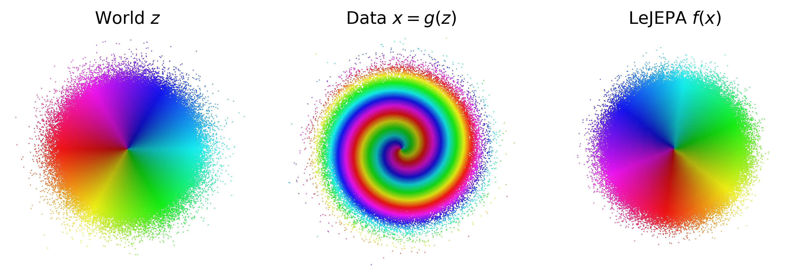
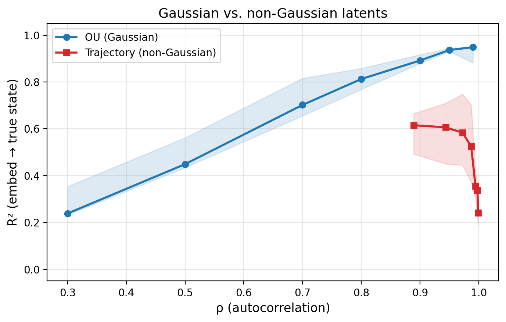
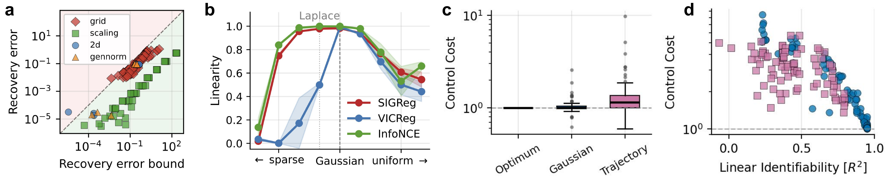
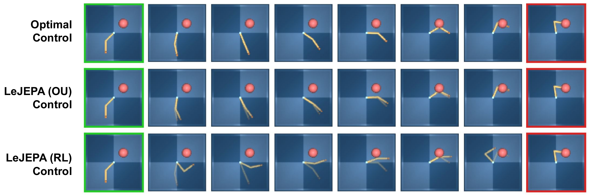

# When Does LeJEPA Learn a World Model?

#

# 基本信息

- **arXiv**: 2605.26379
- **Authors**: David Klindt, Yann LeCun, Randall Balestriero
- **Categories**: stat.ML, cs.LG
- **一句话结论**: LeJEPA（对齐损失加SIGReg高斯正则化）在非线性观测下能够线性恢复世界的真实潜在变量（线性可识别性），且在该类世界模型中，高斯潜在分布是唯一能保证此性质的分布；该性质可优雅退化，并足以支撑最优潜在空间规划。

#

# 研究问题

论文要解决的核心问题是：**自监督表示（具体为LeJEPA）何时能成为一个忠实的世界模型？** 即，在什么条件下，一个仅从原始像素或非线性观测中训练出的表示，能够数学上保证恢复出世界真实的、可用于规划和组合泛化的潜在变量结构（线性可识别性），而非仅仅学到某种任务相关但纠缠的自由度。

这与World Model、Embodied AI和机器人控制直接相关：如果表示空间只是对观测的压缩而非对世界真实自由度的忠实映射，那么在该空间中进行规划或组合泛化时，模型会因为混淆了无关自由度（如将物体位置与颜色混合）而失效。

#

# 任务与挑战

具体任务设定如下：

- **世界（World）**：假设存在真实的独立潜在变量 $z \in \mathbb{R}^n$，服从标准高斯分布 $z \sim \mathcal{N}(0, I_n)$。正样本对通过Ornstein–Uhlenbeck（OU）平稳转移生成：$z' = \rho z + \sqrt{1-\rho^2}\,\eta$，其中 $\eta \sim \mathcal{N}(0, I_n)$。随后，一个**未知**的非线性混合函数 $g$ 将潜在变量渲染为观测数据：$x = g(z)$。
- **学习者（LeJEPA）**：训练一个编码器 $f$（或等效地，组合映射 $h = f \circ g$），通过两个约束目标进行优化：对齐（Alignment）与高斯正则化（SIGReg）。

已有方法（如JEPA、VICReg、InfoNCE）在经验上表现强劲，但缺乏**可识别性**保证——无人能证明学到的表示是否真正对应世界的潜在结构，还是仅仅entangle了无关自由度。特别是，现有JEPA方法依赖隐式崩溃防止机制，其嵌入分布未指定，导致理论分析难以进行。

#

# 核心 Insight

本文最核心的思想是：**在具有平稳加性噪声转移的世界中，高斯潜在分布是唯一能保证LeJEPA学到线性可识别表示的分布，且这一性质是充分必要的。**

具体而言，作者将LeJEPA的经验配方（显式高斯正则化）转化为严格的数学定理。前向定理证明：在OU过程生成的高斯世界中，LeJEPA的对齐损失在Hermite多项式基底下等价于按 $\rho^d$ 衰减的谱滤波器——非线性分量（$d \geq 2$）被严格惩罚，唯有线性分量（$d=1$）能最大化相关性；高斯正则化进一步将线性映射锁死为正交矩阵。反向定理则通过Sturm–Liouville理论证明：若要求第一特征函数为线性，则潜在分布的score函数必须为线性，这唯一刻画了高斯分布。



上图直观展示了这一核心洞察：左侧面板为世界潜在变量 $z$（标准高斯），中间为经过未知非线性混合 $g$（此处为螺旋映射）后的观测数据 $x$，右侧面板显示LeJEPA学到的表示 $f(x)$ 成功恢复了高斯结构，仅差一个全局旋转。

#

# 方法与公式

#

## 世界模型与数据生成

世界由三个假设定义：

1. **独立性**：$p(z_i) \perp p(z_j)$ 且转移独立；
2. **平稳性**：$p(z) = p(z')$；
3. **加性噪声**：$z'_i = m_i(z_i) + \eta_i$。

在高斯世界特例中，$z \sim \mathcal{N}(0, I_n)$，平稳加性噪声转移唯一确定为OU过程：

```math
z' = \rho\, z + \sqrt{1-\rho^2}\;\eta, \qquad \eta \sim \mathcal{N}(0, I_n),\quad \eta \perp z
\tag{1}
```

其中 $\rho \in (0,1)$ 控制两视图间的自相关。

#

## LeJEPA训练目标

学习者优化组合映射 $h = f \circ g$，目标为：

```math
\min_h \mathcal{L}(h) = \underbrace{\mathbb{E}\!\left[\left\lVert h(z') - h(z) \right\rVert^2\right]}_{\textbf{Alignment}} \qquad \text{s.t.} \qquad \underbrace{h(z) \sim \mathcal{N}(0, I_n)}_{\textbf{Gaussianity}}
\tag{2}
```

在 whitening 条件下（$\mathrm{Cov}(h(z)) = I_n$），有 $\mathbb{E}[\|h(z)\|^2] = n$，因此损失可重写为：

```math
\mathcal{L}(h) = 2n - 2\sum_{i=1}^n \mathbb{E}\!\left[h_i(z')\, h_i(z)\right]
\tag{3}
```

这意味着**最小化距离等价于最大化正样本对的相关性**。

#

## 谱分解与Hermite多项式

对于高斯世界，转移算子 $T$ 的特征函数为Hermite多项式 $\{\mathrm{He}_k\}_{k \geq 0}$，特征值按 $\rho^d$ 衰减。任何分量 $h_i$ 可展开为：

```math
h_i(z) = \sum_{|\alpha| \geq 1} c_\alpha^{(i)}\, H_\alpha(z), \qquad \sum_{|\alpha| \geq 1} (c_\alpha^{(i)})^2 = 1
\tag{4}
```

其中 $H_\alpha(z)$ 为多变量Hermite基函数，$\alpha$ 为多指标。按总次数 $d=|\alpha|$ 分组，定义方差分数 $w_d^{(i)} = \sum_{|\alpha|=d} (c_\alpha^{(i)})^2$。则相关性满足：

```math
\mathbb{E}\!\left[h_i(z')\, h_i(z)\right] = w_1 \cdot \rho + w_2 \cdot \rho^2 + w_3 \cdot \rho^3 + \cdots \;\leq\; \rho
\tag{5}
```

等号成立当且仅当 $w_1 = 1$，即 $h_i$ 为线性函数。这是前向证明的核心：任何非线性扭曲都会严格降低正样本对的相关性。

#

## 主要理论结果

**定理1（LeJEPA线性可识别性）**：在高斯世界中，对任意满足 $h(z) \sim \mathcal{N}(0, I_n)$ 的可测映射 $h$，有 $\mathcal{L}(h) \geq 2(1-\rho)\,n$，等号成立当且仅当 $h(z) = Qz$（$Q \in O(n)$ 为正交矩阵）。此时转移动态也被精确恢复：$h(z') \mid h(z) \sim \mathcal{N}(\rho\, h(z), (1-\rho^2)\,I_n)$。

**定理2（高斯唯一性）**：在满足上述世界假设的所有分布中，若所有最优解都是线性的，则潜在变量 $z$ 必须是高斯分布。证明通过Sturm–Liouville理论：要求第一非恒定特征函数为仿射，强制score函数线性，从而唯一确定高斯密度。

**定理3（近似可识别性）**：设对齐间隙为 $\delta$，白化误差为 $\varepsilon$（即 $\|\mathrm{Cov}(h(z)) - I_n\|_F \leq \varepsilon$），令 $D = \delta/(2\rho(1-\rho))$，则存在 $Q \in O(n)$ 使得：

```math
\mathbb{E}\!\left[\left\lVert h(z) - Qz \right\rVert^2\right] \;\leq\; D \;+\; (\varepsilon + D)^2
\tag{6}
```

该界限表明恢复误差随近似误差优雅退化，且通常由对齐间隙 $\delta$ 主导。

**定理4（最优潜在空间规划）**：若 $h(z) = Qz$ 且代价函数 $\ell, \ell_T$ 对状态具有 $O(n)$ 正交不变性（如 $\ell(Rz, a) = \ell(z, a)$），则在学到的潜在空间 $\hat z = h(z)$ 中进行的最优控制与在真实潜在空间 $z$ 中的规划完全等价：最优动作序列与最优值函数均保持一致。

#

# 贡献拆解

1. **JEPA架构的首个可识别性定理**
   - **做了什么**：首次为JEPA架构提供了严格的线性可识别性保证，将LeJEPA/SIGReg的经验配方转化为数学定理。
   - **为什么有效**：利用Hermite多项式谱分解，证明对齐损失对非线性分量按 $\rho^d$ 严格惩罚，结合SIGReg高斯正则化将解锁死为正交线性映射。
   - **和已有方法差别**：先前JEPA/SSL方法缺乏可识别性保证；本文填补了自监督世界模型在理论基础上的空白。

2. **高斯分布的唯一性刻画**
   - **做了什么**：证明了在平稳加性噪声世界中，高斯分布不仅是线性可识别的充分条件，也是必要条件。
   - **为什么有效**：通过Sturm–Liouville理论，线性可识别性要求第一特征函数为仿射，这唯一强制了高斯分布。
   - **和已有方法差别**：颠覆了线性ICA中“高斯是不可分”的经典叙事，指出在非线性设定中高斯反而是线性可识别的唯一使能者。

3. **近似稳定性与规划等价性**
   - **做了什么**：提供了定量近似界（$D + (\varepsilon + D)^2$），并证明线性正交可识别性足以实现最优潜在空间规划。
   - **为什么有效**：近似界允许实际训练中的次优解仍保持有界的恢复误差；规划等价性建立了从表示学习到底层控制的严格桥梁。
   - **和已有方法差别**：将表示学习的理论保证直接延伸到控制任务，为端到端世界模型-控制管线提供了背书。

4. **从谱分析到实践的正则器层级洞察**
   - **做了什么**：通过高维实验（至1024维）比较SIGReg、VICReg、InfoNCE，发现显式高斯正则化在高维下更可靠。
   - **为什么有效**：基于批次统计的二阶矩/全分布正则化（SIGReg/VICReg）直接约束了表示空间的二阶结构，与理论假设更匹配。
   - **和已有方法差别**：揭示了不同正则化层级在实践中的差异，为大规模VLA/World Model的预训练目标设计提供了理论依据。

#

# 关键图表解读

#

## 图1：LeJEPA恢复世界模型（figure-001-fig-lejepa-demo.jpg）


该图是论文的“总览图”。左侧面板显示世界潜在变量 $z$ 为独立的标准高斯分布，用极角和半径着色；中间面板显示经过未知非线性混合 $g$（此处为螺旋映射）后的观测数据 $x=g(z)$，原始高斯结构被严重扭曲；右侧面板显示LeJEPA学到的表示 $f(x)$，成功恢复了各向同性的高斯散点结构，仅存在全局旋转。该图直观支撑了**定理1**的核心结论：LeJEPA能够逆转未知的非线性混合，恢复真实潜在结构。

#

## 图2：高斯vs非高斯潜在变量（figure-009-ou-vs-traj.png）



该图直接验证**定理2**（高斯唯一性）。蓝色曲线（OU过程，高斯潜在）显示：随着自相关 $\rho$ 增大，线性可识别性 $R^2$（embed到true state）单调上升，在 $\rho \to 1$ 时接近0.95。红色曲线（真实RL策略轨迹，非高斯且各向异性）则呈现截然不同的行为：$R^2$ 在 $\rho \approx 0.9$ 后显著下降，在 $\rho \to 1$ 时崩溃至约0.25。读图时需注意：高斯假设的破坏（非高斯边际、各向异性转移）导致线性可识别性失效，与理论预测完全一致，但也暴露了理论假设与真实机器人数据之间的鸿沟。

#

## 图3：理论界限、分布消融与规划性能（figure-004-fig-bound-unique-plan.png）



该四联图综合支撑了论文的主要实验结论：

- **子图a（左上）**：验证**定理3**的近似界限。横轴为理论预测的上界，纵轴为实际恢复误差。几乎所有数据点落在对角线下方（绿色区域），表明理论界在实际中成立；少数越界点被作者归因于有限样本噪声。
- **子图b（右上）**：在广义正态分布族（形状参数 $\alpha$，$\alpha=2$ 为高斯）中扫描线性恢复能力。$R^2$ 在 $\alpha=2$ 处出现尖锐峰值，SIGReg和InfoNCE在重尾区域（$\alpha < 2$）表现优于VICReg，直观展示**定理2**的“唯一性”。
- **子图c（左下）**：DMC Reacher控制成本的箱线图。基于高斯OU数据训练的编码器（Gaussian）控制成本与Oracle（最优控制）统计不可区分；而基于真实RL轨迹的编码器（Trajectory）成本显著偏高。
- **子图d（右下）**：控制成本与线性可识别性 $R^2$ 的散点关系。两者呈明显负相关：$R^2$ 越高，控制成本越低，直接支撑**定理4**——线性可识别性是将忠实世界模型转化为有效规划器的关键结构性质。

#

## 图4：潜在空间规划定性对比（figure-005-planning-demo.png）



该图定性展示了**定理4**在机器人reacher任务上的体现。三行分别对应：最优控制（Oracle）、LeJEPA在高斯OU数据上训练的编码器（LeJEPA (OU)）、LeJEPA在真实RL轨迹上训练的编码器（LeJEPA (RL)）。每行从左（绿色框，起始状态）到右（红色框，目标状态）展示时间序列帧。

- **Oracle**：关节空间直线插值，轨迹平滑直接。
- **LeJEPA (OU)**：在学到的潜在空间中进行直线插值后解码，轨迹与Oracle几乎完全重叠（图中显示为叠加），证明高斯编码器支持接近最优的规划。
- **LeJEPA (RL)**：轨迹明显偏离Oracle，出现不必要的弯曲和绕行，因为非高斯、各向异性的真实轨迹破坏了线性可识别性，导致潜在空间的“直线”在真实关节空间中并非最短路径。

#

# 实验与消融

#

## 数据集与设定

实验覆盖四个层次：

1. **2D可控实验**：使用螺旋（测度保持）、正弦剪切、抛物线剪切、RealNVP四种非线性混合，验证LeJEPA将纠缠观测恢复为旋转后高斯散点的能力。
2. **高维扩展**：维度从2扫描至1024，使用RealNVP混合与匹配编码器，排除架构表达力不足的因素。
3. **分布消融**：在广义正态分布族（形状参数 $\alpha$）中扫描，验证仅在 $\alpha=2$（高斯）处出现 $R^2$ 尖峰。
4. **真实控制**：在DMC Reacher像素输入上，对比人工高斯OU数据与真实RL策略轨迹数据的可识别性与规划性能。

#

## 基线与指标

- **基线/正则器**：SIGReg（显式高斯正则化）、VICReg（协方差正则化）、InfoNCE（对比学习）。
- **核心指标**：线性可识别性 $R^2(h \to z)$（在表示 $h$ 上作线性回归预测真实潜在 $z$ 的决定系数）、控制成本（Control Cost）、对齐间隙 $\delta$ 与白化误差 $\varepsilon$。

#

## 主结果

- **高维可识别性（表1）**：SIGReg与VICReg在 $N=1024$ 维时仍保持 $R^2 > 0.999$；InfoNCE在固定核宽 $\sigma=1$ 下随维度退化至约0.72。这表明基于批次统计的显式高斯/二阶矩正则化在高维下远优于隐式分布约束。
- **真实数据负对照（表2）**：DMC Reacher上，OU数据 $R^2$ 达0.95，而真实RL轨迹因非高斯与各向异性，总 $R^2$ 始终低于0.5，与**定理2**预测一致。

#

## 消融与支撑证据

- **最强证据**：高维扩展实验（1024维）中SIGReg/VICReg的 $R^2 > 0.999$ 强有力地支撑了**定理1**——在高斯假设下，线性可识别性在极高维度依然成立；同时2D螺旋实验（测度保持混合）证明了对齐损失本身才是迫使解纠缠的关键，而非观测空间的高斯性。
- **最存疑证据**：DMC Reacher真实轨迹实验虽然验证了反向定理，但也直接暴露了理论假设与真实机器人数据之间的巨大鸿沟。真实轨迹同时违反多个假设（非高斯、各向异性、关节限幅），导致 $R^2$ 崩溃，暗示现有理论在真实具身智能场景中的适用性仍有限。

#

# 局限性

1. **维度匹配假设**：定理严格假设编码器输出维度等于真实潜在维度（$m = n$）。当 $m < n$ 时，系统可能诉诸superposition；当 $m > n$ 时，冗余维度如何坍缩尚未触及——这是JEPA架构设计的直接开放问题。
2. **动作条件转移的可识别性**：定理仅刻画了**状态编码器**的可识别性，未证明动作条件转移 $\hat p(\hat z' \mid \hat z, a)$ 本身可被识别。论文在Discussion中坦承，这需要引入持续激励（persistent excitation）或干预性因果表示学习，属于正在进行的后续工作。
3. **高斯假设的现实性**：虽然作者以最大熵和中心极限定理为高斯性辩护，但真实世界任务中的潜在变量（如机器人关节角受限于物理范围）往往非高斯、非平稳且各向异性。Reacher实验已显示真实轨迹的 $R^2$ 崩溃，暗示理论保证与真实数据之间存在显著鸿沟。
4. **全局最优与有限样本**：结果是总体水平（population-level）的全局最优陈述。近似界（Thm. 3）虽graceful，但未刻画样本复杂度或随机梯度下降的动态收敛行为；实验中观察到的少数界限违反被归因于有限样本噪声。

#

# 个人研究判断

面向“World Models assisting Embodied AI downstream tasks”的研究方向，这篇论文**值得继续追踪**。

理由如下：

1. **理论奠基价值**：它是首篇为JEPA架构提供严格可识别性保证的工作，将经验上成功的LeJEPA配方转化为数学定理，为后续世界模型的理论研究提供了范式（世界假设+学习者目标→可识别性）。
2. **对数据策展的指导**：论文明确指出，若希望世界模型具备可证明的潜在恢复能力，预训练数据的采集应近似于各向同性的随机游走（如OU过程），而非高度结构化的专家轨迹。这对具身智能中的探索数据收集策略具有直接指导意义。
3. **正则器选择的启示**：高维场景下，显式高斯正则化（SIGReg）或至少二阶矩正则化（VICReg）比隐式分布约束（InfoNCE）更可靠，这为大规模VLA/World Model的预训练目标设计提供了理论依据。
4. **明确的开放问题**：论文坦诚指出了从状态可识别性扩展到动作条件动态、以及维度不匹配等开放问题，这些正是“World Models assisting Embodied AI”方向的核心瓶颈。追踪其后续工作（如引入因果干预视角的动作条件转移可识别性）有望获得高价值的研究切入点。

然而，也需警惕其局限：当前理论在真实非高斯、非平稳的机器人数据上保证较弱，直接套用其结论到复杂VLA下游任务时需谨慎。建议将其作为**理论基准**而非**工程手册**使用。
