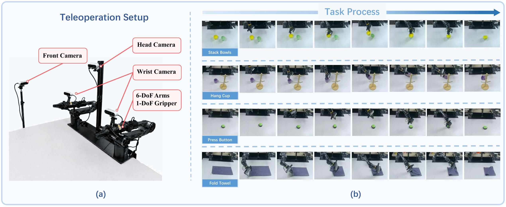
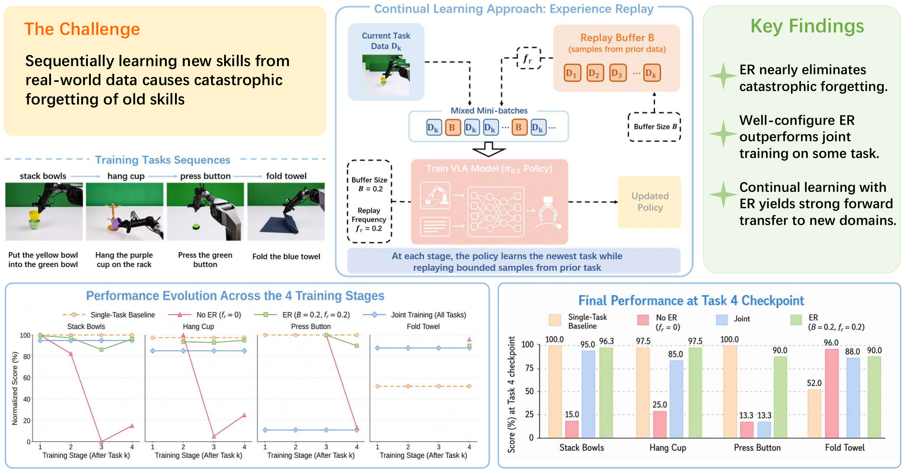
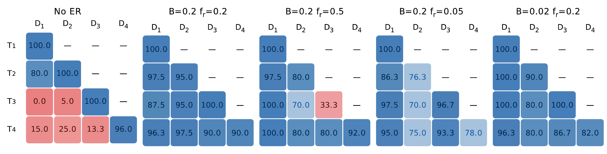
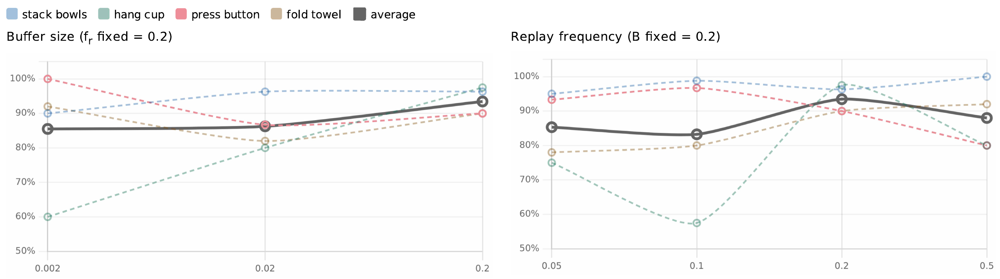

# Can VLA Models Learn from Real-World Data Continually without Forgetting?

#

# 基本信息

- arXiv: 2605.26820
- Authors: Jiarun Zhu, Yijun Hong, Xiaoquan Sun, Zetian Xu, Mingqi Yuan, Zhiyong Wang, Wenjun Zeng, Jiayu Chen
- Categories: cs.RO
- 一句话结论：在真实世界异构操作任务流上，VLA模型遭遇严重灾难性遗忘，而 modest experience replay（20%数据量与20%训练步数）即可近乎消除遗忘，且配置良好的顺序学习甚至优于联合训练。

#

# 研究问题

论文要解决的核心问题是：Vision-Language-Action (VLA) 模型在真实世界、异构、顺序到达的操作任务数据流上，是否会遭遇灾难性遗忘（catastrophic forgetting），以及经验回放（Experience Replay, ER）能否在严格遵循部署约束（无未来信息泄露、有限回放预算）的前提下有效缓解这一问题。

与现有研究多在仿真环境（如LIBERO）中进行不同，本文指出仿真基准存在三大局限：任务同质性高、与预训练数据重叠、实验协议常违反因果性（如预计算全局动作归一化统计量）。这些因素导致对遗忘的估计过于乐观，无法推广到真实部署。因此，本文首次在真实世界条件下重新评估VLA持续学习的可行性与挑战。

#

# 任务与挑战

具体任务为四个顺序到达的真实世界操作任务，使用AgileX PiPER机械臂采集，每个任务500条演示轨迹，共2000条：

1. **Stack Bowl (D1)**：刚性物体抓取与放置（黄碗放入绿碗）
2. **Hang Cup (D2)**：空间对齐与钩挂操作（紫杯挂到杯架）
3. **Press Button (D3)**：小物体定位与接触-rich按压（按压绿色按钮）
4. **Fold Towel (D4)**：可变形物体折叠（毛巾对角折叠）

输入为RGB图像（480×640，30Hz，来自腕部与外部共4个相机）与语言指令，输出为7维动作（6-DoF臂部+1-DoF夹爪）。训练采用标准监督微调（SFT），每任务固定4000有效步。

已有方法不够好的原因在于：

- **朴素顺序微调（Sequential FT）**：在新任务上微调导致旧任务性能暴跌（平均NBT高达+80.0），几乎完全遗忘。
- **联合训练（Joint Training）**：虽然同时训练所有任务数据，但在Press Button任务上崩溃至13.3分（单任务基线100.0），且平均性能（70.3）低于配置良好的顺序学习+ER（93.5）。联合训练受困于梯度干扰、视觉表征主导与损失尺度不平衡。



#

# 核心 Insight

本文最核心的思想是：**在真实世界VLA持续学习中，低层实现细节（回放缓冲区大小、回放频率、动作归一化一致性）比高层算法设计更能决定成败。**

具体而言，作者发现仅需 modest replay budget——相当于单任务20%数据量的回放缓冲区与20%的回放频率——即可将平均NBT从+80.0降至+5.0，近乎完全消除灾难性遗忘。更反直觉的是，在同等数据预算下，顺序学习配合经验回放的最终性能（平均93.5）显著优于联合多任务训练（平均70.3）。这表明分阶段获取任务知识，而非一次性联合优化，可能更适合长周期机器人策略的部署。

此外，动作归一化策略的选取至关重要。若每任务使用独立统计量（Strategy-II），模型在后续任务上完全失效（平均23.7），因为同一batch内回放数据与当前数据的归一化参考系不一致，导致动作空间崩溃。这揭示了一个被先前研究忽视的工程事实：在持续学习流中，必须固定首个任务的动作统计量（Strategy-I），以维持稳定的动作空间坐标系。



#

# 方法与公式

本文不引入新的模型架构，而是以 $\pi_{0.5}$ 为基座策略，通过标准监督微调（SFT）结合经验回放（ER）完成持续学习。

#

## 基础训练目标

以负对数似然（NLL）为目标，对每个到达的任务数据 $\mathcal{D}_k$ 优化策略 $\pi_{\bm{\theta}}$：

```math
\mathcal{L}_{\mathrm{SFT}}
= \mathbb{E}_{(\bm{o},\bm{a})\sim\mathcal{D}}
\left[
-\log \pi_{\bm{\theta}}(\bm{a} \mid \bm{o})
\right]
\tag{1}
```

其中 $\bm{o}$ 为视觉观测与语言指令，$\bm{a}$ 为机器人动作，$\mathcal{D}$ 为专家演示数据集。

#

## 持续学习评估指标

定义任务流 $\{T_1, T_2, \dots, T_K\}$，每个任务 $T_k$ 对应数据集 $\mathcal{D}_k$。用 $\rho_{i,j}$ 表示训练至第 $j$ 个任务后在第 $i$ 个任务上的得分。

**平均分数**（Average Score）：

```math
\bar{\rho}_K = \frac{1}{K}\sum_{i=1}^{K} \rho_{i,K}
\tag{2}
```

**负向迁移**（Negative Backward Transfer, NBT）：

```math
\mathrm{NBT}_i = \frac{1}{K-i}\sum_{j=i+1}^{K} \bigl(\rho_{i,i} - \rho_{i,j}\bigr)
\tag{3}
```

$\mathrm{NBT}_i > 0$ 表示学习后续任务后，任务 $i$ 的性能下降。

**正向迁移**（Forward Transfer, FT）：

```math
\mathrm{FT}_i = \rho_{i,i}^{(\mathrm{CL})} - \rho_{i}^{(\mathrm{single})}
\tag{4}
```

其中 $\rho_{i,i}^{(\mathrm{CL})}$ 为持续学习序列中刚学完任务 $i$ 时的得分，$\rho_{i}^{(\mathrm{single})}$ 为单任务基线。$\mathrm{FT}_i > 0$ 表示先前任务促进了新任务学习。

#

## 经验回放机制

- **Buffer 管理**：总容量 $M = B \cdot |\mathcal{D}_k|$，$B$ 为相对于单任务数据量的比例。训练第 $k$ 个任务时，buffer 内仅包含前 $k-1$ 个任务的数据，且容量均分：每个旧任务保留 $\lfloor M/(k-1) \rfloor$ 条轨迹（至少 1 条）。
- **采样频率**：每步以概率 $f_r$ 从 buffer 采样旧任务数据，以概率 $1-f_r$ 从当前任务采样。为保证当前任务仍有 4000 有效优化步，总训练步数扩展为 $4000 / (1-f_r)$。
- **动作归一化**：采用 Strategy-I，固定使用第一个任务（Stack Bowl）的动作统计量 $(\mu_1, \sigma_1)$ 贯穿整个任务流，确保动作空间坐标系一致。

#

# 贡献拆解

**贡献一：构建首个真实世界VLA持续学习数据集与实证基准**

作者使用AgileX PiPER机械臂采集了四个异构操作任务（叠碗、挂杯、按按钮、叠毛巾）共2000条演示轨迹，任务间在物体几何、抓取策略和运动原语上存在显著分布偏移。在此基准上，作者证明朴素顺序微调会导致严重灾难性遗忘（平均NBT +80.0），填补了现有研究仅在模拟环境（如LIBERO）中评估的空白。与仿真环境不同，真实世界的视觉与动作分布偏移强制考验模型的知识保留能力。

**贡献二：揭示经验回放的实现细节决定持续学习成败**

本文发现， modest replay budget（$B=0.2, f_r=0.2$）即可将NBT降至+5.0，近乎消除遗忘。然而，动作归一化不一致（Strategy-II）会导致后续任务完全崩溃（D2–D4分数为0）；回放频率过高（$f_r=0.5$）则抑制新任务学习（Press Button在Task 3降至33.3）。这表明低阶工程细节（buffer大小、回放频率、动作归一化）比高阶算法设计更关键。

**贡献三：证明配置良好的顺序学习可优于联合多任务训练**

在同等数据预算下，顺序学习+ER（平均93.5）显著优于联合训练（平均70.3）。联合训练因梯度干扰、表征主导和损失尺度不平衡而崩溃（Press Button降至13.3），而分阶段学习配合回放能避免破坏性竞争。这挑战了“数据一次性联合训练总是最优”的隐含假设，为可扩展的终身机器人学习提供了实践范式。

#

# 关键图表解读

**图1：主图（Overview）**

该图综合展示了研究的完整逻辑链。左上阐述核心挑战：顺序学习真实世界数据导致旧技能灾难性遗忘。中上展示ER方法架构：当前任务数据 $\mathcal{D}_k$ 与回放缓冲区 $\mathcal{B}$ 按混合比例构成mini-batch，训练VLA模型（$\pi_{0.5}$ Policy），关键超参为Buffer Size $B$ 与Replay Frequency $f_r$。右上总结三大核心发现：ER近乎消除遗忘、配置良好的ER在某些任务上优于联合训练、ER对新领域具有强正向迁移。下方左右两图分别展示四个训练阶段的性能演变与Task 4检查点的最终性能对比，直观呈现No ER（红线）的性能崩塌与ER（绿线）的稳定性。


**图2：遗忘矩阵（Forgetting Matrices）**

该图以热力图形式详细对比了No ER与多种ER配置下各任务的遗忘程度。横轴为训练阶段（D1–D4），纵轴为评估任务（T1–T4）。No ER列中，红色格子（如T3行D1列0.0、T4行D1列15.0）直观展示了严重遗忘。默认ER配置（$B=0.2, f_r=0.2$）几乎全蓝，表明遗忘被大幅抑制。值得注意的是，$B=0.02, f_r=0.2$ 配置在T2评估D2时仍保持100.0，但在T4评估D2时降至80.0，说明极小的buffer在长期序列中仍会出现 retention decay。而 $f_r=0.5$ 配置在T3评估D3时出现33.3的红色格子，证实过高的回放频率会损害新任务学习（plasticity loss）。



**图3：超参数敏感性（Hyperparameter Sensitivity）**

左图固定 $f_r=0.2$ 扫描buffer size $B \in \{0.002, 0.02, 0.2\}$。Hang Cup（绿线）对buffer size最敏感，从 $B=0.002$ 时的约60%升至 $B=0.2$ 时的约97%，说明需要精确空间定位的任务依赖多样化的回放轨迹。右图固定 $B=0.2$ 扫描回放频率 $f_r \in \{0.05, 0.1, 0.2, 0.5\}$。平均性能（黑线）呈U型：$f_r=0.1$ 时平均约83%，$f_r=0.2$ 时达到峰值约93%，$f_r=0.5$ 时回落至约88%。Press Button（红线）在 $f_r=0.5$ 时显著下降，验证了稳定性-可塑性权衡（stability-plasticity trade-off）的存在。



#

# 实验与消融

**数据集与基线**：真实世界四任务数据集（每任务500条轨迹）。基线包括单任务训练（Single-Task Baseline）、朴素顺序微调（No ER）、联合训练（Joint Training）与经验回放（ER）。

**主结果**（Task 4检查点）：

- **No ER**：Stack Bowls 15.0，Hang Cup 25.0，Press Button 13.3，Fold Towel 96.0，平均37.3，NBT +80.0。证实灾难性遗忘在真实世界异构任务流中是首要问题。
- **Joint Training**：Stack Bowls 95.0，Hang Cup 85.0，Press Button 13.3，Fold Towel 88.0，平均70.3。Press Button的崩溃表明联合训练并非银弹。
- **ER (default)**：Stack Bowls 96.3，Hang Cup 97.5，Press Button 90.0，Fold Towel 90.0，平均93.5，NBT +5.0。 modest replay 近乎完全消除遗忘，且显著优于联合训练。

**消融实验**：

- **Buffer Size**：$B=0.002$ 时平均85.5，$B=0.02$ 时平均86.3，$B=0.2$ 时平均93.5。Hang Cup对buffer size最敏感（$B=0.002$ 时仅60.0），因其需要多样化的空间对齐轨迹。
- **Replay Frequency**：$f_r=0.05$ 平均85.3，$f_r=0.1$ 平均83.3，$f_r=0.2$ 平均93.5，$f_r=0.5$ 平均88.0。U型曲线表明过低频率无法保留旧知识，过高频率抑制新知识获取。
- **动作归一化**：Strategy-I（固定首任务统计量）平均93.5；Strategy-II（每任务独立统计量）平均23.7，D2–D4完全崩溃（0.0）。即使在测试时使用Stack Bowl的统计量，Strategy-II也只能恢复到平均58.0，证明不一致的动作参考系会直接摧毁回放机制。

**最强证据**：ER默认配置下四任务最终分数（96.3/97.5/90.0/90.0）不仅将NBT从+80.0降至+5.0，还超越联合训练，直接证明 modest replay 在真实世界中的惊人有效性。

**最存疑证据**：联合训练与朴素顺序微调在Press Button（D3）上均崩溃至13.3，而单任务基线可达100.0。作者归因于梯度干扰与视觉表征主导，但两种截然不同的训练范式下出现完全一致的崩溃，可能暗示该任务与其他任务存在更深层的动作空间或数据分布冲突，而非单纯的优化竞争。此外，每任务仅500条轨迹，在真实世界噪声下，部分任务的评估方差与统计显著性仍有待更充分的检验。

#

# 局限性

- **规模与本体局限**：实验仅在单一机器人平台（AgileX PiPER）和四个操作任务上进行，每任务仅500条轨迹。任务数量与数据规模有限，结论在更多本体、更长任务序列（如数十个任务）中的泛化性尚未验证。
- **归因深度不足**：虽然观察到联合训练与朴素顺序微调在Press Button上均崩溃，并归因于梯度干扰与表征主导，但缺乏对损失景观或表征空间的定量分析（如梯度冲突角度、CKA相似性），机制解释仍停留在定性推断层面。
- **算法探索有限**：本文仅聚焦经验回放（ER）这一基线方法，未与正则化方法（如EWC、LwF）、架构方法（如提示微调、模块化网络）或更先进的采样策略（如MIR、A-GEM）进行系统对比，无法回答“ER是否是最优解”。
- **动作归一化的长期可扩展性**：Strategy-I（固定首任务统计量）虽然有效，但当任务流极度扩展时，首任务统计量可能与新任务动作分布严重失配，其长期可扩展性尚未得到验证。
- **因果协议与信息泄露**：尽管本文强调了因果性，但真实世界实验的不可控因素（如光照变化、物体姿态差异）仍可能引入隐性的分布偏移，影响结论的严格性。

#

# 个人研究判断

面向“World Models assisting Embodied AI downstream tasks”的研究方向，这篇论文**值得继续追踪**，但更适合作为**基准建设与工程实践参考**，而非直接的技术路线跟随。

理由如下：

1. **真实世界基准价值**：本文首次在真实世界异构任务流上量化了VLA的灾难性遗忘，并提供了严格遵循因果性的实验协议（尤其是动作归一化的处理）。对于World Model研究而言，这提示我们在构建持续学习或在线适应的World Model时，必须考虑动作空间的一致性与回放机制的实现细节，而非仅关注高层架构设计。
2. **实现细节即科学**：论文揭示动作归一化、buffer大小等“工程细节”可能主导算法效果。这对World Model辅助具身智能的下游任务有重要启示：若World Model生成的未来表征或动作预测依赖于不一致的归一化策略，持续适应同样会崩溃。未来研究在将World Model与VLA结合时，需优先规范这些低层协议。
3. **顺序学习的竞争范式**：论文挑战了联合训练的最优性，证明分阶段学习+回放可能更优。这提示在设计终身机器人系统时，可优先考虑模块化、分阶段获取的策略，而World Model可作为跨阶段知识迁移与预测的桥梁，而非简单地将所有历史数据压缩进单次联合优化。
4. **局限与机会**：本文未探索World Model在缓解遗忘中的作用（如利用World Model生成合成回放数据以减少对真实历史数据的存储需求）。这正是后续研究可以切入的方向：能否用学到的World Model替代或增强经验回放，从而在更长任务序列中维持低遗忘率？

综上，本文是VLA持续学习领域从仿真走向真实世界的关键实证工作，其协议设计与失败模式分析对任何涉及持续适应的具身智能研究（包括World Model辅助方法）都具有重要参考价值。
