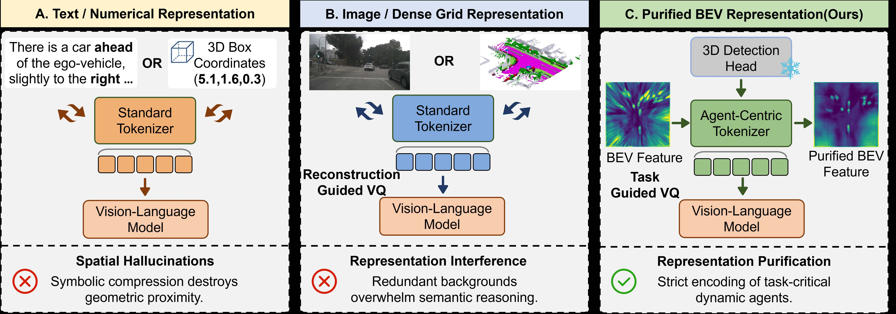
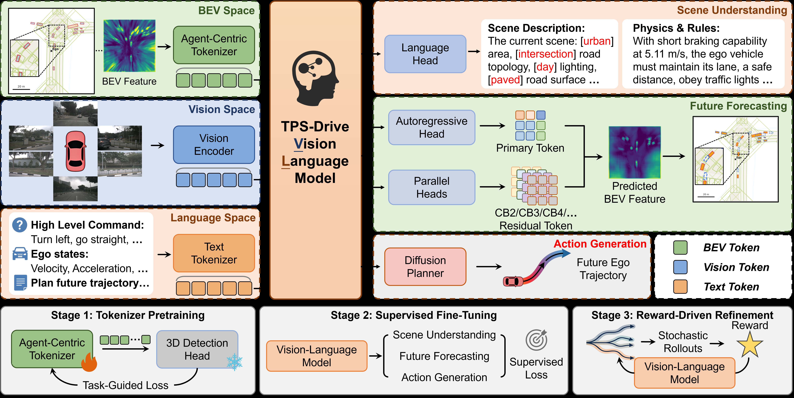

# TPS-Drive: Task-Guided Representation Purification for VLM-based Autonomous Driving

#

# 基本信息

- arXiv: [2605.27038](http://arxiv.org/abs/2605.27038v1)
- Authors: Jiaxiang Li, Yumao Liu, Ke Ma
- Categories: cs.RO

#

# 研究问题

基于任务导向表征提纯的VLA自动驾驶框架

#

# 任务与挑战

现有基于视觉语言模型（VLM）的自动驾驶规划方法在语义推理与精确三维空间预测之间存在显著鸿沟：文本对齐方法将连续空间状态压缩为符号，破坏几何结构并引发“空间幻觉”；而密集视觉方法虽保留空间拓扑，却使标准分词器被冗余背景纹理淹没，导致“表征干扰”。本文提出的TPS-Drive通过任务导向的表征提纯（Task-Guided Representation Purification）解决上述问题。

方法核心为Agent-Centric Tokenizer，其利用受冻结3D检测头（CenterPoint3D）监督的任务导向向量量化机制，显式将有限的码本容量从静态背景重新分配给关键动态智能体，从而隔离空间冗余。在此基础上，残差细化层（L=4）通过分层量化恢复精细几何细节。基于提纯后的空间词表，TPS-Drive采用解耦推理流水线：首先进行场景理解（利用Qwen3.5-27B生成结构化场景表征），随后预测未来世界token以完成空间状态演化预测，最后通过条件扩散模型生成连续自车轨迹。训练采用渐进式三阶段范式：分词器预训练、监督微调（联合优化场景理解、世界建模与规划损失）以及基于分组相对策略优化的奖励驱动精调。

实验方面，TPS-Drive在nuScenes开环评估中取得优异的空间预测精度（NDS 34.60%，mAP 24.03%）并显著降低碰撞率（带自车状态时ST-P3平均CR仅0.10%，UniAD平均CR 0.14%）。在闭环NAVSIMv1上取得PDMS 89.7，在更严格的交互式伪仿真平台NAVSIMv2上取得EPDMS 86.7的安全纪录。消融实验表明，任务导向分词器将世界模型NDS提升12.72%，残差层进一步带来3.75%增益，奖励精调使EPDMS从84.1提升至86.7。

该研究的意义在于首次将任务导向的表征提纯引入VLM-based自动驾驶，证明了通过显式净化空间冗余、聚焦动态智能体，可有效弥合高层语义推理与安全轨迹生成之间的断层。其解耦的“世界建模+扩散规划”架构为VLA（Vision-Language-Action）模型在物理世界中的精确空间推理提供了重要范式。

#

# 核心 Insight

这篇论文的核心价值需要结合原文继续复查。当前 fallback 笔记保留了日报分析、DeepResearch 草稿和已筛选图表，避免自动流程中断。

#

# 方法与公式

#

# 第一模块：一分钟核心速写

**论文领域：** World Model 增强 VLA

**TL;DR：** Jiaxiang Li 等人提出了一种基于**任务引导表示净化（Task-Guided Representation Purification）**的 **TPS-Drive** 框架，以解决 VLM-based 自动驾驶中语义推理与精确 3D 空间预测之间的鸿沟（空间幻觉与表示干扰）问题，在 NAVSIMv1/v2 闭环基准上实现了 SOTA 安全性表现（PDMS 89.7 / EPDMS 86.7），并在 nuScenes 开环规划中将碰撞率降至 **0.10%**（ST-P3）和 **0.14%**（UniAD）。

**研究动机：** 现存方案最大的痛点是两种失败模式：一是文本/数值化表示将连续空间状态扁平化为离散符号，破坏几何邻近性，引发"空间幻觉"；二是密集 BEV/占用网格表示虽保留拓扑，但标准重建导向 VQ 将有限码本容量浪费在冗余静态背景上，造成"表示干扰"。本文的切入点极其巧妙——它不从 VLM 主干架构入手，而是回到表示源头，利用自动驾驶中"动态智能体即安全关键"这一任务先验，以**冻结 3D 检测头**为监督，强制 tokenizer 在量化过程中主动过滤背景，将 codebook 容量重新分配给动态智能体。

**核心机制：** 以冻结 3D 检测头作为任务引导的"筛子"，通过改进的向量量化（VQ）将 BEV 特征中的静态背景冗余与动态智能体解耦，仅将净化后的动态智能体 token 序列输入 VLM；VLM 在此基础上顺序执行场景理解、自回归未来世界预测，最终由条件扩散模型生成连续轨迹。

**关键数据：**
- **最能证明其有效性：** NAVSIMv2 的 **EPDMS 达到 86.7**，超越 DriveVLA-W0（86.1）与 HydraMDP++（85.6）。理由：NAVSIMv2 是引入交互式伪仿真的严格闭环基准，EPDMS 综合了交通灯合规（TLC 99.8%）、车道保持（LK 97.1%）等硬安全指标，直接证明净化表示在复杂交互中的安全价值。
- **存疑的试验结果：** nuScenes 开环 ST-P3 协议下，基础版 TPS-Drive（无 ego status）的 **L2 Avg 为 0.55m**，显著落后于 FSDrive*（0.28m）与 EMMA*（0.32m），甚至不及传统 E2E 方法 BEV-Planner*（0.35m）。理由：该结果说明 TPS-Drive 在开环轨迹拟合精度上并非顶尖，其优势更多体现在安全指标（CR 0.19%）与闭环交互能力上，暗示其通过牺牲部分模仿精度换取了更高的安全对齐度。

---

#

# 第二模块：核心架构解释

TPS-Drive 将自动驾驶形式化为一个以**净化空间词汇**为中介的解耦三阶段推理过程。

**1. 输入与表示**
在时刻 $t$，系统接收多视图图像 $\mathcal{I}_t$、当前 BEV 特征图 $\mathcal{B}_t \in \mathbb{R}^{D \times H \times W}$、导航指令 $\mathbf{c}$、任务提示 $\mathbf{p}$ 和自车运动学 $\mathbf{k}_t = [\mathbf{v}_t, \mathbf{a}_t]$。目标为输出未来轨迹 $\boldsymbol{\tau}_{t+1:t+T_{\text{plan}}}$。

**2. Agent-Centric Tokenization（核心创新）**
这是实现"表示净化"的关键模块。
- **主码本 $\mathcal{V}_1$：** 编码器 $E_\phi$ 将 $\mathcal{B}$ 压缩为潜在网格 $\mathbf{e} \in \mathbb{R}^{D' \times H' \times W'}$，每个空间位置通过最近邻搜索量化到 $\mathcal{V}_1$（公式 1）：
  

```math
z_{i,j} = \arg\min_{m} \| \mathbf{e}_{i,j} - \mathbf{v}_m \|_2
```


- **任务引导损失（公式 2）：** 为防止码本被动编码背景，引入**冻结的 CenterPoint3D 检测头**进行监督。总损失为：
  

```math
\mathcal{L}_{\text{primary}} = \lambda_r \mathcal{L}_{\text{rec}} + \lambda_h \mathcal{L}_{\text{hm}} + \lambda_b \mathcal{L}_{\text{box}} + \mathcal{L}_{\text{vq}} + \beta \mathcal{L}_{\text{commit}}
```


  其中 $\mathcal{L}_{\text{hm}}$ 与 $\mathcal{L}_{\text{box}}$ 为检测头的 heatmap 与 3D bbox 损失，强制码本关注动态智能体；$\lambda_r \mathcal{L}_{\text{rec}}$ 则防止净化特征结构崩溃。
- **残差细化层：** 设置 $L=4$ 层残差码本 $\{\mathcal{V}_\ell\}_{\ell=2}^{L}$，逐层量化前一层残差。最终仅**主 token** $\mathbf{z}^{(1)}$ 输入 VLM 进行自回归预测，残差 token 由轻量分类头并行预测，兼顾序列紧凑性与几何精度。

**3. 解耦推理流程**
- **场景理解（Scene Understanding）：** VLM 从当前观测提取结构化表示 $\mathbf{s}_t$（环境属性 + 物理规则）。训练时使用 Qwen3.5-27B 自动生成标注并经人工校验，以交叉熵损失 $\mathcal{L}_{\text{scene}}$ 监督。
- **未来预测（Future Forecasting）：** 以完整上下文 $\mathbf{x}_t = \{\mathcal{I}_t, \mathcal{B}_t, \mathbf{c}, \mathbf{p}, \mathbf{k}_t, \mathbf{s}_t\}$ 为条件，VLM **自回归预测**未来主 token $\mathbf{z}_{t+\Delta t}^{(1)}$（公式 3 第一项）；同时 $L-1$ 个分类头基于 VLM 隐状态 $\mathbf{h}_{t+\Delta t}$ **并行预测**残差 token（公式 3 第二项）：
  

```math
\mathcal{L}_{\text{world}} = -\sum_{n=1}^{N} \log p\bigl(z_{t+\Delta t, n}^{(1)} \mid \mathbf{x}_t, \mathbf{z}_{t+\Delta t, <n}^{(1)}\bigr) + \lambda_{\text{res}} \sum_{\ell=2}^{L} \mathcal{L}_{\text{CE}}\bigl(g_\ell(\mathbf{h}_{t+\Delta t}), \mathbf{z}_{t+\Delta t}^{(\ell)}\bigr)
```


- **动作生成（Action Generation）：** 采用条件扩散模型。将预测的未来 token 隐状态 $\mathbf{h}_{t+\Delta t}$、结构化表示 $\mathbf{s}_t$ 与动作起始提示 $\mathbf{p}_{\text{start}}$ 拼接为 $\mathbf{f}_t$，输入去噪 Transformer $\epsilon_\theta$ 估计噪声（公式 4）：
  

```math
\mathcal{L}_{\text{plan}} = \mathbb{E}_{k, \boldsymbol{\tau}^{0}, \boldsymbol{\epsilon}} \bigl[ \| \boldsymbol{\epsilon} - \epsilon_\theta(\boldsymbol{\tau}^{k}, k, \mathbf{f}_t) \|_2^2 \bigr]
```


**4. 渐进三阶段训练**
- **Stage 1（Tokenizer 预训练）：** 先训练主码本（含检测监督），冻结后训练残差码本。
- **Stage 2（SFT）：** 联合优化 $\mathcal{L}_{\text{scene}} + \mathcal{L}_{\text{world}} + \mathcal{L}_{\text{plan}}$，VLM 与扩散头全量更新。
- **Stage 3（Reward-Driven Refinement）：** 采用**分组相对优化策略**。对每个样本生成多条 rollout，以几何误差与运动平滑度计算离线奖励，组内归一化得到相对优势，无需价值网络。世界模型分支通过优势加权策略目标更新，扩散规划器通过奖励加权去噪损失优化。

**5. 实验流程**
- **nuScenes：** 评估开环轨迹规划（ST-P3 与 UniAD 双协议的 L2/CR）以及智能体空间预测（NDS/mAP 等检测指标）。
- **NAVSIMv1：** 评估闭环 PDMS（NC/DAC/TTC/C/EP）。
- **NAVSIMv2：** 评估严格交互闭环 EPDMS（增加 DDC/TLC/LK/HC/EC 等法规指标）。
- **消融：** 从标准 VQ-VAE 基线逐步叠加 Task-Guided Tokenizer、Residual Layers、Reward-Driven Refinement，量化各组件贡献。

**Python 风格伪代码（核心逻辑）：**

```python
import torch
import torch.nn as nn

class AgentCentricTokenizer(nn.Module):
    def __init__(self):
        self.encoder = Encoder()                     

# E_phi

        self.primary_codebook = nn.Embedding(8192, D_prime)   

# V_1

        self.residual_codebooks = nn.ModuleList([
            nn.Embedding(K, D_prime) for _ in range(3)       

# V_2..V_4, L=4

        ])
        self.decoder = Decoder()                     

# D_psi

        self.frozen_detector = CenterPoint3D()       

# 冻结 3D 检测头

        self.frozen_detector.eval()
        for p in self.frozen_detector.parameters():
            p.requires_grad = False

    def forward(self, B_t):
        

# B_t: [D, H, W]

        e = self.encoder(B_t)  

# [D', H', W']

        
        

# Primary VQ (Eq.1)

        z1, q1 = vector_quantize(e, self.primary_codebook)
        
        

# Residual VQ

        residual = e - q1
        qs, zs = [q1], [z1]
        for codebook in self.residual_codebooks:
            z_l, q_l = vector_quantize(residual, codebook)
            qs.append(q_l)
            zs.append(z_l)
            residual = residual - q_l
        
        B_hat = self.decoder(sum(qs))
        
        

# Task-guided loss (Eq.2)

        loss_rec = F.l1_loss(B_hat, B_t)
        det_out = self.frozen_detector(B_hat)        

# 检测监督

        loss_hm = heatmap_loss(det_out, gt_boxes)
        loss_box = bbox_loss(det_out, gt_boxes)
        loss_vq = F.mse_loss(e, q1.detach())
        loss_commit = F.mse_loss(e, q1.detach()) * beta  

# commitment

        
        loss_primary = (lambda_r * loss_rec + 
                       lambda_h * loss_hm + 
                       lambda_b * loss_box + 
                       loss_vq + beta * loss_commit)
        return zs, qs, loss_primary


class TPSDrive(nn.Module):
    def __init__(self):
        self.tokenizer = AgentCentricTokenizer()
        self.vlm = Qwen3_5_VL_2B()                   

# 视觉语言主干

        self.residual_heads = nn.ModuleList([MLP() for _ in range(3)])
        self.diffusion_planner = DiffusionTransformer()
    
    def forward(self, I_t, B_t, c, p, k_t, 
                B_future, s_t_gt, z_future_gt, traj_gt):
        

# --- Stage 2/3: SFT or RL ---

        
        

# 1. Tokenize future BEV for supervision

        z_future, q_future, _ = self.tokenizer(B_future)
        z_future_prim = z_future[0]   

# 主 token

        
        

# 2. Scene Understanding

        s_t = self.vlm.scene_understand(I_t, B_t, c, p, k_t)
        loss_scene = F.cross_entropy(s_t, s_t_gt)
        
        

# 3. Future Forecasting (Eq.3)

        x_t = aggregate_context(I_t, B_t, c, p, k_t, s_t)
        h, loss_ar = self.vlm.autoregress_predict(
            target_tokens=z_future_prim, 
            context=x_t
        )
        
        loss_res = 0
        for l, head in enumerate(self.residual_heads, start=2):
            pred_z_l = head(h)
            loss_res += F.cross_entropy(pred_z_l, z_future[l])
        loss_world = loss_ar + lambda_res * loss_res
        
        

# 4. Action Generation (Eq.4)

        f_t = concat(h, s_t, p_start)
        loss_plan = self.diffusion_planner.denoise_loss(
            f_t=f_t, gt_traj=traj_gt
        )
        
        return loss_scene + loss_world + loss_plan


# ==================== 训练流程 ====================

def train():
    

# Stage 1: Tokenizer Pretraining

    tokenizer = AgentCentricTokenizer()
    

# Phase A: 训练主码本

    for batch in bev_loader:
        _, _, loss = tokenizer(batch.bev)
        loss.backward()
    freeze(tokenizer.primary_codebook, tokenizer.encoder, tokenizer.decoder)
    

# Phase B: 训练残差码本

    for batch in bev_loader:
        _, _, _ = tokenizer(batch.bev)
        

# 仅优化 residual_codebooks

    
    

# Stage 2: Supervised Fine-Tuning

    model = TPSDrive()
    model.tokenizer.load_pretrained()
    for batch in sft_loader:
        loss = model(batch.I_t, batch.B_t, batch.c, batch.p, batch.k_t,
                     batch.B_future, batch.s_t_gt, batch.z_future_gt, batch.traj_gt)
        loss.backward()
    
    

# Stage 3: Reward-Driven Refinement

    for batch in rl_loader:
        rollouts = [model.sample(batch) for _ in range(8)]   

# 多条 rollout

        rewards = compute_reward(rollouts)                   

# 几何误差 + 平滑度

        advantages = (rewards - rewards.mean()) / (rewards.std() + 1e-8)
        

# 优势加权更新 world model 与 diffusion planner

        update_policy(model, rollouts, advantages)
```

---

#

# 第三模块：核心学术问答

Q1: 这篇论文试图解决什么核心问题？

A1: VLM-based 自动驾驶规划中存在语义推理与精确 3D 空间预测之间的结构性鸿沟。具体表现为两种失败模式：一是文本或数值化表示将连续空间状态压缩为离散符号，破坏几何结构导致"空间幻觉"；二是密集视觉表示（如 BEV/占用网格）虽保留空间拓扑，但标准重建导向的 VQ tokenizer 将有限码本容量浪费在冗余静态背景上，造成"表示干扰"，淹没 VLM 的语义推理能力。

Q2: 作者提出的核心解决方案（创新点）是什么？

A2: 核心解决方案是任务引导的表示净化（Task-Guided Representation Purification），具体包含三个层面：
- **Agent-Centric Tokenizer**：以冻结的 CenterPoint3D 检测头监督 VQ 过程，通过联合优化重建损失与检测损失（heatmap + 3D bbox），强制码本容量从静态背景重新分配到动态智能体，实现"表示净化"。
- **解耦推理流程**：VLM 顺序执行场景理解（结构化物理规则提取）、未来预测（净化 BEV token 的自回归预测）、动作生成（条件扩散模型），将高层语义与低层几何解耦。
- **渐进三阶段训练**：tokenizer 预训练 → SFT → 奖励驱动优化（分组相对策略优化，无需价值网络），超越纯模仿学习。

Q3: 实验设计的关键支撑（或巧妙之处/数据集特点）是什么？

A3: 实验设计的关键支撑在于构建了从开环空间预测到严格闭环交互的完整验证链条：
- **nuScenes 双任务验证**：同时评估开环轨迹规划（L2/CR）和未来智能体空间预测（NDS/mAP），证明净化表示不仅提升规划安全性，还直接提高世界模型的几何预测精度（NDS 34.60% vs WoTE 30.01%）。
- **NAVSIMv1/v2 闭环基准**：NAVSIMv2 引入交互式伪仿真和 EPDMS 指标，包含交通灯合规（TLC）、车道保持（LK）等硬安全子指标，能严格检验模型在动态交互中的真实安全性。
- **消融实验的渐进叠加**：表5从标准 VQ-VAE 基线开始，逐步叠加 Task-Guided Tokenizer（+12.72% NDS）、Residual Layers（+3.75% NDS）、Reward Refinement（+2.6 EPDMS），清晰量化了每个组件的独立贡献。

Q4: 这篇论文最显著的贡献点（Top 3）是什么？

A4:
- **提出任务引导的 Agent-Centric Tokenizer**：首次将冻结 3D 检测头引入 VQ tokenizer 的监督，显式隔离空间冗余，为 VLM 在自动驾驶中的空间推理提供了"净化"的离散词汇表。
- **建立解耦的 VLM 推理与训练框架**：设计了场景理解-未来预测-动作生成的三阶段解耦流水线，并配套渐进式训练（含奖励驱动优化），证明了 VLM 可以通过结构化中间表示桥接语义推理与连续控制。
- **在严格闭环基准上创造安全记录**：在 NAVSIMv2 上取得 EPDMS 86.7 的 SOTA，并在 nuScenes 上将碰撞率压至 0.10%（ST-P3）和 0.14%（UniAD），验证了净化表示对安全关键交互的直接价值。

Q5: 这项工作在哪些相关研究的基础上做了推进？（列举1-2个最核心的前置工作即可）

A5:
- **OccWorld / DriveWorld**：这些工作利用密集 3D 占用网格进行未来空间预测，但受困于标准重建导向 VQ 导致的表示冗余。TPS-Drive 在此基础上引入任务引导净化，将全局重建转化为以动态智能体为中心的蒸馏表示。
- **FSDrive / OmniDrive**：这些 VLM-based 方法采用密集图像或 BEV 输入直接进行规划，面临表示干扰问题。TPS-Drive 通过显式 tokenizer 设计，解决了冗余背景淹没 VLM 语义推理的瓶颈。

Q6: 客观评价：这篇论文的局限性、漏洞或"未讲明的故事"是什么？对后续科研有何启发？

A6: 局限性包括：
- **冻结检测头的上限**：论文明确承认依赖冻结 CenterPoint3D 检测头会束缚表示潜力的上限，检测头本身的误差和类别限制会直接传导至 tokenizer，对于检测头未覆盖的异形障碍物（如散落货物、异形车辆）可能失效。
- **实时性瓶颈**：解耦多阶段架构（自回归预测 + 扩散规划）在推理时存在显著的串行延迟，论文未报告具体推理速度（FPS/Hz），且扩散模型去噪步数对车载实时性的影响未讨论。
- **开环精度与安全性的权衡**：nuScenes 开环 L2 误差并非顶尖（基础版 0.55m），说明奖励驱动优化可能以牺牲轨迹拟合度为代价换取低碰撞率，这种偏离人类演示的程度在更复杂城市场景中的长期影响未充分分析。
- **未讲明的故事**：论文未深入探讨"净化"的边界——当场景极度拥挤时，被压缩到背景中的静态环境信息（如路沿、护栏）是否会在某些边缘案例中丢失，从而导致误判。
后续科研启发：可探索端到端可微的空间净化（解除检测头冻结，联合优化），或引入稀疏查询机制替代栅格化 VQ；同时需要研究如何在保持安全对齐的前提下，通过蒸馏或步数缩减加速扩散规划器，以满足车载实时约束。

#

# 贡献拆解

- 关键术语：Task-Guided Vector Quantization, Agent-Centric Tokenizer, Vision-Language-Action, World Models for Driving, Diffusion Planning
- 加权评分：3.7/5.0

#

# 关键图表解读



*该图通过并列对比三种表征范式（文本/数值、图像/稠密网格、本文的净化BEV），直接揭示了现有方法导致“空间幻觉”与“表征干扰”的本质原因，是理解论文核心动机与贡献的关键 insight 图。*



*完整呈现了 TPS-Drive 的系统架构，涵盖 BEV/Vision/Language 三空间输入、解耦推理管线（场景理解→未来预测→动作生成）以及三阶段渐进训练范式，是精读方法细节不可或缺的架构总览图。*


*在开放人行横道与复杂走廊两个真实场景中，定性对比了 Image CoT 与 TPS-Drive 的感知可视化与驾驶决策差异，直观验证了净化表征在避免碰撞和正确决策上的优势。*

#

# 实验与消融

请优先核对主结果表、消融实验和真实/仿真任务设置；若图表已选中，应结合上方图片逐项复查。

#

# 局限性

当前自动精读未能成功调用完整图文生成模型，因此局限性需要结合原文实验设置进一步人工确认。

#

# 个人研究判断

若该论文与 World Models assisting Embodied AI、VLA、robot policy 或 sim-to-real 强相关，建议进入人工精读队列。
