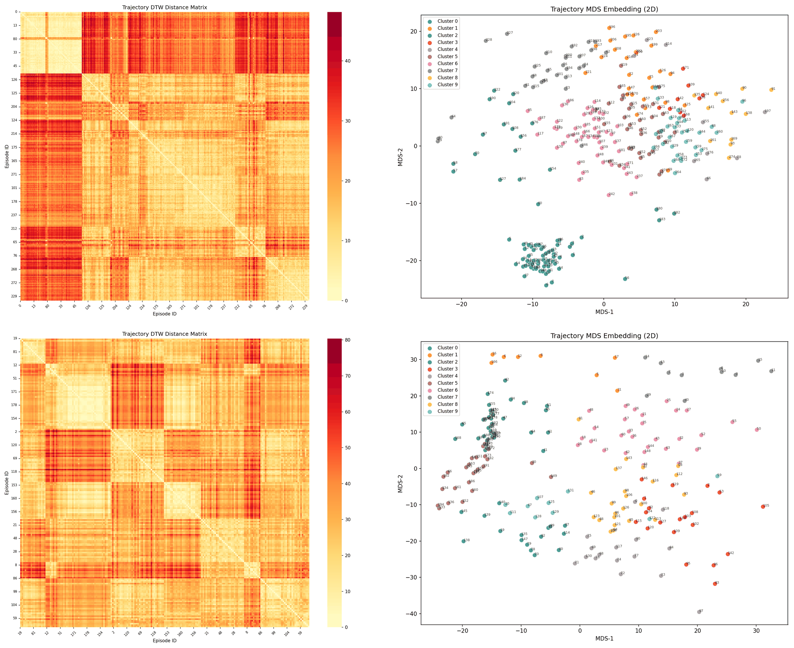
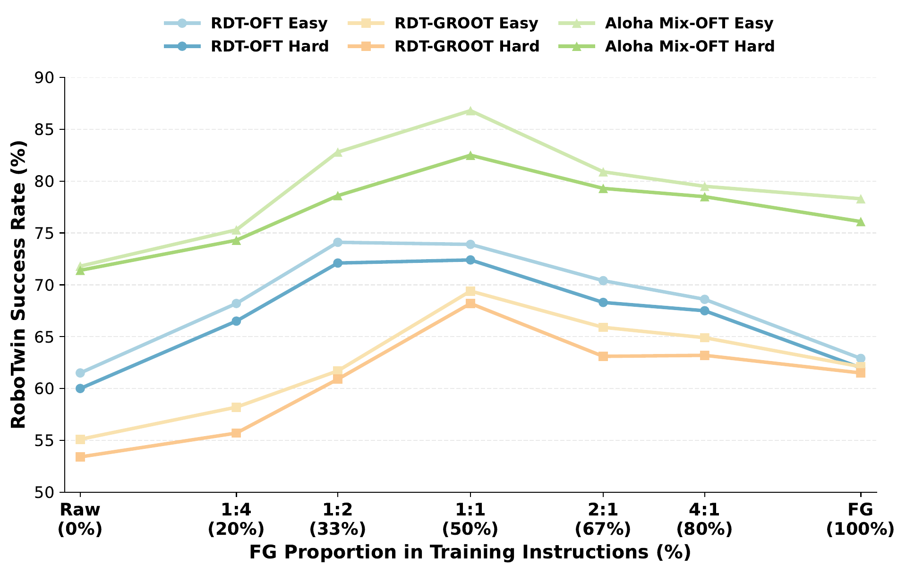
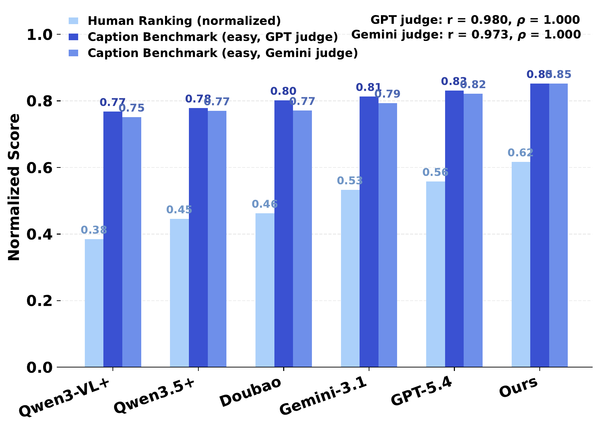
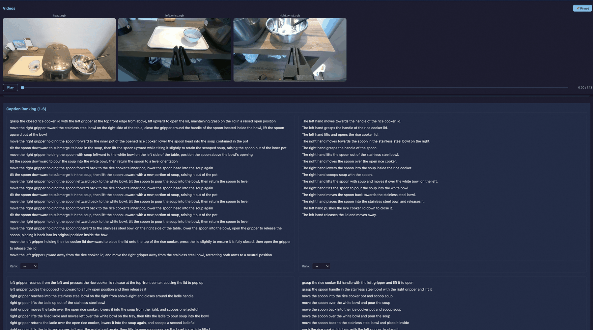

# FineVLA: Fine-Grained Instruction Alignment for Steerable Vision-Language-Action Policies

#

# 基本信息

- arXiv: 2605.27284
- Authors: Xintong Hu, Xuhong Huang, Jinyu Zhang, Yutong Yao, Yuchong Sun, Qiuyue Wang, Mingsheng Li, Sicheng Xie, Yitao Liu, Junhao Chen, Yixuan Chen, Yingming Zheng, Shuai Bai, Tao Yu
- Categories: cs.RO, cs.AI
- 一句话结论：通过动作对齐的细粒度语言监督与目标级指令的混合训练，可在不损害目标级任务成功率的前提下，显著提升 VLA 策略的可操控性与执行细节遵循能力。

#

# 研究问题

论文针对现有开源机器人数据集中语言标注普遍停留在粗粒度目标级（如“拿起杯子”）而缺乏执行细节（如主动臂选择、接近方向、接触区域、运动路径等）的问题，系统性地研究了**动作对齐的细粒度指令监督**对 Vision-Language-Action（VLA）策略学习的影响。核心科学问题是：在保持轨迹、动作与视觉观测完全一致的条件下，仅改变配对语言指令的粒度与内容，能否提升策略的**可操控性（steerability）**，即通过自然语言精确控制“如何执行”的能力。

#

# 任务与挑战

具体任务涵盖三个互补层面：

1. **数据基础设施**：统一 10 个开源数据集的 972,247 条异构轨迹，构建带人工验证的细粒度标注语料；
2. **评测基准**：建立 RoboFine-Bench，通过 VQA 与 Caption 双赛道评估机器人视频理解模型对执行级细节的掌握；
3. **策略训练与评估**：在 RoboTwin 仿真与真实世界 Cobot Magic 双臂平台上，控制细粒度（FG）与原始目标级（Raw）指令的混合比例，训练并评测策略的指令遵循与因子级控制能力。

已有方法的主要不足在于：现有 VLA 框架（如 RT-2、OpenVLA、$\pi_0$ 等）依赖稀疏的目标级语言监督，策略只能从动作-视觉联合分布中隐式推断执行细节，无法通过语言指令对执行过程进行显式操控；同时，社区缺乏开放的细粒度标注基础设施、评测基准以及可扩展的自动标注器。

#

# 核心 Insight

本文的核心思想是：**将语言监督从“做什么”（what）下沉到“怎么做”（how），并证明细粒度过程级语言应作为目标级指令的补充而非替代。**

作者发现，在固定轨迹、动作与视觉观测的条件下，仅改变语言指令的 FG 与 Raw 混合比例，策略性能呈现一致的**倒 U 型趋势**——在 FG:Raw = 1:2 至 1:1 时达到峰值。这表明 Raw 指令提供紧凑的目标语义抽象，FG 指令提供执行约束，两者在训练信号上具有互补性。此外，细粒度监督不仅不损害目标级成功率，反而能解锁对姿态、颜色、接近方向等目标级指令完全未指定属性的语言条件化控制。



上图展示了 FineVLA-Tool 中基于 DTW 的轨迹聚类结构：左侧面板的距离矩阵呈现清晰的块结构，右侧 MDS 嵌入将不同执行模式（如夹爪时机、末端执行器路径差异）分离到不同簇中。这说明通过动作相似性而非视觉相似性进行聚类，能够在保留操作策略多样性的同时，将 97 万条原始轨迹压缩至 4.7 万条代表性轨迹，为后续人工验证标注提供高效的数据基础。

#

# 方法与公式

#

## 1. 数据构建管线（FineVLA-Tool）

数据构建分为四阶段：

- **Stage 1**：将 10 个数据集的轨迹统一转换为 LeRobot 2.1 格式；
- **Stage 2**：动作-状态规范化。将所有动作/状态表示统一为绝对坐标与归一化四元数（xyzw），并基于动作-状态 DTW 距离剔除不一致轨迹；
- **Stage 3**：DTW 聚类与代表采样。基于规范化后的动作序列计算两两 DTW 距离，进行层次聚类后从每个簇中选取 2–3 条靠近 medoid 的轨迹。

**DTW 距离递推公式**定义如下：

```math
D_{\mathrm{DTW}}(i,j)
= c(\mathbf{x}_i,\mathbf{y}_j)
+ \min\!\bigl\{
    D_{\mathrm{DTW}}(i-1,j-1),\;
    D_{\mathrm{DTW}}(i-1,j),\;
    D_{\mathrm{DTW}}(i,j-1)
  \bigr\}
\tag{1}
```

其中 $\mathbf{x}_{1:T}$ 和 $\mathbf{y}_{1:U}$ 为两条动作序列，$c(\cdot,\cdot)$ 为帧级代价函数。

**帧级代价函数**根据动作空间表示分为两类。对于关节空间（Joint-space）：

```math
c_{\text{joint}}(\mathbf{x},\mathbf{y})
= w_{\text{pos}} \cdot \left\lVert \mathbf{j}_x - \mathbf{j}_y \right\rVert_2
+ w_{\text{grip}} \cdot |g_x - g_y|
\tag{2}
```

对于末端执行器空间（EEF-space）：

```math
c_{\text{eef}}(\mathbf{x},\mathbf{y})
= w_{\text{pos}} \cdot \left\lVert \mathbf{p}_x - \mathbf{p}_y \right\rVert_2
+ w_{\text{rot}} \cdot d_{\text{geo}}(\mathbf{q}_x, \mathbf{q}_y)
+ w_{\text{grip}} \cdot |g_x - g_y|
\tag{3}
```

其中 $\mathbf{p}$ 为 3D 位置，$\mathbf{q}$ 为四元数，$d_{\text{geo}}$ 为测地距离：

```math
d_{\text{geo}}(\mathbf{q}_x, \mathbf{q}_y)
= 2\arccos(|\mathbf{q}_x \cdot \mathbf{q}_y|)
\tag{4}
```

$g$ 表示夹爪状态。默认权重为 $w_{\text{pos}} = 1.0$、$w_{\text{rot}} = 1.0$、$w_{\text{grip}} = 100.0$。高夹爪权重确保开/合转换这一关键交互信号不会被连续运动差异淹没。

- **Stage 4**：十维细粒度标注与人工验证。对每条代表性轨迹，先用 Qwen3.5-Plus 生成步骤化描述，再由人工审核修正。标注覆盖十个控制维度：Action sequence、Active actor、Target object、Initial configuration、Final configuration、Contact & approach、Trajectory & orientation、Object interaction、Failure & recovery、Body motion。

#

## 2. 评测基准与可扩展标注器

**RoboFine-Bench** 包含严格隔离的 500 条视频（来自 10 个数据集，覆盖 32 种本体），10,816 条原子事实与 1,030 道 VQA 问题。分两个赛道：

- **VQA 赛道**：探测模型对执行级细节的理解；
- **Caption 赛道**：要求模型生成与动作对齐的步骤级描述，通过 LLM judge 与原子事实对齐。

Caption 赛道的评分指标定义如下。令 $M, P, C, O$ 分别表示匹配、部分匹配、矛盾、遗漏的 GT 事实数量，$A = M + P + C$，$G = M + P + C + O$，$H$ 为幻觉动作事件数，$S$ 为生成 caption 的总步数：

```math
\mathrm{Consistency} = \frac{M + 0.5P}{A}
\tag{5}
```

```math
\mathrm{Coverage} = \frac{M + 0.5P}{G}
\tag{6}
```

```math
\mathrm{Anti\text{-}Hallucination} = 1 - \frac{H}{S}
\tag{7}
```

```math
\mathrm{Overall} = \frac{\mathrm{Consistency} + \mathrm{Coverage} + \mathrm{Anti\text{-}Hallucination}}{3}
\tag{8}
```

**RoboFine-VLM** 基于 Qwen3.5-397B-A17B 在 FineVLA-Data 上做全参数 SFT，作为可扩展的细粒度标注器。

#

## 3. 策略训练（FineVLA-Policy）

作者不提出新架构，而是隔离**语言监督信号**本身的影响。基于 StarVLA 代码库（共享 Qwen3.5-4B 视觉-语言主干），测试两种动作解码框架：

- **StarVLA-OFT**：在预定义 action token 的隐状态上接轻量 MLP，并行回归连续动作块，L1 损失；
- **StarVLA-GR00T**：双系统设计，VL 主干作为 System 2 慢思考，DiT 流匹配模块作为 System 1 生成连续动作。

**关键控制：指令混合（Instruction Mixing）**。从同一批源轨迹中构建两个并行数据集：

- **FG 数据集**：仅包含被 FineVLA-Tool 选中的代表性轨迹，配对细粒度过程级指令；
- **Raw 数据集**：包含全部源轨迹，配对原始目标级指令。

两者轨迹、动作标签、视觉观测完全一致，**仅语言指令不同**。FG:Raw 比例控制训练时的采样权重。共比较 7 种比例：Raw-only、1:4、1:2、1:1、2:1、4:1、FG-only。

训练流程：

1. **预训练**：100k 步，64×A100，全局 batch size 512；
2. **RoboTwin 微调**：在 Clean + Random 训练集（27,500 条轨迹）上微调 100k 步，8×A100，全局 batch size 128，此阶段应用 FG:Raw 混合；
3. **真实世界微调**：在 Cobot Magic 双臂平台上采集的 12 个桌面任务共 600 条演示上进一步微调。

#

# 贡献拆解

1. **开放的细粒度 VLA 监督基础设施（FineVLA-Tool + FineVLA-Data）**
   - **做了什么**：统一 10 个数据集的 97 万条轨迹，通过 DTW 聚类降采样至 4.7 万条代表性轨迹，建立覆盖十个控制维度的细粒度标注模式，经人工验证后构成 FineVLA-Data，平均指令长度从 9.3 词增至 96.8 词（约 10.4 倍）。
   - **为什么有效**：基于动作相似性（DTW）而非视觉相似性进行聚类，能够在去除冗余演示的同时保留操作策略多样性，使固定标注预算覆盖最广的执行模式。
   - **和已有方法差别**：不同于 Galaxea、RoboCOIN 等仅提供阶段或层级标注的数据集，FineVLA 提供过程级、动作对齐的十维统一描述，并配套完整的数据构建工具链。

2. **机器人视频理解基准与可扩展标注器（RoboFine-Bench + RoboFine-VLM）**
   - **做了什么**：构建包含 500 条严格隔离视频的评测基准，通过 VQA 和 Caption 双赛道评估执行级理解；并基于 Qwen3.5-397B-A17B 微调得到专用 VLM 标注器。
   - **为什么有效**：Caption 赛道的 LLM judge 与人类排名的 Pearson 相关系数高达 0.980（Easy）和 0.970（Hard），证明自动评测可靠；RoboFine-VLM 在 Bench 上达到 71.0% VQA 准确率与 83.6% Hard Caption Overall，显著优于通用 VLM。
   - **和已有方法差别**：现有基准（如 RoboVQA、RoboBench）主要评估空间推理或手-物动态，RoboFine-Bench 首次系统性地探测模型对过程级操控细节（接触区域、接近方向、运动路径）的掌握。

3. **细粒度与目标级指令的互补性训练配方（FineVLA-Policy）**
   - **做了什么**：在固定轨迹、动作和观测的条件下，通过控制 FG 与 Raw 指令的混合比例训练策略，发现两者呈倒 U 型互补关系，峰值位于 FG:Raw = 1:2 至 1:1。
   - **为什么有效**：Raw 指令提供紧凑的目标语义抽象，FG 指令提供执行约束；混合训练使策略同时学习目标语义与执行细节，既保留目标级泛化能力，又获得执行级可控性。
   - **和已有方法差别**：OpenVLA、StarVLA 等开源 VLA 框架仅使用目标级语言；FineVLA 首次通过严格对照实验隔离并量化了动作对齐语言对策略学习的影响，证明细粒度语言应“补充”而非“替代”目标级指令。

4. **真实世界因子级可操控控制验证**
   - **做了什么**：在真实世界双臂平台上设计配对任务变体（相同视觉场景、仅改变语言指定的控制因子），直接测量语言条件化的可操控性。
   - **为什么有效**：在 FG:Raw = 1:1 时，目标级指令完全未指定的属性获得最大提升：Pose (+23)、Color (+18)、Approach (+18)。
   - **和已有方法差别**：现有仿真基准难以区分“完成任务”与“遵循指令执行细节”；FineVLA 的真实世界评测通过成对变体直接隔离并量化了细粒度语言对执行细节的操控能力。

#

# 关键图表解读

#

## 图1：RoboTwin 混合比例曲线（figure-010-robotwin-mixing-curve.png）



该图直接支撑论文最核心的实验发现。横轴为训练指令中 FG（细粒度）所占比例，从 Raw (0%) 到 FG (100%)，纵轴为 RoboTwin 成功率。三条策略设置（RDT-OFT、RDT-GR00T、AlohaMix-OFT）的 Easy/Hard 曲线均呈现**一致的倒 U 型趋势**：

- **AlohaMix-OFT Easy**（浅绿色三角）在 FG:Raw = 1:1 时达到峰值 86.8%，较 Raw-only (71.8%) 提升 15.0 个百分点；
- **AlohaMix-OFT Hard**（深绿色三角）在 1:1 时达到 82.5%，较 Raw-only (71.4%) 提升 11.1 个百分点；
- 即使是表现较弱的 RDT-GR00T，也在 1:1 时达到最佳（Easy 69.4%，Hard 68.2%）。

读图时需注意：所有曲线在 FG-only (100%) 处均出现回落，说明纯细粒度监督会因分布偏移（与自然用户指令的表述差异）或目标级抽象缺失而削弱泛化。该图是“两者互补”结论的最强视觉证据。

#

## 图2：Caption 自动评测与人类排名对齐（figure-011-caption-human-alignment-easy.png）



该图验证 RoboFine-Bench Caption 赛道的可靠性。横轴为 6 个参评模型，每组包含三根柱子：浅蓝色为人类归一化排名，深蓝色为 GPT judge 分数，浅紫色为 Gemini judge 分数。

关键观察：

- 自动评测分数（GPT/Gemini）与人类排名的排序完全一致；
- 右上角标注的相关系数显示：GPT judge Pearson $r = 0.980$，Spearman $\rho = 1.000$；Gemini judge $r = 0.973$，$\rho = 1.000$。

这说明即使脱离人工评测，基于 LLM judge 的自动打分也能高度可靠地反映人类对细粒度 caption 质量的偏好，支撑了基准的可扩展评估与后续大规模自动标注的可行性。值得注意的是，通用 VLM（如 Qwen3-VL+）的人类排名显著低于专用模型，而 RoboFine-VLM（Ours）在自动分数和人类排名上均居首位。

#

## 图3：人工排序验证界面（figure-006-human-ranking2.png）



该图展示了 FineVLA-Data 构建过程中的人类验证环节。界面顶部为三视角视频（head_rgb、left_wrist_rgb、right_wrist_rgb），下方为四个候选 caption 的并排展示。左侧 caption 为极详细的步骤化描述（如“grasp the closed rice cooker lid with the left gripper... lift upward to open the lid...”），右侧 caption 则相对简略（如“The left hand moves towards the handle... grasps... lifts and opens...”）。

该界面说明：

1. 人工验证不仅检查事实正确性，还检查时序对齐与动作粒度；
2. 不同模型/标注版本在细节密度、主动臂识别、接触区域描述上存在显著差异；
3. 通过成对排序与修正，确保最终进入 FineVLA-Data 的指令与视频动作严格对齐。

#

## 图4：DTW 聚类可视化（figure-004-clustering-examples-combined.png）


该图已在“核心 Insight”章节展示，此处补充解读细节。上下两行分别展示两个不同任务的聚类结果：

- **左侧面板（DTW Distance Matrix）**：对角线附近的亮黄色块表明同一簇内轨迹动作相似度高（距离小），而簇间的深红色区域表明不同执行模式差异显著；
- **右侧面板（MDS Embedding）**：二维投影中不同颜色代表不同簇（Cluster 0–9），同一簇的轨迹在嵌入空间中紧密聚集。

该图支撑了数据构建的合理性：通过动作层面的 DTW 距离进行层次聚类，能够有效识别并分离不同的操控策略（如不同的夹爪时机、接触持续时间、末端执行器路径），从而确保选出的 4.7 万条代表性轨迹覆盖了充分的执行多样性，避免了对冗余演示的重复标注。

#

# 实验与消融

#

## 数据集与基线

- **仿真评测**：RoboTwin 官方 Easy/Hard 划分，每任务 20 个 episode；
- **真实世界评测**：Cobot Magic 双臂平台，12 个桌面任务共 600 条演示，每变体 10 次试验；
- **基线**：在 RDT-OFT、RDT-GR00T、AlohaMix-OFT 三种设置下比较 7 种 FG:Raw 比例。

#

## 主结果

1. **RoboTwin 仿真**（表4/图1）：
   - FG-only 在所有设置下均优于 Raw-only，提升 +1.4 至 +8.1 个百分点；
   - 最佳混合比 FG:Raw = 1:1 在 AlohaMix-OFT 上达到 86.8%/82.5%（Easy/Hard），较 Raw-only 提升 +15.0/+11.1。

2. **真实世界可操控性**（表5）：
   - FG:Raw = 1:1 达到 62.7/100，较 Raw-only (49.9) 提升 +12.8；
   - 各因子提升：Pose (+23)、Color (+18)、Approach (+18)、Rotate (+10)、Arm (+4)。

3. **RoboFine-Bench**（表2/表3）：
   - RoboFine-VLM 达到 71.0% VQA 准确率，领先最强通用基线 Gemini-3.1-Pro 8.9 个百分点；
   - Hard Caption Overall 达 83.6%，领先次优基线 GPT-5.4 的 78.1%。

#

## 消融与支撑分析

- **架构独立性**：OFT 在 Raw-only 下显著强于 GR00T（差距 6.4/6.6），但随着 FG 比例增加，差距缩小至 FG-only 下的 0.8/0.5。说明密集语言监督缓解了监督瓶颈，降低了对解码器架构的依赖。
- **数据规模效应**：在更大的 AlohaMix（约 13 倍 RDT）上，FG-only 较 Raw-only 的提升（+6.5/+4.7）大于 RDT（+1.4/+2.0）。说明轨迹多样性增加时，动作对齐的密集语言有更大的绑定空间。
- **评测鲁棒性**：Caption 评测对 judge 模型鲁棒（GPT vs Gemini 排序一致），且与人类排名高度相关（$\rho = 1.000$）。

#

## 最强证据与最存疑证据

- **最强证据**：AlohaMix-OFT 在 FG:Raw=1:1 时较 Raw-only 的 +15.0 Easy/+11.1 Hard 提升，以及真实世界中 Pose/Color/Approach 的两位数增益，直接证明了细粒度监督在仿真和物理部署中的双重价值。
- **最存疑证据**：真实世界评估仅基于 12 个桌面任务、600 条演示，样本量极小；OOD（out-of-distribution）的 actor-target 组合泛化探测中，最佳模型仅得 10/100，几乎失败，说明组合泛化能力未被真正解决。此外，倒 U 型趋势的因果解释（Raw 提供目标抽象、FG 提供执行约束）属于事后归因，缺乏直接消融实验验证。

#

# 局限性

1. **实验规模与场景局限**：真实世界评估局限于 Cobot Magic 双臂平台的 12 个桌面任务，且每变体仅 10 次试验。结论在更复杂、更长程、更多样化场景中的外推性未经验证。
2. **组合泛化瓶颈**：OOD actor-target binding 探测中，最佳模型仅得 10/100。模型能学习孤立因子（如用左手），但无法将其与未见过的目标容器进行组合泛化。论文未提供缓解方案。
3. **因果机制解释强度**：倒 U 型趋势的归因（Raw 提供目标抽象、FG 提供执行约束；FG-only 因分布偏移导致泛化弱）是合理的事后推断，但缺乏直接实验（如固定 FG 数据量、仅改变语言抽象层级）来严格证明。
4. **标注成本与安全**：尽管使用了 VLM 辅助，但仍需人工验证；且论文承认细粒度指令跟随在物理部署中存在安全风险，但未提供具体的安全约束机制。
5. **数据压缩的信息损失**：DTW 聚类将 97 万条轨迹压缩至 4.7 万条，虽然保留了多样性，但可能过滤掉一些边缘或噪声较大的有效执行策略。

#

# 个人研究判断

面向“World Models assisting Embodied AI downstream tasks”的研究方向，**这篇论文值得继续追踪**。

理由如下：

1. **数据基础设施价值**：FineVLA-Tool 和 FineVLA-Data 提供了目前少有的开放、动作对齐的细粒度标注基础设施。对于 World Model 研究而言，细粒度语言-动作对齐数据是训练能够理解和预测执行细节的世界模型的关键燃料。
2. **评测基准的扩展性**：RoboFine-Bench 不仅评估 VLA 策略，更评估 VLM 对机器人视频的执行级理解。这为世界模型提供了明确的“理解深度”评测标准——世界模型不仅需要预测像素或状态，还需要与细粒度语言描述对齐。
3. **训练配方的启示**：倒 U 型互补趋势提示社区，在构建大规模 VLA 或 World Model 训练数据时，不应盲目追求全量细粒度标注，而应设计最优的 FG:Raw 混合策略。这一发现对 World Model 的数据策展（data curation）具有直接指导意义。
4. **可扩展标注器**：RoboFine-VLM 证明了专用 VLM 可以生成高质量的动作对齐描述，这为未来自动化扩展细粒度世界模型训练数据提供了可行路径。

然而，该工作目前尚未直接涉及 World Model 的显式状态或未来预测，其策略训练仍属于模仿学习范式。后续可追踪其是否将 FineVLA-Data 用于训练具身世界模型（如动作条件化的视频预测模型），以及细粒度语言监督能否提升世界模型在组合泛化与长期规划上的表现。
