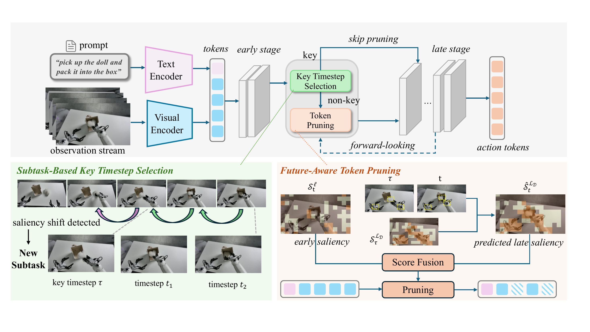
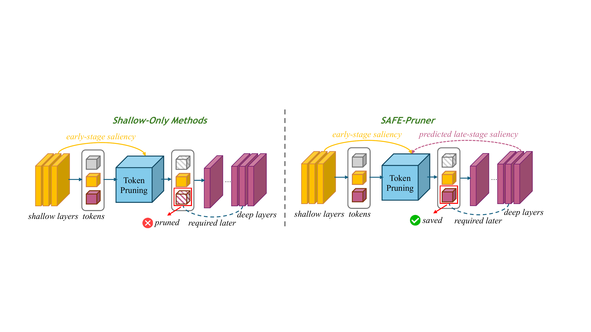
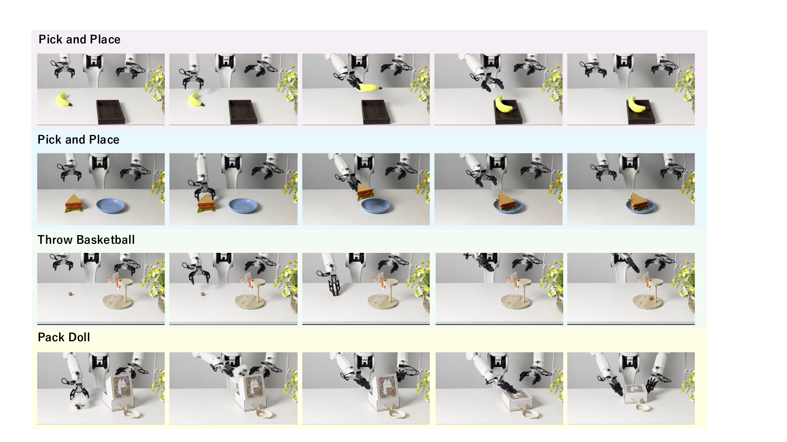
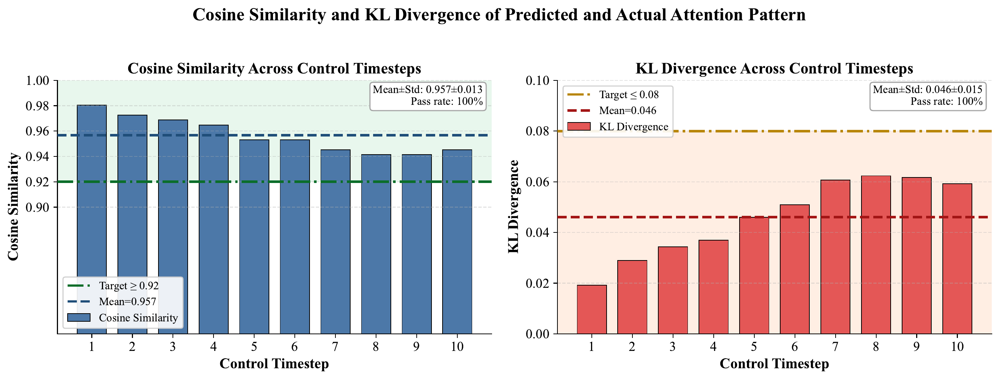

# SAFE-Pruner: Semantic Attention-Guided Future-Aware Token Pruning for Efficient Vision-Language-Action Manipulation

#

# 基本信息

- arXiv: [2605.29662](http://arxiv.org/abs/2605.29662v1)
- Authors: Shilin Ma, Chubin Zhang, Changyuan Wang, Yuji Wang, Yue Wu, Zixuan Wang, Jingqi Tian, Zheng Zhu, Yansong Tang
- Categories: cs.CV

#

# 研究问题

面向VLA的高效未来感知语义注意力token剪枝框架

#

# 任务与挑战

当前视觉-语言-动作（VLA）模型在机器人控制中面临推理延迟高、计算开销大的瓶颈，而现有视觉token剪枝方法多依赖浅层注意力信号，容易过早丢弃深层推理所需的关键token，导致性能显著下降。如何在加速推理的同时保留跨层任务关键视觉信息，是VLA实时部署亟待解决的核心问题。

本文提出SAFE-Pruner，一种即插即用、无需重新训练的token剪枝框架。作者首先观察到VLA模型在连续操作中存在"语义注意力一致性"现象：即使目标物体空间位置变化，模型在不同时间步仍倾向于将注意力概率质量集中在相同语义实体上。基于该规律，作者设计了前向预测策略，利用历史关键帧的深层注意力显著性来预测当前帧在深层网络中的token重要性，并与浅层显著性融合以指导剪枝决策，避免过早移除关键token。此外，针对子任务边界处注意力模式突变的问题，本文引入基于浅层显著性余弦相似度的自适应子任务划分策略，动态检测关键帧并刷新历史缓存，从而提升预测可靠性。

在LIBERO、SIMPLER仿真环境以及Astribot S1真机平台上，基于OpenVLA、OpenVLA-OFT、CogACT和π0.5四种主流架构的实验表明，该方法在高达70%–90%的剪枝率下可实现最高1.89倍加速，成功率下降不超过1.7%，且在同等计算预算下比FastV、SparseVLM、VLA-Cache等SOTA方法的成功率最高提升1.9%。消融实验验证了未来感知预测与自适应子任务划分对性能-效率权衡的独立贡献。

该工作首次从注意力动态演化角度揭示了VLA模型的语义一致性规律，为训练无关的VLA加速提供了新思路。其跨架构泛化能力、真机验证以及即插即用的特性，使其可直接部署于实时机器人控制系统，对推动VLA模型在真实场景中的落地具有重要意义。

#

# 核心 Insight

这篇论文的核心价值需要结合原文继续复查。当前 fallback 笔记保留了日报分析、DeepResearch 草稿和已筛选图表，避免自动流程中断。

#

# 方法与公式

DeepResearch 未生成；请回看论文正文中的方法章节与关键公式。

#

# 贡献拆解

- 关键术语：Token Pruning, Vision-Language-Action, Semantic Attention Consistency, Inference Acceleration, Robotic Manipulation
- 加权评分：4.15/5.0

#

# 关键图表解读

*展示了SAFE-Pruner的完整架构流程，包括基于子任务的关键时间步选择和未来感知Token剪枝两大核心模块，是理解方法设计的总览图。*

*直观对比了仅依赖浅层显著性的剪枝方法与SAFE-Pruner的差异，清晰揭示了核心Insight：浅层不重要的Token可能被深层需要，因此必须引入未来感知机制。*

*展示了真实世界机器人平台上四个复杂操作任务（Pick and Place、Throw Basketball、Pack Doll等）的实验序列，直接证明方法在真实场景中的有效性。*

*通过余弦相似度和KL散度量化了预测注意力与真实注意力模式的一致性，以100%通过率验证了论文核心假设——语义注意力一致性（semantic attention consistency）。*

#

# 实验与消融

请优先核对主结果表、消融实验和真实/仿真任务设置；若图表已选中，应结合上方图片逐项复查。

#

# 局限性

当前自动精读未能成功调用完整图文生成模型，因此局限性需要结合原文实验设置进一步人工确认。

#

# 个人研究判断

若该论文与 World Models assisting Embodied AI、VLA、robot policy 或 sim-to-real 强相关，建议进入人工精读队列。
