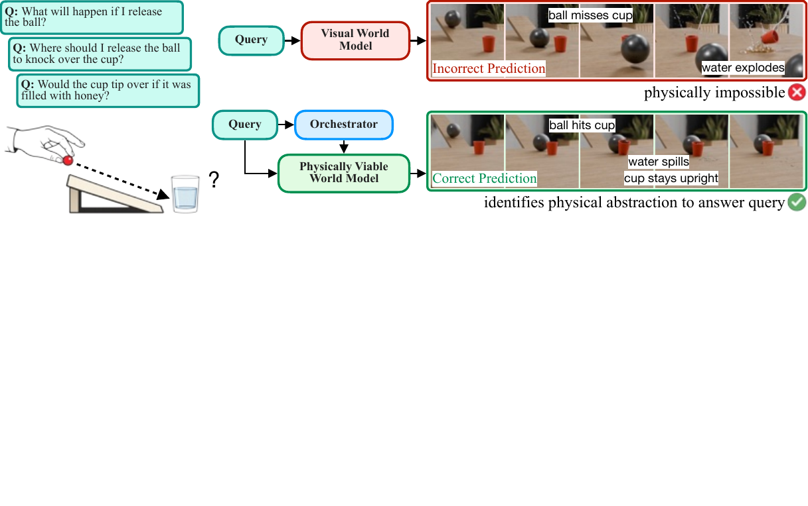
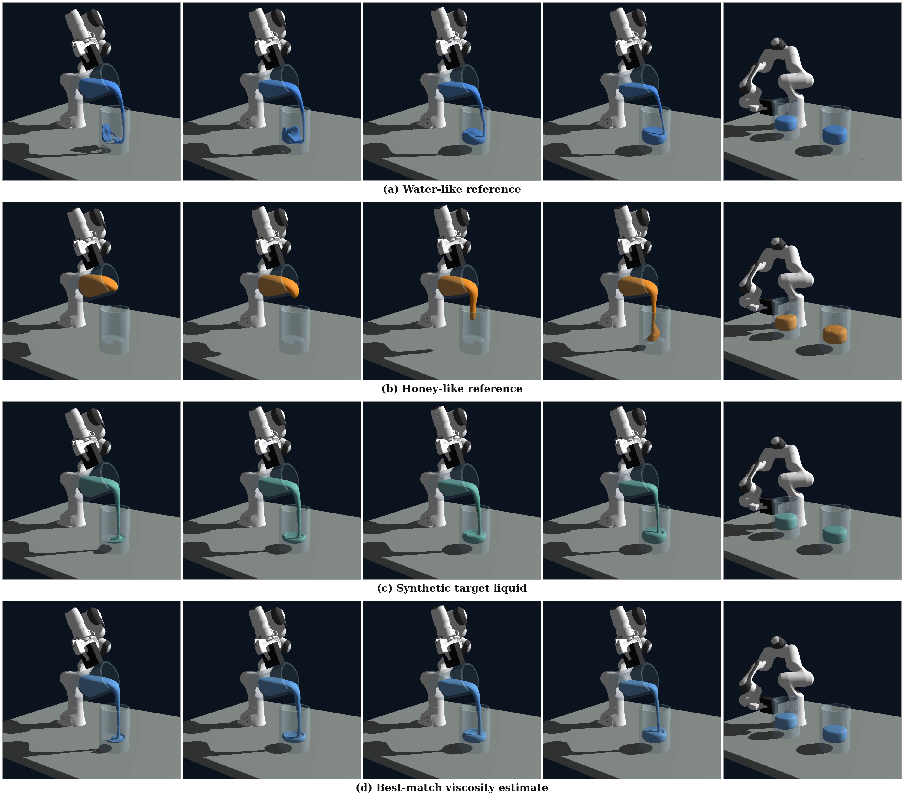
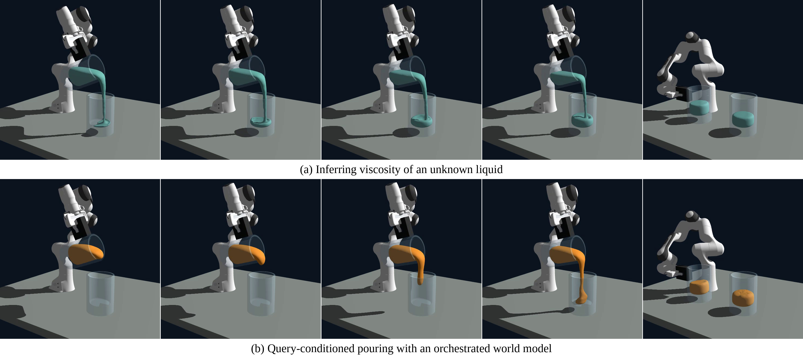
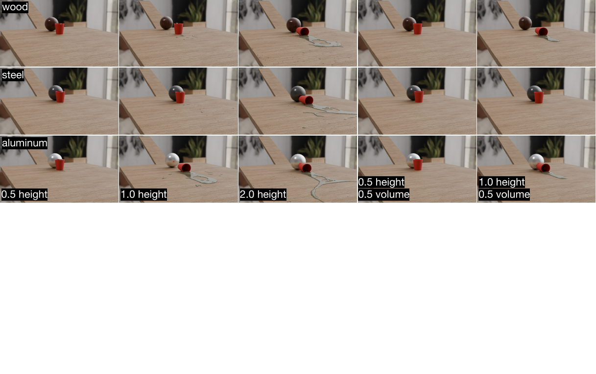

# Physically Viable World Models: A Case for Query-Conditioned Embodied AI

#

# 基本信息

- arXiv: [2605.30542](http://arxiv.org/abs/2605.30542v1)
- Authors: Adam J. Thorpe, Stepan Tretiakov, Cheng-Hsi Hsiao, Su Ann Low, Xingjian Li, Hassan Iqbal, Neel P. Bhatt, Ufuk Topcu, Krishna Kumar
- Categories: cs.AI

#

# 研究问题

提出面向干预查询的物理可行世界模型框架

#

# 任务与挑战

现有面向具身智能的世界模型大多以观测预测为训练目标，导致其在结构层面无法保证物理可行性。本文指出，仅追求视觉合理性的世界模型存在根本性缺陷：外观相同的场景可能对应截然不同的潜在物理系统（如质量、摩擦、粘度或恢复系数不同），从而在干预下产生完全相反的结果。作者通过固定视觉场景、系统性地改变潜在物理参数的受控基准测试，证明当前的视觉语言模型、视频扩散模型和基于潜变量的预测模型会推荐不可行动作、错误预测交互结果，甚至认证不安全行为。

针对上述问题，本文提出“物理可行世界模型”（Physically Viable World Models, PVWM）的核心范式：世界模型应围绕干预查询（intervention query）来构建，识别并保留回答该查询所需的最简物理抽象，而非盲目追求对世界最详尽的还原。该框架将模型解耦为模块化组件，包括环境表征、潜状态与参数估计、动作规范、干预动力学以及查询级响应；并由一个自主编排器（orchestrator）根据查询选择兼容的解析、仿真、学习或混合转移模型进行动态组合。这种分解使模型具备可解释性、组件可验证性，且输出可针对查询进行审计。

实验部分系统性地暴露了现有三类模型的失效模式：在固定初始帧和详细文本提示下，LTX-2视频扩散模型生成的续帧在接触、流体和可变形体动力学上严重违背物理规律；GPT-5.5视觉语言模型虽能进行定性物理推理，但无法可靠预测由阈值决定的接触、倾倒或溢出结果；V-JEPA 2的潜空间预测模型在模型预测控制（MPC）中仅优化视觉潜变量相似度，生成在视觉上合理但在物理上不可行、且对材料属性不敏感的控制轨迹。相比之下，本文在斜坡-杯子碰撞、机器人倾倒（含粘度在线估计）和洪水道路卡车越障等场景中，展示了查询条件化抽象如何正确组合物理引擎（NVIDIA Newton、Genesis、MPM）以回答干预查询。

本文的意义在于为具身智能的世界模型提供了新的设计原则与可行性检验标准：正确的抽象不是最详细的世界模型，而是保留查询相关物理区分的最简模型。这一立场直接挑战了当前单纯通过扩大观测预测规模来提升世界模型能力的趋势，强调物理结构必须是显式构造而非涌现属性。对于从事基于世界模型的策略学习、机器人操作与规划、以及sim-to-real迁移的研究者而言，该框架为构建可解释、可验证且物理一致的动态模型提供了关键的理论基础和实践路径。

#

# 核心 Insight

这篇论文的核心价值需要结合原文继续复查。当前 fallback 笔记保留了日报分析、DeepResearch 草稿和已筛选图表，避免自动流程中断。

#

# 方法与公式

#

## 第一模块：一分钟核心速写

1. **论文领域**：WorldModel

2. **TL;DR**：作者提出了一种基于**查询条件化物理抽象（query-conditioned physical abstraction）**的**物理可行世界模型框架（Physically Viable World Models, PVWM）**，以解决现有观测预测型世界模型（VLM、视频扩散、潜在预测模型）在具身干预查询下产生**视觉合理但物理错误**推演的结构性失败问题，并在受控物理模拟基准（刚性体/可变形体/刚液耦合/接触推挤/粘度倾倒）上系统暴露了三类主流模型的物理不可行性。

3. **研究动机**：现存方案最大的痛点是**观测预测目标与物理干预推理的结构性错配**——训练模型去预测像素或潜在表征，无法保证模型掌握了决定干预结果的潜在物理变量（质量、摩擦、粘度、恢复系数等）。不同物理系统可以看起来一样，但在干预下行为完全不同。本文的切入点极其巧妙：**不追求最详细的世界模型，而是围绕“干预查询”构建最简单的物理抽象**，只保留回答该查询所必需的物理区别。

   **核心机制**：将世界模型解耦为**模块化组件**（环境表示、潜在状态与参数估计、动作规范、干预动力学、约束、查询级响应），并通过一个**编排器（Orchestrator）**自动识别查询所需的物理抽象，动态组装兼容的解析/数值/学习/混合组件，确保动力学保留决定干预结果的结构。

4. **关键数据**：
   - **最能证明其有效性的结果**：论文通过固定视觉外观、仅改变潜在物理参数的受控实验，系统暴露了三类模型的失败：
     - **GPT-5.5（VLM）**：在静态图像预测中，即使提供高上下文提示（明确材质、释放条件），仍无法一致预测单果冻墙倾倒、双果冻墙滑动、水杯倾倒等阈值化结果；反事实提示虽能改善定性趋势，但无法确定性地解决“是否发生”的阈值问题。
     - **LTX-2（视频扩散）**：在球-杯碰撞和球-双果冻墙碰撞中，生成的视频与Newton物理引擎参考轨迹严重不符，接触动力学、流体行为不稳定且违背物理约束。
     - **V-JEPA 2-AC（潜在预测控制）**：在机器人推墙任务中，以潜在视觉相似性为目标的MPC规划，在高/低推点及木/混凝土材料变化下，生成的轨迹与真实物理展开不一致，无法保证力可行性或材料感知。
     - **理由**：这些结果共同证明了“视觉合理性≠物理可行性”，且失败是跨架构的、结构性的。

   - **存疑的试验结果**：
     - 本文本质上是**立场/概念论文（position paper）**，其正面演示（斜坡-杯子倾倒查询、粘度估计与重新规划、洪水道路驾驶）仅为**概念验证（proof-of-concept）**，缺乏与端到端基线的**定量对比指标**（如任务成功率、预测误差、规划可行率）。
     - V-JEPA 2和LTX-2的实验以**定性图像/视频对比**为主，未报告定量误差度量（如状态MSE、接触力误差、长期轨迹偏差），难以严格量化其失败程度。
     - 倾倒任务中的贝叶斯优化粘度估计和洪水道路驾驶中的MPM流体模拟，未展示在真实机器人或真实场景上的迁移验证，仅停留在模拟器闭环内。

---

#

## 第二模块：核心架构解释

本文提出的并非单一神经网络架构，而是一个**查询驱动的模块化世界模型构造框架**。其核心思想是：世界模型不应是固定的端到端预测器，而应根据干预查询动态组装。

**整体流程**：

1. **干预查询输入**：查询定义了干预类型（如“倾倒半杯水”）、期望结果（目标体积、安全边界）和响应形式（轨迹、动作、验证证书）。
2. **编排器（Orchestrator）解析查询**：识别回答该查询所需的最小物理抽象——包括必须表示的变量（如粘度、质量、接触几何）、动力学机制（刚体/SPH/MPM）、约束和输出格式。
3. **感知与参数估计**：从传感器观测中恢复查询相关的物理变量；对无法从被动观测识别的潜在量（如摩擦、粘度），触发估计或主动探查。
4. **动作规范**：在选定的状态变量空间中定义可接受的干预。
5. **动力学与约束组装**：根据查询选择解析公式、数值求解器、学习代理或混合模型，确保保留干预结果所依赖的物理结构。
6. **查询级响应生成**：执行推演并返回查询所需的特定输出（如可行动作集、参数估计、安全证书），而非通用视频或像素预测。
7. **兼容性与审计**：检查表示、动作、动力学、约束、输出是否支持同一抽象；若信息不足，返回条件响应或不确定性。

**Python 风格伪代码**：

```python
class ComponentLibrary:
    """模块化组件库：包含感知、动力学、约束、动作规范等可插拔组件"""
    def __init__(self):
        self.perception = PerceptionModule()
        self.dynamics_engines = {
            "analytic": AnalyticDynamics(),
            "sph": SPHFluidSolver(),
            "mpm": MPMSolver(),
            "learned": LearnedSurrogate()
        }
        self.action_specs = ActionSpecLibrary()
        self.constraints = ConstraintLibrary()

class Orchestrator:
    """编排器：根据查询选择抽象并组装模型"""
    def select_abstraction(self, query, scene_context):
        

# 解析查询，确定所需变量、动力学机制、约束和响应类型

        abstraction = {
            "variables": query.required_variables,       

# e.g., [viscosity, mass, geometry]

            "dynamics_regime": query.dynamics_type,        

# e.g., "rigid_fluid_coupled"

            "constraints": query.safety_constraints,
            "response_type": query.response_format         

# e.g., "trajectory", "certificate"

        }
        return abstraction
    
    def verify_compatibility(self, state, action_spec, dynamics, constraints):
        

# 检查动作是否作用于已表示的变量，动力学是否覆盖查询所需机制

        return action_space.acts_on(state.variables) and \
               dynamics.preserves(constraints.invariants)

class PhysicallyViableWorldModel:
    def __init__(self, component_library):
        self.lib = component_library
        self.orchestrator = Orchestrator()
    
    def answer(self, query, observation):
        

# Step 1: 编排器确定最小物理抽象

        abstraction = self.orchestrator.select_abstraction(query, observation)
        
        

# Step 2: 感知与潜在参数估计

        state, latent_params = self.lib.perception.estimate(
            observation,
            target_vars=abstraction["variables"]
        )
        
        

# Step 3: 若潜在量不可识别，返回条件响应或启动主动探查

        if latent_params.uncertainty_too_high():
            return ConditionalResponse(
                condition="needs_probing",
                uncertainty=latent_params
            )
        
        

# Step 4: 动作规范

        action_space = self.lib.action_specs.get(query.action_type, state)
        
        

# Step 5: 组装动力学与约束

        dynamics = self.lib.dynamics_engines[abstraction["dynamics_regime"]]
        constraints = self.lib.constraints.get(abstraction["constraints"])
        
        

# Step 6: 兼容性检查

        if not self.orchestrator.verify_compatibility(
            state, action_space, dynamics, constraints
        ):
            raise CompatibilityError("组件抽象不一致")
        
        

# Step 7: 干预推演

        rollout = dynamics.evolve(
            state=state,
            params=latent_params,
            actions=action_space,
            constraints=constraints
        )
        
        

# Step 8: 查询级响应（非像素预测）

        response = query.formulate_response(rollout)
        
        

# Step 9: 审计与可解释性输出

        return AuditableResponse(
            answer=response,
            abstraction_used=abstraction,
            assumptions=latent_params.assumptions,
            verified_constraints=constraints.checked
        )
```

---

#

## 第三模块：核心学术问答

Q1: 这篇论文试图解决什么核心问题？

A1: 这篇论文试图解决现有观测预测型世界模型在具身智能干预查询下的**结构性失败**问题。具体而言，当前以预测未来观测（像素、潜在表征）为目标的世界模型（包括VLM、视频扩散模型和潜在预测模型）能够生成视觉合理的推演，但由于未显式表示决定干预结果的潜在物理变量（如质量、摩擦、粘度、恢复系数、接触状态），它们在不同物理系统产生相同观测时无法区分，从而在规划、控制和安全性验证中推荐不可行动作、错误预测交互结果或认证不安全行为。

Q2: 作者提出的核心解决方案（创新点）是什么？

A2: 作者提出的核心解决方案是**查询条件化的物理可行世界模型（Physically Viable World Models）**。其本质创新在于：
- **查询驱动的抽象选择**：不以最大化视觉逼真度或模型细节为目标，而是围绕给定的干预查询构建**最简单的物理抽象**，仅保留能改变查询答案的物理区别。
- **模块化与可组合性**：将世界模型解耦为环境表示、潜在状态/参数估计、动作规范、干预动力学、约束和查询级响应等组件，允许解析、数值、学习或混合动力学的灵活组合。
- **编排器（Orchestrator）机制**：引入一个自动化的抽象选择与组件组装机制，确保表示、动作、动力学和输出之间的兼容性，并使模型具备可解释性、可验证性和可审计性。

Q3: 实验设计的关键支撑（或巧妙之处/数据集特点）是什么？

A3: 实验设计的核心巧妙之处在于**受控的物理参数隔离基准测试**。作者固定场景的视觉外观、几何和相机位姿，仅系统性地改变潜在物理参数，从而严格分离“视觉相似性”与“物理正确性”。具体包括：
- **模拟套件**：使用NVIDIA Newton（刚体/可变形体/机器人接触）和Genesis（SPH流体/刚液耦合）生成物理参考轨迹。
- **五类场景**：斜坡-塔刚性碰撞（密度/恢复系数变化）、可变形果冻墙交互、斜坡-液体填充杯冲击、Franka机器人推墙（接触高度/摩擦变化）、机器人臂倾倒（水/蜂蜜/合成粘度变化）。
- **三类模型测试**：GPT-5.5（静态VLM预测）、LTX-2（视频扩散生成）、V-JEPA 2-AC（动作条件潜在预测+MPC控制），覆盖了从语言推理到像素生成再到隐空间规划的完整谱系。

Q4: 这篇论文最显著的贡献点（Top 3）是什么？

A4:
- **贡献1**：从结构上论证了观测预测目标与具身干预推理之间的根本性矛盾，提出**物理可行性应取代视觉合理性**作为世界模型的核心评价标准。
- **贡献2**：设计并开源了一套受控基准测试，系统性地暴露了三类主流模型家族（VLM、视频扩散、潜在预测控制）在潜在物理变化下的失败模式，证明了这些失败是跨架构的、结构性的。
- **贡献3**：提出了一个模块化的查询条件化世界模型设计框架和编排器规范，为构建可解释、可验证、可审计的具身世界模型提供了明确的设计原则与可行性检验标准。

Q5: 这项工作在哪些相关研究的基础上做了推进？（列举1-2个最核心的前置工作即可）

A5:
- **前置工作1**：**观测预测型潜在世界模型**（如Ha & Schmidhuber 2018的World Models，以及Hafner等人的Dreamer系列）。这些工作学习了用于预测和规划的潜在动态模型，但其潜在状态优化目标是重构或预测观测，不一定对应物理状态变量，因此在干预查询下缺乏物理保证。本文推进之处在于明确指出了这一结构性缺陷，并提出以查询条件化物理抽象替代端到端观测预测。
- **前置工作2**：**物理信息神经网络与可微分/混合模拟器**（如Raissi et al. 2019的PINNs、DiffTaichi、GradSim等）。这些方法尝试将物理结构融入学习系统，但通常作为软正则化或需要预定义变量和动力学。本文推进之处在于提出了一个更高层次的**组合框架**，允许在查询驱动下动态选择并耦合解析、数值和学习组件，而非依赖单一固定模型。

Q6: 客观评价：这篇论文的局限性、漏洞或"未讲明的故事"是什么？对后续科研有何启发？

A6: 这篇论文的局限性主要体现在以下方面：
- **局限性1：概念验证有余，系统实现不足**。本文本质上是立场论文，提出的编排器框架尚未实现为可自动运行的端到端系统。文中正面演示（倾倒粘度估计、洪水道路驾驶）仅为手工构造的示例，缺乏大规模定量实验和与端到端基线的严格对比指标（如成功率、鲁棒性统计）。
- **局限性2：可识别性（identifiability）问题未根本解决**。作者承认质量、摩擦、粘度等潜在量可能无法从被动观测中识别，需要主动交互或条件响应，但未提供系统性的主动学习或信息获取算法，也未量化在部分可识别条件下的决策风险边界。
- **局限性3：模块化兼容性与计算成本未展开**。虽然框架主张动态组装解析/数值/学习组件，但不同组件之间的接口标准化、实时兼容性检查、以及混合求解的计算开销在实际机器人系统中的可行性尚未论证。

对后续科研的启发：
- **启发1**：未来工作应聚焦于**查询驱动的自动抽象选择算法**，使编排器能够根据任务描述和场景上下文自动推断所需物理变量和动力学机制，而非依赖人工指定。
- **启发2**：需要发展**主动物理参数估计**与**不确定性量化**方法，将世界模型与在线系统辨识、自适应控制和鲁棒优化结合，在信息不足时明确请求交互或返回安全保守的决策。
- **启发3**：应探索**结构化物理引擎与大规模学习模型的动态耦合接口**，例如通过可微分模拟器作为框架中的“动力学插件”，并建立相应的训练与验证协议，使学习模型真正服务于物理结构而非替代它。

#

# 贡献拆解

- 关键术语：Query-Conditioned Abstraction, Physically Viable World Models, Intervention Queries, Orchestrator, Latent Physics
- 加权评分：4.15/5.0

#

# 关键图表解读



*该图是论文核心方法架构图，直观对比了传统 Visual World Model 产生物理不可行预测（Incorrect Prediction）与本文提出的 Query-Conditioned Physically Viable World Model（Correct Prediction），直接解释了“为何需要物理可行世界模型”以及 Orchestrator 的作用，是理解全文 insight 的关键。*



*该图展示了机器人在不同粘度液体（水、蜂蜜、合成目标液体）下的倾倒过程，以及最佳粘度估计结果，是论文主实验（液体参数估计）的核心可视化，能支撑“模型可识别潜在物理参数”这一关键结论。*



*该图直接对应论文标题中的 Query-Conditioned，展示了未知液体粘度推断与基于编排世界模型的查询条件倾倒，体现方法在干预查询下的应用能力，是主实验的重要组成部分。*



*该图通过固定场景结构、改变球的材质（wood/steel/aluminum）与干预参数（height/volume），展示了相同可见场景下潜在物理变化导致的不同结果，是支撑论文核心论点“controlled benchmarks that fix the visible scene while varying latent physics”的关键消融/基准可视化。*

#

# 实验与消融

请优先核对主结果表、消融实验和真实/仿真任务设置；若图表已选中，应结合上方图片逐项复查。

#

# 局限性

当前自动精读未能成功调用完整图文生成模型，因此局限性需要结合原文实验设置进一步人工确认。

#

# 个人研究判断

若该论文与 World Models assisting Embodied AI、VLA、robot policy 或 sim-to-real 强相关，建议进入人工精读队列。
